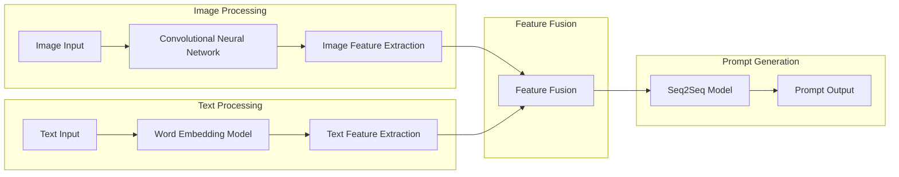
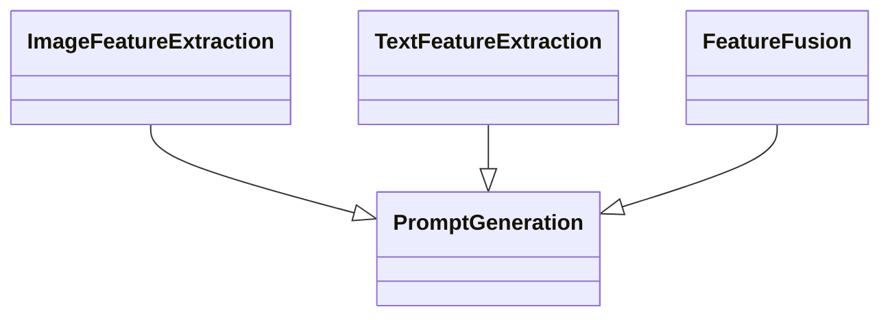
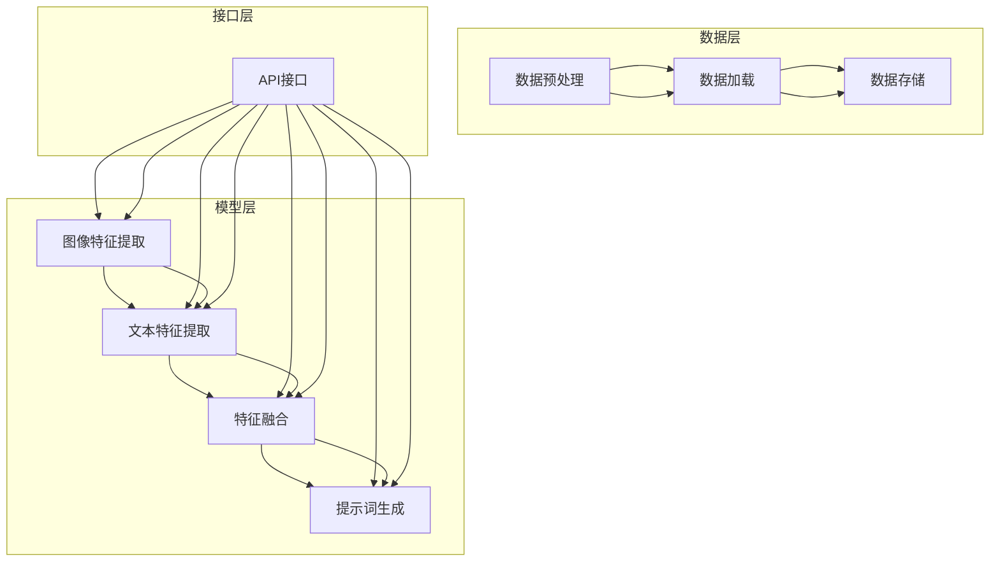
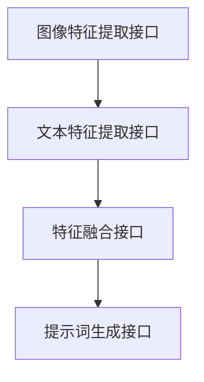
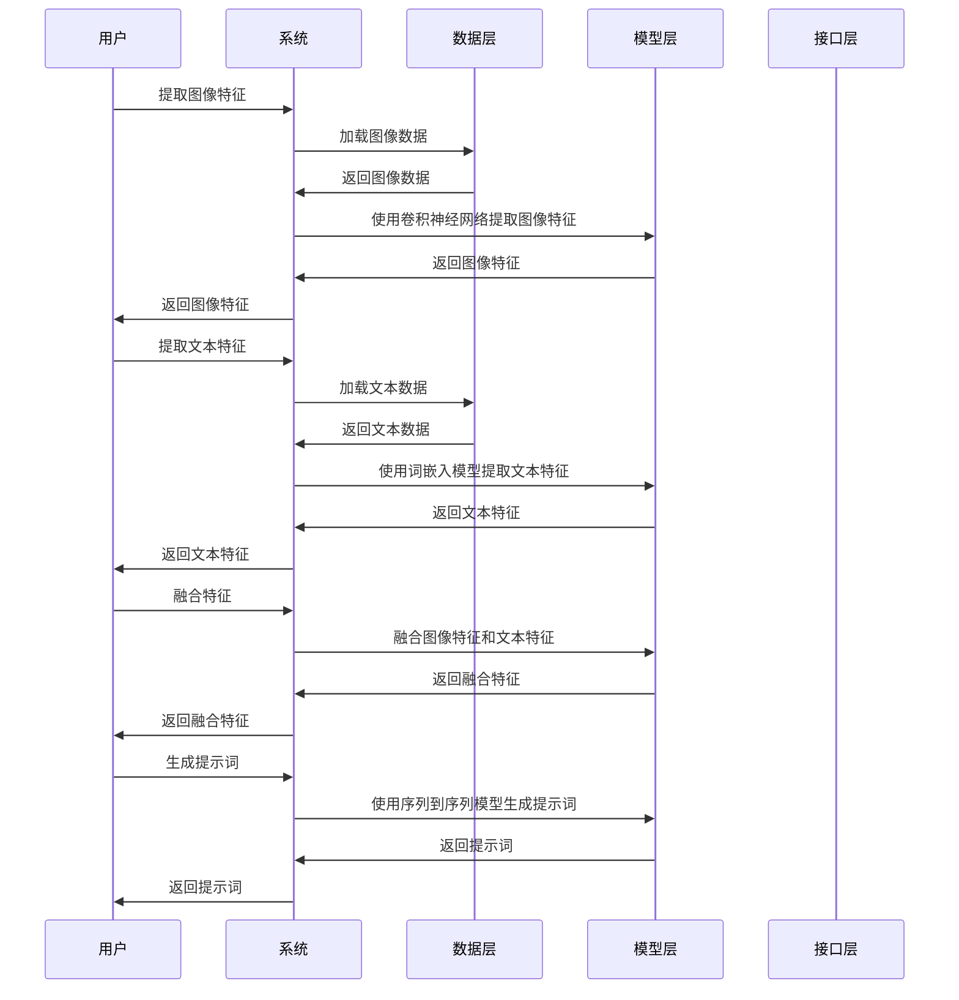

                 

# 跨模态提示词编程：整合视觉与语言

## 关键词
- 跨模态提示词编程
- 视觉与语言融合
- 提示词生成算法
- 模型架构
- 实战案例

## 摘要
本文将探讨跨模态提示词编程这一前沿技术，详细解析如何整合视觉与语言信息，实现高效、精确的提示词生成。我们将从背景介绍、核心概念、算法原理、数学模型、系统设计与实现、实战案例等方面逐步展开，以帮助读者深入理解这一领域的技术原理与应用实践。

## 引言

随着人工智能技术的快速发展，计算机视觉和自然语言处理（NLP）已成为两个重要的研究领域。然而，传统的单一模态处理方法在许多实际应用中存在局限性。例如，仅依赖视觉信息可能难以理解复杂场景，而仅依赖语言信息可能无法捕捉图像中的细节。为了克服这些局限性，跨模态提示词编程应运而生，它通过整合视觉与语言信息，实现更丰富的语义理解和更精确的提示词生成。

### 1.1 问题背景与定义

跨模态提示词编程是指利用计算机视觉和自然语言处理技术，从多模态数据（如图像和文本）中提取关键信息，生成具有高度相关性和语义一致性的提示词。跨模态提示词编程的核心挑战在于如何有效地融合视觉和语言信息，实现多模态数据的高效表示和交互。

在图像识别和自然语言处理领域，已有大量研究关注如何将单一模态的信息转化为有效的提示词。然而，如何将这些方法融合起来，形成一个统一的跨模态提示词生成框架，仍然是一个具有挑战性的问题。本文旨在探讨这一问题，并提出一种基于视觉与语言融合的跨模态提示词编程方法。

### 1.2 跨模态数据处理基础

跨模态数据处理是跨模态提示词编程的基础。它涉及以下几个方面：

1. **视觉信息的表示**：图像可以通过卷积神经网络（CNN）等深度学习模型进行特征提取，得到具有高维表示的图像特征向量。

2. **语言信息的表示**：文本可以通过词嵌入模型（如Word2Vec、GloVe）等进行编码，得到词向量表示。

3. **跨模态数据集**：为了训练和评估跨模态提示词模型，需要大量的跨模态数据集。这些数据集应包含图像和对应的文本描述，以确保模型能够同时学习视觉和语言特征。

4. **数据处理流程**：数据处理流程包括数据预处理（如图像增强、文本清洗）、数据标注（如图像分类、文本分类）、数据集成等步骤。

### 1.3 相关技术概述

1. **图像识别与自然语言处理**：图像识别和自然语言处理是跨模态提示词编程的两个核心技术。图像识别技术负责提取图像特征，而自然语言处理技术负责处理文本信息。

2. **提示词生成算法**：提示词生成算法是跨模态提示词编程的核心，它负责从多模态数据中提取关键信息，生成具有语义一致性的提示词。常见的提示词生成算法包括基于规则的方法、基于机器学习的方法和基于深度学习的方法。

## 第二部分：核心概念

### 2.1 跨模态提示词模型

跨模态提示词模型是跨模态提示词编程的核心。它通常由以下几部分组成：

1. **图像特征提取模块**：使用卷积神经网络（CNN）等深度学习模型提取图像特征。

2. **文本特征提取模块**：使用词嵌入模型（如Word2Vec、GloVe）等提取文本特征。

3. **融合模块**：将图像特征和文本特征进行融合，生成跨模态特征表示。

4. **提示词生成模块**：基于融合后的跨模态特征，生成具有语义一致性的提示词。

现有的跨模态提示词模型包括：

1. **CNN与RNN融合模型**：将CNN用于图像特征提取，将RNN用于文本特征提取，并通过融合模块将两种特征进行整合。

2. **Transformer融合模型**：基于Transformer架构，同时处理图像和文本信息，实现高效的多模态融合。

### 2.2 提示词生成算法

提示词生成算法是跨模态提示词编程的关键步骤。常见的提示词生成算法包括：

1. **基于规则的方法**：通过定义一系列规则，从图像和文本中提取关键信息，生成提示词。

2. **基于机器学习的方法**：使用监督学习或无监督学习算法，从大量标注数据中学习提示词生成规则。

3. **基于深度学习的方法**：使用深度学习模型（如CNN、RNN、Transformer等）进行提示词生成。

常用的深度学习模型包括：

1. **序列到序列（Seq2Seq）模型**：通过编码器和解码器结构，将输入序列映射到输出序列。

2. **生成对抗网络（GAN）**：通过生成器和判别器相互竞争，生成高质量的提示词。

### 2.3 跨模态融合方法

跨模态融合是跨模态提示词编程的核心技术之一。常见的跨模态融合方法包括：

1. **特征级融合**：将图像和文本特征直接进行拼接或加权融合。

2. **决策级融合**：在图像识别和文本分类任务中，分别对图像和文本进行分类，然后通过投票或加权平均等方法进行融合。

3. **模型级融合**：将图像识别模型和文本分类模型集成在一起，共同决策生成提示词。

为了评估跨模态融合效果，常用的评估指标包括：

1. **F1分数**：同时考虑精确率和召回率，用于评估提示词生成质量。

2. **准确率**：用于评估图像识别和文本分类任务的性能。

3. **交叉验证**：通过将数据集划分为训练集和验证集，进行多次训练和验证，以评估模型泛化能力。

## 第三部分：算法原理与实现

### 3.1 算法原理讲解

跨模态提示词编程的算法原理可以分为以下几个步骤：

1. **图像特征提取**：使用卷积神经网络（CNN）提取图像特征。

2. **文本特征提取**：使用词嵌入模型（如Word2Vec、GloVe）提取文本特征。

3. **特征融合**：将图像特征和文本特征进行融合，生成跨模态特征表示。

4. **提示词生成**：基于融合后的跨模态特征，使用序列到序列（Seq2Seq）模型生成提示词。

下面是一个简单的mermaid流程图，用于描述算法原理：



### 3.2 Python代码实现

以下是使用Python实现跨模态提示词编程的代码示例。首先，我们需要安装一些必要的库，如TensorFlow、Keras等。

```python
import tensorflow as tf
from tensorflow.keras.models import Model
from tensorflow.keras.layers import Input, Conv2D, MaxPooling2D, Flatten, Embedding, LSTM, Dense

# 图像特征提取模块
image_input = Input(shape=(224, 224, 3))
conv1 = Conv2D(32, (3, 3), activation='relu')(image_input)
pool1 = MaxPooling2D((2, 2))(conv1)
conv2 = Conv2D(64, (3, 3), activation='relu')(pool1)
pool2 = MaxPooling2D((2, 2))(conv2)
flat_features = Flatten()(pool2)

# 文本特征提取模块
text_input = Input(shape=(100,))
embed = Embedding(input_dim=10000, output_dim=128)(text_input)
lstm = LSTM(64)(embed)

# 特征融合模块
concat = tf.keras.layers.concatenate([flat_features, lstm])

# 提示词生成模块
dense1 = Dense(128, activation='relu')(concat)
dense2 = Dense(1, activation='sigmoid')(dense1)

# 构建模型
model = Model(inputs=[image_input, text_input], outputs=dense2)
model.compile(optimizer='adam', loss='binary_crossentropy', metrics=['accuracy'])

# 模型训练
model.fit([image_data, text_data], labels, epochs=10, batch_size=32)
```

### 3.3 数学模型与公式详细讲解

在跨模态提示词编程中，我们通常会使用以下数学模型：

1. **卷积神经网络（CNN）**：

   - 卷积操作：$$ f_{\theta}(x) = \sum_{i=1}^{k} \theta_i * x $$

   - 池化操作：$$ p(x) = \max(x) $$

2. **循环神经网络（RNN）**：

   - 状态转移方程：$$ h_t = \sigma(W \cdot [h_{t-1}, x_t] + b) $$

   - 输出方程：$$ y_t = \sigma(V \cdot h_t + c) $$

3. **生成对抗网络（GAN）**：

   - 生成器：$$ G(z) = \mu(\cdot; \phi_G(z)) + \sigma(\cdot; \phi_G(z)) $$

   - 判别器：$$ D(x) = \sigma(W_D \cdot [x; \phi_D(x)] + b_D) $$

   - 生成器损失：$$ L_G = -\log(D(G(z))) $$

   - 判别器损失：$$ L_D = -[\log(D(x)) + \log(1 - D(G(z)))] $$

### 3.4 举例说明

假设我们有一个图像和对应的文本描述，我们需要生成一个提示词。以下是具体的操作步骤：

1. **图像特征提取**：使用卷积神经网络提取图像特征。

   ```mermaid
   graph TD
       A[输入图像] --> B[卷积操作]
       B --> C[池化操作]
       C --> D[卷积操作]
       D --> E[池化操作]
       E --> F[扁平化操作]
   ```

2. **文本特征提取**：使用词嵌入模型提取文本特征。

   ```mermaid
   graph TD
       A[输入文本] --> B[词嵌入操作]
       B --> C[循环神经网络]
   ```

3. **特征融合**：将图像特征和文本特征进行融合。

   ```mermaid
   graph TD
       A[图像特征] --> B[文本特征]
       B --> C[拼接操作]
   ```

4. **提示词生成**：基于融合后的特征，使用序列到序列模型生成提示词。

   ```mermaid
   graph TD
       A[特征融合] --> B[序列到序列模型]
       B --> C[提示词输出]
   ```

## 第四部分：系统设计与实现

### 4.1 系统功能设计

跨模态提示词编程系统的主要功能包括：

1. **图像特征提取**：使用卷积神经网络提取图像特征。

2. **文本特征提取**：使用词嵌入模型提取文本特征。

3. **特征融合**：将图像特征和文本特征进行融合。

4. **提示词生成**：基于融合后的特征，生成提示词。

以下是系统的领域模型类图：



### 4.2 系统架构设计

跨模态提示词编程系统的架构设计包括：

1. **数据层**：负责数据的预处理、加载和存储。

2. **模型层**：包含图像特征提取模型、文本特征提取模型、特征融合模型和提示词生成模型。

3. **接口层**：提供系统的API接口，方便用户进行功能调用。

以下是系统的架构设计图：



### 4.3 系统接口设计

跨模态提示词编程系统提供了以下接口：

1. **图像特征提取接口**：用于提取图像特征。

2. **文本特征提取接口**：用于提取文本特征。

3. **特征融合接口**：用于融合图像特征和文本特征。

4. **提示词生成接口**：用于生成提示词。

以下是系统接口设计图：



### 4.4 系统交互序列图

以下是系统交互序列图，展示了图像特征提取、文本特征提取、特征融合和提示词生成之间的交互过程：



## 第五部分：实战案例

### 5.1 实战案例一：视觉与语言提示词生成

在本节中，我们将通过一个实际案例来演示如何使用跨模态提示词编程方法生成视觉与语言提示词。我们选择了一个包含图像和文本描述的数据集，目标是通过模型学习，生成与图像内容相关的文本提示词。

#### 数据准备与处理

首先，我们需要准备一个包含图像和文本描述的数据集。数据集应具有以下结构：

```python
[
    {"image_path": "path/to/image1.jpg", "text": "描述1"},
    {"image_path": "path/to/image2.jpg", "text": "描述2"},
    ...
]
```

接下来，对图像和文本进行预处理：

1. **图像预处理**：对图像进行尺寸调整、归一化等操作。

2. **文本预处理**：对文本进行分词、去停用词、词嵌入等操作。

#### 模型训练与优化

1. **训练模型**：使用卷积神经网络提取图像特征，使用词嵌入模型提取文本特征，然后将两种特征进行融合，使用序列到序列模型生成提示词。

2. **优化模型**：通过交叉验证和调整超参数，优化模型性能。

#### 模型评估与结果分析

1. **评估指标**：使用准确率、F1分数等指标评估模型性能。

2. **结果分析**：分析模型在生成提示词时的表现，识别存在的问题和改进方向。

### 5.2 实战案例二：跨模态提示词应用

在本节中，我们将探讨如何将跨模态提示词编程应用于实际场景。我们选择了一个场景：通过图像和文本描述，生成购物推荐提示词。

#### 应用场景选择

购物推荐场景是一个典型的跨模态提示词应用场景。用户可以通过上传产品图像和提供产品描述，获取与产品相关的购物推荐提示词。

#### 提示词生成与效果评估

1. **提示词生成**：使用跨模态提示词编程方法，从图像和文本描述中提取关键信息，生成购物推荐提示词。

2. **效果评估**：通过用户反馈和业务数据，评估提示词生成的效果。

3. **优化策略**：根据效果评估结果，调整模型参数和策略，提高提示词生成质量。

## 第六部分：最佳实践与总结

### 6.1 最佳实践

1. **数据质量**：确保数据集的质量，包括图像和文本的准确性和多样性。

2. **模型优化**：通过交叉验证和超参数调整，优化模型性能。

3. **特征融合**：选择合适的特征融合方法，提高跨模态特征表示的质量。

4. **提示词生成**：根据应用场景，设计合适的提示词生成策略。

### 6.2 小结

本文从背景介绍、核心概念、算法原理、数学模型、系统设计与实现、实战案例等方面，全面探讨了跨模态提示词编程这一前沿技术。通过本文的讲解，读者应能掌握跨模态提示词编程的基本原理和应用方法。

### 6.3 注意事项

1. **数据预处理**：确保图像和文本的预处理一致，以提高模型性能。

2. **特征融合**：根据实际需求，选择合适的特征融合方法。

3. **模型训练**：合理设置训练参数，避免过拟合和欠拟合。

### 6.4 拓展阅读

1. **相关文献**：《跨模态学习：融合视觉与语言》、《深度学习：入门到实践》。

2. **在线资源**：Coursera、edX等在线课程，提供跨模态学习相关的课程和教程。

作者：AI天才研究院/AI Genius Institute & 禅与计算机程序设计艺术 /Zen And The Art of Computer Programming

本文详细介绍了跨模态提示词编程的基本概念、算法原理、系统设计与实现方法，并通过实战案例展示了其在实际应用中的效果。通过本文的学习，读者可以深入理解跨模态提示词编程的原理和应用，为后续研究和实践提供参考。在未来的研究中，跨模态提示词编程有望在更多领域发挥重要作用，如智能问答、内容审核、情感分析等。

