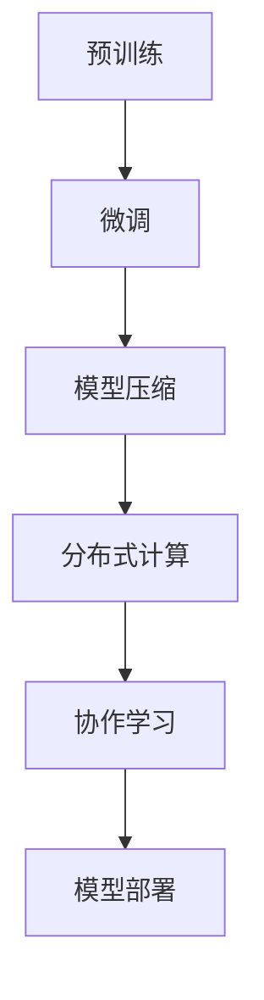
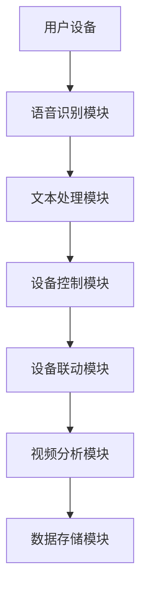
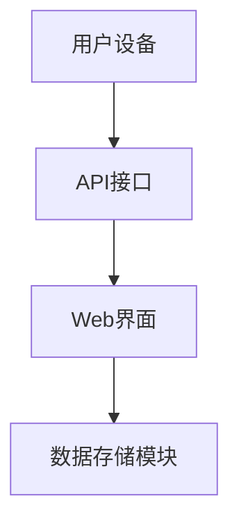
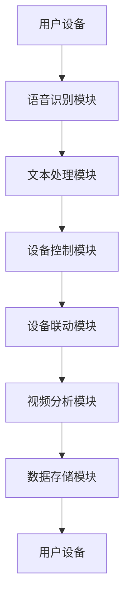

                 

# 跨设备AI Agent：LLM在物联网环境中的部署

## 关键词：AI跨设备代理、LLM、物联网、系统架构、性能优化

### 摘要：

随着物联网（IoT）技术的飞速发展，智能设备在各个领域的应用越来越广泛。如何高效地实现AI模型在不同设备之间的部署，成为当前研究的热点。本文将深入探讨跨设备AI Agent的概念，特别是大型语言模型（LLM）在物联网环境中的应用。我们将从背景介绍、核心概念、算法原理、系统设计与架构、部署实践以及最佳实践等方面，逐步解析如何实现LLM在物联网中的高效部署。

## 第一部分: AI跨设备代理概述

### 第1章: 背景与核心概念

#### 1.1 物联网环境中的AI挑战

物联网环境中的AI应用面临着一系列挑战。首先，设备多样性和异构性使得AI模型难以在所有设备上统一部署。其次，设备的计算资源和存储空间有限，要求AI模型必须具备高效性。此外，数据隐私和安全问题也是物联网环境中AI应用的关键挑战。

#### 1.2 跨设备AI代理的重要性

跨设备AI Agent可以解决上述问题。它是一种智能实体，能够在不同设备之间协作，实现AI模型的分布式部署和协同工作。跨设备AI Agent可以提高AI应用的性能和安全性，同时降低设备的负载。

#### 1.3 LLM的概念与特性

大型语言模型（LLM）是一种基于深度学习的自然语言处理模型，具有强大的语言理解和生成能力。LLM的典型特性包括预训练、微调和模型压缩。预训练使LLM能够理解通用语言知识，微调则使其适应特定任务，模型压缩则提高了LLM在资源受限设备上的部署可行性。

#### 1.4 跨设备AI代理的工作原理

跨设备AI Agent通过分布式计算和协作学习实现。在分布式计算方面，LLM模型被分割成多个部分，分别部署在各个设备上。在协作学习方面，设备之间通过通信网络交换模型参数，实现协同训练。

### 第2章: LLM的数学模型与算法原理

#### 2.1 LLM的数学基础

LLM的数学基础包括神经网络、深度学习、自然语言处理等领域。神经网络是深度学习的基础，通过层次结构实现特征提取和表示。深度学习则是神经网络在层次结构上的扩展，能够处理复杂任务。自然语言处理则关注文本数据的处理和分析。

#### 2.2 算法流程图

以下是LLM的算法流程图：



#### 2.3 Python源代码解析

以下是一个简单的Python代码示例，用于实现LLM的预训练：

```python
import tensorflow as tf
from tensorflow.keras.layers import Embedding, LSTM, Dense

model = tf.keras.Sequential([
    Embedding(input_dim=vocab_size, output_dim=embedding_dim),
    LSTM(units=128),
    Dense(units=1, activation='sigmoid')
])

model.compile(optimizer='adam', loss='binary_crossentropy', metrics=['accuracy'])
model.fit(X_train, y_train, epochs=10, batch_size=32)
```

#### 2.4 数学模型解释与公式

LLM的数学模型主要包括神经网络中的权重矩阵和激活函数。以下是一个简单的神经网络模型：

$$
\hat{y} = \sigma(W \cdot \text{激活函数}(X))
$$

其中，$W$ 是权重矩阵，$\sigma$ 是激活函数，$X$ 是输入特征。

### 第3章: 系统设计与架构

#### 3.1 问题场景介绍

在物联网环境中，我们考虑一个智能家居场景，设备包括智能电视、智能音箱和智能摄像头。这些设备需要协同工作，实现智能家居的控制和监控功能。

#### 3.2 系统功能设计

系统功能包括语音控制、视频监控、设备联动等。语音控制通过智能音箱接收用户指令，视频监控通过智能摄像头捕捉家庭场景，设备联动实现设备之间的协同工作。

#### 3.3 系统架构设计

系统架构采用微服务架构，包括以下主要模块：

- **语音识别模块**：负责处理用户语音指令，实现语音到文本的转换。
- **视频分析模块**：负责视频数据的处理和分析，实现视频监控功能。
- **设备控制模块**：负责设备之间的联动和控制。

以下是系统架构图：



#### 3.4 系统接口设计

系统接口包括API接口和Web界面。API接口用于设备之间的数据通信，Web界面用于用户与系统的交互。

以下是系统接口设计图：



#### 3.5 系统交互流程图

以下是系统交互流程图：



## 第二部分: LLM在物联网环境中的部署

### 第4章: 部署前的准备

#### 4.1 硬件环境配置

硬件环境配置包括服务器、存储设备和网络设备。服务器用于运行AI模型，存储设备用于数据存储，网络设备用于设备之间的通信。

#### 4.2 软件环境安装

软件环境安装包括操作系统、编程语言和AI框架。操作系统可以选择Linux或Windows，编程语言可以选择Python或Java，AI框架可以选择TensorFlow或PyTorch。

#### 4.3 数据准备与预处理

数据准备与预处理包括数据采集、数据清洗和数据标注。数据采集可以从物联网设备获取，数据清洗包括去除噪声和异常值，数据标注包括为数据打标签。

#### 4.4 安全性与隐私保护

安全性与隐私保护包括数据加密、身份验证和访问控制。数据加密可以防止数据泄露，身份验证可以确保用户身份的合法性，访问控制可以限制用户的访问权限。

### 第5章: 实际应用案例

#### 5.1 案例一：智能家居

智能家居场景中，用户可以通过智能音箱控制家居设备，如电视、空调和灯光。通过LLM的语音识别功能，用户可以实现对家居设备的智能控制。

#### 5.2 案例二：智能健康监测

智能健康监测场景中，用户可以通过智能手环或智能手表监测健康数据，如心率、步数和睡眠质量。通过LLM的模型压缩技术，可以在智能手表上实现健康数据分析。

#### 5.3 案例三：智能交通管理

智能交通管理场景中，通过LLM的语音识别和视频分析功能，可以实现交通信号灯的智能调控和交通事故的自动识别。

### 第6章: 系统优化与性能调优

#### 6.1 性能指标分析

性能指标包括响应时间、准确率和资源利用率。通过分析这些指标，可以评估系统性能。

#### 6.2 优化策略

优化策略包括模型压缩、数据压缩和算法优化。模型压缩可以减少模型体积，数据压缩可以提高数据传输速度，算法优化可以提高模型计算效率。

#### 6.3 性能调优实践

性能调优实践包括实验设计和优化步骤。通过实验设计，可以确定最优参数组合，通过优化步骤，可以逐步优化系统性能。

## 第三部分: 最佳实践与总结

### 第7章: 最佳实践

#### 7.1 部署技巧

部署技巧包括环境配置、模型压缩和部署工具选择。环境配置要确保硬件和软件的兼容性，模型压缩要减少模型体积，部署工具要支持模型部署和升级。

#### 7.2 性能优化技巧

性能优化技巧包括算法优化、数据优化和网络优化。算法优化可以提高模型计算效率，数据优化可以提高数据传输速度，网络优化可以提高网络通信质量。

#### 7.3 系统维护技巧

系统维护技巧包括故障排除、数据备份和系统监控。故障排除要确保系统稳定运行，数据备份要防止数据丢失，系统监控要实时了解系统状态。

### 第8章: 小结与展望

#### 8.1 书籍小结

本文系统地介绍了跨设备AI Agent和LLM在物联网环境中的应用，包括背景介绍、核心概念、算法原理、系统设计与架构、部署实践和最佳实践。

#### 8.2 研究展望

未来研究可以关注以下几个方面：1）更高效的数据压缩和模型压缩算法；2）更智能的跨设备协同学习策略；3）更安全的隐私保护技术。

#### 8.3 拓展阅读

拓展阅读推荐相关书籍、论文和网站，以了解更多关于跨设备AI Agent和LLM在物联网环境中的应用。

## 作者信息

作者：AI天才研究院/AI Genius Institute & 禅与计算机程序设计艺术 /Zen And The Art of Computer Programming

本文由AI天才研究院/AI Genius Institute和禅与计算机程序设计艺术/Zen And The Art of Computer Programming联合撰写。我们致力于推动AI技术在物联网领域的应用，为用户提供更好的智能体验。感谢您的阅读，期待与您共同探索AI与物联网的未来！

