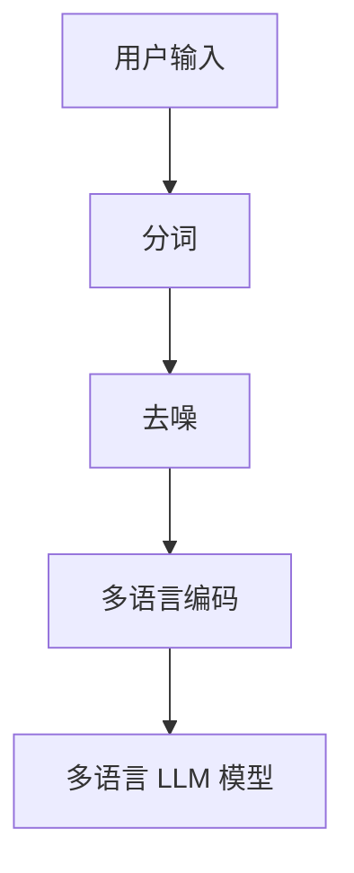
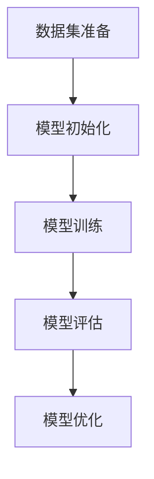
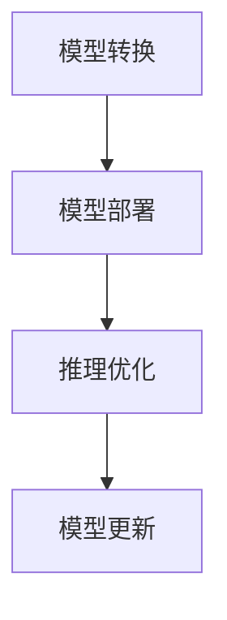
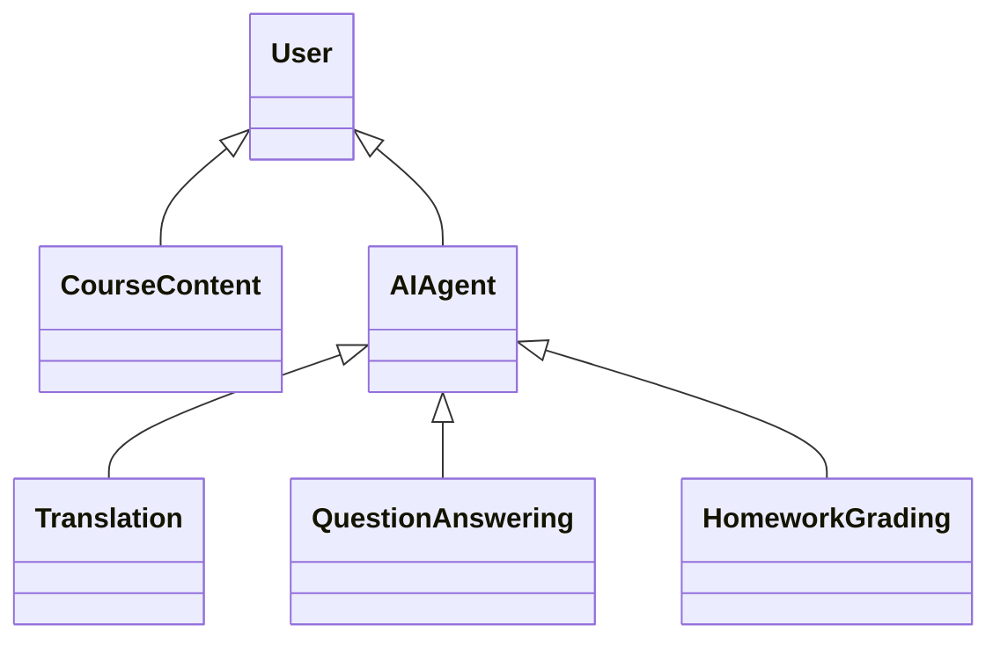
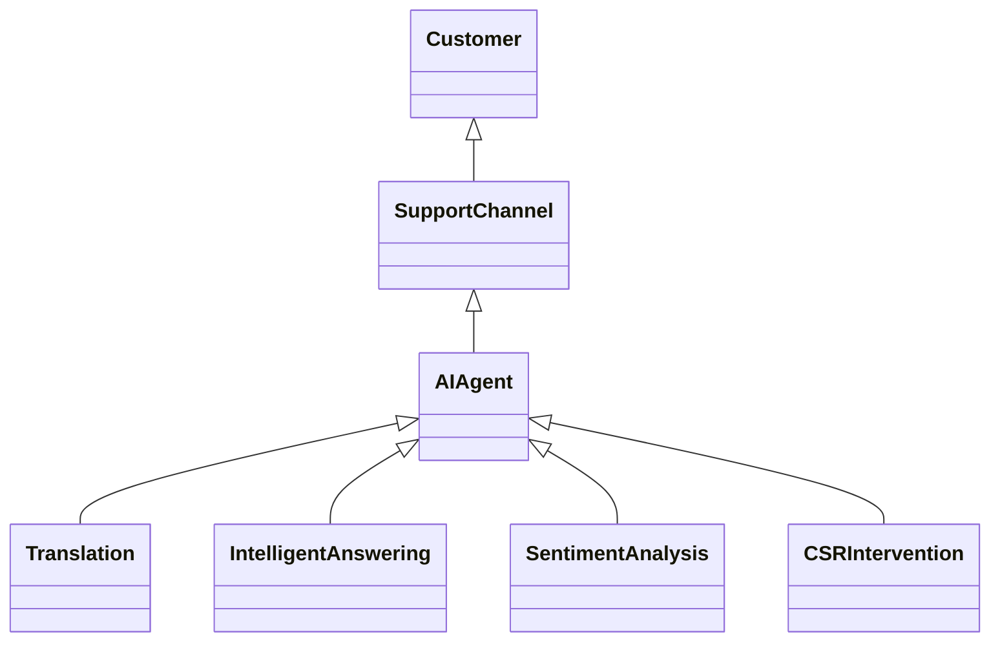
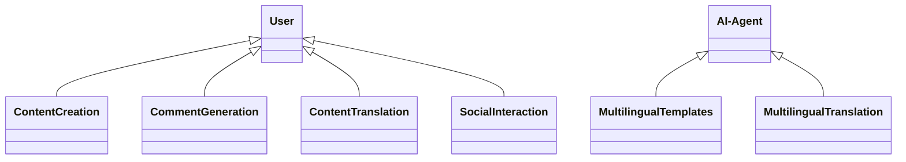

                 


# 跨语言 AI Agent：多语言 LLM 在国际化场景中的应用

## 关键词：跨语言 AI，多语言 LLM，国际化，应用实践，性能优化

### 摘要：
本文将探讨跨语言 AI Agent 在国际化场景中的应用，重点介绍多语言 Long Short-Term Memory（LLM）技术的原理与实现，分析其在不同应用场景中的性能评估与优化策略。通过具体的案例分析，展示跨语言 AI Agent 在在线教育、客户服务、社交媒体等领域的实践成果，为未来跨语言 AI 的发展提供参考。

## 目录大纲

### 第一部分: 问题背景与核心概念

#### 第1章: 跨语言 AI Agent 的时代背景与核心概念

##### 1.1 跨语言 AI Agent 的时代背景
1. 国际化趋势的加速
2. 跨语言沟通需求的上升
3. 人工智能技术在多语言处理领域的突破

##### 1.2 跨语言 AI Agent 的定义与核心概念
1. 跨语言 AI Agent 的定义
2. 跨语言 AI Agent 的工作原理
3. 跨语言 AI Agent 的关键特征

##### 1.3 跨语言 AI Agent 的应用场景
1. 在线教育
2. 客户服务
3. 跨文化商务
4. 国际化社交媒体

### 第二部分: 多语言 LLM 技术基础

#### 第2章: 多语言 LLM 的原理与技术基础

##### 2.1 多语言 LLM 的定义与特点
1. 多语言 LLM 的定义
2. 多语言 LLM 的主要特点
3. 多语言 LLM 与单语言 LLM 的对比

##### 2.2 多语言 LLM 的关键技术
1. 数据预处理
2. 模型架构
3. 模型训练策略
4. 模型优化与调整

##### 2.3 多语言 LLM 的应用领域
1. 语言翻译
2. 自然语言理解
3. 文本生成
4. 语音识别

### 第三部分: 多语言 LLM 在国际化场景中的应用实践

#### 第3章: 跨语言 AI Agent 的设计与实现

##### 3.1 跨语言 AI Agent 的整体架构设计
1. 系统需求分析
2. 系统功能模块划分
3. 系统架构设计

##### 3.2 多语言 LLM 在跨语言 AI Agent 中的应用
1. 数据处理模块
2. 模型训练与优化模块
3. 模型部署与推理模块

##### 3.3 跨语言 AI Agent 的应用案例分析
1. 案例一：在线教育平台
2. 案例二：跨国企业客户服务
3. 案例三：国际化社交媒体平台

#### 第4章: 跨语言 AI Agent 的性能评估与优化

##### 4.1 跨语言 AI Agent 的性能评估指标
1. 准确性
2. 响应时间
3. 用户满意度

##### 4.2 跨语言 AI Agent 的性能优化策略
1. 模型压缩与加速
2. 稳健性与泛化能力提升
3. 用户个性化服务

##### 4.3 跨语言 AI Agent 的未来发展趋势
1. 技术进展与趋势
2. 应用场景拓展
3. 法律法规与社会影响

#### 第5章: 跨语言 AI Agent 开发实战

##### 5.1 开发环境与工具准备
1. 硬件与软件需求
2. 开发工具与库
3. 数据集获取与处理

##### 5.2 跨语言 AI Agent 的实现步骤
1. 数据预处理
2. 模型训练
3. 模型评估与优化
4. 模型部署与接口设计

##### 5.3 实际案例分析与代码解读
1. 实际案例分析
2. 代码解读与分析
3. 项目总结与展望

#### 第6章: 跨语言 AI Agent 的最佳实践与注意事项

##### 6.1 最佳实践技巧
1. 数据质量的重要性
2. 模型调优经验
3. 系统性能优化策略

##### 6.2 注意事项与风险防范
1. 数据安全与隐私保护
2. 模型公正性与透明性
3. 技术依赖与风险评估

##### 6.3 拓展阅读
1. 跨语言 AI 领域的顶级论文与书籍推荐
2. 跨语言 AI Agent 在实际应用中的挑战与解决方案

---

### 第一部分：问题背景与核心概念

#### 1.1 跨语言 AI Agent 的时代背景

在全球化的背景下，国际化交流与合作日益频繁。随着互联网的普及，各种语言之间的沟通需求不断增加。然而，语言差异成为了阻碍国际交流的一大难题。为了解决这一问题，跨语言 AI Agent 的出现应运而生。

##### 1.1.1 国际化趋势的加速

全球化进程加速，跨国公司、国际组织、全球化电商平台等日益增多，对跨语言 AI Agent 的需求日益增长。例如，跨国企业的客服部门需要能够与全球各地的客户进行无障碍沟通，而国际学校和教育机构则需要为不同语言背景的学生提供个性化的教学服务。

##### 1.1.2 跨语言沟通需求的上升

随着跨境电商的兴起，消费者不再局限于本地市场，而是向全球市场扩展。这意味着电商企业需要能够提供多语言客服和翻译服务，以更好地满足全球消费者的需求。此外，国际旅游、留学、文化交流等领域的需求也推动了跨语言 AI Agent 的发展。

##### 1.1.3 人工智能技术在多语言处理领域的突破

近年来，人工智能技术在自然语言处理（NLP）领域的取得了显著的进展。特别是深度学习技术的应用，使得多语言 LLM（Long Short-Term Memory）模型在语言翻译、文本生成、自然语言理解等方面表现出了强大的能力。这些技术的突破为跨语言 AI Agent 的发展提供了强有力的支持。

#### 1.2 跨语言 AI Agent 的定义与核心概念

跨语言 AI Agent 是一种能够理解和生成多种语言的人工智能系统，它利用多语言 LLM 技术实现跨语言交互。以下是跨语言 AI Agent 的定义与核心概念：

##### 1.2.1 跨语言 AI Agent 的定义

跨语言 AI Agent 是一种基于人工智能技术，能够理解和生成多种语言的人工智能系统，旨在解决跨语言沟通障碍，提供高效、智能的跨语言服务。

##### 1.2.2 跨语言 AI Agent 的工作原理

跨语言 AI Agent 通过多语言 LLM 模型实现语言理解和生成。具体来说，它首先接受用户输入的语句，然后利用多语言 LLM 模型对输入语句进行理解和分析，生成相应的回应。在这个过程中，多语言 LLM 模型起到了关键作用，它能够处理多种语言的输入和输出，实现跨语言交互。

##### 1.2.3 跨语言 AI Agent 的关键特征

1. 多语言支持：跨语言 AI Agent 能够理解和生成多种语言，满足不同语言背景用户的需求。
2. 智能交互：跨语言 AI Agent 能够理解用户输入的语义，并根据上下文生成合适的回应，实现自然、流畅的交互。
3. 自适应能力：跨语言 AI Agent 能够根据用户的反馈和交互历史，不断优化自身性能，提高服务质量和用户体验。

#### 1.3 跨语言 AI Agent 的应用场景

跨语言 AI Agent 具有广泛的应用场景，涵盖了在线教育、客户服务、跨文化商务、国际化社交媒体等多个领域。以下是几个典型的应用场景：

##### 1.3.1 在线教育

在线教育平台可以利用跨语言 AI Agent 提供多语言教学服务，帮助不同语言背景的学生进行语言学习。跨语言 AI Agent 可以实现课程内容的自动翻译、作业批改、问答互动等功能，提高教学效率。

##### 1.3.2 客户服务

跨国企业的客服部门可以利用跨语言 AI Agent 提供多语言客服服务，帮助客服代表与全球各地的客户进行无障碍沟通。跨语言 AI Agent 可以实现自动翻译、智能应答等功能，提高客服效率和用户体验。

##### 1.3.3 跨文化商务

跨文化商务活动中的沟通障碍可以通过跨语言 AI Agent 得到有效解决。跨语言 AI Agent 可以实现商务交流中的语言翻译、文本生成、会议记录等功能，帮助商务人士更好地理解和参与国际交流。

##### 1.3.4 国际化社交媒体

国际化社交媒体平台可以利用跨语言 AI Agent 提供多语言内容创作和分发服务。跨语言 AI Agent 可以实现社交媒体内容的自动翻译、评论生成等功能，帮助平台吸引更多的国际用户。

### 第二部分：多语言 LLM 技术基础

#### 第2章：多语言 LLM 的原理与技术基础

##### 2.1 多语言 LLM 的定义与特点

多语言 Long Short-Term Memory（LLM）是一种深度学习模型，它能够在多种语言之间进行文本生成、翻译和自然语言理解。与单语言 LLM 相比，多语言 LLM 具有以下特点：

1. **多语言支持**：多语言 LLM 可以处理多种语言的输入和输出，实现跨语言交互。
2. **语言迁移性**：多语言 LLM 可以在不同语言之间迁移知识，提高模型在不同语言环境下的适应性。
3. **大规模训练**：多语言 LLM 通常使用大量多语言数据集进行训练，从而提高模型的性能和泛化能力。

##### 2.2 多语言 LLM 的关键技术

多语言 LLM 的实现依赖于以下几个关键技术：

1. **数据预处理**：数据预处理是构建多语言 LLM 的第一步，它包括数据清洗、数据标注、数据转换等步骤。预处理工作的质量直接影响模型的效果。
   
2. **模型架构**：多语言 LLM 的模型架构通常基于 Transformer 模型，通过引入多语言嵌入和多任务学习等机制，实现跨语言处理能力。

3. **模型训练策略**：多语言 LLM 的训练策略需要考虑数据分布不均、语言差异等问题，常用的训练策略包括多语言共享参数、迁移学习、数据增强等。

4. **模型优化与调整**：模型优化与调整是提高多语言 LLM 性能的关键步骤，包括模型结构调整、超参数调优、正则化等。

##### 2.3 多语言 LLM 的应用领域

多语言 LLM 在多个应用领域展现了强大的能力：

1. **语言翻译**：多语言 LLM 可以实现高精度的文本翻译，应用于跨语言文档处理、跨境电子商务等领域。

2. **自然语言理解**：多语言 LLM 可以用于跨语言文本分类、情感分析、问答系统等任务，帮助系统更好地理解用户的需求。

3. **文本生成**：多语言 LLM 可以生成高质量的文本，应用于内容创作、自动摘要、对话系统等领域。

4. **语音识别**：多语言 LLM 可以与语音识别技术结合，实现跨语言语音识别，提高语音交互的准确性和实用性。

### 第三部分：多语言 LLM 在国际化场景中的应用实践

#### 第3章：跨语言 AI Agent 的设计与实现

##### 3.1 跨语言 AI Agent 的整体架构设计

跨语言 AI Agent 的整体架构设计包括系统需求分析、系统功能模块划分和系统架构设计。以下是详细的设计过程：

###### 3.1.1 系统需求分析

在系统需求分析阶段，需要明确跨语言 AI Agent 的目标用户、应用场景和功能需求。例如，对于在线教育平台，功能需求可能包括多语言课程内容展示、多语言问答系统、多语言作业批改等。

###### 3.1.2 系统功能模块划分

根据系统需求分析，可以将跨语言 AI Agent 的功能模块划分为以下几个部分：

1. **用户接口模块**：负责接收用户输入，展示系统回应。
2. **数据处理模块**：负责对用户输入进行预处理，如分词、去噪等。
3. **多语言 LLM 模型模块**：负责语言理解和生成，实现跨语言交互。
4. **应用功能模块**：根据具体应用场景实现相应的功能，如在线教育平台的作业批改、问答系统等。
5. **系统管理模块**：负责系统监控、日志记录、权限管理等功能。

###### 3.1.3 系统架构设计

跨语言 AI Agent 的系统架构设计包括以下层次：

1. **数据层**：存储用户输入、模型参数、系统日志等数据。
2. **服务层**：实现数据处理、模型推理、应用功能等核心功能。
3. **接口层**：提供与用户交互的接口，如 Web 接口、API 接口等。

以下是系统架构的 Mermaid 类图：

```mermaid
classDiagram
    UserInterface <|-- DataLayer
    DataLayer <|-- ServiceLayer
    ServiceLayer <|-- ApplicationLayer
    ServiceLayer <|-- SystemLayer
    UserInterface <|-- SystemLayer
    ApplicationLayer <|-- SystemLayer
    DataLayer {usersInput}
    ServiceLayer {dataProcessing}
    ApplicationLayer {applicationFunctions}
    SystemLayer {systemManagement}
```

##### 3.2 多语言 LLM 在跨语言 AI Agent 中的应用

多语言 LLM 在跨语言 AI Agent 中发挥着核心作用，以下是其在各个模块中的应用：

###### 3.2.1 数据处理模块

数据处理模块的主要任务是对用户输入进行预处理，以便多语言 LLM 模型能够更好地理解和生成回应。预处理步骤包括：

1. **分词**：将用户输入的语句拆分成单词或短语。
2. **去噪**：去除输入中的无效信息，如标点符号、特殊字符等。
3. **多语言编码**：将不同语言的输入统一编码，便于多语言 LLM 模型处理。

以下是数据处理模块的 Mermaid 流程图：



###### 3.2.2 模型训练与优化模块

模型训练与优化模块负责训练和优化多语言 LLM 模型。训练过程包括以下几个步骤：

1. **数据集准备**：收集和准备多语言数据集，包括文本、语音、图像等。
2. **模型初始化**：初始化多语言 LLM 模型，设置模型参数。
3. **模型训练**：使用训练数据集对模型进行训练，优化模型参数。
4. **模型评估**：使用验证数据集评估模型性能，调整模型参数。
5. **模型优化**：根据评估结果，对模型进行优化，提高模型性能。

以下是模型训练与优化模块的 Mermaid 流程图：



###### 3.2.3 模型部署与推理模块

模型部署与推理模块负责将训练好的多语言 LLM 模型部署到生产环境，并实现实时推理。部署过程包括以下几个步骤：

1. **模型转换**：将训练好的模型转换为生产环境可用的格式，如 ONNX、TensorFlow Lite 等。
2. **模型部署**：将模型部署到服务器或移动设备上，实现实时推理。
3. **推理优化**：对推理过程进行优化，提高推理速度和性能。
4. **模型更新**：定期更新模型，以应对新的语言环境和需求。

以下是模型部署与推理模块的 Mermaid 流程图：



##### 3.3 跨语言 AI Agent 的应用案例分析

为了更好地展示跨语言 AI Agent 的应用效果，下面介绍三个具体的案例分析：

###### 3.3.1 案例一：在线教育平台

在线教育平台利用跨语言 AI Agent 提供多语言教学服务，包括课程内容自动翻译、实时问答、作业批改等功能。以下是该案例的实现步骤：

1. **用户注册与登录**：用户注册并登录系统，选择目标语言。
2. **课程内容展示**：跨语言 AI Agent 根据用户选择的语言，将课程内容自动翻译为相应的语言，展示给用户。
3. **实时问答**：用户向跨语言 AI Agent 提问，AI Agent 使用多语言 LLM 模型理解问题，并生成相应的回答。
4. **作业批改**：用户提交作业，跨语言 AI Agent 对作业进行自动批改，并提供反馈。

以下是该案例的 Mermaid 类图：



###### 3.3.2 案例二：跨国企业客户服务

跨国企业利用跨语言 AI Agent 提供多语言客服服务，包括自动翻译、智能应答、情感分析等功能。以下是该案例的实现步骤：

1. **客户咨询**：客户通过客服渠道提出问题，系统将客户的问题翻译为相应的语言。
2. **智能应答**：跨语言 AI Agent 使用多语言 LLM 模型理解客户的问题，并生成相应的回答。
3. **情感分析**：跨语言 AI Agent 对客户的情感进行识别，为客服代表提供情感分析和应对策略。
4. **客服代表介入**：如果 AI Agent 无法提供满意的回答，客服代表将介入，为用户提供个性化的服务。

以下是该案例的 Mermaid 类图：



###### 3.3.3 案例三：国际化社交媒体平台

国际化社交媒体平台利用跨语言 AI Agent 提供多语言内容创作、评论生成、翻译等功能，以吸引更多的国际用户。以下是该案例的实现步骤：

1. **内容创作**：用户创作内容时，跨语言 AI Agent 提供多语言模板和翻译服务，帮助用户生成多语言内容。
2. **评论生成**：用户在发表评论时，跨语言 AI Agent 根据上下文生成相应的评论。
3. **内容翻译**：平台将用户生成的内容自动翻译为其他语言，以便其他语言用户阅读和理解。
4. **社交互动**：跨语言 AI Agent 促进不同语言用户之间的社交互动，提高平台的活跃度。

以下是该案例的 Mermaid 类图：



### 第4章：跨语言 AI Agent 的性能评估与优化

##### 4.1 跨语言 AI Agent 的性能评估指标

为了评估跨语言 AI Agent 的性能，需要设定一系列性能评估指标。以下是常用的性能评估指标：

1. **准确性**：评估 AI Agent 生成回应的准确性，通常使用 BLEU、METEOR、ROUGE 等指标。
2. **响应时间**：评估 AI Agent 对用户输入的响应速度，通常以毫秒为单位。
3. **用户满意度**：评估用户对 AI Agent 的满意度，可以通过用户调查、评分等方式进行。

##### 4.2 跨语言 AI Agent 的性能优化策略

为了提高跨语言 AI Agent 的性能，可以采取以下优化策略：

1. **模型压缩与加速**：通过模型压缩和优化算法，减少模型参数和计算量，提高推理速度和性能。
2. **稳健性与泛化能力提升**：通过增加训练数据、引入正则化技术等手段，提高模型的稳健性和泛化能力。
3. **用户个性化服务**：根据用户的交互历史和偏好，为用户提供个性化的服务和推荐，提高用户体验。

##### 4.3 跨语言 AI Agent 的未来发展趋势

随着人工智能技术的不断发展，跨语言 AI Agent 将在以下方面取得突破：

1. **技术进展与趋势**：深度学习、多模态学习、强化学习等技术的融合，将进一步提升跨语言 AI Agent 的性能和智能化水平。
2. **应用场景拓展**：跨语言 AI Agent 将应用于更多的领域，如智能客服、智能教育、智能医疗等。
3. **法律法规与社会影响**：随着跨语言 AI Agent 的广泛应用，相关法律法规和社会影响也将受到关注，需要制定相应的规范和标准。

### 第5章：跨语言 AI Agent 开发实战

##### 5.1 开发环境与工具准备

在进行跨语言 AI Agent 的开发之前，需要准备相应的开发环境和工具。以下是开发环境的配置：

1. **硬件与软件需求**：选择性能稳定的硬件设备，如高性能 CPU 或 GPU，以及相应的操作系统（如 Ubuntu 18.04）。
2. **开发工具与库**：安装 Python、PyTorch、TensorFlow 等开发工具和库，以便进行深度学习模型的开发和训练。
3. **数据集获取与处理**：获取和准备多语言数据集，包括文本、语音、图像等，并进行预处理。

##### 5.2 跨语言 AI Agent 的实现步骤

以下是跨语言 AI Agent 的实现步骤：

1. **数据预处理**：对输入数据进行预处理，包括分词、去噪、编码等操作。
2. **模型训练**：使用预训练的多语言 LLM 模型，通过训练数据进行训练，优化模型参数。
3. **模型评估**：使用验证数据集评估模型性能，调整模型参数。
4. **模型部署**：将训练好的模型部署到服务器或移动设备上，实现实时推理。

##### 5.3 实际案例分析与代码解读

以下是跨语言 AI Agent 的实际案例分析和代码解读：

1. **实际案例分析**：分析在线教育平台、跨国企业客户服务、国际化社交媒体平台等领域的跨语言 AI Agent 应用案例。
2. **代码解读与分析**：对案例中的关键代码进行解读和分析，阐述跨语言 AI Agent 的工作原理和实现方法。
3. **项目总结与展望**：总结项目经验，展望跨语言 AI Agent 的未来发展。

### 第6章：跨语言 AI Agent 的最佳实践与注意事项

##### 6.1 最佳实践技巧

在进行跨语言 AI Agent 的开发和应用过程中，可以采取以下最佳实践技巧：

1. **数据质量的重要性**：保证数据质量是构建高性能多语言 LLM 模型的关键，需要对数据集进行充分的清洗、标注和预处理。
2. **模型调优经验**：通过调整模型结构、超参数等手段，优化模型性能，提高准确性和响应速度。
3. **系统性能优化策略**：采用模型压缩、分布式训练等技术，提高系统性能和可扩展性。

##### 6.2 注意事项与风险防范

在进行跨语言 AI Agent 的开发和应用过程中，需要注意以下事项和风险：

1. **数据安全与隐私保护**：保护用户数据的安全和隐私，遵循相关法律法规，避免数据泄露和滥用。
2. **模型公正性与透明性**：确保模型生成的回应公正、客观，避免偏见和歧视，提高模型的透明性。
3. **技术依赖与风险评估**：评估技术依赖和潜在风险，制定相应的风险管理策略，确保系统的稳定性和可靠性。

##### 6.3 拓展阅读

为了深入了解跨语言 AI Agent 的相关研究和发展动态，可以阅读以下拓展阅读：

1. **跨语言 AI 领域的顶级论文与书籍推荐**：推荐阅读相关领域的顶级论文和书籍，如《深度学习》、《自然语言处理入门》等。
2. **跨语言 AI Agent 在实际应用中的挑战与解决方案**：分析跨语言 AI Agent 在实际应用中面临的挑战和解决方案，如语言差异、文化差异、模型可解释性等。

