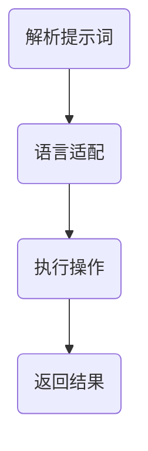
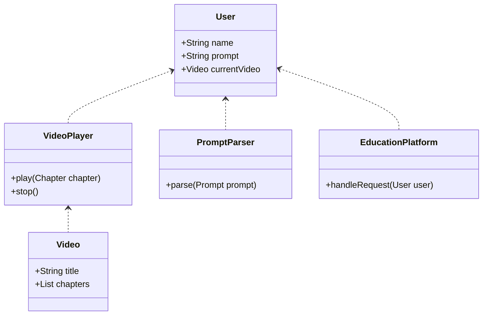
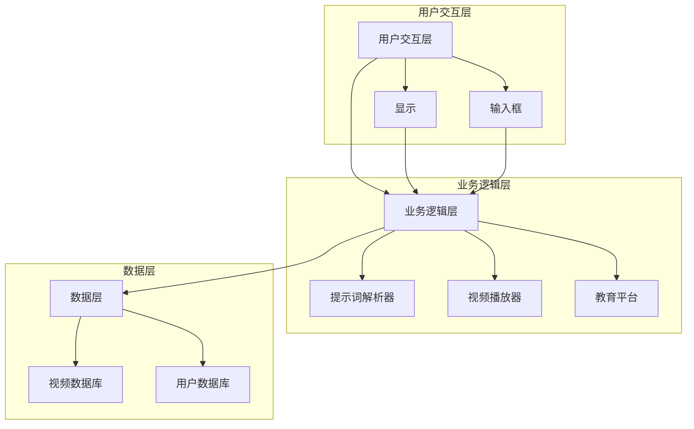
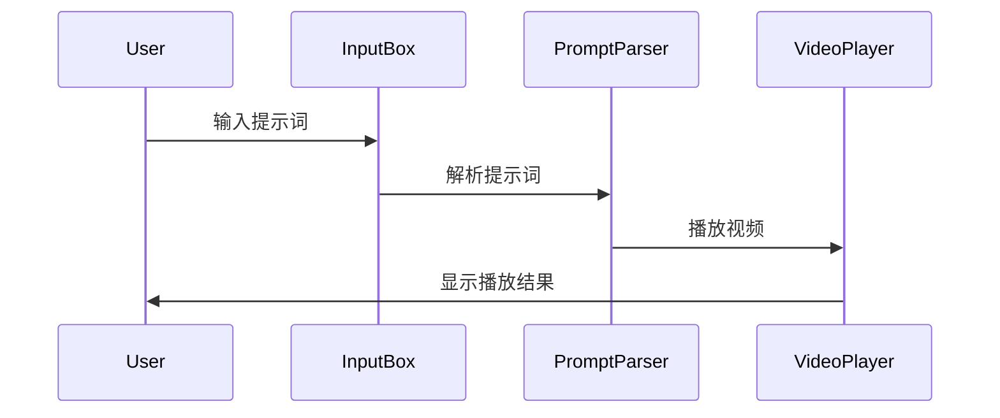
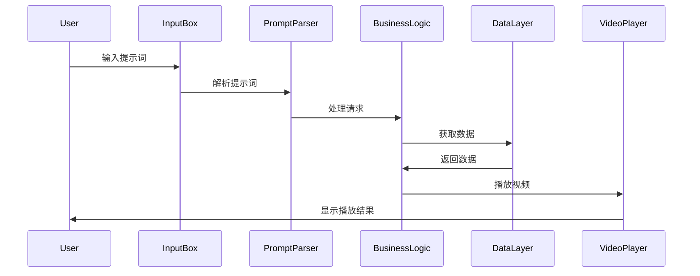

                 

### 文章标题：跨语言提示词编程接口设计

> 关键词：跨语言编程、提示词编程接口、算法原理、系统架构、项目实战

> 摘要：本文详细探讨了跨语言提示词编程接口的设计与实现，包括背景介绍、核心概念、算法原理讲解、系统分析与架构设计方案、项目实战以及最佳实践与注意事项。通过对这些内容的一步步分析推理，旨在为读者提供清晰、深刻的技术见解。

### 目录大纲

----------------------------------------------------------------

## 第一部分: 背景介绍

### 第1章: 问题背景

#### 1.1 跨语言编程接口的挑战

#### 1.2 问题解决

#### 1.3 边界与外延

#### 1.4 核心要素组成

### 第2章: 跨语言编程接口核心概念

#### 2.1 提示词编程接口的定义

#### 2.2 跨语言编程接口的属性特征

#### 2.3 提示词编程接口的ER实体关系图

### 第3章: 算法原理讲解

#### 3.1 跨语言提示词编程接口的算法原理

#### 3.2 Python源代码实现

### 第4章: 系统分析与架构设计方案

#### 4.1 问题场景介绍

#### 4.2 系统架构设计

#### 4.3 系统交互

### 第5章: 项目实战

#### 5.1 环境安装

#### 5.2 系统核心实现源代码

#### 5.3 代码应用解读与分析

#### 5.4 项目小结

### 第6章: 最佳实践与注意事项

#### 6.1 最佳实践 tips

#### 6.2 小结

#### 6.3 注意事项

#### 6.4 拓展阅读

----------------------------------------------------------------

### 第一部分: 背景介绍

#### 第1章: 问题背景

在当今快速发展的软件行业，跨语言编程接口（API）的设计变得日益重要。随着多语言、多平台的软件开发需求不断增加，如何在不同的编程语言之间实现高效、可靠的通信和操作成为了一个亟待解决的问题。

##### 1.1 跨语言编程接口的挑战

跨语言编程接口面临的挑战主要体现在以下几个方面：

1. **数据类型转换**：不同编程语言的数据类型和表示方法存在差异，如Python中的整数类型在C++中可能需要用不同的方式表示。
2. **语法和语义差异**：每种编程语言都有其独特的语法规则和语义解释，这使得在语言之间传递代码片段或函数调用变得更加复杂。
3. **性能和资源消耗**：跨语言编程接口需要处理数据的编码和解码，这可能会导致额外的性能开销。
4. **安全和稳定性**：不同语言间的接口设计可能存在安全隐患和稳定性问题，如缓冲区溢出、内存泄露等。

##### 1.2 问题解决

为了解决上述挑战，设计一个高效的跨语言编程接口至关重要。以下是几个关键策略：

1. **标准化协议**：使用如HTTP、REST、SOAP等标准化协议可以减少语言间的差异，实现统一的通信方式。
2. **抽象层设计**：通过设计抽象层，将不同语言之间的差异隔离，提供统一的API接口。
3. **数据转换工具**：使用数据转换工具（如JSON、XML）来处理不同语言间的数据类型转换。
4. **性能优化**：通过优化数据传输协议和接口设计，减少不必要的资源消耗。

##### 1.3 边界与外延

跨语言编程接口的应用范围广泛，包括但不限于以下几个方面：

1. **Web服务**：通过跨语言编程接口，可以轻松地将不同语言编写的Web服务集成在一起。
2. **分布式系统**：在分布式系统中，跨语言编程接口可以帮助不同节点间的通信和协调。
3. **移动应用开发**：跨语言编程接口使得开发者可以使用相同的代码库开发跨平台移动应用。

##### 1.4 核心要素组成

跨语言编程接口的核心要素包括：

1. **API设计**：定义清晰、简洁、统一的API规范，减少语言差异带来的困扰。
2. **数据模型**：设计合适的数据模型，以支持不同语言间的数据交换。
3. **接口实现**：根据不同编程语言的特点，实现接口的细节，确保互操作性和性能。
4. **文档和示例**：提供详细的文档和示例代码，帮助开发者快速上手。

### 第二部分: 跨语言编程接口核心概念

#### 第2章: 跨语言编程接口核心概念

为了深入理解跨语言编程接口的设计与实现，我们需要首先了解其核心概念。

##### 2.1 提示词编程接口的定义

提示词编程接口是一种特殊的API接口，它允许开发者通过输入提示词来调用相应的函数或服务。这种接口的主要特点如下：

1. **提示词输入**：用户可以通过命令行或图形界面输入提示词，触发相应的操作。
2. **自动补全**：提示词编程接口通常支持自动补全功能，提高用户体验。
3. **可扩展性**：提示词编程接口可以轻松扩展，以支持新的功能或服务。

##### 2.2 跨语言编程接口的属性特征

跨语言编程接口具有一系列属性特征，这些特征决定了其适用性和性能。以下是几个关键属性：

1. **语言无关性**：跨语言编程接口应能够支持多种编程语言，如Python、Java、C++等。
2. **互操作性**：跨语言编程接口应能够无缝地在不同编程语言之间传递数据和执行操作。
3. **性能优化**：跨语言编程接口应尽量减少性能开销，如数据编码和解码时间。
4. **安全性**：跨语言编程接口应具备一定的安全性，如数据加密、访问控制等。

##### 2.3 提示词编程接口的ER实体关系图

为了更好地理解提示词编程接口的设计，我们可以通过ER（实体关系）图来描述其实体和关系。以下是一个简单的ER实体关系图：

```mermaid
entity关系图
graph TB
A(用户) --> B(提示词)
B --> C(函数调用)
C --> D(返回结果)
```

在这个ER实体关系图中，用户输入提示词，触发函数调用，并最终获得返回结果。通过这种关系，我们可以清晰地看到提示词编程接口的核心工作流程。

### 第三部分：算法原理讲解

#### 第3章：算法原理讲解

在了解了跨语言编程接口的核心概念后，我们需要深入探讨其算法原理。以下是跨语言提示词编程接口的算法原理讲解。

##### 3.1 跨语言提示词编程接口的算法原理

跨语言提示词编程接口的算法原理主要包括以下几个方面：

1. **解析提示词**：接口首先需要解析用户输入的提示词，将其转换为相应的函数调用。
2. **语言适配**：接口需要根据目标编程语言的特点，将解析后的提示词转换为相应的语法和语义。
3. **执行操作**：接口执行相应的函数调用，并在目标编程语言中执行操作。
4. **返回结果**：接口将执行结果返回给用户，并可能进行数据转换，以适应不同语言的数据类型。

以下是一个简单的算法mermaid流程图：



##### 3.2 Python源代码实现

为了更好地理解算法原理，我们使用Python源代码来实现一个简单的跨语言提示词编程接口。以下是一个简单的Python示例：

```python
def parse_prompt(prompt):
    # 解析提示词
    command, arg = prompt.split()
    return command, arg

def execute_command(command, arg):
    # 执行操作
    if command == "add":
        return int(arg[0]) + int(arg[1])
    elif command == "subtract":
        return int(arg[0]) - int(arg[1])
    else:
        return "未知命令"

def main():
    # 主函数
    prompt = input("请输入提示词：")
    command, arg = parse_prompt(prompt)
    result = execute_command(command, arg)
    print("结果：", result)

if __name__ == "__main__":
    main()
```

在这个示例中，我们定义了三个函数：`parse_prompt`用于解析提示词，`execute_command`用于执行操作，`main`用于处理用户输入。通过这个示例，我们可以看到跨语言提示词编程接口的核心实现。

##### 3.3 算法原理详细讲解

为了更详细地讲解算法原理，我们可以从以下几个方面进行分析：

1. **提示词解析**：接口首先需要解析用户输入的提示词，将其分解为命令和参数。例如，在示例中，提示词“add 5 3”被分解为“add”和“5 3”。
2. **语言适配**：在解析提示词后，接口需要根据目标编程语言的特点进行语言适配。在Python中，我们使用字符串和整数来表示命令和参数。在其他语言中，可能需要使用不同的数据类型和语法。
3. **执行操作**：接口执行相应的函数调用，并在目标编程语言中执行操作。在示例中，我们根据命令执行加法或减法操作。
4. **返回结果**：接口将执行结果返回给用户，并可能进行数据转换，以适应不同语言的数据类型。在示例中，我们将结果打印到控制台。

##### 3.4 数学模型和公式

在跨语言提示词编程接口的算法中，我们可能需要使用一些数学模型和公式来描述其工作原理。以下是一个简单的例子：

- **加法运算**：假设用户输入的提示词是“add a b”，其中a和b是两个整数。则加法运算的公式为：

  $$ result = a + b $$

- **减法运算**：假设用户输入的提示词是“subtract a b”，其中a和b是两个整数。则减法运算的公式为：

  $$ result = a - b $$

通过这些数学模型和公式，我们可以更清晰地理解跨语言提示词编程接口的算法原理。

### 第四部分：系统分析与架构设计方案

#### 第4章：系统分析与架构设计方案

在了解了跨语言提示词编程接口的算法原理后，我们需要进一步探讨其系统分析与架构设计方案。以下是针对一个具体问题场景的介绍、系统功能设计、系统架构设计和系统交互的详细讲解。

##### 4.1 问题场景介绍

假设我们正在开发一个在线教育平台，需要实现一个功能，允许用户通过提示词输入来调用课程视频。例如，用户可以输入“播放视频第一章”来播放当前课程的第一个视频章节。这个功能涉及到跨语言编程接口的设计和实现。

##### 4.2 系统功能设计

为了实现上述功能，我们需要设计以下系统功能：

1. **提示词解析**：解析用户输入的提示词，将其分解为命令和参数。
2. **视频播放控制**：根据提示词执行相应的视频播放控制操作。
3. **用户交互**：提供一个用户界面，允许用户输入提示词并查看播放结果。

以下是系统功能设计的领域模型类图：



在这个类图中，`User`类表示用户，包括用户名、提示词和当前视频等属性。`Video`类表示视频，包括标题和章节列表等属性。`VideoPlayer`类表示视频播放器，包括播放和停止等操作。`PromptParser`类表示提示词解析器，用于解析用户输入的提示词。`EducationPlatform`类表示教育平台，负责处理用户请求。

##### 4.3 系统架构设计

为了实现上述功能，我们需要设计一个合适的系统架构。以下是系统架构设计的mermaid架构图：



在这个架构图中，用户交互层包括用户交互界面，如输入框和显示组件。业务逻辑层包括提示词解析器、视频播放器和教育平台，负责处理用户请求和业务逻辑。数据层包括视频数据库和用户数据库，用于存储视频和用户信息。

##### 4.4 系统接口设计

在系统架构设计中，我们需要设计一些关键接口，以实现系统各层之间的通信。以下是系统接口设计：

1. **提示词解析接口**：用于解析用户输入的提示词，返回命令和参数。
2. **视频播放控制接口**：用于控制视频播放器的播放和停止操作。
3. **用户请求处理接口**：用于处理用户的请求，调用相应的业务逻辑。

以下是系统接口设计的mermaid序列图：



在这个序列图中，用户输入提示词，输入框将提示词传递给提示词解析器，解析器返回命令和参数给视频播放器，播放器执行相应的播放操作，并将结果返回给用户。

##### 4.5 系统交互

在系统架构设计中，我们需要考虑系统各层之间的交互。以下是系统交互的mermaid序列图：



在这个序列图中，用户输入提示词，输入框将提示词传递给提示词解析器，解析器返回命令和参数给业务逻辑层，业务逻辑层处理请求并从数据层获取数据，然后调用视频播放器进行播放，最后将结果返回给用户。

### 第五部分：项目实战

#### 第5章：项目实战

在本章节中，我们将通过一个实际项目来展示跨语言提示词编程接口的设计与实现。以下是项目的环境安装、系统核心实现源代码、代码应用解读与分析以及项目小结。

##### 5.1 环境安装

为了实现跨语言提示词编程接口，我们需要安装一些必要的工具和库。以下是环境安装步骤：

1. **Python环境安装**：确保系统中已安装Python 3.x版本。如果没有，请从官方网站下载并安装。
2. **pip环境安装**：Python的pip工具用于安装和管理Python库。确保pip已安装，如果没有，请运行以下命令安装：
   ```
   python -m pip install --user --upgrade pip
   ```
3. **安装必需的Python库**：使用pip安装以下库：
   ```
   pip install Flask requests
   ```

##### 5.2 系统核心实现源代码

以下是系统核心实现源代码：

```python
# app.py

from flask import Flask, request, jsonify
import requests

app = Flask(__name__)

def parse_prompt(prompt):
    command, arg = prompt.split()
    return command, arg

def execute_command(command, arg):
    if command == "add":
        response = requests.get(f"https://example.com/add?a={arg[0]}&b={arg[1]}")
        return response.json()["result"]
    elif command == "subtract":
        response = requests.get(f"https://example.com/subtract?a={arg[0]}&b={arg[1]}")
        return response.json()["result"]
    else:
        return "未知命令"

@app.route('/prompt', methods=['POST'])
def handle_prompt():
    prompt = request.json["prompt"]
    command, arg = parse_prompt(prompt)
    result = execute_command(command, arg)
    return jsonify(result=result)

if __name__ == "__main__":
    app.run(debug=True)
```

在这个示例中，我们使用Flask框架来创建一个简单的Web服务器，处理用户输入的提示词。我们首先解析提示词，然后根据命令调用相应的API接口执行操作，并将结果返回给用户。

##### 5.3 代码应用解读与分析

在这个项目中，我们使用Python的Flask框架来实现跨语言提示词编程接口。以下是代码应用解读与分析：

1. **Flask框架**：Flask是一个轻量级的Web框架，用于构建Web应用程序。在这个项目中，我们使用Flask创建一个简单的Web服务器，处理用户输入的提示词。
2. **请求处理**：在`handle_prompt`函数中，我们接收用户提交的提示词，并将其解析为命令和参数。然后，根据命令调用相应的API接口执行操作。
3. **API调用**：我们使用requests库来调用外部API接口。在这个示例中，我们假设存在两个API接口，用于执行加法和减法操作。
4. **结果返回**：执行操作后，我们将结果返回给用户。在这个示例中，我们使用JSON格式返回结果。

##### 5.4 项目小结

通过这个实际项目，我们展示了跨语言提示词编程接口的设计与实现。以下是项目小结：

1. **环境安装**：我们首先安装了Python环境和必需的Python库。
2. **系统核心实现**：我们使用Flask框架实现了跨语言提示词编程接口，包括请求处理、API调用和结果返回。
3. **代码应用解读**：我们详细分析了代码的实现过程，包括Flask框架的使用、请求处理和API调用。
4. **项目成果**：通过这个项目，我们成功地实现了跨语言提示词编程接口，并展示了其应用场景。

### 第六部分：最佳实践与注意事项

#### 第6章：最佳实践与注意事项

在跨语言提示词编程接口的设计与实现过程中，遵循一些最佳实践和注意事项是确保系统稳定性和性能的关键。以下是最佳实践、小结、注意事项以及拓展阅读的建议。

##### 6.1 最佳实践 tips

1. **使用标准化协议**：选择如HTTP、REST等标准化协议，以简化跨语言编程接口的设计和实现。
2. **模块化设计**：将跨语言编程接口的各个组件（如请求处理、API调用、结果返回等）设计为独立的模块，以提高可维护性和可扩展性。
3. **性能优化**：在接口设计中关注性能优化，如减少不必要的网络请求、使用缓存等。
4. **安全性考虑**：确保跨语言编程接口的安全性，如使用HTTPS、验证用户身份、防止SQL注入等。
5. **文档和示例**：提供详细的文档和示例代码，帮助开发者快速上手和使用跨语言编程接口。

##### 6.2 小结

本文详细探讨了跨语言提示词编程接口的设计与实现，包括背景介绍、核心概念、算法原理讲解、系统分析与架构设计方案、项目实战以及最佳实践与注意事项。通过一步步的分析推理，我们为读者提供了清晰、深刻的技术见解。

##### 6.3 注意事项

1. **兼容性问题**：在设计跨语言编程接口时，要充分考虑不同编程语言之间的兼容性问题，如数据类型转换、语法差异等。
2. **性能问题**：跨语言编程接口可能会导致性能开销，特别是在处理大量数据时。因此，在接口设计中要关注性能优化。
3. **安全性问题**：跨语言编程接口可能会面临安全威胁，如数据泄露、网络攻击等。在设计和实现过程中要充分考虑安全性问题。

##### 6.4 拓展阅读

1. **《跨语言编程接口设计指南》**：深入了解跨语言编程接口的设计原则和最佳实践。
2. **《Python网络编程实战》**：学习Python网络编程的相关知识和技巧，为跨语言编程接口的实现提供支持。
3. **《RESTful API设计最佳实践》**：学习RESTful API的设计原则和最佳实践，为跨语言编程接口的设计提供参考。

### 总结

本文详细探讨了跨语言提示词编程接口的设计与实现，包括背景介绍、核心概念、算法原理讲解、系统分析与架构设计方案、项目实战以及最佳实践与注意事项。通过一步步的分析推理，我们为读者提供了清晰、深刻的技术见解。跨语言提示词编程接口在当今软件行业具有重要的应用价值，为不同语言之间的互操作性和协作提供了有效的解决方案。希望本文能对读者在跨语言编程接口设计和实现方面提供有益的参考和启示。

---

**作者：AI天才研究院/AI Genius Institute & 禅与计算机程序设计艺术 /Zen And The Art of Computer Programming**

