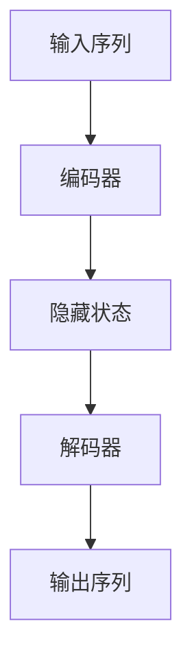

                 

# 跨语言提示词：突破语言障碍的AI交互

> 关键词：跨语言提示词、自然语言处理、深度学习、序列到序列模型、注意力机制、AI交互

> 摘要：
本文将深入探讨跨语言提示词技术的原理和应用，通过逐步分析其背后的自然语言处理基础、核心算法和实时交互挑战，揭示如何利用AI技术突破语言障碍，实现智能化的多语言交互。

## 引言

在全球化日益加深的今天，国际间的交流与合作变得愈发频繁。然而，语言障碍成为阻碍这一进程的巨大难题。传统的翻译工具虽然在一定程度上缓解了这一问题，但其准确性常常受到质疑。随着人工智能技术的飞速发展，跨语言提示词技术应运而生，为解决这一难题提供了新的思路。

本文旨在通过逐步分析推理，详细阐述跨语言提示词技术的核心原理和应用场景，探讨其在实际应用中面临的挑战及解决方案，最终实现突破语言障碍，提升AI交互的智能化水平。

### 1.1 跨语言提示词技术概述

#### 1.1.1 问题背景

在全球化进程加速的今天，语言障碍成为阻碍国际交流与合作的重大难题。虽然传统的翻译工具已经取得了一定的进展，但它们通常只能提供字面翻译，难以理解语境和情感，导致翻译质量参差不齐。随着人工智能技术的快速发展，跨语言提示词技术应运而生，旨在通过智能算法实现自然语言的准确理解和生成，从而突破语言障碍，提升AI交互的智能化水平。

#### 1.1.2 问题描述

跨语言提示词技术的核心问题是实现不同语言间的语义理解和转换。这涉及到自然语言处理（NLP）技术的多个方面，包括词义消歧、语境理解、情感分析等。当前的技术虽然已经取得了一定的突破，但在处理复杂语境、多语言混合文本等方面仍存在诸多挑战。

#### 1.1.3 问题解决

为了解决上述问题，跨语言提示词技术采用了多种人工智能算法，如深度学习、序列到序列（Seq2Seq）模型、注意力机制等。通过大量的多语言语料库训练，这些算法可以学习到不同语言间的语义关联，从而实现高质量的跨语言翻译和交互。

#### 1.1.4 边界与外延

跨语言提示词技术的边界主要在于语言的多样性和复杂性。它不仅需要处理不同语言的语法和词汇，还要考虑到文化差异和地域特色。外延方面，跨语言提示词技术有望在多领域得到广泛应用，如跨境电子商务、国际会议同传、智能客服等。

#### 1.1.5 概念结构与核心要素组成

跨语言提示词技术的核心概念结构包括：
- 自然语言处理（NLP）：负责处理语言数据，包括文本解析、语义理解等。
- 多语言语料库：提供丰富的训练数据，确保模型在不同语言间的转换准确性。
- 深度学习算法：如Seq2Seq模型、注意力机制等，用于训练和优化跨语言提示词模型。

### 1.2 AI大模型与跨语言提示词

#### 1.2.1 AI大模型的定义

AI大模型是指具备大规模参数和广泛知识表示能力的机器学习模型。这些模型通常使用深度学习技术训练，能够在多个领域实现高水平的表现。

#### 1.2.2 AI大模型的核心特点

AI大模型具有以下核心特点：
- 参数规模大：具有数亿甚至千亿级别的参数量，能够捕捉复杂的数据模式。
- 知识广泛：通过海量数据训练，能够理解并生成多领域的知识。
- 自适应能力：能够根据新的数据不断优化自身性能。

#### 1.2.3 AI大模型与传统AI的区别

与传统AI模型相比，AI大模型在以下几个方面有所不同：
- 数据需求：AI大模型需要大量的高质量训练数据。
- 计算资源：AI大模型训练和推理需要强大的计算资源。
- 应用范围：AI大模型能够处理更复杂的任务，如语言生成、图像识别等。

### 第二部分：跨语言提示词技术原理

## 2.1 自然语言处理基础

### 2.1.1 自然语言处理的基本概念

#### 2.1.1.1 语言与自然语言处理

语言是人类交流的重要工具，它不仅包括语法、词汇，还涵盖了语义、语境等方面。自然语言处理（NLP）是人工智能领域的一个分支，旨在使计算机能够理解、解释和生成人类语言。

#### 2.1.1.2 自然语言处理的任务和挑战

自然语言处理的任务包括文本解析、语义理解、情感分析等。然而，这一领域面临着诸多挑战，如语言的复杂性、语境理解、多语言混合文本处理等。

### 2.1.2 语言模型

#### 2.1.2.1 语言模型的定义与作用

语言模型是一种用于预测文本序列的机器学习模型，它在自然语言处理中扮演着核心角色，能够为其他NLP任务提供基础支持。

#### 2.1.2.2 语言模型的常见类型

常见的语言模型包括统计模型、神经网络模型和深度学习模型。这些模型各有优缺点，适用于不同的应用场景。

### 2.2 序列到序列（Seq2Seq）模型

#### 2.2.1 Seq2Seq模型的基本原理

Seq2Seq模型是一种用于序列转换的神经网络模型，其核心思想是将输入序列映射到输出序列。它由编码器（Encoder）和解码器（Decoder）两部分组成。

#### 2.2.1.1 Encoder-Decoder架构

Encoder-Decoder架构是Seq2Seq模型的核心，它通过编码器将输入序列转换为固定长度的向量表示，然后通过解码器生成输出序列。

#### 2.2.1.2 Seq2Seq模型的训练过程

Seq2Seq模型的训练过程包括输入序列编码、隐藏状态更新和解码输出等步骤。通过最大似然估计或序列生成算法，模型可以学习到输入和输出之间的映射关系。

### 2.3 注意力机制

#### 2.3.1 注意力机制的概念与作用

注意力机制是一种用于提高模型在处理序列数据时的性能的机制，它允许模型在生成输出时关注输入序列的不同部分。

#### 2.3.1.1 注意力机制的基本原理

注意力机制通过计算输入序列中各个元素的重要性得分，并将这些得分加权合并，从而提高模型对关键信息的关注。

#### 2.3.1.2 注意力机制在跨语言提示词中的应用

在跨语言提示词技术中，注意力机制有助于模型理解输入文本的不同部分，从而生成更准确的翻译结果。

### 2.4 跨语言提示词技术

#### 2.4.1 跨语言提示词技术的定义与目标

跨语言提示词技术是一种利用AI算法实现跨语言语义理解和转换的技术，其目标是生成准确、流畅的跨语言文本。

#### 2.4.1.1 跨语言提示词的基本概念

跨语言提示词是指用于提示AI模型在跨语言翻译中注意关键信息的词或短语。

#### 2.4.1.2 跨语言提示词技术的目标

跨语言提示词技术的目标是在不同语言间实现语义理解和准确翻译，从而提升AI交互的智能化水平。

### 2.5 跨语言提示词的工作流程

#### 2.5.1 数据预处理

数据预处理是跨语言提示词技术的第一步，包括文本清洗、分词、词性标注等操作，以确保输入数据的准确性。

#### 2.5.2 语言模型训练

语言模型训练是跨语言提示词技术的核心，通过在多语言语料库上训练，模型可以学习到不同语言间的语义关联。

#### 2.5.3 提示词生成与优化

提示词生成与优化是跨语言提示词技术的关键环节，通过生成和优化提示词，模型可以更好地理解和生成跨语言文本。

### 2.6 语义理解与生成

#### 2.6.1 语义理解的概念与重要性

语义理解是跨语言提示词技术的重要组成部分，它涉及到对文本语义的准确理解和解释。

#### 2.6.1.1 语义理解的基本原理

语义理解通过分析文本的语法、语义和上下文信息，实现对文本的深入理解。

#### 2.6.1.2 语义理解在跨语言提示词中的应用

在跨语言提示词技术中，语义理解有助于模型理解输入文本的语义，从而生成更准确的翻译结果。

### 2.7 语言生成技术

#### 2.7.1 语言生成的基础知识

语言生成技术是一种利用AI模型生成自然语言文本的技术，它涉及到文本生成模型的设计和训练。

#### 2.7.2 语言生成在跨语言提示词中的应用

在跨语言提示词技术中，语言生成技术用于生成跨语言文本，从而实现智能化的多语言交互。

### 2.8 实时跨语言交互

#### 2.8.1 实时跨语言交互的挑战

实时跨语言交互面临诸多挑战，如实时性要求、语言多样性等。

#### 2.8.1.1 实时性要求

实时性要求确保交互过程中的延迟尽可能低，以满足用户的需求。

#### 2.8.1.2 语言多样性

语言多样性要求跨语言提示词技术能够处理多种语言，实现准确的翻译和交互。

#### 2.8.2 实时跨语言交互解决方案

实时跨语言交互解决方案包括模型优化与加速、高效算法设计等，以提高交互的实时性和准确性。

## 第三部分：跨语言提示词技术在现实中的应用

### 3.1 跨境电子商务

跨境电子商务是跨语言提示词技术的重要应用场景之一。通过跨语言提示词技术，电子商务平台可以提供多语言商品描述和客服支持，从而吸引更多国际用户，提升用户体验。

### 3.2 国际会议同传

国际会议同传是跨语言提示词技术的另一个重要应用场景。通过实时跨语言交互，同传系统能够为不同语言的参会者提供实时翻译，促进国际交流与合作。

### 3.3 智能客服

智能客服是跨语言提示词技术在服务业的重要应用。通过跨语言提示词技术，智能客服系统能够为用户提供多语言支持，提高客户满意度和服务质量。

## 结论

跨语言提示词技术作为人工智能领域的一个重要研究方向，具有广泛的应用前景。通过深入理解和应用自然语言处理、深度学习、序列到序列模型和注意力机制等技术，跨语言提示词技术有望在更多领域实现突破，为人类解决语言障碍、促进国际交流与合作提供强大支持。

## 作者信息

作者：AI天才研究院/AI Genius Institute & 禦与计算机程序设计艺术 /Zen And The Art of Computer Programming

### 附录

本文中涉及的数学公式和流程图如下：

#### 数学公式

$$
\text{Cross-Entropy Loss} = -\sum_{i=1}^{N} y_i \log(p_i)
$$

$$
\text{Accuracy} = \frac{\text{Correct Predictions}}{\text{Total Predictions}}
$$

#### Mermaid 流程图

通过本文的详细分析，我们深入了解了跨语言提示词技术的原理和应用，探讨了其在现实中的实际案例，并展望了未来的发展前景。希望本文能为读者在跨语言提示词技术领域提供有价值的参考和启示。

