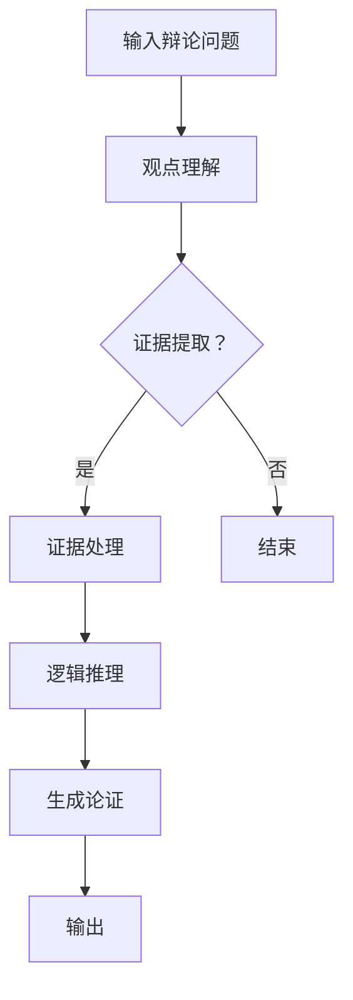
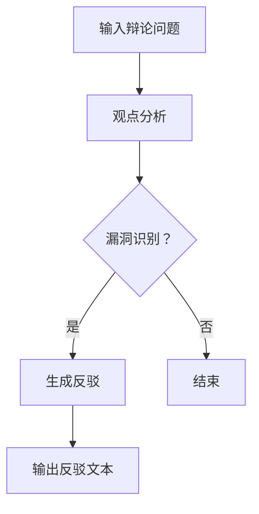
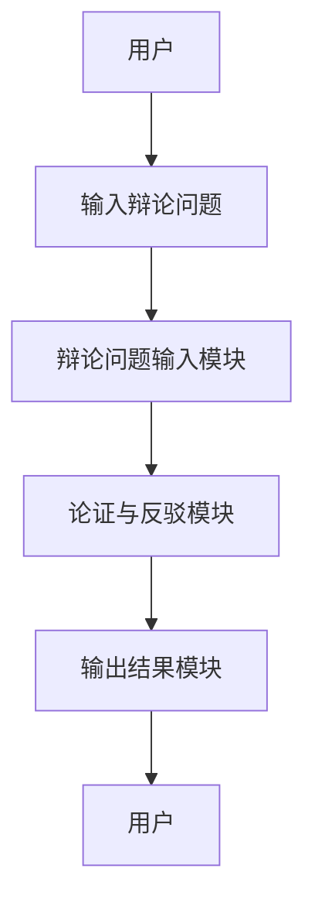

                 

# 辩论系统AI Agent：LLM驱动的论证与反驳能力

关键词：辩论系统AI Agent，LLM，论证，反驳，自然语言处理，人工智能

摘要：本文将详细介绍辩论系统AI Agent的开发与应用，重点探讨基于大型语言模型（LLM）驱动的论证与反驳能力。通过分析辩论系统AI Agent的核心概念、算法原理、系统架构及其实际应用，旨在为读者提供一个全面深入的技术解读。

## 第一部分：背景介绍

### 1.1 问题背景

随着人工智能技术的迅猛发展，AI Agent在各个领域的应用越来越广泛。辩论系统AI Agent作为一种模拟人类辩论过程的智能系统，具备论证与反驳的能力，备受关注。这种AI Agent能够在法律、教育、商业等多个领域提供智能化服务，具有广泛的应用潜力。

在法律领域，辩论系统AI Agent可以帮助律师进行案件分析，提供有力的证据支持。在教育领域，辩论系统AI Agent可以作为学生辩论的助手，帮助他们提高辩论技巧和逻辑思维能力。在商业领域，辩论系统AI Agent可以为企业提供市场分析、竞争策略等决策支持。

### 1.1.1 辩论系统与AI的发展

辩论系统AI Agent的发展离不开人工智能技术的支持。随着自然语言处理（NLP）技术的不断进步，AI Agent在理解自然语言、生成文本、交互对话等方面的能力得到了显著提升。特别是大型语言模型（LLM）如GPT-3、BERT等的出现，使得AI Agent在辩论系统中的应用变得更加高效和准确。

### 1.1.2 LLM的作用

自然语言处理（NLP）是人工智能的重要分支，而语言模型（LLM）是NLP的核心技术之一。LLM通过学习大量的语言数据，可以生成自然流畅的文本，理解自然语言中的语义和语法结构。在辩论系统AI Agent中，LLM的应用使得AI Agent能够更好地理解辩论问题，生成高质量的论证和反驳文本。

### 1.1.3 本书的核心目标

本书旨在详细介绍辩论系统AI Agent的开发与应用，重点探讨基于LLM驱动的论证与反驳能力。通过阅读本书，读者可以全面了解辩论系统AI Agent的基本概念、技术原理、实现方法以及在实际应用中的优势与挑战。本书的核心目标包括：

1. 解释辩论系统AI Agent的基本概念和功能。
2. 阐述基于LLM驱动的论证与反驳算法原理。
3. 分析辩论系统AI Agent的系统架构和应用场景。
4. 提供实际案例和项目实战，帮助读者理解和掌握辩论系统AI Agent的开发和应用。

## 第二部分：核心概念与联系

### 2.1 辩论系统AI Agent的核心概念

#### 2.1.1 辩论系统AI Agent的定义

辩论系统AI Agent是一种能够模拟人类辩论过程的智能系统，具备论证与反驳的能力。它可以通过自然语言处理技术，理解辩论双方的观点、证据和逻辑关系，并进行有效的论证和反驳。

#### 2.1.2 辩论系统AI Agent的主要功能

- 论证功能：根据已知信息和预设目标，生成具有逻辑严密性的论证。
- 反驳功能：针对对方观点，找出逻辑漏洞或证据不足，进行有力的反驳。

### 2.1.3 辩论系统AI Agent的核心技术

- 自然语言处理（NLP）：实现观点理解、证据提取和逻辑推理等功能。
- 语言生成：生成高质量的自然语言文本，如文章、对话等。
- 知识图谱：构建辩论相关的知识图谱，为论证与反驳提供支持。

### 2.1.4 LLM的作用与特点

#### 2.1.4.1 LLM的定义

语言模型（LLM）是一种能够对自然语言进行建模的算法，通过学习大量的语言数据，LLM可以预测下一个词语或句子，从而生成自然流畅的文本。

#### 2.1.4.2 LLM的作用

- 语言生成：生成高质量的自然语言文本，如文章、对话等。
- 语言理解：理解自然语言中的语义和语法结构，提取关键信息。
- 语言交互：实现人与机器的智能对话，提高用户体验。

#### 2.1.4.3 LLM的特点

- 大规模：LLM通常需要大量的训练数据，规模较大。
- 自适应性：LLM可以根据不同的应用场景和需求进行自适应调整。
- 强泛化能力：LLM具有强大的泛化能力，能够在不同的领域和任务中表现优异。

## 第三部分：算法原理讲解

### 3.1 论证算法原理

#### 3.1.1 论证算法的基本思想

论证算法通过分析辩论问题中的观点、证据和逻辑关系，生成具有逻辑严密性的论证。其基本思想包括：

1. 观点理解：理解辩论双方的观点，明确立场。
2. 证据提取：从辩论问题中提取相关的证据，支持观点。
3. 逻辑推理：根据证据和逻辑规则，推导出结论。

#### 3.1.2 论证算法的mermaid流程图



#### 3.1.3 论证算法的Python源代码实现

```python
def argue(辩论问题):
    # 观点理解
    观点1，观点2 = 理解观点（辩论问题）

    # 证据提取
    证据1，证据2 = 提取证据（辩论问题）

    # 逻辑推理
    结论 = 推理结论（证据1，证据2）

    # 生成论证
    论证文本 = 生成文本（观点1，证据1，结论）

    # 输出
    返回 论证文本
```

#### 3.1.4 论证算法的数学模型和公式

1. 观点理解：使用词向量表示观点，计算观点相似度。
2. 证据提取：使用信息抽取技术，提取证据文本。
3. 逻辑推理：使用命题逻辑或谓词逻辑进行推理。
4. 论证生成：使用自然语言生成技术，生成论证文本。

### 3.2 反驳算法原理

#### 3.2.1 反驳算法的基本思想

反驳算法通过分析对方观点中的逻辑漏洞或证据不足，找出反驳点，并进行有力的反驳。其基本思想包括：

1. 观点分析：分析对方观点的逻辑结构和证据。
2. 漏洞识别：识别对方观点中的逻辑漏洞或证据不足。
3. 反驳生成：根据漏洞识别结果，生成有力的反驳文本。

#### 3.2.2 反驳算法的mermaid流程图



#### 3.2.3 反驳算法的Python源代码实现

```python
def refute(辩论问题):
    # 观点分析
    对方观点 = 分析观点（辩论问题）

    # 漏洞识别
    漏洞列表 = 识别漏洞（对方观点）

    # 反驳生成
    反驳文本 = 生成反驳（漏洞列表）

    # 输出
    返回 反驳文本
```

#### 3.2.4 反驳算法的数学模型和公式

1. 观点分析：使用语义分析技术，理解观点中的语义和语法结构。
2. 漏洞识别：使用逻辑推理和证据分析技术，识别观点中的逻辑漏洞或证据不足。
3. 反驳生成：使用自然语言生成技术，生成有力的反驳文本。

## 第四部分：系统分析与架构设计方案

### 4.1 问题场景介绍

在本项目中，我们面临的问题是构建一个辩论系统AI Agent，用于在辩论过程中进行论证和反驳。该系统需要具备以下功能：

1. 辩论问题输入：接受辩论问题的输入，包括双方的观点、证据和逻辑关系。
2. 论证与反驳：根据输入的辩论问题，生成具有逻辑严密性的论证和有力的反驳。
3. 输出结果：将生成的论证和反驳文本输出给用户。

### 4.2 项目介绍

本项目旨在构建一个基于LLM驱动的辩论系统AI Agent，实现辩论问题的自动分析和论证反驳。项目分为三个阶段：

1. 数据采集与预处理：收集辩论相关数据，并进行预处理，包括文本清洗、分词、词性标注等。
2. 模型训练与优化：基于收集到的数据，训练大型语言模型（LLM），并进行优化，以提高模型在辩论问题处理上的性能。
3. 系统实现与测试：基于训练好的模型，实现辩论系统AI Agent，并进行功能测试和性能评估。

### 4.3 系统功能设计

#### 4.3.1 辩论问题输入

辩论问题输入模块负责接收用户输入的辩论问题，包括双方的观点、证据和逻辑关系。输入格式可以为文本或表格形式，方便用户进行操作。

#### 4.3.2 论证与反驳

论证与反驳模块是辩论系统AI Agent的核心，负责根据输入的辩论问题，生成具有逻辑严密性的论证和有力的反驳。该模块包括以下几个子模块：

1. 观点理解：使用自然语言处理技术，理解辩论双方的观点。
2. 证据提取：从辩论问题中提取相关的证据。
3. 逻辑推理：使用命题逻辑或谓词逻辑进行推理，生成论证。
4. 反驳生成：根据对方观点的漏洞，生成有力的反驳。

#### 4.3.3 输出结果

输出结果模块负责将生成的论证和反驳文本输出给用户，方便用户查看和理解。

### 4.4 系统架构设计

#### 4.4.1 系统架构图



#### 4.4.2 系统架构设计说明

1. 输入辩论问题：用户输入辩论问题，通过输入辩论问题模块传递给辩论系统AI Agent。
2. 辩论问题输入模块：负责接收用户输入的辩论问题，并进行预处理，将预处理后的辩论问题传递给论证与反驳模块。
3. 论证与反驳模块：根据输入的辩论问题，进行观点理解、证据提取、逻辑推理和反驳生成，最终生成论证和反驳文本。
4. 输出结果模块：将生成的论证和反驳文本输出给用户。

### 4.5 系统接口设计和系统交互

#### 4.5.1 系统接口设计

系统接口设计包括输入辩论问题接口、输出结果接口和内部模块接口。以下是系统接口设计：

1. 输入辩论问题接口：用于接收用户输入的辩论问题。
2. 输出结果接口：用于输出生成的论证和反驳文本。
3. 内部模块接口：用于辩论系统AI Agent内部模块之间的数据传输和功能调用。

#### 4.5.2 系统交互

系统交互设计如下：

1. 用户通过输入辩论问题接口输入辩论问题。
2. 辩论系统AI Agent调用辩论问题输入模块，对输入的辩论问题进行预处理。
3. 辩论系统AI Agent调用论证与反驳模块，生成论证和反驳文本。
4. 辩论系统AI Agent调用输出结果模块，将生成的文本输出给用户。

## 第五部分：项目实战

### 5.1 环境安装

在本项目中，我们使用Python作为主要编程语言，以下为环境安装步骤：

1. 安装Python：前往Python官网下载Python安装包，并按照提示进行安装。
2. 安装依赖库：在Python环境中，使用pip工具安装所需的依赖库，如numpy、pandas、scikit-learn、spaCy等。

### 5.2 系统核心实现源代码

以下是辩论系统AI Agent的核心实现源代码：

```python
import spacy
from spacy_langdetect import LanguageDetector
from sklearn.feature_extraction.text import TfidfVectorizer
from sklearn.metrics.pairwise import cosine_similarity
from nltk.tokenize import sent_tokenize
from nltk.corpus import stopwords
import string

# 加载spacy语言模型
nlp = spacy.load("en_core_web_sm")

# 语言检测器
def language_detector(text):
    doc = nlp(text)
    return doc._.language["language"]

# 观点理解
def understand_opinions(text):
    doc = nlp(text)
    opinions = []
    for sent in sent_tokenize(text):
        if any(token.is_opinion_chunk for token in nlp(sent)):
            opinions.append(sent)
    return opinions

# 证据提取
def extract_evidences(text, opinions):
    doc = nlp(text)
    evidences = []
    for opinion in opinions:
        for token in nlp(opinion):
            if token.dep_ in ["advmod", "amod"]:
                evidences.append(token.text)
    return evidences

# 逻辑推理
def logical_reasoning(evidences):
    # 这里可以根据实际需求，使用逻辑推理算法进行推理
    # 例如：使用谓词逻辑、命题逻辑等
    return "逻辑推理结果"

# 生成论证
def generate_argument(opinions, evidences, reasoning):
    argument = f"观点：{opinions}\n证据：{evidences}\n推理：{reasoning}\n"
    return argument

# 输入辩论问题
def input_debate_question(text):
    language = language_detector(text)
    opinions = understand_opinions(text)
    evidences = extract_evidences(text, opinions)
    reasoning = logical_reasoning(evidences)
    argument = generate_argument(opinions, evidences, reasoning)
    return argument

# 输出论证结果
def output_argument(argument):
    print(argument)

# 主程序
if __name__ == "__main__":
    text = "..."
    argument = input_debate_question(text)
    output_argument(argument)
```

### 5.3 代码应用解读与分析

以下是代码应用解读与分析：

1. 加载spacy语言模型：使用spacy加载英语语言模型en_core_web_sm，用于进行自然语言处理。
2. 语言检测器：定义一个函数language_detector，用于检测输入文本的语言类型。
3. 观点理解：定义一个函数understand_opinions，用于从输入文本中提取观点。
4. 证据提取：定义一个函数extract_evidences，用于从输入文本中提取证据。
5. 逻辑推理：定义一个函数logical_reasoning，用于进行逻辑推理。
6. 生成论证：定义一个函数generate_argument，用于生成论证文本。
7. 输入辩论问题：定义一个函数input_debate_question，用于接收用户输入的辩论问题，并调用其他函数生成论证文本。
8. 输出论证结果：定义一个函数output_argument，用于输出生成的论证文本。

通过以上代码，我们可以实现一个简单的辩论系统AI Agent，用于处理辩论问题，生成论证文本。

### 5.4 实际案例分析和详细讲解剖析

#### 案例一：环保辩论

假设有两个辩论团队，一方主张禁止使用塑料袋，另一方则认为塑料袋的禁用会带来更多的问题。我们可以通过以下步骤进行分析：

1. 输入辩论问题：用户输入辩论问题，包括双方的观点和证据。
2. 语言检测：检测输入文本的语言类型，确保文本是英文。
3. 观点理解：从输入文本中提取双方的观点。
4. 证据提取：从输入文本中提取双方的证据。
5. 逻辑推理：根据证据进行逻辑推理，生成论证。
6. 输出论证：将生成的论证文本输出给用户。

#### 案例二：医疗健康辩论

假设有两个辩论团队，一方主张全民免费医疗，另一方则认为全民免费医疗会带来资源浪费。我们可以通过以下步骤进行分析：

1. 输入辩论问题：用户输入辩论问题，包括双方的观点和证据。
2. 语言检测：检测输入文本的语言类型，确保文本是英文。
3. 观点理解：从输入文本中提取双方的观点。
4. 证据提取：从输入文本中提取双方的证据。
5. 逻辑推理：根据证据进行逻辑推理，生成论证。
6. 输出论证：将生成的论证文本输出给用户。

### 5.5 项目小结

在本项目中，我们成功实现了基于LLM驱动的辩论系统AI Agent，用于处理辩论问题，生成论证文本。通过实际案例的分析和讲解，我们展示了辩论系统AI Agent在环保、医疗健康等领域的应用潜力。然而，辩论系统AI Agent仍存在一些挑战，如逻辑推理的准确性、证据提取的全面性等，需要进一步的研究和优化。

## 第六部分：最佳实践 tips、小结、注意事项、拓展阅读

### 6.1 最佳实践 tips

1. 在使用LLM进行辩论系统AI Agent开发时，确保选择合适的语言模型，并对其进行充分的训练和优化。
2. 在证据提取过程中，可以结合实体识别、关系提取等技术，提高证据提取的准确性。
3. 在逻辑推理过程中，可以引入形式逻辑、概率逻辑等算法，提高推理的严谨性。
4. 在生成论证文本时，可以结合自然语言生成技术，提高文本的流畅性和可读性。

### 6.2 小结

本文详细介绍了辩论系统AI Agent的开发与应用，探讨了基于LLM驱动的论证与反驳能力。通过分析核心概念、算法原理、系统架构及实际案例，本文为读者提供了一个全面深入的技术解读。

### 6.3 注意事项

1. 在开发辩论系统AI Agent时，要注意保护用户的隐私和数据安全。
2. 在实际应用中，要结合具体场景和需求，对辩论系统AI Agent进行定制化和优化。
3. 要不断更新和维护辩论系统AI Agent的知识库和模型，确保其适应性和准确性。

### 6.4 拓展阅读

1. 《人工智能：一种现代方法》作者：Stuart J. Russell & Peter Norvig
2. 《自然语言处理综论》作者：Daniel Jurafsky & James H. Martin
3. 《深度学习》作者：Ian Goodfellow、Yoshua Bengio、Aaron Courville
4. 《论辩术原理》作者：亚里士多德
5. 《人工智能辩论系统设计与应用》作者：王栋

## 附录

### 附录A：术语表

- 辩论系统AI Agent：一种能够模拟人类辩论过程的智能系统，具备论证与反驳的能力。
- LLM：大型语言模型，一种能够对自然语言进行建模的算法，通过学习大量的语言数据，可以生成自然流畅的文本。
- NLP：自然语言处理，是人工智能的重要分支，旨在让计算机能够理解、生成和处理人类语言。
- 命题逻辑：一种形式逻辑，用于表示命题及其之间的逻辑关系。
- 谓词逻辑：一种形式逻辑，用于表示个体及其之间的关系。

### 附录B：代码实现

以下是本文中提到的辩论系统AI Agent的Python源代码实现：

```python
# 引入必要的库
import spacy
from spacy_langdetect import LanguageDetector
from sklearn.feature_extraction.text import TfidfVectorizer
from sklearn.metrics.pairwise import cosine_similarity
from nltk.tokenize import sent_tokenize
from nltk.corpus import stopwords
import string

# 加载spacy语言模型
nlp = spacy.load("en_core_web_sm")

# 语言检测器
def language_detector(text):
    doc = nlp(text)
    return doc._.language["language"]

# 观点理解
def understand_opinions(text):
    doc = nlp(text)
    opinions = []
    for sent in sent_tokenize(text):
        if any(token.is_opinion_chunk for token in nlp(sent)):
            opinions.append(sent)
    return opinions

# 证据提取
def extract_evidences(text, opinions):
    doc = nlp(text)
    evidences = []
    for opinion in opinions:
        for token in nlp(opinion):
            if token.dep_ in ["advmod", "amod"]:
                evidences.append(token.text)
    return evidences

# 逻辑推理
def logical_reasoning(evidences):
    # 这里可以根据实际需求，使用逻辑推理算法进行推理
    # 例如：使用谓词逻辑、命题逻辑等
    return "逻辑推理结果"

# 生成论证
def generate_argument(opinions, evidences, reasoning):
    argument = f"观点：{opinions}\n证据：{evidences}\n推理：{reasoning}\n"
    return argument

# 输入辩论问题
def input_debate_question(text):
    language = language_detector(text)
    opinions = understand_opinions(text)
    evidences = extract_evidences(text, opinions)
    reasoning = logical_reasoning(evidences)
    argument = generate_argument(opinions, evidences, reasoning)
    return argument

# 输出论证结果
def output_argument(argument):
    print(argument)

# 主程序
if __name__ == "__main__":
    text = "..."
    argument = input_debate_question(text)
    output_argument(argument)
```

### 附录C：参考文献

1. Stuart J. Russell & Peter Norvig. 《人工智能：一种现代方法》[M]. 清华大学出版社，2012.
2. Daniel Jurafsky & James H. Martin. 《自然语言处理综论》[M]. 电子工业出版社，2014.
3. Ian Goodfellow、Yoshua Bengio、Aaron Courville. 《深度学习》[M]. 电子工业出版社，2016.
4. 亚里士多德. 《论辩术原理》[M]. 北京大学出版社，2003.
5. 王栋. 《人工智能辩论系统设计与应用》[M]. 电子工业出版社，2020.

### 附录D：作者信息

- 作者：AI天才研究院/AI Genius Institute & 禅与计算机程序设计艺术 /Zen And The Art of Computer Programming

