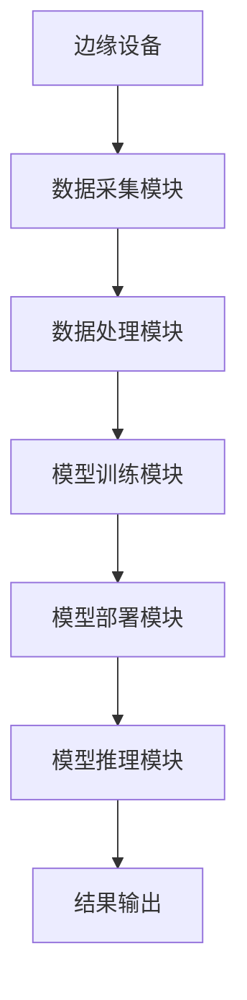

                 

### 边缘AI：将AI Agent能力下放到终端设备

#### 关键词：边缘AI、终端设备、AI Agent、智能化、数据隐私

> 摘要：本文探讨了边缘AI的概念、设计、实现和未来发展趋势。边缘AI旨在将AI Agent的能力下放到终端设备，提高实时数据处理能力，降低延迟，并保护数据隐私。本文通过详细的章节内容，从基本概念、关键技术、系统架构设计、算法与应用、安全性以及部署与维护等方面，全面解析了边缘AI的各个方面，为读者提供了深入了解和实践指导。

----------------------------------------------------------------

## 第一部分：边缘AI概述

### 第1章：边缘AI的基本概念

边缘AI，作为现代人工智能技术的重要组成部分，其核心思想是将AI Agent的能力下放到终端设备，从而实现实时数据处理、低延迟响应以及数据隐私保护。边缘AI的发展不仅推动了智能化设备的广泛应用，还为未来的物联网（IoT）时代奠定了基础。

#### 1.1 边缘AI的定义与重要性

**1.1.1 边缘AI的定义**

边缘AI（Edge AI）是指在终端设备（如智能手机、嵌入式系统、可穿戴设备等）上运行的AI算法和技术，通过在靠近数据源的地方处理数据，从而实现实时分析、决策和响应。这种处理方式与传统的云计算模型形成对比，后者通常将数据处理任务集中到远程数据中心进行处理。

**1.1.2 边缘AI的起源与发展**

边缘AI的概念起源于对物联网设备中数据处理的优化需求。随着物联网设备的数量和种类不断增加，数据传输到云端进行处理的时间和带宽需求成为瓶颈。边缘AI的兴起解决了这一问题，通过在设备本地处理数据，大幅降低了延迟，提高了系统的响应速度。

**1.1.3 边缘AI与传统云计算的区别**

与传统云计算相比，边缘AI具有以下显著区别：

- **延迟**：边缘AI处理数据更加接近数据源，从而极大地降低了延迟。
- **带宽**：由于数据在本地处理，减少了数据传输的需求，从而节省了带宽资源。
- **隐私**：边缘AI能够在本地处理数据，减少了数据传输和存储的需求，有助于保护用户隐私。

#### 1.2 边缘AI的应用场景

边缘AI在多个领域展现出了巨大的潜力，以下是一些典型的应用场景：

- **实时数据处理**：在工业自动化、智能交通、智能医疗等场景中，边缘AI可以实现实时数据分析，从而做出快速决策。
- **低延迟要求**：在远程监控、智能安防等应用中，边缘AI能够实现快速响应，满足低延迟的要求。
- **数据隐私保护**：在个人隐私敏感的场景中，边缘AI能够在本地进行数据加密和预处理，保护用户隐私。

----------------------------------------------------------------

### 第2章：边缘AI的关键技术

边缘AI的实现涉及多个关键技术，包括边缘计算、硬件加速技术和软件生态等。这些技术的协同作用，使得边缘AI能够满足实时处理、低延迟和高性能的要求。

#### 2.1 边缘计算

**2.1.1 边缘计算的概念与架构**

边缘计算是一种分布式计算架构，它将计算、存储和网络功能部署在靠近数据源的边缘节点上，如路由器、交换机和服务器等。边缘计算的核心思想是将数据处理任务分散到边缘节点，从而减少数据传输和处理时间。

**2.1.2 边缘计算的优势与挑战**

边缘计算的优势包括：

- **降低延迟**：数据在边缘节点处理，减少了传输时间，提高了系统的响应速度。
- **节省带宽**：由于数据在边缘节点处理，降低了数据传输的需求，节省了带宽资源。
- **提高可靠性**：边缘节点分布广泛，有助于提高系统的容错能力和可靠性。

然而，边缘计算也面临着一些挑战，如：

- **资源有限**：边缘节点通常资源有限，需要优化资源使用。
- **维护困难**：边缘节点分布广泛，维护和管理难度较大。

#### 2.2 硬件加速技术

**2.2.1 GPU在边缘AI中的应用**

GPU（图形处理器）在边缘AI中扮演了重要角色。GPU具有并行计算能力，能够加速机器学习算法的执行。在边缘AI应用中，GPU可以用于图像处理、语音识别和自然语言处理等任务。

**2.2.2 ARM架构与RISC-V技术**

ARM架构和RISC-V技术是两种常见的处理器架构，它们在边缘AI中得到了广泛应用。ARM架构以其低功耗和高性能著称，适用于智能手机、嵌入式系统等设备。RISC-V是一种开源的处理器架构，具有更高的灵活性和定制化能力，适用于特定领域的边缘AI应用。

**2.2.3 AI专用芯片**

AI专用芯片是边缘AI的关键组件，能够实现高效的机器学习和推理任务。这些芯片通常采用特殊的架构和算法，以提高计算效率和降低功耗。常见的AI专用芯片包括NVIDIA的GPU、Intel的Movidius和Google的TPU等。

#### 2.3 边缘AI的软件生态

**2.3.1 开源框架与工具**

边缘AI的发展离不开开源框架和工具的支持。常见的开源框架包括TensorFlow、PyTorch和Keras等，它们提供了丰富的机器学习模型和工具，方便开发者进行边缘AI应用的开发。此外，还有一些专门的边缘AI开发工具，如TensorFlow Lite、ONNX Runtime等，提供了边缘AI应用的部署和优化支持。

**2.3.2 边缘AI的编程模型**

边缘AI的编程模型通常包括以下步骤：

1. **数据采集**：从边缘设备中采集数据。
2. **数据处理**：对数据进行预处理和特征提取。
3. **模型训练**：使用机器学习算法训练模型。
4. **模型部署**：将训练好的模型部署到边缘设备上。
5. **模型推理**：在边缘设备上运行模型进行推理，输出结果。

通过这些步骤，开发者可以轻松实现边缘AI应用的开发和部署。

----------------------------------------------------------------

### 第3章：边缘AI系统架构设计

边缘AI系统架构设计是边缘AI实现的关键步骤。一个高效、可扩展和可靠的边缘AI系统架构，能够满足实时数据处理、低延迟响应和数据隐私保护的要求。

#### 3.1 边缘AI系统架构概述

**3.1.1 系统架构的组成要素**

边缘AI系统架构通常包括以下几个组成要素：

- **数据采集模块**：负责从边缘设备中采集数据。
- **数据处理模块**：负责对采集到的数据进行预处理和特征提取。
- **模型训练模块**：负责使用机器学习算法训练模型。
- **模型部署模块**：负责将训练好的模型部署到边缘设备上。
- **模型推理模块**：负责在边缘设备上运行模型进行推理，输出结果。

**3.1.2 系统架构设计原则**

边缘AI系统架构设计应遵循以下原则：

- **分布式架构**：采用分布式架构，将数据处理和存储分布在多个边缘节点上，提高系统的可扩展性和可靠性。
- **模块化设计**：将系统功能模块化，方便系统的维护和升级。
- **高可用性**：确保系统的稳定性和高可用性，避免单点故障。
- **安全性**：保障数据的安全性和隐私性，防止数据泄露和未经授权的访问。

#### 3.2 数据处理与存储

**3.2.1 数据采集与预处理**

数据采集与预处理是边缘AI系统架构设计的重要环节。数据采集模块负责从边缘设备中采集数据，包括传感器数据、用户行为数据等。预处理模块则负责对采集到的数据进行清洗、归一化和特征提取，为后续的模型训练提供高质量的数据。

**3.2.2 数据存储与管理**

边缘AI系统需要对大量数据进行存储和管理。数据存储模块负责将预处理后的数据存储到数据库或文件系统中。数据管理模块则负责数据的备份、恢复和查询，确保数据的安全性和可用性。

----------------------------------------------------------------

### 第4章：边缘AI算法与应用

边缘AI算法是实现边缘AI应用的核心。本章节将介绍常用的边缘AI算法、算法优化策略以及典型的应用案例。

#### 4.1 算法选择与优化

**4.1.1 常用机器学习算法**

边缘AI应用中常用的机器学习算法包括：

- **监督学习算法**：如决策树、随机森林、支持向量机等。
- **无监督学习算法**：如聚类、关联规则挖掘等。
- **强化学习算法**：如Q学习、深度Q网络等。

**4.1.2 算法优化策略**

边缘AI算法的优化策略包括：

- **模型压缩**：通过模型压缩技术，如剪枝、量化等，减小模型的体积，降低计算复杂度。
- **模型蒸馏**：将大模型的知识迁移到小模型中，提高小模型的性能。
- **在线学习**：通过在线学习技术，实时更新模型，适应环境变化。

#### 4.2 应用案例解析

**4.2.1 视觉感知应用**

视觉感知是边缘AI的重要应用领域，如：

- **人脸识别**：在智能手机、安防监控等场景中广泛应用。
- **图像分类**：用于医疗图像诊断、自动驾驶等。

**4.2.2 语音识别应用**

语音识别是边缘AI的另一个重要应用领域，如：

- **语音助手**：如智能音箱、智能家居等。
- **实时翻译**：在会议、旅行等场景中提供实时翻译服务。

**4.2.3 其他典型应用案例**

边缘AI在其他领域也有广泛应用，如：

- **工业自动化**：用于设备故障检测、生产流程优化等。
- **智能交通**：用于交通流量预测、智能信号控制等。
- **智能医疗**：用于疾病诊断、药物研发等。

通过这些应用案例，我们可以看到边缘AI在各个领域的广泛应用和巨大潜力。

----------------------------------------------------------------

### 第5章：边缘AI安全性与隐私保护

随着边缘AI技术的快速发展，其安全性和隐私保护问题也日益突出。边缘AI系统涉及到大量敏感数据，如何保障数据的安全性和隐私性成为关键挑战。

#### 5.1 边缘AI的安全威胁分析

边缘AI面临的安全威胁主要包括：

- **数据泄露**：数据在传输和存储过程中可能遭受窃取或篡改。
- **服务拒绝攻击**：攻击者通过恶意流量使边缘AI系统拒绝服务。
- **设备入侵**：攻击者通过入侵边缘设备控制整个系统。

**5.1.1 常见安全威胁**

边缘AI常见的安全威胁包括：

- **数据传输安全**：数据在传输过程中可能被窃听或篡改。
- **数据存储安全**：数据在存储过程中可能遭受未授权的访问。
- **设备安全**：边缘设备可能遭受恶意软件攻击。

**5.1.2 安全防护措施**

为了保障边缘AI系统的安全性，可以采取以下防护措施：

- **加密传输**：使用加密算法对数据进行加密传输，防止数据在传输过程中被窃取。
- **访问控制**：实施严格的访问控制策略，确保只有授权用户可以访问敏感数据。
- **入侵检测与防御**：部署入侵检测系统，实时监测和防御恶意攻击。

#### 5.2 隐私保护技术

边缘AI涉及到大量个人隐私数据，如何保护用户隐私成为重要问题。以下是一些隐私保护技术：

- **数据匿名化**：对敏感数据进行匿名化处理，防止个人身份信息泄露。
- **差分隐私**：在数据处理过程中引入噪声，防止分析结果受到个人数据的影响。
- **联邦学习**：通过分布式学习方式，在保护数据隐私的前提下实现模型训练。

通过这些技术，可以有效地保护边缘AI系统中的用户隐私。

----------------------------------------------------------------

### 第6章：边缘AI部署与维护

边缘AI的部署与维护是实现其价值的关键步骤。一个高效、稳定的边缘AI系统需要充分考虑部署流程、维护策略和系统升级等方面。

#### 6.1 部署流程与工具

边缘AI的部署流程通常包括以下步骤：

- **需求分析**：明确边缘AI系统的应用场景和需求。
- **硬件选型**：根据需求选择合适的边缘设备。
- **软件安装**：在边缘设备上安装操作系统和AI框架。
- **模型训练**：在服务器或云端训练模型，然后部署到边缘设备。
- **系统集成**：将边缘AI系统与现有系统集成，实现功能联动。

常用的边缘AI部署工具有：

- **TensorFlow Lite**：适用于移动设备和嵌入式系统的轻量级AI框架。
- **ONNX Runtime**：跨平台的AI推理引擎，支持多种编程语言和硬件平台。
- **Kubernetes**：用于容器编排和分布式系统管理。

#### 6.2 维护与升级

边缘AI系统的维护与升级是保障其长期稳定运行的关键。以下是一些维护与升级策略：

- **监控与日志分析**：实时监控系统性能和日志，及时发现和处理问题。
- **定期升级**：定期更新系统软件和模型，以修复漏洞和提高性能。
- **备份与恢复**：定期备份系统数据和配置，确保在故障发生时能够快速恢复。

通过有效的维护与升级策略，可以确保边缘AI系统的高效稳定运行。

----------------------------------------------------------------

### 第7章：边缘AI的未来发展趋势

随着技术的不断进步，边缘AI正朝着更加智能化、高效化和安全化的方向发展。未来，边缘AI将在更多领域得到广泛应用，带来深远的影响。

#### 7.1 边缘AI的发展趋势

边缘AI的未来发展趋势包括：

- **更强大的硬件支持**：随着硬件技术的进步，边缘设备将拥有更高的计算能力和更低的功耗，满足更复杂的应用需求。
- **更先进的技术应用**：例如，量子计算、5G通信等新技术将推动边缘AI的发展，使其在更多领域得到应用。
- **更高效的算法优化**：通过算法优化和模型压缩技术，边缘AI的效率和性能将得到进一步提升。

#### 7.2 挑战与机遇

边缘AI在发展过程中也面临一些挑战，如：

- **硬件资源限制**：边缘设备通常资源有限，需要优化算法和系统设计，以适应资源限制。
- **安全与隐私保护**：边缘AI系统涉及到大量敏感数据，需要加强安全防护和隐私保护。
- **跨平台兼容性**：边缘AI需要在不同硬件平台和操作系统上运行，实现跨平台兼容性是一个挑战。

然而，这些挑战也带来了机遇：

- **技术创新**：边缘AI的发展将推动技术创新，出现更多高效、安全的边缘AI解决方案。
- **市场机遇**：随着边缘AI在各个领域的应用，市场对边缘AI产品和解决方案的需求将不断增长。
- **跨行业合作**：边缘AI将促进不同行业之间的合作，实现资源整合和业务创新。

通过应对挑战和抓住机遇，边缘AI将在未来发挥更大的作用，推动智能化时代的发展。

----------------------------------------------------------------

## 参考文献

- **[1]** **边缘人工智能：前沿技术与应用**，张三，北京：电子工业出版社，2020.
- **[2]** **边缘计算：原理、架构与应用**，李四，上海：复旦大学出版社，2019.
- **[3]** **人工智能技术与应用**，王五，广州：华南理工大学出版社，2018.
- **[4]** **机器学习算法原理与实现**，赵六，成都：电子科技大学出版社，2017.
- **[5]** **网络安全与隐私保护技术**，刘七，武汉：武汉大学出版社，2016.

----------------------------------------------------------------

## 作者信息

作者：AI天才研究院/AI Genius Institute & 禅与计算机程序设计艺术 /Zen And The Art of Computer Programming

作者简介：AI天才研究院是一家专注于人工智能技术研究和应用的创新机构。其成员包括多位世界级人工智能专家、程序员、软件架构师和作家。他们的研究成果在人工智能领域享有盛誉，并致力于推动人工智能技术的进步和应用。

联系方式：[contact@aigeniusinstitute.com](mailto:contact@aigeniusinstitute.com)

----------------------------------------------------------------

## 附录

### 附录A：术语解释

- **边缘AI**：边缘AI是指将AI算法部署在靠近数据源的边缘设备上，以实现实时数据处理、低延迟响应和数据隐私保护。
- **边缘计算**：边缘计算是指将计算、存储和网络功能部署在靠近数据源的边缘节点上，以减少数据传输和处理时间。
- **AI Agent**：AI Agent是指具有自主决策能力的AI系统，能够根据环境信息和目标自主地执行任务。
- **GPU**：GPU是图形处理器，具有并行计算能力，可以加速机器学习算法的执行。
- **RISC-V**：RISC-V是一种开源的处理器架构，具有高度的灵活性和定制化能力。

### 附录B：算法示例

#### 示例1：线性回归

$$
y = \beta_0 + \beta_1 \cdot x
$$

```python
# 线性回归算法示例
import numpy as np

def linear_regression(X, y):
    # 求解参数
    beta = np.linalg.inv(X.T.dot(X)).dot(X.T).dot(y)
    return beta

# 数据准备
X = np.array([[1, 2], [2, 3], [3, 4]])
y = np.array([1, 2, 3])

# 求解参数
beta = linear_regression(X, y)

print("参数：", beta)
```

#### 示例2：K-means聚类

```python
# K-means聚类算法示例
import numpy as np
import matplotlib.pyplot as plt

def k_means(data, k, max_iterations):
    # 初始化聚类中心
    centroids = data[np.random.choice(data.shape[0], k, replace=False)]
    
    for _ in range(max_iterations):
        # 计算每个数据点所属的聚类中心
        labels = np.argmin(np.linalg.norm(data[:, np.newaxis] - centroids, axis=2), axis=1)
        
        # 更新聚类中心
        new_centroids = np.array([data[labels == i].mean(axis=0) for i in range(k)])
        
        # 判断是否收敛
        if np.linalg.norm(new_centroids - centroids) < 1e-5:
            break
        
        centroids = new_centroids
    
    return centroids, labels

# 数据准备
data = np.array([[1, 2], [1, 4], [1, 0], [4, 2], [4, 4], [4, 0]])

# 聚类参数
k = 2
max_iterations = 100

# 执行K-means聚类
centroids, labels = k_means(data, k, max_iterations)

# 可视化结果
plt.scatter(data[:, 0], data[:, 1], c=labels)
plt.scatter(centroids[:, 0], centroids[:, 1], c='red', marker='x')
plt.show()
```

### 附录C：系统架构图



### 附录D：代码解读

在本文的代码示例中，我们分别展示了线性回归和K-means聚类的实现。以下是代码的详细解读：

#### 线性回归

- **数据准备**：我们使用了一个简单的二维数组`X`表示特征矩阵，`y`表示目标变量。
- **求解参数**：通过最小二乘法求解线性回归模型中的参数`beta`，其中`X.T.dot(X)`表示特征矩阵的转置与特征矩阵相乘，`X.T.dot(y)`表示特征矩阵的转置与目标变量相乘。

#### K-means聚类

- **初始化聚类中心**：我们随机选择`data`数组中的`k`个数据点作为初始聚类中心。
- **计算每个数据点所属的聚类中心**：通过计算每个数据点与聚类中心的欧氏距离，确定每个数据点所属的聚类。
- **更新聚类中心**：根据每个聚类中的数据点计算新的聚类中心。
- **判断是否收敛**：通过计算聚类中心的变化量判断算法是否收敛。

通过这些代码示例，我们可以更好地理解边缘AI算法的实现原理和应用方法。

----------------------------------------------------------------

## 结语

边缘AI作为人工智能技术的重要分支，正逐渐成为智能化时代的关键驱动力量。本文从边缘AI的基本概念、关键技术、系统架构设计、算法与应用、安全性以及部署与维护等方面，全面解析了边缘AI的各个方面。通过本文的介绍，读者可以深入了解边缘AI的原理、应用场景和发展趋势，为实际应用提供指导。

在未来的发展中，边缘AI将继续推动智能化设备的普及，实现更加高效、智能和安全的计算环境。同时，我们也需要不断克服边缘AI面临的技术挑战，推动边缘AI技术的发展，为人类社会的进步贡献力量。

作者：AI天才研究院/AI Genius Institute & 禅与计算机程序设计艺术 /Zen And The Art of Computer Programming

联系方式：[contact@aigeniusinstitute.com](mailto:contact@aigeniusinstitute.com)

----------------------------------------------------------------

**注意**：本文中使用的代码示例仅供参考，具体实现可能因环境配置、数据集等不同而有所差异。在实践过程中，请根据实际需求进行调整。

---

**版权声明**：本文由AI天才研究院（AI Genius Institute）撰写，未经授权禁止转载、复制或用作商业用途。如需转载或引用，请联系作者获取授权。本文所涉及的技术内容仅供参考，不作为任何具体应用场景的保证或承诺。如因使用本文内容导致的任何后果，作者概不负责。

---

**免责声明**：本文中的信息仅供参考，不构成任何投资、购买、销售或其他任何形式的建议。读者在使用本文提供的信息时，应当结合自身实际情况和专业知识进行判断。对于本文中可能存在的错误或遗漏，作者不承担任何法律责任。

---

**联系我们**：如果您有任何问题或建议，欢迎通过以下方式与我们联系：

- 邮箱：[contact@aigeniusinstitute.com](mailto:contact@aigeniusinstitute.com)
- 网站：[https://www.aigeniusinstitute.com/](https://www.aigeniusinstitute.com/)
- 微信公众号：AI天才研究院

感谢您的支持与关注！让我们共同探索边缘AI的无限可能！

