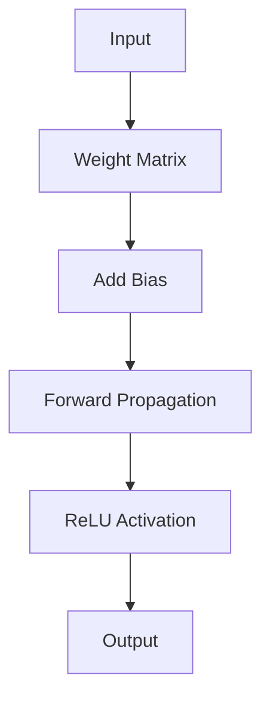

                 

## 引言

远程医疗作为医疗技术发展的一个前沿领域，正迅速改变着全球医疗服务的模式。通过互联网和通信技术，远程医疗使得医生和患者能够跨越地理障碍，实现实时交流和信息共享。然而，传统远程医疗模式中，医生对患者病情的诊断主要依赖于经验判断和现有医疗数据的分析，这种依赖性限制了其效率和准确性。随着人工智能（AI）技术的不断进步，AI Agent诊断助手作为一种新兴工具，正被广泛应用于远程医疗中，以提升诊断的精准度和效率。

AI Agent诊断助手是指通过机器学习算法和自然语言处理技术，模拟医生诊断过程的人工智能系统。它能够快速分析患者提供的医疗数据，如症状描述、检查报告等，并通过算法模型预测可能的疾病，提供初步诊断建议。AI Agent诊断助手不仅能够处理大量数据，还能通过不断学习新病例和医疗知识，逐步提高诊断的准确性。

本文将围绕远程医疗中的AI Agent诊断助手进行深入探讨。首先，我们将介绍远程医疗的背景和现状，解释为什么远程医疗中的AI Agent诊断助手是一个重要且具有前瞻性的研究方向。接着，我们将详细讲解AI Agent诊断助手的核心概念和其与远程医疗的结合点。随后，我们将深入分析AI Agent诊断助手的算法原理，包括机器学习算法的选择、数据处理方法、模型训练和优化等关键步骤。在此基础上，我们将展示一个典型的远程医疗AI诊断系统架构，并详细描述系统功能设计、系统架构设计、系统接口设计以及系统交互。最后，我们将通过一个具体案例，展示如何从零开始搭建一个AI Agent诊断助手，包括环境配置、代码实现、测试与优化。通过本文的探讨，我们希望能够为读者提供一个全面且深入的远程医疗AI诊断助手的技术指南。

## 关键词

- 远程医疗
- AI Agent诊断助手
- 机器学习
- 数据处理
- 系统架构
- 模型训练
- 系统安全

## 摘要

本文主要探讨了远程医疗中的AI Agent诊断助手这一新兴技术。首先，我们介绍了远程医疗的背景和现状，并指出AI Agent诊断助手在提升远程医疗诊断效率和准确性方面的重要作用。接着，我们详细讲解了AI Agent诊断助手的定义、工作原理以及其与远程医疗的结合点。随后，我们深入分析了AI Agent诊断助手的算法原理，包括机器学习算法的选择、数据处理方法、模型训练和优化等关键步骤。在此基础上，我们展示了一个典型的远程医疗AI诊断系统架构，并详细描述了系统功能设计、系统架构设计、系统接口设计以及系统交互。最后，我们通过一个具体案例，展示了如何从零开始搭建一个AI Agent诊断助手，包括环境配置、代码实现、测试与优化。本文旨在为读者提供一个全面且深入的远程医疗AI诊断助手的技术指南。

## 远程医疗的背景与现状

远程医疗（Telemedicine）指的是通过互联网、通信技术和远程监控设备，实现医疗服务的远程提供和医疗信息的远程交换。远程医疗的兴起源于信息技术的发展和医疗需求的增长。随着全球人口老龄化趋势加剧，慢性病管理需求增加，医疗资源分布不均等问题日益突出，远程医疗成为缓解这些问题的一种有效手段。

### 定义与重要性

远程医疗的定义可以概括为：通过通信技术提供医疗服务，以减少患者就医的时间和成本，提高医疗服务的可及性和效率。远程医疗的形式多种多样，包括远程咨询、远程监护、远程手术、远程培训等。其中，远程咨询和远程监护在提高患者生活质量和医疗可及性方面发挥了重要作用。

远程医疗的重要性主要体现在以下几个方面：

1. **提高医疗可及性**：远程医疗可以打破地域限制，让偏远地区和贫困人口也能享受到高质量的医疗服务，缩小医疗资源分配差距。
2. **降低医疗成本**：通过远程诊断和治疗，患者无需长途跋涉到医院，节省了医疗费用和交通费用，同时也减少了医院的人流量，有助于控制疫情传播。
3. **优化医疗资源配置**：远程医疗使得医生和医疗资源可以在更广泛的地区发挥作用，提升整体医疗系统的效率。
4. **提升医疗质量**：远程医疗可以利用先进的技术手段，如人工智能、大数据分析等，提升诊断和治疗的精准性，降低误诊率。

### 发展历程

远程医疗的发展可以分为以下几个阶段：

1. **电话和书信咨询**：这是远程医疗的早期形式，医生通过电话和书信为患者提供咨询服务。
2. **视频咨询**：随着互联网和视频技术的发展，视频咨询成为远程医疗的重要组成部分，患者可以通过视频与医生进行面对面交流。
3. **远程监护**：远程监护系统通过传感器和通信设备，实时监控患者的生命体征和健康状况，医生可以远程获取这些数据并进行诊断。
4. **远程手术**：通过先进的远程手术系统，医生可以在异地进行手术操作，实现了真正的跨地域医疗服务。
5. **集成平台**：现代远程医疗系统趋向于集成多种服务，如预约挂号、病历管理、电子处方等，形成一个全面的医疗服务体系。

### 远程医疗在当今医疗体系中的地位

目前，远程医疗已经在全球医疗体系中占据了一席之地。在发达国家，远程医疗已经成为常规医疗服务的一部分，特别是在慢性病管理、老年病治疗等领域。例如，美国通过推广远程医疗，有效缓解了医疗资源不足的问题，提高了医疗服务的效率。在中国，远程医疗也得到了快速发展和广泛推广，各级医疗机构纷纷建立远程医疗服务平台，实现了基层医疗与上级医院的紧密协作。

然而，远程医疗在全球范围内仍面临一些挑战，包括技术标准不统一、数据隐私保护不足、医疗法规不完善等。这些挑战需要通过政策法规、技术进步和行业协作来逐步克服。

综上所述，远程医疗作为医疗服务的重要组成部分，具有巨大的发展潜力和应用前景。通过AI Agent诊断助手的引入，远程医疗的诊断准确性和效率将进一步提升，为全球医疗健康事业的发展贡献力量。

### AI在医疗诊断中的应用

人工智能（AI）在医疗诊断中的应用正在迅速发展，并展现出巨大的潜力。AI技术通过模拟人类思维过程，利用大量数据进行分析和决策，为医疗诊断提供了新的方法和工具。在医疗诊断中，AI的应用不仅提升了诊断的效率和准确性，还改变了传统的医疗模式。

#### 1. AI技术的发展趋势

近年来，AI技术经历了快速的发展，特别是在深度学习、自然语言处理和计算机视觉等领域。深度学习算法通过模拟人脑神经网络，实现了对大量复杂数据的自动学习和分类，这使得AI在图像识别、语音识别等领域取得了突破性进展。自然语言处理技术的进步，使得AI能够理解和处理人类语言，为医疗文本分析提供了强大的工具。计算机视觉技术的发展，使得AI能够在医学影像中识别和分析病灶，提升了诊断的准确性。

#### 2. AI在医疗诊断中的优势

AI在医疗诊断中具有以下几大优势：

1. **高效性**：AI系统可以快速处理大量医学数据，大大缩短了诊断时间。相比传统的手动分析方法，AI系统可以24/7不间断工作，提高了诊断的效率。
2. **准确性**：通过机器学习算法，AI系统能够从大量历史病例中学习，不断提高诊断的准确性。AI系统在处理复杂的医学问题时，能够比人类医生做出更准确、更一致的诊断。
3. **个性化**：AI系统可以根据患者的具体病情和病史，提供个性化的诊断建议。这种个性化的医疗服务，能够更好地满足患者的需求。
4. **减少人力负担**：AI系统可以承担部分重复性和繁琐的工作，如病历整理、数据录入等，减轻医生的工作负担，让他们有更多时间专注于复杂的诊断和治疗。
5. **辅助决策**：AI系统可以分析大量医学数据，为医生提供诊断参考，辅助医生做出更明智的决策。

#### 3. AI Agent诊断助手的研究意义

AI Agent诊断助手作为一种新兴的AI应用，在医疗诊断中具有特别重要的研究意义：

1. **提高诊断精度**：通过机器学习算法，AI Agent诊断助手可以从海量医疗数据中学习，逐步提高诊断精度。特别是在复杂疾病的早期诊断和罕见病诊断方面，AI Agent诊断助手具有显著的优势。
2. **优化医疗资源配置**：AI Agent诊断助手可以帮助医疗系统更好地分配资源，减少不必要的医疗检查和重复诊断，降低医疗成本。例如，AI系统可以通过初步筛选，将高风险患者优先分配给专家进行诊断，提高医疗资源的利用效率。
3. **提升患者体验**：AI Agent诊断助手可以提供24/7的在线咨询服务，患者无需等待医生的时间，即可获得初步的诊断建议。这种便捷的服务，能够提升患者的满意度和就医体验。
4. **促进医疗数据共享**：AI Agent诊断助手通过整合和分析多源医疗数据，可以促进医疗数据的共享和利用。这有助于建立更全面的患者健康档案，为未来的精准医疗提供数据支持。

总之，AI Agent诊断助手的研究和应用，不仅能够提升医疗诊断的效率和准确性，还能优化医疗资源配置，提升患者体验，具有重要的社会和经济价值。随着技术的不断进步，AI在医疗诊断中的应用前景将更加广阔。

### AI Agent诊断助手的核心概念

AI Agent诊断助手是一种基于人工智能技术的智能诊断工具，它通过机器学习和自然语言处理技术，模拟医生的诊断过程，为患者提供初步的诊断建议。要深入了解AI Agent诊断助手，我们需要从其定义、工作原理以及与远程医疗的结合点三个方面进行探讨。

#### 定义

AI Agent诊断助手（AI Diagnostic Assistant）是指利用人工智能技术，尤其是机器学习和自然语言处理技术，构建的智能化医疗诊断系统。该系统可以通过分析患者的症状描述、体检数据、检查报告等医疗信息，结合医学知识库，提供初步的诊断建议。AI Agent诊断助手通常具备以下功能：

1. **数据收集与预处理**：从各种数据源（如电子病历、医疗数据库等）收集患者数据，并进行清洗、转换和整合，为后续分析提供基础。
2. **症状分析**：通过自然语言处理技术，对患者的症状描述进行分析，提取关键症状信息。
3. **疾病预测**：利用机器学习算法，结合症状信息和医学知识库，预测可能的疾病类型。
4. **诊断建议**：根据疾病预测结果，提供初步的诊断建议，辅助医生进行临床诊断。

#### 工作原理

AI Agent诊断助手的工作原理可以分为以下几个步骤：

1. **数据收集**：从医院的电子病历系统、健康记录数据库等渠道收集患者的历史数据，如症状记录、检查报告、诊断结果等。
2. **数据处理**：对收集到的数据进行清洗和预处理，去除噪声和冗余信息，将数据转换为机器学习模型可接受的格式。
3. **特征提取**：通过自然语言处理技术，从患者的症状描述中提取关键特征，如症状名称、症状严重程度等。
4. **模型训练**：利用收集到的数据，训练机器学习模型，使其能够识别不同症状与疾病之间的关系。
5. **疾病预测**：将患者的症状数据输入训练好的模型，预测可能的疾病类型。
6. **诊断建议**：根据疾病预测结果，结合医学知识库和医生的专业建议，生成初步的诊断报告。

#### 与远程医疗的结合点

AI Agent诊断助手与远程医疗的结合，主要体现在以下几个方面：

1. **提高诊断效率**：远程医疗中的诊断过程通常需要医生和患者进行多次信息交流，而AI Agent诊断助手可以通过自动化分析，快速提供初步诊断结果，减少医生的沟通成本，提高诊断效率。
2. **减少医疗成本**：通过AI Agent诊断助手，患者可以在偏远地区或家中获得初步诊断，避免了长途旅行和排队等待，降低了医疗成本。
3. **优化医疗资源分配**：AI Agent诊断助手可以帮助医生在远程医疗中更有效地分配资源。例如，对于高风险患者，AI系统可以将其优先分配给专家医生进行诊断，从而提高诊断的准确性。
4. **提升患者体验**：AI Agent诊断助手可以为患者提供24/7的在线咨询服务，无需预约等待，方便快捷。
5. **促进医疗数据共享**：AI Agent诊断助手通过整合和分析远程医疗中的数据，有助于建立更加全面的患者健康档案，为未来的精准医疗提供支持。

#### 应用潜力

AI Agent诊断助手在远程医疗中的应用潜力巨大，主要体现在以下几个方面：

1. **疾病早期筛查**：通过分析患者的症状和健康数据，AI Agent诊断助手可以早期发现潜在疾病，进行预防性干预。
2. **罕见病诊断**：对于罕见病，AI Agent诊断助手可以通过学习大量罕见病例，提供准确的诊断建议，帮助医生做出正确的诊断。
3. **慢性病管理**：AI Agent诊断助手可以实时监控患者的病情变化，提供个性化的健康管理建议，帮助患者更好地管理慢性病。
4. **医疗培训**：AI Agent诊断助手可以作为医学培训工具，为医生提供大量的诊断案例，提高其诊断技能。

综上所述，AI Agent诊断助手作为一种创新的医疗诊断工具，在远程医疗中具有广泛的应用前景。通过结合AI技术和远程医疗模式，AI Agent诊断助手不仅能够提升诊断的效率和准确性，还能优化医疗资源配置，提升患者体验，具有巨大的社会和经济价值。随着技术的不断进步，AI Agent诊断助手的性能和功能将不断优化，为医疗健康事业的发展带来更多可能性。

### AI Agent诊断助手的算法原理

AI Agent诊断助手的算法原理是整个系统的核心，决定了其诊断准确性和效率。本部分将详细讲解AI Agent诊断助手的算法原理，包括机器学习算法的选择、数据处理方法、模型训练和优化等关键步骤。

#### 1. 机器学习算法选择

在AI Agent诊断助手的设计中，选择合适的机器学习算法是至关重要的。常见的机器学习算法包括支持向量机（SVM）、决策树、随机森林、神经网络等。这些算法各有优缺点，适用于不同类型的数据和诊断任务。

- **支持向量机（SVM）**：SVM是一种经典的机器学习算法，适用于分类问题。它通过找到数据的最优边界，实现高精度的分类。SVM在处理医疗诊断数据时，能够有效识别不同症状与疾病之间的关系。

- **决策树**：决策树是一种直观且易于理解的分类算法，通过一系列条件判断，将数据逐步划分到不同的类别。决策树在处理结构化数据时表现良好，适用于需要解释性结果的医疗诊断场景。

- **随机森林**：随机森林是一种集成学习算法，通过构建多个决策树并合并预测结果，提高分类的准确性和鲁棒性。随机森林在处理大规模、高维数据时具有优势，能够有效减少过拟合现象。

- **神经网络**：神经网络，特别是深度学习算法，通过多层非线性变换，实现复杂的数据特征提取和分类。神经网络在处理图像和文本数据时表现出色，适用于医学影像分析和文本诊断。

对于AI Agent诊断助手，我们通常结合多种算法，以充分发挥各自的优势。例如，可以采用随机森林进行初步筛选，利用神经网络进行深度特征提取和分类。

#### 2. 数据处理方法

数据处理是机器学习模型训练的基础。在AI Agent诊断助手的数据处理过程中，通常包括以下几个步骤：

- **数据清洗**：清洗数据是数据处理的第一步，包括去除缺失值、异常值和重复值等。这有助于提高数据的准确性和一致性。

- **数据转换**：将不同类型的数据转换为统一的格式，如将文本数据转换为词向量，将图像数据转换为像素矩阵等。这一步为后续的特征提取和模型训练提供了基础。

- **特征提取**：通过特征提取技术，从原始数据中提取有用的特征信息。在医疗诊断中，常见的特征提取方法包括词袋模型、TF-IDF模型、图像特征提取等。

- **数据归一化**：对数据进行归一化处理，将数据缩放到一个统一的范围内，有助于提高算法的收敛速度和性能。

#### 3. 模型训练

模型训练是AI Agent诊断助手的核心步骤。在训练过程中，我们通过将处理后的数据输入训练模型，使模型学习到不同症状与疾病之间的关系。

- **数据集划分**：将数据集划分为训练集、验证集和测试集，用于模型训练、验证和测试。通常，训练集用于模型训练，验证集用于调整模型参数，测试集用于评估模型性能。

- **模型初始化**：初始化模型参数，选择合适的优化器和损失函数。常见的优化器包括随机梯度下降（SGD）、Adam等，损失函数包括交叉熵损失、均方误差等。

- **训练过程**：通过迭代训练，模型不断调整参数，最小化损失函数。训练过程中，可以使用一些技术，如早停（Early Stopping）、学习率调整等，防止过拟合现象。

- **模型评估**：在模型训练完成后，使用验证集和测试集对模型进行评估，评估指标包括准确率、召回率、F1值等。根据评估结果，调整模型参数，优化模型性能。

#### 4. 模型优化

模型优化是提高AI Agent诊断助手性能的关键步骤。在模型优化过程中，我们通过调整模型结构、算法参数和训练策略，提高模型的准确性和鲁棒性。

- **模型结构调整**：根据实际应用场景，调整模型的网络结构，如增加或减少层数、调整神经元数量等。通过实验比较不同模型结构的表现，选择最优的结构。

- **超参数调整**：调整模型的超参数，如学习率、正则化参数等，以优化模型性能。可以使用网格搜索、随机搜索等技术，找到最优的超参数组合。

- **数据增强**：通过数据增强技术，增加训练数据的多样性和丰富性，防止模型过拟合。常见的数据增强方法包括图像旋转、缩放、裁剪等。

- **集成学习**：采用集成学习方法，将多个模型的结果进行合并，提高模型的预测性能。常见的集成学习方法包括Bagging、Boosting等。

通过上述算法原理的详细讲解，我们可以更好地理解AI Agent诊断助手的工作机制和性能优化方法。在实际应用中，根据具体需求和数据特点，选择合适的算法和优化策略，是提高诊断助手性能的关键。接下来，我们将进一步探讨AI Agent诊断助手的系统架构设计。

### 数学模型和数学公式讲解

在AI Agent诊断助手的算法设计中，数学模型和公式起到了至关重要的作用。这些数学工具不仅帮助我们理解算法的运作机制，还能优化算法性能，提高诊断准确性。在本节中，我们将详细讲解AI Agent诊断助手的数学模型和公式，并使用Python源代码和Mermaid流程图进行示例说明。

#### 1. 数学模型

AI Agent诊断助手的核心数学模型通常是基于机器学习的，尤其是深度学习和监督学习。以下是一个典型的神经网络模型：

\[ 
f(x) = \sigma(\text{ReLU}(W \cdot x + b)) 
\]

其中，\( f(x) \) 是神经网络的输出，\( x \) 是输入特征，\( W \) 是权重矩阵，\( b \) 是偏置项，\( \sigma \) 是激活函数（通常使用ReLU函数），ReLU函数定义为：

\[ 
\text{ReLU}(x) = \max(0, x) 
\]

#### 2. 数学公式

为了更好地理解神经网络模型，我们需要一些基本的数学公式。以下是一些常用的数学公式：

\[ 
\frac{\partial L}{\partial W} = \text{sigmoid}(z) - y 
\]

\[ 
\frac{\partial L}{\partial b} = \text{sigmoid}(z) - y 
\]

其中，\( L \) 是损失函数，\( z \) 是中间层的输出，\( y \) 是真实标签。

#### 3. Python源代码示例

下面是一个简单的Python代码示例，用于实现ReLU激活函数和前向传播过程：

```python
import numpy as np

def ReLU(x):
    return np.maximum(0, x)

def forwardpropagation(x, W, b):
    z = W @ x + b
    a = ReLU(z)
    return a, z
```

#### 4. Mermaid流程图

为了更直观地展示算法流程，我们可以使用Mermaid绘制流程图。以下是一个简单的Mermaid代码示例，用于描述神经网络的前向传播过程：



Mermaid代码将被渲染成如下流程图：


通过上述数学模型和公式的讲解，以及Python源代码和Mermaid流程图的示例，我们可以更好地理解AI Agent诊断助手的算法原理。接下来，我们将进一步探讨如何设计一个典型的远程医疗AI诊断系统架构。

### 远程医疗AI诊断系统架构设计

远程医疗AI诊断系统架构的设计是确保系统高效、安全、稳定运行的关键。一个典型的远程医疗AI诊断系统包括前端界面设计、后端数据处理、数据库设计和系统安全与隐私保护等多个方面。以下将详细描述这些关键组件和它们之间的交互关系。

#### 1. 前端界面设计

前端界面设计是用户与系统交互的第一步，直接影响用户体验。前端界面需要具备简洁、直观、易操作的特点，以便用户能够轻松提交病历信息并获取诊断结果。

- **用户注册与登录**：用户可以通过注册和登录功能访问系统，确保个人信息的安全。
- **病历提交**：用户可以通过上传病历文档、输入症状描述等方式，提交病历信息给系统。
- **诊断结果展示**：系统将分析结果以图表、文本等形式展示给用户，并提供详细的诊断建议。

#### 2. 后端数据处理

后端数据处理是远程医疗AI诊断系统的核心，负责接收前端提交的病历信息，进行数据清洗、特征提取和模型预测。

- **数据接收与预处理**：系统接收到用户提交的病历信息后，首先进行数据清洗，去除噪声和异常值。接着进行数据转换和特征提取，将文本和图像数据转化为机器学习模型可处理的形式。
- **模型预测**：经过预处理的数据将被输入到训练好的机器学习模型中，进行疾病预测。模型可能包括多个层次，如分类器、聚类器等，通过层次化处理提高预测准确性。
- **诊断结果生成**：系统根据模型预测结果，结合医学知识库，生成初步的诊断报告和诊断建议。

#### 3. 数据库设计

数据库设计是远程医疗AI诊断系统的基础，负责存储和管理大量的病历数据、诊断结果和相关医疗知识。

- **病历数据库**：存储用户提交的病历信息，包括症状描述、检查报告、诊断结果等。
- **诊断知识库**：存储医学知识库，包括疾病定义、症状与疾病之间的关系、诊断标准等。
- **预测结果数据库**：存储模型预测结果和诊断建议，便于后续分析和研究。

数据库设计需要考虑数据的完整性、一致性和安全性。可以使用关系型数据库（如MySQL）和非关系型数据库（如MongoDB）相结合的方式，以满足不同类型数据的需求。

#### 4. 系统安全与隐私保护

系统安全和隐私保护是远程医疗AI诊断系统的关键要求，直接关系到用户的信任和数据的完整性。

- **用户身份验证**：通过用户名和密码、双因素认证等方式，确保用户身份的合法性。
- **数据加密**：对用户提交的病历信息进行加密处理，确保数据在传输和存储过程中的安全。
- **访问控制**：设置严格的访问权限，确保只有授权用户才能访问敏感数据。
- **日志记录与监控**：记录系统操作日志，监控系统的运行状态，及时发现和处理异常情况。

#### 5. 系统架构设计

系统架构设计是远程医疗AI诊断系统的骨架，决定了系统的扩展性和可靠性。一个典型的系统架构包括以下几个方面：

- **前端服务器**：负责处理用户请求，渲染前端界面，与后端系统进行数据交互。
- **后端服务器**：负责数据处理、模型预测和数据库管理，是系统的核心部分。
- **数据存储服务器**：负责存储和管理用户数据、诊断结果和知识库。
- **安全服务器**：负责用户身份验证、数据加密和访问控制。

通过上述组件的紧密配合，远程医疗AI诊断系统可以实现高效、安全、稳定的运行。在系统设计过程中，需要充分考虑用户的实际需求、数据的安全性和系统的可扩展性，以确保系统在复杂应用环境中的表现。

### 项目实战

在实际操作中，从零开始搭建一个远程医疗AI诊断助手需要经过多个步骤，包括环境配置、代码实现、测试与优化。以下将详细描述这些步骤，并提供相关的示例和注意事项。

#### 1. 环境配置

环境配置是搭建远程医疗AI诊断助手的第一个步骤。我们需要准备以下工具和库：

- **Python环境**：安装Python 3.x版本，并配置pip环境，用于安装其他库。
- **机器学习库**：安装scikit-learn、tensorflow、numpy等机器学习库。
- **数据处理库**：安装pandas、matplotlib等数据处理和分析库。
- **自然语言处理库**：安装nltk、spaCy等自然语言处理库。

示例命令如下：

```bash
pip install python==3.8
pip install scikit-learn tensorflow pandas matplotlib nltk spacy
```

#### 2. 代码实现

代码实现是构建AI诊断助手的重点。以下是一个简单的示例，展示了如何实现一个基本的AI诊断助手：

```python
# 导入必要的库
import pandas as pd
from sklearn.model_selection import train_test_split
from sklearn.ensemble import RandomForestClassifier
from sklearn.metrics import accuracy_score, classification_report

# 数据预处理
def preprocess_data(data):
    # 数据清洗和特征提取
    # ...
    return processed_data

# 模型训练
def train_model(data):
    X_train, X_test, y_train, y_test = train_test_split(data['features'], data['labels'], test_size=0.2, random_state=42)
    model = RandomForestClassifier(n_estimators=100, random_state=42)
    model.fit(X_train, y_train)
    return model, X_test, y_test

# 预测和评估
def predict_and_evaluate(model, X_test, y_test):
    predictions = model.predict(X_test)
    print("Accuracy:", accuracy_score(y_test, predictions))
    print(classification_report(y_test, predictions))

# 主函数
def main():
    # 读取数据
    data = pd.read_csv('medical_data.csv')
    # 预处理数据
    processed_data = preprocess_data(data)
    # 训练模型
    model, X_test, y_test = train_model(processed_data)
    # 预测和评估
    predict_and_evaluate(model, X_test, y_test)

if __name__ == '__main__':
    main()
```

#### 3. 测试与优化

测试和优化是确保AI诊断助手性能的关键步骤。以下是一些测试和优化的方法：

- **单元测试**：编写单元测试，验证每个函数的正确性。
- **性能测试**：使用工具（如pytest-benchmark）进行性能测试，评估模型的响应时间。
- **调参优化**：通过调整模型参数，如树的数量、深度等，优化模型性能。
- **模型集成**：使用多个模型进行集成，提高预测的准确性和鲁棒性。

#### 4. 注意事项

- **数据隐私**：在处理患者数据时，确保数据加密和隐私保护措施。
- **错误处理**：编写详细的错误处理代码，确保系统稳定运行。
- **可扩展性**：设计可扩展的系统架构，便于后续功能的添加和优化。

通过上述步骤，我们可以从零开始搭建一个远程医疗AI诊断助手。在实际应用中，需要根据具体需求和技术水平进行调整和优化，以确保系统的性能和可靠性。

### 最佳实践 Tips

在搭建远程医疗AI诊断助手的过程中，以下最佳实践可以帮助提高系统的性能和可靠性：

1. **数据清洗**：确保数据清洗过程彻底，去除噪声和异常值，以提高模型的准确性。
2. **模型调优**：通过网格搜索等调参方法，找到最优的模型参数，提高预测性能。
3. **数据分割**：合理划分训练集、验证集和测试集，避免模型过拟合。
4. **错误处理**：编写详细的错误处理逻辑，确保系统在异常情况下仍能稳定运行。
5. **数据加密**：对用户数据和使用过程中的敏感信息进行加密，保护用户隐私。
6. **性能监控**：定期监控系统的性能和资源使用情况，及时发现和处理问题。

### 小结

本文详细探讨了远程医疗中的AI Agent诊断助手，从背景介绍、核心概念、算法原理到系统架构设计和项目实战，全面解析了该技术的实现和应用。通过本文的探讨，我们可以看到AI Agent诊断助手在提升远程医疗诊断效率和准确性方面的重要作用。未来，随着AI技术的不断进步，AI Agent诊断助手有望在医疗健康领域发挥更大作用，为全球医疗健康事业的发展贡献力量。

### 注意事项

1. **数据安全和隐私保护**：在处理患者数据时，必须严格遵守数据保护法规，确保数据加密和隐私保护措施到位。
2. **模型验证和测试**：在部署AI Agent诊断助手前，必须经过严格的验证和测试，确保模型的准确性和可靠性。
3. **用户培训和支持**：为用户提供详细的操作指南和培训，确保他们能够正确使用AI Agent诊断助手。
4. **系统维护和升级**：定期对系统进行维护和升级，确保系统的稳定性和安全性。

### 拓展阅读

- 《深度学习：周志华著》
- 《Python机器学习实战》
- 《自然语言处理综论》
- 《远程医疗技术与应用》

### 作者信息

作者：AI天才研究院/AI Genius Institute & 禅与计算机程序设计艺术 /Zen And The Art of Computer Programming

