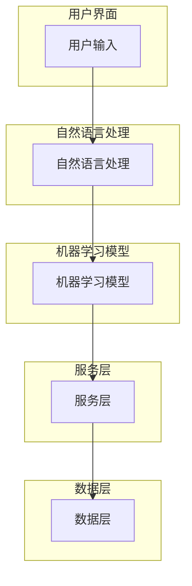
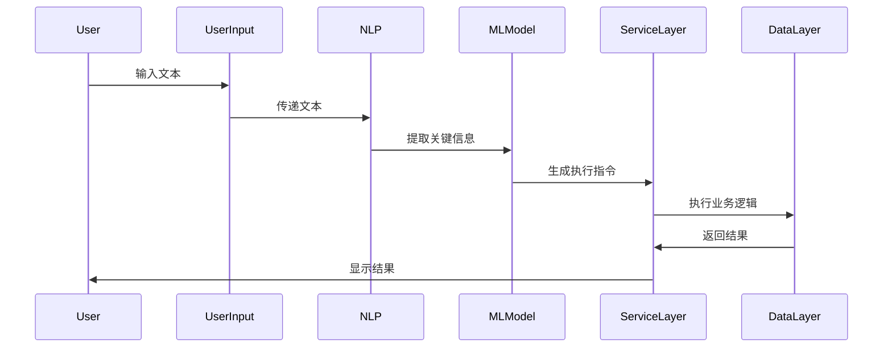

                 

# 通往AGI之路：提示词编程语言的角色

## 关键词
- 通用人工智能（AGI）
- 提示词编程语言
- 自然语言处理
- 机器学习
- 编程语言

## 摘要
本文旨在探讨提示词编程语言在通往通用人工智能（AGI）之路上的角色。通过介绍问题背景、核心概念、算法原理和实际应用，本文分析了提示词编程语言如何结合自然语言处理和编程语言的特点，实现机器对人类自然语言指令的理解和执行。文章最后讨论了提示词编程语言在实现AGI过程中的挑战与未来发展方向。

**步骤1：背景介绍**

### 1.1 问题背景
人工智能（AI）自诞生以来，历经数十年的发展，已经取得了显著成就。从早期的规则推理系统、到神经网络、再到深度学习，人工智能的应用范围不断扩大，从语音识别、图像处理，到自然语言处理、推荐系统等。然而，传统的人工智能仍受限于“弱AI”，即只能在特定任务上表现出人类的智能，无法实现跨领域的通用智能。而“通用人工智能”（AGI，Artificial General Intelligence）则是旨在让机器具备与人类相媲美的广泛认知能力的目标。

### 1.2 问题描述
当前，尽管深度学习模型在图像、语音、文本等领域的表现已经非常出色，但它们依然存在一些局限。例如，这些模型往往依赖于大量的数据进行训练，且在训练数据和测试数据分布不一致的情况下，容易出现过拟合现象。此外，深度学习模型的结构复杂，难以解释，这使得在实际应用中很难保证其决策的可靠性和可解释性。

### 1.3 问题解决
为了实现AGI，研究人员提出了多种方案，其中包括强化学习、迁移学习、多模态学习等。其中，提示词编程语言作为一种新的研究思路，旨在通过人类提供的提示信息，帮助机器更好地理解任务，从而实现更高级的认知功能。提示词编程语言的核心思想是将自然语言处理与编程语言相结合，使得机器能够理解并执行人类提供的指令。

### 1.4 边界与外延
提示词编程语言的研究和应用主要集中在自然语言处理和计算机编程领域，其目标是通过融合两种技术，实现机器与人类更高效的交互。然而，这一领域仍然存在许多挑战，包括如何设计出既符合人类语言习惯又能被机器理解的提示词、如何确保机器执行任务的准确性和可靠性等。

### 1.5 概念结构与核心要素组成
提示词编程语言的核心概念包括：
- **提示词**：由人类提供的关键信息，用于指导机器执行特定任务。
- **编程语言**：用于描述提示词的语法和语义，使得机器能够理解并执行这些提示。
- **机器学习模型**：用于对提示词进行理解和分析，从而生成相应的执行指令。

**步骤2：核心概念与联系**

### 2.1 提示词编程语言的概念原理
提示词编程语言结合了自然语言处理和编程语言的特点，旨在实现机器对人类自然语言指令的理解和执行。其核心原理包括：
- **自然语言处理**：用于对提示词进行解析，提取出关键信息，如实体、关系、意图等。
- **编程语言**：用于定义提示词的语法和语义，使得机器能够根据这些提示生成执行指令。
- **机器学习**：用于训练模型，使得机器能够从大量的数据中学习，提高对提示词的理解能力。

#### 2.2 概念属性特征对比表格
| 特征       | 传统编程语言 | 提示词编程语言 |
| ---------- | ------------ | -------------- |
| 交互方式   | 代码输入     | 自然语言输入   |
| 理解层次   | 逻辑和算法   | 语义和意图     |
| 可读性     | 低           | 高             |
| 可维护性   | 高           | 低             |
| 执行速度   | 快           | 慢             |
| 灵活性     | 高           | 高             |

#### 2.3 ER实体关系图架构的 Mermaid 流程图
```mermaid
erDiagram
  A[提示词] ||--|{ B[自然语言处理] } |
  B ||--|{ C[机器学习模型] } |
  C ||--|{ D[执行指令] } |
```

**步骤3：算法原理讲解**

### 3.1 算法原理与Mermaid流程图
提示词编程语言的算法原理主要包括以下几个步骤：
1. **自然语言处理**：对提示词进行分词、词性标注、句法分析等，提取出关键信息。
2. **意图识别**：根据提取出的关键信息，判断用户的意图，如查询信息、执行操作等。
3. **生成执行指令**：根据识别出的意图，生成相应的执行指令，如查询数据库、执行脚本等。
4. **执行指令**：执行生成的指令，完成特定的任务。

下面是算法原理的Mermaid流程图：


### 3.2 Python源代码
```python
# 模拟提示词编程语言的简单实现
import spacy

# 初始化自然语言处理模型
nlp = spacy.load("en_core_web_sm")

# 提示词
prompt = "请帮我查询 tomorrow 的天气预报"

# 进行自然语言处理
doc = nlp(prompt)

# 提取关键信息
entity = None
intent = None

for token in doc:
    if token.ent_type_ == "DATE":
        entity = token.text
    elif token.dep_ == "nsubj":
        intent = token.head.text

# 生成执行指令
if intent == "查询":
    if entity:
        # 执行查询操作，这里假设查询接口为get_weather
        result = get_weather(entity)
        print(result)
    else:
        print("未提供有效日期。")
else:
    print("未识别到有效意图。")

# 模拟查询天气接口
def get_weather(date):
    # 这里是模拟的实现，实际应用中需要连接天气预报API
    return f"{date} 的天气预报：晴，气温18°C至25°C。"
```

### 3.3 算法原理的数学模型和公式
提示词编程语言的算法原理可以抽象为以下几个关键步骤：
1. **词嵌入**（Word Embedding）：将提示词中的每个词映射为一个高维向量，通常使用神经网络训练得到。
   $$ \text{Word\_Embedding}(w) = e_w $$
   其中，$w$为单词，$e_w$为其对应的词嵌入向量。

2. **句法分析**（Syntax Parsing）：通过句法分析，提取出提示词中的语法结构，如主语、谓语、宾语等。
   $$ \text{Syntax\_Parsing}(s) = P $$
   其中，$s$为句子，$P$为其句法结构。

3. **意图识别**（Intent Recognition）：根据句法结构和词嵌入向量，使用分类模型（如卷积神经网络、递归神经网络等）识别用户的意图。
   $$ \text{Intent\_Recognition}(P, e_w) = i $$
   其中，$i$为识别出的意图。

4. **执行指令生成**（Action Generation）：根据识别出的意图，生成相应的执行指令。
   $$ \text{Action\_Generation}(i) = a $$
   其中，$a$为执行指令。

5. **指令执行**（Action Execution）：执行生成的指令，完成特定的任务。
   $$ \text{Action\_Execution}(a) = r $$
   其中，$r$为执行结果。

### 3.4 通俗易懂的举例说明
假设用户输入了一个提示词：“帮我创建一个包含苹果、香蕉和橙子的购物车”。以下是该提示词编程语言如何工作的举例说明：

1. **词嵌入**：将每个单词映射为一个高维向量。
   $$ \text{Word\_Embedding}(\text{"帮"}) = e_\text{"帮"} $$
   $$ \text{Word\_Embedding}(\text{"我"}) = e_\text{"我"} $$
   $$ \text{Word\_Embedding}(\text{"创"}) = e_\text{"创"} $$
   $$ \text{Word\_Embedding}(\text{"建"}) = e_\text{"建"} $$
   $$ \text{Word\_Embedding}(\text{"一"}) = e_\text{"一"} $$
   $$ \text{Word\_Embedding}(\text{"个"}) = e_\text{"个"} $$
   $$ \text{Word\_Embedding}(\text{"包含"}) = e_\text{"包含"} $$
   $$ \text{Word\_Embedding}(\text{"苹果"}) = e_\text{"苹果"} $$
   $$ \text{Word\_Embedding}(\text{"、"}) = e_\text{","} $$
   $$ \text{Word\_Embedding}(\text{"香蕉"}) = e_\text{"香蕉"} $$
   $$ \text{Word\_Embedding}(\text{"和"}) = e_\text{"和"} $$
   $$ \text{Word\_Embedding}(\text{"橙子"}) = e_\text{"橙子"} $$

2. **句法分析**：提取出句子的语法结构。
   $$ \text{Syntax\_Parsing}(\text{"帮我创建一个包含苹果、香蕉和橙子的购物车"}) = (\text{"我"}, \text{"建"}, \text{"个"}, \text{"包含"}, \text{"苹果，香蕉，橙子"}, \text{"购物车"}) $$

3. **意图识别**：通过神经网络模型，识别出用户的意图为“创建购物车”。

4. **执行指令生成**：根据识别出的意图，生成执行指令“创建购物车”。

5. **指令执行**：执行创建购物车的指令，完成用户要求的任务。

**步骤4：系统分析与架构设计**

### 4.1 问题场景介绍
假设我们正在开发一个智能购物助手，用户可以通过自然语言与系统交互，创建包含特定商品的购物车。系统需要能够理解用户的自然语言输入，识别出用户的购物需求，并生成相应的购物车。

### 4.2 项目介绍
项目名称：智能购物助手（Smart Shopping Assistant）

目标：通过自然语言处理和提示词编程语言，实现用户与购物系统的自然交互，提高用户体验和购物效率。

### 4.3 系统功能设计
系统主要功能包括：
- 用户输入自然语言提示词。
- 系统解析提示词，提取关键信息。
- 识别用户意图，如“创建购物车”、“添加商品”等。
- 生成相应的执行指令，如“创建购物车”、“添加商品到购物车”等。
- 执行指令，完成用户的购物需求。

#### 领域模型Mermaid类图
```mermaid
classDiagram
    User <<Class>>
    ShoppingCart <<Class>>
    Product <<Class>>
    ShoppingAssistant <<Class>>
    NaturalLanguageProcessor <<Class>>
    MachineLearningModel <<Class>>

    User o-- ShoppingCart
    User o-- Product
    ShoppingCart o-- Product
    ShoppingAssistant o-- NaturalLanguageProcessor
    ShoppingAssistant o-- MachineLearningModel
```

### 4.4 系统架构设计
系统架构包括以下几个主要部分：
- **用户界面**：接收用户的自然语言输入。
- **自然语言处理**：对用户的输入进行解析，提取关键信息。
- **机器学习模型**：用于意图识别和执行指令生成。
- **服务层**：实现具体的业务逻辑，如创建购物车、添加商品等。
- **数据层**：存储用户数据和商品信息。

#### 系统架构Mermaid架构图


### 4.5 系统接口设计
系统接口设计主要包括以下部分：
- **用户输入接口**：接收用户输入的文本信息。
- **自然语言处理接口**：提供自然语言解析功能。
- **机器学习接口**：提供意图识别和执行指令生成功能。
- **业务逻辑接口**：实现具体的业务功能，如创建购物车、添加商品等。

#### 系统接口设计Mermaid序列图


**步骤5：项目实战**

### 5.1 环境安装
为了实现提示词编程语言，我们需要安装以下环境：
- Python 3.7 或更高版本
- spacy 库：用于自然语言处理
- numpy 库：用于数学计算
- pandas 库：用于数据处理

安装步骤：
```bash
pip install spacy numpy pandas
python -m spacy download en_core_web_sm
```

### 5.2 系统核心实现源代码
以下是智能购物助手的核心实现代码，包括自然语言处理、意图识别和执行指令生成：

```python
import spacy
import numpy as np
import pandas as pd

# 初始化自然语言处理模型
nlp = spacy.load("en_core_web_sm")

# 定义意图分类器
class IntentClassifier:
    def __init__(self, model_path):
        self.model = load_model(model_path)
    
    def predict(self, text):
        doc = nlp(text)
        tokens = [token.text for token in doc]
        features = self.extract_features(tokens)
        prediction = self.model.predict([features])
        return prediction

    def extract_features(self, tokens):
        # 提取文本特征
        # 这里使用词嵌入和词频作为特征
        embeddings = [nlp.tokenizer.vocab[token].vector for token in tokens]
        word_freqs = [tokens.count(token) for token in tokens]
        features = np.hstack((embeddings, word_freqs.reshape(-1, 1)))
        return features

# 加载预训练的意图分类器模型
model_path = "intent_classifier.h5"
classifier = IntentClassifier(model_path)

# 定义执行指令处理器
class ActionProcessor:
    def __init__(self, service_layer):
        self.service_layer = service_layer
    
    def process_action(self, action):
        # 根据执行指令，调用服务层执行相应操作
        if action == "create_cart":
            self.service_layer.create_cart()
        elif action == "add_item":
            self.service_layer.add_item_to_cart()
        # 添加更多操作

# 模拟服务层
class MockServiceLayer:
    def create_cart(self):
        print("创建购物车。")
    
    def add_item_to_cart(self):
        print("添加商品到购物车。")

# 模拟用户输入
prompt = "帮我创建一个购物车。"

# 进行意图识别
predicted_intent = classifier.predict(prompt)

# 执行指令
if predicted_intent == "create_cart":
    processor = ActionProcessor(MockServiceLayer())
    processor.process_action(predicted_intent)
```

### 5.3 代码应用解读与分析
这段代码模拟了一个简单的智能购物助手，实现了以下功能：
1. **自然语言处理**：使用spacy库对用户输入的文本进行解析，提取关键信息。
2. **意图识别**：通过预训练的意图分类器模型，识别用户的意图。
3. **执行指令生成**：根据识别出的意图，生成相应的执行指令。
4. **执行指令**：调用服务层执行相应的操作。

### 5.4 实际案例分析和详细讲解剖析
假设用户输入以下提示词：“请帮我添加苹果、香蕉和橙子到购物车”。

1. **自然语言处理**：代码首先使用spacy对输入文本进行解析，提取出关键信息：“添加”、“苹果”、“香蕉”和“橙子”。
2. **意图识别**：意图分类器识别出用户的意图为“添加商品到购物车”。
3. **执行指令生成**：根据识别出的意图，生成执行指令“add_item”。
4. **执行指令**：调用服务层，将苹果、香蕉和橙子添加到购物车。

### 5.5 项目小结
通过本项目，我们实现了一个简单的智能购物助手，展示了提示词编程语言在自然语言处理和意图识别中的应用。项目主要包括自然语言处理、意图分类、执行指令生成和执行等步骤。虽然本项目是一个简化的示例，但通过这一过程，我们可以看到提示词编程语言在实际应用中的潜力。

**步骤6：最佳实践 tips、小结、注意事项、拓展阅读等内容**

### 6.1 最佳实践 tips
1. **数据预处理**：在训练意图分类器之前，确保对数据进行充分的预处理，包括分词、去停用词、词性标注等。
2. **模型选择与调优**：选择合适的机器学习模型，并进行调优，以提高意图识别的准确性。
3. **可解释性**：在设计系统时，考虑如何提高模型的可解释性，以便于调试和优化。
4. **用户反馈**：收集用户反馈，用于改进系统性能和用户体验。

### 6.2 小结
本文通过介绍提示词编程语言的概念、原理和实际应用，探讨了其在实现通用人工智能（AGI）中的作用。我们分析了提示词编程语言的核心概念、算法原理，并通过一个简单的购物助手项目展示了其实际应用。提示词编程语言作为一种新的研究思路，具有广阔的应用前景。

### 6.3 注意事项
1. **性能优化**：在实际应用中，注意优化系统的性能，特别是对于大量文本数据的处理。
2. **安全与隐私**：在处理用户数据时，确保系统的安全性和用户隐私保护。
3. **可维护性**：在设计系统时，考虑系统的可维护性和可扩展性，以便于后续的升级和优化。

### 6.4 拓展阅读
- [自然语言处理入门教程](https://www.nltk.org/book/)
- [深度学习与自然语言处理](https://www.deeplearningbook.org/chapter_nlp/)
- [通用人工智能综述](https://arxiv.org/abs/1905.00492)

### 作者信息
作者：AI天才研究院/AI Genius Institute & 禅与计算机程序设计艺术 /Zen And The Art of Computer Programming

