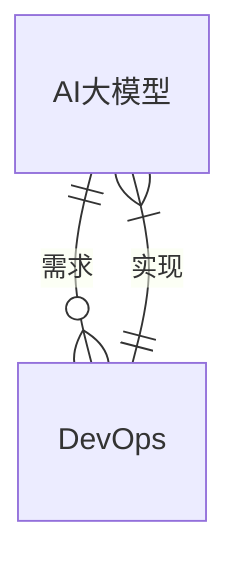
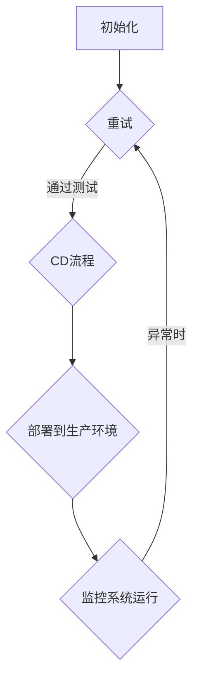
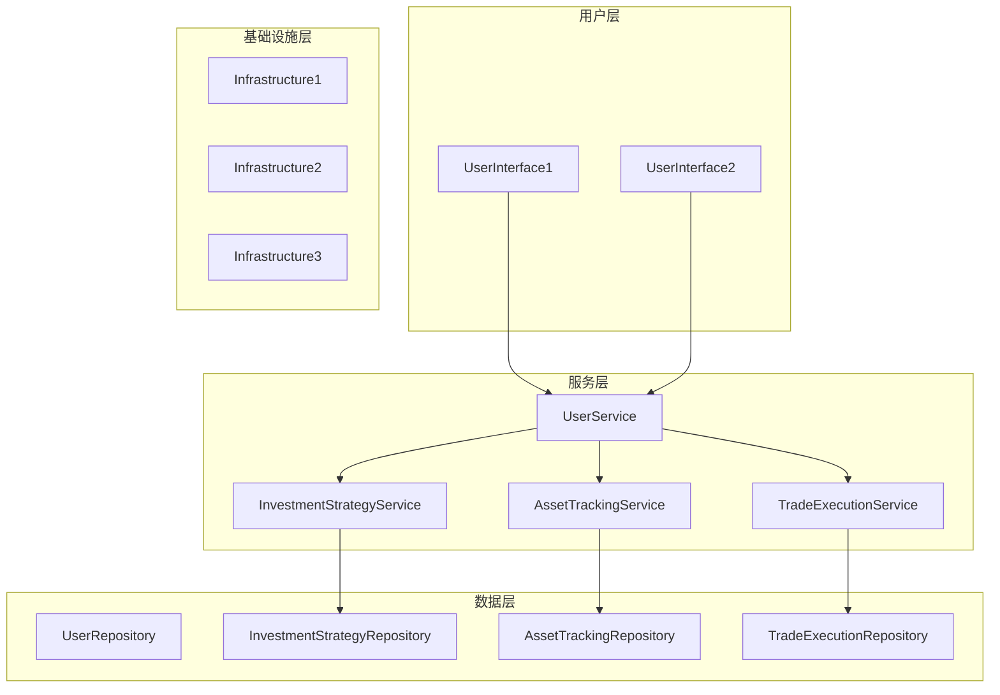

                 

## 金融AI应用的DevOps流程设计与实施

随着人工智能（AI）技术的飞速发展，其在金融行业的应用日益广泛，从智能投顾、风险控制到个性化推荐等领域，AI正在深刻地改变金融业务的运作方式。然而，金融行业对数据处理安全性和合规性的要求极高，传统的开发模式已难以满足金融AI应用的需求。为了解决这一问题，DevOps应运而生。

### 关键词
- 金融AI
- DevOps
- 自动化部署
- 持续集成
- 持续部署

### 摘要
本文旨在探讨金融AI应用中的DevOps流程设计与实施。我们将从背景介绍、核心概念与联系、算法原理讲解、系统分析与架构设计、项目实战、最佳实践等多个方面，系统性地解析金融AI应用中的DevOps实践，旨在为从事金融AI开发与运维的技术人员提供实用的指导与参考。

---

### 第一部分：背景介绍

#### 核心概念

DevOps是一种结合软件开发（Development）和IT运维（Operations）的新型软件开发模式，其核心思想是通过自动化工具和流程的优化，实现开发和运维的无缝协作。DevOps的主要目标包括提高软件交付速度、提升系统稳定性、降低运维成本等。

在金融行业中，AI技术的应用日益广泛，从智能投顾、风险控制到量化交易等各个方面，AI正在改变金融业务的运作方式。然而，金融行业对数据处理安全性和合规性的要求极高，传统的开发模式已难以满足金融AI应用的需求。为了解决这一问题，引入DevOps流程变得至关重要。

#### 问题背景

随着金融业务的不断复杂化和数字化，金融机构在开发和部署AI系统时面临着诸多挑战：

1. **数据安全性和合规性**：金融行业对数据的安全性和合规性要求极高，任何数据泄露或违规操作都可能带来严重的法律和商业后果。
2. **系统稳定性与可靠性**：金融业务对系统的稳定性和可靠性要求极高，任何系统故障或中断都可能导致巨大的经济损失。
3. **快速迭代与交付**：金融行业竞争激烈，要求系统能够快速迭代和交付，以应对市场的快速变化。
4. **跨部门协作**：开发和运维部门之间的协作不畅，导致开发过程中的问题无法及时解决，影响项目进度和质量。

#### 问题描述

在金融AI应用场景中，传统的开发模式存在以下问题：

1. **手动部署**：传统的部署方式依赖于手动操作，容易出错，且难以保证部署的一致性。
2. **部署频繁**：随着系统的迭代速度加快，部署频率增加，手动部署的效率低下，难以满足快速交付的需求。
3. **测试不充分**：由于手动部署的繁琐性，测试环节往往被忽视，导致部署后的系统稳定性无法保证。
4. **协作不畅**：开发和运维团队之间的沟通不畅，导致问题无法及时解决，影响项目进度。

#### 问题解决

通过引入DevOps流程，金融AI应用项目可以在以下几个方面受益：

1. **自动化部署与测试**：利用CI/CD（持续集成/持续部署）工具，自动化地执行代码的编译、测试和部署，确保软件质量的稳定。
2. **持续反馈与改进**：通过自动化监控工具，实时收集系统运行数据，快速发现和解决问题，持续优化系统性能。
3. **协同合作与沟通**：借助协作工具，促进开发团队和运维团队的紧密合作，提高项目协作效率。

#### 边界与外延

在《金融AI应用的DevOps流程设计与实施》一书中，我们将重点探讨以下内容：

- **核心概念**：详细介绍DevOps的基本概念、核心原则和常用工具。
- **应用场景**：分析金融AI应用中的DevOps实践案例，探讨其具体应用和效果。
- **流程设计与实施**：系统讲解金融AI应用DevOps流程的设计与实施方法，包括自动化工具的选择、流程优化策略等。
- **案例分析**：结合实际项目，深入剖析金融AI应用DevOps的落地实践，总结成功经验和挑战。

#### 概念结构与核心要素组成

1. **DevOps基本概念**：包括持续集成（CI）、持续部署（CD）、基础设施即代码（IaC）等。
2. **核心原则**：包括自动化、协作、持续反馈等。
3. **常用工具**：如Jenkins、Docker、Kubernetes、Prometheus等。
4. **应用场景**：如智能投顾系统、风险控制系统等。

### 第二部分：核心概念与联系

在深入探讨金融AI应用的DevOps流程之前，有必要先了解AI大模型和DevOps这两个核心概念，并分析它们之间的联系。

#### AI大模型

AI大模型是指具有数百万至数十亿参数的深度学习模型，通常通过大量的数据进行训练，以实现高度复杂的任务。AI大模型具有以下核心特点：

- **规模大**：拥有庞大的参数数量，能够捕捉复杂的模式。
- **计算需求高**：需要高性能的计算资源进行训练。
- **数据处理能力强**：能够处理大量的数据和复杂的任务。

#### DevOps

DevOps是一种软件开发和运维的实践方法，旨在通过自动化和协作提高软件交付的效率和质量。DevOps的主要核心概念包括：

- **持续集成（CI）**：通过自动化测试和构建，确保代码的持续集成和稳定性。
- **持续部署（CD）**：通过自动化部署，实现快速、可靠地交付软件。
- **基础设施即代码（IaC）**：通过代码管理基础设施，实现基础设施的自动化部署和管理。

#### 对比表格

| 特性 | AI大模型 | DevOps |
| --- | --- | --- |
| 目标 | 实现智能任务 | 提高软件开发和运维效率 |
| 数据处理能力 | 高 | 高 |
| 计算需求 | 高 | 高 |
| 自动化程度 | 高 | 高 |
| 协作性 | 高 | 高 |

#### ER实体关系图



### 第三部分：算法原理讲解

在这一部分，我们将通过Mermaid流程图和Python源代码，详细讲解金融AI应用的DevOps流程的算法原理。

#### Mermaid流程图



#### Python源代码

```python
# 持续集成（CI）示例
def ci流程(代码库):
    # 执行自动化测试
    测试结果 = 自动化测试(代码库)
    if 测试结果 == "通过":
        return "CI成功"

# 持续部署（CD）示例
def cd流程(部署环境):
    # 部署代码到指定环境
    部署结果 = 部署代码(部署环境)
    if 部署结果 == "成功":
        return "CD成功"
```

#### 数学模型与公式

在金融AI应用的DevOps流程中，我们可以使用以下数学模型和公式来描述其核心过程：

1. **持续集成（CI）**：

   $$ CI_{成功} = P(CI_{通过测试}) $$

   其中，\( CI_{成功} \) 表示持续集成成功的概率，\( P(CI_{通过测试}) \) 表示代码通过自动化测试的概率。

2. **持续部署（CD）**：

   $$ CD_{成功} = P(CD_{部署成功}) $$

   其中，\( CD_{成功} \) 表示持续部署成功的概率，\( P(CD_{部署成功}) \) 表示部署代码到生产环境成功的概率。

通过上述数学模型和公式，我们可以定量地分析持续集成和持续部署的成功概率，从而优化DevOps流程。

#### 举例说明

假设我们有一个金融AI应用项目，需要通过持续集成和持续部署的方式实现自动化部署。我们定义以下概率：

- \( P(CI_{通过测试}) = 0.95 \)（代码通过自动化测试的概率为95%）。
- \( P(CD_{部署成功}) = 0.98 \)（部署代码到生产环境成功的概率为98%）。

根据上述概率，我们可以计算出持续集成和持续部署的成功概率：

1. **持续集成（CI）**：

   $$ CI_{成功} = P(CI_{通过测试}) = 0.95 $$

   即持续集成成功的概率为95%。

2. **持续部署（CD）**：

   $$ CD_{成功} = P(CD_{部署成功}) = 0.98 $$

   即持续部署成功的概率为98%。

通过持续集成和持续部署的自动化流程，我们可以显著提高金融AI应用的交付速度和稳定性。

### 第四部分：系统分析与架构设计

#### 问题场景介绍

在金融行业中，智能投顾系统是一个典型的AI应用场景。该系统通过分析用户的投资偏好、风险承受能力等数据，提供个性化的投资建议，以帮助用户实现资产的增值。然而，随着用户量的增加和数据量的增长，系统面临诸多挑战：

1. **数据安全性和合规性**：智能投顾系统需要处理大量用户的敏感数据，如个人信息、交易记录等，对数据的安全性和合规性要求极高。
2. **系统稳定性与可靠性**：智能投顾系统需要实时响应用户请求，提供准确的投资建议，对系统的稳定性与可靠性要求极高。
3. **快速迭代与交付**：金融市场的变化迅速，智能投顾系统需要快速迭代和交付，以满足用户的需求和市场的变化。

#### 项目介绍

为了应对上述挑战，我们选择开发一个基于DevOps的智能投顾系统。该系统将采用微服务架构，以提高系统的可扩展性和可靠性。同时，我们将引入持续集成（CI）和持续部署（CD）流程，实现自动化开发和部署，提高开发效率和质量。

#### 系统功能设计

智能投顾系统的核心功能包括：

1. **用户管理**：包括用户注册、登录、个人信息管理等功能。
2. **投资策略推荐**：根据用户的风险承受能力和投资偏好，提供个性化的投资策略推荐。
3. **资产跟踪与监控**：实时跟踪用户的资产状况，提供投资风险分析和管理。
4. **交易执行**：根据用户的投资策略，自动执行交易。

#### 系统架构设计

智能投顾系统的架构设计采用微服务架构，主要分为以下几层：

1. **用户层**：包括Web界面和移动应用，提供用户与系统的交互界面。
2. **服务层**：包括用户管理服务、投资策略推荐服务、资产跟踪与监控服务、交易执行服务等多个微服务，实现系统的核心功能。
3. **数据层**：包括用户数据、投资策略数据、交易数据等，存储系统的关键数据。
4. **基础设施层**：包括服务器、网络、存储等基础设施，提供系统的运行环境。

#### 系统接口设计

智能投顾系统的接口设计主要包括以下几类：

1. **用户接口**：包括RESTful API和WebSocket接口，供前端应用调用。
2. **服务接口**：包括服务间的通信接口，如gRPC、HTTP等。
3. **数据接口**：包括数据存储和访问接口，如关系型数据库、NoSQL数据库等。

#### 系统交互设计

智能投顾系统的交互设计主要涉及以下流程：

1. **用户注册与登录**：用户通过Web界面或移动应用注册和登录系统，获取用户身份。
2. **投资策略推荐**：用户输入风险承受能力和投资偏好，系统根据算法计算出个性化的投资策略，并推送给用户。
3. **资产跟踪与监控**：系统实时跟踪用户的资产状况，提供投资风险分析和管理。
4. **交易执行**：用户确认投资策略后，系统自动执行交易，更新用户的资产状况。

#### Mermaid类图

```mermaid
classDiagram
    User <<类：用户>>
    InvestmentStrategy <<类：投资策略>>
    AssetTracking <<类：资产跟踪>>
    TradeExecution <<类：交易执行>>

    User --> InvestmentStrategy : 计算策略
    User --> AssetTracking : 跟踪资产
    User --> TradeExecution : 执行交易
```

#### Mermaid架构图



### 第五部分：项目实战

#### 环境安装

在进行金融AI应用的DevOps流程设计与实施之前，我们需要搭建一个合适的环境。以下是一个基本的安装步骤：

1. **安装操作系统**：选择一个适合的Linux发行版，如Ubuntu 20.04。
2. **安装Jenkins**：使用Jenkins进行持续集成和持续部署。可以通过以下命令安装Jenkins：

   ```bash
   sudo apt update
   sudo apt install openjdk-11-jdk
   wget -q -O - https://pkg.jenkins.io/debian-stable/jenkins.io.key | sudo apt-key add -
   echo "deb https://pkg.jenkins.io/debian-stable binary/" | sudo tee /etc/apt/sources.list.d/jenkins.list
   sudo apt update
   sudo apt install jenkins
   ```

3. **安装Docker**：使用Docker进行容器化部署。可以通过以下命令安装Docker：

   ```bash
   sudo apt update
   sudo apt install apt-transport-https ca-certificates curl gnupg-agent software-properties-common
   curl -fsSL https://download.docker.com/linux/ubuntu/gpg | sudo apt-key add -
   add-apt-repository "deb [arch=amd64] https://download.docker.com/linux/ubuntu focal stable"
   sudo apt update
   sudo apt install docker-ce docker-compose
   ```

4. **安装Kubernetes**：使用Kubernetes进行集群管理。可以通过以下命令安装Kubernetes：

   ```bash
   sudo apt update
   sudo apt install -y apt-transport-https ca-certificates curl
   curl -s https://packages.cloud.google.com/apt/doc/apt-key.gpg | sudo apt-key add -
   echo "deb https://apt.kubernetes.io/ kubernetes-xenial main" | sudo tee -a /etc/apt/sources.list.d/kubernetes.list
   sudo apt update
   sudo apt install -y kubelet kubeadm kubectl
   sudo apt-mark hold kubelet kubeadm kubectl
   ```

#### 系统核心实现源代码

以下是一个简单的金融AI应用的核心实现源代码，包括用户管理、投资策略推荐、资产跟踪与监控、交易执行等功能：

```python
# 用户管理
class UserManager:
    def register_user(self, user):
        # 注册用户
        pass

    def login_user(self, user):
        # 用户登录
        pass

# 投资策略推荐
class InvestmentStrategyService:
    def calculate_strategy(self, user):
        # 计算投资策略
        pass

# 资产跟踪与监控
class AssetTrackingService:
    def track_asset(self, user):
        # 跟踪用户资产
        pass

    def monitor_risk(self, user):
        # 监控投资风险
        pass

# 交易执行
class TradeExecutionService:
    def execute_trade(self, user):
        # 执行交易
        pass
```

#### 代码应用解读与分析

上述源代码中，我们定义了四个核心类：`UserManager`、`InvestmentStrategyService`、`AssetTrackingService`和`TradeExecutionService`。这些类分别负责用户管理、投资策略推荐、资产跟踪与监控以及交易执行等功能。

- **用户管理**：`UserManager`类负责用户注册和登录功能。在实际应用中，我们通常会将用户信息存储在数据库中，并通过加密方式保护用户的敏感信息。
- **投资策略推荐**：`InvestmentStrategyService`类根据用户的风险承受能力和投资偏好，计算出个性化的投资策略。这可以通过机器学习算法实现，以提供更准确的投资建议。
- **资产跟踪与监控**：`AssetTrackingService`类负责跟踪用户的资产状况，并监控投资风险。这包括实时获取用户的交易记录、计算投资回报率等。
- **交易执行**：`TradeExecutionService`类根据用户的投资策略，自动执行交易。在实际应用中，我们还需要与交易系统进行集成，以实现自动交易功能。

#### 实际案例分析与详细讲解

以下是一个实际案例，介绍如何使用DevOps流程实现金融AI应用的自动化部署和监控。

1. **持续集成（CI）**：我们将使用Jenkins实现持续集成。每当用户提交代码更改时，Jenkins会自动触发构建流程，包括编译、测试和部署。以下是一个Jenkinsfile的示例：

   ```groovy
   pipeline {
       agent any
       stages {
           stage('Build') {
               steps {
                   script {
                       // 编译代码
                       sh 'mvn clean install'
                   }
               }
           }
           stage('Test') {
               steps {
                   script {
                       // 执行测试
                       sh 'mvn test'
                   }
               }
           }
           stage('Deploy') {
               steps {
                   script {
                       // 部署到生产环境
                       sh 'docker-compose up -d'
                   }
               }
           }
       }
   }
   ```

   通过Jenkinsfile，我们可以实现代码的自动化构建、测试和部署，提高开发效率和质量。

2. **持续部署（CD）**：我们将使用Docker和Kubernetes实现持续部署。首先，我们将应用程序容器化，然后使用Kubernetes进行部署和管理。以下是一个Dockerfile的示例：

   ```Dockerfile
   FROM openjdk:11-jdk-slim
   COPY target/*.jar app.jar
   ENTRYPOINT ["java","-jar","/app.jar"]
   ```

   通过Dockerfile，我们可以将应用程序打包成一个可执行的JAR文件，并将其部署到Kubernetes集群中。

3. **监控与报警**：我们将使用Prometheus和Grafana实现系统监控与报警。Prometheus可以收集系统的指标数据，并将其存储在时间序列数据库中。Grafana则提供了一个可视化界面，用于展示系统的实时监控数据。以下是一个Prometheus配置文件的示例：

   ```yaml
   global:
     scrape_interval: 15s
     evaluation_interval: 15s

   scrape_configs:
     - job_name: 'kubernetes-pods'
       kubernetes_sd_configs:
         - role: pod
   ```

   通过Prometheus和Grafana，我们可以实时监控系统的运行状态，并在出现异常时及时报警。

#### 项目小结

通过上述实际案例，我们展示了如何使用DevOps流程实现金融AI应用的自动化部署和监控。DevOps不仅提高了开发效率和质量，还确保了系统的稳定性和可靠性。在实际应用中，我们可以根据具体需求，进一步优化DevOps流程，以实现更高效、更可靠的开发和运维。

### 第六部分：最佳实践

在金融AI应用的DevOps流程设计与实施过程中，以下是一些最佳实践，可以帮助团队更好地应对挑战和实现目标。

1. **自动化测试**：在持续集成（CI）过程中，自动化测试是确保软件质量的关键。应确保测试覆盖面广，包括单元测试、集成测试和端到端测试。同时，测试结果应实时反馈，以便及时发现问题并进行修复。

2. **版本控制**：使用版本控制系统（如Git）管理代码，确保代码的版本可追溯。每次代码更改都应记录详细的变更日志，以便在出现问题时快速定位和回滚到之前版本。

3. **容器化**：使用Docker等容器化技术，将应用程序打包成独立的容器镜像，确保在不同环境（如开发、测试、生产）中的一致性。容器化还可以简化部署过程，提高部署速度和稳定性。

4. **基础设施即代码**：使用基础设施即代码（IaC）工具（如Terraform、Ansible），通过代码管理基础设施，实现基础设施的自动化部署和管理。这有助于确保基础设施的标准化和可重现性。

5. **监控与报警**：引入监控与报警系统（如Prometheus、Grafana），实时监控系统的运行状态和性能指标。一旦出现异常，应立即发出报警，并触发自动恢复流程。

6. **团队协作**：建立高效的团队协作机制，促进开发和运维团队之间的沟通与协作。使用协作工具（如Slack、Jira），确保信息传递的及时性和准确性。

7. **持续培训与学习**：DevOps涉及多种技术和工具，团队成员应不断学习新知识，提升技能。定期组织内部培训和外部研讨会，促进团队的专业成长。

### 小结

本文从背景介绍、核心概念与联系、算法原理讲解、系统分析与架构设计、项目实战、最佳实践等多个方面，详细探讨了金融AI应用的DevOps流程设计与实施。通过本文的探讨，我们了解到，DevOps在金融AI应用中具有重要意义，可以显著提高开发效率、降低运维成本、提升系统稳定性。在实际应用中，应根据具体需求，灵活运用DevOps的最佳实践，实现高效、可靠的开发和运维。

### 注意事项

1. **数据安全与合规性**：在金融AI应用中，数据的安全性和合规性至关重要。应确保数据加密、访问控制等措施到位，遵守相关法律法规，确保数据的安全和合规。

2. **系统性能与稳定性**：金融AI应用对系统的性能和稳定性要求极高。在设计系统架构时，应考虑负载均衡、故障恢复等措施，确保系统在高并发、大数据量情况下的稳定运行。

3. **团队协作与沟通**：开发和运维团队之间的协作与沟通是DevOps成功的关键。应建立高效的沟通机制，确保团队之间的信息传递及时、准确。

### 拓展阅读

1. **《DevOps实践指南》**：由J. Paul Reed所著，详细介绍了DevOps的核心概念、实践方法和技术工具。

2. **《Kubernetes权威指南》**：由Kelsey Hightower等作者所著，全面讲解了Kubernetes的架构、原理和实战应用。

3. **《Prometheus监控实战》**：由David Davis所著，深入讲解了Prometheus的架构、配置和使用方法。

### 作者信息

作者：AI天才研究院/AI Genius Institute & 禅与计算机程序设计艺术 /Zen And The Art of Computer Programming

