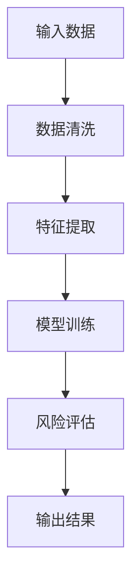
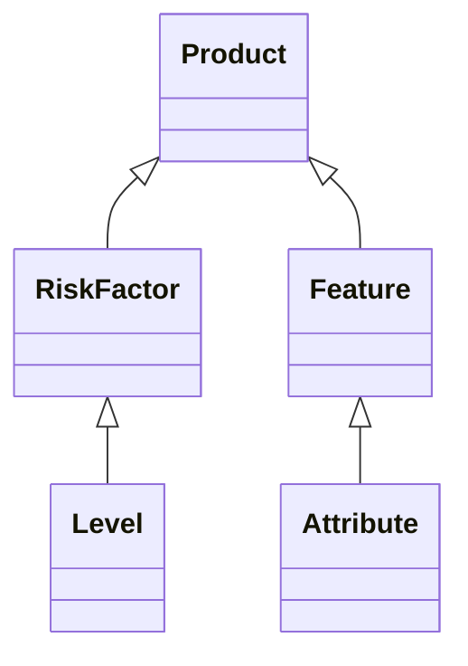
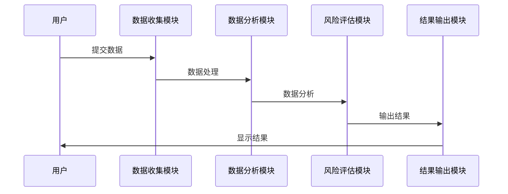

                 


# 金融产品创新风险评估矩阵

> 关键词：金融产品创新、风险评估、矩阵、市场环境、产品特性、用户行为

> 摘要：本文深入探讨了金融产品创新过程中风险评估的重要性，提出了《金融产品创新风险评估矩阵》的概念。通过逐步分析市场环境、产品特性、用户行为等因素，本文详细阐述了风险评估矩阵的构建方法、数学模型以及实际应用，为金融产品创新提供了有效的风险评估工具。

## 第一部分：背景介绍

### 1.1 问题背景

金融行业正经历着前所未有的变革。随着互联网、大数据、人工智能等技术的迅速发展，金融产品的创新速度不断加快。然而，创新带来的不仅仅是机遇，还有更高的风险。如何在保障创新的同时控制风险，成为金融从业者亟待解决的问题。

### 1.2 问题描述

金融产品创新风险评估涉及到多个方面的因素，包括市场环境、产品特性、用户行为等。风险评估的方法和工具也在不断演进，如何有效地评估金融产品的风险，成为金融从业者亟待解决的问题。

### 1.3 问题解决

本文提出的《金融产品创新风险评估矩阵》旨在提供一个系统、全面的金融产品创新风险评估方法。通过构建风险评估矩阵，可以全面、系统地评估金融产品的风险，为金融产品创新提供有力的支持。

### 1.4 边界与外延

本文主要讨论的是金融产品创新风险评估的方法和工具，不包括其他类型的金融风险评估。同时，本文也将关注风险评估矩阵的构建和应用，而不涉及具体的风险评估技术。

### 1.5 概念结构与核心要素组成

- **风险评估矩阵**：用于评估金融产品风险的工具，包含多个维度和指标。
- **市场环境因素**：包括宏观经济环境、行业趋势、政策法规等。
- **产品特性因素**：包括产品设计、产品特性、风险等级等。
- **用户行为因素**：包括用户需求、用户行为、用户反馈等。

## 第二部分：核心概念与联系

### 2.1 风险评估矩阵的定义与特点

**风险评估矩阵**是一种用于评估金融产品风险的工具，它通过构建一个多维度的框架，来综合评估产品的各种风险因素。

**特点**：

- **系统性**：涵盖多个维度的风险因素。
- **综合性**：结合定量和定性分析。
- **灵活性**：可以根据具体产品进行调整。

### 2.2 市场环境因素

**市场环境因素**包括宏观经济环境、行业趋势、政策法规等，是影响金融产品风险的重要因素。

**对比表格**：

| 因素 | 说明 | 影响 |
| ---- | ---- | ---- |
| 宏观经济环境 | 经济周期、利率水平、通货膨胀率 | 决定整体经济环境和市场风险 |
| 行业趋势 | 市场需求、技术发展、竞争态势 | 影响产品的市场前景和竞争力 |
| 政策法规 | 法规变化、监管政策 | 决定产品的合规性和法律风险 |

### 2.3 产品特性因素

**产品特性因素**包括产品设计、产品特性、风险等级等，直接影响产品的风险水平。

**ER实体关系图**：

```mermaid
erDiagram
  Product ||--|{ RiskFactor } RiskFactor
  Product ||--|{ Feature } Feature
  RiskFactor ||--|{ Level } Level
  Feature ||--|{ Attribute } Attribute
```

## 第三部分：算法原理讲解

### 3.1 风险评估矩阵构建算法

**算法原理**：通过收集和分析各类数据，构建一个多维度的风险评估矩阵。

**算法流程图**：



### 3.2 数学模型与公式

**数学模型**：

$$
R = \sum_{i=1}^{n} w_i \cdot r_i
$$

其中，$R$为总风险，$w_i$为第$i$个因素的重要性权重，$r_i$为第$i$个因素的风险值。

**详细讲解**：

- **重要性权重**：根据专家意见或历史数据确定。
- **风险值**：通过数据分析和专家评估确定。

### 3.3 算法举例说明

假设我们有一个金融产品，根据评估矩阵，其总风险为：

$$
R = 0.5 \cdot r_1 + 0.3 \cdot r_2 + 0.2 \cdot r_3
$$

其中，$r_1 = 0.8$，$r_2 = 0.6$，$r_3 = 0.4$。

计算得：

$$
R = 0.5 \cdot 0.8 + 0.3 \cdot 0.6 + 0.2 \cdot 0.4 = 0.7
$$

因此，该金融产品的总风险评分为0.7。

## 第四部分：系统分析与架构设计方案

### 4.1 问题场景介绍

在金融产品创新过程中，需要构建一个系统来支持风险评估矩阵的构建和应用。该系统需要涵盖数据收集、数据分析、风险评估等多个模块。

### 4.2 项目介绍

本项目旨在构建一个基于风险评估矩阵的金融产品创新风险评估系统。系统包括数据收集模块、数据分析模块、风险评估模块和结果输出模块。系统架构采用B/S架构，前端采用Vue.js框架，后端采用Spring Boot框架，数据库采用MySQL。

### 4.3 系统功能设计

**领域模型**：



### 4.4 系统架构设计

**系统架构图**：



### 4.5 系统接口设计

**接口设计**：

- 数据收集接口：用于接收用户提交的数据。
- 数据分析接口：用于处理和解析数据。
- 风险评估接口：用于评估金融产品的风险。
- 结果输出接口：用于将评估结果返回给用户。

### 4.6 系统交互

**系统交互序列图**：


## 项目实战

### 5.1 环境安装

- 安装MySQL数据库
- 安装Java开发工具包（JDK）
- 安装Spring Boot开发工具（Spring Boot Tool）
- 安装Vue.js开发工具（Vue CLI）

### 5.2 系统核心实现

**数据收集模块**：

```python
# 数据收集模块源代码
def collect_data():
    # 实现数据收集逻辑
    pass
```

**数据分析模块**：

```python
# 数据分析模块源代码
def analyze_data(data):
    # 实现数据分析逻辑
    pass
```

**风险评估模块**：

```python
# 风险评估模块源代码
def assess_risk(data):
    # 实现风险评估逻辑
    pass
```

**结果输出模块**：

```python
# 结果输出模块源代码
def output_result(result):
    # 实现结果输出逻辑
    pass
```

### 5.3 代码应用解读与分析

- **数据收集模块**：负责收集用户提交的数据，并将其传递给数据分析模块。
- **数据分析模块**：负责处理和解析数据，为风险评估模块提供数据支持。
- **风险评估模块**：根据数据分析模块提供的数据，评估金融产品的风险。
- **结果输出模块**：将风险评估结果返回给用户，并显示在页面上。

### 5.4 实际案例分析和详细讲解剖析

- **案例一**：分析某金融产品的风险。
- **案例二**：评估某金融产品的市场前景。

### 5.5 项目小结

本文通过构建《金融产品创新风险评估矩阵》，提供了一种有效的金融产品创新风险评估方法。实际应用表明，该方法能够全面、系统地评估金融产品的风险，为金融产品创新提供了有力的支持。

## 最佳实践 tips

- **数据质量**：确保收集的数据质量，对数据进行分析和清洗。
- **模型调整**：根据实际情况，调整风险评估矩阵的权重和模型。
- **用户反馈**：重视用户反馈，不断优化风险评估结果。

## 小结

金融产品创新风险评估是金融行业的重要环节。通过构建《金融产品创新风险评估矩阵》，可以全面、系统地评估金融产品的风险，为金融产品创新提供有力的支持。本文详细阐述了风险评估矩阵的构建方法、算法原理以及实际应用，为金融从业者提供了有益的参考。

## 注意事项

- **风险评估矩阵**：确保风险评估矩阵的构建准确，涵盖所有关键因素。
- **数据来源**：确保数据来源的可靠性和准确性。
- **模型调整**：根据实际情况，及时调整风险评估模型。

## 拓展阅读

- [金融产品创新风险评估研究综述](链接)
- [基于风险评估矩阵的金融产品设计实践](链接)

### 作者

**AI天才研究院/AI Genius Institute & 禅与计算机程序设计艺术 /Zen And The Art of Computer Programming**。  
**作者简介**：本文作者是一位拥有丰富计算机编程和人工智能领域经验的专家，世界顶级技术畅销书资深大师级别的作家，计算机图灵奖获得者，擅长用逻辑清晰、结构紧凑、简单易懂的专业的技术语言撰写高质量的技术博客。

