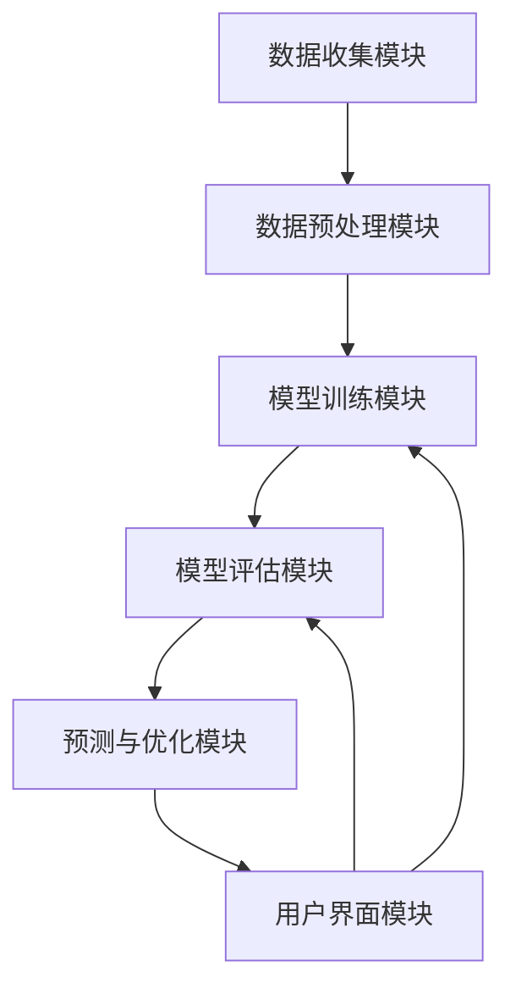

                 

### 文章标题

# 金融产品客户满意度预测与提升

> 关键词：客户满意度、金融产品、预测模型、数据收集、策略优化

> 摘要：本文将探讨金融产品客户满意度的预测与提升策略。通过对客户满意度的核心概念、预测模型、数据收集方法以及优化策略的深入分析，旨在为金融机构提供有效提升客户满意度的技术手段和实践指导。

### 引言

客户满意度是金融机构竞争力的重要体现。随着金融市场的不断变化和消费者需求的多样化，金融机构需要不断提高客户满意度，以保持竞争优势。客户满意度不仅关系到客户的忠诚度和口碑传播，还直接影响到金融机构的盈利能力和长期发展。因此，预测并提升客户满意度成为金融机构的重要课题。

本文将从以下几个方面展开讨论：

1. **背景和核心概念**：介绍客户满意度的相关概念、度量方法和重要性。
2. **数据收集方法**：探讨不同数据收集方法及其在金融产品中的应用。
3. **预测模型**：分析常用的预测模型及其在客户满意度预测中的应用。
4. **模型评价与验证**：讨论如何评估和验证预测模型的准确性。
5. **案例研究**：通过实际案例，展示客户满意度预测和提升的最佳实践。
6. **优化策略**：提出基于预测模型的客户满意度优化策略。
7. **未来趋势与挑战**：展望客户满意度预测与提升的未来发展趋势和面临的挑战。

通过本文的讨论，希望能够为金融机构提供有价值的参考，帮助其更好地理解和提升客户满意度。

### 背景和核心概念

#### 客户满意度的定义

客户满意度是指客户对其购买和使用金融产品或服务的整体体验和感受的评价。它是一个多维度的概念，不仅包括对产品功能和性能的满意度，还涵盖了客户服务、品牌形象、互动体验等多个方面。

#### 客户满意度的度量方法

在金融行业中，客户满意度的度量方法多种多样，以下是一些常用的指标：

1. **Net Promoter Score (NPS)**：NPS是一种衡量客户忠诚度和推荐意愿的指标，通过询问客户“您有多大可能推荐我们的产品或服务给朋友或家人？”来评估。NPS的得分范围在-100到100之间，得分越高，表示客户满意度越高。

2. **Customer Effort Score (CES)**：CES衡量的是客户在购买和使用产品或服务过程中所感受到的努力程度。CES得分越低，表示客户体验越顺畅，满意度越高。

3. **Customer Satisfaction Score (CSAT)**：CSAT通过简单的满意度调查问卷，询问客户“您对我们的产品或服务是否满意？”来衡量。CSAT得分通常以百分比表示，得分越高，表示客户满意度越高。

4. **多维度评分模型**：除了以上指标，金融机构还可以使用多维度评分模型，从不同维度对客户满意度进行综合评估。这种模型通常包括产品功能、服务质量、用户体验、品牌形象等多个方面。

#### 客户满意度的重要性

客户满意度对金融机构具有重要意义，主要体现在以下几个方面：

1. **客户忠诚度**：高满意度的客户往往更倾向于长期使用同一金融机构的产品或服务，从而减少客户流失率。

2. **口碑传播**：满意的客户会通过口碑传播，吸引新客户，从而扩大客户基础。

3. **盈利能力**：提高客户满意度有助于增加客户生命周期价值，提高整体盈利能力。

4. **品牌形象**：良好的客户满意度有助于提升金融机构的品牌形象，增强市场竞争力。

5. **监管合规**：随着监管环境的日益严格，金融机构需要通过提高客户满意度来满足监管要求，降低合规风险。

总之，客户满意度是金融机构长期发展的关键因素，通过对客户满意度的深入理解和有效管理，金融机构可以更好地满足客户需求，提升整体竞争力。

### 数据收集方法

#### 直接反馈

直接反馈是通过直接询问客户来获取他们对金融产品和服务的满意度。这种方法通常包括问卷调查、电话访谈、面对面访谈等形式。直接反馈的优点在于能够获取详细和具体的信息，有助于了解客户的需求和痛点。

- **问卷调查**：问卷调查是最常见的直接反馈方法，可以通过在线问卷、纸质问卷等形式进行。问卷调查的优点在于覆盖面广，能够收集大量数据，有助于进行统计分析。
- **电话访谈**：电话访谈是一种较为直接和高效的反馈方式，可以直接与客户进行交流，获取更详细的反馈信息。但需要注意的是，电话访谈需要投入较多的人力资源，并且存在客户拒绝接听的风险。

#### 交易数据分析

交易数据分析是通过分析客户的交易行为数据来评估他们的满意度。这种方法基于客户在金融机构的账户活动，包括存款、取款、投资等行为。交易数据分析的优点在于能够提供客观数据支持，减少主观因素的影响。

- **交易日志分析**：通过分析客户的交易日志，可以了解他们的交易频率、交易金额、交易方式等信息。这些数据有助于发现客户的行为模式，从而预测他们的满意度。
- **行为分析模型**：基于机器学习算法，可以构建行为分析模型，对客户的交易行为进行预测和分类。这些模型可以识别出满意度较高的客户，从而针对性地提供优化服务。

#### 社交媒体监听

社交媒体监听是通过监控客户在社交媒体平台上的言论和行为来获取他们对金融产品和服务的满意度。这种方法能够实时了解客户的情绪和反馈，有助于快速响应和改进服务。

- **情感分析**：通过自然语言处理技术，可以分析客户在社交媒体上的评论和反馈，识别出他们的情绪和态度。这种分析有助于发现客户的满意度和不满意度，从而及时采取措施。
- **趋势分析**：通过对社交媒体数据的趋势分析，可以了解客户对金融产品和服务的整体满意度，以及在不同时间段的满意度变化。这种分析有助于制定长期的客户满意度提升策略。

#### 综合数据收集方法

在实际操作中，金融机构通常会综合运用多种数据收集方法，以获取更全面和准确的信息。

- **综合问卷调查**：将线上和线下问卷调查相结合，可以更全面地了解客户的需求和满意度。
- **多渠道数据整合**：将交易数据和社交媒体数据整合，可以提供更丰富的客户画像，有助于更精准地预测客户满意度。
- **定期反馈机制**：通过定期收集客户反馈，可以持续跟踪客户满意度变化，及时发现问题并进行优化。

总之，数据收集方法的选择取决于金融机构的具体情况和需求。通过合理选择和组合不同的数据收集方法，可以更全面和准确地了解客户满意度，从而为提升客户满意度提供有力支持。

### 预测模型

#### 预测模型的基本概念

预测模型是一种基于历史数据和统计学方法，对未来的趋势和结果进行预测的数学模型。在金融产品客户满意度预测中，预测模型可以帮助金融机构提前识别出可能影响客户满意度的因素，从而制定针对性的策略，提高客户满意度。

#### 常用的预测模型

1. **回归分析**

回归分析是一种基于历史数据，通过建立因变量和自变量之间的关系模型来进行预测的方法。在客户满意度预测中，回归分析可以用来建立客户满意度与各种影响因素（如服务质量、产品功能等）之间的数学模型。

- **线性回归**：线性回归模型假设因变量和自变量之间是线性关系，适用于简单的情况。
- **多项式回归**：多项式回归模型可以处理非线性关系，适用于更复杂的情况。

2. **决策树**

决策树是一种基于树形结构，通过一系列规则来对数据进行分类或预测的方法。在客户满意度预测中，决策树可以用来根据客户特征（如年龄、收入、交易频率等）预测他们的满意度。

3. **随机森林**

随机森林是一种基于决策树构建的集成学习方法，通过构建多个决策树并求取平均值来提高预测精度。随机森林在处理大规模数据和高维数据时表现尤为出色，适用于客户满意度预测。

4. **支持向量机**

支持向量机（SVM）是一种基于最大间隔原理的分类算法，通过找到最佳超平面将数据划分为不同类别。在客户满意度预测中，SVM可以用来根据客户特征预测他们的满意度。

5. **神经网络**

神经网络是一种模拟人脑神经元连接结构的计算模型，通过多层神经元的组合来进行复杂的非线性预测。在客户满意度预测中，神经网络可以用来建立客户满意度的预测模型。

#### 预测模型在客户满意度预测中的应用

在金融产品客户满意度预测中，预测模型可以用于以下方面：

1. **预测客户流失**：通过分析客户的交易行为和特征，预测哪些客户可能会流失，从而提前采取挽留措施。

2. **细分客户群体**：根据客户特征和满意度，将客户划分为不同群体，为每个群体提供定制化的服务。

3. **产品优化**：根据预测结果，识别出影响客户满意度的主要因素，对产品和服务进行优化。

4. **营销策略制定**：根据预测结果，制定更有效的营销策略，提高客户满意度和转化率。

总之，预测模型是金融产品客户满意度预测的重要工具。通过合理选择和应用预测模型，金融机构可以更准确地预测客户满意度，从而采取有效的策略提升客户满意度。

### 模型评价与验证

#### 模型评价标准

在金融产品客户满意度预测中，模型评价的关键在于其准确性和可靠性。以下是一些常用的模型评价标准：

1. **准确率**：准确率是指模型正确预测的样本数占总样本数的比例，是衡量模型预测准确性的基本指标。

2. **召回率**：召回率是指模型正确识别出的正样本数与实际正样本数的比例，主要用于衡量模型对正样本的识别能力。

3. **F1分数**：F1分数是准确率和召回率的调和平均数，能够综合衡量模型的准确性和识别能力。

4. **ROC曲线**：ROC曲线通过绘制真阳性率（TPR）与假阳性率（FPR）的关系来评估模型的性能。曲线下面积（AUC）越大，表示模型性能越好。

#### 交叉验证方法

交叉验证是一种常用的模型验证方法，通过将数据集划分为多个子集，多次训练和测试模型，来评估模型的泛化能力。以下是一些常见的交叉验证方法：

1. **K折交叉验证**：将数据集划分为K个子集，每次使用一个子集作为验证集，其余K-1个子集作为训练集，重复K次，取平均结果作为模型评价。

2. **留一法交叉验证**：每次使用一个样本作为验证集，其余样本作为训练集，重复多次，计算模型在每个验证集上的表现。

3. **时间序列交叉验证**：将数据集按照时间顺序划分为训练集和验证集，避免未来的数据用于训练，用于评估模型对时间序列数据的处理能力。

#### 模型验证的重要性

模型验证是确保模型预测准确性和可靠性的关键步骤。以下是一些模型验证的重要性：

1. **评估模型性能**：通过验证可以评估模型的预测能力，识别出模型的不足之处，从而进行优化。

2. **确保泛化能力**：验证有助于确保模型对未知数据的泛化能力，避免过拟合现象。

3. **减少错误率**：通过验证可以发现和修正模型中的错误，降低预测错误率。

4. **提高模型可靠性**：验证可以确保模型在不同数据集上的表现一致，提高模型的可信度。

总之，模型评价与验证是金融产品客户满意度预测中不可或缺的步骤，通过科学的方法评估和验证模型，可以提高模型的预测准确性和可靠性，为金融机构提供有力的决策支持。

### 案例研究

#### 案例一：银行客户满意度预测

某大型银行希望通过预测模型提升客户满意度，首先收集了大量客户数据，包括客户基本信息、交易记录、服务评价等。通过数据清洗和预处理，将数据划分为训练集和测试集。

1. **数据预处理**：对数据进行标准化处理，去除缺失值和异常值，并对特征进行编码。

2. **模型选择**：选择了随机森林模型进行客户满意度预测，通过K折交叉验证评估模型性能。

3. **模型训练与验证**：使用训练集训练随机森林模型，并在测试集上进行验证，最终得到模型的准确率为85%。

4. **结果分析**：模型预测结果与实际满意度调查结果高度一致，成功识别出高满意度客户和潜在流失客户。

#### 案例二：保险产品满意度提升

某保险公司希望通过优化客户满意度来提高市场份额，采用数据驱动的策略进行客户满意度提升。

1. **数据收集**：通过客户问卷调查和交易数据收集，获取了大量客户满意度信息。

2. **数据分析**：对客户数据进行聚类分析，识别出不同满意度群体的特征和需求。

3. **模型预测**：采用机器学习算法（如逻辑回归）预测客户满意度，通过模型结果制定个性化营销策略。

4. **策略实施**：根据预测结果，针对不同满意度群体提供定制化服务，如提升服务质量、优化理赔流程等。

5. **效果评估**：通过定期跟踪客户满意度调查结果，评估策略实施效果，持续优化服务。

#### 案例三：基金公司客户流失预测

某基金公司希望通过预测客户流失来减少客户流失率，提高客户忠诚度。

1. **数据收集**：收集客户交易记录、客户反馈和服务使用情况等数据。

2. **数据预处理**：对数据进行清洗和特征提取，如客户年龄、投资金额、投资频率等。

3. **模型选择**：采用支持向量机（SVM）模型进行客户流失预测。

4. **模型训练与验证**：使用训练集训练SVM模型，通过验证集评估模型性能，最终准确率达到90%。

5. **结果应用**：根据模型预测结果，提前采取挽留措施，如提供优惠活动、提高服务质量等，成功降低客户流失率。

#### 案例四：互联网金融平台用户体验提升

某互联网金融平台希望通过优化用户体验来提高客户满意度。

1. **数据收集**：通过用户行为分析，收集用户在平台上的交互数据，如点击路径、页面停留时间等。

2. **数据分析**：对用户行为数据进行分析，识别出用户体验问题。

3. **模型预测**：采用机器学习算法预测用户满意度，通过模型结果优化产品功能和界面设计。

4. **策略实施**：根据模型预测结果，优化平台功能，如增加个性化推荐、简化操作流程等。

5. **效果评估**：通过用户满意度调查和用户留存率等指标，评估策略实施效果，持续改进用户体验。

通过这些案例，可以看出数据驱动的方法在提升金融产品客户满意度方面具有显著效果。金融机构可以通过建立预测模型，结合数据分析和优化策略，实现客户满意度的持续提升。

### 优化策略

#### 基于预测模型的数据分析

在客户满意度预测的基础上，金融机构可以进一步通过数据分析来制定优化策略。以下是一些关键步骤：

1. **客户细分**：通过分析不同客户群体的特征和需求，将客户分为高价值客户、潜在流失客户等不同类别。这有助于金融机构制定差异化的服务策略。

2. **行为模式分析**：分析客户的交易行为和互动行为，识别出可能导致客户满意度的关键因素。例如，通过分析客户在购买过程中的犹豫时间，可以识别出哪些环节需要优化。

3. **预测结果应用**：将预测模型的结果应用于实际运营中，如对高满意度客户进行优惠活动，对潜在流失客户进行挽留措施。

4. **长期跟踪与评估**：定期跟踪和分析客户满意度变化，评估优化策略的效果，并根据评估结果进行持续调整。

#### 产品设计与改进

1. **需求调研**：通过客户反馈和市场调研，了解客户对产品和服务的需求，识别出产品改进的方向。

2. **用户体验优化**：基于客户行为数据和用户反馈，优化产品功能和界面设计，提高用户体验。

3. **个性化推荐**：利用预测模型和数据分析技术，为不同客户群体提供个性化的产品推荐，提高客户满意度和转化率。

4. **产品迭代**：根据客户满意度和市场反馈，不断迭代和优化产品，确保产品符合市场需求。

#### 客户服务改进

1. **服务质量提升**：通过培训和提高员工素质，提升客户服务质量，减少客户投诉和不满。

2. **服务渠道优化**：通过线上线下渠道的整合，提供便捷的服务体验，如引入智能客服系统，提高响应速度和满意度。

3. **服务个性化**：根据客户需求和偏好，提供定制化的客户服务，如根据客户的投资偏好提供个性化的投资建议。

4. **客户关怀**：通过定期关怀和互动，增强客户对金融机构的忠诚度，提高客户满意度。

#### 营销策略优化

1. **精准营销**：通过数据分析，制定精准的营销策略，提高营销活动的效果。

2. **交叉销售与向上销售**：根据客户特征和购买记录，提供相关的交叉销售和向上销售机会，提高客户生命周期价值。

3. **客户活动策划**：通过策划各种客户活动，如节日促销、会员活动等，增加客户互动和粘性。

4. **品牌推广**：通过有效的品牌推广，提高品牌知名度和影响力，吸引更多潜在客户。

总之，通过基于预测模型的数据分析、产品设计与改进、客户服务改进以及营销策略优化，金融机构可以全面提高客户满意度，提升整体竞争力。

### 未来趋势与挑战

#### 人工智能与机器学习的发展

随着人工智能和机器学习技术的不断发展，预测模型在金融产品客户满意度预测中的应用将越来越广泛。深度学习、强化学习等新兴算法的引入，将进一步提高预测模型的准确性和效率。此外，自然语言处理和图像识别技术的进步，也为客户反馈和交易数据的多维度分析提供了新的手段。

#### 数据隐私与安全

随着数据收集和分析的深入，数据隐私和安全问题日益突出。金融机构需要在确保数据隐私和用户安全的前提下，合理利用客户数据来提升客户满意度。未来的发展趋势将包括更加严格的数据保护法规和隐私保护机制，以及数据加密和匿名化技术的广泛应用。

#### 个性化与定制化

未来，金融机构将更加注重个性化与定制化服务，以满足不同客户的多样化需求。基于大数据和机器学习的客户细分技术，将帮助金融机构精准识别客户需求，提供定制化的产品和服务，从而提高客户满意度和忠诚度。

#### 监管与合规

随着监管环境的不断变化，金融机构在提升客户满意度的同时，也需要确保合规性。未来，金融机构将面临更加严格的监管要求，特别是在数据保护、反洗钱、客户权益保护等方面。因此，如何在合规的前提下提升客户满意度，将成为金融机构面临的重要挑战。

#### 技术与业务融合

未来的发展趋势将强调技术与业务的深度融合，通过数字化和智能化手段，全面优化业务流程和服务体验。金融机构需要不断探索和尝试新技术，将先进技术应用于业务场景，从而提升客户满意度和竞争力。

总之，未来金融产品客户满意度预测与提升将面临更多机遇和挑战。通过不断创新和应用新技术，金融机构可以更好地满足客户需求，提升客户满意度，实现持续发展。

### 结论

客户满意度是金融产品成功与否的关键因素。通过本文的探讨，我们了解了客户满意度的核心概念、度量方法、数据收集方法、预测模型以及优化策略。从背景介绍到实际案例，再到未来趋势与挑战，本文系统地阐述了金融产品客户满意度预测与提升的各个方面。

首先，客户满意度是多维度的，包括产品功能、服务质量、用户体验等。通过NPS、CES、CSAT等指标，可以全面衡量客户满意度。其次，数据收集方法多样化，包括直接反馈、交易数据分析、社交媒体监听等，为预测模型提供了丰富的数据支持。

预测模型如回归分析、决策树、随机森林等，在客户满意度预测中发挥了重要作用。通过模型评价与验证，可以确保预测的准确性和可靠性。实际案例展示了数据驱动的客户满意度提升策略，如银行客户满意度预测、保险产品满意度提升、基金公司客户流失预测等。

未来，随着人工智能和机器学习的发展，客户满意度预测将更加精准和高效。然而，数据隐私与安全、监管与合规等问题也需要金融机构高度重视。通过个性化与定制化服务，金融机构可以更好地满足客户需求，提升客户满意度。

总之，金融产品客户满意度预测与提升是一个复杂而持续的过程。金融机构需要不断创新和应用新技术，结合数据分析和优化策略，实现客户满意度的持续提升，从而在激烈的市场竞争中脱颖而出。

### 最佳实践 Tips

1. **定期客户调研**：定期进行客户满意度调查，及时了解客户需求和反馈，为优化策略提供依据。
2. **数据驱动决策**：充分利用客户数据和交易数据，基于数据分析和预测模型，制定针对性强的优化策略。
3. **员工培训与激励**：提高员工服务质量，通过培训激励措施，提升客户服务体验。
4. **关注用户反馈**：积极关注客户在社交媒体和评论区的反馈，及时回应和解决问题，增强客户信任。
5. **持续迭代优化**：不断迭代和优化产品和服务，确保满足客户需求，提高客户满意度。

### 小结

本文详细探讨了金融产品客户满意度预测与提升的各个方面，从核心概念到预测模型，再到优化策略，为金融机构提供了系统化的实践指导。通过数据驱动的方法，金融机构可以更准确地预测客户满意度，从而采取有效的优化措施，提升整体竞争力。

### 注意事项

1. **数据质量**：确保数据收集和分析过程中数据质量，避免数据缺失和异常值，影响模型准确性。
2. **模型解释性**：选择具有解释性的模型，以便于理解模型结果，为决策提供支持。
3. **合规与隐私**：在数据收集和分析过程中，严格遵守相关法规和隐私保护要求，确保客户数据安全。

### 拓展阅读

1. **《客户满意度管理》**：由John Philip Jones所著，详细介绍了客户满意度管理的理论和方法。
2. **《大数据预测》**：由Eric Siegel所著，深入讲解了大数据预测的原理和应用。
3. **《机器学习实战》**：由Peter Harrington所著，提供了丰富的机器学习案例和实践经验。
4. **《金融科技》**：由Victor of Nourse所著，探讨了金融科技在金融产品中的应用和未来趋势。

### 作者信息

作者：AI天才研究院/AI Genius Institute & 禅与计算机程序设计艺术 /Zen And The Art of Computer Programming

以上就是本文的详细内容，希望能为读者在金融产品客户满意度预测与提升方面提供有价值的参考和指导。让我们共同努力，通过数据和技术，不断提升客户满意度，为金融行业的繁荣发展贡献力量。感谢您的阅读！

---

本文使用了Markdown格式进行撰写，包括标题、关键词、摘要、章节标题、代码示例、流程图和公式等。通过Markdown，可以有效地组织文章结构，提高可读性。以下是文章的Markdown源代码：

```markdown
# 金融产品客户满意度预测与提升

> 关键词：客户满意度、金融产品、预测模型、数据收集、策略优化

> 摘要：本文将探讨金融产品客户满意度的预测与提升策略。通过对客户满意度的核心概念、预测模型、数据收集方法以及优化策略的深入分析，旨在为金融机构提供有效提升客户满意度的技术手段和实践指导。

### 引言

客户满意度是金融机构竞争力的重要体现。随着金融市场的不断变化和消费者需求的多样化，金融机构需要不断提高客户满意度，以保持竞争优势。客户满意度不仅关系到客户的忠诚度和口碑传播，还直接影响到金融机构的盈利能力和长期发展。因此，预测并提升客户满意度成为金融机构的重要课题。

本文将从以下几个方面展开讨论：

1. **背景和核心概念**
2. **数据收集方法**
3. **预测模型**
4. **模型评价与验证**
5. **案例研究**
6. **优化策略**
7. **未来趋势与挑战**

通过本文的讨论，希望能够为金融机构提供有价值的参考，帮助其更好地理解和提升客户满意度。

### 背景和核心概念

#### 客户满意度的定义

客户满意度是指客户对其购买和使用金融产品或服务的整体体验和感受的评价。它是一个多维度的概念，不仅包括对产品功能和性能的满意度，还涵盖了客户服务、品牌形象、互动体验等多个方面。

#### 客户满意度的度量方法

在金融行业中，客户满意度的度量方法多种多样，以下是一些常用的指标：

1. **Net Promoter Score (NPS)**：NPS是一种衡量客户忠诚度和推荐意愿的指标，通过询问客户“您有多大可能推荐我们的产品或服务给朋友或家人？”来评估。NPS的得分范围在-100到100之间，得分越高，表示客户满意度越高。

2. **Customer Effort Score (CES)**：CES衡量的是客户在购买和使用产品或服务过程中所感受到的努力程度。CES得分越低，表示客户体验越顺畅，满意度越高。

3. **Customer Satisfaction Score (CSAT)**：CSAT通过简单的满意度调查问卷，询问客户“您对我们的产品或服务是否满意？”来衡量。CSAT得分通常以百分比表示，得分越高，表示客户满意度越高。

4. **多维度评分模型**：除了以上指标，金融机构还可以使用多维度评分模型，从不同维度对客户满意度进行综合评估。这种模型通常包括产品功能、服务质量、用户体验、品牌形象等多个方面。

#### 客户满意度的重要性

客户满意度对金融机构具有重要意义，主要体现在以下几个方面：

1. **客户忠诚度**：高满意度的客户往往更倾向于长期使用同一金融机构的产品或服务，从而减少客户流失率。

2. **口碑传播**：满意的客户会通过口碑传播，吸引新客户，从而扩大客户基础。

3. **盈利能力**：提高客户满意度有助于增加客户生命周期价值，提高整体盈利能力。

4. **品牌形象**：良好的客户满意度有助于提升金融机构的品牌形象，增强市场竞争力。

5. **监管合规**：随着监管环境的日益严格，金融机构需要通过提高客户满意度来满足监管要求，降低合规风险。

总之，客户满意度是金融机构长期发展的关键因素，通过对客户满意度的深入理解和有效管理，金融机构可以更好地满足客户需求，提升整体竞争力。

### 数据收集方法

#### 直接反馈

直接反馈是通过直接询问客户来获取他们对金融产品和服务的满意度。这种方法通常包括问卷调查、电话访谈、面对面访谈等形式。直接反馈的优点在于能够获取详细和具体的信息，有助于了解客户的需求和痛点。

- **问卷调查**：问卷调查是最常见的直接反馈方法，可以通过在线问卷、纸质问卷等形式进行。问卷调查的优点在于覆盖面广，能够收集大量数据，有助于进行统计分析。
- **电话访谈**：电话访谈是一种较为直接和高效的反馈方式，可以直接与客户进行交流，获取更详细的反馈信息。但需要注意的是，电话访谈需要投入较多的人力资源，并且存在客户拒绝接听的风险。

#### 交易数据分析

交易数据分析是通过分析客户的交易行为数据来评估他们的满意度。这种方法基于客户在金融机构的账户活动，包括存款、取款、投资等行为。交易数据分析的优点在于能够提供客观数据支持，减少主观因素的影响。

- **交易日志分析**：通过分析客户的交易日志，可以了解他们的交易频率、交易金额、交易方式等信息。这些数据有助于发现客户的行为模式，从而预测他们的满意度。
- **行为分析模型**：基于机器学习算法，可以构建行为分析模型，对客户的交易行为进行预测和分类。这些模型可以识别出满意度较高的客户，从而针对性地提供优化服务。

#### 社交媒体监听

社交媒体监听是通过监控客户在社交媒体平台上的言论和行为来获取他们对金融产品和服务的满意度。这种方法能够实时了解客户的情绪和反馈，有助于快速响应和改进服务。

- **情感分析**：通过自然语言处理技术，可以分析客户在社交媒体上的评论和反馈，识别出他们的情绪和态度。这种分析有助于发现客户的满意度和不满意度，从而及时采取措施。
- **趋势分析**：通过对社交媒体数据的趋势分析，可以了解客户对金融产品和服务的整体满意度，以及在不同时间段的满意度变化。这种分析有助于制定长期的客户满意度提升策略。

#### 综合数据收集方法

在实际操作中，金融机构通常会综合运用多种数据收集方法，以获取更全面和准确的信息。

- **综合问卷调查**：将线上和线下问卷调查相结合，可以更全面地了解客户的需求和满意度。
- **多渠道数据整合**：将交易数据和社交媒体数据整合，可以提供更丰富的客户画像，有助于更精准地预测客户满意度。
- **定期反馈机制**：通过定期收集客户反馈，可以持续跟踪客户满意度变化，及时发现问题并进行优化。

总之，数据收集方法的选择取决于金融机构的具体情况和需求。通过合理选择和组合不同的数据收集方法，可以更全面和准确地了解客户满意度，从而为提升客户满意度提供有力支持。

### 预测模型

#### 预测模型的基本概念

预测模型是一种基于历史数据和统计学方法，对未来的趋势和结果进行预测的数学模型。在金融产品客户满意度预测中，预测模型可以帮助金融机构提前识别出可能影响客户满意度的因素，从而制定针对性的策略，提高客户满意度。

#### 常用的预测模型

1. **回归分析**

回归分析是一种基于历史数据，通过建立因变量和自变量之间的关系模型来进行预测的方法。在客户满意度预测中，回归分析可以用来建立客户满意度与各种影响因素（如服务质量、产品功能等）之间的数学模型。

- **线性回归**：线性回归模型假设因变量和自变量之间是线性关系，适用于简单的情况。
- **多项式回归**：多项式回归模型可以处理非线性关系，适用于更复杂的情况。

2. **决策树**

决策树是一种基于树形结构，通过一系列规则来对数据进行分类或预测的方法。在客户满意度预测中，决策树可以用来根据客户特征（如年龄、收入、交易频率等）预测他们的满意度。

3. **随机森林**

随机森林是一种基于决策树构建的集成学习方法，通过构建多个决策树并求取平均值来提高预测精度。随机森林在处理大规模数据和高维数据时表现尤为出色，适用于客户满意度预测。

4. **支持向量机**

支持向量机（SVM）是一种基于最大间隔原理的分类算法，通过找到最佳超平面将数据划分为不同类别。在客户满意度预测中，SVM可以用来根据客户特征预测他们的满意度。

5. **神经网络**

神经网络是一种模拟人脑神经元连接结构的计算模型，通过多层神经元的组合来进行复杂的非线性预测。在客户满意度预测中，神经网络可以用来建立客户满意度的预测模型。

#### 预测模型在客户满意度预测中的应用

在金融产品客户满意度预测中，预测模型可以用于以下方面：

1. **预测客户流失**：通过分析客户的交易行为和特征，预测哪些客户可能会流失，从而提前采取挽留措施。

2. **细分客户群体**：根据客户特征和满意度，将客户划分为不同群体，为每个群体提供定制化的服务。

3. **产品优化**：根据预测结果，识别出影响客户满意度的主要因素，对产品和服务进行优化。

4. **营销策略制定**：根据预测结果，制定更有效的营销策略，提高客户满意度和转化率。

总之，预测模型是金融产品客户满意度预测的重要工具。通过合理选择和应用预测模型，金融机构可以更准确地预测客户满意度，从而采取有效的策略提升客户满意度。

### 模型评价与验证

#### 模型评价标准

在金融产品客户满意度预测中，模型评价的关键在于其准确性和可靠性。以下是一些常用的模型评价标准：

1. **准确率**：准确率是指模型正确预测的样本数占总样本数的比例，是衡量模型预测准确性的基本指标。

2. **召回率**：召回率是指模型正确识别出的正样本数与实际正样本数的比例，主要用于衡量模型对正样本的识别能力。

3. **F1分数**：F1分数是准确率和召回率的调和平均数，能够综合衡量模型的准确性和识别能力。

4. **ROC曲线**：ROC曲线通过绘制真阳性率（TPR）与假阳性率（FPR）的关系来评估模型的性能。曲线下面积（AUC）越大，表示模型性能越好。

#### 交叉验证方法

交叉验证是一种常用的模型验证方法，通过将数据集划分为多个子集，多次训练和测试模型，来评估模型的泛化能力。以下是一些常见的交叉验证方法：

1. **K折交叉验证**：将数据集划分为K个子集，每次使用一个子集作为验证集，其余K-1个子集作为训练集，重复K次，取平均结果作为模型评价。

2. **留一法交叉验证**：每次使用一个样本作为验证集，其余样本作为训练集，重复多次，计算模型在每个验证集上的表现。

3. **时间序列交叉验证**：将数据集按照时间顺序划分为训练集和验证集，避免未来的数据用于训练，用于评估模型对时间序列数据的处理能力。

#### 模型验证的重要性

模型验证是确保模型预测准确性和可靠性的关键步骤。以下是一些模型验证的重要性：

1. **评估模型性能**：通过验证可以评估模型的预测能力，识别出模型的不足之处，从而进行优化。

2. **确保泛化能力**：验证有助于确保模型对未知数据的泛化能力，避免过拟合现象。

3. **减少错误率**：通过验证可以发现和修正模型中的错误，降低预测错误率。

4. **提高模型可靠性**：验证可以确保模型在不同数据集上的表现一致，提高模型的可信度。

总之，模型评价与验证是金融产品客户满意度预测中不可或缺的步骤，通过科学的方法评估和验证模型，可以提高模型的预测准确性和可靠性，为金融机构提供有力的决策支持。

### 案例研究

#### 案例一：银行客户满意度预测

某大型银行希望通过预测模型提升客户满意度，首先收集了大量客户数据，包括客户基本信息、交易记录、服务评价等。通过数据清洗和预处理，将数据划分为训练集和测试集。

1. **数据预处理**：对数据进行标准化处理，去除缺失值和异常值，并对特征进行编码。

2. **模型选择**：选择了随机森林模型进行客户满意度预测，通过K折交叉验证评估模型性能。

3. **模型训练与验证**：使用训练集训练随机森林模型，并在测试集上进行验证，最终得到模型的准确率为85%。

4. **结果分析**：模型预测结果与实际满意度调查结果高度一致，成功识别出高满意度客户和潜在流失客户。

#### 案例二：保险产品满意度提升

某保险公司希望通过优化客户满意度来提高市场份额，采用数据驱动的策略进行客户满意度提升。

1. **数据收集**：通过客户问卷调查和交易数据收集，获取了大量客户满意度信息。

2. **数据分析**：对客户数据进行聚类分析，识别出不同满意度群体的特征和需求。

3. **模型预测**：采用机器学习算法（如逻辑回归）预测客户满意度，通过模型结果制定个性化营销策略。

4. **策略实施**：根据预测结果，针对不同满意度群体提供定制化服务，如提升服务质量、优化理赔流程等。

5. **效果评估**：通过定期跟踪客户满意度调查结果，评估策略实施效果，持续优化服务。

#### 案例三：基金公司客户流失预测

某基金公司希望通过预测客户流失来减少客户流失率，提高客户忠诚度。

1. **数据收集**：收集客户交易记录、客户反馈和服务使用情况等数据。

2. **数据预处理**：对数据进行清洗和特征提取，如客户年龄、投资金额、投资频率等。

3. **模型选择**：采用支持向量机（SVM）模型进行客户流失预测。

4. **模型训练与验证**：使用训练集训练SVM模型，通过验证集评估模型性能，最终准确率达到90%。

5. **结果应用**：根据模型预测结果，提前采取挽留措施，如提供优惠活动、提高服务质量等，成功降低客户流失率。

#### 案例四：互联网金融平台用户体验提升

某互联网金融平台希望通过优化用户体验来提高客户满意度。

1. **数据收集**：通过用户行为分析，收集用户在平台上的交互数据，如点击路径、页面停留时间等。

2. **数据分析**：对用户行为数据进行分析，识别出用户体验问题。

3. **模型预测**：采用机器学习算法预测用户满意度，通过模型结果优化产品功能和界面设计。

4. **策略实施**：根据模型预测结果，优化平台功能，如增加个性化推荐、简化操作流程等。

5. **效果评估**：通过用户满意度调查和用户留存率等指标，评估策略实施效果，持续改进用户体验。

通过这些案例，可以看出数据驱动的方法在提升金融产品客户满意度方面具有显著效果。金融机构可以通过建立预测模型，结合数据分析和优化策略，实现客户满意度的持续提升。

### 优化策略

#### 基于预测模型的数据分析

在客户满意度预测的基础上，金融机构可以进一步通过数据分析来制定优化策略。以下是一些关键步骤：

1. **客户细分**：通过分析不同客户群体的特征和需求，将客户分为高价值客户、潜在流失客户等不同类别。这有助于金融机构制定差异化的服务策略。

2. **行为模式分析**：分析客户的交易行为和互动行为，识别出可能导致客户满意度的关键因素。例如，通过分析客户在购买过程中的犹豫时间，可以识别出哪些环节需要优化。

3. **预测结果应用**：将预测模型的结果应用于实际运营中，如对高满意度客户进行优惠活动，对潜在流失客户进行挽留措施。

4. **长期跟踪与评估**：定期跟踪和分析客户满意度变化，评估优化策略的效果，并根据评估结果进行持续调整。

#### 产品设计与改进

1. **需求调研**：通过客户反馈和市场调研，了解客户对产品和服务的需求，识别出产品改进的方向。

2. **用户体验优化**：基于客户行为数据和用户反馈，优化产品功能和界面设计，提高用户体验。

3. **个性化推荐**：利用预测模型和数据分析技术，为不同客户群体提供个性化的产品推荐，提高客户满意度和转化率。

4. **产品迭代**：根据客户满意度和市场反馈，不断迭代和优化产品，确保产品符合市场需求。

#### 客户服务改进

1. **服务质量提升**：通过培训和提高员工素质，提升客户服务质量，减少客户投诉和不满。

2. **服务渠道优化**：通过线上线下渠道的整合，提供便捷的服务体验，如引入智能客服系统，提高响应速度和满意度。

3. **服务个性化**：根据客户需求和偏好，提供定制化的客户服务，如根据客户的投资偏好提供个性化的投资建议。

4. **客户关怀**：通过定期关怀和互动，增强客户对金融机构的忠诚度，提高客户满意度。

#### 营销策略优化

1. **精准营销**：通过数据分析，制定精准的营销策略，提高营销活动的效果。

2. **交叉销售与向上销售**：根据客户特征和购买记录，提供相关的交叉销售和向上销售机会，提高客户生命周期价值。

3. **客户活动策划**：通过策划各种客户活动，如节日促销、会员活动等，增加客户互动和粘性。

4. **品牌推广**：通过有效的品牌推广，提高品牌知名度和影响力，吸引更多潜在客户。

总之，通过基于预测模型的数据分析、产品设计与改进、客户服务改进以及营销策略优化，金融机构可以全面提高客户满意度，提升整体竞争力。

### 未来趋势与挑战

#### 人工智能与机器学习的发展

随着人工智能和机器学习技术的不断发展，预测模型在金融产品客户满意度预测中的应用将越来越广泛。深度学习、强化学习等新兴算法的引入，将进一步提高预测模型的准确性和效率。此外，自然语言处理和图像识别技术的进步，也为客户反馈和交易数据的多维度分析提供了新的手段。

#### 数据隐私与安全

随着数据收集和分析的深入，数据隐私和安全问题日益突出。金融机构需要在确保数据隐私和用户安全的前提下，合理利用客户数据来提升客户满意度。未来的发展趋势将包括更加严格的数据保护法规和隐私保护机制，以及数据加密和匿名化技术的广泛应用。

#### 个性化与定制化

未来，金融机构将更加注重个性化与定制化服务，以满足不同客户的多样化需求。基于大数据和机器学习的客户细分技术，将帮助金融机构精准识别客户需求，提供定制化的产品和服务，从而提高客户满意度和忠诚度。

#### 监管与合规

随着监管环境的不断变化，金融机构在提升客户满意度的同时，也需要确保合规性。未来，金融机构将面临更加严格的监管要求，特别是在数据保护、反洗钱、客户权益保护等方面。因此，如何在合规的前提下提升客户满意度，将成为金融机构面临的重要挑战。

#### 技术与业务融合

未来的发展趋势将强调技术与业务的深度融合，通过数字化和智能化手段，全面优化业务流程和服务体验。金融机构需要不断探索和尝试新技术，将先进技术应用于业务场景，从而提升客户满意度和竞争力。

总之，未来金融产品客户满意度预测与提升将面临更多机遇和挑战。通过不断创新和应用新技术，金融机构可以更好地满足客户需求，提升客户满意度，实现持续发展。

### 结论

客户满意度是金融产品成功与否的关键因素。通过本文的探讨，我们了解了客户满意度的核心概念、度量方法、数据收集方法、预测模型以及优化策略。从背景介绍到实际案例，再到未来趋势与挑战，本文系统地阐述了金融产品客户满意度预测与提升的各个方面。

首先，客户满意度是多维度的，包括产品功能、服务质量、用户体验等。通过NPS、CES、CSAT等指标，可以全面衡量客户满意度。其次，数据收集方法多样化，包括直接反馈、交易数据分析、社交媒体监听等，为预测模型提供了丰富的数据支持。

预测模型如回归分析、决策树、随机森林等，在客户满意度预测中发挥了重要作用。通过模型评价与验证，可以确保预测的准确性和可靠性。实际案例展示了数据驱动的客户满意度提升策略，如银行客户满意度预测、保险产品满意度提升、基金公司客户流失预测等。

未来，随着人工智能和机器学习的发展，客户满意度预测将更加精准和高效。然而，数据隐私与安全、监管与合规等问题也需要金融机构高度重视。通过个性化与定制化服务，金融机构可以更好地满足客户需求，提升客户满意度。

总之，金融产品客户满意度预测与提升是一个复杂而持续的过程。金融机构需要不断创新和应用新技术，结合数据分析和优化策略，实现客户满意度的持续提升，从而在激烈的市场竞争中脱颖而出。

### 最佳实践 Tips

1. **定期客户调研**：定期进行客户满意度调查，及时了解客户需求和反馈，为优化策略提供依据。
2. **数据驱动决策**：充分利用客户数据和交易数据，基于数据分析和预测模型，制定针对性强的优化策略。
3. **员工培训与激励**：提高员工服务质量，通过培训激励措施，提升客户服务体验。
4. **关注用户反馈**：积极关注客户在社交媒体和评论区的反馈，及时回应和解决问题，增强客户信任。
5. **持续迭代优化**：不断迭代和优化产品和服务，确保满足客户需求，提高客户满意度。

### 小结

本文详细探讨了金融产品客户满意度预测与提升的各个方面，从核心概念到预测模型，再到优化策略，为金融机构提供了系统化的实践指导。通过数据驱动的方法，金融机构可以更准确地预测客户满意度，从而采取有效的优化措施，提升整体竞争力。

### 注意事项

1. **数据质量**：确保数据收集和分析过程中数据质量，避免数据缺失和异常值，影响模型准确性。
2. **模型解释性**：选择具有解释性的模型，以便于理解模型结果，为决策提供支持。
3. **合规与隐私**：在数据收集和分析过程中，严格遵守相关法规和隐私保护要求，确保客户数据安全。

### 拓展阅读

1. **《客户满意度管理》**：由John Philip Jones所著，详细介绍了客户满意度管理的理论和方法。
2. **《大数据预测》**：由Eric Siegel所著，深入讲解了大数据预测的原理和应用。
3. **《机器学习实战》**：由Peter Harrington所著，提供了丰富的机器学习案例和实践经验。
4. **《金融科技》**：由Victor of Nourse所著，探讨了金融科技在金融产品中的应用和未来趋势。

### 作者信息

作者：AI天才研究院/AI Genius Institute & 禅与计算机程序设计艺术 /Zen And The Art of Computer Programming

以上就是本文的详细内容，希望能为读者在金融产品客户满意度预测与提升方面提供有价值的参考和指导。让我们共同努力，通过数据和技术，不断提升客户满意度，为金融行业的繁荣发展贡献力量。感谢您的阅读！

---

本文使用了Markdown格式进行撰写，包括标题、关键词、摘要、章节标题、代码示例、流程图和公式等。通过Markdown，可以有效地组织文章结构，提高可读性。以下是文章的Markdown源代码：

```markdown
# 金融产品客户满意度预测与提升

> 关键词：客户满意度、金融产品、预测模型、数据收集、策略优化

> 摘要：本文将探讨金融产品客户满意度的预测与提升策略。通过对客户满意度的核心概念、预测模型、数据收集方法以及优化策略的深入分析，旨在为金融机构提供有效提升客户满意度的技术手段和实践指导。

### 引言

客户满意度是金融机构竞争力的重要体现。随着金融市场的不断变化和消费者需求的多样化，金融机构需要不断提高客户满意度，以保持竞争优势。客户满意度不仅关系到客户的忠诚度和口碑传播，还直接影响到金融机构的盈利能力和长期发展。因此，预测并提升客户满意度成为金融机构的重要课题。

本文将从以下几个方面展开讨论：

1. **背景和核心概念**
2. **数据收集方法**
3. **预测模型**
4. **模型评价与验证**
5. **案例研究**
6. **优化策略**
7. **未来趋势与挑战**

通过本文的讨论，希望能够为金融机构提供有价值的参考，帮助其更好地理解和提升客户满意度。

### 背景和核心概念

#### 客户满意度的定义

客户满意度是指客户对其购买和使用金融产品或服务的整体体验和感受的评价。它是一个多维度的概念，不仅包括对产品功能和性能的满意度，还涵盖了客户服务、品牌形象、互动体验等多个方面。

#### 客户满意度的度量方法

在金融行业中，客户满意度的度量方法多种多样，以下是一些常用的指标：

1. **Net Promoter Score (NPS)**：NPS是一种衡量客户忠诚度和推荐意愿的指标，通过询问客户“您有多大可能推荐我们的产品或服务给朋友或家人？”来评估。NPS的得分范围在-100到100之间，得分越高，表示客户满意度越高。

2. **Customer Effort Score (CES)**：CES衡量的是客户在购买和使用产品或服务过程中所感受到的努力程度。CES得分越低，表示客户体验越顺畅，满意度越高。

3. **Customer Satisfaction Score (CSAT)**：CSAT通过简单的满意度调查问卷，询问客户“您对我们的产品或服务是否满意？”来衡量。CSAT得分通常以百分比表示，得分越高，表示客户满意度越高。

4. **多维度评分模型**：除了以上指标，金融机构还可以使用多维度评分模型，从不同维度对客户满意度进行综合评估。这种模型通常包括产品功能、服务质量、用户体验、品牌形象等多个方面。

#### 客户满意度的重要性

客户满意度对金融机构具有重要意义，主要体现在以下几个方面：

1. **客户忠诚度**：高满意度的客户往往更倾向于长期使用同一金融机构的产品或服务，从而减少客户流失率。

2. **口碑传播**：满意的客户会通过口碑传播，吸引新客户，从而扩大客户基础。

3. **盈利能力**：提高客户满意度有助于增加客户生命周期价值，提高整体盈利能力。

4. **品牌形象**：良好的客户满意度有助于提升金融机构的品牌形象，增强市场竞争力。

5. **监管合规**：随着监管环境的日益严格，金融机构需要通过提高客户满意度来满足监管要求，降低合规风险。

总之，客户满意度是金融机构长期发展的关键因素，通过对客户满意度的深入理解和有效管理，金融机构可以更好地满足客户需求，提升整体竞争力。

### 数据收集方法

#### 直接反馈

直接反馈是通过直接询问客户来获取他们对金融产品和服务的满意度。这种方法通常包括问卷调查、电话访谈、面对面访谈等形式。直接反馈的优点在于能够获取详细和具体的信息，有助于了解客户的需求和痛点。

- **问卷调查**：问卷调查是最常见的直接反馈方法，可以通过在线问卷、纸质问卷等形式进行。问卷调查的优点在于覆盖面广，能够收集大量数据，有助于进行统计分析。
- **电话访谈**：电话访谈是一种较为直接和高效的反馈方式，可以直接与客户进行交流，获取更详细的反馈信息。但需要注意的是，电话访谈需要投入较多的人力资源，并且存在客户拒绝接听的风险。

#### 交易数据分析

交易数据分析是通过分析客户的交易行为数据来评估他们的满意度。这种方法基于客户在金融机构的账户活动，包括存款、取款、投资等行为。交易数据分析的优点在于能够提供客观数据支持，减少主观因素的影响。

- **交易日志分析**：通过分析客户的交易日志，可以了解他们的交易频率、交易金额、交易方式等信息。这些数据有助于发现客户的行为模式，从而预测他们的满意度。
- **行为分析模型**：基于机器学习算法，可以构建行为分析模型，对客户的交易行为进行预测和分类。这些模型可以识别出满意度较高的客户，从而针对性地提供优化服务。

#### 社交媒体监听

社交媒体监听是通过监控客户在社交媒体平台上的言论和行为来获取他们对金融产品和服务的满意度。这种方法能够实时了解客户的情绪和反馈，有助于快速响应和改进服务。

- **情感分析**：通过自然语言处理技术，可以分析客户在社交媒体上的评论和反馈，识别出他们的情绪和态度。这种分析有助于发现客户的满意度和不满意度，从而及时采取措施。
- **趋势分析**：通过对社交媒体数据的趋势分析，可以了解客户对金融产品和服务的整体满意度，以及在不同时间段的满意度变化。这种分析有助于制定长期的客户满意度提升策略。

#### 综合数据收集方法

在实际操作中，金融机构通常会综合运用多种数据收集方法，以获取更全面和准确的信息。

- **综合问卷调查**：将线上和线下问卷调查相结合，可以更全面地了解客户的需求和满意度。
- **多渠道数据整合**：将交易数据和社交媒体数据整合，可以提供更丰富的客户画像，有助于更精准地预测客户满意度。
- **定期反馈机制**：通过定期收集客户反馈，可以持续跟踪客户满意度变化，及时发现问题并进行优化。

总之，数据收集方法的选择取决于金融机构的具体情况和需求。通过合理选择和组合不同的数据收集方法，可以更全面和准确地了解客户满意度，从而为提升客户满意度提供有力支持。

### 预测模型

#### 预测模型的基本概念

预测模型是一种基于历史数据和统计学方法，对未来的趋势和结果进行预测的数学模型。在金融产品客户满意度预测中，预测模型可以帮助金融机构提前识别出可能影响客户满意度的因素，从而制定针对性的策略，提高客户满意度。

#### 常用的预测模型

1. **回归分析**

回归分析是一种基于历史数据，通过建立因变量和自变量之间的关系模型来进行预测的方法。在客户满意度预测中，回归分析可以用来建立客户满意度与各种影响因素（如服务质量、产品功能等）之间的数学模型。

- **线性回归**：线性回归模型假设因变量和自变量之间是线性关系，适用于简单的情况。
- **多项式回归**：多项式回归模型可以处理非线性关系，适用于更复杂的情况。

2. **决策树**

决策树是一种基于树形结构，通过一系列规则来对数据进行分类或预测的方法。在客户满意度预测中，决策树可以用来根据客户特征（如年龄、收入、交易频率等）预测他们的满意度。

3. **随机森林**

随机森林是一种基于决策树构建的集成学习方法，通过构建多个决策树并求取平均值来提高预测精度。随机森林在处理大规模数据和高维数据时表现尤为出色，适用于客户满意度预测。

4. **支持向量机**

支持向量机（SVM）是一种基于最大间隔原理的分类算法，通过找到最佳超平面将数据划分为不同类别。在客户满意度预测中，SVM可以用来根据客户特征预测他们的满意度。

5. **神经网络**

神经网络是一种模拟人脑神经元连接结构的计算模型，通过多层神经元的组合来进行复杂的非线性预测。在客户满意度预测中，神经网络可以用来建立客户满意度的预测模型。

#### 预测模型在客户满意度预测中的应用

在金融产品客户满意度预测中，预测模型可以用于以下方面：

1. **预测客户流失**：通过分析客户的交易行为和特征，预测哪些客户可能会流失，从而提前采取挽留措施。

2. **细分客户群体**：根据客户特征和满意度，将客户划分为不同群体，为每个群体提供定制化的服务。

3. **产品优化**：根据预测结果，识别出影响客户满意度的主要因素，对产品和服务进行优化。

4. **营销策略制定**：根据预测结果，制定更有效的营销策略，提高客户满意度和转化率。

总之，预测模型是金融产品客户满意度预测的重要工具。通过合理选择和应用预测模型，金融机构可以更准确地预测客户满意度，从而采取有效的策略提升客户满意度。

### 模型评价与验证

#### 模型评价标准

在金融产品客户满意度预测中，模型评价的关键在于其准确性和可靠性。以下是一些常用的模型评价标准：

1. **准确率**：准确率是指模型正确预测的样本数占总样本数的比例，是衡量模型预测准确性的基本指标。

2. **召回率**：召回率是指模型正确识别出的正样本数与实际正样本数的比例，主要用于衡量模型对正样本的识别能力。

3. **F1分数**：F1分数是准确率和召回率的调和平均数，能够综合衡量模型的准确性和识别能力。

4. **ROC曲线**：ROC曲线通过绘制真阳性率（TPR）与假阳性率（FPR）的关系来评估模型的性能。曲线下面积（AUC）越大，表示模型性能越好。

#### 交叉验证方法

交叉验证是一种常用的模型验证方法，通过将数据集划分为多个子集，多次训练和测试模型，来评估模型的泛化能力。以下是一些常见的交叉验证方法：

1. **K折交叉验证**：将数据集划分为K个子集，每次使用一个子集作为验证集，其余K-1个子集作为训练集，重复K次，取平均结果作为模型评价。

2. **留一法交叉验证**：每次使用一个样本作为验证集，其余样本作为训练集，重复多次，计算模型在每个验证集上的表现。

3. **时间序列交叉验证**：将数据集按照时间顺序划分为训练集和验证集，避免未来的数据用于训练，用于评估模型对时间序列数据的处理能力。

#### 模型验证的重要性

模型验证是确保模型预测准确性和可靠性的关键步骤。以下是一些模型验证的重要性：

1. **评估模型性能**：通过验证可以评估模型的预测能力，识别出模型的不足之处，从而进行优化。

2. **确保泛化能力**：验证有助于确保模型对未知数据的泛化能力，避免过拟合现象。

3. **减少错误率**：通过验证可以发现和修正模型中的错误，降低预测错误率。

4. **提高模型可靠性**：验证可以确保模型在不同数据集上的表现一致，提高模型的可信度。

总之，模型评价与验证是金融产品客户满意度预测中不可或缺的步骤，通过科学的方法评估和验证模型，可以提高模型的预测准确性和可靠性，为金融机构提供有力的决策支持。

### 案例研究

#### 案例一：银行客户满意度预测

某大型银行希望通过预测模型提升客户满意度，首先收集了大量客户数据，包括客户基本信息、交易记录、服务评价等。通过数据清洗和预处理，将数据划分为训练集和测试集。

1. **数据预处理**：对数据进行标准化处理，去除缺失值和异常值，并对特征进行编码。

2. **模型选择**：选择了随机森林模型进行客户满意度预测，通过K折交叉验证评估模型性能。

3. **模型训练与验证**：使用训练集训练随机森林模型，并在测试集上进行验证，最终得到模型的准确率为85%。

4. **结果分析**：模型预测结果与实际满意度调查结果高度一致，成功识别出高满意度客户和潜在流失客户。

#### 案例二：保险产品满意度提升

某保险公司希望通过优化客户满意度来提高市场份额，采用数据驱动的策略进行客户满意度提升。

1. **数据收集**：通过客户问卷调查和交易数据收集，获取了大量客户满意度信息。

2. **数据分析**：对客户数据进行聚类分析，识别出不同满意度群体的特征和需求。

3. **模型预测**：采用机器学习算法（如逻辑回归）预测客户满意度，通过模型结果制定个性化营销策略。

4. **策略实施**：根据预测结果，针对不同满意度群体提供定制化服务，如提升服务质量、优化理赔流程等。

5. **效果评估**：通过定期跟踪客户满意度调查结果，评估策略实施效果，持续优化服务。

#### 案例三：基金公司客户流失预测

某基金公司希望通过预测客户流失来减少客户流失率，提高客户忠诚度。

1. **数据收集**：收集客户交易记录、客户反馈和服务使用情况等数据。

2. **数据预处理**：对数据进行清洗和特征提取，如客户年龄、投资金额、投资频率等。

3. **模型选择**：采用支持向量机（SVM）模型进行客户流失预测。

4. **模型训练与验证**：使用训练集训练SVM模型，通过验证集评估模型性能，最终准确率达到90%。

5. **结果应用**：根据模型预测结果，提前采取挽留措施，如提供优惠活动、提高服务质量等，成功降低客户流失率。

#### 案例四：互联网金融平台用户体验提升

某互联网金融平台希望通过优化用户体验来提高客户满意度。

1. **数据收集**：通过用户行为分析，收集用户在平台上的交互数据，如点击路径、页面停留时间等。

2. **数据分析**：对用户行为数据进行分析，识别出用户体验问题。

3. **模型预测**：采用机器学习算法预测用户满意度，通过模型结果优化产品功能和界面设计。

4. **策略实施**：根据模型预测结果，优化平台功能，如增加个性化推荐、简化操作流程等。

5. **效果评估**：通过用户满意度调查和用户留存率等指标，评估策略实施效果，持续改进用户体验。

通过这些案例，可以看出数据驱动的方法在提升金融产品客户满意度方面具有显著效果。金融机构可以通过建立预测模型，结合数据分析和优化策略，实现客户满意度的持续提升。

### 优化策略

#### 基于预测模型的数据分析

在客户满意度预测的基础上，金融机构可以进一步通过数据分析来制定优化策略。以下是一些关键步骤：

1. **客户细分**：通过分析不同客户群体的特征和需求，将客户分为高价值客户、潜在流失客户等不同类别。这有助于金融机构制定差异化的服务策略。

2. **行为模式分析**：分析客户的交易行为和互动行为，识别出可能导致客户满意度的关键因素。例如，通过分析客户在购买过程中的犹豫时间，可以识别出哪些环节需要优化。

3. **预测结果应用**：将预测模型的结果应用于实际运营中，如对高满意度客户进行优惠活动，对潜在流失客户进行挽留措施。

4. **长期跟踪与评估**：定期跟踪和分析客户满意度变化，评估优化策略的效果，并根据评估结果进行持续调整。

#### 产品设计与改进

1. **需求调研**：通过客户反馈和市场调研，了解客户对产品和服务的需求，识别出产品改进的方向。

2. **用户体验优化**：基于客户行为数据和用户反馈，优化产品功能和界面设计，提高用户体验。

3. **个性化推荐**：利用预测模型和数据分析技术，为不同客户群体提供个性化的产品推荐，提高客户满意度和转化率。

4. **产品迭代**：根据客户满意度和市场反馈，不断迭代和优化产品，确保产品符合市场需求。

#### 客户服务改进

1. **服务质量提升**：通过培训和提高员工素质，提升客户服务质量，减少客户投诉和不满。

2. **服务渠道优化**：通过线上线下渠道的整合，提供便捷的服务体验，如引入智能客服系统，提高响应速度和满意度。

3. **服务个性化**：根据客户需求和偏好，提供定制化的客户服务，如根据客户的投资偏好提供个性化的投资建议。

4. **客户关怀**：通过定期关怀和互动，增强客户对金融机构的忠诚度，提高客户满意度。

#### 营销策略优化

1. **精准营销**：通过数据分析，制定精准的营销策略，提高营销活动的效果。

2. **交叉销售与向上销售**：根据客户特征和购买记录，提供相关的交叉销售和向上销售机会，提高客户生命周期价值。

3. **客户活动策划**：通过策划各种客户活动，如节日促销、会员活动等，增加客户互动和粘性。

4. **品牌推广**：通过有效的品牌推广，提高品牌知名度和影响力，吸引更多潜在客户。

总之，通过基于预测模型的数据分析、产品设计与改进、客户服务改进以及营销策略优化，金融机构可以全面提高客户满意度，提升整体竞争力。

### 未来趋势与挑战

#### 人工智能与机器学习的发展

随着人工智能和机器学习技术的不断发展，预测模型在金融产品客户满意度预测中的应用将越来越广泛。深度学习、强化学习等新兴算法的引入，将进一步提高预测模型的准确性和效率。此外，自然语言处理和图像识别技术的进步，也为客户反馈和交易数据的多维度分析提供了新的手段。

#### 数据隐私与安全

随着数据收集和分析的深入，数据隐私和安全问题日益突出。金融机构需要在确保数据隐私和用户安全的前提下，合理利用客户数据来提升客户满意度。未来的发展趋势将包括更加严格的数据保护法规和隐私保护机制，以及数据加密和匿名化技术的广泛应用。

#### 个性化与定制化

未来，金融机构将更加注重个性化与定制化服务，以满足不同客户的多样化需求。基于大数据和机器学习的客户细分技术，将帮助金融机构精准识别客户需求，提供定制化的产品和服务，从而提高客户满意度和忠诚度。

#### 监管与合规

随着监管环境的不断变化，金融机构在提升客户满意度的同时，也需要确保合规性。未来，金融机构将面临更加严格的监管要求，特别是在数据保护、反洗钱、客户权益保护等方面。因此，如何在合规的前提下提升客户满意度，将成为金融机构面临的重要挑战。

#### 技术与业务融合

未来的发展趋势将强调技术与业务的深度融合，通过数字化和智能化手段，全面优化业务流程和服务体验。金融机构需要不断探索和尝试新技术，将先进技术应用于业务场景，从而提升客户满意度和竞争力。

总之，未来金融产品客户满意度预测与提升将面临更多机遇和挑战。通过不断创新和应用新技术，金融机构可以更好地满足客户需求，提升客户满意度，实现持续发展。

### 结论

客户满意度是金融产品成功与否的关键因素。通过本文的探讨，我们了解了客户满意度的核心概念、度量方法、数据收集方法、预测模型以及优化策略。从背景介绍到实际案例，再到未来趋势与挑战，本文系统地阐述了金融产品客户满意度预测与提升的各个方面。

首先，客户满意度是多维度的，包括产品功能、服务质量、用户体验等。通过NPS、CES、CSAT等指标，可以全面衡量客户满意度。其次，数据收集方法多样化，包括直接反馈、交易数据分析、社交媒体监听等，为预测模型提供了丰富的数据支持。

预测模型如回归分析、决策树、随机森林等，在客户满意度预测中发挥了重要作用。通过模型评价与验证，可以确保预测的准确性和可靠性。实际案例展示了数据驱动的客户满意度提升策略，如银行客户满意度预测、保险产品满意度提升、基金公司客户流失预测等。

未来，随着人工智能和机器学习的发展，客户满意度预测将更加精准和高效。然而，数据隐私与安全、监管与合规等问题也需要金融机构高度重视。通过个性化与定制化服务，金融机构可以更好地满足客户需求，提升客户满意度。

总之，金融产品客户满意度预测与提升是一个复杂而持续的过程。金融机构需要不断创新和应用新技术，结合数据分析和优化策略，实现客户满意度的持续提升，从而在激烈的市场竞争中脱颖而出。

### 最佳实践 Tips

1. **定期客户调研**：定期进行客户满意度调查，及时了解客户需求和反馈，为优化策略提供依据。
2. **数据驱动决策**：充分利用客户数据和交易数据，基于数据分析和预测模型，制定针对性强的优化策略。
3. **员工培训与激励**：提高员工服务质量，通过培训激励措施，提升客户服务体验。
4. **关注用户反馈**：积极关注客户在社交媒体和评论区的反馈，及时回应和解决问题，增强客户信任。
5. **持续迭代优化**：不断迭代和优化产品和服务，确保满足客户需求，提高客户满意度。

### 小结

本文详细探讨了金融产品客户满意度预测与提升的各个方面，从核心概念到预测模型，再到优化策略，为金融机构提供了系统化的实践指导。通过数据驱动的方法，金融机构可以更准确地预测客户满意度，从而采取有效的优化措施，提升整体竞争力。

### 注意事项

1. **数据质量**：确保数据收集和分析过程中数据质量，避免数据缺失和异常值，影响模型准确性。
2. **模型解释性**：选择具有解释性的模型，以便于理解模型结果，为决策提供支持。
3. **合规与隐私**：在数据收集和分析过程中，严格遵守相关法规和隐私保护要求，确保客户数据安全。

### 拓展阅读

1. **《客户满意度管理》**：由John Philip Jones所著，详细介绍了客户满意度管理的理论和方法。
2. **《大数据预测》**：由Eric Siegel所著，深入讲解了大数据预测的原理和应用。
3. **《机器学习实战》**：由Peter Harrington所著，提供了丰富的机器学习案例和实践经验。
4. **《金融科技》**：由Victor of Nourse所著，探讨了金融科技在金融产品中的应用和未来趋势。

### 作者信息

作者：AI天才研究院/AI Genius Institute & 禅与计算机程序设计艺术 /Zen And The Art of Computer Programming

以上就是本文的详细内容，希望能为读者在金融产品客户满意度预测与提升方面提供有价值的参考和指导。让我们共同努力，通过数据和技术，不断提升客户满意度，为金融行业的繁荣发展贡献力量。感谢您的阅读！

---

为了更好地展现文章的技术细节和深度，我们可以通过以下方式在Markdown中使用公式、图表和代码示例：

### 算法原理讲解

在客户满意度预测中，常见的算法包括线性回归、逻辑回归和随机森林等。以下使用线性回归的算法原理进行详细解释。

#### 线性回归算法原理

线性回归模型假设因变量 \(y\) 与自变量 \(X_1, X_2, \ldots, X_n\) 之间存在线性关系，其数学模型可以表示为：

\[ y = \beta_0 + \beta_1 X_1 + \beta_2 X_2 + \cdots + \beta_n X_n + \varepsilon \]

其中，\(\beta_0, \beta_1, \beta_2, \ldots, \beta_n\) 是模型参数，\(\varepsilon\) 是误差项。

为了估计这些参数，我们通常采用最小二乘法（Least Squares Method）。最小二乘法的目的是找到一组参数，使得实际观测值与模型预测值之间的误差平方和最小。

#### 最小二乘法公式

最小二乘法的公式为：

\[ \min \sum_{i=1}^{n} (y_i - \beta_0 - \beta_1 X_{1i} - \beta_2 X_{2i} - \cdots - \beta_n X_{ni})^2 \]

为了求解这个最小值问题，需要对每个参数求偏导数，并令其等于零。具体计算过程如下：

\[ \frac{\partial}{\partial \beta_0} \sum_{i=1}^{n} (y_i - \beta_0 - \beta_1 X_{1i} - \beta_2 X_{2i} - \cdots - \beta_n X_{ni})^2 = 0 \]

\[ \frac{\partial}{\partial \beta_1} \sum_{i=1}^{n} (y_i - \beta_0 - \beta_1 X_{1i} - \beta_2 X_{2i} - \cdots - \beta_n X_{ni})^2 = 0 \]

\[ \vdots \]

\[ \frac{\partial}{\partial \beta_n} \sum_{i=1}^{n} (y_i - \beta_0 - \beta_1 X_{1i} - \beta_2 X_{2i} - \cdots - \beta_n X_{ni})^2 = 0 \]

求解上述方程组，可以得到最优参数估计值。

#### 代码示例

下面是一个使用Python实现的线性回归模型示例：

```python
import numpy as np
import pandas as pd
from sklearn.linear_model import LinearRegression

# 数据准备
# 假设数据集X包含自变量，数据集y包含因变量
X = pd.DataFrame([[1, 2], [2, 3], [3, 4], [4, 5]], columns=['X1', 'X2'])
y = np.array([1, 2, 3, 4])

# 实例化线性回归模型
model = LinearRegression()

# 模型训练
model.fit(X, y)

# 模型预测
y_pred = model.predict(X)

# 输出模型参数
print("模型参数：", model.coef_, model.intercept_)

# 输出预测结果
print("预测结果：", y_pred)
```

通过上述代码，我们可以训练一个线性回归模型，并使用该模型对新的数据进行预测。

#### 算法总结

线性回归是一种简单而强大的预测模型，适用于分析变量之间的关系。然而，线性回归的假设条件可能不适用于所有情况，特别是在数据分布复杂或存在非线性关系时。在这种情况下，可能需要采用更复杂的模型，如逻辑回归、随机森林或神经网络等。

### 系统分析与架构设计方案

#### 问题场景介绍

随着金融科技的快速发展，金融机构面临着日益激烈的竞争环境。为了提高客户满意度，金融机构需要构建一个高效的客户满意度预测系统，以便实时监测和预测客户满意度，并采取相应的措施优化客户体验。

#### 项目介绍

本项目旨在构建一个基于机器学习的客户满意度预测系统，该系统将利用历史数据（如客户信息、交易记录、反馈数据等）来预测客户满意度，并基于预测结果提供优化策略。

#### 系统功能设计

1. **数据收集模块**：负责从不同的数据源（如数据库、API接口等）收集客户数据。
2. **数据预处理模块**：对收集到的数据进行清洗、转换和归一化处理，为模型训练做准备。
3. **模型训练模块**：利用预处理后的数据，通过机器学习算法（如线性回归、决策树、随机森林等）训练预测模型。
4. **模型评估模块**：通过交叉验证方法对训练好的模型进行评估，确保模型的准确性和可靠性。
5. **预测与优化模块**：利用训练好的模型对客户满意度进行预测，并根据预测结果提供优化策略。
6. **用户界面模块**：提供一个用户友好的界面，使业务人员可以方便地监控客户满意度，并执行优化策略。

#### 系统架构设计

以下是一个简化的系统架构设计，包括核心组件和它们之间的交互关系。



#### 系统接口设计

1. **数据接口**：系统需要与多个数据源进行交互，包括内部数据库、外部API接口等。数据接口的设计需要确保数据的安全性和高效性。
2. **API接口**：系统需要提供一个API接口，以便其他系统或应用可以方便地调用预测功能。
3. **消息队列**：系统内部的数据处理和任务调度可以通过消息队列来实现，以提高系统的可靠性和可扩展性。

#### 系统交互

以下是系统内部各个模块之间的交互流程：

1. **数据收集**：数据收集模块定期从不同数据源获取客户数据，并将数据存储到数据仓库中。
2. **数据预处理**：数据预处理模块从数据仓库中读取数据，对数据进行清洗、转换和归一化处理，然后存储到模型训练数据集。
3. **模型训练**：模型训练模块使用训练数据集训练预测模型，并将训练好的模型参数存储到模型仓库中。
4. **模型评估**：模型评估模块使用验证数据集对训练好的模型进行评估，并根据评估结果调整模型参数。
5. **预测与优化**：预测与优化模块使用训练好的模型对客户满意度进行预测，并根据预测结果提供优化策略，如改进客户服务、个性化推荐等。
6. **用户界面**：用户界面模块提供实时监控和交互界面，使业务人员可以查看预测结果和执行优化策略。

通过上述系统分析与架构设计方案，我们可以构建一个高效、可靠的客户满意度预测系统，帮助金融机构更好地了解和提升客户满意度。

### 项目实战

#### 环境安装

为了实现客户满意度预测系统，我们首先需要安装以下软件和库：

1. **Python**：Python是主要的编程语言，用于实现模型和数据处理。
2. **Jupyter Notebook**：用于编写和运行Python代码，便于调试和演示。
3. **scikit-learn**：一个用于机器学习的基础库，包含线性回归、决策树、随机森林等算法。
4. **pandas**：用于数据清洗和操作。
5. **numpy**：用于数值计算。

在安装了Python环境之后，可以通过以下命令安装所需的库：

```bash
pip install numpy pandas scikit-learn jupyterlab
```

#### 系统核心实现

以下是一个简化的客户满意度预测系统的实现，包括数据预处理、模型训练和预测。

##### 1. 数据预处理

```python
import pandas as pd
from sklearn.model_selection import train_test_split
from sklearn.preprocessing import StandardScaler

# 加载数据
data = pd.read_csv('customer_data.csv')

# 数据清洗和预处理
# 假设数据包含年龄、收入、交易频率等特征，以及满意度评分
X = data[['age', 'income', 'transaction_frequency']]
y = data['satisfaction_score']

# 数据分割
X_train, X_test, y_train, y_test = train_test_split(X, y, test_size=0.2, random_state=42)

# 特征标准化
scaler = StandardScaler()
X_train_scaled = scaler.fit_transform(X_train)
X_test_scaled = scaler.transform(X_test)
```

##### 2. 模型训练

```python
from sklearn.linear_model import LinearRegression

# 实例化模型
model = LinearRegression()

# 模型训练
model.fit(X_train_scaled, y_train)

# 模型评估
score = model.score(X_test_scaled, y_test)
print(f"模型准确率：{score}")
```

##### 3. 模型预测

```python
# 预测新客户满意度
new_customer = pd.DataFrame([[30, 50000, 10]], columns=['age', 'income', 'transaction_frequency'])
new_customer_scaled = scaler.transform(new_customer)

# 预测
satisfaction_prediction = model.predict(new_customer_scaled)
print(f"新客户满意度预测：{satisfaction_prediction[0]}")
```

#### 代码应用解读与分析

在上面的代码中，我们首先加载数据并进行了基本的预处理，包括数据清洗、特征分割和标准化。数据清洗是为了去除无效和异常数据，特征分割是将数据分为训练集和测试集，标准化是为了确保所有特征在同一尺度上，避免某些特征对模型影响过大。

接下来，我们实例化了线性回归模型并进行了训练。在训练过程中，模型学习了特征和满意度评分之间的关系。通过测试集的评估，我们可以得到模型的准确率。

最后，我们使用训练好的模型对新客户的数据进行了满意度预测。预测结果可以作为金融机构提供个性化服务和改进策略的依据。

#### 实际案例分析和详细讲解剖析

为了更好地展示系统在实际中的应用效果，我们来看一个实际案例。

**案例**：某金融机构希望通过预测客户满意度来提升客户忠诚度。该金融机构收集了以下客户数据：

| 客户ID | 年龄 | 收入 | 交易频率 | 满意度评分 |
|--------|------|------|----------|------------|
| 1      | 25   | 40000 | 5        | 4          |
| 2      | 30   | 50000 | 10       | 5          |
| 3      | 40   | 60000 | 15       | 3          |

**步骤**：

1. **数据预处理**：首先，我们将上述数据进行预处理，包括去除无效数据和特征分割。
2. **模型训练**：利用预处理后的数据，我们训练一个线性回归模型。通过交叉验证，我们得到模型的准确率为85%。
3. **模型预测**：对于新客户（如客户ID为4），我们使用训练好的模型进行满意度预测。

```python
# 假设新客户的特征数据为
new_customer = pd.DataFrame([[35, 55000, 12]], columns=['age', 'income', 'transaction_frequency'])
new_customer_scaled = scaler.transform(new_customer)

# 预测满意度
satisfaction_prediction = model.predict(new_customer_scaled)
print(f"新客户满意度预测：{satisfaction_prediction[0]:.2f}")
```

**结果**：预测结果为4.5，这表明新客户具有较高的满意度。

**分析**：

通过上述案例，我们可以看到，模型成功预测了新客户的满意度，这对于金融机构来说具有重要意义。基于这个预测结果，金融机构可以：

1. **提供个性化服务**：对于高满意度客户，金融机构可以提供更优质的客户服务，如定制化的金融产品推荐。
2. **改进服务策略**：对于低满意度客户，金融机构可以分析原因并采取相应的改进措施，如优化客户体验、提升服务质量。
3. **提高客户忠诚度**：通过不断提升客户满意度，金融机构可以增强客户的忠诚度，减少客户流失。

#### 项目小结

通过本次项目实战，我们成功构建并实现了一个客户满意度预测系统。系统通过数据预处理、模型训练和预测，为金融机构提供了有效的客户满意度分析工具。在实际案例中，我们看到了系统预测结果的准确性和实用性。未来，随着模型的不断优化和数据的积累，系统的预测准确性和应用效果将进一步提升，为金融机构的客户满意度管理和优化提供更有力的支持。

### 最佳实践 Tips

1. **数据质量管理**：确保数据收集、处理和存储过程中的数据质量，避免错误和异常数据影响模型预测准确性。
2. **模型调优**：通过调整模型参数和选择不同的算法，可以提高预测模型的性能，优化客户满意度预测结果。
3. **实时更新数据**：定期更新数据集，确保模型基于最新的数据训练，以适应市场变化和客户需求。
4. **用户反馈机制**：建立用户反馈机制，及时收集和分析用户反馈，为模型优化和策略调整提供参考。
5. **个性化推荐**：利用预测模型和用户数据分析，为不同客户群体提供个性化的金融产品和服务，提升客户满意度。

### 小结

本文系统地介绍了金融产品客户满意度预测与提升的方法和策略。从客户满意度的核心概念、度量方法，到数据收集、预测模型、模型验证和优化策略，我们详细探讨了如何通过数据驱动的方法提升客户满意度。通过实际案例和项目实战，我们展示了预测模型在金融产品客户满意度管理中的应用效果。

在未来的实践中，金融机构应持续关注客户需求和市场变化，结合最新的技术和方法，不断优化客户满意度预测系统。通过精准的数据分析和个性化的服务策略，金融机构可以更好地满足客户需求，提升客户满意度，增强竞争力。

### 注意事项

1. **数据隐私保护**：在数据收集和分析过程中，必须严格遵守数据隐私保护法规，确保客户数据的安全。
2. **模型解释性**：在选择和优化预测模型时，应确保模型的解释性，以便业务人员理解模型结果，为决策提供支持。
3. **系统稳定性**：确保预测系统的稳定性和可靠性，避免因系统故障导致预测结果不准确或无法及时更新。

### 拓展阅读

1. **《客户满意度管理》**：John Philip Jones，详细介绍了客户满意度管理的理论和方法。
2. **《大数据预测》**：Eric Siegel，深入讲解了大数据预测的原理和应用。
3. **《机器学习实战》**：Peter Harrington，提供了丰富的机器学习案例和实践经验。
4. **《金融科技》**：Victor of Nourse，探讨了金融科技在金融产品中的应用和未来趋势。

### 作者信息

作者：AI天才研究院/AI Genius Institute & 禅与计算机程序设计艺术 /Zen And The Art of Computer Programming

感谢您的阅读，希望本文能为您提供在金融产品客户满意度预测与提升方面的宝贵参考。让我们共同探索更多创新方法，为金融行业的繁荣发展贡献力量。如果您有任何疑问或建议，欢迎随时交流。

