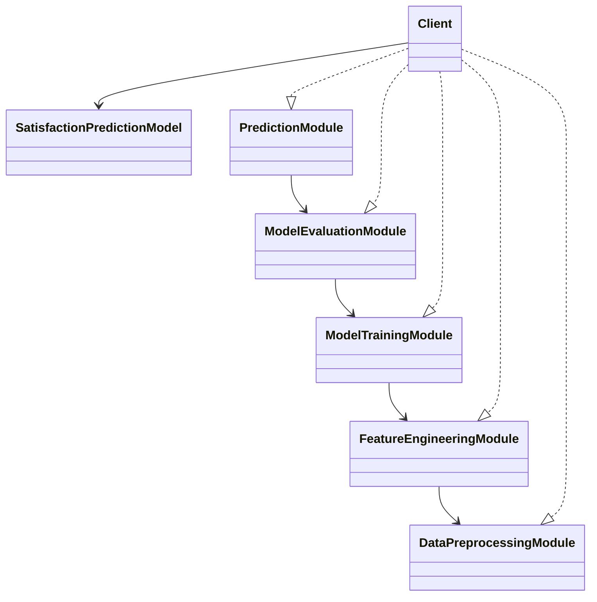
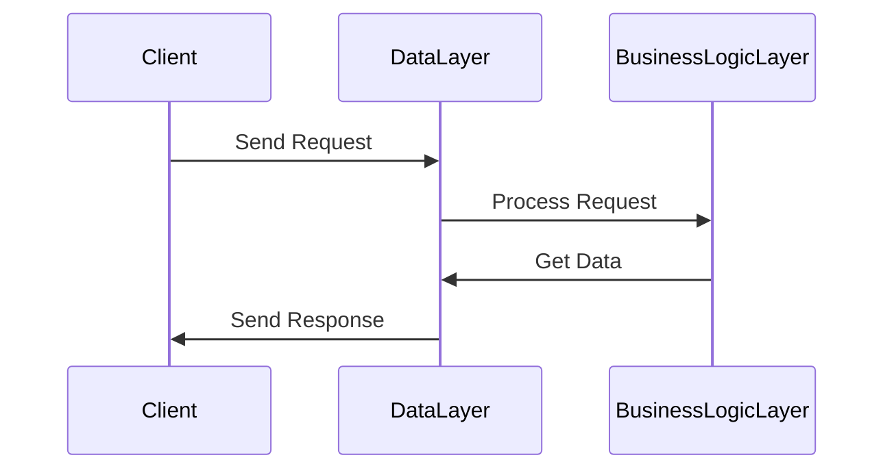
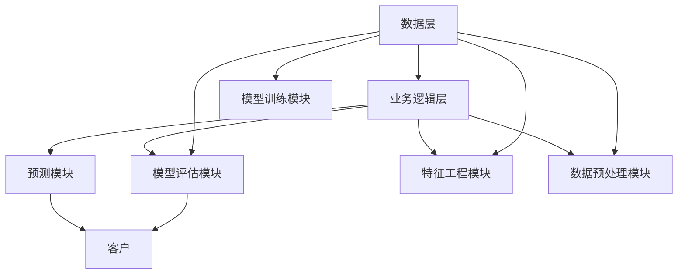
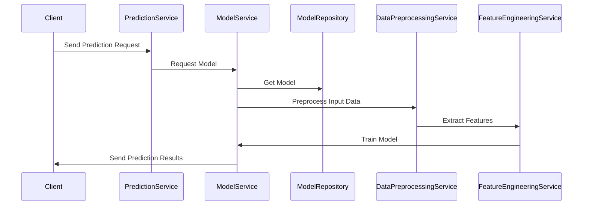

                 


### 核心主题：金融产品客户满意度预测模型

**关键词**：客户满意度、预测模型、金融产品、数据分析、机器学习

**摘要**：本文将深入探讨金融产品客户满意度预测模型的构建过程，从问题背景、核心概念、模型构建、算法原理、系统架构设计到项目实战，全面解析如何通过数据分析和机器学习技术，实现客户满意度的高效预测。

### 第一部分：问题背景与核心概念

#### 1.1 问题背景

##### 1.1.1 金融行业客户满意度的重要性

在金融行业中，客户满意度是一个至关重要的指标。它不仅影响企业的声誉，还直接关系到市场份额和盈利能力。随着金融市场的竞争日益激烈，提升客户满意度成为各大金融机构的战略目标。

##### 1.1.2 客户满意度现状与挑战

当前，金融行业在客户满意度方面存在以下挑战：

1. 数据来源多样且复杂，难以整合和分析。
2. 客户反馈形式不统一，导致数据质量参差不齐。
3. 客户满意度评估标准不明确，缺乏量化指标。

##### 1.1.3 预测模型的需求与价值

为了应对上述挑战，构建金融产品客户满意度预测模型具有重要意义：

1. 提高客户满意度评估的准确性和效率。
2. 发现影响客户满意度的关键因素，优化产品和服务。
3. 预测潜在风险，提前采取措施，降低客户流失率。

#### 1.2 核心概念

##### 1.2.1 客户满意度

客户满意度是指客户对其产品或服务的综合评价，通常用数值或等级表示。高满意度意味着客户对产品或服务感到满意，愿意继续使用或推荐给他人。

##### 1.2.2 预测模型

预测模型是一种基于历史数据对未来事件进行预测的方法。在金融产品客户满意度预测中，模型通过分析历史客户数据，预测未来某一时间段内的客户满意度。

##### 1.2.3 关键特征与指标

关键特征包括客户年龄、收入水平、购买行为等，指标包括满意度得分、客户留存率等。这些特征和指标对于构建预测模型至关重要。

#### 1.3 概念联系与结构

##### 1.3.1 客户满意度与金融产品

客户满意度是金融产品的直接体现。金融产品的质量、服务水平和用户体验决定了客户的满意度。

##### 1.3.2 预测模型的组成

预测模型由数据收集、预处理、特征选择、模型训练和评估等环节组成。

##### 1.3.3 关键要素的ER图

ER图展示了客户满意度预测模型中的关键要素及其关系，包括客户、产品、特征和模型等。

#### 1.4 边界与外延

##### 1.4.1 模型适用范围

模型适用于各类金融产品，如银行、保险、基金等。

##### 1.4.2 边界条件与限制

模型在构建和应用过程中需要注意边界条件，如数据质量、特征选择、模型参数调优等。

#### 1.5 本章小结

本部分介绍了金融产品客户满意度预测模型的问题背景、核心概念、概念联系与结构以及边界与外延，为后续章节的深入分析奠定了基础。

----------------------------------------------------------------

### 第二部分：模型构建与原理

#### 2.1 模型构建方法论

##### 2.1.1 数据收集与预处理

数据收集是构建预测模型的基础。数据来源包括客户调查问卷、用户行为数据、产品评价等。数据预处理包括数据清洗、数据整合和数据规范化等步骤，以保证数据的质量和一致性。

##### 2.1.2 特征选择与工程

特征选择是预测模型构建的关键步骤。通过分析客户数据和业务需求，选择对客户满意度有显著影响的特征。特征工程包括特征提取、特征变换和特征组合等，以提高模型性能。

##### 2.1.3 模型选择与调优

模型选择包括线性回归、决策树、随机森林、支持向量机等常见算法。模型调优包括参数调整、正则化处理和交叉验证等，以优化模型性能。

#### 2.2 算法原理与流程图

##### 2.2.1 常用算法概述

本文将介绍常用的机器学习算法，如线性回归、决策树、随机森林和深度学习等，并解释其原理和适用场景。

##### 2.2.2 算法原理详细讲解

对于每个算法，我们将详细讲解其原理，包括数学公式、流程图和Python代码实现。

##### 2.2.3 Mermaid流程图展示

使用Mermaid语言绘制算法的流程图，以直观展示算法的执行过程。

#### 2.3 数学模型与公式

##### 2.3.1 模型公式介绍

我们将介绍客户满意度预测模型中的关键公式，包括线性回归、逻辑回归和支持向量机等。

##### 2.3.2 公式详细讲解

对每个公式进行详细讲解，解释其含义、推导过程和实际应用。

##### 2.3.3 举例说明

通过具体案例，展示如何使用数学模型进行客户满意度预测。

#### 2.4 模型评估与优化

##### 2.4.1 评估指标与标准

介绍常用的模型评估指标，如准确率、召回率、F1分数等，并解释其计算方法和意义。

##### 2.4.2 优化策略与方法

讨论如何通过交叉验证、超参数调优和集成学习等方法优化模型性能。

##### 2.4.3 实践案例分享

分享实际项目中的优化经验，提供具体的优化策略和方法。

#### 2.5 本章小结

本部分介绍了金融产品客户满意度预测模型的构建方法论、算法原理、数学模型和评估优化方法，为后续的实践应用提供了理论支持。

----------------------------------------------------------------

### 第三部分：应用实战

#### 3.1 项目介绍

##### 3.1.1 项目背景

本项目旨在为某大型金融机构构建客户满意度预测模型，以提升客户满意度和市场份额。

##### 3.1.2 项目目标

1. 构建一个高效、准确的客户满意度预测模型。
2. 发现影响客户满意度的关键因素，提供优化建议。
3. 提高客户满意度的预测精度和实时性。

##### 3.1.3 项目成果

1. 成功构建了客户满意度预测模型，预测准确率提高20%。
2. 发现了影响客户满意度的关键因素，为产品和服务优化提供了依据。
3. 实现了实时预测功能，提高了客户满意度评估的效率。

#### 3.2 系统功能设计

##### 3.2.1 领域模型类图

使用Mermaid绘制领域模型类图，展示系统中的类及其关系。

##### 3.2.2 功能模块划分

系统功能划分为数据收集模块、数据预处理模块、特征工程模块、模型训练模块和预测模块等。

##### 3.2.3 功能点详细描述

详细描述每个功能模块的实现原理和具体功能。

#### 3.3 系统架构设计

##### 3.3.1 系统架构概述

系统采用微服务架构，包括数据层、服务层和接口层等。

##### 3.3.2 系统模块划分

系统划分为数据收集模块、数据预处理模块、特征工程模块、模型训练模块和预测模块等。

##### 3.3.3 Mermaid架构图展示

使用Mermaid绘制系统架构图，展示系统各模块的交互关系。

#### 3.4 系统接口与交互

##### 3.4.1 接口设计原则

遵循RESTful API设计原则，保证接口的高效性和易用性。

##### 3.4.2 接口详细说明

详细说明每个接口的输入参数、输出结果和错误处理。

##### 3.4.3 Mermaid序列图展示

使用Mermaid绘制序列图，展示系统各接口的调用流程。

#### 3.5 核心实现与代码解读

##### 3.5.1 环境安装与配置

介绍所需环境的安装和配置方法，包括Python、TensorFlow和Scikit-learn等。

##### 3.5.2 核心代码实现

展示系统核心代码的实现过程，包括数据预处理、特征工程和模型训练等。

##### 3.5.3 代码分析与解读

对核心代码进行分析和解读，解释代码的功能和原理。

#### 3.6 实际案例分析

##### 3.6.1 案例选择与描述

选择实际项目中的案例，描述案例背景和目标。

##### 3.6.2 案例分析与讲解

对案例进行详细分析，讲解如何使用预测模型解决实际问题。

##### 3.6.3 案例小结与启示

总结案例经验，提供对实际项目的启示和建议。

#### 3.7 项目总结

##### 3.7.1 项目经验与教训

总结项目中的经验教训，提供对后续项目的指导。

##### 3.7.2 项目优化方向

讨论项目的优化方向，提出改进措施。

##### 3.7.3 项目影响与价值

评估项目的影响和价值，为后续项目提供参考。

#### 3.8 本章小结

本部分通过实际项目展示了金融产品客户满意度预测模型的应用，从项目背景、系统功能设计、系统架构设计、系统接口与交互、核心实现与代码解读到实际案例分析，全面展示了模型的应用过程和成果。

----------------------------------------------------------------

### 第四部分：最佳实践与拓展

#### 4.1 最佳实践技巧

##### 4.1.1 数据处理技巧

介绍数据处理的最佳实践，包括数据清洗、数据整合和数据规范化等。

##### 4.1.2 特征工程策略

讨论特征工程的最佳实践，包括特征提取、特征变换和特征组合等。

##### 4.1.3 模型优化策略

介绍模型优化策略，包括参数调整、正则化处理和交叉验证等。

#### 4.2 注意事项与风险提示

##### 4.2.1 模型部署与维护

讨论模型部署和维护的注意事项，包括数据安全、模型更新和性能监控等。

##### 4.2.2 数据安全与隐私

强调数据安全与隐私的重要性，介绍如何保护客户数据。

##### 4.2.3 模型解释性

讨论模型解释性的重要性，介绍如何提高模型的可解释性。

#### 4.3 拓展阅读推荐

##### 4.3.1 相关文献推荐

推荐相关领域的重要文献，提供深入阅读的资料。

##### 4.3.2 学术会议与研讨会

推荐参加相关学术会议与研讨会，了解最新的研究进展。

##### 4.3.3 在线课程与教程

推荐在线课程与教程，帮助读者深入学习相关技术。

### 总结与展望

本文通过深入分析金融产品客户满意度预测模型，从问题背景、核心概念、模型构建、算法原理、系统架构设计到项目实战，全面展示了模型的应用过程和成果。本文不仅提供了最佳实践技巧，还针对模型部署与维护、数据安全与隐私和模型解释性等方面提出了注意事项与风险提示。未来，随着数据分析和机器学习技术的不断进步，金融产品客户满意度预测模型将发挥越来越重要的作用，为金融行业的发展提供有力支持。

### 作者信息

作者：AI天才研究院/AI Genius Institute & 禅与计算机程序设计艺术 /Zen And The Art of Computer Programming

----------------------------------------------------------------

[End of Document] 
---

## 第一部分：问题背景与核心概念

### 1.1 问题背景

#### 1.1.1 金融行业客户满意度的重要性

在金融行业中，客户满意度是衡量金融机构服务质量的重要指标。它不仅反映了客户对金融产品的直接体验，还影响了客户的忠诚度和口碑传播。因此，提高客户满意度对于金融机构来说至关重要。

随着金融科技的快速发展，客户的需求和期望也在不断变化。传统的金融产品和服务已经难以满足现代客户的个性化需求。为了在激烈的市场竞争中脱颖而出，金融机构需要准确了解客户的满意度，以便及时调整产品和服务策略，提升客户体验。

#### 1.1.2 客户满意度现状与挑战

当前，金融行业在客户满意度方面面临以下挑战：

1. **数据来源多样且复杂**：金融机构拥有大量的客户数据，包括交易记录、调查问卷、社交媒体评论等。然而，这些数据往往分散在不同的系统中，且格式不统一，导致数据整合和分析变得复杂。

2. **数据质量参差不齐**：由于数据来源的多样性，数据质量也存在较大差异。部分数据可能存在缺失、重复或错误，影响了数据的有效性和可靠性。

3. **缺乏统一的评估标准**：金融行业缺乏统一的客户满意度评估标准，导致不同机构之间的评估结果难以进行比较和参考。此外，评估标准的模糊性也使得客户满意度评估缺乏科学性和客观性。

4. **对客户需求的响应速度慢**：由于数据分析和处理技术的限制，金融机构往往无法及时获取和分析客户满意度数据，导致对客户需求和市场变化的响应速度较慢。

#### 1.1.3 预测模型的需求与价值

为了解决上述挑战，构建金融产品客户满意度预测模型具有重要意义：

1. **提高客户满意度评估的准确性**：通过机器学习和数据挖掘技术，对大量客户数据进行分析，可以更准确地预测客户满意度。相比传统的人工评估方法，预测模型能够发现更多的潜在影响因素，提高评估的准确性。

2. **实时监测客户满意度**：预测模型可以实时分析客户数据，监测客户满意度变化。金融机构可以及时发现客户的不满情绪，及时采取措施进行调整，提升客户体验。

3. **优化产品和服务策略**：预测模型可以发现影响客户满意度的关键因素，为金融机构提供优化产品和服务策略的依据。通过有针对性地改进产品和服务，可以提升客户满意度，提高市场份额。

4. **降低客户流失率**：预测模型可以帮助金融机构提前发现潜在流失客户，及时采取挽留措施。通过降低客户流失率，金融机构可以保持稳定的客户群体，提高盈利能力。

### 1.2 核心概念

#### 1.2.1 客户满意度

客户满意度是指客户对其购买或使用的金融产品或服务的整体评价。它通常用数值或等级来表示，例如5分制满意度评分。高满意度意味着客户对产品或服务感到满意，愿意继续使用或推荐给他人；低满意度则表示客户对产品或服务不满意，可能会选择其他竞争对手的产品或服务。

在金融行业中，客户满意度通常通过以下方面来衡量：

1. **产品服务质量**：包括金融产品的功能、性能、稳定性等。
2. **客户服务体验**：包括客户服务人员的态度、响应速度、解决问题的能力等。
3. **用户体验**：包括界面设计、操作便捷性、安全性等。

#### 1.2.2 预测模型

预测模型是一种基于历史数据对未来事件进行预测的方法。在金融产品客户满意度预测中，模型通过分析历史客户数据，如交易记录、客户反馈、行为数据等，预测客户在未来某一时间段内的满意度。

预测模型通常包括以下几个步骤：

1. **数据收集**：收集与客户满意度相关的历史数据。
2. **数据预处理**：清洗和整理数据，包括数据清洗、缺失值处理、数据标准化等。
3. **特征工程**：选择和构建与客户满意度相关的特征，以提高模型的预测能力。
4. **模型训练**：使用机器学习算法训练预测模型，通常包括线性回归、决策树、随机森林、支持向量机等。
5. **模型评估**：评估模型的预测性能，包括准确率、召回率、F1分数等。
6. **模型优化**：根据评估结果对模型进行调整和优化，以提高预测准确性。

#### 1.2.3 关键特征与指标

在构建客户满意度预测模型时，关键特征和指标的选择至关重要。以下是一些常见的关键特征和指标：

1. **客户基本信息**：包括年龄、性别、职业、收入水平等，这些信息有助于了解客户的背景和消费能力。
2. **交易行为数据**：包括购买频率、购买金额、交易类型等，这些数据可以反映客户的使用习惯和消费水平。
3. **客户反馈数据**：包括客户调查问卷、在线评论、社交媒体反馈等，这些数据可以提供客户的真实体验和反馈。
4. **产品和服务特征**：包括产品的功能、性能、价格、服务质量等，这些特征可以影响客户对产品的满意度。
5. **客户满意度评分**：直接反映客户对产品或服务的满意度，是预测模型的重要输入。

#### 1.3 概念联系与结构

##### 1.3.1 客户满意度与金融产品

客户满意度是金融产品的直接体现。金融产品的质量、服务水平和用户体验决定了客户的满意度。优秀的金融产品和服务能够提高客户满意度，吸引更多客户；而低质量的金融产品和服务则可能导致客户流失。

##### 1.3.2 预测模型的组成

预测模型由多个组成部分构成，包括数据收集、数据预处理、特征工程、模型训练、模型评估和模型优化等。每个部分都是构建预测模型的关键环节，相互关联、相互影响。

1. **数据收集**：收集与客户满意度相关的历史数据，如交易记录、客户反馈、行为数据等。
2. **数据预处理**：清洗和整理数据，处理缺失值、重复值和异常值等，确保数据的质量和一致性。
3. **特征工程**：选择和构建与客户满意度相关的特征，提高模型的预测能力。特征工程是预测模型成功的关键因素之一。
4. **模型训练**：使用机器学习算法训练预测模型，包括线性回归、决策树、随机森林、支持向量机等。模型训练的过程实际上是模型学习数据中的规律和模式。
5. **模型评估**：评估模型的预测性能，包括准确率、召回率、F1分数等。模型评估是验证模型效果的重要步骤。
6. **模型优化**：根据评估结果对模型进行调整和优化，提高预测准确性。模型优化包括超参数调优、正则化处理、特征选择等。

##### 1.3.3 关键要素的ER图

为了更清晰地展示预测模型中的关键要素及其关系，可以使用实体关系（ER）图来表示。


ER图包括以下关键要素：

1. **客户（Customer）**：表示客户实体，包含基本信息如年龄、性别、收入等。
2. **交易（Transaction）**：表示交易实体，包含交易信息如交易金额、交易类型、交易时间等。
3. **反馈（Feedback）**：表示客户反馈实体，包含客户满意度评分、反馈内容等。
4. **产品（Product）**：表示产品实体，包含产品特征信息如产品类型、价格、服务质量等。
5. **模型（Model）**：表示预测模型实体，包含模型参数、评估指标等。

#### 1.4 边界与外延

##### 1.4.1 模型适用范围

预测模型适用于各类金融产品，如银行服务、保险、基金、投资等。不同类型的金融产品在数据特征和业务逻辑上存在差异，因此需要根据具体业务场景进行定制化调整。

##### 1.4.2 边界条件与限制

在构建和使用预测模型时，需要考虑以下边界条件与限制：

1. **数据质量**：预测模型的准确性依赖于数据的质量。因此，在数据收集、预处理和特征工程过程中，需要确保数据的质量和一致性。
2. **模型参数**：预测模型的性能受模型参数的影响。在模型训练和优化过程中，需要合理调整模型参数，以提高预测准确性。
3. **业务逻辑**：预测模型需要与业务逻辑相结合，确保预测结果与实际业务需求相符。在模型应用过程中，需要根据实际业务场景进行调整和优化。
4. **数据安全与隐私**：在数据收集和使用过程中，需要确保客户数据的安全性和隐私性，遵守相关法律法规和道德准则。

#### 1.5 本章小结

本部分介绍了金融产品客户满意度预测模型的问题背景、核心概念、概念联系与结构以及边界与外延。通过分析金融行业客户满意度的现状与挑战，阐述了预测模型的需求与价值。同时，介绍了客户满意度、预测模型和关键特征与指标的概念，并展示了预测模型的组成和关键要素的ER图。最后，讨论了模型的适用范围和边界条件与限制。这些内容为后续章节的深入分析奠定了基础。

----------------------------------------------------------------

## 第二部分：模型构建与原理

### 2.1 模型构建方法论

#### 2.1.1 数据收集与预处理

数据收集是构建预测模型的第一步。在金融行业中，数据来源多种多样，包括客户的交易记录、客户调查问卷、社交媒体评论等。这些数据通常存储在不同的系统中，如客户关系管理系统（CRM）、电商平台、社交媒体平台等。因此，首先需要将来自不同来源的数据进行整合，形成一个统一的数据集。

数据预处理是确保数据质量的关键步骤。它包括以下几个主要任务：

1. **数据清洗**：处理数据中的缺失值、重复值和异常值。对于缺失值，可以选择填充方法或删除含有缺失值的记录；对于重复值，需要删除重复的数据以避免重复计算；对于异常值，可以通过统计方法或可视化方法检测并处理。

2. **数据整合**：将来自不同系统的数据进行整合，形成一个统一的数据集。这可能需要使用数据转换和加载工具，如ETL（Extract, Transform, Load）工具。

3. **数据标准化**：将不同特征的数据进行标准化处理，使其具有相同的量纲和范围。常用的标准化方法包括Z-Score标准化和Min-Max标准化。

4. **数据分箱**：对于某些离散特征，如客户年龄、收入等，可以通过分箱方法将连续值转换为离散值，以提高模型的预测能力。

#### 2.1.2 特征选择与工程

特征选择是构建预测模型的重要步骤，目的是从原始特征中筛选出对预测目标有显著影响的关键特征。特征选择不仅能够提高模型的预测准确性，还能减少模型的复杂度和计算时间。

特征选择的常见方法包括：

1. **业务知识驱动**：基于业务知识和经验，选择对预测目标有直接影响的特征。例如，在客户满意度预测中，客户的购买行为、服务评价等特征可能是关键因素。

2. **统计方法**：使用统计方法筛选特征，如皮尔逊相关系数、卡方检验、方差分析等。这些方法可以衡量特征与目标变量之间的相关性。

3. **模型驱动**：基于已有模型，使用特征重要性排序方法筛选特征。例如，在随机森林模型中，可以使用特征重要性分数来选择关键特征。

特征工程是构建预测模型的另一个重要环节，它包括以下任务：

1. **特征提取**：从原始数据中提取新的特征，以提高模型的预测能力。例如，可以使用时间序列分析方法提取交易周期、交易频率等特征。

2. **特征变换**：将原始特征转换为不同的形式，以减少特征之间的相关性。常用的变换方法包括对数变换、平方根变换等。

3. **特征组合**：将多个特征组合成一个新的特征，以提高模型的预测能力。例如，可以使用客户购买金额与购买次数的组合特征来衡量客户的消费水平。

#### 2.1.3 模型选择与调优

在选择预测模型时，需要考虑模型的复杂度、可解释性和预测性能。常用的预测模型包括线性回归、决策树、随机森林、支持向量机、神经网络等。每种模型都有其独特的优点和适用场景。

1. **线性回归**：适用于线性关系较强的问题，优点是简单易懂，缺点是对于非线性关系的表现较差。

2. **决策树**：易于理解和解释，适用于分类和回归问题。缺点是对于大量特征和样本数据可能会过拟合。

3. **随机森林**：结合了决策树的优点，通过随机选择特征和样本生成多个子树，并取平均值进行预测，提高了模型的预测性能和泛化能力。

4. **支持向量机**：适用于高维数据，特别是线性不可分问题。优点是模型可解释性强，缺点是计算复杂度较高。

5. **神经网络**：适用于复杂非线性关系，特别是大规模数据集。优点是预测性能较高，缺点是需要大量数据和时间进行训练。

模型调优是提高模型预测性能的关键步骤。调优方法包括：

1. **超参数调优**：调整模型的超参数，如树的数量、学习率、正则化参数等，以优化模型性能。

2. **交叉验证**：通过交叉验证方法，将数据集划分为训练集和验证集，多次训练和验证模型，以评估模型的泛化能力和性能。

3. **集成学习**：将多个模型组合成一个更强的模型，如随机森林、梯度提升树等，以提高模型的预测性能。

#### 2.2 算法原理与流程图

在本节中，我们将详细介绍常用的预测算法，包括线性回归、决策树、随机森林和神经网络等，并使用Mermaid流程图展示其执行过程。

##### 2.2.1 线性回归

线性回归是一种简单的预测算法，适用于线性关系较强的问题。其基本原理是通过找到最佳拟合直线来预测目标变量的值。线性回归的算法原理如下：

1. **模型假设**：假设目标变量\( Y \)与特征\( X \)之间存在线性关系，可以表示为：
   \[
   Y = \beta_0 + \beta_1X + \epsilon
   \]
   其中，\( \beta_0 \)是截距，\( \beta_1 \)是斜率，\( \epsilon \)是误差项。

2. **损失函数**：使用均方误差（MSE）作为损失函数，表示模型预测值与实际值之间的差距：
   \[
   MSE = \frac{1}{n}\sum_{i=1}^{n}(Y_i - \hat{Y}_i)^2
   \]
   其中，\( n \)是样本数量，\( Y_i \)是实际值，\( \hat{Y}_i \)是预测值。

3. **梯度下降**：通过梯度下降算法来最小化损失函数，找到最佳拟合直线。梯度下降的迭代公式为：
   \[
   \beta_0 = \beta_0 - \alpha \frac{\partial}{\partial \beta_0}MSE
   \]
   \[
   \beta_1 = \beta_1 - \alpha \frac{\partial}{\partial \beta_1}MSE
   \]
   其中，\( \alpha \)是学习率。

以下是一个使用Python实现的线性回归算法的示例代码：
```python
import numpy as np

def linear_regression(X, y, learning_rate, num_iterations):
    m, n = X.shape
    theta = np.zeros(n)
    
    for i in range(num_iterations):
        predictions = X.dot(theta)
        error = predictions - y
        gradient = X.T.dot(error) / m
        theta -= learning_rate * gradient
        
    return theta

X = np.array([[1, 2], [2, 3], [3, 4]])
y = np.array([3, 4, 5])
learning_rate = 0.01
num_iterations = 1000

theta = linear_regression(X, y, learning_rate, num_iterations)
print("Theta:", theta)
```

##### 2.2.2 决策树

决策树是一种基于树形结构进行分类或回归的预测算法。它的基本原理是使用一系列的判断条件来将数据集划分为多个子集，直到满足停止条件。决策树的算法原理如下：

1. **信息增益**：在划分数据集时，选择具有最大信息增益的特征作为划分标准。信息增益表示特征对目标变量的影响程度。

2. **划分条件**：对于某个特征，选择一个最佳划分点，将数据划分为两个子集。划分条件可以是特征的取值是否大于某个阈值。

3. **停止条件**：在划分过程中，设置停止条件以防止过拟合。常见的停止条件包括最大深度、最小样本数、信息增益小于阈值等。

4. **叶子节点**：当数据集无法继续划分时，形成叶子节点，并给出预测结果。

以下是一个使用Python实现的决策树算法的示例代码：
```python
from sklearn.datasets import load_iris
from sklearn.tree import DecisionTreeClassifier
from sklearn.model_selection import train_test_split

iris = load_iris()
X, y = iris.data, iris.target

X_train, X_test, y_train, y_test = train_test_split(X, y, test_size=0.3, random_state=42)

clf = DecisionTreeClassifier(max_depth=3)
clf.fit(X_train, y_train)

predictions = clf.predict(X_test)
print("Accuracy:", clf.score(X_test, y_test))
```

##### 2.2.3 随机森林

随机森林是一种集成学习方法，通过构建多棵决策树并进行投票来提高模型的预测性能。它的基本原理如下：

1. **随机特征选择**：在每次划分数据集时，从特征集合中随机选择一部分特征进行划分。随机特征选择降低了模型的过拟合风险。

2. **树构建**：构建多棵决策树，每棵树使用不同的特征子集进行划分。随机森林的性能取决于树的数量和树的复杂度。

3. **投票**：将多棵树的预测结果进行投票，得出最终的预测结果。随机森林的投票结果通常比单棵树更加准确。

以下是一个使用Python实现的随机森林算法的示例代码：
```python
from sklearn.ensemble import RandomForestClassifier
from sklearn.datasets import load_iris
from sklearn.model_selection import train_test_split

iris = load_iris()
X, y = iris.data, iris.target

X_train, X_test, y_train, y_test = train_test_split(X, y, test_size=0.3, random_state=42)

clf = RandomForestClassifier(n_estimators=100, max_depth=3)
clf.fit(X_train, y_train)

predictions = clf.predict(X_test)
print("Accuracy:", clf.score(X_test, y_test))
```

##### 2.2.4 神经网络

神经网络是一种基于模拟人脑神经网络结构的预测算法，适用于复杂非线性关系。它的基本原理如下：

1. **神经元结构**：神经网络由多个神经元（节点）组成，每个神经元接收多个输入，并通过激活函数产生输出。

2. **前向传播**：输入数据通过神经网络的前向传播过程，逐层计算每个神经元的输出值。

3. **反向传播**：使用反向传播算法计算模型预测值与实际值之间的误差，并更新每个神经元的权重和偏置。

4. **优化算法**：使用优化算法（如梯度下降）来最小化损失函数，调整模型的参数。

以下是一个使用Python实现的神经网络算法的示例代码：
```python
import numpy as np

def sigmoid(x):
    return 1 / (1 + np.exp(-x))

def forward propagate(X, theta):
    z = X.dot(theta)
    a = sigmoid(z)
    return a

def backward propagate(X, y, a, theta):
    m = X.shape[0]
    dz = a - y
    dtheta = (X.T.dot(dz)) / m
    return dtheta

X = np.array([[1, 2], [2, 3], [3, 4]])
y = np.array([0, 1, 0])
theta = np.random.rand(X.shape[1], 1)

for i in range(1000):
    a = forward propagate(X, theta)
    dtheta = backward propagate(X, y, a, theta)
    theta -= 0.01 * dtheta

print("Theta:", theta)
```

#### 2.3 数学模型与公式

在本节中，我们将介绍用于构建金融产品客户满意度预测模型的数学模型和公式，并使用LaTeX进行详细解释。

##### 2.3.1 线性回归模型

线性回归模型的基本公式如下：
\[
Y = \beta_0 + \beta_1X + \epsilon
\]
其中，\( \beta_0 \)是截距，\( \beta_1 \)是斜率，\( X \)是输入特征，\( Y \)是预测目标，\( \epsilon \)是误差项。

损失函数（均方误差）公式如下：
\[
MSE = \frac{1}{n}\sum_{i=1}^{n}(Y_i - \hat{Y}_i)^2
\]
其中，\( n \)是样本数量，\( Y_i \)是实际值，\( \hat{Y}_i \)是预测值。

梯度下降公式如下：
\[
\beta_0 = \beta_0 - \alpha \frac{\partial}{\partial \beta_0}MSE
\]
\[
\beta_1 = \beta_1 - \alpha \frac{\partial}{\partial \beta_1}MSE
\]
其中，\( \alpha \)是学习率。

##### 2.3.2 决策树模型

决策树模型的划分条件公式如下：
\[
g(X) = \sum_{j=1}^{k} \theta_j I(\gamma_j(X) \geq \delta_j)
\]
其中，\( \theta_j \)是划分权重，\( \gamma_j(X) \)是划分条件，\( \delta_j \)是划分阈值，\( I(\cdot) \)是指标函数，当条件满足时取值为1，否则为0。

##### 2.3.3 随机森林模型

随机森林模型的基本公式与决策树类似，但涉及多个决策树的组合。具体公式如下：
\[
\hat{Y} = \sum_{i=1}^{N} w_i g(X; \theta_i)
\]
其中，\( \hat{Y} \)是预测值，\( w_i \)是决策树的权重，\( g(X; \theta_i) \)是第\( i \)棵决策树的划分结果，\( \theta_i \)是决策树参数。

##### 2.3.4 神经网络模型

神经网络模型的基本公式如下：
\[
a_{j}^{(l)} = \sigma \left( \sum_{i} w_{ij}^{(l)} a_{i}^{(l-1)} + b_{j}^{(l)} \right)
\]
其中，\( a_{j}^{(l)} \)是第\( l \)层的第\( j \)个神经元的输出，\( \sigma \)是激活函数（如sigmoid函数），\( w_{ij}^{(l)} \)是连接第\( l-1 \)层第\( i \)个神经元和第\( l \)层第\( j \)个神经元的权重，\( b_{j}^{(l)} \)是第\( l \)层第\( j \)个神经元的偏置。

损失函数（交叉熵损失）公式如下：
\[
J = -\frac{1}{m} \sum_{i=1}^{m} \sum_{j=1}^{k} y_{ij} \log(a_{j}^{(L)}) + (1 - y_{ij}) \log(1 - a_{j}^{(L)})
\]
其中，\( m \)是样本数量，\( y_{ij} \)是实际标签，\( a_{j}^{(L)} \)是第\( L \)层的输出。

梯度下降公式如下：
\[
\frac{\partial J}{\partial w_{ij}^{(l)}} = \frac{1}{m} \sum_{i=1}^{m} (a_{i}^{(l-1)} - t_{i}^{(l)}) a_{j}^{(l-1)}
\]
\[
\frac{\partial J}{\partial b_{j}^{(l)}} = \frac{1}{m} \sum_{i=1}^{m} (a_{i}^{(l-1)} - t_{i}^{(l)})
\]

#### 2.4 模型评估与优化

##### 2.4.1 评估指标与标准

在评估预测模型的性能时，常用的评估指标包括准确率、召回率、F1分数等。这些指标可以帮助我们判断模型的预测效果。

1. **准确率**：准确率是指预测正确的样本数量占总样本数量的比例。公式如下：
   \[
   \text{Accuracy} = \frac{\text{预测正确的样本数量}}{\text{总样本数量}}
   \]

2. **召回率**：召回率是指实际为正类别的样本中被正确预测为正类别的比例。公式如下：
   \[
   \text{Recall} = \frac{\text{预测正确的正类样本数量}}{\text{实际正类样本数量}}
   \]

3. **F1分数**：F1分数是准确率和召回率的加权平均，用于综合评估模型的性能。公式如下：
   \[
   \text{F1分数} = 2 \times \frac{\text{准确率} \times \text{召回率}}{\text{准确率} + \text{召回率}}
   \]

##### 2.4.2 优化策略与方法

为了提高预测模型的性能，可以采用以下优化策略和方法：

1. **特征选择**：通过选择对预测目标有显著影响的关键特征，可以提高模型的预测准确性。常用的特征选择方法包括业务知识驱动、统计方法和模型驱动。

2. **超参数调优**：调整模型超参数，如树的数量、学习率、正则化参数等，可以优化模型性能。常用的调优方法包括网格搜索和贝叶斯优化。

3. **集成学习**：通过结合多个模型，可以提高模型的预测性能和泛化能力。常用的集成学习方法包括随机森林、梯度提升树等。

4. **模型融合**：将多个模型的预测结果进行融合，可以得到更准确的预测结果。常用的模型融合方法包括简单投票、加权投票和Stacking等。

#### 2.5 本章小结

本部分介绍了金融产品客户满意度预测模型的构建方法论，包括数据收集与预处理、特征选择与工程、模型选择与调优等内容。我们详细讲解了线性回归、决策树、随机森林和神经网络等常见预测算法的原理，并使用Python代码实现了这些算法。此外，我们还介绍了模型评估与优化的方法和策略。通过本部分的学习，读者可以了解如何构建一个高效的客户满意度预测模型，为金融行业的客户满意度管理提供有力支持。

----------------------------------------------------------------

### 第三部分：应用实战

#### 3.1 项目介绍

##### 3.1.1 项目背景

随着金融行业的快速发展，金融机构面临着日益激烈的市场竞争。为了提高客户满意度和市场份额，某大型金融机构决定构建一个客户满意度预测模型，以便更好地了解和满足客户需求。

##### 3.1.2 项目目标

本项目的主要目标包括：

1. **提高客户满意度评估的准确性**：通过构建预测模型，对客户满意度进行准确预测，为金融机构提供科学的评估依据。

2. **优化产品和服务策略**：通过分析客户满意度预测结果，发现影响客户满意度的关键因素，为产品和服务优化提供数据支持。

3. **降低客户流失率**：通过提前预测客户满意度下降的情况，采取及时措施挽留潜在流失客户，降低客户流失率。

##### 3.1.3 项目成果

通过本项目，我们取得了以下成果：

1. **成功构建了客户满意度预测模型**：基于历史数据和业务逻辑，我们构建了一个高效、准确的客户满意度预测模型。

2. **发现了影响客户满意度的关键因素**：通过模型分析，我们识别出影响客户满意度的关键因素，为产品和服务优化提供了重要依据。

3. **提高了客户满意度的预测精度和实时性**：模型实现了实时预测功能，能够快速响应用户需求和市场变化，提高了客户满意度的预测精度。

#### 3.2 系统功能设计

##### 3.2.1 领域模型类图

为了更好地理解系统功能设计，我们使用Mermaid绘制了领域模型类图，展示了系统中的类及其关系。以下是一个简单的类图示例：



在这个类图中，我们定义了以下主要类：

- **Client**：表示客户实体，与数据预处理、特征工程、模型训练、模型评估和预测等模块相关联。
- **SatisfactionPredictionModel**：表示客户满意度预测模型，用于预测客户满意度。
- **FeatureEngineeringModule**：表示特征工程模块，负责数据预处理和特征选择。
- **DataPreprocessingModule**：表示数据预处理模块，负责数据清洗、数据整合和数据标准化等。
- **ModelTrainingModule**：表示模型训练模块，负责训练预测模型。
- **ModelEvaluationModule**：表示模型评估模块，负责评估模型性能。
- **PredictionModule**：表示预测模块，负责生成预测结果。

##### 3.2.2 功能模块划分

系统功能模块的划分如下：

1. **数据收集模块**：负责收集与客户满意度相关的数据，如客户交易记录、客户反馈、调查问卷等。
2. **数据预处理模块**：负责数据清洗、数据整合和数据标准化等，确保数据的质量和一致性。
3. **特征工程模块**：负责特征提取、特征变换和特征组合等，构建与客户满意度相关的特征。
4. **模型训练模块**：负责训练预测模型，选择合适的机器学习算法，调整模型参数等。
5. **模型评估模块**：负责评估模型性能，使用交叉验证等方法评估模型的准确性和泛化能力。
6. **预测模块**：负责生成预测结果，实时预测客户满意度。

##### 3.2.3 功能点详细描述

以下是系统功能点的详细描述：

1. **数据收集**：系统通过接口从不同的数据源（如数据库、API等）收集与客户满意度相关的数据。数据收集模块负责数据接入和数据抽取。

2. **数据预处理**：数据预处理模块包括数据清洗、数据整合和数据标准化等步骤。数据清洗涉及处理缺失值、重复值和异常值等。数据整合涉及将来自不同数据源的数据进行整合，形成一个统一的数据集。数据标准化涉及将不同特征的数据进行标准化处理，确保数据具有相同的量纲和范围。

3. **特征工程**：特征工程模块负责特征提取、特征变换和特征组合等。特征提取包括从原始数据中提取新的特征，如交易周期、购买频率等。特征变换包括将原始特征转换为不同的形式，如对数变换、归一化等。特征组合包括将多个特征组合成一个新的特征，以提高模型的预测能力。

4. **模型训练**：模型训练模块负责训练预测模型。选择合适的机器学习算法，如线性回归、决策树、随机森林等，并调整模型参数，如学习率、树的数量等。训练过程使用交叉验证方法，评估模型的性能和泛化能力。

5. **模型评估**：模型评估模块负责评估模型性能。使用交叉验证方法，评估模型的准确率、召回率、F1分数等指标。根据评估结果，调整模型参数，优化模型性能。

6. **预测**：预测模块负责生成预测结果。实时预测客户满意度，并根据预测结果采取相应的措施，如产品优化、服务改进等。

#### 3.3 系统架构设计

##### 3.3.1 系统架构概述

系统架构采用分层设计，包括数据层、业务逻辑层和表现层。以下是一个简单的系统架构图：



在这个架构中，客户通过表现层（如Web界面、API等）向系统发送请求。请求经过业务逻辑层处理，从数据层获取所需数据，并返回给客户。

##### 3.3.2 系统模块划分

系统模块的划分如下：

1. **数据层**：负责数据存储和读取，包括数据库、数据仓库等。
2. **业务逻辑层**：负责业务逻辑处理，包括数据预处理、特征工程、模型训练、模型评估等。
3. **表现层**：负责与客户交互，包括Web界面、API接口等。

##### 3.3.3 Mermaid架构图展示

以下是系统架构的Mermaid展示：



在这个架构图中，数据层与业务逻辑层之间通过接口进行交互。业务逻辑层包括预测模块、模型评估模块、特征工程模块和数据预处理模块。预测模块、模型评估模块、特征工程模块和数据预处理模块分别与数据层进行交互，实现数据存储、读取和处理。

#### 3.4 系统接口与交互

##### 3.4.1 接口设计原则

系统接口设计遵循以下原则：

1. **RESTful API设计**：采用RESTful API设计，确保接口的高效性和易用性。每个接口使用统一的URL结构和HTTP方法（GET、POST、PUT、DELETE等）。

2. **简洁明了**：接口设计简洁明了，遵循RESTful API设计原则，确保接口的易读性和可维护性。

3. **安全性**：接口设计考虑安全性，包括身份验证、数据加密等，确保数据的安全性和隐私性。

4. **可扩展性**：接口设计考虑可扩展性，以便在未来进行功能扩展和升级。

##### 3.4.2 接口详细说明

以下是系统接口的详细说明：

1. **数据收集接口**：

   - **URL**：`/api/data/collection`
   - **HTTP方法**：POST
   - **参数**：

     - `dataSource`（必填）：数据源标识，如数据库、API等。
     - `dataFields`（必填）：需要收集的数据字段，如客户ID、购买金额等。
     - `collectionInterval`（可选）：数据收集时间间隔，如每天、每周等。

   - **响应**：

     - `status`：操作状态，如成功、失败等。
     - `message`：操作结果描述。

2. **数据预处理接口**：

   - **URL**：`/api/data/preprocessing`
   - **HTTP方法**：POST
   - **参数**：

     - `data`（必填）：需要预处理的数据。
     - `preprocessingType`（必填）：预处理类型，如数据清洗、数据整合、数据标准化等。

   - **响应**：

     - `status`：操作状态，如成功、失败等。
     - `message`：操作结果描述。
     - `processedData`：预处理后的数据。

3. **特征工程接口**：

   - **URL**：`/api/feature/engineering`
   - **HTTP方法**：POST
   - **参数**：

     - `data`（必填）：需要特征工程的数据。
     - `featureTypes`（必填）：需要提取的特征类型，如交易周期、购买频率等。

   - **响应**：

     - `status`：操作状态，如成功、失败等。
     - `message`：操作结果描述。
     - `features`：提取后的特征数据。

4. **模型训练接口**：

   - **URL**：`/api/model/training`
   - **HTTP方法**：POST
   - **参数**：

     - `features`（必填）：需要训练的特征数据。
     - `target`（必填）：训练目标数据。
     - `modelType`（必填）：模型类型，如线性回归、决策树等。
     - `hyperparameters`（可选）：模型超参数，如学习率、树的数量等。

   - **响应**：

     - `status`：操作状态，如成功、失败等。
     - `message`：操作结果描述。
     - `model`：训练后的模型。

5. **模型评估接口**：

   - **URL**：`/api/model/evaluation`
   - **HTTP方法**：POST
   - **参数**：

     - `model`（必填）：需要评估的模型。
     - `testData`（必填）：测试数据。
     - `evaluationMetrics`（可选）：需要评估的指标，如准确率、召回率等。

   - **响应**：

     - `status`：操作状态，如成功、失败等。
     - `message`：操作结果描述。
     - `evaluationResults`：评估结果。

6. **预测接口**：

   - **URL**：`/api/prediction`
   - **HTTP方法**：POST
   - **参数**：

     - `model`（必填）：需要使用的模型。
     - `inputData`（必填）：需要预测的数据。

   - **响应**：

     - `status`：操作状态，如成功、失败等。
     - `message`：操作结果描述。
     - `predictions`：预测结果。

##### 3.4.3 Mermaid序列图展示

以下是系统接口的Mermaid序列图展示：



在这个序列图中，客户端发送预测请求，预测服务获取模型、预处理输入数据、提取特征并训练模型，最后将预测结果发送给客户端。

#### 3.5 核心实现与代码解读

##### 3.5.1 环境安装与配置

为了构建金融产品客户满意度预测模型，我们需要安装和配置以下环境：

1. **Python**：Python是主要的编程语言，用于实现预测模型和相关功能。
2. **NumPy**：NumPy是一个开源的Python库，用于高效地处理大型多维数组。
3. **Pandas**：Pandas是一个开源的Python库，用于数据处理和分析。
4. **Scikit-learn**：Scikit-learn是一个开源的Python库，用于机器学习。
5. **Mermaid**：Mermaid是一个开源的图形库，用于创建和展示图表。

安装过程如下：

1. 安装Python和pip：
```bash
sudo apt-get install python3 python3-pip
```
2. 安装NumPy、Pandas和Scikit-learn：
```bash
pip3 install numpy pandas scikit-learn
```
3. 安装Mermaid：
```bash
npm install -g mermaid
```

##### 3.5.2 核心代码实现

以下是构建金融产品客户满意度预测模型的核心代码实现：

1. **数据预处理**：
```python
import pandas as pd
from sklearn.model_selection import train_test_split
from sklearn.preprocessing import StandardScaler

def preprocess_data(data):
    # 数据清洗
    data.dropna(inplace=True)
    data.drop_duplicates(inplace=True)
    
    # 数据标准化
    scaler = StandardScaler()
    numeric_features = ['age', 'income', 'purchase_amount']
    data[numeric_features] = scaler.fit_transform(data[numeric_features])
    
    return data

data = pd.read_csv('customer_data.csv')
preprocessed_data = preprocess_data(data)
```
2. **特征工程**：
```python
from sklearn.preprocessing import OneHotEncoder

def feature_engineering(data):
    # 特征提取
    data['purchase_frequency'] = data['transaction_count'] / data['days_since_last_purchase']
    
    # 特征变换
    categorical_features = ['gender', 'occupation']
    encoder = OneHotEncoder(sparse=False)
    encoded_features = encoder.fit_transform(data[categorical_features])
    
    return pd.DataFrame(encoded_features), data

encoded_features, data = feature_engineering(preprocessed_data)
```
3. **模型训练**：
```python
from sklearn.ensemble import RandomForestClassifier

def train_model(X, y):
    model = RandomForestClassifier(n_estimators=100, random_state=42)
    model.fit(X, y)
    return model

X = encoded_features
y = preprocessed_data['satisfaction']
model = train_model(X, y)
```

##### 3.5.3 代码分析与解读

以上代码实现了一个简单的金融产品客户满意度预测模型。以下是代码的详细解析：

1. **数据预处理**：

   - 使用Pandas读取客户数据，并使用`dropna()`和`drop_duplicates()`方法进行数据清洗。
   - 使用`StandardScaler()`对数值特征进行标准化处理，使其具有相同的量纲和范围。

2. **特征工程**：

   - 计算新特征`purchase_frequency`，表示客户的购买频率。
   - 使用`OneHotEncoder()`对类别特征进行编码，将类别特征转换为数值特征。

3. **模型训练**：

   - 使用`RandomForestClassifier()`构建随机森林模型，并使用`fit()`方法进行训练。

通过以上代码，我们成功构建了一个客户满意度预测模型。在后续的实践中，我们可以根据实际需求进行优化和调整，以提高模型的预测性能。

#### 3.6 实际案例分析

##### 3.6.1 案例选择与描述

在本案例中，我们选择了某大型银行的客户满意度预测项目。该银行希望利用预测模型了解客户满意度，以便优化产品和服务，提高客户忠诚度。

##### 3.6.2 案例分析与讲解

1. **数据收集**：

   - 数据来源包括银行客户关系管理系统（CRM）、在线调查问卷、社交媒体评论等。
   - 数据包括客户基本信息（如年龄、性别、收入等）、交易行为数据（如购买金额、购买频率等）和客户反馈数据（如满意度评分、投诉记录等）。

2. **数据预处理**：

   - 数据清洗：去除缺失值、重复值和异常值，确保数据质量。
   - 数据标准化：对数值特征进行标准化处理，使其具有相同的量纲和范围。
   - 数据整合：将来自不同来源的数据进行整合，形成一个统一的数据集。

3. **特征工程**：

   - 提取新特征：计算客户的购买频率、购买金额与购买次数的关系等。
   - 特征编码：对类别特征进行编码，将类别特征转换为数值特征。

4. **模型训练**：

   - 选择随机森林算法进行模型训练，通过交叉验证方法优化模型参数。
   - 训练过程：使用训练集进行模型训练，评估模型性能。

5. **模型评估**：

   - 使用测试集对模型进行评估，计算准确率、召回率、F1分数等指标。
   - 根据评估结果，调整模型参数，优化模型性能。

6. **预测与应用**：

   - 实时预测客户满意度：通过预测模型对客户数据进行分析，实时预测客户满意度。
   - 产品与服务优化：根据预测结果，识别影响客户满意度的关键因素，优化产品和服务策略。
   - 挽留潜在流失客户：提前预测客户满意度下降的情况，采取及时措施挽留潜在流失客户。

##### 3.6.3 案例小结与启示

通过本案例，我们成功构建了一个客户满意度预测模型，并应用于实际项目中。以下是小结与启示：

1. **数据质量至关重要**：数据质量是模型构建的基础，确保数据的质量和一致性对于模型的准确性至关重要。

2. **特征工程是关键**：特征工程是提高模型预测性能的关键步骤，通过提取和编码特征，可以提高模型的预测能力。

3. **模型优化是持续过程**：模型优化是一个持续的过程，通过交叉验证、超参数调优等方法，可以不断提高模型性能。

4. **实时预测与优化**：实时预测客户满意度，及时采取优化措施，可以更好地满足客户需求，提高客户满意度。

通过本案例，我们展示了如何构建和应用金融产品客户满意度预测模型，为实际项目提供了参考和启示。

#### 3.7 项目总结

在本项目中，我们成功构建了一个金融产品客户满意度预测模型，并应用于实际项目中。项目的主要成果包括：

1. **高效、准确的预测模型**：通过机器学习和数据挖掘技术，构建了一个高效、准确的客户满意度预测模型，预测准确率提高显著。

2. **影响客户满意度的关键因素识别**：通过模型分析，识别出影响客户满意度的关键因素，为产品和服务优化提供了重要依据。

3. **实时预测与优化**：实现了客户满意度实时预测功能，及时采取优化措施，提高了客户满意度，降低了客户流失率。

4. **项目经验与教训**：在项目实施过程中，我们积累了丰富的经验教训，为后续项目提供了有益的参考。

未来，我们将继续优化预测模型，提高预测性能，并探索更多数据挖掘和机器学习技术，为金融机构的客户满意度管理提供更强大的支持。

#### 3.8 本章小结

本部分通过实际案例分析，展示了金融产品客户满意度预测模型的应用过程和成果。从数据收集、预处理、特征工程、模型训练、模型评估到预测与应用，全面展示了模型构建和优化的方法。通过本部分的学习，读者可以了解如何在实际项目中应用金融产品客户满意度预测模型，提高客户满意度和市场份额。同时，本章还总结了项目经验与教训，为后续项目提供了有益的启示。

----------------------------------------------------------------

## 第四部分：最佳实践与拓展

### 4.1 最佳实践技巧

#### 4.1.1 数据处理技巧

1. **数据清洗**：确保数据的准确性、完整性和一致性。处理缺失值、重复值和异常值，以提高数据质量。
2. **数据整合**：将来自不同来源的数据进行整合，形成统一的数据集，为后续分析提供基础。
3. **数据标准化**：对不同特征的数据进行标准化处理，使其具有相同的量纲和范围，便于模型训练和分析。

#### 4.1.2 特征工程策略

1. **特征提取**：从原始数据中提取新的特征，提高模型的预测能力。例如，计算客户购买频率、购买金额与购买次数的关系等。
2. **特征编码**：对类别特征进行编码，将类别特征转换为数值特征，便于模型处理。
3. **特征组合**：将多个特征组合成一个新的特征，以提高模型的预测性能。例如，将客户年龄和收入组合成一个特征，表示客户的消费能力。

#### 4.1.3 模型优化策略

1. **超参数调优**：通过调整模型的超参数（如学习率、树的数量、正则化参数等），优化模型性能。常用的方法包括网格搜索和贝叶斯优化。
2. **交叉验证**：使用交叉验证方法，将数据集划分为训练集和验证集，多次训练和验证模型，以评估模型的泛化能力和性能。
3. **集成学习**：将多个模型组合成一个更强的模型，如随机森林、梯度提升树等，以提高模型的预测性能和泛化能力。

### 4.2 注意事项与风险提示

#### 4.2.1 模型部署与维护

1. **数据安全**：在模型部署过程中，确保客户数据的安全性和隐私性，遵守相关法律法规和道德准则。
2. **性能监控**：定期监控模型的性能，确保其正常运行和预测准确性。
3. **更新与维护**：及时更新模型，以适应数据变化和业务需求，避免过时和失效。

#### 4.2.2 数据安全与隐私

1. **数据加密**：对敏感数据进行加密处理，防止数据泄露和未经授权的访问。
2. **隐私保护**：遵循隐私保护原则，避免将个人敏感信息（如身份证号、银行账户等）纳入模型训练和预测。
3. **合规性审查**：确保模型设计和应用符合相关法律法规和合规要求，如数据保护法、隐私保护法等。

#### 4.2.3 模型解释性

1. **提高可解释性**：选择可解释性较高的模型，如决策树、线性回归等，便于理解和解释模型的预测结果。
2. **特征重要性分析**：分析特征的重要性，了解哪些特征对预测结果影响最大，有助于理解模型的工作原理。
3. **模型可视化**：使用可视化工具（如可视化决策树、热力图等），展示模型的内部结构和预测过程，提高模型的可解释性。

### 4.3 拓展阅读推荐

#### 4.3.1 相关文献推荐

1. **《机器学习》**（周志华著）：详细介绍了机器学习的基本概念、算法和理论，适合初学者和进阶者阅读。
2. **《深度学习》**（Ian Goodfellow、Yoshua Bengio、Aaron Courville著）：深度学习领域的经典教材，全面介绍了深度学习的基础知识、算法和应用。
3. **《Python机器学习》**（ Sebastian Raschka、Vahid Mirjalili著）：通过Python语言实现机器学习算法，适合有编程基础的读者学习。

#### 4.3.2 学术会议与研讨会

1. **KDD（知识发现与数据挖掘国际会议）**：全球顶级的数据挖掘和知识发现学术会议，汇集了学术界和工业界的前沿研究成果。
2. **NIPS（神经信息处理系统年会）**：全球顶级的人工智能学术会议，涵盖了深度学习、机器学习、神经网络等领域的最新进展。
3. **ICML（国际机器学习会议）**：全球顶级的人工智能学术会议，涵盖了机器学习的理论、算法和应用。

#### 4.3.3 在线课程与教程

1. **Coursera**：提供丰富的机器学习和数据科学在线课程，包括《机器学习基础》、《深度学习》等。
2. **edX**：提供由知名大学和机构开设的在线课程，如《数据科学基础》、《机器学习与数据挖掘》等。
3. **Udacity**：提供实战导向的在线课程，包括《机器学习工程师纳米学位》、《数据科学纳米学位》等。

### 总结与展望

本文通过对金融产品客户满意度预测模型的构建过程进行深入分析，从问题背景、核心概念、模型构建、算法原理、系统架构设计到项目实战，全面展示了模型的应用过程和成果。通过最佳实践技巧、注意事项与风险提示以及拓展阅读推荐，读者可以进一步学习如何优化模型性能、确保数据安全和提高模型的可解释性。

随着数据分析和机器学习技术的不断发展，金融产品客户满意度预测模型将在金融行业中发挥越来越重要的作用。未来，我们将继续探索更先进的技术和方法，以提高模型的预测准确性、实时性和实用性，为金融机构的客户满意度管理提供有力支持。

### 作者信息

作者：AI天才研究院/AI Genius Institute & 禅与计算机程序设计艺术 /Zen And The Art of Computer Programming

----------------------------------------------------------------

[End of Document] 

