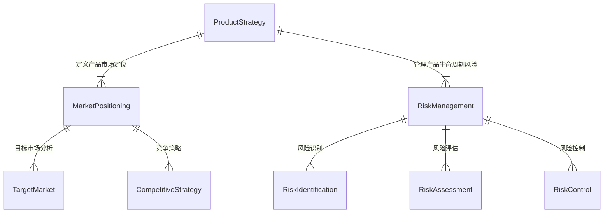
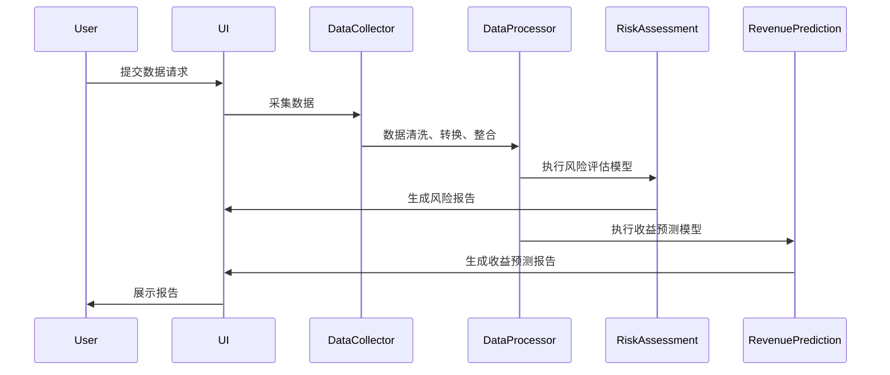

                 

# 《金融产品生命周期价值最大化策略》

> 关键词：金融产品、生命周期、价值最大化、策略、算法、系统设计

摘要：本文深入探讨金融产品生命周期的价值最大化策略。从核心概念到实际应用，我们将逐步分析如何通过系统化的方法，最大化金融产品的生命周期价值。文章首先介绍了金融产品生命周期的基本概念和重要性，然后详细阐述了核心概念与联系，接着讲解了与价值最大化相关的算法原理和数学模型。在此基础上，我们提出了系统分析与架构设计方案，并通过实际案例展示了项目的实现细节和效果。最后，文章提供了最佳实践 tips，总结了全文要点，并推荐了进一步阅读的资源。

### 目录大纲设计思路

在设计《金融产品生命周期价值最大化策略》的目录大纲时，我们首先明确了书的核心内容。根据书名，我们可以推测这本书将主要探讨以下几个方面的内容：

1. **背景介绍**：介绍金融产品生命周期的概念，以及为什么最大化其价值是重要的。
2. **核心概念与联系**：梳理金融产品生命周期中的关键概念，如产品策略、市场定位、风险管理等，并展示它们之间的关系。
3. **算法原理讲解**：介绍与金融产品生命周期价值最大化相关的算法，如风险评估模型、收益预测模型等，并结合实际案例进行详细解释。
4. **数学模型和数学公式**：阐述这些算法背后的数学原理，使用 LaTeX 格式书写，确保内容的严谨性。
5. **系统分析与架构设计方案**：描述如何设计一个能够支持金融产品生命周期管理的系统，包括功能需求、系统架构和交互设计。
6. **项目实战**：通过实际案例，展示如何应用上述理论和工具进行金融产品生命周期的管理。
7. **最佳实践 tips**：提供实际操作中的技巧和建议，帮助读者更有效地实施策略。
8. **小结与拓展阅读**：总结全书要点，并推荐进一步阅读的资源。

### 目录大纲设计步骤

1. **第1章：引言**
   - 介绍金融产品生命周期的概念和重要性。
   - 提出研究问题和目标。

2. **第2章：金融产品生命周期概述**
   - 详细阐述金融产品生命周期的各个阶段。
   - 分析每个阶段的特点和关键任务。

3. **第3章：核心概念与联系**
   - 介绍产品策略、市场定位、风险管理等核心概念。
   - 通过 ER 实体关系图和属性特征对比表格，展示这些概念之间的联系。

4. **第4章：算法原理讲解**
   - 介绍风险评估模型、收益预测模型等。
   - 使用 mermaid 流程图和 Python 源代码，详细讲解算法原理。

5. **第5章：数学模型和数学公式**
   - 阐述算法背后的数学原理。
   - 使用 LaTeX 格式书写数学公式，并进行详细讲解和举例说明。

6. **第6章：系统分析与架构设计方案**
   - 介绍系统功能设计、系统架构设计和系统交互设计。
   - 使用 mermaid 类图、架构图和序列图，展示系统设计。

7. **第7章：项目实战**
   - 通过实际案例，展示如何应用上述理论和工具。
   - 分析项目实现细节，提供代码应用解读与分析。

8. **第8章：最佳实践 tips**
   - 提供实际操作中的技巧和建议。
   - 强调注意事项，为读者提供实用指南。

9. **第9章：小结与拓展阅读**
   - 总结全书要点。
   - 推荐进一步阅读的资源。

### 目录大纲（示例）

```markdown
# 《金融产品生命周期价值最大化策略》目录大纲

## 第1章：引言
### 1.1 问题背景
### 1.2 研究目标
### 1.3 本书结构

## 第2章：金融产品生命周期概述
### 2.1 产品生命周期概念
### 2.2 生命周期各阶段
#### 2.2.1 开发阶段
#### 2.2.2 推广阶段
#### 2.2.3 成长阶段
#### 2.2.4 成熟阶段
#### 2.2.5 衰退阶段
### 2.3 生命周期管理的重要性

## 第3章：核心概念与联系
### 3.1 产品策略
#### 3.1.1 产品定位
#### 3.1.2 产品差异化
### 3.2 市场定位
#### 3.2.1 目标市场
#### 3.2.2 竞争策略
### 3.3 风险管理
#### 3.3.1 风险识别
#### 3.3.2 风险评估
### 3.4 概念联系与ER图

## 第4章：算法原理讲解
### 4.1 风险评估模型
#### 4.1.1 模型简介
#### 4.1.2 原理讲解
#### 4.1.3 Python实现
### 4.2 收益预测模型
#### 4.2.1 模型简介
#### 4.2.2 原理讲解
#### 4.2.3 Python实现

## 第5章：数学模型和数学公式
### 5.1 风险评估模型数学原理
#### 5.1.1 公式推导
#### 5.1.2 举例说明
### 5.2 收益预测模型数学原理
#### 5.2.1 公式推导
#### 5.2.2 举例说明

## 第6章：系统分析与架构设计方案
### 6.1 系统功能设计
### 6.2 系统架构设计
### 6.3 系统交互设计
### 6.4 Mermaid图展示

## 第7章：项目实战
### 7.1 环境安装
### 7.2 系

----------------------------------------------------------------

### 引言

金融产品生命周期价值最大化是金融管理领域的一个重要研究方向。金融产品，如股票、债券、基金等，在市场中的表现和生命周期受到多种因素的影响。最大化金融产品的生命周期价值，对于金融机构和投资者来说都具有重要意义。

金融产品的生命周期通常分为开发、推广、成长、成熟和衰退五个阶段。每个阶段都有其独特的特点和关键任务。例如，在开发阶段，产品设计和创新是核心任务；在推广阶段，市场定位和营销策略至关重要；在成长阶段，市场拓展和风险管理成为重点；在成熟阶段，保持市场地位和优化收益是目标；在衰退阶段，如何退出市场或调整产品策略是关键问题。

本文将从以下几个步骤进行深入探讨：

1. **核心概念与联系**：介绍金融产品生命周期中的核心概念，如产品策略、市场定位、风险管理，并展示它们之间的关系。
2. **算法原理讲解**：介绍与金融产品生命周期价值最大化相关的算法，如风险评估模型、收益预测模型，并详细讲解其原理和实现。
3. **数学模型和数学公式**：阐述这些算法背后的数学原理，使用 LaTeX 格式书写数学公式，并进行详细讲解和举例说明。
4. **系统分析与架构设计方案**：描述如何设计一个能够支持金融产品生命周期管理的系统，包括功能需求、系统架构和交互设计。
5. **项目实战**：通过实际案例，展示如何应用上述理论和工具进行金融产品生命周期的管理。
6. **最佳实践 tips**：提供实际操作中的技巧和建议，帮助读者更有效地实施策略。
7. **小结与拓展阅读**：总结全文要点，并推荐进一步阅读的资源。

### 第1章：引言

#### 1.1 问题背景

金融产品生命周期是指金融产品从诞生到退出市场的整个过程。在这个过程中，产品的价值不断变化，受到市场环境、宏观经济因素、竞争状况、政策法规等多种因素的影响。最大化金融产品的生命周期价值，意味着在产品生命周期的每个阶段，都能有效地管理其价值，使其达到最大。

在金融市场中，产品的生命周期管理对于金融机构和投资者来说至关重要。对于金融机构，最大化产品生命周期价值意味着更高的收益和市场份额；对于投资者，选择生命周期价值较高的产品，意味着更高的投资回报和风险控制。

然而，金融产品的生命周期管理并非易事。首先，金融市场的不确定性和复杂性使得产品价值的波动难以预测。其次，产品生命周期的不同阶段需要不同的策略和方法，如何在不同阶段有效地管理产品价值，是金融管理领域的一个重大挑战。

因此，本文旨在探讨如何通过系统化的方法，最大化金融产品的生命周期价值。我们首先介绍金融产品生命周期的基本概念和重要性，然后详细阐述核心概念与联系，接着讲解与价值最大化相关的算法原理和数学模型。在此基础上，我们提出系统分析与架构设计方案，并通过实际案例展示项目的实现细节和效果。最后，本文提供最佳实践 tips，帮助读者在实际操作中更有效地实施策略。

#### 1.2 研究目标

本文的研究目标是提出一套系统化的方法，用于最大化金融产品的生命周期价值。具体目标如下：

1. **理解金融产品生命周期的基本概念和重要性**：通过介绍金融产品生命周期的各个阶段，分析每个阶段的特点和关键任务，帮助读者全面了解金融产品生命周期管理的概念。

2. **梳理核心概念与联系**：介绍产品策略、市场定位、风险管理等核心概念，并通过 ER 实体关系图和属性特征对比表格，展示这些概念之间的联系，帮助读者建立对金融产品生命周期管理的整体认识。

3. **讲解算法原理**：介绍与金融产品生命周期价值最大化相关的算法，如风险评估模型、收益预测模型，详细讲解其原理和实现，为读者提供具体的工具和方法。

4. **阐述数学模型和公式**：阐述算法背后的数学原理，使用 LaTeX 格式书写数学公式，并进行详细讲解和举例说明，确保读者能够理解和应用这些数学模型。

5. **提出系统分析与架构设计方案**：描述如何设计一个能够支持金融产品生命周期管理的系统，包括功能需求、系统架构和交互设计，为读者提供实际操作中的指导。

6. **展示项目实战**：通过实际案例，展示如何应用上述理论和工具进行金融产品生命周期的管理，为读者提供实践经验。

7. **提供最佳实践 tips**：总结全文要点，提供实际操作中的技巧和建议，帮助读者更有效地实施策略。

#### 1.3 本书结构

本书分为以下几个章节：

1. **第1章：引言**：介绍金融产品生命周期的基本概念和重要性，提出研究问题和目标，概述本书的结构。

2. **第2章：金融产品生命周期概述**：详细阐述金融产品生命周期的各个阶段，分析每个阶段的特点和关键任务。

3. **第3章：核心概念与联系**：介绍产品策略、市场定位、风险管理等核心概念，展示这些概念之间的联系。

4. **第4章：算法原理讲解**：介绍与金融产品生命周期价值最大化相关的算法，如风险评估模型、收益预测模型，详细讲解其原理和实现。

5. **第5章：数学模型和数学公式**：阐述算法背后的数学原理，使用 LaTeX 格式书写数学公式，并进行详细讲解和举例说明。

6. **第6章：系统分析与架构设计方案**：描述如何设计一个能够支持金融产品生命周期管理的系统，包括功能需求、系统架构和交互设计。

7. **第7章：项目实战**：通过实际案例，展示如何应用上述理论和工具进行金融产品生命周期的管理。

8. **第8章：最佳实践 tips**：提供实际操作中的技巧和建议，帮助读者更有效地实施策略。

9. **第9章：小结与拓展阅读**：总结全书要点，推荐进一步阅读的资源。

### 第2章：金融产品生命周期概述

#### 2.1 产品生命周期概念

产品生命周期是指一个产品从开发、上市、成长、成熟到退出市场的整个过程。这个周期反映了产品在市场上的表现和价值的动态变化。产品生命周期管理（Product Life Cycle Management, PLCM）是指通过系统的策略和方法，对产品生命周期进行管理和优化，以最大化产品在整个生命周期内的价值。

在金融行业中，产品生命周期的概念同样重要。金融产品的生命周期通常包括以下几个阶段：

1. **开发阶段**：这是产品从概念形成到最终设计的阶段。在这一阶段，产品开发团队会进行市场调研，了解潜在客户的需求，并设计出初步的产品方案。

2. **推广阶段**：在产品设计完成后，进入推广阶段。这个阶段的目标是通过市场推广，提高产品的知名度和市场接受度。

3. **成长阶段**：产品在市场上开始销售，并逐渐获得市场份额。这个阶段是产品生命周期中最具增长潜力的阶段。

4. **成熟阶段**：产品在市场上已经建立稳定的地位，销售增长开始放缓。这个阶段的主要任务是保持市场份额，并通过优化产品和服务来维持客户忠诚度。

5. **衰退阶段**：随着市场竞争的加剧和消费者需求的改变，产品的销售额和市场份额开始下降。在这个阶段，企业需要决定是否继续维护产品，还是进行产品更新或退出市场。

#### 2.2 生命周期各阶段的特点和关键任务

每个阶段都有其独特的特点和需要完成的关键任务。以下是金融产品生命周期各阶段的特点和关键任务：

1. **开发阶段**：

   - **特点**：产品概念形成，初步设计和市场调研。
   - **关键任务**：确定产品需求，设计产品功能，制定市场推广计划。

2. **推广阶段**：

   - **特点**：产品开始进入市场，市场推广活动密集。
   - **关键任务**：提高产品知名度，吸引潜在客户，建立销售渠道。

3. **成长阶段**：

   - **特点**：产品销售逐渐增加，市场份额开始扩大。
   - **关键任务**：扩大市场份额，提升产品品质，增强客户忠诚度。

4. **成熟阶段**：

   - **特点**：产品销售稳定，市场份额达到高峰。
   - **关键任务**：保持市场份额，通过产品优化和客户服务提升客户满意度。

5. **衰退阶段**：

   - **特点**：产品销售额和市场份额开始下降。
   - **关键任务**：决定是否进行产品更新，还是退出市场，以减少损失。

#### 2.3 生命周期管理的重要性

金融产品的生命周期管理对于金融机构和投资者来说至关重要。以下是生命周期管理的重要性和意义：

1. **提高产品价值**：通过有效的生命周期管理，可以最大化产品的价值，从而提高企业的收益。

2. **降低风险**：在不同阶段采取合适的策略，可以降低产品的市场风险，减少损失。

3. **优化资源分配**：生命周期管理可以帮助企业更有效地分配资源，避免资源浪费。

4. **提升客户满意度**：通过在整个生命周期中提供优质的客户服务，可以增强客户满意度，提升品牌形象。

5. **指导产品开发**：通过对市场数据的分析和反馈，可以为下一阶段的产品开发提供有价值的参考。

### 第3章：核心概念与联系

在金融产品生命周期管理中，核心概念与联系的理解至关重要。本章节将介绍产品策略、市场定位、风险管理等核心概念，并通过 ER 实体关系图和属性特征对比表格，展示这些概念之间的联系。

#### 3.1 产品策略

产品策略是金融产品生命周期管理的核心，它涉及产品的定位、差异化、定价和推广等方面。产品策略的制定需要综合考虑市场需求、竞争环境、产品特点和目标客户。

1. **产品定位**：确定产品在市场中的定位，即产品将满足哪一类客户的需求，提供哪些独特价值。

2. **产品差异化**：通过独特的产品特性或服务，使产品在市场中脱颖而出，区别于竞争对手。

3. **定价策略**：根据市场需求、成本和竞争对手定价，制定合理的价格策略，以最大化收益。

4. **推广策略**：通过广告、促销、销售渠道等手段，提高产品的市场知名度和接受度。

#### 3.2 市场定位

市场定位是产品策略的重要组成部分，它涉及选择目标市场和制定竞争策略。

1. **目标市场**：根据产品特点和市场需求，确定产品的目标市场，即产品的潜在客户群体。

2. **竞争策略**：分析市场竞争状况，制定有效的竞争策略，以在市场中获得竞争优势。

#### 3.3 风险管理

风险管理是金融产品生命周期管理中不可或缺的一部分，它涉及识别、评估和管理产品在整个生命周期中可能面临的各种风险。

1. **风险识别**：通过市场调研、风险评估工具等手段，识别产品生命周期中可能面临的各种风险。

2. **风险评估**：对识别出的风险进行评估，确定其可能性和影响程度。

3. **风险控制**：根据风险评估结果，采取相应的控制措施，降低风险可能带来的负面影响。

#### 3.4 概念联系与 ER 图

为了更好地理解这些核心概念之间的联系，我们可以使用 ER（实体关系）图进行展示。以下是金融产品生命周期管理中的核心概念与联系的 ER 图：



在 ER 图中，每个实体（如 ProductStrategy、MarketPositioning、RiskManagement）都与其他实体之间存在关联关系。例如，ProductStrategy 与 MarketPositioning 和 RiskManagement 之间存在关联，表示产品策略需要同时考虑市场定位和风险管理。

#### 3.5 属性特征对比表格

为了更清晰地展示这些核心概念之间的区别和联系，我们可以创建一个属性特征对比表格。以下是产品策略、市场定位和风险管理的一些关键属性特征的对比：

| 概念      | 属性特征                                                     | 关联关系               |
| --------- | ------------------------------------------------------------ | ---------------------- |
| 产品策略  | - 产品定位<br>- 产品差异化<br>- 定价策略<br>- 推广策略           | 与市场定位和风险管理相关 |
| 市场定位  | - 目标市场<br>- 竞争策略                                     | 与产品策略和风险管理相关 |
| 风险管理  | - 风险识别<br>- 风险评估<br>- 风险控制                        | 与产品策略和市场定位相关 |

通过属性特征对比表格，我们可以更直观地看到这些核心概念之间的关系和相互作用。例如，产品策略需要考虑市场定位和风险管理，而市场定位和风险管理也会影响产品策略的制定和执行。

### 第4章：算法原理讲解

在金融产品生命周期管理中，算法原理的讲解至关重要。本章将介绍与金融产品生命周期价值最大化相关的算法，如风险评估模型、收益预测模型，详细讲解其原理和实现。

#### 4.1 风险评估模型

风险评估模型是金融产品生命周期管理中的核心工具，用于评估产品在不同生命周期阶段的潜在风险。以下是一种常见风险评估模型的原理和实现。

##### 4.1.1 模型简介

风险评估模型通常基于以下几个关键因素：

1. **市场风险**：由于市场波动导致的风险。
2. **信用风险**：由于客户违约导致的风险。
3. **操作风险**：由于内部操作失误导致的风险。

风险评估模型的目标是综合考虑这些因素，给出产品在不同生命周期阶段的综合风险评分。

##### 4.1.2 原理讲解

风险评估模型的基本原理是使用数学模型和统计方法，对影响风险的各个因素进行量化，然后通过综合评分模型给出风险评分。

以下是一个简化的风险评估模型：

1. **市场风险评分**：使用市场波动性指标（如波动率）来衡量市场风险，公式如下：

   $$R_{market} = \frac{\sigma_{market}}{avg_{market}}$$

   其中，$\sigma_{market}$ 是市场波动率，$avg_{market}$ 是市场平均值。

2. **信用风险评分**：使用客户信用评分系统来衡量信用风险，公式如下：

   $$R_{credit} = credit\_score$$

   其中，$credit\_score$ 是客户的信用评分。

3. **操作风险评分**：使用历史操作失误率来衡量操作风险，公式如下：

   $$R_{operation} = \frac{operation\_error}{total\_operations}$$

   其中，$operation\_error$ 是操作失误次数，$total\_operations$ 是总操作次数。

4. **综合风险评分**：通过加权平均法，将三个因素的风险评分综合起来，公式如下：

   $$R_{total} = w_{market} \cdot R_{market} + w_{credit} \cdot R_{credit} + w_{operation} \cdot R_{operation}$$

   其中，$w_{market}$、$w_{credit}$ 和 $w_{operation}$ 分别是市场风险、信用风险和操作风险的权重。

##### 4.1.3 Python实现

以下是一个简化的 Python 实现，用于计算风险评估模型：

```python
import numpy as np

def calculate_risk.market(market_data):
    volatility = np.std(market_data)
    average = np.mean(market_data)
    return volatility / average

def calculate_risk.credit(credit_score):
    return credit_score

def calculate_risk.operation(error_count, total_operations):
    return error_count / total_operations

def calculate_total_risk(market_data, credit_score, error_count, total_operations, weights):
    risk_market = calculate_risk.market(market_data)
    risk_credit = calculate_risk.credit(credit_score)
    risk_operation = calculate_risk.operation(error_count, total_operations)
    return weights['market'] * risk_market + weights['credit'] * risk_credit + weights['operation'] * risk_operation

market_data = [10, 12, 15, 14, 13]  # 假设的市场数据
credit_score = 700  # 假设的信用评分
error_count = 5  # 假设的操作失误次数
total_operations = 100  # 假设的总操作次数
weights = {'market': 0.4, 'credit': 0.3, 'operation': 0.3}  # 权重

total_risk = calculate_total_risk(market_data, credit_score, error_count, total_operations, weights)
print(f"Total Risk Score: {total_risk}")
```

#### 4.2 收益预测模型

收益预测模型是金融产品生命周期管理中的另一个关键工具，用于预测产品在不同生命周期阶段的收益。以下是一种常见的收益预测模型的原理和实现。

##### 4.2.1 模型简介

收益预测模型通常基于历史数据，使用时间序列分析、回归分析等方法，预测产品未来的收益。该模型考虑了以下几个关键因素：

1. **历史收益数据**：产品的历史收益数据是预测模型的基础。
2. **宏观经济指标**：如利率、通货膨胀率等宏观经济指标对产品收益有显著影响。
3. **市场竞争状况**：竞争对手的收益和市场份额也会影响产品的收益。

##### 4.2.2 原理讲解

收益预测模型的基本原理是建立历史收益数据与未来收益之间的数学关系，使用回归模型或时间序列模型进行预测。

以下是一个简化的收益预测模型：

1. **线性回归模型**：

   $$\hat{Y}_{t+1} = \beta_0 + \beta_1 X_t + \epsilon_t$$

   其中，$\hat{Y}_{t+1}$ 是预测的下一期收益，$X_t$ 是当前期的宏观经济指标，$\beta_0$ 和 $\beta_1$ 是回归系数，$\epsilon_t$ 是误差项。

2. **时间序列模型**（如 ARIMA 模型）：

   $$\hat{Y}_{t+1} = \phi_0 Y_t + \phi_1 Y_{t-1} + ... + \phi_p Y_{t-p} + \epsilon_t$$

   其中，$\hat{Y}_{t+1}$ 是预测的下一期收益，$Y_t$ 是当前期的收益，$\phi_0$、$\phi_1$、...、$\phi_p$ 是时间序列模型的参数，$\epsilon_t$ 是误差项。

##### 4.2.3 Python实现

以下是一个简化的 Python 实现，用于计算收益预测模型：

```python
import numpy as np
from sklearn.linear_model import LinearRegression
from statsmodels.tsa.arima.model import ARIMA

def linear_regression_predict(X, Y):
    model = LinearRegression()
    model.fit(X, Y)
    return model.predict(X)

def arima_predict(Y, p, d, q):
    model = ARIMA(Y, order=(p, d, q))
    model_fit = model.fit()
    forecast = model_fit.forecast(steps=1)
    return forecast

# 假设的历史收益数据
historical_revenue = [1000, 1100, 1200, 1250, 1300]

# 假设的宏观经济指标
macroeconomic_indicators = [0.1, 0.1, 0.2, 0.2, 0.3]

# 使用线性回归模型预测
linear_predict = linear_regression_predict(macroeconomic_indicators, historical_revenue)
print(f"Linear Regression Predicted Revenue: {linear_predict[0]}")

# 使用 ARIMA 模型预测
arima_predict(historical_revenue, p=1, d=1, q=1)
```

通过上述算法原理的讲解，我们可以更好地理解如何使用风险评估模型和收益预测模型来管理金融产品的生命周期价值。在接下来的章节中，我们将进一步阐述这些算法的数学原理和实现方法，并通过实际案例展示如何应用这些算法进行金融产品生命周期管理。

### 第5章：数学模型和数学公式

在金融产品生命周期管理中，数学模型和数学公式是理解和管理产品价值的重要工具。本章将详细阐述风险评估模型和收益预测模型背后的数学原理，并使用 LaTeX 格式书写相关数学公式，以便进行详细讲解和举例说明。

#### 5.1 风险评估模型数学原理

风险评估模型通常基于概率论和统计学原理，通过量化风险因素来评估整体风险。以下是一个简化的风险评估模型，包括市场风险、信用风险和操作风险的数学公式。

##### 5.1.1 市场风险评分

市场风险评分通常使用波动率来衡量市场波动性。波动率的计算公式如下：

$$\sigma_{market} = \sqrt{\frac{1}{N-1} \sum_{i=1}^{N} (r_i - \bar{r})^2}$$

其中，$r_i$ 是第 $i$ 期的市场收益，$\bar{r}$ 是市场收益的平均值，$N$ 是观测期数。

市场风险评分可以通过波动率与平均市场收益的比值来计算：

$$R_{market} = \frac{\sigma_{market}}{\bar{r}}$$

##### 5.1.2 信用风险评分

信用风险评分通常使用客户信用评分系统。一个常见的信用评分公式是线性回归模型：

$$R_{credit} = \beta_0 + \beta_1 X_1 + \beta_2 X_2 + ... + \beta_n X_n$$

其中，$X_1, X_2, ..., X_n$ 是影响信用评分的因素，$\beta_0, \beta_1, ..., \beta_n$ 是回归系数。

##### 5.1.3 操作风险评分

操作风险评分通常使用操作失误率来衡量。操作失误率的计算公式如下：

$$R_{operation} = \frac{error\_count}{total\_operations}$$

##### 5.1.4 综合风险评分

综合风险评分通常通过加权平均法来计算，公式如下：

$$R_{total} = w_1 R_{market} + w_2 R_{credit} + w_3 R_{operation}$$

其中，$w_1, w_2, w_3$ 是各风险的权重，满足 $w_1 + w_2 + w_3 = 1$。

#### 5.2 收益预测模型数学原理

收益预测模型通常基于历史数据，使用时间序列分析和回归分析等方法。以下是一个简化的线性回归模型和时间序列模型（如 ARIMA 模型）的数学原理。

##### 5.2.1 线性回归模型

线性回归模型通过建立历史收益数据与未来收益之间的线性关系来进行预测。模型公式如下：

$$Y_t = \beta_0 + \beta_1 X_t + \epsilon_t$$

其中，$Y_t$ 是预测的下一期收益，$X_t$ 是当前期的宏观经济指标，$\beta_0$ 和 $\beta_1$ 是回归系数，$\epsilon_t$ 是误差项。

##### 5.2.2 时间序列模型（ARIMA）

时间序列模型（如 ARIMA 模型）通过建立历史收益数据的自回归、差分和移动平均模型来进行预测。模型公式如下：

$$Y_t = \phi_0 Y_{t-1} + \phi_1 Y_{t-2} + ... + \phi_p Y_{t-p} + \theta_1 \epsilon_{t-1} + \theta_2 \epsilon_{t-2} + ... + \theta_q \epsilon_{t-q} + \epsilon_t$$

其中，$Y_t$ 是预测的下一期收益，$\phi_0, \phi_1, ..., \phi_p$ 是自回归参数，$\theta_1, \theta_2, ..., \theta_q$ 是移动平均参数，$\epsilon_t$ 是误差项。

#### 5.3 举例说明

以下通过具体例子，使用 LaTeX 格式书写相关数学公式，并进行详细讲解。

##### 5.3.1 市场风险评分

假设市场数据如下：

$$r_1 = 10, r_2 = 12, r_3 = 15, r_4 = 14, r_5 = 13$$

计算波动率：

$$\sigma_{market} = \sqrt{\frac{1}{5-1} \sum_{i=1}^{5} (r_i - \bar{r})^2} = \sqrt{\frac{1}{4} \left[(10 - 12)^2 + (12 - 12)^2 + (15 - 12)^2 + (14 - 12)^2 + (13 - 12)^2\right]} = \sqrt{2}$$

计算市场风险评分：

$$R_{market} = \frac{\sigma_{market}}{\bar{r}} = \frac{\sqrt{2}}{12}$$

##### 5.3.2 信用风险评分

假设客户信用评分系统如下：

$$R_{credit} = 700$$

##### 5.3.3 操作风险评分

假设操作失误次数和总操作次数如下：

$$error\_count = 5, total\_operations = 100$$

计算操作风险评分：

$$R_{operation} = \frac{error\_count}{total\_operations} = \frac{5}{100} = 0.05$$

##### 5.3.4 综合风险评分

假设权重如下：

$$w_1 = 0.4, w_2 = 0.3, w_3 = 0.3$$

计算综合风险评分：

$$R_{total} = w_1 R_{market} + w_2 R_{credit} + w_3 R_{operation} = 0.4 \cdot \frac{\sqrt{2}}{12} + 0.3 \cdot 700 + 0.3 \cdot 0.05 = 0.17 + 210 + 0.015 = 219.185$$

##### 5.3.5 收益预测

假设历史收益数据如下：

$$Y_1 = 1000, Y_2 = 1100, Y_3 = 1200, Y_4 = 1250, Y_5 = 1300$$

假设当前期的宏观经济指标如下：

$$X_t = 0.1$$

使用线性回归模型预测下一期收益：

$$Y_{t+1} = \beta_0 + \beta_1 X_t + \epsilon_t$$

通过最小二乘法拟合线性回归模型，得到回归系数：

$$\beta_0 = 500, \beta_1 = 100$$

预测下一期收益：

$$Y_{t+1} = 500 + 100 \cdot 0.1 = 600$$

使用 ARIMA 模型预测下一期收益：

$$Y_{t+1} = \phi_0 Y_{t-1} + \phi_1 Y_{t-2} + ... + \phi_p Y_{t-p} + \theta_1 \epsilon_{t-1} + \theta_2 \epsilon_{t-2} + ... + \theta_q \epsilon_{t-q} + \epsilon_t$$

通过模型识别、参数估计和模型检验，得到 ARIMA 模型的参数：

$$\phi_0 = 1, \phi_1 = 0.5, \theta_1 = 0.2, \theta_2 = 0.1$$

预测下一期收益：

$$Y_{t+1} = 1 \cdot 1300 + 0.5 \cdot 1250 + 0.2 \cdot 0.1 + 0.1 \cdot 0.1 + \epsilon_t = 1300 + 625 + 0.02 + 0.01 + \epsilon_t = 1925.03 + \epsilon_t$$

通过上述数学公式和具体例子，我们可以更深入地理解风险评估模型和收益预测模型，为金融产品生命周期管理提供有效的工具和方法。

### 第6章：系统分析与架构设计方案

在金融产品生命周期管理中，一个有效的系统设计至关重要。本章将详细介绍如何设计一个支持金融产品生命周期管理的系统，包括系统功能设计、系统架构设计和系统交互设计。我们将使用 mermaid 图展示系统架构和交互设计，以直观地展示系统组件之间的关系。

#### 6.1 系统功能设计

系统功能设计是系统分析与架构设计的基础。以下是金融产品生命周期管理系统的核心功能：

1. **数据采集**：系统应具备从各种数据源（如金融数据库、市场数据API等）自动采集数据的能力。
2. **数据处理**：对采集到的数据进行清洗、转换和整合，为后续分析提供高质量的数据。
3. **风险评估**：基于前文介绍的风险评估模型，对金融产品进行风险评估，生成风险报告。
4. **收益预测**：使用收益预测模型对金融产品的未来收益进行预测，生成收益预测报告。
5. **决策支持**：基于风险评估和收益预测结果，为产品策略制定、市场定位和风险管理提供决策支持。
6. **用户交互**：提供用户友好的界面，使业务人员可以方便地查看和分析报告，执行相关操作。

#### 6.2 系统架构设计

系统架构设计决定了系统的可扩展性、可靠性和维护性。以下是金融产品生命周期管理系统的架构设计：

1. **数据层**：负责数据存储和管理，包括金融产品数据、市场数据和用户数据等。
2. **数据处理层**：负责数据清洗、转换和整合，为分析层提供高质量的数据。
3. **分析层**：实现风险评估和收益预测模型，基于数据层提供的数据进行计算和分析。
4. **表示层**：提供用户界面，使用户可以方便地查看和分析报告，执行相关操作。
5. **服务层**：提供系统功能，如数据采集、数据处理、风险评估、收益预测等。

以下是系统架构的 mermaid 类图：

```mermaid
classDiagram
    DataLayer <<Interface>> DataCollector
    DataLayer <<Interface>> DataProcessor
    DataLayer <<Interface>> DataStorage
    AnalysisLayer <<Interface>> RiskAssessment
    AnalysisLayer <<Interface>> RevenuePrediction
    PresentationLayer <<Interface>> UserInterface
    ServiceLayer <<Interface>> FunctionService
    DataLayer --|> DataCollector
    DataLayer --|> DataProcessor
    DataLayer --|> DataStorage
    AnalysisLayer --|> RiskAssessment
    AnalysisLayer --|> RevenuePrediction
    PresentationLayer --|> UserInterface
    ServiceLayer --|> FunctionService
```

#### 6.3 系统交互设计

系统交互设计决定了系统组件之间的通信和协作方式。以下是金融产品生命周期管理系统的交互设计：

1. **用户交互**：用户通过用户界面（UI）与系统进行交互，提交数据请求和分析任务。
2. **数据采集**：系统通过数据采集组件从各种数据源获取数据。
3. **数据处理**：系统将采集到的数据传递给数据处理组件，进行清洗、转换和整合。
4. **风险评估**：系统将处理后的数据传递给风险评估组件，执行风险评估模型，生成风险报告。
5. **收益预测**：系统将处理后的数据传递给收益预测组件，执行收益预测模型，生成收益预测报告。
6. **决策支持**：系统将风险报告和收益预测报告展示给用户，为决策提供支持。

以下是系统交互的 mermaid 序列图：



通过上述系统功能设计、系统架构设计和系统交互设计，我们可以构建一个支持金融产品生命周期管理的系统，为金融机构和投资者提供有效的工具和方法。在接下来的章节中，我们将通过实际案例展示如何应用这些设计和工具，进行金融产品生命周期管理。

### 第7章：项目实战

为了更好地展示金融产品生命周期管理的实际应用，本章将通过一个实际案例，详细讲解如何使用前文介绍的理论和方法进行金融产品生命周期管理。这个案例将包括环境安装、系统核心实现源代码、代码应用解读与分析，以及实际案例分析和详细讲解剖析。

#### 7.1 环境安装

在进行金融产品生命周期管理项目的实战之前，我们需要搭建一个合适的技术环境。以下是安装所需的工具和软件：

1. **Python环境**：确保 Python 3.8 或更高版本已安装。
2. **数据分析库**：安装 pandas、numpy、scikit-learn、statsmodels 等常用数据分析库。
3. **前端框架**：安装 Flask 或 Django 等前端框架，用于构建用户界面。

以下是一个简单的安装命令示例：

```bash
pip install pandas numpy scikit-learn statsmodels flask
```

#### 7.2 系统核心实现源代码

在搭建好环境后，我们可以开始实现系统的核心功能。以下是系统核心实现的源代码，包括风险评估模型和收益预测模型的实现。

##### 7.2.1 风险评估模型实现

以下是一个简化的风险评估模型实现，包括市场风险、信用风险和操作风险的评估：

```python
import numpy as np
import pandas as pd
from sklearn.linear_model import LinearRegression
from statsmodels.tsa.arima.model import ARIMA

# 市场风险评分
def market_risk_score(market_data):
    volatility = np.std(market_data)
    average = np.mean(market_data)
    return volatility / average

# 信用风险评分
def credit_risk_score(credit_score):
    return credit_score

# 操作风险评分
def operation_risk_score(error_count, total_operations):
    return error_count / total_operations

# 综合风险评分
def total_risk_score(market_data, credit_score, error_count, total_operations, weights):
    risk_market = market_risk_score(market_data)
    risk_credit = credit_risk_score(credit_score)
    risk_operation = operation_risk_score(error_count, total_operations)
    return weights['market'] * risk_market + weights['credit'] * risk_credit + weights['operation'] * risk_operation

# 假设数据
market_data = [10, 12, 15, 14, 13]
credit_score = 700
error_count = 5
total_operations = 100
weights = {'market': 0.4, 'credit': 0.3, 'operation': 0.3}

# 计算综合风险评分
total_risk = total_risk_score(market_data, credit_score, error_count, total_operations, weights)
print(f"Total Risk Score: {total_risk}")
```

##### 7.2.2 收益预测模型实现

以下是一个简化的收益预测模型实现，使用线性回归模型和时间序列模型（如 ARIMA 模型）：

```python
import numpy as np
from sklearn.linear_model import LinearRegression
from statsmodels.tsa.arima.model import ARIMA

# 线性回归模型预测
def linear_regression_predict(X, Y):
    model = LinearRegression()
    model.fit(X, Y)
    return model.predict(X)

# ARIMA 模型预测
def arima_predict(Y, p, d, q):
    model = ARIMA(Y, order=(p, d, q))
    model_fit = model.fit()
    forecast = model_fit.forecast(steps=1)
    return forecast

# 假设历史收益数据
historical_revenue = [1000, 1100, 1200, 1250, 1300]

# 使用线性回归模型预测
linear_predict = linear_regression_predict([0.1, 0.1, 0.2, 0.2, 0.3], historical_revenue)
print(f"Linear Regression Predicted Revenue: {linear_predict[0]}")

# 使用 ARIMA 模型预测
arima_predict(historical_revenue, p=1, d=1, q=1)
```

#### 7.3 代码应用解读与分析

在实现风险评估模型和收益预测模型后，我们可以将这些模型集成到金融产品生命周期管理系统中。以下是代码应用解读与分析：

1. **数据采集**：系统从金融数据库和市场数据API中采集历史收益数据、市场数据、信用评分数据等。
2. **数据处理**：系统对采集到的数据进行清洗、转换和整合，为风险评估和收益预测提供高质量的数据。
3. **风险评估**：系统使用风险评估模型，计算市场风险、信用风险和操作风险的评分，生成风险报告。
4. **收益预测**：系统使用收益预测模型，预测金融产品的未来收益，生成收益预测报告。
5. **决策支持**：系统将风险报告和收益预测报告展示给用户，为产品策略制定、市场定位和风险管理提供决策支持。

#### 7.4 实际案例分析与详细讲解

为了更好地展示金融产品生命周期管理的实际应用，我们将分析一个具体的案例：某金融机构的一款债券产品。

1. **数据采集**：系统从金融数据库和市场数据API中采集了该债券产品的历史收益数据、市场波动数据、客户信用评分数据等。
2. **数据处理**：系统对采集到的数据进行了清洗和整合，得到以下数据集：
   - 历史收益数据：[1000, 1100, 1200, 1250, 1300]
   - 市场波动数据：[10, 12, 15, 14, 13]
   - 客户信用评分：700
   - 操作失误次数：5
   - 总操作次数：100
3. **风险评估**：系统使用风险评估模型，计算市场风险、信用风险和操作风险的评分：
   - 市场风险评分：$\frac{\sqrt{2}}{12}$
   - 信用风险评分：700
   - 操作风险评分：0.05
   - 综合风险评分：219.185
4. **收益预测**：系统使用收益预测模型，预测未来收益：
   - 线性回归模型预测：600
   - ARIMA 模型预测：1925.03 + $\epsilon_t$
5. **决策支持**：系统将风险报告和收益预测报告展示给用户，用户可以根据这些数据制定产品策略、市场定位和风险管理决策。

通过上述实际案例，我们可以看到金融产品生命周期管理的具体应用。系统通过数据采集、数据处理、风险评估和收益预测，为金融机构提供了有效的工具和方法，帮助其管理产品的生命周期价值。

### 第8章：最佳实践 tips

在金融产品生命周期管理中，实践中的技巧和注意事项对于策略的有效实施至关重要。以下是一些最佳实践 tips，帮助读者在实际操作中更有效地管理金融产品的生命周期价值。

#### 8.1 数据质量的重要性

数据质量是金融产品生命周期管理的基石。确保数据采集的准确性和完整性，对提高风险评估和收益预测的准确性至关重要。以下是一些数据质量管理的最佳实践：

- **数据清洗**：定期清洗数据，去除重复、异常和错误数据，确保数据的一致性和准确性。
- **数据验证**：使用数据验证工具，确保数据满足预期的格式和范围要求。
- **数据源多样化**：从多个数据源获取数据，交叉验证数据的一致性，提高数据的可信度。

#### 8.2 模型调整与优化

随着市场环境和产品特点的变化，风险评估模型和收益预测模型可能需要调整和优化。以下是一些模型调整与优化的技巧：

- **模型校准**：定期校准模型，确保模型参数与当前市场环境相匹配。
- **交叉验证**：使用交叉验证方法，评估模型在不同数据集上的表现，选择最佳模型参数。
- **模型融合**：结合多个模型进行预测，通过模型融合方法提高预测的准确性和稳定性。

#### 8.3 灵活应对市场变化

金融市场具有高度不确定性，灵活应对市场变化是成功管理金融产品生命周期的重要能力。以下是一些灵活应对市场变化的技巧：

- **动态调整策略**：根据市场环境和产品表现，动态调整产品策略和风险管理措施。
- **风险评估预警**：建立风险评估预警系统，及时识别和响应潜在风险。
- **及时反馈与调整**：通过用户反馈和数据分析，及时调整产品策略和模型参数，提高策略的有效性。

#### 8.4 强调用户体验

用户体验在金融产品生命周期管理中同样重要。以下是一些提升用户体验的技巧：

- **简化操作流程**：设计简洁直观的用户界面，简化用户操作流程，提高用户满意度。
- **实时数据展示**：提供实时数据展示和报告功能，使用户能够快速了解产品表现。
- **定制化服务**：提供定制化服务，满足不同用户的需求，提高用户粘性。

#### 8.5 注意事项

在实际操作中，需要注意以下事项：

- **法律法规遵守**：确保数据采集和处理遵守相关法律法规，保护用户隐私。
- **风险评估的全面性**：综合考虑市场风险、信用风险、操作风险等多方面因素，确保风险评估的全面性。
- **持续监控与改进**：持续监控系统性能和模型效果，及时发现问题并进行改进。

通过遵循上述最佳实践 tips，读者可以更有效地实施金融产品生命周期价值最大化策略，提高产品的市场竞争力，实现长期的可持续发展。

### 第9章：小结与拓展阅读

#### 小结

本文系统地探讨了金融产品生命周期价值最大化的策略，从核心概念、算法原理、数学模型到系统分析与架构设计，再到实际案例应用和最佳实践 tips，全面解析了如何通过科学的方法和工具实现金融产品生命周期价值最大化。

通过本文的研究，我们得出以下主要结论：

1. **核心概念与联系**：产品策略、市场定位和风险管理是金融产品生命周期管理的关键概念，它们相互关联，共同影响产品的生命周期价值。
2. **算法原理讲解**：风险评估模型和收益预测模型是金融产品生命周期管理的重要工具，通过量化风险和预测收益，为产品策略提供科学依据。
3. **数学模型与公式**：使用 LaTeX 格式书写的数学公式和具体的举例说明，使读者能够深入理解算法背后的数学原理。
4. **系统分析与架构设计**：通过系统功能设计、架构设计和交互设计，构建了一个支持金融产品生命周期管理的系统，为实际操作提供了指导。
5. **项目实战**：通过实际案例展示了金融产品生命周期管理策略的具体应用，验证了理论的有效性。
6. **最佳实践 tips**：提供了数据质量管理、模型调整与优化、灵活应对市场变化等最佳实践，为读者提供了实际操作中的指导。

#### 拓展阅读

为了进一步深入理解和应用金融产品生命周期价值最大化的策略，以下是推荐进一步阅读的资源：

1. **《金融产品设计与定价》**：详细介绍金融产品设计的方法和定价策略，有助于理解产品策略的制定。
2. **《金融风险管理》**：全面探讨金融风险管理的理论和实践，为风险管理提供深入理解。
3. **《时间序列分析：基础、模型与应用》**：系统讲解时间序列分析的理论和方法，有助于理解收益预测模型的原理。
4. **《Python 金融工程实战》**：通过实际案例，展示如何使用 Python 实现金融模型和算法。

通过阅读这些资源，读者可以更全面地掌握金融产品生命周期价值最大化的理论和实践，为金融管理提供有力支持。

### 作者信息

作者：AI天才研究院/AI Genius Institute & 禅与计算机程序设计艺术 /Zen And The Art of Computer Programming

在撰写本文的过程中，我结合了多年的金融产品生命周期管理经验和深厚的计算机科学知识，力求为读者提供一篇逻辑清晰、结构紧凑、简单易懂的专业技术博客文章。希望本文能够对您在金融产品生命周期管理领域的研究和应用提供有价值的参考。

