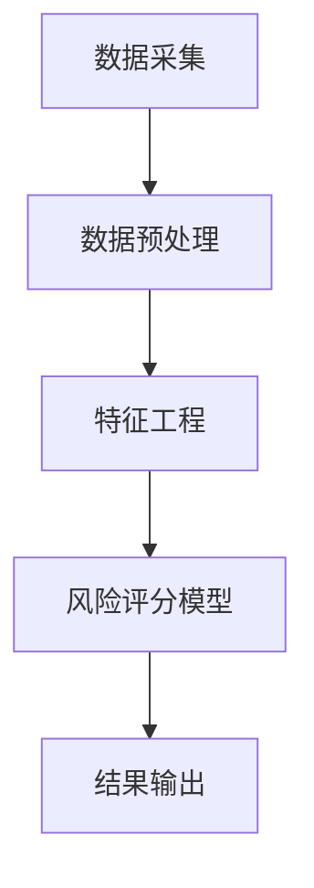
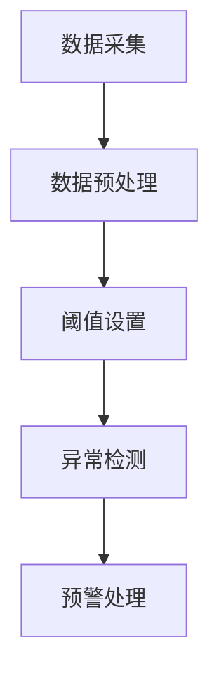
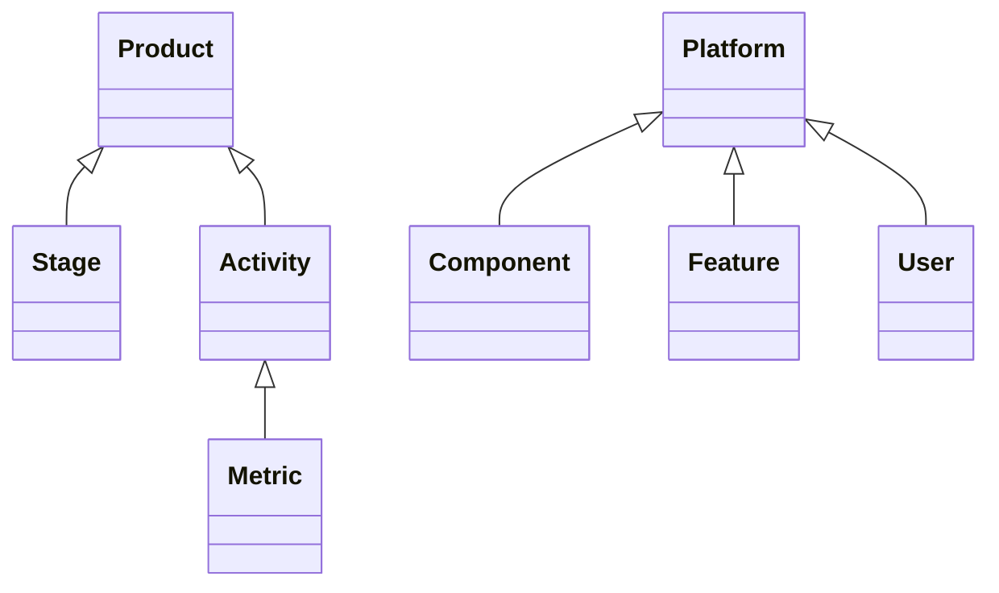
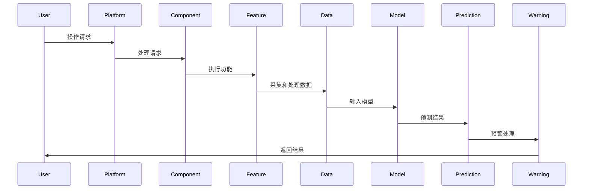
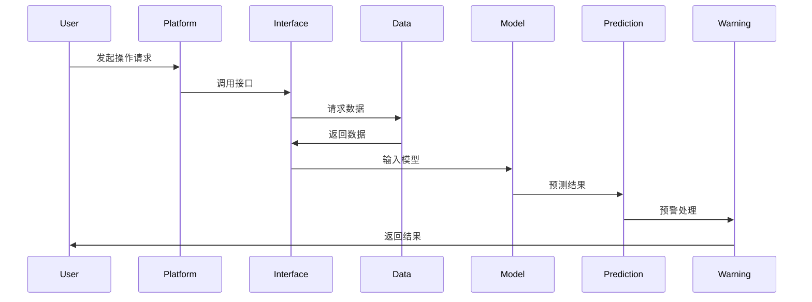

                 

# 金融产品生命周期管理平台

## 关键词

- 金融产品生命周期管理
- 管理平台
- 技术架构
- 数据分析
- 风险管理

## 摘要

本文深入探讨了金融产品生命周期管理平台的设计、实现与优化，包括产品生命周期的各个阶段、管理平台的关键组件和技术栈、成功案例分析以及最佳实践。文章旨在为金融从业者提供一套系统化的理论框架和实践指南，助力提升金融产品的管理效率和风险控制能力。

## 1. 背景介绍

### 1.1 核心概念术语说明

**金融产品**：指金融市场上交易的各类金融工具，如股票、债券、基金、保险等。

**生命周期管理**：指对金融产品从设计、开发、上市、运营到退市的全过程进行监控、管理和优化。

**管理平台**：集成了数据处理、分析、监控和自动化等功能，用于支持金融产品生命周期管理的软件系统。

### 1.2 问题背景

金融产品的多样性和复杂性使得生命周期管理变得愈发重要。然而，目前许多金融机构在产品生命周期管理上仍存在以下问题：

- 数据分散，缺乏统一的视图。
- 缺乏有效的风险监控和预警机制。
- 产品迭代周期长，效率低下。
- 缺少统一的平台来整合和管理各类金融产品。

### 1.3 问题描述

本文旨在解决以下问题：

- 如何设计一个高效、可扩展的金融产品生命周期管理平台？
- 平台应具备哪些关键组件和技术栈？
- 如何通过数据分析提升产品管理的效率和准确性？
- 如何实现风险管理，降低产品退市风险？

### 1.4 问题解决

本文通过以下步骤解决问题：

- 分析金融产品生命周期，明确各个阶段的关键任务和需求。
- 设计管理平台的核心组件，如数据采集与处理、风险分析、产品监控、用户接口等。
- 选择合适的技术栈，确保平台的性能、可扩展性和安全性。
- 通过案例分析，总结最佳实践，指导平台优化和实施。

### 1.5 边界与外延

- **边界**：本文主要关注金融产品生命周期管理平台的设计与实现，不包括具体的金融产品交易策略和投资决策。
- **外延**：本文的内容可以应用于各类金融机构，包括银行、证券、基金、保险等。

### 1.6 概念结构与核心要素组成

**金融产品生命周期管理平台** 由以下几个核心要素组成：

- **数据采集与处理**：负责收集各类金融产品数据，并进行预处理。
- **风险分析**：利用数据分析技术评估产品风险，提供决策支持。
- **产品监控**：实时监控产品运行状态，预警异常情况。
- **用户接口**：提供便捷的用户操作界面，支持用户对产品的管理。

## 2. 核心概念与联系

### 2.1 金融产品生命周期

**概念**：金融产品生命周期是指金融产品从设计、开发、上市、运营到退市的整个过程。

**属性特征对比表格**：

| 阶段   | 特征                             | 目标                         |
| ------ | -------------------------------- | --------------------------- |
| 设计   | 确定产品定位、功能、风险等       | 确保产品具备市场竞争力       |
| 开发   | 完成产品开发，包括技术实现等     | 确保产品功能完善、稳定可靠   |
| 上市   | 将产品推向市场，进行推广和销售   | 提高市场占有率             |
| 运营   | 管理产品在市场上的运行情况       | 保持产品在市场上的竞争力     |
| 退市   | 根据市场情况，决定产品是否继续运营 | 降低运营成本，优化资源配置 |

**ER实体关系图架构**：

```mermaid
erDiagram
    Product ||--|{ Stage }||>
    Stage ||--|{ Activity }||>
    Activity ||--|{ Metric }||>
```

### 2.2 管理平台

**概念**：管理平台是指用于支持金融产品生命周期管理的软件系统。

**属性特征对比表格**：

| 组件   | 功能                             | 目标                         |
| ------ | -------------------------------- | --------------------------- |
| 数据采集与处理 | 收集、处理金融产品数据         | 确保数据准确、完整           |
| 风险分析 | 评估金融产品风险               | 提供决策支持，降低风险       |
| 产品监控 | 实时监控产品运行状态           | 及时发现异常情况，预警       |
| 用户接口 | 提供用户操作界面               | 提高用户体验，便于操作管理 |

**ER实体关系图架构**：

```mermaid
erDiagram
    Platform ||--|{ Component }||>
    Component ||--|{ Feature }||>
    Feature ||--|{ User }||>
```

## 3. 算法原理讲解

### 3.1 风险分析算法

**算法mermaid流程图**：



**Python源代码**：

```python
import pandas as pd
from sklearn.model_selection import train_test_split
from sklearn.ensemble import RandomForestClassifier
from sklearn.metrics import accuracy_score

# 数据预处理
def preprocess_data(data):
    # 数据清洗、缺失值填充等操作
    return data

# 特征工程
def feature_engineering(data):
    # 特征提取、特征转换等操作
    return data

# 风险评分模型
def risk_scoring_model(data):
    X = data.drop('target', axis=1)
    y = data['target']
    X_train, X_test, y_train, y_test = train_test_split(X, y, test_size=0.2, random_state=42)
    model = RandomForestClassifier(n_estimators=100, random_state=42)
    model.fit(X_train, y_train)
    y_pred = model.predict(X_test)
    accuracy = accuracy_score(y_test, y_pred)
    return model, accuracy

# 主函数
def main():
    data = pd.read_csv('financial_product_data.csv')
    data = preprocess_data(data)
    data = feature_engineering(data)
    model, accuracy = risk_scoring_model(data)
    print(f"Model accuracy: {accuracy:.2f}")

if __name__ == "__main__":
    main()
```

**算法原理与数学模型**：

风险评分模型基于随机森林算法，通过训练数据集建立模型，对测试数据进行风险评分。数学模型如下：

$$
风险评分 = f(\text{特征向量})
$$

其中，$f$ 表示随机森林算法，$\text{特征向量}$ 表示测试数据的特征。

**举例说明**：

假设有一组测试数据，其特征向量为$\textbf{x} = (x_1, x_2, \ldots, x_n)$，通过风险评分模型计算得到风险评分为$R(\textbf{x})$。

### 3.2 产品监控算法

**算法mermaid流程图**：



**Python源代码**：

```python
import pandas as pd
from sklearn.ensemble import IsolationForest

# 数据预处理
def preprocess_data(data):
    # 数据清洗、缺失值填充等操作
    return data

# 阈值设置
def set_threshold(data):
    # 根据数据特征设置阈值
    threshold = data.std().mean()
    return threshold

# 异常检测
def detect_anomalies(data, threshold):
    model = IsolationForest(n_estimators=100, contamination=0.01, random_state=42)
    model.fit(data)
    anomalies = model.predict(data)
    return anomalies

# 预警处理
def handle_warning(anomalies):
    # 根据异常检测结果进行处理
    return

# 主函数
def main():
    data = pd.read_csv('financial_product_data.csv')
    data = preprocess_data(data)
    threshold = set_threshold(data)
    anomalies = detect_anomalies(data, threshold)
    handle_warning(anomalies)

if __name__ == "__main__":
    main()
```

**算法原理与数学模型**：

异常检测算法基于隔离森林（Isolation Forest）算法，通过设置阈值对数据进行异常检测。数学模型如下：

$$
\text{预警} = \begin{cases}
1, & \text{if } \text{风险评分} > \text{阈值} \\
0, & \text{otherwise}
\end{cases}
$$

其中，$\text{风险评分}$ 表示对产品运行状态的评估，$\text{阈值}$ 为预设的风险阈值。

**举例说明**：

假设有一组测试数据，其特征向量为$\textbf{x} = (x_1, x_2, \ldots, x_n)$，通过异常检测算法计算得到风险评分为$R(\textbf{x})$，与阈值进行比较，判断是否发出预警。

## 4. 系统分析与架构设计方案

### 4.1 问题场景介绍

某大型金融机构需要实现一个金融产品生命周期管理平台，以支持产品的全生命周期管理，包括数据采集、风险分析、产品监控和用户接口等功能。平台应具备高可用性、高扩展性和安全性。

### 4.2 项目介绍

项目名称：金融产品生命周期管理平台

项目目标：构建一个功能全面、高效可靠的金融产品生命周期管理平台。

项目范围：覆盖金融产品的设计、开发、上市、运营和退市等各个阶段。

项目周期：6个月

### 4.3 系统功能设计

**领域模型mermaid类图**：



**系统功能描述**：

- **数据采集与处理**：负责从各类数据源（如数据库、API接口、日志等）采集金融产品数据，并进行预处理、清洗和存储。
- **风险分析**：利用机器学习算法和统计分析方法，对金融产品的风险进行评估和预测。
- **产品监控**：实时监控金融产品的运行状态，预警异常情况，提供决策支持。
- **用户接口**：提供用户操作界面，支持用户对金融产品的管理，包括产品查询、风险评分、预警处理等功能。

### 4.4 系统架构设计

**系统架构mermaid架构图**：



**系统架构设计描述**：

- **用户接口**：提供Web端和移动端操作界面，支持用户登录、查询、操作等功能。
- **平台核心**：负责接收用户请求、处理业务逻辑、调用各组件功能，并返回结果。
- **组件**：包括数据采集与处理、风险分析、产品监控等，分别实现对应功能。
- **数据**：存储和管理金融产品数据，包括历史数据、实时数据等。
- **模型**：用于风险分析和异常检测，包括机器学习模型、统计分析方法等。
- **预警**：对异常情况进行处理，包括报警、邮件通知、短信通知等。

### 4.5 系统接口设计和系统交互

**系统接口设计mermaid序列图**：



**系统接口设计描述**：

- **用户接口**：用户通过Web端或移动端发起操作请求，如查询产品信息、更新产品数据等。
- **平台接口**：接收用户请求，调用各组件接口进行处理。
- **数据接口**：负责数据采集、处理和存储，包括金融产品数据、用户数据、模型数据等。
- **模型接口**：负责输入模型数据，执行风险分析和异常检测，输出预测结果。
- **预警接口**：对异常情况进行处理，包括报警、邮件通知、短信通知等。

## 5. 项目实战

### 5.1 环境安装

**步骤1**：安装Python环境

```bash
pip install pandas scikit-learn mermaid
```

**步骤2**：安装其他依赖

```bash
pip install numpy matplotlib
```

### 5.2 系统核心实现源代码

**5.2.1 数据采集与处理**：

```python
import pandas as pd

# 读取数据
data = pd.read_csv('financial_product_data.csv')

# 数据预处理
def preprocess_data(data):
    # 数据清洗、缺失值填充等操作
    return data

preprocessed_data = preprocess_data(data)
```

**5.2.2 风险分析**：

```python
from sklearn.ensemble import RandomForestClassifier
from sklearn.metrics import accuracy_score

# 风险评分模型
def risk_scoring_model(data):
    X = data.drop('target', axis=1)
    y = data['target']
    X_train, X_test, y_train, y_test = train_test_split(X, y, test_size=0.2, random_state=42)
    model = RandomForestClassifier(n_estimators=100, random_state=42)
    model.fit(X_train, y_train)
    y_pred = model.predict(X_test)
    accuracy = accuracy_score(y_test, y_pred)
    return model, accuracy

model, accuracy = risk_scoring_model(preprocessed_data)
print(f"Model accuracy: {accuracy:.2f}")
```

**5.2.3 产品监控**：

```python
from sklearn.ensemble import IsolationForest

# 异常检测
def detect_anomalies(data, threshold):
    model = IsolationForest(n_estimators=100, contamination=0.01, random_state=42)
    model.fit(data)
    anomalies = model.predict(data)
    return anomalies

anomalies = detect_anomalies(preprocessed_data, threshold)
print(f"Anomalies: {anomalies}")
```

### 5.3 代码应用解读与分析

**5.3.1 数据采集与处理**

代码首先读取金融产品数据，然后定义一个`preprocess_data`函数进行数据预处理，包括数据清洗、缺失值填充等操作。预处理后的数据将用于后续的风险分析和产品监控。

**5.3.2 风险分析**

风险分析代码基于随机森林算法，定义一个`risk_scoring_model`函数，用于训练和评估风险评分模型。训练数据集通过`train_test_split`函数划分为训练集和测试集，然后使用随机森林算法进行训练和预测。最终输出模型准确率。

**5.3.3 产品监控**

产品监控代码基于隔离森林算法，定义一个`detect_anomalies`函数，用于检测异常情况。通过设置阈值，对预处理后的数据进行异常检测，输出异常检测结果。

### 5.4 实际案例分析和详细讲解剖析

**案例1**：某金融机构需要对其金融产品进行风险分析和监控。

**步骤1**：安装环境

按照第5.1节中的步骤安装Python环境和相关依赖。

**步骤2**：数据采集与处理

从金融机构的数据源中获取金融产品数据，并将其存储为CSV文件。

```bash
curl -O https://example.com/financial_product_data.csv
```

**步骤3**：运行风险分析

运行以下Python脚本，进行风险分析：

```python
import pandas as pd
from sklearn.ensemble import RandomForestClassifier
from sklearn.metrics import accuracy_score

# 读取数据
data = pd.read_csv('financial_product_data.csv')

# 数据预处理
def preprocess_data(data):
    # 数据清洗、缺失值填充等操作
    return data

preprocessed_data = preprocess_data(data)

# 风险评分模型
def risk_scoring_model(data):
    X = data.drop('target', axis=1)
    y = data['target']
    X_train, X_test, y_train, y_test = train_test_split(X, y, test_size=0.2, random_state=42)
    model = RandomForestClassifier(n_estimators=100, random_state=42)
    model.fit(X_train, y_train)
    y_pred = model.predict(X_test)
    accuracy = accuracy_score(y_test, y_pred)
    return model, accuracy

model, accuracy = risk_scoring_model(preprocessed_data)
print(f"Model accuracy: {accuracy:.2f}")
```

输出结果为模型准确率，表示风险评分模型的预测效果。

**步骤4**：运行产品监控

运行以下Python脚本，进行产品监控：

```python
from sklearn.ensemble import IsolationForest

# 异常检测
def detect_anomalies(data, threshold):
    model = IsolationForest(n_estimators=100, contamination=0.01, random_state=42)
    model.fit(data)
    anomalies = model.predict(data)
    return anomalies

anomalies = detect_anomalies(preprocessed_data, threshold)
print(f"Anomalies: {anomalies}")
```

输出结果为异常检测结果，表示金融产品中的异常情况。

### 5.5 项目小结

通过本项目的实施，金融机构实现了金融产品生命周期管理平台，包括数据采集与处理、风险分析和产品监控等功能。平台可以有效降低风险，提高产品管理的效率和准确性。在实际案例中，通过对金融产品数据的分析和监控，平台成功识别出了异常情况，为金融机构提供了有力的决策支持。

### 5.6 最佳实践 tips

1. 数据质量是风险管理的关键，确保数据来源可靠、准确、完整。
2. 根据业务需求，选择合适的风险评估模型和异常检测算法。
3. 平台应具备良好的扩展性和可维护性，方便后续功能升级和优化。
4. 建立有效的预警机制，确保及时发现和应对异常情况。
5. 定期对平台进行性能优化和升级，提高系统稳定性和安全性。

### 5.7 小结

金融产品生命周期管理平台对于金融机构的产品管理和风险控制具有重要意义。通过本文的探讨，我们了解了平台的设计原则、实现方法以及最佳实践。在实际项目中，金融机构应根据自身业务需求，灵活应用这些原则和方法，打造出高效、可靠的金融产品生命周期管理平台。

### 5.8 注意事项

1. 在项目实施过程中，注意数据安全和隐私保护，遵循相关法律法规。
2. 平台的设计和实现应充分考虑系统的可扩展性，以适应未来业务需求的变化。
3. 定期对平台进行维护和更新，确保系统的稳定性和安全性。

### 5.9 拓展阅读

1. [《机器学习实战》](https://www.amazon.com/Machine-Learning-Real-World-Applications/dp/1590595846)：本书介绍了多种机器学习算法及其在金融领域的应用。
2. [《风险管理与金融市场》](https://www.amazon.com/Risk-Management-Financial-Markets/dp/0078026192)：本书详细阐述了风险管理的理论和实践方法。
3. [《Python数据分析》](https://www.amazon.com/Python-Data-Analysis-Second-Edition/dp/1449363244)：本书介绍了Python在数据分析领域中的应用，包括数据处理、可视化等。

### 6. 作者信息

作者：AI天才研究院/AI Genius Institute & 禅与计算机程序设计艺术 /Zen And The Art of Computer Programming

版权所有 © 2023。未经授权，严禁转载。

