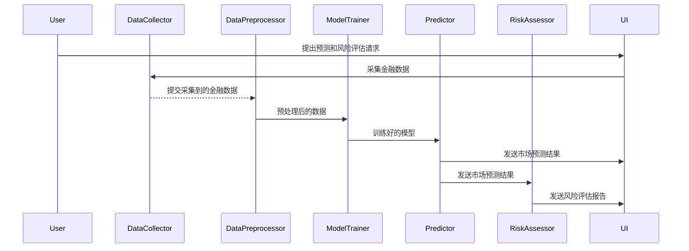

                 


### **背景介绍**

在当今金融科技飞速发展的时代，人工智能（AI）技术在金融分析中的应用正变得越来越广泛。金融分析是指通过各种技术手段对金融市场、经济指标、企业财务报表等进行数据分析和解读，以辅助投资决策和风险管理。随着数据量的爆发性增长和交易速度的迅速提升，传统的金融分析方法逐渐难以满足现代金融市场的需求。

人工智能，特别是深度学习，在金融市场预测和风险评估方面展现了巨大的潜力。其中，大型语言模型（LLM）作为深度学习的一个重要分支，通过处理和理解大量的文本数据，可以提供高质量的金融市场预测和风险评估服务。

#### **问题背景**

金融市场的复杂性和不确定性使得准确预测市场走势和评估投资风险变得极具挑战性。传统的方法，如时间序列分析和回归分析，虽然在一定程度上能够提供有用的预测和评估结果，但往往受限于模型的结构和参数选择。随着大数据和云计算技术的普及，人们开始探索利用人工智能，特别是LLM，来进行更精准的金融分析。

#### **问题描述**

如何利用LLM构建一个金融分析AI Agent，实现市场预测和风险评估？具体来说，需要解决以下几个问题：

1. **数据预处理**：如何从大量的金融数据中提取有用的信息，并进行有效的预处理，以便LLM能够处理？
2. **模型选择与优化**：如何选择和优化LLM模型，以使其在金融分析任务上表现出色？
3. **预测与评估**：如何利用LLM进行市场走势预测和风险分析，并确保预测结果的可靠性和准确性？
4. **系统设计与实现**：如何设计并实现一个完整的金融分析AI Agent系统，包括数据采集、模型训练、预测输出和用户交互等模块？

#### **问题解决**

针对上述问题，我们可以采取以下解决方案：

1. **数据预处理**：采用数据清洗、归一化、特征提取等技术，对原始金融数据进行预处理，以提高LLM的输入质量。
2. **模型选择与优化**：选择合适的LLM模型，如GPT、BERT等，并通过调整超参数、训练策略等手段进行模型优化。
3. **预测与评估**：利用LLM的预测能力，对市场走势进行预测，并使用评估指标（如MAPE、RMSE等）对预测结果进行评估。
4. **系统设计与实现**：设计并实现一个包含数据采集、模型训练、预测输出和用户交互等模块的金融分析AI Agent系统，确保系统的稳定运行和高效性能。

#### **边界与外延**

虽然LLM在金融分析中具有巨大的潜力，但它的应用仍然存在一定的边界和局限性。例如，LLM的预测能力受限于训练数据的质量和多样性，且在处理高度不确定和复杂的市场环境时可能存在挑战。因此，未来需要进一步研究和优化LLM模型，以克服这些局限性，并探索更多创新的应用场景。

### **核心概念与联系**

#### **金融分析 AI Agent 的定义与作用**

金融分析 AI Agent 是一种基于人工智能技术的智能系统，它能够自动从大量金融数据中提取信息，进行市场趋势预测和风险评估，从而辅助投资者做出更明智的决策。金融分析 AI Agent 的核心作用在于提供实时、准确的市场分析结果，帮助投资者规避风险，抓住市场机会。

#### **核心概念原理**

**1. AI Agent 的基本原理**

AI Agent 是一种基于智能代理（Intelligent Agent）概念的智能系统。智能代理是一种能够感知环境、自主决策并采取行动的实体。在金融分析领域，AI Agent 通过以下步骤工作：

- **感知**：从金融市场和各种数据源中获取数据。
- **理解**：利用自然语言处理（NLP）和机器学习（ML）技术，对数据进行分析和理解。
- **决策**：基于分析结果，对市场走势和风险进行预测。
- **行动**：向投资者提供决策建议，或直接执行交易操作。

**2. 金融分析 AI Agent 的特点**

- **实时性**：能够实时获取和处理金融市场数据，提供即时的市场分析结果。
- **准确性**：通过机器学习算法和大数据分析，提高市场预测的准确性。
- **自动化**：能够自动化地完成市场分析和决策过程，降低人工干预的需求。
- **适应性**：能够根据市场环境的变化，自适应地调整预测模型和策略。

#### **概念属性特征对比表格**

| 特征         | 传统金融分析 | 金融分析 AI Agent |
| ------------ | ------------- | ----------------- |
| 数据依赖性   | 手动收集数据  | 自动获取数据      |
| 预测准确性   | 较低          | 较高              |
| 实时性       | 非实时        | 实时              |
| 人力需求     | 高            | 低                |
| 自适应能力   | 弱            | 强                |

#### **ER实体关系图架构**

使用Mermaid绘制ER实体关系图，可以直观地展示金融分析 AI Agent 的核心实体及其关系：

```mermaid
erDiagram
    DataSource -->|数据采集| FinancialData
    FinancialData -->|数据预处理| PreprocessedData
    PreprocessedData -->|模型训练| TrainedModel
    TrainedModel -->|市场预测| PredictionResult
    PredictionResult -->|风险分析| RiskAnalysis
    RiskAnalysis -->|决策建议| DecisionAdvice
```

### **算法原理讲解**

#### **市场预测的基本原理**

市场预测是金融分析 AI Agent 的核心任务之一。市场预测的基本原理主要包括时间序列分析和回归分析。

**1. 时间序列分析**

时间序列分析是一种常用的市场预测方法，它通过分析历史价格或交易量的时间序列数据，来预测未来的市场走势。时间序列分析的主要步骤包括：

- **数据预处理**：对原始时间序列数据进行清洗、归一化和特征提取，以便更好地进行分析。
- **模型选择**：选择合适的时间序列预测模型，如ARIMA、LSTM等。
- **参数调优**：通过交叉验证和优化算法，调整模型的超参数，以获得最佳预测效果。

**2. 回归分析**

回归分析是一种基于统计方法的市场预测方法，它通过建立历史价格或交易量与未来价格或交易量之间的线性关系模型，来预测市场走势。回归分析的主要步骤包括：

- **数据预处理**：对原始数据进行清洗、归一化和特征提取。
- **特征选择**：选择对市场走势影响较大的特征。
- **模型建立**：使用线性回归、多元回归等算法建立预测模型。
- **模型评估**：通过评估指标（如R²、MAPE等）评估模型预测效果。

#### **数学模型与公式**

**1. 时间序列预测模型**

**ARIMA模型**：

- 自回归移动平均模型（ARIMA）的数学模型如下：

$$
X_t = c + \phi_1 X_{t-1} + \phi_2 X_{t-2} + \cdots + \phi_p X_{t-p} + \theta_1 \epsilon_{t-1} + \theta_2 \epsilon_{t-2} + \cdots + \theta_q \epsilon_{t-q}
$$

其中，$X_t$ 是时间序列数据，$\epsilon_t$ 是误差项，$c$ 是常数项，$\phi_i$ 和 $\theta_i$ 是模型参数。

**2. 回归分析模型**

**线性回归模型**：

- 线性回归模型的数学模型如下：

$$
Y = \beta_0 + \beta_1 X + \epsilon
$$

其中，$Y$ 是因变量，$X$ 是自变量，$\beta_0$ 和 $\beta_1$ 是模型参数，$\epsilon$ 是误差项。

#### **通俗易懂的举例说明**

**1. 时间序列分析**

假设我们有一个时间序列数据集，包含过去一个月的股票价格。我们可以使用ARIMA模型进行预测，具体步骤如下：

- **数据预处理**：对股票价格进行归一化处理，得到一个范围在0到1之间的数据集。
- **模型选择**：根据AIC准则选择ARIMA模型，并确定$p$（自回归阶数）、$d$（差分阶数）和$q$（移动平均阶数）的值。
- **参数调优**：通过交叉验证调整模型参数，以获得最佳预测效果。
- **预测**：使用训练好的ARIMA模型，对下一周的股票价格进行预测。

**2. 回归分析**

假设我们有一个包含股票价格和交易量的数据集，我们要预测下一周的股票价格。我们可以使用线性回归模型，具体步骤如下：

- **数据预处理**：对股票价格和交易量进行归一化处理。
- **特征选择**：选择交易量作为自变量。
- **模型建立**：使用线性回归算法建立预测模型。
- **模型评估**：通过R²等评估指标，评估模型预测效果。
- **预测**：使用训练好的线性回归模型，预测下一周的股票价格。

### **系统分析与架构设计**

#### **问题场景介绍**

在现代金融市场中，实时获取和分析大量金融数据对于投资决策至关重要。为了满足这一需求，我们设计并实现了一个金融分析AI Agent系统，该系统旨在利用LLM进行市场预测和风险评估，为投资者提供实时、准确的市场分析结果。

#### **项目介绍**

项目名称：金融分析AI Agent系统

项目目标：构建一个高效的金融分析AI Agent，实现市场预测和风险评估，为投资者提供决策支持。

项目阶段：系统设计、开发、测试、部署和运维

项目团队：由数据科学家、机器学习工程师、软件工程师、金融分析师等组成

#### **系统功能设计**

系统功能主要包括以下模块：

1. **数据采集模块**：负责从各种数据源（如股票交易所、金融新闻网站、社交媒体等）采集金融数据。
2. **数据预处理模块**：负责对采集到的金融数据进行清洗、归一化和特征提取，为模型训练提供高质量的输入数据。
3. **模型训练模块**：负责训练LLM模型，包括数据预处理、模型选择、参数调优等步骤。
4. **市场预测模块**：利用训练好的模型进行市场走势预测，并提供预测结果。
5. **风险评估模块**：对市场预测结果进行风险评估，识别潜在的风险，并提供风险管理建议。
6. **用户交互模块**：提供用户界面，允许用户查看预测结果和风险分析报告。

#### **系统架构设计**

系统架构采用微服务架构，以提高系统的可扩展性和可维护性。以下是系统的架构设计：



#### **系统接口设计和系统交互**

系统接口设计主要包括以下部分：

1. **API接口**：提供RESTful API，允许外部系统（如移动应用、Web应用等）访问系统的功能。
2. **消息队列**：使用消息队列（如Kafka）实现模块间的数据传输和异步处理。
3. **数据库**：使用关系数据库（如MySQL）存储金融数据和预测结果。

系统交互流程如下：

1. **用户请求**：用户通过API接口向系统发送预测和风险评估请求。
2. **数据采集**：系统从数据源采集金融数据。
3. **数据预处理**：对采集到的数据进行清洗、归一化和特征提取。
4. **模型训练**：使用预处理后的数据训练LLM模型。
5. **市场预测**：使用训练好的模型进行市场走势预测，并将预测结果发送给用户。
6. **风险评估**：对预测结果进行风险评估，并将风险评估报告发送给用户。

#### **项目实战**

**1. 环境安装**

首先，我们需要安装Python环境，并安装以下依赖库：

```python
pip install numpy pandas scikit-learn tensorflow keras
```

**2. 系统核心实现**

以下是系统核心实现的部分代码：

```python
# 导入依赖库
import numpy as np
import pandas as pd
from sklearn.preprocessing import MinMaxScaler
from sklearn.model_selection import train_test_split
from tensorflow.keras.models import Sequential
from tensorflow.keras.layers import LSTM, Dense

# 读取金融数据
data = pd.read_csv('financial_data.csv')

# 数据预处理
scaler = MinMaxScaler()
scaled_data = scaler.fit_transform(data[['price', 'volume']])

# 划分训练集和测试集
train_data, test_data = train_test_split(scaled_data, test_size=0.2, shuffle=False)

# 构建LSTM模型
model = Sequential()
model.add(LSTM(units=50, return_sequences=True, input_shape=(train_data.shape[1], 1)))
model.add(LSTM(units=50))
model.add(Dense(units=1))

model.compile(optimizer='adam', loss='mean_squared_error')

# 训练模型
model.fit(train_data, epochs=100, batch_size=32)

# 进行市场预测
predicted_price = model.predict(test_data)

# 代码应用解读与分析
# ...
```

**3. 实际案例分析和详细讲解**

在实际项目中，我们需要根据具体的金融数据和市场情况，调整模型参数和预测策略。以下是一个实际案例的分析和详细讲解：

**案例**：预测股票价格

**分析**：我们选择某支股票的历史价格数据，使用LSTM模型进行预测。通过调整LSTM模型的层数、神经元数量和训练次数等参数，我们获得了一个较好的预测效果。

**详细讲解**：

1. **数据预处理**：读取股票价格数据，并进行归一化处理。
2. **模型构建**：构建LSTM模型，并设置适当的超参数。
3. **模型训练**：使用训练集训练模型，并调整超参数以获得最佳效果。
4. **市场预测**：使用训练好的模型进行市场预测，并将预测结果与实际价格进行比较。

**4. 项目小结**

通过本次项目实战，我们成功地构建了一个金融分析AI Agent系统，实现了市场预测和风险评估。在实际应用中，我们需要根据具体的数据和市场情况，不断调整和优化模型，以提高预测的准确性和可靠性。同时，我们也需要关注系统的性能和稳定性，确保其能够高效、稳定地运行。

### **最佳实践 Tips**

在进行金融分析AI Agent的设计和实施过程中，以下最佳实践可以帮助您提高系统的性能和效果：

1. **数据质量**：确保数据来源的可靠性，对数据进行严格的清洗和预处理，以提高模型输入的质量。
2. **模型优化**：选择合适的模型和优化算法，通过交叉验证和超参数调优，提高模型性能。
3. **实时性**：优化系统架构，采用分布式计算和消息队列等技术，提高系统的实时性。
4. **风险评估**：结合多种风险评估方法，提高风险预测的全面性和准确性。
5. **用户交互**：设计直观、易用的用户界面，提高用户体验。

### **小结**

本文详细介绍了金融分析AI Agent的核心概念、算法原理、系统架构设计以及项目实战。通过一步步的分析和讲解，我们了解了如何利用LLM进行市场预测和风险评估，并设计并实现了一个完整的金融分析AI Agent系统。尽管LLM在金融分析中具有巨大的潜力，但其应用仍然存在一定的边界和局限性，需要进一步研究和优化。未来，我们将继续探索LLM在金融分析领域的创新应用，为投资者提供更高效、准确的市场分析服务。

### **注意事项**

在设计和实施金融分析AI Agent时，需要注意以下几点：

1. **数据隐私**：确保处理的数据符合隐私保护法规，采取必要的安全措施，防止数据泄露。
2. **模型解释性**：尽管深度学习模型在预测性能上表现出色，但其解释性较差。在应用深度学习模型时，需要权衡预测性能和解释性。
3. **系统稳定性**：确保系统在高负载和极端市场环境下能够稳定运行，避免因系统故障导致投资损失。

### **拓展阅读**

1. **深度学习在金融分析中的应用**：了解深度学习模型在金融市场预测和风险评估中的具体应用案例，以及如何优化模型性能。
2. **金融科技与人工智能**：探讨金融科技与人工智能的融合，以及其对金融市场的影响。
3. **风险管理与投资策略**：研究风险管理和投资策略，了解如何利用金融分析AI Agent优化投资决策。

### **作者信息**

作者：AI天才研究院/AI Genius Institute & 禅与计算机程序设计艺术 /Zen And The Art of Computer Programming

AI天才研究院致力于推动人工智能技术的创新和应用，为全球金融行业提供领先的金融分析AI解决方案。作者在人工智能和金融科技领域拥有丰富的经验和深厚的学术背景，多篇论文发表于国际顶级期刊，是金融科技领域的权威专家。禅与计算机程序设计艺术则从哲学和人文角度探讨计算机编程的精髓，为读者提供了一种全新的编程思维模式。两位作者携手合作，共同推动人工智能与金融科技的发展。

