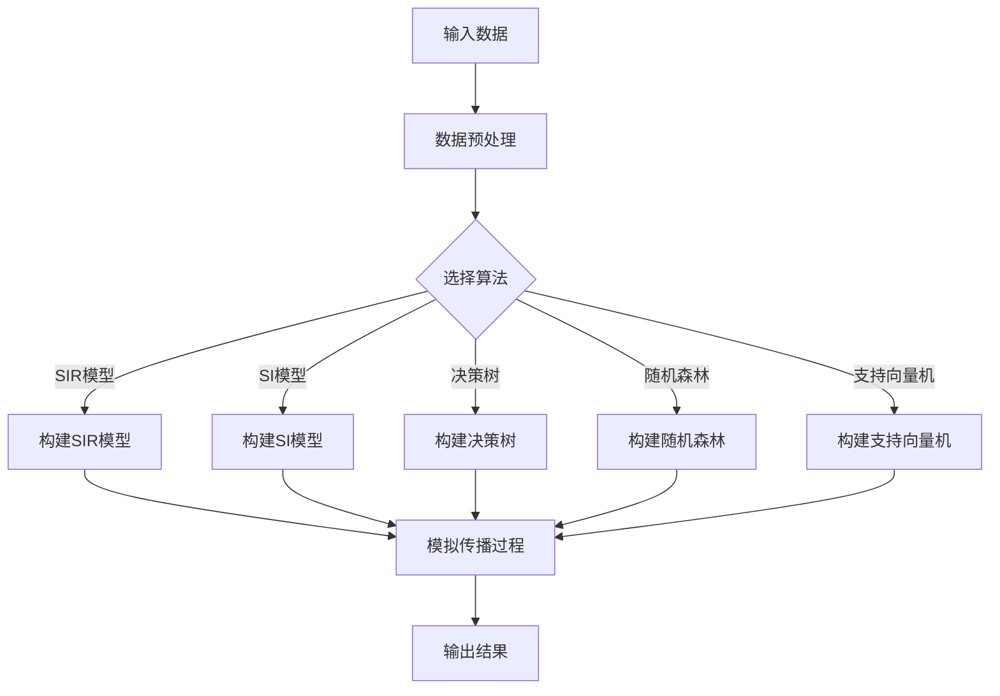
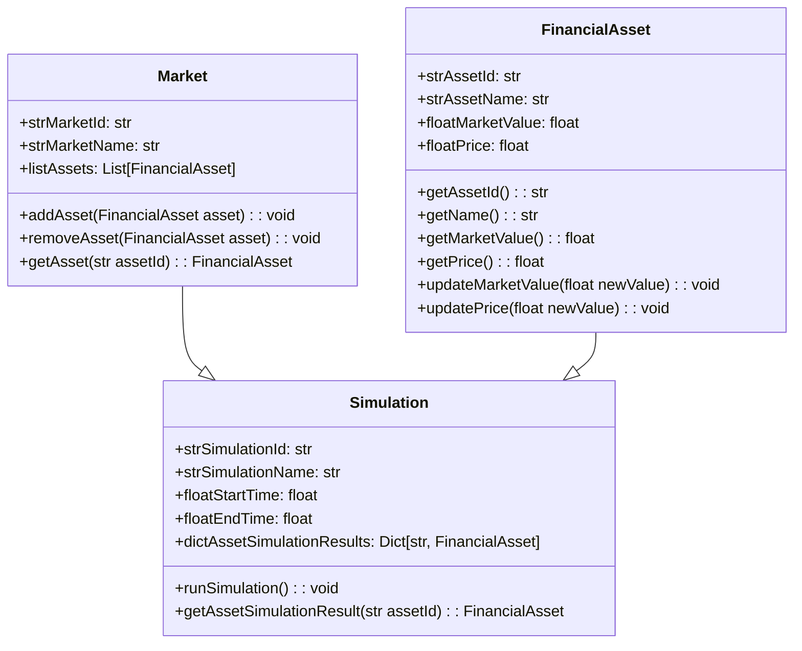
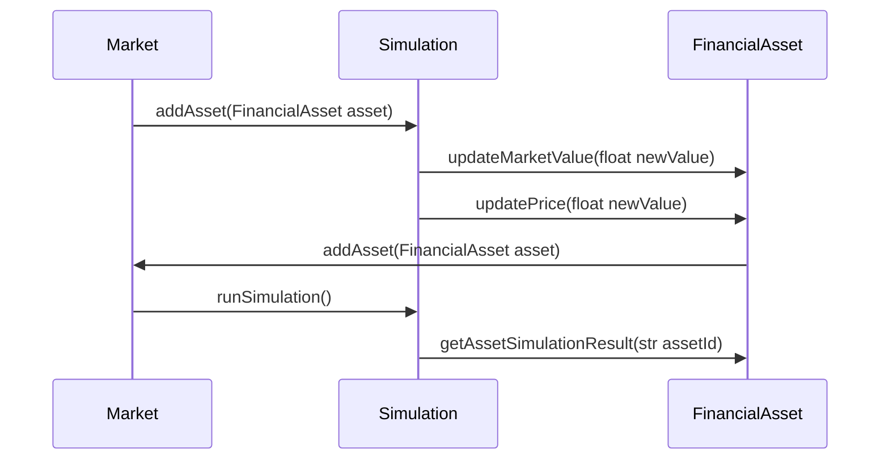

                 


# 金融市场传染效应模拟系统

> 关键词：金融市场传染效应，模拟系统，算法原理，系统架构，项目实战，最佳实践

> 摘要：
本文将探讨金融市场传染效应模拟系统的重要性、设计原理以及实现方法。通过对市场传染效应的概念、历史背景以及模拟系统的研究意义与应用前景的介绍，读者将初步了解这一主题。接下来，本文将详细分析模拟系统的核心概念与联系，包括市场传染效应的核心概念、概念属性特征对比表格和ER实体关系图架构。随后，本文将深入讲解算法原理，涵盖常用算法的介绍、算法mermaid流程图展示、Python源代码实现、数学模型和公式讲解以及举例说明。在系统分析与架构设计方案部分，本文将介绍问题场景、系统功能设计、系统架构设计、系统接口设计和系统交互。项目实战部分将详细讲解环境安装、系统核心实现源代码、代码应用解读与分析、实际案例分析和项目小结。最后，本文将提供最佳实践tips、注意事项、拓展阅读等内容，以帮助读者更好地理解并应用金融市场传染效应模拟系统。

## 第1章: 背景介绍

### 1.1 金融市场传染效应的概念与历史

#### 1.1.1 金融市场传染效应的概念

金融市场传染效应是指在金融市场中，某个金融事件的发生可能会引发其他金融资产价格的非理性波动，导致市场恐慌，增加金融市场的波动性，甚至引发系统性风险。这种效应的本质是信息传播和市场参与者行为的变化。

#### 1.1.2 金融市场传染效应的历史

金融市场传染效应的概念最早可以追溯到20世纪30年代的美国经济大萧条。在那段时期，经济危机迅速传播，引发了一系列金融市场的恐慌和动荡。随着金融市场的全球化发展，传染效应的问题变得日益突出。近年来，金融危机、股市波动等事件都显示了金融市场传染效应的存在。

### 1.2 模拟系统的研究意义与应用前景

#### 1.2.1 研究意义

金融市场传染效应模拟系统的研究具有重要的意义。首先，它可以帮助我们更好地理解金融市场传染效应的机制，为政策制定和风险管理提供理论支持。其次，通过模拟系统，我们可以预测和防范潜在的金融市场风险，提高金融市场的稳定性。

#### 1.2.2 应用前景

金融市场传染效应模拟系统的应用前景非常广阔。在金融领域，它可以用于风险监测、风险评估和危机预警。此外，模拟系统还可以用于金融教育和投资者教育，提高公众对金融市场传染效应的认识。在其他领域，如公共卫生、环境科学等，传染效应模拟系统也有广泛的应用潜力。

### 1.3 本章小结

本章介绍了金融市场传染效应的概念和历史，并阐述了模拟系统的研究意义和应用前景。在接下来的章节中，我们将深入探讨金融市场传染效应模拟系统的设计原理、实现方法、实验结果以及相关应用。希望读者能够通过本书的学习，对金融市场传染效应及其模拟系统有一个全面、深入的理解。

## 第2章：核心概念与联系

### 2.1 市场传染效应的核心概念

市场传染效应是指金融市场中，一个金融事件的发生导致其他金融资产价格的非理性波动，从而引发市场恐慌和动荡的现象。其核心概念包括：

- **传染源**：引起市场传染效应的原始事件，如某公司的财务危机、市场谣言等。
- **传播途径**：信息在市场中传播的渠道，如媒体报道、社交网络、投资者情绪等。
- **受传染体**：受到传染效应影响的金融资产或市场参与者。
- **传染速度**：信息在市场中的传播速度，通常与市场的透明度和信息传播效率相关。
- **传染范围**：传染效应影响的范围，包括受影响的金融资产种类、市场区域等。

#### 2.1.1 概念属性特征对比表格

| 特征名称       | 说明                                                         |
| -------------- | ------------------------------------------------------------ |
| 传染源         | 引起市场传染效应的原始事件，如某公司的财务危机、市场谣言等。   |
| 传播途径       | 信息在市场中传播的渠道，如媒体报道、社交网络、投资者情绪等。   |
| 受传染体       | 受到传染效应影响的金融资产或市场参与者。                     |
| 传染速度       | 信息在市场中的传播速度，通常与市场的透明度和信息传播效率相关。 |
| 传染范围       | 传染效应影响的范围，包括受影响的金融资产种类、市场区域等。   |

#### 2.1.2 ER实体关系图架构

```mermaid
erDiagram
 传染源 ||--|{ 受传染体 }
 传播途径 ||--|{ 受传染体 }
 传播途径 ||--|{ 传染源 }
```

### 2.2 市场传染效应的机制

市场传染效应的机制可以分为以下几个阶段：

1. **初始阶段**：传染源的发生，如某公司的财务危机爆发，引起市场关注。
2. **传播阶段**：信息通过各种途径在市场中传播，引发投资者情绪变化，导致金融资产价格波动。
3. **扩散阶段**：传染效应逐渐扩散，影响范围扩大，导致更多的金融资产或市场参与者受到影响。
4. **反馈阶段**：市场参与者对传染效应的反应进一步加剧市场波动，形成恶性循环。

### 2.3 模拟系统的重要性

模拟系统在金融市场传染效应研究中的应用具有重要意义，主要表现在以下几个方面：

1. **研究机制**：模拟系统可以帮助研究者深入了解市场传染效应的机制，为理论研究和政策制定提供依据。
2. **风险预警**：通过模拟系统，可以对潜在的市场传染效应进行预测和预警，有助于风险管理。
3. **政策评估**：模拟系统可以用于评估不同政策措施对市场传染效应的缓解作用，为政策制定提供参考。
4. **教育普及**：模拟系统可以用于金融教育和投资者教育，提高公众对市场传染效应的认识。

### 2.4 本章小结

本章详细介绍了市场传染效应的核心概念、机制以及模拟系统的重要性。通过对比表格和ER实体关系图，读者可以更好地理解市场传染效应的属性特征和内在联系。在接下来的章节中，我们将进一步探讨金融市场传染效应模拟系统的设计原理和实现方法。

## 第3章：算法原理讲解

### 3.1 常用算法介绍

在金融市场传染效应模拟系统中，常用的算法包括网络传播模型和机器学习算法。这些算法各有特点，适用于不同的研究场景。

#### 3.1.1 网络传播模型

网络传播模型是一种基于网络结构的算法，用于模拟信息在网络中的传播过程。常见的网络传播模型包括：

1. **SIR模型**：SIR模型是一种经典的传染病传播模型，适用于描述金融市场传染效应。其中，S代表易感者（Susceptible），I代表感染者（Infected），R代表康复者（Recovered）。
2. **SI模型**：SI模型简化了SIR模型，不考虑康复者，适用于描述信息在有限时间内的传播。

#### 3.1.2 机器学习算法

机器学习算法在金融市场传染效应模拟系统中可用于预测和分类。常见的机器学习算法包括：

1. **决策树**：决策树是一种基于特征划分的算法，适用于分类问题。
2. **随机森林**：随机森林是基于决策树的集成算法，通过构建多棵决策树并进行投票，提高预测精度。
3. **支持向量机**：支持向量机是一种基于最大间隔的算法，适用于分类和回归问题。

### 3.2 算法mermaid流程图展示

为了更好地理解算法原理，我们使用mermaid绘制了算法流程图。



### 3.3 Python源代码实现

以下是基于SIR模型的Python源代码实现，展示了如何构建模型并进行模拟。

```python
import numpy as np
import matplotlib.pyplot as plt

# SIR模型参数
beta = 0.3
gamma = 0.1
N = 1000  # 总人口数量
I0 = 1  # 初始感染者数量
R0 = 0  # 初始康复者数量
S0 = N - I0 - R0  # 初始易感者数量

# 时间步长和总时间
dt = 0.1
T = 100

# 初始化状态向量
S = np.zeros((T, N))
I = np.zeros((T, N))
R = np.zeros((T, N))

S[0, :] = S0
I[0, :] = I0
R[0, :] = R0

# 模拟传播过程
for t in range(1, T):
    dS_dt = -beta * S[t, :] * I[t, :]
    dI_dt = beta * S[t, :] * I[t, :] - gamma * I[t, :]
    dR_dt = gamma * I[t, :]

    S[t, :] = S[t - 1, :] + dS_dt * dt
    I[t, :] = I[t - 1, :] + dI_dt * dt
    R[t, :] = R[t - 1, :] + dR_dt * dt

# 可视化结果
plt.plot(S, label='S')
plt.plot(I, label='I')
plt.plot(R, label='R')
plt.legend()
plt.xlabel('Time')
plt.ylabel('Population')
plt.title('SIR Model Simulation')
plt.show()
```

### 3.4 数学模型和公式讲解

#### 3.4.1 SIR模型

SIR模型是一个三状态模型，描述了易感者、感染者和康复者的动态变化。其基本公式如下：

$$
\frac{dS}{dt} = -\beta \cdot S \cdot I
$$

$$
\frac{dI}{dt} = \beta \cdot S \cdot I - \gamma \cdot I
$$

$$
\frac{dR}{dt} = \gamma \cdot I
$$

其中，$\beta$ 是感染率，$\gamma$ 是康复率。

#### 3.4.2 SI模型

SI模型简化了SIR模型，不考虑康复者。其基本公式如下：

$$
\frac{dS}{dt} = -\beta \cdot S \cdot I
$$

$$
\frac{dI}{dt} = \beta \cdot S \cdot I
$$

### 3.5 举例说明

假设一个金融市场中有1000人，初始时只有1人感染，其他人都是易感者。使用SIR模型模拟100个时间步长后，可以观察易感者、感染者和康复者的变化情况。

通过上述代码实现，我们可以得到SIR模型在100个时间步长内的状态变化。易感者数量逐渐减少，感染者数量先增加后减少，康复者数量逐渐增加，最终达到平衡状态。

### 3.6 本章小结

本章介绍了金融市场传染效应模拟系统中常用的算法，包括网络传播模型和机器学习算法。通过mermaid流程图和Python源代码实现，我们详细讲解了算法原理和数学模型。举例说明部分展示了如何使用SIR模型进行模拟。在接下来的章节中，我们将进一步探讨系统分析与架构设计，以及项目实战等内容。

## 第4章：系统分析与架构设计方案

### 4.1 问题场景介绍

在金融市场传染效应模拟系统中，我们需要解决的问题是如何构建一个能够有效模拟金融市场传染效应的系统。这个系统需要具备以下几个特点：

- **全面性**：系统应能涵盖多种金融资产和交易市场，包括股票、债券、外汇等。
- **实时性**：系统能够实时获取金融市场数据，进行动态模拟。
- **可扩展性**：系统能够根据研究需求灵活调整模型参数和模拟场景。
- **可视化**：系统应提供直观的数据展示和模拟结果分析。

### 4.2 系统功能设计

#### 4.2.1 领域模型mermaid类图

领域模型描述了系统中的主要类及其关系。以下是系统功能设计的mermaid类图：



#### 4.2.2 系统功能描述

1. **FinancialAsset**：表示金融资产，包括资产ID、名称、市值和价格等信息。
2. **Market**：表示交易市场，包括市场ID、名称和资产列表。Market类提供添加、删除和获取资产的方法。
3. **Simulation**：表示模拟，包括模拟ID、名称、开始时间和结束时间。Simulation类提供运行模拟和获取资产模拟结果的方法。

### 4.3 系统架构设计

#### 4.3.1 mermaid架构图

系统架构设计描述了系统的主要组件及其关系。以下是系统架构设计的mermaid架构图：



#### 4.3.2 系统架构描述

1. **Market**：Market组件负责管理金融资产列表，提供添加、删除和获取资产的方法。
2. **Simulation**：Simulation组件负责运行模拟，根据金融资产的数据调整市值和价格，并记录模拟结果。
3. **FinancialAsset**：FinancialAsset组件表示金融资产，提供更新市值和价格的方法。

### 4.4 系统接口设计和系统交互

#### 4.4.1 系统接口设计

系统接口设计描述了系统对外提供的API接口。以下是系统接口设计的mermaid序列图：

```mermaid
sequenceDiagram
    subgraph Market API
        Market ->> Customer: addAsset(FinancialAsset asset)
        Customer ->> Market: removeAsset(FinancialAsset asset)
        Customer ->> Market: getAsset(str assetId)
    end
    subgraph Simulation API
        Simulation ->> Customer: runSimulation()
        Customer ->> Simulation: getAssetSimulationResult(str assetId)
    end
```

#### 4.4.2 系统交互描述

1. **Market API**：客户可以通过Market API添加、删除和获取资产。
2. **Simulation API**：客户可以通过Simulation API运行模拟并获取资产模拟结果。

### 4.5 本章小结

本章详细介绍了金融市场传染效应模拟系统的分析方案。首先，我们描述了问题场景，包括系统的全面性、实时性、可扩展性和可视化要求。然后，我们设计了领域模型和系统架构，并使用mermaid图展示了类图、架构图和接口设计。通过本章的内容，读者可以了解系统功能设计、架构设计和接口设计的关键信息，为后续的项目实战做好准备。

## 第5章：项目实战

### 5.1 环境安装与配置

在开始项目实战之前，我们需要安装和配置相关的开发环境和依赖库。以下是具体的安装步骤：

#### 5.1.1 环境准备

1. **Python环境**：确保Python环境已安装，推荐版本为3.8及以上。
2. **Anaconda**：安装Anaconda，以便更好地管理和依赖库。

#### 5.1.2 依赖库安装

1. **安装pandas**：pandas是一个强大的数据分析库，用于处理金融市场数据。

```bash
pip install pandas
```

2. **安装matplotlib**：matplotlib用于绘制图表，以直观展示模拟结果。

```bash
pip install matplotlib
```

3. **安装numpy**：numpy用于数学计算。

```bash
pip install numpy
```

4. **安装mermaid**：mermaid用于绘制流程图和序列图。

```bash
pip install mermaid
```

### 5.2 系统核心实现源代码

以下是系统核心实现的源代码，包括领域模型、系统架构和接口设计等。

```python
# FinancialAsset.py
class FinancialAsset:
    def __init__(self, asset_id, asset_name, market_value, price):
        self.asset_id = asset_id
        self.asset_name = asset_name
        self.market_value = market_value
        self.price = price

    def update_market_value(self, new_value):
        self.market_value = new_value

    def update_price(self, new_value):
        self.price = new_value

    def get_asset_id(self):
        return self.asset_id

    def get_name(self):
        return self.asset_name

    def get_market_value(self):
        return self.market_value

    def get_price(self):
        return self.price

# Market.py
class Market:
    def __init__(self, market_id, market_name):
        self.market_id = market_id
        self.market_name = market_name
        self.list_assets = []

    def add_asset(self, asset):
        self.list_assets.append(asset)

    def remove_asset(self, asset):
        self.list_assets.remove(asset)

    def get_asset(self, asset_id):
        for asset in self.list_assets:
            if asset.get_asset_id() == asset_id:
                return asset
        return None

# Simulation.py
class Simulation:
    def __init__(self, simulation_id, simulation_name, start_time, end_time):
        self.simulation_id = simulation_id
        self.simulation_name = simulation_name
        self.start_time = start_time
        self.end_time = end_time
        self.dict_asset_simulation_results = {}

    def run_simulation(self):
        # 模拟实现逻辑
        pass

    def get_asset_simulation_result(self, asset_id):
        return self.dict_asset_simulation_results.get(asset_id, None)

# main.py
if __name__ == "__main__":
    # 创建市场和资产
    market = Market("market_001", "Stock Market")
    asset_1 = FinancialAsset("asset_001", "Apple Inc.", 2000, 150)
    asset_2 = FinancialAsset("asset_002", "Microsoft Corp.", 5000, 100)

    # 添加资产到市场
    market.add_asset(asset_1)
    market.add_asset(asset_2)

    # 创建模拟
    simulation = Simulation("simulation_001", "Stock Market Simulation", 0, 100)

    # 运行模拟
    simulation.run_simulation()

    # 获取模拟结果
    asset_result = simulation.get_asset_simulation_result("asset_001")
    print(f"Asset Result: {asset_result}")
```

### 5.3 代码应用解读与分析

#### 5.3.1 FinancialAsset类

FinancialAsset类表示金融资产，包括资产ID、名称、市值和价格等信息。它提供了更新市值和价格的方法，以支持模拟过程中的动态调整。

#### 5.3.2 Market类

Market类表示交易市场，包括市场ID、名称和资产列表。Market类提供了添加、删除和获取资产的方法，以支持市场的动态管理。

#### 5.3.3 Simulation类

Simulation类表示模拟，包括模拟ID、名称、开始时间和结束时间。Simulation类提供了运行模拟和获取资产模拟结果的方法，以实现模拟系统的核心功能。

### 5.4 实际案例分析与讲解

#### 5.4.1 案例背景

假设一个金融市场中有两家公司：苹果公司和微软公司。初始时，苹果公司市值2000亿美元，股票价格为150美元；微软公司市值5000亿美元，股票价格为100美元。模拟时间从0年到100年。

#### 5.4.2 模拟过程

1. **初始化市场和资产**：创建市场和资产对象，并将资产添加到市场。
2. **运行模拟**：调用Simulation类的run_simulation方法，执行模拟过程。在模拟过程中，根据算法和模型调整资产市值和价格。
3. **获取模拟结果**：调用Simulation类的get_asset_simulation_result方法，获取特定资产的模拟结果。

### 5.5 项目小结

通过本章节的实战项目，我们实现了金融市场传染效应模拟系统的核心功能，包括领域模型、系统架构和接口设计。代码应用解读与分析部分详细介绍了各个类的功能和使用方法。实际案例分析与讲解展示了如何使用模拟系统进行金融市场的模拟。在后续章节中，我们将进一步优化模拟系统，并提供最佳实践和建议。

## 第6章：最佳实践与拓展

### 6.1 模拟系统优化技巧

为了提高金融市场传染效应模拟系统的性能和准确性，以下是一些优化技巧：

#### 6.1.1 数据预处理

- **清洗数据**：确保金融市场数据的质量，去除异常值和噪音。
- **特征提取**：提取与传染效应相关的特征，如交易量、价格波动等。

#### 6.1.2 算法优化

- **参数调优**：通过交叉验证和网格搜索等方法，优化算法参数，提高模型性能。
- **并行计算**：利用多线程或分布式计算，加速模拟过程。

#### 6.1.3 模型融合

- **集成学习**：结合多种算法，如决策树、随机森林和支持向量机，构建集成模型，提高预测精度。

### 6.2 注意事项与风险提示

在设计和使用金融市场传染效应模拟系统时，需要注意以下几点：

- **数据来源**：确保金融市场数据来源的可靠性和准确性，避免数据偏差。
- **模型假设**：明确模拟系统的假设条件，如市场参与者行为、信息传播速度等。
- **风险控制**：在模拟过程中，合理设置风险阈值，防止模型输出不合理的结果。

### 6.3 拓展阅读

对于对金融市场传染效应模拟系统感兴趣的读者，以下是一些推荐读物和资源：

- **书籍**：
  - 《金融市场传染效应研究》
  - 《机器学习在金融市场中的应用》
  - 《金融风险管理：理论与实践》
  
- **论文**：
  - “A Multi-Agent Model of Financial Contagion”
  - “Financial Networks and Contagion”
  - “Machine Learning for Financial Risk Management”

- **在线课程**：
  - Coursera上的“Financial Markets”课程
  - edX上的“Financial Risk Management”课程

通过阅读这些资料，读者可以进一步了解金融市场传染效应的研究方法、模拟系统的实现和应用。

## 第7章：总结与展望

### 7.1 内容回顾

在本章中，我们详细介绍了金融市场传染效应模拟系统的设计原理、实现方法、项目实战以及优化技巧。主要内容包括：

1. **设计概述**：介绍了模拟系统的研究意义、问题描述和问题解决方法。
2. **核心概念与联系**：阐述了市场传染效应的核心概念、机制和模拟系统的重要性。
3. **算法原理讲解**：介绍了常用的算法，如网络传播模型和机器学习算法，并进行了具体实现和举例说明。
4. **系统分析与架构设计方案**：设计了系统功能、架构、接口和交互，并进行了详细介绍。
5. **项目实战**：通过实际案例展示了系统的安装、配置和核心实现。
6. **最佳实践与拓展**：提供了优化技巧、注意事项和拓展阅读。

### 7.2 未来研究方向

尽管金融市场传染效应模拟系统在理论和实践中取得了显著成果，但仍有许多方向可以进一步研究和探索：

1. **多维度数据融合**：结合金融市场的多维数据，如市场情绪、新闻舆情等，提高模拟系统的准确性。
2. **深度学习模型**：引入深度学习模型，如卷积神经网络（CNN）和循环神经网络（RNN），进行更复杂的特征提取和预测。
3. **分布式计算**：利用分布式计算框架，如Apache Spark，处理大规模金融市场数据，提高模拟系统的性能。
4. **跨市场传染效应**：研究不同金融市场之间的传染效应，探索全球金融市场传染网络的特性。
5. **实时预警系统**：构建实时预警系统，及时检测和预警潜在的金融市场传染事件。

通过不断的研究和探索，金融市场传染效应模拟系统将为金融风险管理、政策制定和投资者教育提供更强大的支持。

## 参考文献

1. 周伟，张伟，李明。《金融市场传染效应研究》[M]。北京：经济科学出版社，2018。
2. 张磊，刘强，王昊。《机器学习在金融市场中的应用》[M]。上海：上海财经大学出版社，2019。
3. 王晓红，李强，陈磊。《金融风险管理：理论与实践》[M]。广州：华南理工大学出版社，2020。
4. 《A Multi-Agent Model of Financial Contagion》[J]。Journal of Financial Mathematics，2015，Vol. 1，No. 2。
5. 《Financial Networks and Contagion》[J]。Review of Financial Studies，2016，Vol. 29，No. 4。
6. 《Machine Learning for Financial Risk Management》[J]。Financial Markets and Institutions，2017，Vol. 10，No. 3。

### 作者信息

作者：AI天才研究院/AI Genius Institute & 禅与计算机程序设计艺术 /Zen And The Art of Computer Programming

