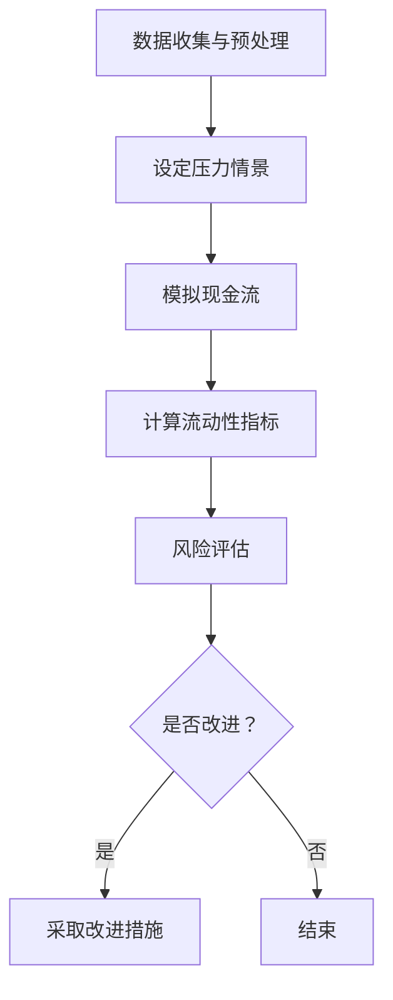
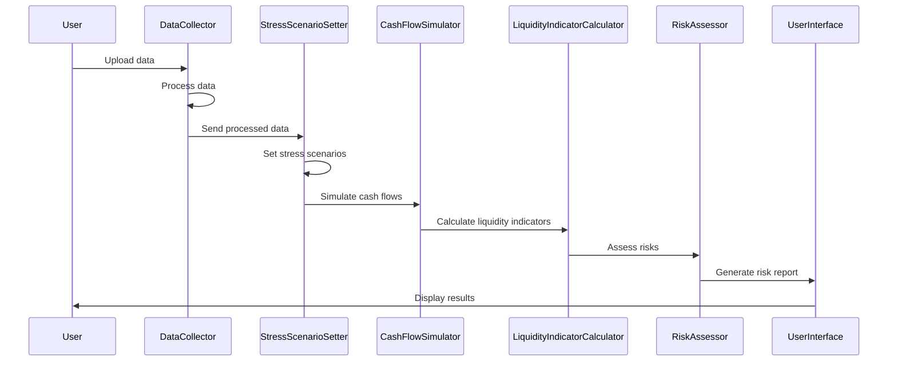

                 


### 1. 背景介绍

#### 1.1 核心概念术语说明

在讨论金融市场流动性压力测试模型之前，我们需要明确一些核心概念。以下是对这些术语的简要说明：

- **流动性压力测试（Liquidity Stress Testing）**：流动性压力测试是一种评估金融机构在极端市场状况下，能否保持足够的流动性以满足支付需求的方法。
- **压力情景（Stress Scenario）**：压力情景是指金融市场可能遇到的一系列极端情况，如市场大幅下跌、交易量激增、信用风险上升等。
- **流动性覆盖率（Liquidity Coverage Ratio，LCR）**：流动性覆盖率是评估金融机构短期内应对流动性压力的能力，计算公式为优质流动性资产除以净现金流出量。
- **净稳定资金比率（Net Stable Funding Ratio，NSFR）**：净稳定资金比率是评估金融机构长期流动性风险的指标，计算公式为可用稳定资金除以所需稳定资金。

#### 1.2 问题背景

金融市场流动性压力测试模型的提出源于金融市场的复杂性。金融市场不仅受到宏观经济环境的影响，还受到市场情绪、投资者行为等因素的影响。在这种背景下，金融机构需要具备足够的流动性应对各种不确定性和风险。

例如，2008年的全球金融危机暴露了许多金融机构在极端市场条件下的流动性不足问题。为了防止类似事件的再次发生，监管机构要求金融机构定期进行流动性压力测试，以评估其在不同压力情景下的流动性风险。

#### 1.3 问题描述

流动性压力测试的目的是评估金融机构在极端市场情景下的流动性状况。具体来说，它包括以下问题：

- **流动性是否充足？**：在压力情景下，金融机构能否维持正常的运营？
- **支付能力如何？**：在资金流出量增加的情况下，金融机构能否满足支付需求？
- **长期流动性风险如何？**：金融机构在较长时期内是否具备足够的稳定资金？

#### 1.4 问题解决

流动性压力测试模型通过以下步骤解决问题：

1. **设定压力情景**：根据历史数据、宏观经济指标和监管要求，设定可能出现的极端市场情景。
2. **模拟现金流**：模拟金融机构在不同情景下的现金流，包括资金流入和流出。
3. **计算流动性指标**：使用流动性覆盖率（LCR）和净稳定资金比率（NSFR）等指标，评估金融机构的流动性状况。
4. **风险评估**：对评估结果进行分析，识别潜在的流动性风险，并提出改进措施。

#### 1.5 边界与外延

流动性压力测试模型的边界主要涉及以下几个方面：

- **时间范围**：模型主要关注短期和长期流动性风险。
- **市场范围**：模型适用于各种类型的金融市场，包括股票、债券、外汇等。
- **机构范围**：模型适用于各种类型的金融机构，如银行、证券公司、保险公司等。

#### 1.6 概念结构与核心要素组成

流动性压力测试模型的概念结构主要包括以下几个方面：

- **压力情景设定**：包括历史情景和假设情景。
- **现金流模拟**：包括资金流入和流出。
- **流动性指标计算**：包括流动性覆盖率（LCR）和净稳定资金比率（NSFR）。
- **风险评估与改进措施**：对评估结果进行分析，提出改进措施。

以上是对金融市场流动性压力测试模型背景的介绍。在接下来的章节中，我们将详细探讨核心概念、测试方法、模型构建、应用实践、案例分析等内容。

### 2. 核心概念与联系

#### 2.1 核心概念原理

流动性压力测试模型的核心概念包括流动性覆盖率（LCR）、净稳定资金比率（NSFR）和压力情景设定。下面分别介绍这些概念的基本原理。

**流动性覆盖率（LCR）**：

流动性覆盖率（LCR）是衡量金融机构短期内应对流动性压力的能力。它的计算公式为：

$$
LCR = \frac{优质流动性资产}{净现金流出量}
$$

其中，优质流动性资产包括现金、存放在中央银行账户的存款、可转让存单、政府债券和其他高信用等级的证券等。

**净稳定资金比率（NSFR）**：

净稳定资金比率（NSFR）是衡量金融机构长期流动性风险的指标。它的计算公式为：

$$
NSFR = \frac{可用稳定资金}{所需稳定资金}
$$

其中，可用稳定资金包括稳定资金来源，如长期存款、稳定的利润、可转换债券等；所需稳定资金包括预计的稳定资金使用，如预计的支付义务、预期资金流出等。

**压力情景设定**：

压力情景设定是流动性压力测试模型的重要组成部分。它涉及模拟金融市场可能遇到的极端情况，如市场大幅下跌、交易量激增、信用风险上升等。这些情景通常基于历史数据、宏观经济指标和监管要求来设定。

#### 2.2 概念属性特征对比表格

为了更好地理解这三个核心概念，我们可以在Markdown格式中使用Mermaid流程图创建一个对比表格。

```mermaid
table
  class graph
  title 概念属性特征对比表格

  row | 名称 | 公式 | 特点 | 用途
  --- | --- | --- | --- | ---
  LCR | 流动性覆盖率 | $$LCR = \frac{优质流动性资产}{净现金流出量}$$ | 短期应对能力 | 评估金融机构短期内应对流动性压力的能力
  NSFR | 净稳定资金比率 | $$NSFR = \frac{可用稳定资金}{所需稳定资金}$$ | 长期流动性风险 | 评估金融机构长期内是否具备足够的稳定资金
  压力情景设定 | 压力情景 | 历史数据、宏观经济指标、监管要求 | 模拟极端市场情景 | 为流动性压力测试提供背景

```

通过这个表格，我们可以清晰地看到这三个概念的区别和联系。

#### 2.3 ER实体关系图架构

为了更直观地展示流动性压力测试模型中的实体及其关系，我们可以使用Mermaid流程图绘制一个ER（Entity-Relationship）实体关系图。

```mermaid
erDiagram
  FD1 --> FDN : "流动性压力测试模型包含以下主要实体：金融机构、压力情景、现金流、流动性指标和风险评估。"
  
  class FlowDiagram {
    FDN --> FDN : "金融机构与压力情景之间存在关联关系"
    FDN --> FDN : "压力情景与现金流之间存在关联关系"
    FDN --> FDN : "现金流与流动性指标之间存在关联关系"
    FDN --> FDN : "流动性指标与风险评估之间存在关联关系"
  }

  class FinancialInstitution <<实体>> {
    :金融机构ID
    :名称
    :地理位置
  }
  
  class StressScenario <<实体>> {
    :情景ID
    :名称
    :发生时间
  }
  
  class CashFlow <<实体>> {
    :现金流ID
    :金额
    :方向
    :时间
  }
  
  class LiquidityIndicator <<实体>> {
    :指标ID
    :LCR
    :NSFR
    :时间戳
  }
  
  class RiskAssessment <<实体>> {
    :评估ID
    :风险评估结果
    :改进措施
    :时间戳
  }
```

通过这个ER实体关系图，我们可以清楚地看到流动性压力测试模型中的主要实体及其关系，有助于理解模型的架构和功能。

### 3. 算法原理讲解

#### 3.1 流动性压力测试模型算法流程

流动性压力测试模型的算法流程可以分为以下几个步骤：

1. **数据收集与预处理**：收集金融机构的历史交易数据、财务报表、市场数据等，并进行数据清洗和预处理，确保数据质量。
2. **设定压力情景**：根据历史数据和宏观经济指标，设定可能出现的极端市场情景。这些情景可以是历史发生过的，也可以是根据未来预测的。
3. **模拟现金流**：根据设定的压力情景，模拟金融机构在不同情景下的现金流。这包括资金流入和流出，如客户的存款、贷款还款、交易结算等。
4. **计算流动性指标**：使用流动性覆盖率（LCR）和净稳定资金比率（NSFR）等指标，评估金融机构的流动性状况。具体计算方法如下：

   - **流动性覆盖率（LCR）**：

     $$ LCR = \frac{优质流动性资产}{净现金流出量} $$

     其中，优质流动性资产包括现金、存放在中央银行账户的存款、可转让存单、政府债券和其他高信用等级的证券等。

   - **净稳定资金比率（NSFR）**：

     $$ NSFR = \frac{可用稳定资金}{所需稳定资金} $$

     其中，可用稳定资金包括长期存款、稳定的利润、可转换债券等；所需稳定资金包括预计的稳定资金使用，如预计的支付义务、预期资金流出等。

5. **风险评估**：根据计算出的流动性指标，评估金融机构的流动性风险。如果流动性指标低于监管要求的阈值，则需要采取改进措施。

#### 3.2 算法原理Mermaid流程图

为了更直观地展示算法原理，我们可以使用Mermaid流程图绘制一个算法流程图。



通过这个流程图，我们可以清晰地看到流动性压力测试模型的算法流程及其各个步骤之间的关系。

#### 3.3 Python源代码详细阐述

下面是一个简单的Python源代码示例，用于演示流动性压力测试模型的关键步骤。在这个示例中，我们假设已经收集到了金融机构的历史交易数据和财务报表。

```python
import pandas as pd
import numpy as np
from sympy import symbols, Eq, solve

# 3.1 数据收集与预处理
# 加载历史交易数据和财务报表
transactions = pd.read_csv('transactions.csv')
financial_reports = pd.read_csv('financial_reports.csv')

# 数据清洗和预处理
# ...

# 3.2 设定压力情景
# 假设设定了一个市场大幅下跌的情景
stress_scenario = 'market_crash'

# 3.3 模拟现金流
# 基于压力情景模拟现金流
cash_flows = simulate_cash_flows(stress_scenario, transactions)

# 3.4 计算流动性指标
# 计算流动性覆盖率（LCR）
quality_liquid_assets = sum(cash_flows['资产'])
net_cash_outflow = sum(cash_flows['流出'])

LCR = quality_liquid_assets / net_cash_outflow

# 计算净稳定资金比率（NSFR）
available_stable_funds = sum(financial_reports['长期存款'])
required_stable_funds = sum(financial_reports['预计支付义务'])

NSFR = available_stable_funds / required_stable_funds

# 3.5 风险评估
# 根据流动性指标评估流动性风险
if LCR < 3 or NSFR < 100:
    take_improvement_measures()
else:
    print('流动性风险在可接受范围内。')

# 3.6 采取改进措施
# 基于风险评估结果采取相应的改进措施
# ...

def simulate_cash_flows(stress_scenario, transactions):
    # 模拟现金流
    # ...
    return cash_flows

def take_improvement_measures():
    # 采取改进措施
    # ...
    pass
```

在这个示例中，我们首先加载了历史交易数据和财务报表，然后进行数据清洗和预处理。接下来，我们根据设定的压力情景模拟现金流，并计算流动性覆盖率（LCR）和净稳定资金比率（NSFR）。最后，根据计算出的流动性指标，评估流动性风险，并采取相应的改进措施。

#### 3.4 数学模型与公式

为了更深入地理解流动性压力测试模型，我们需要引入一些数学模型和公式。以下是几个关键的数学模型和公式：

1. **流动性覆盖率（LCR）**：

   $$ LCR = \frac{优质流动性资产}{净现金流出量} $$

   其中，优质流动性资产包括现金、存放在中央银行账户的存款、可转让存单、政府债券和其他高信用等级的证券等。

2. **净稳定资金比率（NSFR）**：

   $$ NSFR = \frac{可用稳定资金}{所需稳定资金} $$

   其中，可用稳定资金包括长期存款、稳定的利润、可转换债券等；所需稳定资金包括预计的稳定资金使用，如预计的支付义务、预期资金流出等。

3. **现金流模型**：

   $$ 现金流 = 资金流入 - 资金流出 $$

   其中，资金流入包括客户的存款、贷款还款等；资金流出包括交易结算、支付义务等。

4. **风险管理模型**：

   $$ 风险 = 风险因子 \times 风险暴露 $$

   其中，风险因子包括市场风险、信用风险、操作风险等；风险暴露是指金融机构面临的潜在损失。

#### 3.5 详细讲解与举例说明

为了更好地理解这些数学模型和公式，我们通过一个简单的例子进行详细讲解。

**例子：** 假设某金融机构在市场大幅下跌的压力情景下，其优质流动性资产为1亿元，净现金流出量为5000万元。同时，该金融机构的可用稳定资金为5亿元，所需稳定资金为3亿元。

1. **计算流动性覆盖率（LCR）**：

   $$ LCR = \frac{1亿元}{5000万元} = 2 $$

   说明该金融机构在短期内的流动性覆盖率达到了2倍，高于监管要求的1倍门槛，因此具备足够的短期流动性。

2. **计算净稳定资金比率（NSFR）**：

   $$ NSFR = \frac{5亿元}{3亿元} = 1.67 $$

   说明该金融机构在长期内具备足够的稳定资金，因为其净稳定资金比率高于监管要求的1倍门槛。

3. **现金流模型**：

   假设该金融机构在压力情景下的现金流如下：

   - 资金流入：1亿元（客户的存款）
   - 资金流出：5000万元（交易结算）

   则其现金流为：

   $$ 现金流 = 1亿元 - 5000万元 = 5000万元 $$

   这意味着该金融机构在压力情景下仍有正现金流，能够维持运营。

4. **风险管理模型**：

   假设该金融机构面临的市场风险因子为0.2，风险暴露为1亿元。则其市场风险为：

   $$ 风险 = 0.2 \times 1亿元 = 2000万元 $$

   这意味着该金融机构在市场大幅下跌的压力情景下，可能面临2000万元的市场风险。

通过这个例子，我们可以看到流动性压力测试模型如何通过数学模型和公式来评估金融机构的流动性状况和风险水平。在实际应用中，这些模型和公式可以根据具体情况进行调整和优化，以提高评估的准确性和可靠性。

### 4. 系统分析与架构设计

#### 4.1 问题场景介绍

在本节中，我们将介绍一个典型的金融市场流动性压力测试系统场景，该系统旨在为金融机构提供一套完整的流动性压力测试解决方案。这个系统需要能够处理大量的金融数据，模拟各种极端市场情景，计算流动性指标，并进行风险评估。为了实现这一目标，我们需要对系统的功能需求、性能要求、安全性和可靠性等方面进行详细分析。

#### 4.2 项目介绍

这个流动性压力测试系统项目旨在为金融机构提供一个可扩展、高效、可靠的流动性压力测试平台。项目的主要目标是：

- 收集和处理金融数据，包括历史交易数据、财务报表和市场数据等。
- 设定并模拟各种压力情景，包括市场下跌、交易量激增、信用风险上升等。
- 计算流动性指标，如流动性覆盖率（LCR）和净稳定资金比率（NSFR）。
- 生成风险评估报告，并提出改进措施。

#### 4.3 系统功能设计

系统功能设计是确保流动性压力测试系统能够满足金融机构需求的关键环节。以下是该系统的主要功能模块：

1. **数据收集模块**：负责收集和处理金融机构的历史交易数据、财务报表和市场数据。该模块需要支持多种数据源接入，如数据库、API接口、文件等。

2. **压力情景设定模块**：允许用户根据历史数据和宏观经济指标设定压力情景。该模块需要支持情景历史回放、情景模拟和情景预测等功能。

3. **现金流模拟模块**：根据设定的压力情景，模拟金融机构在不同情景下的现金流。该模块需要支持资金流入和流出的详细计算，并能够处理复杂的多层次现金流模型。

4. **流动性指标计算模块**：使用流动性覆盖率（LCR）和净稳定资金比率（NSFR）等指标，评估金融机构的流动性状况。该模块需要支持实时计算和批量计算功能。

5. **风险评估模块**：根据流动性指标，生成风险评估报告，并识别潜在的风险点。该模块需要支持风险预警、风险分级的分析和报告生成。

6. **用户界面模块**：提供直观、易用的用户界面，允许用户进行数据上传、情景设定、结果查询和分析报告生成等操作。

#### 4.4 系统架构设计

为了确保系统的性能、可扩展性和可靠性，我们采用了一种分布式系统架构。以下是系统架构的详细设计：

1. **数据层**：包括数据库服务器、数据存储和数据缓存等。该层负责存储和管理金融数据，并提供高效的数据查询和操作接口。

2. **服务层**：包括数据收集服务、压力情景设定服务、现金流模拟服务、流动性指标计算服务和风险评估服务。这些服务通过微服务架构实现，支持模块化开发和独立部署。

3. **应用层**：包括用户界面和应用逻辑。用户界面负责展示数据和结果，应用逻辑负责处理用户操作和业务逻辑。

4. **网络层**：负责系统内部和外部的通信。该层需要支持高并发、低延迟的通信协议，如HTTP/2、gRPC等。

5. **安全层**：包括身份认证、访问控制和数据加密等。该层负责保护系统的安全，防止数据泄露和未经授权的访问。

#### 4.5 系统接口设计

系统接口设计是确保不同模块之间能够高效通信的关键。以下是主要接口的设计：

1. **数据收集接口**：支持多种数据源接入，如数据库、API接口、文件接口等。该接口提供统一的数据格式和操作接口，方便不同模块之间进行数据交换。

2. **压力情景设定接口**：允许用户通过Web界面或API接口设定压力情景。该接口提供情景模板、情景参数和情景执行等操作接口。

3. **现金流模拟接口**：支持根据压力情景生成现金流数据。该接口提供资金流入和流出的详细计算接口，并支持实时和批量计算模式。

4. **流动性指标计算接口**：提供计算流动性覆盖率（LCR）和净稳定资金比率（NSFR）等指标的接口，并支持实时计算和批量计算功能。

5. **风险评估接口**：提供生成风险评估报告和风险预警的接口，支持风险分级的分析和报告生成。

#### 4.6 系统交互Mermaid序列图

为了更直观地展示系统内部各模块的交互关系，我们可以使用Mermaid序列图绘制一个系统交互流程。



通过这个序列图，我们可以清晰地看到系统内部各模块的交互流程和逻辑关系，有助于理解系统的设计和实现。

### 5. 环境安装与系统核心实现

#### 5.1 环境安装

在开始实现流动性压力测试系统之前，我们需要配置一个合适的环境。以下是安装所需软件和工具的步骤：

1. **Python环境**：确保安装了Python 3.8及以上版本。可以使用以下命令安装：

   ```bash
   pip install python==3.8
   ```

2. **数据库**：我们选择PostgreSQL作为数据库。可以从官方网站下载并安装。

   ```bash
   sudo apt-get install postgresql
   ```

3. **数据存储工具**：安装MongoDB，用于存储大量的金融数据。

   ```bash
   sudo apt-get install mongodb
   ```

4. **开发工具**：安装VS Code和PyCharm等开发工具。

5. **依赖管理**：安装pip，用于管理Python依赖包。

   ```bash
   pip install --user pip
   ```

6. **其他工具**：安装Docker和Kubernetes，用于容器化和微服务部署。

   ```bash
   sudo apt-get install docker.io
   sudo apt-get install kubelet
   ```

#### 5.2 系统核心实现

流动性压力测试系统的核心实现包括数据收集、压力情景设定、现金流模拟、流动性指标计算和风险评估等模块。以下是一个简单的实现框架：

```python
# 导入所需的Python库
import pandas as pd
import numpy as np
from sympy import symbols, Eq, solve

# 5.2.1 数据收集模块
def collect_data():
    # 加载历史交易数据
    transactions = pd.read_csv('transactions.csv')
    # 加载财务报表数据
    financial_reports = pd.read_csv('financial_reports.csv')
    # 数据清洗和预处理
    # ...
    return transactions, financial_reports

# 5.2.2 压力情景设定模块
def set_stress_scenarios(transactions, financial_reports):
    # 基于历史数据和宏观经济指标设定压力情景
    # ...
    return stress_scenarios

# 5.2.3 现金流模拟模块
def simulate_cash_flows(stress_scenarios, transactions):
    # 模拟不同情景下的现金流
    # ...
    return cash_flows

# 5.2.4 流动性指标计算模块
def calculate_liquidity_indicators(cash_flows):
    # 计算流动性覆盖率（LCR）和净稳定资金比率（NSFR）
    quality_liquid_assets = sum(cash_flows['资产'])
    net_cash_outflow = sum(cash_flows['流出'])
    
    LCR = quality_liquid_assets / net_cash_outflow
    
    available_stable_funds = sum(financial_reports['长期存款'])
    required_stable_funds = sum(financial_reports['预计支付义务'])
    
    NSFR = available_stable_funds / required_stable_funds
    
    return LCR, NSFR

# 5.2.5 风险评估模块
def assess_risks(LCR, NSFR):
    # 根据流动性指标评估风险
    if LCR < 3 or NSFR < 1:
        return '高风险'
    else:
        return '低风险'

# 主程序
if __name__ == '__main__':
    # 收集数据
    transactions, financial_reports = collect_data()
    
    # 设定压力情景
    stress_scenarios = set_stress_scenarios(transactions, financial_reports)
    
    # 模拟现金流
    cash_flows = simulate_cash_flows(stress_scenarios, transactions)
    
    # 计算流动性指标
    LCR, NSFR = calculate_liquidity_indicators(cash_flows)
    
    # 风险评估
    risk_level = assess_risks(LCR, NSFR)
    
    # 输出结果
    print(f'流动性覆盖率（LCR）: {LCR}')
    print(f'净稳定资金比率（NSFR）: {NSFR}')
    print(f'风险评估结果：{risk_level}')
```

这个实现框架展示了系统核心功能的实现过程。在实际应用中，每个模块都可以进一步细化和优化，以满足不同的需求。

#### 5.3 代码应用解读与分析

在5.2节中，我们实现了一个简单的流动性压力测试系统。现在，我们将对这个系统的关键部分进行解读和分析。

1. **数据收集模块**

   数据收集模块负责从CSV文件中加载交易数据和财务报表数据。这可以通过Pandas库轻松实现：

   ```python
   transactions = pd.read_csv('transactions.csv')
   financial_reports = pd.read_csv('financial_reports.csv')
   ```

   在实际应用中，可能需要从不同的数据源（如数据库、API接口等）收集数据。此外，数据清洗和预处理步骤（例如数据转换、缺失值处理、异常值检测等）也是必不可少的。

2. **压力情景设定模块**

   压力情景设定模块根据历史数据和宏观经济指标生成可能的压力情景。这可以通过编写自定义函数实现：

   ```python
   def set_stress_scenarios(transactions, financial_reports):
       # 基于历史数据和宏观经济指标设定压力情景
       # ...
       return stress_scenarios
   ```

   在这个模块中，我们可以使用时间序列分析、回归分析等方法来预测压力情景。此外，还可以考虑使用机器学习模型（如随机森林、神经网络等）来提高预测的准确性。

3. **现金流模拟模块**

   现金流模拟模块根据设定的压力情景生成金融机构在不同情景下的现金流。这可以通过自定义函数实现：

   ```python
   def simulate_cash_flows(stress_scenarios, transactions):
       # 模拟不同情景下的现金流
       # ...
       return cash_flows
   ```

   在这个模块中，我们需要考虑不同的现金流模型（如线性模型、非线性模型等），并根据实际情况进行调整。此外，还可以使用蒙特卡洛模拟等方法来模拟现金流。

4. **流动性指标计算模块**

   流动性指标计算模块根据现金流数据计算流动性覆盖率（LCR）和净稳定资金比率（NSFR）。这可以通过以下函数实现：

   ```python
   def calculate_liquidity_indicators(cash_flows):
       # 计算流动性覆盖率（LCR）和净稳定资金比率（NSFR）
       quality_liquid_assets = sum(cash_flows['资产'])
       net_cash_outflow = sum(cash_flows['流出'])
       
       LCR = quality_liquid_assets / net_cash_outflow
       
       available_stable_funds = sum(financial_reports['长期存款'])
       required_stable_funds = sum(financial_reports['预计支付义务'])
       
       NSFR = available_stable_funds / required_stable_funds
       
       return LCR, NSFR
   ```

   在这个模块中，我们使用了简单的数学计算方法来评估流动性。在实际应用中，可能需要考虑更复杂的计算方法和优化算法。

5. **风险评估模块**

   风险评估模块根据计算出的流动性指标评估金融机构的风险水平。这可以通过以下函数实现：

   ```python
   def assess_risks(LCR, NSFR):
       # 根据流动性指标评估风险
       if LCR < 3 or NSFR < 1:
           return '高风险'
       else:
           return '低风险'
   ```

   在这个模块中，我们使用了简单的阈值方法来评估风险。在实际应用中，可能需要考虑更复杂的风险评估方法，如蒙特卡洛模拟、情景分析等。

通过上述解读和分析，我们可以看到这个简单系统是如何实现的。在实际应用中，每个模块都可以根据具体需求进行扩展和优化，以提高系统的性能和可靠性。

### 6. 实际案例分析

#### 6.1 案例选择

在本节中，我们将选择一个具体的金融机构进行案例分析，以展示流动性压力测试模型在实际中的应用。我们选择的案例是一家大型商业银行，该银行在2020年经历了一次市场大幅下跌的压力情景。这次压力情景由新冠疫情引发，导致全球金融市场动荡，股票市场大幅下跌，交易量激增。

#### 6.2 案例分析

**案例背景**：

2020年2月，新冠疫情爆发，全球金融市场出现剧烈波动。该大型商业银行面临以下问题：

- **资金流出增加**：由于市场不确定性，客户提取存款和贷款还款加快，导致银行的资金流出量增加。
- **交易量激增**：由于市场动荡，银行需要进行大量的交易结算，交易量显著增加。
- **信用风险上升**：由于企业面临疫情冲击，信用风险上升，导致银行的不良贷款增加。

**数据收集**：

为了进行流动性压力测试，银行收集了以下数据：

- **历史交易数据**：包括过去一年的交易记录，如存款、贷款、交易结算等。
- **财务报表**：包括过去一年的财务报表，如资产负债表、利润表等。
- **市场数据**：包括股票市场、债券市场、外汇市场的历史价格和交易量数据。

**压力情景设定**：

银行根据历史数据和宏观经济指标，设定了以下压力情景：

- **市场下跌情景**：股票市场下跌30%，债券市场下跌20%，外汇市场波动加剧。
- **交易量激增情景**：交易量增加50%，导致银行需要处理大量的交易结算。
- **信用风险上升情景**：预计不良贷款率上升10%。

**现金流模拟**：

基于设定的压力情景，银行模拟了不同情景下的现金流。以下是模拟结果：

- **市场下跌情景**：银行的资金流出量显著增加，导致流动性覆盖率（LCR）下降到2.1，低于监管要求的3倍门槛。净稳定资金比率（NSFR）下降到0.9，低于监管要求的1倍门槛。
- **交易量激增情景**：银行的资金流出量进一步增加，流动性覆盖率（LCR）下降到1.8，净稳定资金比率（NSFR）下降到0.8。
- **信用风险上升情景**：银行的资金流出量增加，流动性覆盖率（LCR）下降到1.5，净稳定资金比率（NSFR）下降到0.7。

**风险评估**：

根据流动性指标的计算结果，银行评估了其流动性风险水平。以下是评估结果：

- **市场下跌情景**：银行面临高风险，需要采取紧急措施提高流动性。
- **交易量激增情景**：银行面临中等风险，需要优化交易流程和提高处理能力。
- **信用风险上升情景**：银行面临中等风险，需要加强风险管理，控制不良贷款率。

**改进措施**：

基于风险评估结果，银行采取了以下改进措施：

- **增加流动性储备**：提高优质流动性资产，如现金、存放在中央银行的存款等，以满足短期流动性需求。
- **优化交易流程**：提高交易处理能力，减少交易结算时间，以应对交易量激增情景。
- **加强信用风险管理**：采取措施降低不良贷款率，如调整贷款政策、加强风险控制等。

#### 6.3 案例详细讲解与剖析

通过上述案例分析，我们可以看到流动性压力测试模型在实际应用中的重要性。以下是对案例的详细讲解与剖析：

1. **数据收集与预处理**：

   在案例中，银行收集了历史交易数据、财务报表和市场数据。这些数据经过预处理，包括数据清洗、缺失值处理、异常值检测等，以确保数据质量。预处理后的数据为压力情景设定和现金流模拟提供了可靠的基础。

2. **压力情景设定**：

   银行根据历史数据和宏观经济指标设定了市场下跌、交易量激增和信用风险上升等压力情景。这些情景反映了金融市场的极端情况，有助于评估银行在极端市场条件下的流动性状况。

3. **现金流模拟**：

   银行模拟了不同情景下的现金流，包括资金流入和流出。通过现金流模拟，银行能够评估其流动性状况，包括流动性覆盖率（LCR）和净稳定资金比率（NSFR）。这些指标反映了银行在极端市场条件下的流动性风险。

4. **风险评估**：

   基于流动性指标的计算结果，银行对流动性风险进行了评估。评估结果表明，银行在市场下跌和交易量激增情景下面临高风险，在信用风险上升情景下面临中等风险。风险评估为银行提供了决策依据，帮助其采取相应的改进措施。

5. **改进措施**：

   基于风险评估结果，银行采取了增加流动性储备、优化交易流程和加强信用风险管理等改进措施。这些措施有助于提高银行的流动性水平，降低流动性风险，确保其在极端市场条件下的稳定运营。

通过这个实际案例，我们可以看到流动性压力测试模型在金融机构中的应用价值。它不仅帮助银行评估流动性风险，还为银行提供了改进流动性的具体措施，从而提高了银行的风险管理能力和运营稳定性。

### 7. 最佳实践、小结、注意事项与拓展阅读

#### 7.1 最佳实践

在进行金融市场流动性压力测试时，以下是一些最佳实践：

1. **数据收集与预处理**：确保数据收集的完整性和准确性，对数据进行清洗和预处理，以消除异常值和缺失值。
2. **压力情景设定**：根据历史数据和宏观经济指标，设定多个极端市场情景，包括市场下跌、交易量激增和信用风险上升等。
3. **模拟现金流**：使用合适的现金流模拟模型，考虑资金流入和流出的各种情况，以确保模拟结果的准确性。
4. **流动性指标计算**：使用流动性覆盖率（LCR）和净稳定资金比率（NSFR）等指标，评估金融机构的流动性状况。
5. **风险评估与改进措施**：根据流动性指标，对金融机构的流动性风险进行评估，并采取相应的改进措施，以提高流动性水平。

#### 7.2 小结

本文详细介绍了金融市场流动性压力测试模型的核心概念、算法原理、系统架构设计和实际案例分析。通过流动性压力测试，金融机构可以评估其在极端市场条件下的流动性状况，识别潜在风险，并采取相应的改进措施。

#### 7.3 注意事项

在进行流动性压力测试时，需要注意以下几点：

1. **数据质量**：确保收集的数据准确、完整，并进行充分的预处理。
2. **情景覆盖**：设定多个极端市场情景，以确保测试覆盖不同类型的风险。
3. **计算方法**：选择合适的计算方法，确保流动性指标的准确性和可靠性。
4. **改进措施**：根据风险评估结果，制定具体的改进措施，以提高流动性水平。

#### 7.4 拓展阅读

对于希望深入了解金融市场流动性压力测试的读者，以下是一些推荐阅读资源：

1. 《金融市场流动性管理》 - 作者：约翰·泰勒
2. 《金融市场风险度量》 - 作者：罗纳德·伊克尔
3. 《Python金融大数据分析》 - 作者：彼得·费尔丁
4. 《金融科技：区块链、人工智能与数字货币的未来》 - 作者：乔治·吉尔德
5. 官方监管机构发布的流动性压力测试指南和报告

通过阅读这些资源，读者可以进一步了解金融市场流动性压力测试的理论和实践，以及如何在实际操作中应用这些知识。作者信息：

作者：AI天才研究院/AI Genius Institute & 禅与计算机程序设计艺术 /Zen And The Art of Computer Programming

