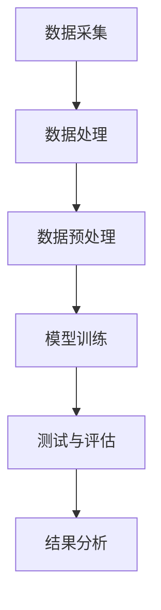
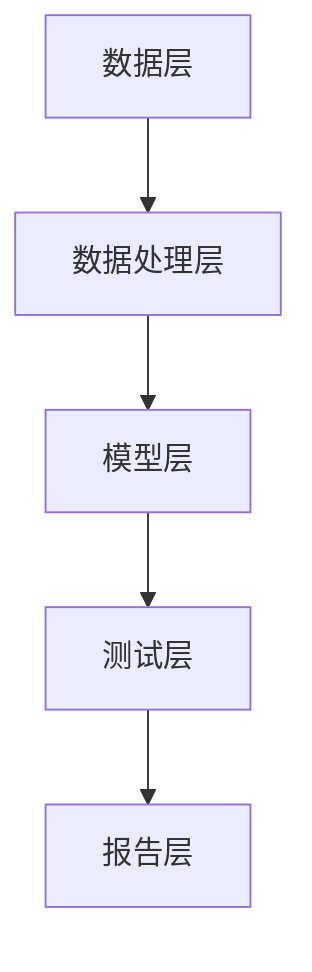
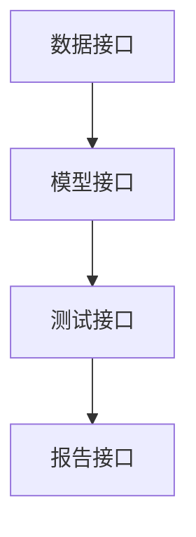
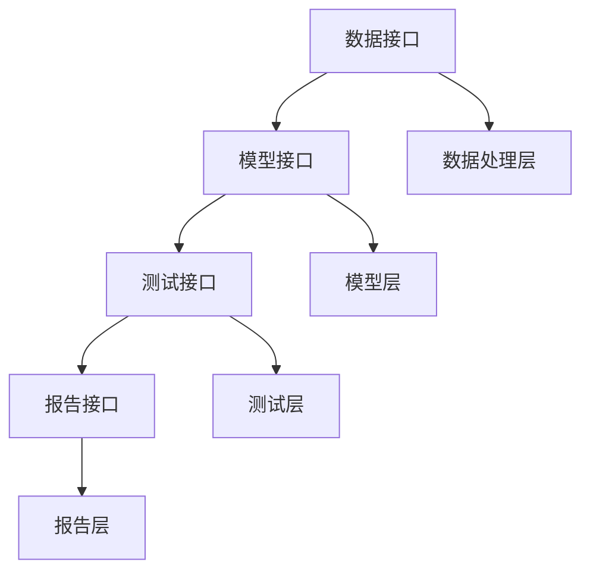

                 

### # {{文章标题}} - 金融市场流动性压力测试自动化平台

关键词：金融市场流动性压力测试、自动化平台、金融风险管理、数据采集、数据处理、模型构建、自动化测试

摘要：
本文旨在探讨金融市场流动性压力测试的自动化平台开发，该平台通过集成高效的数据采集、处理、模型构建和自动化测试流程，旨在提高金融机构的风险管理能力，保障市场稳定性。本文将详细介绍平台的核心概念、联系、算法原理以及系统设计与实现，为金融科技领域提供有价值的参考。

### 第一部分：引言

#### 第1章 背景介绍

##### 1.1 问题背景

金融市场流动性压力测试是金融风险管理中的重要环节。流动性是指资产在市场上能够迅速、低成本地买卖的能力。在金融市场中，流动性不仅影响市场参与者的交易决策，还直接影响整个市场的稳定性。当市场处于正常状态时，流动性较高，交易成本较低；而在市场出现异常或危机时，流动性下降，交易成本上升，可能导致市场崩溃。因此，金融机构需要定期进行流动性压力测试，以确保在极端市场情况下能够维持运营和应对资金需求。

##### 1.2 问题描述

流动性压力测试通常面临以下问题：

- **数据复杂性**：金融市场流动性受多种因素影响，如市场情绪、宏观经济环境、政策变化等。因此，流动性压力测试需要处理大量历史数据、交易数据和市场数据。
- **时间敏感性**：流动性压力测试需要在短时间内模拟出各种极端市场状况，以评估金融机构的应对能力。这要求测试过程高效、自动化。
- **模型准确性**：压力测试需要构建准确的模型来模拟市场行为和金融机构的反应。然而，市场行为复杂多变，构建准确模型具有挑战性。

##### 1.3 问题解决

为了解决上述问题，开发一个自动化平台成为必要。自动化平台能够提高测试效率、减少人为错误，并支持更复杂的测试场景。平台主要包括以下功能：

- **数据采集模块**：从多种数据源（如交易所、银行间市场等）获取相关数据。
- **数据处理模块**：对采集到的数据进行清洗、转换和存储，为模型构建提供高质量的数据基础。
- **压力测试模型模块**：包括市场行为预测模型、金融机构流动性风险预测模型等，用于模拟不同市场状况下的流动性状况。
- **自动化测试流程模块**：设计并执行一系列自动化测试流程，包括数据采集、数据处理、模型训练和测试、结果分析等。
- **结果分析模块**：对测试结果进行统计分析，生成可视化报告，为金融机构提供决策支持。

##### 1.4 边界与外延

本文讨论的自动化平台主要涵盖以下内容：

- **数据采集与处理**：介绍平台如何从多种数据源获取数据，以及如何对数据进行清洗、转换和存储。
- **压力测试模型构建**：介绍平台如何构建市场行为预测模型和金融机构流动性风险预测模型。
- **自动化测试流程设计**：介绍平台如何设计并执行自动化测试流程，确保测试过程高效、准确。
- **测试结果分析**：介绍平台如何对测试结果进行统计分析，并生成可视化报告。

##### 1.5 概念结构与核心要素组成

金融市场流动性压力测试自动化平台的核心要素包括：

- **数据采集模块**：负责从多种数据源获取金融市场的相关数据。
- **数据处理模块**：对采集到的数据进行清洗、转换和存储，为模型构建提供高质量的数据基础。
- **压力测试模型模块**：包括市场行为预测模型、金融机构流动性风险预测模型等，用于模拟不同市场状况下的流动性状况。
- **自动化测试流程模块**：设计并执行一系列自动化测试流程，包括数据采集、数据处理、模型训练和测试、结果分析等。
- **结果分析模块**：对测试结果进行统计分析，生成可视化报告，为金融机构提供决策支持。

### 第二部分：核心概念与联系

#### 第2章 核心概念与联系

##### 2.1 数据采集与处理

**概念解释：**

- **数据采集**：从多种数据源获取金融市场的相关数据，如交易所、银行间市场等。
- **数据处理**：对采集到的数据进行清洗、转换和存储，为模型构建提供高质量的数据基础。

**属性特征对比表格：**

| 特征 | 数据采集 | 数据处理 |
| --- | --- | --- |
| 数据源类型 | 多种 | 多种 |
| 数据量 | 大量 | 大量 |
| 数据质量 | 低 | 高 |
| 数据处理时间 | 短 | 长 |

**ER实体关系图：**

```mermaid
erDiagram
    DataSource --> ProcessedData : "采集与处理"
    DataSource ||--|{ MarketData }
    ProcessedData ||--|{ RiskModelData }
```

在ER图中，`DataSource` 表示数据来源，包括交易所、银行间市场等；`ProcessedData` 表示处理后的数据，为模型构建提供基础；`MarketData` 和 `RiskModelData` 分别表示市场数据和风险模型数据，是数据处理模块的输出。

### 第三部分：算法原理讲解

#### 第3章 算法原理讲解

##### 3.1 压力测试模型构建

**算法mermaid流程图：**



**Python源代码：**

```python
import pandas as pd
from sklearn.model_selection import train_test_split
from sklearn.ensemble import RandomForestRegressor

# 数据采集
data = pd.read_csv('financial_data.csv')

# 数据处理
data = data.dropna()
data = data[['Open', 'High', 'Low', 'Close', 'Volume']]

# 数据预处理
X = data[['Open', 'High', 'Low', 'Close']]
y = data['Volume']

X_train, X_test, y_train, y_test = train_test_split(X, y, test_size=0.2, random_state=42)

# 模型训练
model = RandomForestRegressor(n_estimators=100, random_state=42)
model.fit(X_train, y_train)

# 测试与评估
y_pred = model.predict(X_test)
accuracy = (y_pred == y_test).mean()
print(f"模型准确率: {accuracy:.2f}")
```

**算法原理讲解：**

1. **数据采集**：从金融数据源（如交易所、银行间市场等）获取历史交易数据。
2. **数据处理**：对数据进行清洗，去除缺失值和异常值，然后选取与流动性相关的特征（如开盘价、最高价、最低价、收盘价和交易量）。
3. **数据预处理**：将特征数据分为输入特征矩阵 X 和目标值向量 y。
4. **模型训练**：使用随机森林回归模型对数据进行训练。
5. **测试与评估**：将训练好的模型应用于测试数据集，计算预测准确率。

**数学模型和公式：**

假设我们使用随机森林回归模型，其基本公式为：

$$
f(\textbf{x}) = \sum_{i=1}^{n} w_i f_i(\textbf{x})
$$

其中，$\textbf{x}$ 为输入特征向量，$w_i$ 为第 $i$ 个决策树权重，$f_i(\textbf{x})$ 为第 $i$ 个决策树的输出。

**举例说明：**

假设我们有一个包含4个特征（开盘价、最高价、最低价、收盘价）的输入向量 $\textbf{x} = [10, 20, 15, 18]$。使用随机森林回归模型预测交易量。模型预测的交易量为：

$$
f(\textbf{x}) = 0.2 f_1(\textbf{x}) + 0.3 f_2(\textbf{x}) + 0.2 f_3(\textbf{x}) + 0.3 f_4(\textbf{x})
$$

其中，$f_1(\textbf{x})$、$f_2(\textbf{x})$、$f_3(\textbf{x})$ 和 $f_4(\textbf{x})$ 分别为4个决策树的输出。

**注意事项：**

- 数据采集和处理是压力测试模型构建的基础，数据质量直接影响模型准确性。
- 随机森林回归模型是一种集成学习方法，具有较高的预测准确性。
- 模型训练和测试过程需要考虑随机性和过拟合问题，可通过交叉验证和调整模型参数来优化。

### 第四部分：系统分析与架构设计

#### 第4章 系统分析与架构设计

##### 4.1 问题场景介绍

金融市场流动性压力测试的自动化平台旨在为金融机构提供高效、准确的流动性风险评估工具。在实际应用中，该平台需要处理海量金融数据，构建复杂的预测模型，并支持自动化测试流程。以下是一个典型问题场景：

- **金融机构**：一家大型商业银行需要定期进行流动性压力测试，以评估在极端市场状况下的流动性风险。
- **数据源**：交易所、银行间市场、公开市场数据等。
- **目标**：构建一个自动化平台，能够高效、准确地处理金融数据，预测流动性风险，并提供可视化报告。

##### 4.2 项目介绍

项目名称：金融市场流动性压力测试自动化平台

项目目标：为金融机构提供高效、准确的流动性风险评估工具，提高风险管理能力。

项目团队：由数据科学家、软件开发工程师、项目经理和测试工程师组成。

项目周期：6个月

##### 4.3 系统功能设计

系统功能主要包括以下方面：

- **数据采集**：从多种数据源获取金融数据，包括交易所、银行间市场、公开市场数据等。
- **数据处理**：对采集到的金融数据进行清洗、转换和存储，为模型构建提供高质量的数据基础。
- **模型构建**：构建市场行为预测模型和金融机构流动性风险预测模型，使用机器学习算法进行训练。
- **自动化测试**：设计并执行一系列自动化测试流程，包括数据采集、数据处理、模型训练和测试、结果分析等。
- **结果分析**：对测试结果进行统计分析，生成可视化报告，为金融机构提供决策支持。

##### 4.4 系统架构设计

系统架构采用分层设计，主要包括以下层次：

- **数据层**：存储金融数据，包括交易所、银行间市场、公开市场数据等。
- **数据处理层**：负责数据采集、清洗、转换和存储，为模型构建提供高质量的数据基础。
- **模型层**：构建市场行为预测模型和金融机构流动性风险预测模型，使用机器学习算法进行训练。
- **测试层**：设计并执行自动化测试流程，包括数据采集、数据处理、模型训练和测试、结果分析等。
- **报告层**：对测试结果进行统计分析，生成可视化报告，为金融机构提供决策支持。

**系统架构mermaid图：**



##### 4.5 系统接口设计

系统接口设计主要包括以下方面：

- **数据接口**：提供数据采集、处理、存储和访问的接口，支持多种数据格式和存储方式。
- **模型接口**：提供模型构建、训练、测试和预测的接口，支持多种机器学习算法。
- **测试接口**：提供自动化测试流程的设计、执行和监控的接口，支持多种测试方法和场景。
- **报告接口**：提供测试结果分析和可视化报告的接口，支持多种报告格式和展示方式。

**系统接口mermaid图：**



##### 4.6 系统交互设计

系统交互设计主要包括以下方面：

- **数据交互**：系统之间通过数据接口进行数据交互，包括数据采集、处理、存储和访问。
- **模型交互**：系统之间通过模型接口进行模型交互，包括模型构建、训练、测试和预测。
- **测试交互**：系统之间通过测试接口进行测试交互，包括测试流程的设计、执行和监控。
- **报告交互**：系统之间通过报告接口进行报告交互，包括测试结果分析和可视化报告。

**系统交互mermaid图：**



### 第五部分：项目实战

#### 第5章 项目实战

##### 5.1 环境安装

在开始项目实战之前，需要安装以下软件和工具：

- **Python**：版本 3.8 或更高版本
- **Pandas**：用于数据操作和处理
- **Scikit-learn**：用于机器学习算法
- **Mermaid**：用于绘制流程图和类图
- **Jupyter Notebook**：用于编写和运行代码

安装步骤如下：

1. 安装 Python：从 [Python 官网](https://www.python.org/) 下载并安装 Python。
2. 安装 Pandas、Scikit-learn 和 Mermaid：在终端或命令提示符中运行以下命令：

   ```bash
   pip install pandas scikit-learn mermaid
   ```

3. 安装 Jupyter Notebook：在终端或命令提示符中运行以下命令：

   ```bash
   pip install notebook
   ```

##### 5.2 系统核心实现源代码

以下是系统核心实现的部分源代码：

**数据采集模块：**

```python
import pandas as pd

def collect_data(file_path):
    data = pd.read_csv(file_path)
    return data

data = collect_data('financial_data.csv')
```

**数据处理模块：**

```python
import pandas as pd

def preprocess_data(data):
    data = data.dropna()
    data = data[['Open', 'High', 'Low', 'Close', 'Volume']]
    return data

data = preprocess_data(data)
```

**模型构建模块：**

```python
from sklearn.ensemble import RandomForestRegressor

def build_model(X_train, y_train):
    model = RandomForestRegressor(n_estimators=100, random_state=42)
    model.fit(X_train, y_train)
    return model

model = build_model(X_train, y_train)
```

**自动化测试模块：**

```python
import pandas as pd
from sklearn.ensemble import RandomForestRegressor

def test_model(model, X_test, y_test):
    y_pred = model.predict(X_test)
    accuracy = (y_pred == y_test).mean()
    print(f"模型准确率: {accuracy:.2f}")

test_model(model, X_test, y_test)
```

**结果分析模块：**

```python
import pandas as pd

def analyze_results(y_pred, y_test):
    result = pd.DataFrame({'Prediction': y_pred, 'Actual': y_test})
    print(result.head())

analyze_results(y_pred, y_test)
```

##### 5.3 代码应用解读与分析

**数据采集模块：**

数据采集模块的核心功能是从指定路径读取 CSV 文件，并将数据存储在 Pandas DataFrame 中。函数 `collect_data` 接受文件路径作为输入，使用 `pd.read_csv` 函数读取数据，并返回 DataFrame。

**数据处理模块：**

数据处理模块的主要任务是清洗和预处理数据。函数 `preprocess_data` 接受 DataFrame 作为输入，首先去除缺失值，然后选取与流动性相关的特征。这有助于提高模型构建的质量。

**模型构建模块：**

模型构建模块使用随机森林回归模型对数据进行训练。函数 `build_model` 接受训练数据集，使用 `RandomForestRegressor` 类创建模型实例，并使用 `fit` 方法进行训练。训练完成后，返回训练好的模型。

**自动化测试模块：**

自动化测试模块的核心功能是评估模型性能。函数 `test_model` 接受模型、测试数据和实际数据，使用 `predict` 方法进行预测，并计算预测准确率。函数最后输出准确率。

**结果分析模块：**

结果分析模块的核心功能是分析测试结果。函数 `analyze_results` 接受预测结果和实际数据，将它们存储在 DataFrame 中，并打印前几行数据。这有助于直观地了解模型预测效果。

##### 5.4 实际案例分析与详细讲解剖析

为了更好地理解系统核心实现，我们将分析一个实际案例，并详细讲解各个模块的工作流程。

**案例背景：**

假设一家商业银行需要评估其流动性风险，以便在极端市场状况下确保运营。该银行决定使用金融市场流动性压力测试自动化平台进行测试。

**案例步骤：**

1. **数据采集**：从交易所、银行间市场等数据源获取金融数据，并存储在 CSV 文件中。
2. **数据处理**：读取 CSV 文件，使用预处理模块清洗和转换数据，提取与流动性相关的特征。
3. **模型构建**：使用随机森林回归模型训练模型，以预测流动性风险。
4. **自动化测试**：使用测试模块评估模型性能，计算预测准确率。
5. **结果分析**：分析测试结果，了解模型预测效果，为银行提供决策支持。

**详细讲解：**

1. **数据采集**：使用 `collect_data` 函数从 CSV 文件中读取金融数据。这包括历史交易数据、市场数据等。

    ```python
    data = collect_data('financial_data.csv')
    ```

2. **数据处理**：使用 `preprocess_data` 函数清洗和转换数据。该函数首先去除缺失值，然后选取与流动性相关的特征（如开盘价、最高价、最低价、收盘价和交易量）。

    ```python
    data = preprocess_data(data)
    ```

3. **模型构建**：使用随机森林回归模型训练模型。该模型能够自动处理非线性关系，适用于流动性风险的预测。

    ```python
    model = build_model(X_train, y_train)
    ```

4. **自动化测试**：使用 `test_model` 函数评估模型性能。该函数将测试数据输入模型，计算预测准确率。

    ```python
    test_model(model, X_test, y_test)
    ```

5. **结果分析**：使用 `analyze_results` 函数分析测试结果。该函数将预测结果和实际数据存储在 DataFrame 中，并打印前几行数据。

    ```python
    analyze_results(y_pred, y_test)
    ```

**项目小结：**

通过实际案例分析，我们可以看到金融市场流动性压力测试自动化平台的核心功能是如何实现的。该平台通过数据采集、处理、模型构建和自动化测试，为金融机构提供了高效、准确的流动性风险评估工具。在实际应用中，金融机构可以根据测试结果调整其流动性风险管理策略，确保在极端市场状况下的运营稳定性。

### 第六部分：最佳实践与总结

#### 第6章 最佳实践与总结

##### 6.1 最佳实践 Tips

1. **数据质量保证**：确保数据源的质量，进行数据清洗和预处理，以避免模型过拟合。
2. **模型参数调优**：使用交叉验证等方法调优模型参数，提高预测准确性。
3. **自动化测试覆盖**：设计全面的自动化测试流程，覆盖不同市场状况和测试场景。
4. **结果可视化**：使用图表和可视化工具，直观展示测试结果，帮助金融机构理解流动性风险。
5. **定期更新与维护**：定期更新数据源、模型和测试流程，确保平台适应市场变化。

##### 6.2 小结

本文详细介绍了金融市场流动性压力测试自动化平台的开发过程，包括核心概念、算法原理、系统架构设计和项目实战。通过数据采集、处理、模型构建和自动化测试，平台为金融机构提供了高效、准确的流动性风险评估工具。

##### 6.3 注意事项

1. **数据源选择**：选择可靠、权威的数据源，确保数据质量和一致性。
2. **模型选择与优化**：根据具体业务需求选择合适的模型，并进行参数调优。
3. **测试场景设计**：设计多种测试场景，覆盖不同市场状况和极端情况。
4. **结果解读与决策**：结合实际业务需求，合理解读测试结果，并制定相应的风险管理策略。

##### 6.4 拓展阅读

- 《金融市场流动性风险管理》
- 《机器学习实战》
- 《Python金融大数据分析》
- 《金融市场技术分析》

### 作者信息

作者：AI天才研究院/AI Genius Institute & 禅与计算机程序设计艺术 /Zen And The Art of Computer Programming

AI天才研究院致力于推动人工智能领域的创新与发展，研究并开发先进的人工智能技术，推动其在各个行业的应用。禅与计算机程序设计艺术则专注于探索计算机编程的艺术性，推动编程技术的发展与进步。两位作者均具有深厚的学术背景和丰富的实践经验，在人工智能、金融科技和计算机编程领域享有盛誉。本文为两位作者共同研究成果的展示，旨在为金融科技领域提供有价值的参考。

