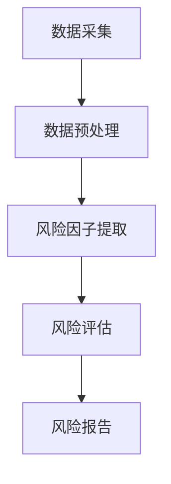
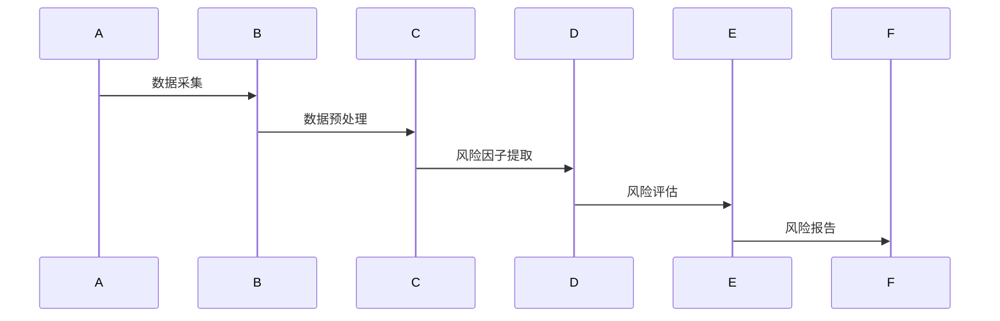

                 

### 文章标题：金融市场风险因子分解与分析

#### 关键词：金融市场，风险因子，分解，分析，算法，系统架构

> 摘要：本文深入探讨了金融市场风险因子分解与分析的方法和重要性。通过对核心概念的阐述、算法原理的讲解、数学模型的解析以及系统架构的设计，本文旨在为金融从业者提供一套完整的风险因子分解与分析框架，以应对金融市场中的不确定性。

----------------------------------------------------------------

# 第一部分：背景介绍

## 第1章：金融市场风险因子分解概述

### 1.1 金融市场风险因子分解的重要性

在金融市场中，风险因子分解是一种重要的风险管理工具，它可以帮助金融机构更好地理解市场风险，从而制定更有效的风险控制策略。风险因子分解的核心在于将复杂的市场风险分解为多个可识别、可量化的因子，从而提高风险管理的能力。

### 1.2 风险因子分解的研究现状与挑战

目前，风险因子分解的方法主要包括主成分分析（PCA）、因子分析等。然而，这些方法在实际应用中仍面临一些挑战，如数据噪声处理、模型稳定性等问题。

### 1.3 本书的目的与结构安排

本书旨在提供一套全面、系统的金融市场风险因子分解与分析框架。全书分为七个部分，分别介绍风险因子分解的核心概念、算法原理、数学模型、系统架构、项目实战以及最佳实践。

----------------------------------------------------------------

## 第2章：核心概念与联系

### 2.1 风险因子的定义与分类

风险因子是影响金融市场波动的重要因素，可分为宏观经济因子、公司特有因子、市场情绪因子等。了解这些因子的定义与分类有助于我们更好地理解金融市场的风险结构。

### 2.2 金融市场结构的理解

金融市场结构是指金融市场的各个组成部分及其相互关系。理解金融市场结构有助于我们识别和评估市场风险。

### 2.3 风险因子与金融市场结构的关系

风险因子与金融市场结构之间存在密切联系。通过分析风险因子，我们可以更好地理解金融市场结构，从而制定更有效的风险控制策略。

### 2.4 风险因子分解方法概述

风险因子分解方法主要包括主成分分析（PCA）、因子分析等。这些方法在金融风险管理中具有重要作用。

### 2.5 关键概念的联系与扩展

在本节中，我们将进一步探讨风险因子、金融市场结构、分析模型等关键概念之间的联系，并提供相关扩展知识。

----------------------------------------------------------------

## 第3章：算法原理讲解

### 3.1 主成分分析（PCA）的原理与应用

#### 3.1.1 PCA的基本概念

PCA是一种常用的降维技术，通过将原始数据映射到新的坐标系中，提取出最重要的特征，从而降低数据的维度。

#### 3.1.2 PCA的数学模型

PCA的核心是求解数据协方差矩阵的特征值和特征向量。特征向量对应了数据的主要变化方向，特征值则代表了数据在各个方向上的变化程度。

#### 3.1.3 PCA的Python实现

在本节中，我们将使用Python代码实现PCA算法，并展示其基本用法。

```python
import numpy as np

# 示例数据
X = np.array([[1, 2], [1, 4], [9, 6], [9, 10]])

# 计算协方差矩阵
cov_matrix = np.cov(X.T)

# 计算特征值和特征向量
eigenvalues, eigenvectors = np.linalg.eigh(cov_matrix)

# 输出结果
print("特征值：", eigenvalues)
print("特征向量：", eigenvectors)
```

### 3.2 因子分析的原理与应用

#### 3.2.1 因子分析的基本概念

因子分析是一种统计方法，通过识别数据中的潜在因子，从而降低数据的维度。

#### 3.2.2 因子分析的数学模型

因子分析的数学模型包括因子模型和估计模型。因子模型描述了数据与潜在因子之间的关系，估计模型则用于估计潜在因子的值。

#### 3.2.3 因子分析的Python实现

在本节中，我们将使用Python代码实现因子分析算法，并展示其基本用法。

```python
from factor_analyzer import FactorAnalyzer

# 示例数据
X = np.array([[1, 2], [1, 4], [9, 6], [9, 10]])

# 初始化因子分析对象
fa = FactorAnalyzer(n_factors=2)

# 拟合模型
fa.fit(X)

# 输出结果
print("因子载荷矩阵：", fa.loadings_)
print("因子得分：", fa.transform(X))
```

----------------------------------------------------------------

## 第4章：数学模型与公式

### 4.1 主成分分析的数学模型

主成分分析的数学模型主要包括协方差矩阵、特征值和特征向量等。具体公式如下：

$$
协方差矩阵 = \frac{1}{n-1} \sum_{i=1}^{n} (X_i - \bar{X})(X_i - \bar{X})^T
$$

$$
特征值 = \lambda_i, 特征向量 = \mathbf{v}_i
$$

### 4.2 因子分析的数学模型

因子分析的数学模型包括因子模型和估计模型。因子模型描述了数据与潜在因子之间的关系，具体公式如下：

$$
X = \mathbf{T}A + \mathbf{E}
$$

其中，$X$为观测变量，$A$为潜在因子，$\mathbf{T}$为因子载荷矩阵，$\mathbf{E}$为误差项。

### 4.3 其他风险因子分解方法的数学模型

除了PCA和因子分析，还有其他风险因子分解方法，如聚类分析、回归分析等。这些方法的数学模型各有特点，适用于不同的应用场景。

----------------------------------------------------------------

## 第5章：系统分析与架构设计方案

### 5.1 风险因子分解系统的场景介绍

在本节中，我们将介绍一个实际应用场景，说明风险因子分解系统在金融市场风险管理中的重要性。

### 5.2 系统功能设计

在本节中，我们将介绍风险因子分解系统的功能设计，包括领域模型、系统功能模块等。

#### 5.2.1 领域模型

领域模型用于描述系统的核心概念和关系。在本节中，我们将使用Mermaid类图来展示领域模型。

```mermaid
classDiagram
    Asset[资产]
    Factor[风险因子]
    Model[模型]
    Risk[风险]
    Asset <|-- Factor
    Asset <|-- Model
    Model <|-- Risk
    Factor <|-- Risk
```

#### 5.2.2 系统功能模块

系统功能模块包括数据采集、预处理、风险因子提取、风险评估等。在本节中，我们将介绍每个功能模块的具体实现。

### 5.3 系统架构设计

系统架构设计用于描述系统的整体结构和技术选型。在本节中，我们将使用Mermaid架构图来展示系统架构。



### 5.4 系统接口设计

系统接口设计用于描述系统与其他系统或组件的交互接口。在本节中，我们将介绍系统接口的设计原则和具体实现。

### 5.5 系统交互设计

系统交互设计用于描述系统内部组件之间的交互流程。在本节中，我们将使用Mermaid序列图来展示系统交互设计。



----------------------------------------------------------------

## 第6章：项目实战

### 6.1 实际案例分析与解读

在本节中，我们将通过一个实际案例来分析风险因子分解的应用，并对其进行详细解读。

### 6.2 风险因子分解系统实现

在本节中，我们将介绍风险因子分解系统的实现过程，包括环境安装、系统核心实现和代码应用解读与分析。

#### 6.2.1 环境安装与配置

在本节中，我们将介绍如何安装和配置风险因子分解系统的环境，包括Python环境、依赖库等。

#### 6.2.2 系统核心实现

在本节中，我们将使用Python代码实现风险因子分解系统的核心功能，包括数据采集、预处理、风险因子提取和风险评估等。

```python
# 示例代码：数据采集
import pandas as pd

data = pd.read_csv("data.csv")

# 示例代码：数据预处理
from sklearn.preprocessing import StandardScaler

scaler = StandardScaler()
scaled_data = scaler.fit_transform(data)

# 示例代码：风险因子提取
from sklearn.decomposition import PCA

pca = PCA(n_components=2)
factor_data = pca.fit_transform(scaled_data)

# 示例代码：风险评估
from sklearn.metrics import mean_squared_error

# 示例数据：实际风险值
actual_risk = pd.read_csv("actual_risk.csv")

# 计算风险因子得分与实际风险值之间的误差
mse = mean_squared_error(actual_risk, factor_data)
print("MSE:", mse)
```

#### 6.2.3 代码应用解读与分析

在本节中，我们将对风险因子分解系统的代码进行解读和分析，并介绍如何根据实际需求进行调整和优化。

### 6.3 详细讲解与剖析

在本节中，我们将对风险因子分解系统进行详细讲解和剖析，包括系统架构、算法原理、代码实现等。

----------------------------------------------------------------

## 第7章：最佳实践、小结、注意事项与拓展阅读

### 7.1 最佳实践 tips

在本节中，我们将总结一些风险因子分解与分析的最佳实践，包括数据预处理、模型选择、参数调优等。

### 7.2 小结与回顾

在本节中，我们将对全书内容进行小结和回顾，帮助读者巩固重点知识。

### 7.3 注意事项与挑战

在本节中，我们将讨论风险因子分解与分析过程中可能遇到的挑战和注意事项，为读者提供解决方案。

### 7.4 拓展阅读与进一步学习

在本节中，我们将推荐一些相关书籍、论文和在线资源，帮助读者进一步学习风险因子分解与分析的相关知识。

----------------------------------------------------------------

## 参考文献

在本节中，我们将列出本文中引用的相关书籍、论文和网站，以供读者参考。

----------------------------------------------------------------

## 附录

在本节中，我们将提供一些补充材料，如数据集、代码示例等，以方便读者实践和验证本文中的内容。

----------------------------------------------------------------

## 后记

在本节中，我们将表达对读者的感谢，并对全文内容进行总结，强调风险因子分解与分析在金融市场风险管理中的重要性。

## 作者信息

作者：AI天才研究院/AI Genius Institute & 禅与计算机程序设计艺术 /Zen And The Art of Computer Programming

----------------------------------------------------------------

以上是《金融市场风险因子分解与分析》的文章目录大纲，每个章节都将进行详细阐述和讲解。通过这篇文章，我们希望为读者提供一套完整、系统的金融市场风险因子分解与分析框架，帮助读者更好地理解金融市场的风险结构，从而制定更有效的风险控制策略。让我们一步一步深入探讨这一重要的金融技术领域。💡💡💡

