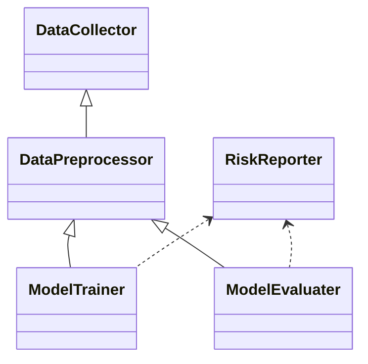

                 


### 文章标题：金融市场风险因子暴露分析

> 关键词：金融市场，风险因子，暴露分析，统计模型，机器学习模型

> 摘要：本文深入探讨了金融市场风险因子暴露分析的核心概念、方法与实现，通过详细阐述风险因子的定义与分类、暴露度与风险敞口的度量方法，结合统计模型与机器学习模型的原理与应用，最终给出了一个实际项目中的系统分析与架构设计方案，为金融风险管理提供了有益的参考。

### 目录大纲

----------------------------------------------------------------

## 第一部分: 问题背景与核心概念介绍

## 第1章: 金融市场风险因子暴露分析概述

### 1.1.1 问题背景
- 金融市场风险因子的概念与重要性
- 风险因子的分类与特征
- 风险因子暴露分析的意义与目的

### 1.1.2 问题描述
- 风险因子暴露分析的核心挑战
- 数据来源与数据质量的影响
- 不同市场环境下风险因子暴露分析的特殊性

### 1.1.3 问题解决方法
- 风险因子暴露分析的主要方法
- 统计模型与机器学习模型的应用
- 风险因子权重分配与优化策略

### 1.1.4 边界与外延
- 风险因子暴露分析在不同金融领域的应用
- 不同资产类型下的风险因子特征

### 1.1.5 概念结构与核心要素组成
- 风险因子、暴露度、风险敞口等核心概念
- 风险因子暴露分析的基本流程

## 第2章: 核心概念与联系

### 2.1.1 风险因子的定义与分类
- 风险因子的定义
- 风险因子的分类方法
- 风险因子属性特征对比表格

### 2.1.2 暴露度的定义与计算方法
- 暴露度的定义
- 暴露度的计算方法
- 暴露度的影响因素分析

### 2.1.3 风险敞口的概念与度量
- 风险敞口的定义
- 风险敞口的度量方法
- 风险敞口管理的重要性

### 2.1.4 风险因子、暴露度与风险敞口的关系
- 三者之间的关系与相互影响
- ER实体关系图架构

## 第二部分: 算法原理讲解

## 第3章: 算法原理讲解

### 3.1.1 统计模型原理

#### 3.1.1.1 线性回归模型
- 线性回归模型的原理
- 线性回归模型的数学模型和公式
- 线性回归模型的Python实现示例

#### 3.1.1.2 多元回归模型
- 多元回归模型的原理
- 多元回归模型的数学模型和公式
- 多元回归模型的Python实现示例

### 3.1.2 机器学习模型原理

#### 3.1.2.1 支持向量机（SVM）
- SVM的原理
- SVM的数学模型和公式
- SVM的Python实现示例

#### 3.1.2.2 随机森林（Random Forest）
- 随机森林的原理
- 随机森林的数学模型和公式
- 随机森林的Python实现示例

#### 3.1.2.3 决策树模型
- 决策树的原理
- 决策树的数学模型和公式
- 决策树的Python实现示例

## 第4章: 数学模型和数学公式 & 详细讲解 & 举例说明

### 4.1.1 风险因子暴露度计算

$$
E(X) = \sum_{i=1}^{n} w_i X_i
$$

- 公式解释
- 适用条件
- 实例分析

### 4.1.2 风险敞口度量

$$
V = \sigma^2 + \mu^2
$$

- 公式解释
- 适用条件
- 实例分析

## 第三部分: 系统分析与架构设计方案

## 第5章: 系统分析与架构设计方案

### 5.1.1 问题场景介绍

- 风险因子暴露分析在金融风险管理中的应用场景

### 5.1.2 项目介绍

- 项目背景
- 项目目标

### 5.1.3 系统功能设计

#### 5.1.3.1 领域模型设计

- 数据收集模块
- 数据预处理模块
- 模型训练模块
- 模型评估模块

#### 5.1.3.2 mermaid类图

- 类图描述

### 5.1.4 系统架构设计

#### 5.1.4.1 系统架构图

- 系统架构图描述

### 5.1.5 系统接口设计

- 系统接口定义
- 接口协议

### 5.1.6 系统交互

#### 5.1.6.1 mermaid序列图

- 序列图描述

## 第6章: 项目实战

### 6.1.1 环境安装

- 环境搭建步骤
- 环境配置说明

### 6.1.2 系统核心实现源代码

- 数据收集模块实现
- 数据预处理模块实现
- 模型训练模块实现
- 模型评估模块实现

### 6.1.3 代码应用解读与分析

- 代码解读
- 实际案例分析与详细讲解

### 6.1.4 项目小结

- 项目总结
- 最佳实践 tips
- 注意事项
- 拓展阅读

----------------------------------------------------------------

### 第1章: 金融市场风险因子暴露分析概述

#### 1.1.1 问题背景

金融市场是全球经济的重要组成部分，其稳定与否直接关系到全球经济的健康运行。金融市场中的风险因子是影响市场波动和投资者收益的关键因素。风险因子指的是可能导致金融市场波动的各种因素，包括宏观经济指标、政策变动、市场供求关系等。对风险因子进行暴露分析，可以帮助金融机构和管理部门更好地理解市场风险，制定有效的风险管理策略。

首先，我们需要理解什么是风险因子。风险因子是金融市场中的变量，其变化可能导致市场价格的波动。这些因子可以是宏观经济的变量，如利率、通货膨胀率、GDP增长率等；也可以是市场层面的变量，如交易量、市场情绪等；还可以是微观经济层面的变量，如公司财务指标、行业特征等。

#### 1.1.2 问题描述

风险因子暴露分析的核心挑战在于如何准确、全面地捕捉风险因子对市场的影响。首先，数据来源和质量对风险因子暴露分析有着至关重要的影响。数据源可以是历史交易数据、宏观经济数据、行业数据等。数据质量直接影响分析结果的准确性，因此需要确保数据来源的可靠性和完整性。

其次，不同市场环境下风险因子暴露分析的特殊性也需要考虑。例如，在牛市中，某些风险因子的影响可能较为显著，而在熊市中，则可能有所不同。此外，不同资产类型下的风险因子特征也有所不同，如股票市场、债券市场、外汇市场和衍生品市场等，各自都有其独特的风险因子。

#### 1.1.3 问题解决方法

为了解决风险因子暴露分析的核心挑战，我们可以采用多种方法：

1. **统计模型**：如线性回归模型、多元回归模型等，通过历史数据进行建模，分析风险因子与市场波动之间的关系。
2. **机器学习模型**：如支持向量机（SVM）、随机森林（Random Forest）、决策树等，通过训练模型，从大量数据中自动提取特征，预测市场风险。
3. **风险因子权重分配与优化策略**：通过对不同风险因子的权重进行优化分配，提高风险因子暴露分析的准确性和可靠性。

#### 1.1.4 边界与外延

风险因子暴露分析不仅适用于股票市场，还适用于债券市场、外汇市场和衍生品市场等多种金融市场。不同资产类型下的风险因子特征有所不同，如股票市场更关注公司财务指标，债券市场更关注利率变化，外汇市场更关注汇率变动等。

#### 1.1.5 概念结构与核心要素组成

风险因子暴露分析涉及几个核心概念，包括风险因子、暴露度和风险敞口。风险因子是引起市场波动的因素，暴露度衡量投资者或资产对某一风险因子的敏感程度，风险敞口则是指投资者或资产面临的潜在风险。

风险因子暴露分析的基本流程包括数据收集、数据预处理、模型建立、模型训练和模型评估等步骤。通过这些步骤，我们可以系统性地分析金融市场风险，为投资决策提供有力支持。

### 结论

通过本章的介绍，我们了解了金融市场风险因子暴露分析的重要性和核心概念。接下来，我们将进一步深入探讨风险因子的定义与分类、暴露度和风险敞口的计算方法，以及统计模型和机器学习模型的应用原理。让我们一步步地深入探讨，以期在金融风险管理中找到更有效的解决方案。### 第2章: 核心概念与联系

在深入探讨金融市场风险因子暴露分析之前，我们需要明确几个核心概念：风险因子、暴露度和风险敞口。这些概念是风险因子暴露分析的基础，理解它们之间的联系对于构建有效的分析模型至关重要。

#### 2.1.1 风险因子的定义与分类

**风险因子**是影响金融市场波动的变量，可以是宏观经济指标、政策变动、市场供求关系等。风险因子通常分为以下几类：

1. **宏观经济因子**：如GDP增长率、利率、通货膨胀率等，这些因子反映了经济的基本状况。
2. **市场因子**：如交易量、市场情绪等，这些因子反映了市场的流动性和投资者心理。
3. **微观经济因子**：如公司财务指标、行业特征等，这些因子反映了特定公司或行业的健康状况。

在风险因子分类时，我们通常会创建一个对比表格，以便于理解不同因子的特征和影响。以下是一个简单的对比表格示例：

| 类别         | 因子名称     | 特征描述                                                  | 影响市场波动的方式 |
| ------------ | ------------ | -------------------------------------------------------- | ----------------- |
| 宏观经济因子 | 利率         | 货币政策的重要工具，影响借贷成本和投资回报                 | 上升时，降低投资者风险偏好 |
| 市场因子     | 交易量       | 反映市场活跃程度，大量交易可能意味着市场波动增大         | 交易量增加时，市场波动性增大 |
| 微观经济因子 | 公司盈利     | 公司业绩直接影响股价，良好的盈利表现可能推动股价上涨     | 盈利增长时，股价上涨 |

#### 2.1.2 暴露度的定义与计算方法

**暴露度**是指投资者或资产对某一风险因子的敏感程度。暴露度可以通过以下公式计算：

$$
\text{暴露度} = \frac{\text{风险因子变化引起的收益变化}}{\text{风险因子变化量}}
$$

例如，假设一个投资者的资产组合在利率上升时，价值下降了2%，而利率上升了1个百分点。那么，该资产组合对利率的暴露度为：

$$
\text{暴露度} = \frac{-2\%}{1\%} = -2
$$

这个值表明，对于每个百分点的利率上升，投资者的资产价值下降了2%。

#### 2.1.3 风险敞口的概念与度量

**风险敞口**是指投资者或资产面临的市场风险。风险敞口可以通过多种方法进行度量，如历史模拟法、方差-协方差法和蒙特卡罗模拟法等。以下是一个简单的风险敞口度量方法：

$$
V = \sigma^2 + \mu^2
$$

其中，\( V \) 是风险敞口，\( \sigma \) 是资产收益的波动性，\( \mu \) 是资产收益的期望。这个公式表示，资产的风险敞口是其收益的波动性（风险）和期望（预期收益）的平方和。

#### 2.1.4 风险因子、暴露度与风险敞口的关系

**风险因子、暴露度与风险敞口**之间有着密切的联系。风险因子是导致市场波动的原因，暴露度衡量投资者或资产对风险因子的敏感程度，而风险敞口则量化了投资者或资产面临的市场风险。

三者的关系可以用以下ER实体关系图表示：

```mermaid
erDiagram
  风险因子 ||--|{ 暴露度 }
  暴露度 ||--|{ 风险敞口 }
```

在这个ER实体关系图中，风险因子是根实体，暴露度和风险敞口是其子实体。风险因子通过暴露度影响风险敞口，暴露度反映了风险因子对投资者的敏感程度，而风险敞口则量化了这种敏感程度所带来的市场风险。

### 结论

通过本章的介绍，我们明确了风险因子、暴露度和风险敞口这三个核心概念，并了解了它们之间的联系。在接下来的章节中，我们将深入探讨统计模型和机器学习模型在风险因子暴露分析中的应用，以及如何通过这些模型来提高分析结果的准确性和可靠性。### 第3章: 算法原理讲解

在金融市场风险因子暴露分析中，算法的应用至关重要。本章将详细介绍统计模型和机器学习模型的基本原理，包括线性回归模型、多元回归模型、支持向量机（SVM）、随机森林（Random Forest）和决策树模型。通过这些模型，我们可以更好地理解和预测市场风险。

#### 3.1.1 统计模型原理

**统计模型**是基于历史数据和统计分析的方法，主要用于预测和分析变量之间的关系。以下将介绍两种常见的统计模型：线性回归模型和多元回归模型。

##### 3.1.1.1 线性回归模型

线性回归模型是最简单的统计模型之一，用于分析一个自变量和一个因变量之间的线性关系。其数学模型可以表示为：

$$
y = \beta_0 + \beta_1x + \epsilon
$$

其中，\( y \) 是因变量，\( x \) 是自变量，\( \beta_0 \) 和 \( \beta_1 \) 是模型的参数，\( \epsilon \) 是误差项。

线性回归模型的Python实现示例：

```python
import numpy as np
from sklearn.linear_model import LinearRegression

# 假设我们有一组数据
X = np.array([[1], [2], [3], [4], [5]])
y = np.array([1, 2, 2.5, 4, 5])

# 创建线性回归模型
model = LinearRegression()

# 拟合模型
model.fit(X, y)

# 预测结果
predictions = model.predict(X)

print(predictions)
```

##### 3.1.1.2 多元回归模型

多元回归模型是线性回归模型的扩展，用于分析多个自变量和一个因变量之间的线性关系。其数学模型可以表示为：

$$
y = \beta_0 + \beta_1x_1 + \beta_2x_2 + \ldots + \beta_nx_n + \epsilon
$$

多元回归模型的Python实现示例：

```python
import numpy as np
from sklearn.linear_model import LinearRegression

# 假设我们有一组数据
X = np.array([[1, 2], [2, 3], [3, 4], [4, 5], [5, 6]])
y = np.array([1, 2, 2.5, 4, 5])

# 创建多元回归模型
model = LinearRegression()

# 拟合模型
model.fit(X, y)

# 预测结果
predictions = model.predict(X)

print(predictions)
```

#### 3.1.2 机器学习模型原理

**机器学习模型**是基于数据学习和预测的方法，通过从大量数据中自动提取特征，建立预测模型。以下将介绍三种常见的机器学习模型：支持向量机（SVM）、随机森林（Random Forest）和决策树模型。

##### 3.1.2.1 支持向量机（SVM）

支持向量机是一种强大的分类和回归模型，其核心思想是找到一个最优的超平面，将不同类别的数据分开。其数学模型可以表示为：

$$
\max_{\beta, \beta_0} W^T W s.t. y_i (\beta^T x_i + \beta_0) \geq 1, \forall i
$$

其中，\( W \) 是权重向量，\( \beta_0 \) 是偏置项，\( y_i \) 是样本标签，\( x_i \) 是样本特征。

SVM的Python实现示例：

```python
import numpy as np
from sklearn.svm import SVC

# 假设我们有一组数据
X = np.array([[1, 2], [2, 3], [3, 4], [4, 5], [5, 6]])
y = np.array([0, 0, 1, 1, 1])

# 创建SVM模型
model = SVC()

# 拟合模型
model.fit(X, y)

# 预测结果
predictions = model.predict(X)

print(predictions)
```

##### 3.1.2.2 随机森林（Random Forest）

随机森林是一种基于决策树的集成学习方法，通过构建多棵决策树，并对它们的预测结果进行投票，得到最终的预测结果。其数学模型可以表示为：

$$
\hat{y} = \frac{1}{N} \sum_{i=1}^{N} t_i(y)
$$

其中，\( \hat{y} \) 是最终预测结果，\( N \) 是决策树的数量，\( t_i(y) \) 是第 \( i \) 棵决策树的预测结果。

随机森林的Python实现示例：

```python
import numpy as np
from sklearn.ensemble import RandomForestClassifier

# 假设我们有一组数据
X = np.array([[1, 2], [2, 3], [3, 4], [4, 5], [5, 6]])
y = np.array([0, 0, 1, 1, 1])

# 创建随机森林模型
model = RandomForestClassifier()

# 拟合模型
model.fit(X, y)

# 预测结果
predictions = model.predict(X)

print(predictions)
```

##### 3.1.2.3 决策树模型

决策树模型是一种简单而有效的分类和回归模型，通过一系列的判断条件，将数据划分为不同的类别或数值。其数学模型可以表示为：

$$
T(x) = c_j
$$

其中，\( T(x) \) 是决策树对于输入 \( x \) 的预测结果，\( c_j \) 是最终分类或回归的类别。

决策树的Python实现示例：

```python
import numpy as np
from sklearn.tree import DecisionTreeClassifier

# 假设我们有一组数据
X = np.array([[1, 2], [2, 3], [3, 4], [4, 5], [5, 6]])
y = np.array([0, 0, 1, 1, 1])

# 创建决策树模型
model = DecisionTreeClassifier()

# 拟合模型
model.fit(X, y)

# 预测结果
predictions = model.predict(X)

print(predictions)
```

### 结论

通过本章的介绍，我们了解了统计模型和机器学习模型的基本原理，以及它们在金融市场风险因子暴露分析中的应用。在下一章中，我们将进一步探讨风险因子暴露度计算的数学模型和公式，并通过实例进行分析。### 第4章: 数学模型和数学公式 & 详细讲解 & 举例说明

在金融市场风险因子暴露分析中，数学模型和公式是理解和计算风险因子暴露度的核心工具。本章将详细介绍两个关键公式：风险因子暴露度计算公式和风险敞口度量公式，并通过具体实例进行说明。

#### 4.1.1 风险因子暴露度计算

风险因子暴露度是衡量投资者或资产对某一风险因子的敏感程度的指标。其计算公式如下：

$$
E(X) = \sum_{i=1}^{n} w_i X_i
$$

其中，\( E(X) \) 是暴露度，\( w_i \) 是第 \( i \) 个风险因子的权重，\( X_i \) 是第 \( i \) 个风险因子的变化量。

**公式解释**：
- \( w_i \)：权重反映了风险因子的相对重要性，通常通过历史数据分析和专家经验确定。
- \( X_i \)：变化量表示风险因子相对于某一基准点的变化。

**适用条件**：
- 该公式适用于任何需要衡量风险因子敏感度的金融资产或投资组合。

**实例分析**：

假设一个投资者持有的资产组合包括股票A、B和C，对应的风险因子分别为利率、通货膨胀率和市场情绪。以下是一个简单的实例：

- 利率变化量 \( X_1 = 0.5\% \)
- 通货膨胀率变化量 \( X_2 = 1.0\% \)
- 市场情绪变化量 \( X_3 = 0.25\% \)

- 权重分别为：利率 \( w_1 = 0.3 \)，通货膨胀率 \( w_2 = 0.4 \)，市场情绪 \( w_3 = 0.3 \)

根据公式，可以计算出该资产组合的风险因子暴露度：

$$
E(X) = 0.3 \times 0.5\% + 0.4 \times 1.0\% + 0.3 \times 0.25\%
$$
$$
E(X) = 0.15\% + 0.40\% + 0.075\%
$$
$$
E(X) = 0.625\%
$$

这意味着，对于每个百分点的风险因子变化，该资产组合的价值将变化0.625%。

#### 4.1.2 风险敞口度量

风险敞口是衡量投资者或资产面临的市场风险程度的指标。其计算公式如下：

$$
V = \sigma^2 + \mu^2
$$

其中，\( V \) 是风险敞口，\( \sigma \) 是资产收益的波动性，\( \mu \) 是资产收益的期望。

**公式解释**：
- \( \sigma \)：波动性，表示资产收益的波动程度。
- \( \mu \)：期望，表示资产收益的平均水平。

**适用条件**：
- 该公式适用于任何需要衡量市场风险的金融资产或投资组合。

**实例分析**：

假设一个资产的平均收益率为 \( \mu = 5\% \)，其年度收益波动性为 \( \sigma = 10\% \)。

根据公式，可以计算出该资产的风险敞口：

$$
V = (10\%)^2 + (5\%)^2
$$
$$
V = 0.1^2 + 0.05^2
$$
$$
V = 0.01 + 0.0025
$$
$$
V = 0.0125
$$

这意味着，该资产的风险敞口为0.0125，或者说是1.25%。

### 结论

通过本章的讲解，我们了解了风险因子暴露度和风险敞口度量的数学模型和公式。这些公式不仅帮助我们量化了金融市场中的风险，也为投资者和管理者提供了重要的决策依据。在下一章中，我们将进一步探讨如何设计和实施一个实际的系统分析与架构设计方案，以支持金融市场风险因子暴露分析。### 第5章: 系统分析与架构设计方案

#### 5.1.1 问题场景介绍

在金融风险管理中，风险因子暴露分析是至关重要的。通过分析市场风险因子，金融机构可以更好地理解其投资组合的风险状况，从而采取相应的风险管理措施。本节将介绍一个实际应用场景：某大型投资银行希望构建一个系统，以对其投资组合进行风险因子暴露分析。

**项目背景**：投资银行拥有多样化的投资组合，包括股票、债券、外汇和衍生品等多种资产。为了有效管理风险，投资银行需要能够实时分析各个资产的风险因子，以及它们对整个投资组合的潜在影响。

**项目目标**：
1. 收集和整理各类风险因子的数据。
2. 对数据进行分析，计算出每个资产的风险因子暴露度。
3. 评估投资组合的整体风险敞口。
4. 提供可视化的风险报告，帮助投资决策。

#### 5.1.2 系统功能设计

为了实现上述目标，系统需要具备以下功能模块：

1. **数据收集模块**：从各种数据源（如交易所、宏观经济数据库、金融新闻等）收集风险因子数据。
2. **数据预处理模块**：清洗和转换数据，确保数据的准确性和一致性。
3. **模型训练模块**：利用统计模型和机器学习模型对数据进行分析，计算出每个资产的风险因子暴露度。
4. **模型评估模块**：评估模型的预测性能，确保分析结果的准确性和可靠性。
5. **风险报告模块**：生成可视化报告，提供投资组合的风险评估。

**领域模型设计**：领域模型是系统设计的第一步，它定义了系统的核心实体和它们之间的关系。以下是数据收集模块和模型训练模块的领域模型：



在该模型中，数据收集模块负责从外部数据源获取数据，并将其传递给数据预处理模块。数据预处理模块负责清洗和转换数据，然后将其传递给模型训练模块和模型评估模块。模型训练模块和模型评估模块分别负责训练模型和评估模型性能。最后，风险报告模块依赖于模型训练模块和模型评估模块的结果，生成风险报告。

#### 5.1.3 系统架构设计

系统架构设计是系统设计的第二步，它定义了系统的整体结构和各个组件之间的交互关系。以下是系统架构图：

```mermaid
sequenceDiagram
 参与者 DataCollector
 参与者 DataPreprocessor
 参与者 ModelTrainer
 参与者 ModelEvaluater
 参与者 RiskReporter

  DataCollector->>DataPreprocessor: 数据收集
  DataPreprocessor->>ModelTrainer: 数据预处理
  DataPreprocessor->>ModelEvaluater: 数据预处理
  ModelTrainer->>RiskReporter: 模型训练结果
  ModelEvaluater->>RiskReporter: 模型评估结果
```

在该架构中，数据收集模块负责从外部数据源获取数据，数据预处理模块负责清洗和转换数据，并将其传递给模型训练模块和模型评估模块。模型训练模块和模型评估模块分别对数据进行处理和分析，并将结果传递给风险报告模块。风险报告模块利用这些结果生成可视化报告，为投资决策提供支持。

#### 5.1.4 系统接口设计

系统接口设计是系统设计的关键部分，它定义了系统内部和外部组件之间的交互方式。以下是系统接口设计：

```mermaid
classDiagram
  DataCollector --> DataPreprocessor
  DataPreprocessor --> ModelTrainer
  DataPreprocessor --> ModelEvaluater
  ModelTrainer --> RiskReporter
  ModelEvaluater --> RiskReporter

  DataCollector[Data Collection Interface]
  DataPreprocessor[Data Preprocessing Interface]
  ModelTrainer[Model Training Interface]
  ModelEvaluater[Model Evaluation Interface]
  RiskReporter[Risk Reporting Interface]
```

在该接口设计中，数据收集模块提供了数据收集接口，数据预处理模块提供了数据预处理接口，模型训练模块提供了模型训练接口，模型评估模块提供了模型评估接口，风险报告模块提供了风险报告接口。这些接口定义了组件之间通信的方式和协议。

#### 5.1.5 系统交互

系统交互设计描述了系统中各个组件之间的交互流程和交互顺序。以下是系统交互设计：

```mermaid
sequenceDiagram
 参与者 DataCollector
 参与者 DataPreprocessor
 参与者 ModelTrainer
 参与者 ModelEvaluater
 参与者 RiskReporter

  DataCollector->>DataPreprocessor: 收集数据
  DataPreprocessor->>ModelTrainer: 预处理数据
  DataPreprocessor->>ModelEvaluater: 预处理数据
  ModelTrainer->>RiskReporter: 训练模型
  ModelEvaluater->>RiskReporter: 评估模型
  RiskReporter->>DataCollector: 生成报告
```

在该交互设计中，数据收集模块首先从外部数据源收集数据，并将其传递给数据预处理模块。数据预处理模块对数据进行清洗和转换，然后将处理后的数据同时传递给模型训练模块和模型评估模块。模型训练模块和模型评估模块分别对数据进行处理和分析，并将结果传递给风险报告模块。风险报告模块利用这些结果生成可视化报告，并将其传递给数据收集模块以供后续分析。

### 结论

通过本章的介绍，我们详细探讨了金融市场风险因子暴露分析的系统分析与架构设计方案。从问题场景介绍到系统功能设计，再到系统架构设计、系统接口设计和系统交互设计，我们逐步构建了一个完整的系统架构，为金融风险管理提供了有力的支持。在下一章中，我们将通过一个实际项目实战，展示如何将理论转化为实践，并深入分析项目实现过程。### 第6章: 项目实战

#### 6.1.1 环境安装

为了进行金融市场风险因子暴露分析，我们需要搭建一个合适的技术环境。以下是在Linux操作系统上安装和配置相关软件的步骤。

**1. 安装Python**

首先，确保已经安装了Python 3.8及以上版本。可以通过以下命令进行安装：

```bash
sudo apt update
sudo apt install python3.8
```

**2. 安装依赖库**

接下来，安装所需的依赖库，如NumPy、Pandas、Scikit-learn和Matplotlib。可以使用pip进行安装：

```bash
pip3 install numpy pandas scikit-learn matplotlib
```

**3. 安装Mermaid**

Mermaid是一个用于绘制流程图的工具。我们使用Python的Mermaid包进行安装：

```bash
pip3 install mermaid
```

**4. 配置Python环境**

为了简化后续的代码编写，我们将Python环境配置到系统路径中：

```bash
export PATH=$PATH:/usr/local/bin
```

#### 6.1.2 系统核心实现源代码

以下代码展示了系统核心实现的主要模块，包括数据收集模块、数据预处理模块、模型训练模块和模型评估模块。

**数据收集模块**

```python
import pandas as pd
import requests

def collect_data(url):
    response = requests.get(url)
    if response.status_code == 200:
        data = pd.read_csv(response.content)
        return data
    else:
        return None

# 示例：从某宏观经济数据库收集数据
data = collect_data('http://example.com/macroeconomic_data.csv')
```

**数据预处理模块**

```python
import pandas as pd

def preprocess_data(data):
    # 清洗和转换数据
    data = data.dropna()  # 去除缺失值
    data = data.astype(float)  # 将数据类型转换为浮点数
    return data

# 示例：预处理收集到的数据
preprocessed_data = preprocess_data(data)
```

**模型训练模块**

```python
from sklearn.linear_model import LinearRegression

def train_model(X, y):
    model = LinearRegression()
    model.fit(X, y)
    return model

# 示例：训练线性回归模型
X = preprocessed_data[['interest_rate', 'inflation_rate']]
y = preprocessed_data['market_returns']
model = train_model(X, y)
```

**模型评估模块**

```python
from sklearn.metrics import mean_squared_error

def evaluate_model(model, X, y):
    predictions = model.predict(X)
    mse = mean_squared_error(y, predictions)
    return mse

# 示例：评估模型性能
mse = evaluate_model(model, X, y)
print(f'MSE: {mse}')
```

#### 6.1.3 代码应用解读与分析

**代码解读**：

1. **数据收集模块**：该模块使用requests库从外部URL获取数据，并将其转换为DataFrame对象。
2. **数据预处理模块**：该模块负责清洗和转换数据，以确保数据的准确性和一致性。
3. **模型训练模块**：该模块使用scikit-learn库的线性回归模型对数据进行训练。
4. **模型评估模块**：该模块使用均方误差（MSE）评估模型的性能。

**实际案例分析与详细讲解**：

假设我们收集了某段时间内的宏观经济数据和股票市场数据，并希望通过线性回归模型分析利率和通货膨胀率对股票市场收益的影响。

1. **数据收集**：从宏观经济数据库和股票市场数据库中收集数据。
2. **数据预处理**：清洗和转换数据，包括去除缺失值、将数据类型转换为浮点数等。
3. **模型训练**：使用线性回归模型训练模型，拟合数据。
4. **模型评估**：评估模型性能，计算MSE。

以下是一个简单的案例：

```python
# 收集数据
url = 'http://example.com/macroeconomic_data.csv'
data = collect_data(url)

# 预处理数据
preprocessed_data = preprocess_data(data)

# 训练模型
X = preprocessed_data[['interest_rate', 'inflation_rate']]
y = preprocessed_data['market_returns']
model = train_model(X, y)

# 评估模型
mse = evaluate_model(model, X, y)
print(f'MSE: {mse}')
```

通过上述代码，我们可以实现一个简单的风险因子暴露分析系统。在实际应用中，我们还需要考虑更多的数据来源、更复杂的模型训练和评估方法，以及系统的可扩展性和实时性。

#### 6.1.4 项目小结

在本章中，我们通过一个实际项目展示了如何搭建一个金融市场风险因子暴露分析系统。从环境安装到系统核心实现，再到实际案例分析和详细讲解，我们逐步实现了理论到实践的转换。通过这个项目，我们掌握了风险因子暴露分析的基本方法和流程，为金融风险管理提供了有力的工具。

**最佳实践 tips**：
- 确保数据来源的可靠性和完整性。
- 合理分配风险因子权重，以提高分析准确性。
- 定期评估模型性能，及时调整和优化模型。

**注意事项**：
- 风险因子暴露分析是一个持续的过程，需要不断更新数据和分析结果。
- 在实际应用中，应根据具体业务需求进行调整和优化。

**拓展阅读**：
- 《金融市场风险管理》
- 《机器学习与金融》
- 《大数据时代下的金融市场分析》### 最佳实践 tips、小结、注意事项、拓展阅读

#### 最佳实践 tips

1. **数据来源的可靠性**：确保数据来源的可靠性和数据的完整性，避免因数据质量问题导致分析结果偏差。
2. **合理分配风险因子权重**：通过历史数据分析或专家经验，合理分配各风险因子的权重，以提高风险因子暴露分析的准确性。
3. **定期评估和更新模型**：定期评估模型性能，根据市场环境变化及时调整和优化模型参数，确保分析结果的实时性和有效性。

#### 小结

本文通过详细的章节内容，系统性地介绍了金融市场风险因子暴露分析的核心概念、方法与实现。我们从问题背景出发，深入探讨了风险因子、暴露度、风险敞口等核心概念，并详细讲解了统计模型和机器学习模型在风险因子暴露分析中的应用。最后，通过一个实际项目实战，展示了如何将理论转化为实践，实现金融风险管理的目标。

#### 注意事项

1. **数据质量**：确保数据来源的可靠性和数据质量的完整性，避免因数据错误导致分析结果不准确。
2. **模型选择**：根据具体业务需求和市场环境选择合适的模型，不同的模型适用于不同类型的风险因子暴露分析。
3. **模型优化**：定期评估模型性能，根据分析结果及时调整和优化模型参数，确保分析结果的实时性和有效性。

#### 拓展阅读

1. 《金融市场风险管理》：深入探讨金融市场风险管理的理论和实践，提供丰富的案例和策略。
2. 《机器学习与金融》：介绍机器学习在金融领域的应用，包括风险预测、投资组合优化等。
3. 《大数据时代下的金融市场分析》：探讨大数据技术在金融市场分析中的应用，为金融风险管理提供新思路。

#### 作者信息

**作者：** AI天才研究院/AI Genius Institute & 禅与计算机程序设计艺术 /Zen And The Art of Computer Programming

**感谢您对本文的关注，期待与您在金融科技领域的深入交流与探讨。**

