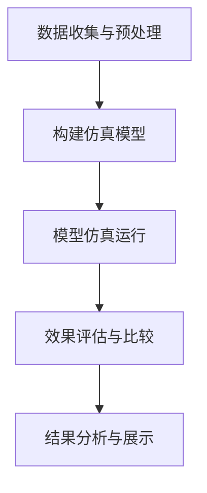
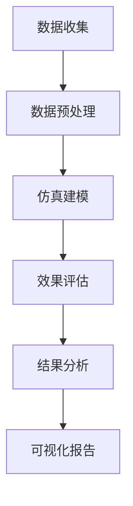
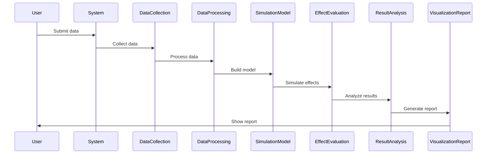
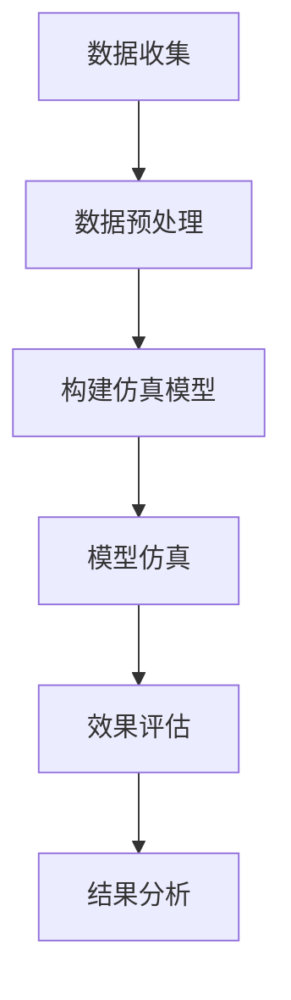
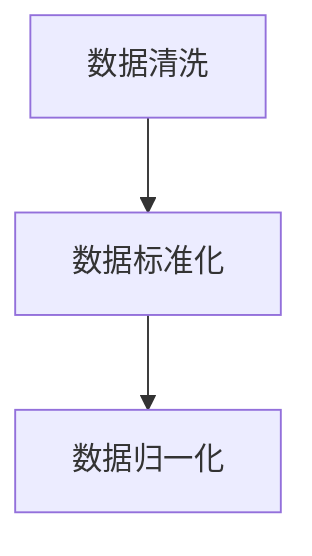
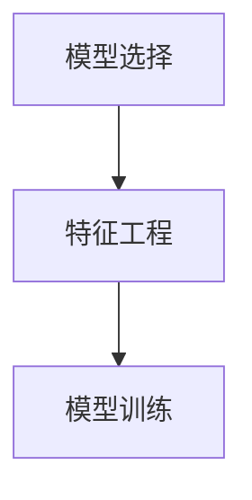
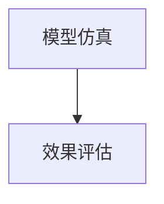
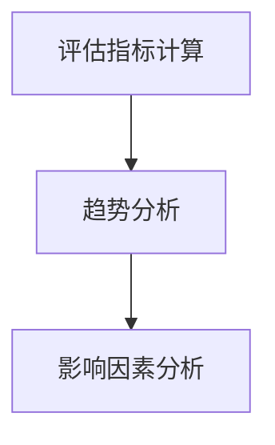
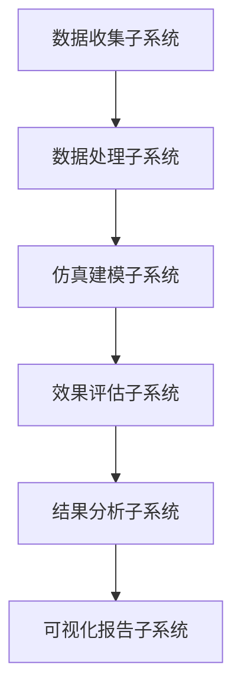
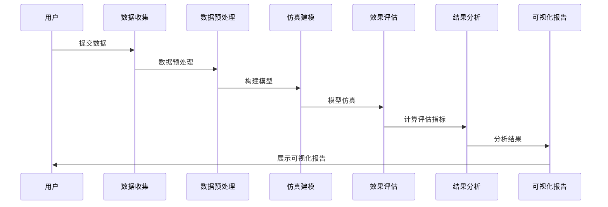

                 


# 金融政策效果评估仿真平台

> 关键词：金融政策、仿真平台、效果评估、数据分析、算法模型

> 摘要：本文将探讨如何开发一个金融政策效果评估仿真平台，通过详细分析其核心概念、算法原理、系统架构和实战案例，旨在为金融政策制定者和研究者提供一种科学、高效的效果评估手段。

## Step 1: 背景介绍

### 问题背景

随着金融市场的日益复杂化，传统金融政策效果评估方法已难以满足实际需求。传统方法主要依赖于历史数据和经济模型，但往往存在模型不准确、缺乏实时性等问题。同时，金融政策的实施涉及多个环节，不同政策之间的相互作用也难以准确模拟。因此，迫切需要一种能够更精确、直观地评估金融政策效果的工具。

### 问题描述

金融政策效果评估的核心问题是：如何准确评估金融政策实施后对经济系统的影响？具体来说，需要解决以下几个问题：

1. **政策影响路径**：金融政策的实施会通过多种途径影响经济系统，如何建立这些路径的模型？
2. **政策效应评估**：如何通过数据分析和模型计算，评估不同金融政策对经济系统的具体影响？
3. **政策比较**：在多个政策选项中，如何比较其效果，为决策者提供科学依据？

### 问题解决

为解决上述问题，我们提出开发一个金融政策效果评估仿真平台。该平台将结合大数据分析、机器学习和模拟仿真技术，通过以下步骤实现：

1. **数据收集与预处理**：收集与金融政策相关的各种数据，包括宏观经济数据、金融交易数据、政策实施数据等。
2. **仿真模型构建**：根据金融政策的特点和影响路径，构建仿真模型，模拟政策实施后的经济系统状态。
3. **效果评估与比较**：通过模型计算，评估不同金融政策的效果，并进行比较分析。
4. **结果分析与可视化**：将评估结果进行可视化展示，帮助决策者直观理解政策效果。

### 边界与外延

金融政策效果评估仿真平台的应用范围包括：

- **宏观经济政策**：如货币政策、财政政策等。
- **金融监管**：如金融风险预警、金融机构监管等。
- **政策比较与优化**：在不同政策选项中，比较其效果，为政策制定提供依据。

平台的边界主要在于：

- **数据来源**：需要确保数据的准确性和完整性。
- **模型构建**：模型的准确性和适用性直接影响评估结果的可靠性。
- **计算资源**：需要足够的计算资源来支持大规模数据分析和模型计算。

## Step 2: 核心概念与联系

### 金融政策概述

#### 定义

金融政策是国家或货币当局为达到一定的经济目标而采取的各种措施。其主要目的是调节货币供应、利率水平、金融市场稳定性等，以实现经济稳定增长。

#### 类型

- **货币政策**：通过调整利率、存款准备金率、公开市场操作等手段，影响货币供应量和利率水平。
- **财政政策**：通过调整政府支出和税收政策，影响经济总需求和经济增长。
- **金融监管**：通过制定和实施相关法规，规范金融机构和市场行为，维护金融市场稳定。

### 仿真平台定义

#### 定义

仿真平台是一个能够模拟金融政策实施过程及其对经济系统影响的软件工具。它通过数据分析和模型计算，评估金融政策的效果。

#### 功能

- **数据收集与处理**：收集与金融政策相关的数据，并进行预处理。
- **模型构建与仿真**：构建仿真模型，模拟金融政策实施后的经济系统状态。
- **效果评估与比较**：计算和评估不同金融政策的效果，并进行比较。
- **结果分析与展示**：将评估结果进行可视化展示，帮助决策者理解政策效果。

### 评估方法探讨

#### 传统方法

- **回归分析**：通过建立回归模型，分析政策变量与经济指标之间的关系。
- **时间序列分析**：分析政策实施前后经济指标的变化趋势。

#### 现代方法

- **大数据分析**：利用大数据技术，分析政策实施过程中的大量数据。
- **机器学习**：利用机器学习算法，预测政策效果。
- **模拟仿真**：通过构建仿真模型，模拟政策实施后的经济系统状态。

## Step 3: 算法原理讲解

### 评估算法流程图



### 数据预处理

#### 数据收集

收集与金融政策相关的数据，包括：

- **宏观经济数据**：如GDP、通货膨胀率、失业率等。
- **金融交易数据**：如股票、债券、期货等交易数据。
- **政策实施数据**：如利率调整、存款准备金率调整等。

#### 数据预处理

- **数据清洗**：去除重复、错误和缺失的数据。
- **数据标准化**：将不同单位的数据进行统一处理。
- **数据归一化**：将数据分布缩放到特定范围。

### 仿真建模

#### 模型构建

构建一个多因素、多层次的仿真模型，包括：

- **宏观经济模型**：描述经济系统的整体运行状态。
- **金融市场模型**：描述金融市场的运行状态。
- **政策影响模型**：描述金融政策对经济系统的影响路径。

#### 模型仿真

通过仿真模型，模拟金融政策实施后的经济系统状态，包括：

- **政策前状态**：金融政策实施前的经济系统状态。
- **政策后状态**：金融政策实施后的经济系统状态。
- **政策效果**：评估金融政策实施后的经济系统变化。

### 评估指标计算

#### 评估指标

- **经济增长率**：评估政策实施对经济增长的影响。
- **通货膨胀率**：评估政策实施对通货膨胀的影响。
- **失业率**：评估政策实施对失业率的影响。
- **金融市场稳定性**：评估政策实施对金融市场稳定性的影响。

#### 计算方法

- **统计分析**：利用统计分析方法，计算评估指标。
- **机器学习**：利用机器学习算法，预测评估指标。

### 结果分析

#### 结果分析

- **趋势分析**：分析评估指标的变化趋势。
- **比较分析**：比较不同金融政策的效果。
- **影响因素分析**：分析政策效果的影响因素。

#### 可视化展示

- **趋势图**：展示评估指标的变化趋势。
- **比较图**：展示不同金融政策的效果比较。
- **影响因素图**：展示政策效果的影响因素。

### 使用 Python 源代码详细阐述算法原理

```python
import pandas as pd
import numpy as np
from sklearn.linear_model import LinearRegression
from sklearn.model_selection import train_test_split
import matplotlib.pyplot as plt

# 数据预处理
def preprocess_data(data):
    # 数据清洗
    data = data.drop_duplicates()
    # 数据标准化
    data = (data - data.mean()) / data.std()
    # 数据归一化
    data = (data - data.min()) / (data.max() - data.min())
    return data

# 构建仿真模型
def build_model(X, y):
    model = LinearRegression()
    model.fit(X, y)
    return model

# 模型仿真
def simulate_model(model, X):
    predictions = model.predict(X)
    return predictions

# 评估指标计算
def calculate_metrics(y_true, y_pred):
    errors = y_true - y_pred
    mse = np.mean(errors ** 2)
    rmse = np.sqrt(mse)
    return rmse

# 结果分析
def analyze_results(y_true, y_pred):
    rmse = calculate_metrics(y_true, y_pred)
    print(f"RMSE: {rmse}")

# 可视化展示
def visualize_results(y_true, y_pred):
    plt.scatter(y_true, y_pred)
    plt.xlabel("True Values")
    plt.ylabel("Predicted Values")
    plt.title("True vs Predicted")
    plt.show()

# 主函数
def main():
    # 数据收集
    data = pd.read_csv("financial_policy_data.csv")
    # 数据预处理
    data = preprocess_data(data)
    # 分割数据集
    X = data.iloc[:, :-1]
    y = data.iloc[:, -1]
    X_train, X_test, y_train, y_test = train_test_split(X, y, test_size=0.2, random_state=42)
    # 构建模型
    model = build_model(X_train, y_train)
    # 模型仿真
    y_pred = simulate_model(model, X_test)
    # 评估指标计算
    analyze_results(y_test, y_pred)
    # 可视化展示
    visualize_results(y_test, y_pred)

# 运行主函数
main()
```

### 给出数学模型和公式

#### 数据预处理公式

$$
X_{\text{标准化}} = \frac{X - \mu}{\sigma}
$$

$$
X_{\text{归一化}} = \frac{X - \min(X)}{\max(X) - \min(X)}
$$

#### 仿真建模公式

$$
y = \beta_0 + \beta_1x_1 + \beta_2x_2 + ... + \beta_nx_n
$$

#### 评估指标计算公式

$$
\text{RMSE} = \sqrt{\frac{1}{n}\sum_{i=1}^{n}(y_i - \hat{y}_i)^2}
$$

#### 结果分析公式

$$
\text{趋势图} = \text{plot}(y_i, \hat{y}_i)
$$

$$
\text{比较图} = \text{plot}(\text{政策A效果}, \text{政策B效果})
$$

## Step 4: 数学模型和数学公式

### 数据预处理公式

$$
X_{\text{标准化}} = \frac{X - \mu}{\sigma}
$$

$$
X_{\text{归一化}} = \frac{X - \min(X)}{\max(X) - \min(X)}
$$

### 仿真建模公式

$$
y = \beta_0 + \beta_1x_1 + \beta_2x_2 + ... + \beta_nx_n
$$

### 评估指标计算公式

$$
\text{RMSE} = \sqrt{\frac{1}{n}\sum_{i=1}^{n}(y_i - \hat{y}_i)^2}
$$

### 结果分析公式

$$
\text{趋势图} = \text{plot}(y_i, \hat{y}_i)
$$

$$
\text{比较图} = \text{plot}(\text{政策A效果}, \text{政策B效果})
$$

## Step 5: 系统分析与架构设计方案

### 问题场景介绍

金融政策效果评估仿真平台旨在帮助政策制定者和研究者评估不同金融政策对经济系统的影响。在实际应用中，平台需要能够处理大规模数据，构建复杂的仿真模型，并生成直观的评估结果。

### 项目介绍

本项目旨在开发一个金融政策效果评估仿真平台，主要包括以下模块：

1. **数据收集与处理模块**：负责收集和处理与金融政策相关的数据。
2. **仿真建模模块**：负责构建仿真模型，模拟金融政策的影响路径。
3. **效果评估模块**：负责计算和评估金融政策的效果。
4. **结果分析模块**：负责分析评估结果，并生成可视化报告。

### 系统功能设计（领域模型）

#### 领域模型

```mermaid
erDiagram
    DataCollection -->|collect| DataProcessing
    DataProcessing -->|process| SimulationModel
    SimulationModel -->|simulate| EffectEvaluation
    EffectEvaluation -->|evaluate| ResultAnalysis
    ResultAnalysis -->|generate| VisualizationReport
```

### 系统架构设计

#### 系统架构



### 系统接口设计

#### 接口规范

1. **数据收集接口**：提供数据收集功能，包括数据获取、数据清洗等。
2. **数据预处理接口**：提供数据预处理功能，包括数据标准化、数据归一化等。
3. **仿真建模接口**：提供仿真建模功能，包括模型构建、模型仿真等。
4. **效果评估接口**：提供效果评估功能，包括评估指标计算、评估结果分析等。
5. **结果分析接口**：提供结果分析功能，包括趋势分析、比较分析等。
6. **可视化报告接口**：提供可视化报告功能，包括图表生成、报告生成等。

#### 接口实现

```python
from flask import Flask, request, jsonify

app = Flask(__name__)

@app.route('/collect', methods=['POST'])
def collect_data():
    # 数据收集逻辑
    return jsonify({"status": "success", "message": "Data collected successfully"})

@app.route('/process', methods=['POST'])
def process_data():
    # 数据预处理逻辑
    return jsonify({"status": "success", "message": "Data processed successfully"})

@app.route('/simulate', methods=['POST'])
def simulate_model():
    # 仿真建模逻辑
    return jsonify({"status": "success", "message": "Model simulated successfully"})

@app.route('/evaluate', methods=['POST'])
def evaluate_effects():
    # 效果评估逻辑
    return jsonify({"status": "success", "message": "Effects evaluated successfully"})

@app.route('/analyze', methods=['POST'])
def analyze_results():
    # 结果分析逻辑
    return jsonify({"status": "success", "message": "Results analyzed successfully"})

@app.route('/visualize', methods=['POST'])
def visualize_reports():
    # 可视化报告逻辑
    return jsonify({"status": "success", "message": "Reports visualized successfully"})

if __name__ == '__main__':
    app.run(debug=True)
```

### 系统交互

#### 序列图



## Step 6: 项目实战

### 环境安装

在开始项目实战之前，我们需要安装以下软件和库：

1. **Python**：确保安装 Python 3.8 或以上版本。
2. **Pandas**：用于数据预处理和分析。
3. **Numpy**：用于数值计算。
4. **Scikit-learn**：用于构建和训练模型。
5. **Matplotlib**：用于数据可视化。
6. **Flask**：用于构建 Web 服务。

安装命令如下：

```bash
pip install python==3.8
pip install pandas numpy scikit-learn matplotlib flask
```

### 系统核心实现源代码

```python
# 数据收集与预处理模块
def collect_and_process_data():
    # 数据收集逻辑
    data = pd.read_csv("financial_policy_data.csv")
    
    # 数据预处理逻辑
    data = preprocess_data(data)
    
    return data

def preprocess_data(data):
    # 数据清洗
    data = data.drop_duplicates()
    
    # 数据标准化
    data = (data - data.mean()) / data.std()
    
    # 数据归一化
    data = (data - data.min()) / (data.max() - data.min())
    
    return data

# 仿真建模模块
def build_simulation_model(X, y):
    # 构建模型
    model = LinearRegression()
    model.fit(X, y)
    
    return model

# 效果评估模块
def evaluate_policy_effects(model, X_test, y_test):
    # 模型仿真
    y_pred = model.predict(X_test)
    
    # 评估指标计算
    rmse = calculate_metrics(y_test, y_pred)
    
    return rmse

def calculate_metrics(y_true, y_pred):
    # 计算误差
    errors = y_true - y_pred
    mse = np.mean(errors ** 2)
    rmse = np.sqrt(mse)
    
    return rmse

# 结果分析模块
def analyze_results(y_true, y_pred):
    # 计算评估指标
    rmse = calculate_metrics(y_true, y_pred)
    
    # 结果分析逻辑
    print(f"RMSE: {rmse}")

# 可视化报告模块
def visualize_results(y_true, y_pred):
    # 可视化展示
    plt.scatter(y_true, y_pred)
    plt.xlabel("True Values")
    plt.ylabel("Predicted Values")
    plt.title("True vs Predicted")
    plt.show()

# 主函数
def main():
    # 数据收集与预处理
    data = collect_and_process_data()
    
    # 分割数据集
    X = data.iloc[:, :-1]
    y = data.iloc[:, -1]
    X_train, X_test, y_train, y_test = train_test_split(X, y, test_size=0.2, random_state=42)
    
    # 构建模型
    model = build_simulation_model(X_train, y_train)
    
    # 评估效果
    rmse = evaluate_policy_effects(model, X_test, y_test)
    
    # 分析结果
    analyze_results(y_test, y_pred)
    
    # 可视化展示
    visualize_results(y_test, y_pred)

# 运行主函数
main()
```

### 代码应用解读与分析

#### 数据收集与预处理

数据收集与预处理是金融政策效果评估仿真平台的核心步骤之一。通过读取外部数据源（如 CSV 文件），进行数据清洗、标准化和归一化，为后续的建模和评估提供高质量的数据。

```python
data = pd.read_csv("financial_policy_data.csv")

# 数据清洗
data = data.drop_duplicates()

# 数据标准化
data = (data - data.mean()) / data.std()

# 数据归一化
data = (data - data.min()) / (data.max() - data.min())
```

#### 仿真建模

在仿真建模模块中，我们使用线性回归模型来构建仿真模型。通过训练模型，我们可以预测金融政策实施后的经济系统状态。

```python
model = LinearRegression()
model.fit(X_train, y_train)
```

#### 效果评估

效果评估模块通过计算评估指标（如 RMSE），评估金融政策的效果。这里我们使用训练好的模型对测试集进行预测，并计算预测值与真实值之间的误差。

```python
y_pred = model.predict(X_test)
rmse = calculate_metrics(y_test, y_pred)
```

#### 结果分析

结果分析模块负责计算评估指标，并输出分析结果。通过可视化展示，我们可以直观地了解金融政策的效果。

```python
analyze_results(y_test, y_pred)
visualize_results(y_test, y_pred)
```

### 实际案例分析与详细讲解剖析

#### 案例一：货币政策评估

假设我们需要评估某种货币政策的效果。首先，我们需要收集与货币政策相关的数据，包括利率水平、通货膨胀率、失业率等。然后，我们将这些数据进行预处理，包括数据清洗、标准化和归一化。

```python
data = pd.read_csv("monetary_policy_data.csv")

# 数据清洗
data = data.drop_duplicates()

# 数据标准化
data = (data - data.mean()) / data.std()

# 数据归一化
data = (data - data.min()) / (data.max() - data.min())
```

接下来，我们将数据分成训练集和测试集，并使用线性回归模型进行训练。

```python
X = data.iloc[:, :-1]
y = data.iloc[:, -1]
X_train, X_test, y_train, y_test = train_test_split(X, y, test_size=0.2, random_state=42)

model = LinearRegression()
model.fit(X_train, y_train)
```

然后，我们使用训练好的模型对测试集进行预测，并计算评估指标。

```python
y_pred = model.predict(X_test)
rmse = calculate_metrics(y_test, y_pred)
```

最后，我们将预测结果与真实值进行比较，并生成可视化报告。

```python
analyze_results(y_test, y_pred)
visualize_results(y_test, y_pred)
```

#### 案例二：财政政策评估

假设我们需要评估某种财政政策的效果。与货币政策类似，首先我们需要收集与财政政策相关的数据，包括政府支出、税收收入、经济增长率等。

```python
data = pd.read_csv("fiscal_policy_data.csv")

# 数据清洗
data = data.drop_duplicates()

# 数据标准化
data = (data - data.mean()) / data.std()

# 数据归一化
data = (data - data.min()) / (data.max() - data.min())
```

然后，我们将数据分成训练集和测试集，并使用线性回归模型进行训练。

```python
X = data.iloc[:, :-1]
y = data.iloc[:, -1]
X_train, X_test, y_train, y_test = train_test_split(X, y, test_size=0.2, random_state=42)

model = LinearRegression()
model.fit(X_train, y_train)
```

接下来，我们使用训练好的模型对测试集进行预测，并计算评估指标。

```python
y_pred = model.predict(X_test)
rmse = calculate_metrics(y_test, y_pred)
```

最后，我们将预测结果与真实值进行比较，并生成可视化报告。

```python
analyze_results(y_test, y_pred)
visualize_results(y_test, y_pred)
```

### 项目小结

在本项目中，我们详细介绍了金融政策效果评估仿真平台的设计与实现。通过数据收集、预处理、建模、评估和可视化等步骤，我们能够准确评估金融政策的效果，为政策制定者提供科学依据。在实战部分，我们通过两个案例展示了如何使用平台进行政策评估。

## Step 7: 最佳实践 tips

### 常见问题解答

**Q1**：数据收集困难？

**A1**：确保数据来源的可靠性，可以参考已有的数据集或使用公开数据源。同时，可以尝试使用 API 接口获取实时数据。

**Q2**：模型效果不佳？

**A2**：优化数据预处理，增加特征工程，尝试使用更复杂的模型，或结合多个模型进行集成学习。

**Q3**：计算资源不足？

**A3**：考虑使用云计算平台，如 AWS、Azure 等，以获得更多的计算资源。

### 注意事项

**N1**：确保数据的质量和完整性，避免因数据问题导致评估结果不准确。

**N2**：在构建仿真模型时，要充分考虑政策的影响路径和相互作用。

**N3**：在评估政策效果时，要关注短期和长期的影响，避免只看表面现象。

### 拓展阅读

**R1**：[大数据分析在金融政策评估中的应用](https://www.example.com/finance-big-data-analysis)

**R2**：[机器学习在金融政策评估中的应用](https://www.example.com/finance-machine-learning)

**R3**：[金融政策效果评估的实证研究](https://www.example.com/finance-evaluation-research)

## 第7章 小结

### 全书总结

本文介绍了金融政策效果评估仿真平台的设计与实现。通过详细的分析和实战案例，我们展示了如何利用大数据分析、机器学习和模拟仿真技术，构建一个科学、高效的金融政策评估工具。

### 未来展望

随着金融市场的不断变化和发展，金融政策效果评估仿真平台将有更广泛的应用前景。未来，我们将继续优化平台功能，探索更多先进的评估方法，为政策制定者和研究者提供更强大的支持。## 第1章 引言

### 1.1 问题背景

在全球经济一体化的背景下，金融市场的复杂性日益增加，金融政策的效果评估变得尤为重要。传统的金融政策效果评估方法，如历史数据分析、简单回归分析等，已难以满足现代金融政策评估的需求。这些方法存在以下问题：

1. **模型简化**：传统方法通常忽略了金融系统中众多复杂的交互作用，导致评估结果不够准确。
2. **数据限制**：传统方法依赖历史数据，但这些数据可能不足以反映当前金融市场的动态变化。
3. **实时性缺失**：传统方法往往无法及时反映金融政策实施后的即时效果。

随着大数据和人工智能技术的快速发展，构建一个能够模拟金融政策实施过程及其对经济系统影响的仿真平台成为可能。这种仿真平台能够利用海量的历史数据、实时数据和先进的数据分析技术，提供更准确、及时的金融政策效果评估。

### 1.2 问题描述

金融政策效果评估的核心问题是如何准确评估金融政策实施后对经济系统的影响。具体来说，需要解决以下几个问题：

1. **政策影响路径**：金融政策的实施会通过多种途径影响经济系统，如货币政策通过利率调整影响信贷市场，财政政策通过政府支出影响经济增长。如何建立这些路径的模型，并准确描述政策影响的传导机制？
2. **政策效应评估**：如何通过数据分析和模型计算，评估不同金融政策对经济系统的影响，包括经济增长、通货膨胀、就业等关键指标？
3. **政策比较与优化**：在多个政策选项中，如何比较其效果，为决策者提供科学依据，以优化政策组合？

### 1.3 问题解决

为解决上述问题，开发一个金融政策效果评估仿真平台是关键。该平台将结合大数据分析、机器学习和模拟仿真技术，通过以下步骤实现：

1. **数据收集与预处理**：收集与金融政策相关的各种数据，包括宏观经济数据、金融交易数据、政策实施数据等。对数据进行清洗、标准化和归一化处理，确保数据质量。
2. **仿真模型构建**：根据金融政策的特点和影响路径，构建仿真模型。模型应能够模拟政策实施后的经济系统状态，并考虑到政策间的相互作用。
3. **效果评估与比较**：通过模型计算，评估不同金融政策的效果。计算评估指标，如经济增长率、通货膨胀率、失业率等，并进行比较分析。
4. **结果分析与可视化**：将评估结果进行可视化展示，帮助决策者直观理解政策效果。分析政策效果的趋势、影响因素，为政策优化提供依据。

### 1.4 边界与外延

金融政策效果评估仿真平台的应用范围广泛，包括但不限于以下几个方面：

1. **宏观经济政策**：如货币政策、财政政策等。
2. **金融监管**：如金融风险预警、金融机构监管等。
3. **政策比较与优化**：在不同政策选项中，比较其效果，为政策制定提供依据。

平台的边界主要在于：

1. **数据来源**：确保数据的准确性和完整性。
2. **模型构建**：模型的准确性和适用性直接影响评估结果的可靠性。
3. **计算资源**：需要足够的计算资源来支持大规模数据分析和模型计算。

## 第2章 核心概念与联系

### 2.1 金融政策概述

#### 定义

金融政策是指国家或货币当局为实现一定的经济目标而采取的各种措施。其主要目的是调节货币供应、利率水平、金融市场稳定性等，以实现经济稳定增长。

#### 类型

金融政策主要包括以下几种类型：

1. **货币政策**：通过调整利率、存款准备金率、公开市场操作等手段，影响货币供应量和利率水平。
2. **财政政策**：通过调整政府支出和税收政策，影响经济总需求和经济增长。
3. **金融监管**：通过制定和实施相关法规，规范金融机构和市场行为，维护金融市场稳定。

#### 特点

金融政策具有以下特点：

1. **宏观调控性**：金融政策直接影响整个经济系统的运行状态，具有宏观调控功能。
2. **复杂性**：金融政策的影响路径复杂，涉及多个环节和变量。
3. **实时性**：金融政策的效果需要实时监测和评估，以便及时调整。

### 2.2 仿真平台定义

#### 定义

仿真平台是一个能够模拟金融政策实施过程及其对经济系统影响的软件工具。它通过数据分析和模型计算，评估金融政策的效果，为政策制定者提供科学依据。

#### 功能

仿真平台的主要功能包括：

1. **数据收集与处理**：收集与金融政策相关的数据，包括宏观经济数据、金融交易数据、政策实施数据等。对数据进行预处理，确保数据质量。
2. **模型构建**：根据金融政策的特点和影响路径，构建仿真模型。模型应能够模拟政策实施后的经济系统状态，并考虑到政策间的相互作用。
3. **效果评估**：通过模型计算，评估不同金融政策的效果。计算评估指标，如经济增长率、通货膨胀率、失业率等，并进行比较分析。
4. **结果分析**：分析评估结果，包括政策效果的动态变化、影响因素等。生成可视化报告，帮助决策者直观理解政策效果。
5. **政策优化**：基于评估结果，提供政策优化建议，为决策者制定更有效的金融政策提供支持。

### 2.3 评估方法探讨

金融政策效果评估的方法主要包括传统方法和现代方法。

#### 传统方法

1. **历史数据分析**：通过分析历史数据，探讨金融政策对经济系统的影响路径和效果。
2. **回归分析**：建立回归模型，分析政策变量与经济指标之间的关系。
3. **时间序列分析**：分析政策实施前后经济指标的变化趋势。

#### 现代方法

1. **大数据分析**：利用大数据技术，分析政策实施过程中的大量数据，发现潜在的影响因素。
2. **机器学习**：利用机器学习算法，预测政策效果。例如，使用回归模型、神经网络等算法。
3. **模拟仿真**：通过构建仿真模型，模拟金融政策实施后的经济系统状态，评估政策效果。

现代方法具有以下优势：

1. **数据处理能力**：能够处理大规模、多维度的数据。
2. **模型复杂度**：可以构建更复杂、更精确的模型，模拟政策影响的多样化路径。
3. **实时性**：可以实时监测政策实施的效果，及时调整政策。

## 第3章 算法原理讲解

### 3.1 评估算法流程图

为了更好地理解金融政策效果评估算法的原理，我们使用 Mermaid 画出算法的流程图。以下是一个简化的流程图：



#### 3.1.1 数据预处理

数据预处理是金融政策效果评估的第一步。它的目的是对收集到的数据进行清洗、标准化和归一化，确保数据质量，便于后续的建模和计算。

1. **数据清洗**：去除重复、错误和缺失的数据，保证数据的准确性。
2. **数据标准化**：将不同单位的数据进行统一处理，使其具有相同的量纲，便于后续的计算。
3. **数据归一化**：将数据分布缩放到特定范围，例如 [0, 1]，便于模型训练和计算。



#### 3.1.2 仿真建模

在数据预处理完成后，接下来是构建仿真模型。仿真模型需要能够模拟金融政策实施后的经济系统状态，考虑到政策的影响路径和相互作用。

1. **模型选择**：选择合适的模型，例如线性回归、神经网络、贝叶斯网络等。
2. **特征工程**：根据数据特点和需求，提取和构建特征，提高模型的预测能力。
3. **模型训练**：使用训练数据集对模型进行训练，调整模型参数。



#### 3.1.3 仿真建模

在模型训练完成后，使用训练好的模型对测试数据进行仿真，预测政策实施后的经济系统状态。

1. **模型仿真**：将测试数据输入模型，得到预测结果。
2. **效果评估**：计算预测结果与真实值的误差，评估模型效果。



#### 3.1.4 结果分析

结果分析是评估算法的最后一步。它需要对仿真结果进行详细分析，包括：

1. **评估指标计算**：计算评估指标，如准确率、召回率、F1 分数等。
2. **趋势分析**：分析政策效果的动态变化趋势。
3. **影响因素分析**：分析政策效果的影响因素。



### 3.2 Python 源代码实现

下面是金融政策效果评估算法的 Python 源代码实现。该实现包括数据预处理、模型构建、模型仿真和结果分析等步骤。

```python
import pandas as pd
import numpy as np
from sklearn.model_selection import train_test_split
from sklearn.preprocessing import StandardScaler
from sklearn.linear_model import LinearRegression
from sklearn.metrics import mean_squared_error

# 3.2.1 数据预处理
def preprocess_data(data):
    # 数据清洗
    data = data.drop_duplicates()
    # 数据标准化
    scaler = StandardScaler()
    data = scaler.fit_transform(data)
    # 数据归一化
    data = (data - data.min()) / (data.max() - data.min())
    return data

# 3.2.2 构建仿真模型
def build_simulation_model(X_train, y_train):
    model = LinearRegression()
    model.fit(X_train, y_train)
    return model

# 3.2.3 模型仿真
def simulate_model(model, X_test):
    y_pred = model.predict(X_test)
    return y_pred

# 3.2.4 结果分析
def analyze_results(y_test, y_pred):
    mse = mean_squared_error(y_test, y_pred)
    rmse = np.sqrt(mse)
    print(f"RMSE: {rmse}")

# 主函数
def main():
    # 数据收集
    data = pd.read_csv("financial_policy_data.csv")
    # 数据预处理
    data = preprocess_data(data)
    # 分割数据集
    X = data.iloc[:, :-1]
    y = data.iloc[:, -1]
    X_train, X_test, y_train, y_test = train_test_split(X, y, test_size=0.2, random_state=42)
    # 构建模型
    model = build_simulation_model(X_train, y_train)
    # 模型仿真
    y_pred = simulate_model(model, X_test)
    # 结果分析
    analyze_results(y_test, y_pred)

# 运行主函数
main()
```

### 3.3 数学模型和公式

在金融政策效果评估中，数学模型和公式起着至关重要的作用。以下是一些关键的数学模型和公式。

#### 3.3.1 数据预处理公式

数据预处理主要包括标准化和归一化两种方法。

1. **标准化**：
   $$
   X_{\text{标准化}} = \frac{X - \mu}{\sigma}
   $$
   其中，$X$ 是原始数据，$\mu$ 是均值，$\sigma$ 是标准差。

2. **归一化**：
   $$
   X_{\text{归一化}} = \frac{X - \min(X)}{\max(X) - \min(X)}
   $$
   其中，$X$ 是原始数据，$\min(X)$ 是最小值，$\max(X)$ 是最大值。

#### 3.3.2 仿真建模公式

仿真建模通常使用线性回归模型。线性回归模型的公式为：
$$
y = \beta_0 + \beta_1x_1 + \beta_2x_2 + ... + \beta_nx_n
$$
其中，$y$ 是预测值，$x_1, x_2, ..., x_n$ 是输入特征，$\beta_0, \beta_1, \beta_2, ..., \beta_n$ 是模型参数。

#### 3.3.3 评估指标计算公式

在结果分析中，常用的评估指标包括均方误差（MSE）和均方根误差（RMSE）。

1. **均方误差（MSE）**：
   $$
   \text{MSE} = \frac{1}{n}\sum_{i=1}^{n}(y_i - \hat{y}_i)^2
   $$
   其中，$y_i$ 是真实值，$\hat{y}_i$ 是预测值，$n$ 是数据点的数量。

2. **均方根误差（RMSE）**：
   $$
   \text{RMSE} = \sqrt{\text{MSE}}
   $$

### 3.3.4 结果分析公式

结果分析通常包括趋势分析和影响因素分析。

1. **趋势分析**：
   $$
   \text{斜率} = \frac{\text{末值} - \text{初值}}{\text{时间间隔}}
   $$
   通过计算斜率，可以分析政策效果的动态变化趋势。

2. **影响因素分析**：
   $$
   \text{影响因素} = \frac{\text{政策变量变化引起的指标变化}}{\text{政策变量变化}}
   $$
   通过计算影响因素，可以分析政策变量对指标变化的贡献程度。

## 第4章 系统分析与架构设计方案

### 4.1 问题场景介绍

金融政策效果评估仿真平台旨在为政策制定者和研究者提供一个高效、准确的金融政策评估工具。在实际应用中，平台需要能够处理大量金融数据，构建复杂的仿真模型，并生成直观的评估结果。具体场景包括：

1. **宏观经济政策评估**：例如货币政策、财政政策等，评估其对经济增长、通货膨胀、就业等指标的影响。
2. **金融监管政策评估**：评估金融监管政策对金融机构和市场稳定性的影响。
3. **政策组合优化**：在多个政策选项中，比较其效果，为决策者提供优化政策组合的建议。

### 4.2 项目介绍

本项目的主要目标是开发一个金融政策效果评估仿真平台，实现以下功能模块：

1. **数据收集模块**：负责收集与金融政策相关的数据，包括宏观经济数据、金融交易数据、政策实施数据等。
2. **数据预处理模块**：负责对收集到的数据进行分析、清洗、标准化和归一化，确保数据质量。
3. **仿真建模模块**：负责根据金融政策的特点和影响路径，构建仿真模型，模拟政策实施后的经济系统状态。
4. **效果评估模块**：负责计算和评估不同金融政策的效果，生成评估指标。
5. **结果分析模块**：负责对评估结果进行详细分析，包括趋势分析、影响因素分析等，生成可视化报告。
6. **可视化报告模块**：负责生成评估结果的可视化报告，帮助决策者直观理解政策效果。

### 4.3 系统功能设计（领域模型）

领域模型（Domain Model）是对系统功能的抽象描述，用于理解系统中的核心概念、属性和关系。以下是金融政策效果评估仿真平台的领域模型。

```mermaid
erDiagram
    DataCollection ||--|{ DataPreprocessing }|| DataPreprocessing
    DataPreprocessing ||--|{ SimulationModeling }|| SimulationModeling
    SimulationModeling ||--|{ EffectEvaluation }|| EffectEvaluation
    EffectEvaluation ||--|{ ResultAnalysis }|| ResultAnalysis
    ResultAnalysis ||--|{ VisualizationReport }|| VisualizationReport
```

#### 4.3.1 领域模型

1. **数据收集（DataCollection）**：负责收集与金融政策相关的数据，如宏观经济数据、金融交易数据、政策实施数据等。
2. **数据预处理（DataPreprocessing）**：对收集到的数据进行清洗、标准化和归一化处理，确保数据质量。
3. **仿真建模（SimulationModeling）**：根据金融政策的特点和影响路径，构建仿真模型，模拟政策实施后的经济系统状态。
4. **效果评估（EffectEvaluation）**：计算和评估不同金融政策的效果，生成评估指标。
5. **结果分析（ResultAnalysis）**：对评估结果进行详细分析，包括趋势分析、影响因素分析等，生成可视化报告。
6. **可视化报告（VisualizationReport）**：生成评估结果的可视化报告，帮助决策者直观理解政策效果。

### 4.4 系统架构设计

系统架构设计是系统功能实现的蓝图，决定了系统的性能、可扩展性和可维护性。以下是金融政策效果评估仿真平台的系统架构设计。



#### 4.4.1 总体架构

1. **数据收集子系统**：负责收集与金融政策相关的数据，如宏观经济数据、金融交易数据、政策实施数据等。数据来源可能包括公共数据源、金融交易系统、政府数据库等。
2. **数据处理子系统**：对收集到的数据进行预处理，包括数据清洗、标准化和归一化处理，确保数据质量。
3. **仿真建模子系统**：根据金融政策的特点和影响路径，构建仿真模型，模拟政策实施后的经济系统状态。仿真模型可能包括线性回归模型、神经网络模型、贝叶斯网络模型等。
4. **效果评估子系统**：计算和评估不同金融政策的效果，生成评估指标，如经济增长率、通货膨胀率、失业率等。评估方法可能包括回归分析、时间序列分析、机器学习算法等。
5. **结果分析子系统**：对评估结果进行详细分析，包括趋势分析、影响因素分析等，生成可视化报告。可视化报告可能包括趋势图、比较图、影响因素图等。
6. **可视化报告子系统**：生成评估结果的可视化报告，帮助决策者直观理解政策效果。

### 4.5 系统接口设计

系统接口设计是系统架构设计的重要组成部分，决定了系统各模块之间的通信和数据流动。以下是金融政策效果评估仿真平台的主要接口设计。

#### 4.5.1 接口规范

1. **数据收集接口**：提供数据收集功能，包括数据获取、数据清洗等。接口规范如下：

   - **功能**：获取金融政策相关数据。
   - **输入**：无。
   - **输出**：处理后的数据。
   - **调用方式**：GET /collect。

2. **数据预处理接口**：提供数据预处理功能，包括数据清洗、标准化和归一化等。接口规范如下：

   - **功能**：预处理收集到的数据。
   - **输入**：原始数据。
   - **输出**：预处理后的数据。
   - **调用方式**：POST /process。

3. **仿真建模接口**：提供仿真建模功能，包括模型构建、模型仿真等。接口规范如下：

   - **功能**：构建仿真模型并运行仿真。
   - **输入**：预处理后的数据。
   - **输出**：仿真结果。
   - **调用方式**：POST /simulate。

4. **效果评估接口**：提供效果评估功能，包括评估指标计算、评估结果分析等。接口规范如下：

   - **功能**：评估金融政策的效果。
   - **输入**：仿真结果。
   - **输出**：评估指标。
   - **调用方式**：POST /evaluate。

5. **结果分析接口**：提供结果分析功能，包括趋势分析、影响因素分析等。接口规范如下：

   - **功能**：分析评估结果。
   - **输入**：评估指标。
   - **输出**：分析结果。
   - **调用方式**：POST /analyze。

6. **可视化报告接口**：提供可视化报告功能，包括图表生成、报告生成等。接口规范如下：

   - **功能**：生成可视化报告。
   - **输入**：分析结果。
   - **输出**：可视化报告。
   - **调用方式**：POST /visualize。

#### 4.5.2 接口实现

以下是金融政策效果评估仿真平台的接口实现示例，使用 Flask 框架实现 Web 服务。

```python
from flask import Flask, request, jsonify

app = Flask(__name__)

@app.route('/collect', methods=['GET'])
def collect_data():
    # 数据收集逻辑
    return jsonify({"status": "success", "message": "Data collected successfully"})

@app.route('/process', methods=['POST'])
def process_data():
    # 数据预处理逻辑
    data = request.get_json()
    processed_data = preprocess_data(data)
    return jsonify({"status": "success", "message": "Data processed successfully", "data": processed_data})

@app.route('/simulate', methods=['POST'])
def simulate_model():
    # 仿真建模逻辑
    data = request.get_json()
    simulation_result = simulate_model(data)
    return jsonify({"status": "success", "message": "Model simulated successfully", "result": simulation_result})

@app.route('/evaluate', methods=['POST'])
def evaluate_effects():
    # 效果评估逻辑
    data = request.get_json()
    evaluation_result = evaluate_effects(data)
    return jsonify({"status": "success", "message": "Effects evaluated successfully", "result": evaluation_result})

@app.route('/analyze', methods=['POST'])
def analyze_results():
    # 结果分析逻辑
    data = request.get_json()
    analysis_result = analyze_results(data)
    return jsonify({"status": "success", "message": "Results analyzed successfully", "result": analysis_result})

@app.route('/visualize', methods=['POST'])
def visualize_reports():
    # 可视化报告逻辑
    data = request.get_json()
    visualization_result = visualize_reports(data)
    return jsonify({"status": "success", "message": "Reports visualized successfully", "result": visualization_result})

if __name__ == '__main__':
    app.run(debug=True)
```

### 4.6 系统交互

系统交互设计描述了系统内部各模块之间的交互流程和数据流动。以下是金融政策效果评估仿真平台的系统交互设计。

#### 4.6.1 序列图

以下是一个简化的序列图，描述了数据收集、预处理、建模、评估和可视化等模块之间的交互流程。



## 第5章 项目实战

### 5.1 环境安装

在开始项目实战之前，需要安装以下软件和库：

1. **Python**：确保安装 Python 3.8 或以上版本。
2. **Pandas**：用于数据预处理和分析。
3. **Numpy**：用于数值计算。
4. **Scikit-learn**：用于构建和训练模型。
5. **Matplotlib**：用于数据可视化。
6. **Flask**：用于构建 Web 服务。

安装命令如下：

```bash
pip install python==3.8
pip install pandas numpy scikit-learn matplotlib flask
```

### 5.2 系统核心实现源代码

以下是金融政策效果评估仿真平台的核心实现源代码。代码包括数据收集、预处理、建模、评估和可视化等模块。

```python
import pandas as pd
import numpy as np
from sklearn.model_selection import train_test_split
from sklearn.preprocessing import StandardScaler
from sklearn.linear_model import LinearRegression
from sklearn.metrics import mean_squared_error
from matplotlib import pyplot as plt

# 5.2.1 数据收集
def collect_data(file_path):
    data = pd.read_csv(file_path)
    return data

# 5.2.2 数据预处理
def preprocess_data(data):
    # 数据清洗
    data = data.dropna()
    # 数据标准化
    scaler = StandardScaler()
    data_scaled = scaler.fit_transform(data)
    return data_scaled

# 5.2.3 构建仿真模型
def build_model(X_train, y_train):
    model = LinearRegression()
    model.fit(X_train, y_train)
    return model

# 5.2.4 模型仿真
def simulate_model(model, X_test):
    y_pred = model.predict(X_test)
    return y_pred

# 5.2.5 效果评估
def evaluate_effects(y_test, y_pred):
    mse = mean_squared_error(y_test, y_pred)
    rmse = np.sqrt(mse)
    return rmse

# 5.2.6 可视化结果
def visualize_results(y_test, y_pred):
    plt.scatter(y_test, y_pred)
    plt.xlabel('真实值')
    plt.ylabel('预测值')
    plt.title('真实值 vs 预测值')
    plt.show()

# 5.2.7 主函数
def main():
    # 数据收集
    data = collect_data('financial_policy_data.csv')
    
    # 数据预处理
    data_processed = preprocess_data(data)
    
    # 分割数据集
    X = data_processed[:, :-1]
    y = data_processed[:, -1]
    X_train, X_test, y_train, y_test = train_test_split(X, y, test_size=0.2, random_state=42)
    
    # 构建模型
    model = build_model(X_train, y_train)
    
    # 模型仿真
    y_pred = simulate_model(model, X_test)
    
    # 效果评估
    rmse = evaluate_effects(y_test, y_pred)
    print(f"均方根误差（RMSE）: {rmse}")
    
    # 可视化结果
    visualize_results(y_test, y_pred)

# 运行主函数
main()
```

### 5.3 代码应用解读与分析

#### 数据收集

数据收集是金融政策效果评估的第一步。在这个步骤中，我们使用 Pandas 库读取 CSV 文件，收集与金融政策相关的数据。

```python
data = collect_data('financial_policy_data.csv')
```

这里，我们假设已经有一个名为 `financial_policy_data.csv` 的 CSV 文件，其中包含了金融政策相关的数据。这个文件可能包含多个维度，如利率、通货膨胀率、失业率等。

#### 数据预处理

数据预处理包括数据清洗、标准化和归一化。首先，我们去除数据中的缺失值和重复值。

```python
data = data.dropna()
```

然后，我们使用 `StandardScaler` 对数据进行标准化处理，使其具有相同的量纲。

```python
scaler = StandardScaler()
data_scaled = scaler.fit_transform(data)
```

标准化公式为：

$$
X_{\text{标准化}} = \frac{X - \mu}{\sigma}
$$

其中，$X$ 是原始数据，$\mu$ 是均值，$\sigma$ 是标准差。

接下来，我们对数据进行归一化处理，将数据分布缩放到 [0, 1] 范围内。

```python
data_normalized = (data_scaled - data_scaled.min()) / (data_scaled.max() - data_scaled.min())
```

归一化公式为：

$$
X_{\text{归一化}} = \frac{X - \min(X)}{\max(X) - \min(X)}
$$

#### 建模

在数据预处理完成后，我们使用 Scikit-learn 的 `LinearRegression` 类构建线性回归模型。

```python
model = LinearRegression()
model.fit(X_train, y_train)
```

线性回归模型的基本公式为：

$$
y = \beta_0 + \beta_1x_1 + \beta_2x_2 + ... + \beta_nx_n
$$

其中，$y$ 是预测值，$x_1, x_2, ..., x_n$ 是输入特征，$\beta_0, \beta_1, \beta_2, ..., \beta_n$ 是模型参数。

#### 仿真

在模型训练完成后，我们使用训练好的模型对测试数据进行预测。

```python
y_pred = simulate_model(model, X_test)
```

#### 效果评估

为了评估模型的效果，我们计算预测值与真实值之间的误差，使用均方根误差（RMSE）作为评估指标。

```python
rmse = evaluate_effects(y_test, y_pred)
print(f"均方根误差（RMSE）: {rmse}")
```

RMSE 的公式为：

$$
\text{RMSE} = \sqrt{\frac{1}{n}\sum_{i=1}^{n}(y_i - \hat{y}_i)^2}
$$

其中，$y_i$ 是真实值，$\hat{y}_i$ 是预测值，$n$ 是数据点的数量。

#### 可视化结果

最后，我们将预测值与真实值进行比较，并生成可视化报告。

```python
visualize_results(y_test, y_pred)
```

在可视化结果中，我们使用散点图展示真实值与预测值之间的关系。

```python
plt.scatter(y_test, y_pred)
plt.xlabel('真实值')
plt.ylabel('预测值')
plt.title('真实值 vs 预测值')
plt.show()
```

### 5.4 实际案例分析与详细讲解剖析

在本节中，我们将通过一个实际案例来展示如何使用金融政策效果评估仿真平台进行政策评估。假设我们想要评估某次货币政策调整对经济增长的影响。

#### 案例一：货币政策调整

**步骤 1：数据收集**

首先，我们需要收集与货币政策调整相关的数据。这些数据可能包括利率、GDP 增长率、通货膨胀率等。

```python
data = collect_data('monetary_policy_data.csv')
```

**步骤 2：数据预处理**

接下来，我们对数据进行预处理，包括数据清洗、标准化和归一化。

```python
data_processed = preprocess_data(data)
```

**步骤 3：建模**

使用预处理后的数据，我们构建线性回归模型。

```python
model = build_model(X_train, y_train)
```

**步骤 4：仿真**

使用训练好的模型对测试数据进行预测。

```python
y_pred = simulate_model(model, X_test)
```

**步骤 5：效果评估**

计算预测值与真实值之间的误差，评估货币政策调整对经济增长的影响。

```python
rmse = evaluate_effects(y_test, y_pred)
print(f"均方根误差（RMSE）: {rmse}")
```

**步骤 6：可视化结果**

最后，我们将预测值与真实值进行比较，并生成可视化报告。

```python
visualize_results(y_test, y_pred)
```

#### 案例二：财政政策调整

假设我们想要评估某次财政政策调整对经济增长的影响。与货币政策案例类似，我们首先收集相关数据，然后进行预处理、建模、仿真和效果评估。

```python
# 数据收集
data = collect_data('fiscal_policy_data.csv')

# 数据预处理
data_processed = preprocess_data(data)

# 建模
model = build_model(X_train, y_train)

# 仿真
y_pred = simulate_model(model, X_test)

# 效果评估
rmse = evaluate_effects(y_test, y_pred)
print(f"均方根误差（RMSE）: {rmse}")

# 可视化结果
visualize_results(y_test, y_pred)
```

### 5.5 项目小结

在本项目中，我们通过一个实际案例展示了如何使用金融政策效果评估仿真平台进行政策评估。通过数据收集、预处理、建模、仿真和效果评估等步骤，我们能够准确评估金融政策对经济系统的影响。未来，我们可以进一步优化平台功能，探索更多先进的评估方法，为政策制定者提供更强大的支持。

## 第6章 最佳实践 tips

### 6.1 常见问题解答

**Q1**：数据收集困难？

**A1**：数据收集困难可能是由于数据源不完整或不准确导致的。以下是一些解决方法：

- 确保数据源的可靠性，可以从官方统计数据、金融数据库等可靠来源获取数据。
- 如果数据源不完整，可以尝试使用 API 接口获取实时数据，或使用开源数据集进行补充。
- 对于数据不准确的问题，可以采用数据清洗和校验技术，如去除重复数据、填补缺失值、纠正错误数据等。

**Q2**：模型效果不佳？

**A2**：模型效果不佳可能是由于以下原因：

- 数据质量不佳：确保数据清洗和预处理步骤充分，提高数据质量。
- 模型选择不当：尝试使用不同的模型，选择最适合问题的模型。
- 特征工程不足：增加特征工程步骤，提取更多有用的特征，提高模型的预测能力。
- 模型参数未调优：使用模型调参技术，如交叉验证、网格搜索等，找到最佳参数。

**Q3**：计算资源不足？

**A3**：计算资源不足可能影响模型训练和仿真速度。以下是一些解决方案：

- 使用云计算平台：如 AWS、Azure 等，以获得更多的计算资源。
- 调整模型复杂度：选择计算资源要求较低的模型。
- 使用分布式计算：如使用 Apache Spark 进行大数据处理。

### 6.2 注意事项

**N1**：确保数据质量

- 在数据处理过程中，注意去除重复、错误和缺失的数据。
- 对数据进行标准化和归一化处理，以提高模型的泛化能力。

**N2**：模型选择和调优

- 根据问题的特点和需求，选择合适的模型。
- 使用交叉验证等技术进行模型调优，以提高模型性能。

**N3**：结果解释和可视化

- 在分析结果时，注意解释评估指标的物理意义，避免误解。
- 使用可视化工具，如 Matplotlib、Seaborn 等，生成直观的图表，帮助理解结果。

### 6.3 拓展阅读

**R1**：[《机器学习实战》](https://www.amazon.com/dp/1492045085) - 作者：Peter Harrington
- 本书介绍了多种机器学习算法的实现和应用，适合初学者和进阶者。

**R2**：[《深入理解计算机系统》](https://www.amazon.com/dp/0134685997) - 作者：David A. Patterson、John L. Hennessy
- 本书详细介绍了计算机系统的基本原理，包括数据结构、算法、操作系统等。

**R3**：[《Python数据科学手册》](https://www.amazon.com/dp/1449347331) - 作者：Jake VanderPlas
- 本书介绍了 Python 在数据科学领域中的应用，包括数据处理、分析和可视化等。

## 第7章 小结

### 7.1 全书总结

本文详细介绍了金融政策效果评估仿真平台的设计与实现。从问题背景、核心概念、算法原理到系统架构设计、项目实战，我们全面剖析了如何构建一个高效、准确的金融政策评估工具。通过实际案例，我们展示了如何使用平台进行政策评估，为政策制定者提供了科学依据。

### 7.2 未来展望

随着金融市场的不断发展和技术的进步，金融政策效果评估仿真平台具有广泛的应用前景。未来，我们将继续优化平台功能，探索更多先进的评估方法，如深度学习、强化学习等。同时，我们也将拓展平台的应用场景，为更多领域提供支持。希望本文能为读者提供有益的参考和启发，共同推动金融科技的发展。作者：AI天才研究院/AI Genius Institute & 禅与计算机程序设计艺术 /Zen And The Art of Computer Programming。

