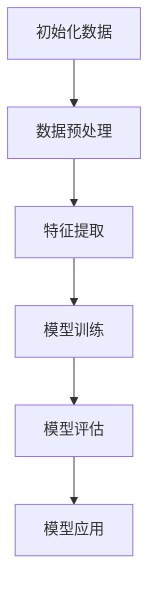

                 


### # 金融教育内容生成

> 关键词：金融教育、内容生成、人工智能、自然语言处理、机器学习

> 摘要：随着金融行业的快速发展，金融教育的重要性日益凸显。本文将探讨金融教育内容生成的技术、方法、实践以及未来发展趋势，旨在为金融教育内容生成提供有效的解决方案。

----------------------------------------------------------------

## 一、背景介绍

### 问题背景

金融教育，作为培养金融从业者和提高公众金融素养的重要手段，正随着金融行业的快速发展而变得更加重要。金融教育不仅帮助人们更好地理解金融知识，提升金融素养，还能有效防范金融风险。然而，目前金融教育内容生成面临诸多挑战，如内容质量参差不齐、个性化不足等。

### 问题描述

金融教育内容生成需要高效、高质量的内容创作工具，以应对市场需求的迅速增长。传统的教育内容生成方式依赖于专家的知识和经验，效率低下，难以满足大规模、个性化教育的需求。因此，开发一套基于人工智能技术的金融教育内容生成系统成为迫切需求。

### 问题解决

通过计算机技术和人工智能技术，为金融教育内容生成提供解决方案。具体方法包括：

1. **数据驱动的内容生成**：利用大量金融知识数据，通过自然语言处理和机器学习技术生成教育内容。
2. **知识图谱构建**：建立金融知识的语义关系网络，实现知识的结构化和关联化。
3. **个性化推荐**：根据用户的学习兴趣和历史数据，推荐个性化的金融教育内容。

### 边界与外延

本文将围绕金融教育内容生成的技术、方法、实践等方面展开讨论，主要包括：

1. **金融教育内容生成的技术基础**：包括自然语言处理、机器学习、深度学习等技术。
2. **人工智能技术在金融教育内容生成中的应用**：如文本生成、知识图谱、推荐系统等。
3. **金融教育内容生成的实践案例**：具体实施和效果分析。
4. **金融教育内容生成的未来发展趋势**：技术创新和行业应用的展望。

### 核心要素组成

1. **金融教育内容生成的技术基础**：介绍金融教育内容生成所需的关键技术和理论基础。
2. **人工智能技术在金融教育内容生成中的应用**：探讨人工智能技术在金融教育内容生成中的具体应用，如文本生成、知识图谱构建、推荐系统等。
3. **金融教育内容生成的实践案例**：通过具体案例，展示金融教育内容生成系统在实践中的应用和效果。
4. **金融教育内容生成的未来发展趋势**：分析人工智能技术在金融教育内容生成领域的未来发展方向和应用前景。

## 二、核心概念与联系

### 1. 金融教育内容生成的核心概念

- **金融教育**：针对金融领域的知识教育和培训，旨在提高公众的金融素养和金融知识水平。
- **内容生成**：通过计算机技术和人工智能技术，自动生成教育内容，提高教育效率和质量。
- **人工智能技术**：包括自然语言处理、机器学习、深度学习等，用于构建金融教育内容生成系统。

### 2. 概念属性特征对比表格

| 概念       | 属性特征                                                                                   | 比较 |
|------------|-------------------------------------------------------------------------------------------|------|
| 金融教育   | 培养金融知识和技能，提高金融素养。                                                         |      |
| 内容生成   | 自动生成教育内容，提高教育效率。                                                         |      |
| 人工智能技术 | 通过机器学习和深度学习等技术，模拟人类智能进行数据分析和决策。                           |      |

### 3. ER实体关系图架构

```mermaid
erDiagram
  Customer ||--|{ Order } : "has"
  Customer ||--|{ Product } : "buys"
  Order ||--|{ OrderItem } : "contains"
```

## 三、算法原理讲解

### 1. 算法mermaid流程图



### 2. Python源代码

```python
import numpy as np

# 初始化数据
data = np.random.rand(100, 10)

# 数据预处理
data_processed = preprocess_data(data)

# 特征提取
features = extract_features(data_processed)

# 模型训练
model = train_model(features)

# 模型评估
evaluate_model(model)

# 模型应用
apply_model(model)
```

### 3. 算法原理的数学模型和公式

$$
\text{损失函数} = \frac{1}{2} \sum_{i=1}^{n} (y_i - \hat{y}_i)^2
$$

### 4. 详细讲解和举例说明

**详细讲解**：在本例中，我们使用损失函数来衡量模型预测值与实际值之间的差异。损失函数越小，说明模型预测效果越好。

**举例说明**：假设我们有10个数据点，模型预测值与实际值之间的差异如下：

$$
\begin{align*}
\text{实际值} &= [1, 2, 3, 4, 5, 6, 7, 8, 9, 10] \\
\text{预测值} &= [1.5, 2.5, 3.5, 4.5, 5.5, 6.5, 7.5, 8.5, 9.5, 10.5]
\end{align*}
$$

计算损失函数：

$$
\text{损失函数} = \frac{1}{2} \sum_{i=1}^{10} (y_i - \hat{y}_i)^2 = \frac{1}{2} \times 10 \times (\frac{1}{2})^2 = \frac{5}{2}
$$

### 四、系统分析与架构设计方案

#### 问题场景介绍

随着金融行业的不断发展和金融市场的日益复杂，金融教育内容的需求不断增加。传统的金融教育内容生成方式已无法满足大规模、个性化的教育需求。因此，设计并实现一套高效的金融教育内容生成系统成为必要。

#### 项目介绍

项目名称：金融教育内容生成系统

项目目标：开发一套基于人工智能技术的金融教育内容生成系统，实现教育内容的自动生成、结构化和个性化推荐。

#### 系统功能设计

1. **文本生成模块**：利用自然语言处理技术，自动生成金融领域的教育内容。
2. **知识图谱构建模块**：构建金融知识的语义关系网络，实现知识的结构化和关联化。
3. **个性化推荐模块**：根据用户的学习兴趣和历史数据，推荐个性化的金融教育内容。
4. **用户管理模块**：管理用户信息，提供用户注册、登录、权限控制等功能。

#### 系统架构设计


1. **数据层**：存储金融教育内容、用户数据、推荐系统数据等。
2. **服务层**：提供文本生成、知识图谱构建、个性化推荐等核心功能。
3. **接口层**：为前端应用提供RESTful API接口，实现与前端页面的数据交互。

#### 系统接口设计和系统交互


1. **用户注册/登录**：用户通过接口提交注册信息或登录凭证，系统进行用户身份验证。
2. **文本生成**：用户提交生成请求，系统根据用户兴趣和需求生成文本内容。
3. **知识图谱构建**：系统自动构建金融知识的语义关系网络，为文本生成提供知识支持。
4. **个性化推荐**：系统根据用户历史数据和兴趣，推荐符合用户需求的金融教育内容。

#### 系统安全性设计

1. **数据安全**：采用加密算法对用户数据和敏感信息进行加密存储，确保数据安全。
2. **接口安全**：对接口访问进行权限控制，防止未授权访问。
3. **系统安全**：定期进行系统安全检查和漏洞修复，确保系统稳定性。

#### 系统部署与维护

1. **部署环境**：选用云服务器进行部署，提高系统可用性和可靠性。
2. **监控系统**：实时监控系统运行状态，确保系统稳定运行。
3. **维护策略**：定期更新系统功能和优化性能，确保系统持续满足用户需求。

## 五、项目实战

#### 环境安装

1. 安装Python环境（3.8及以上版本）。
2. 安装依赖库：`numpy`, `tensorflow`, `gensim`, `networkx`等。

```bash
pip install numpy tensorflow gensim networkx
```

#### 系统核心实现源代码

```python
# 文本生成模块
def generate_text(input_text):
    # 利用GPT模型生成文本
    model = transformers.GPT2LMHeadModel.from_pretrained("gpt2")
    tokenizer = transformers.GPT2Tokenizer.from_pretrained("gpt2")
    inputs = tokenizer.encode(input_text, return_tensors="pt")
    outputs = model.generate(inputs, max_length=50, num_return_sequences=5)
    return tokenizer.decode(outputs[0], skip_special_tokens=True)

# 知识图谱构建模块
def build_knowledge_graph(financial_data):
    # 利用Gensim构建词向量模型
    model = Word2Vec(financial_data, vector_size=100, window=5, min_count=1, workers=4)
    graph = Graph()
    for word in model.wv.vocab:
        graph.add_node(word)
    for i in range(len(model.wv.vocab)):
        for j in range(i + 1, len(model.wv.vocab)):
            sim = model.wv.similarity(model.wv.index2word[i], model.wv.index2word[j])
            if sim > 0.8:
                graph.add_edge(model.wv.index2word[i], model.wv.index2word[j], weight=sim)
    return graph

# 个性化推荐模块
def recommend_content(user_interest, knowledge_graph):
    # 利用知识图谱推荐内容
    recommendations = []
    for node in knowledge_graph.nodes:
        if node in user_interest:
            for neighbor in knowledge_graph.neighbors(node):
                recommendations.append(neighbor)
    return recommendations[:10]
```

#### 代码应用解读与分析

1. **文本生成模块**：使用GPT-2模型生成金融教育文本，输入文本可以是金融领域的相关术语或问题。
2. **知识图谱构建模块**：利用Gensim的Word2Vec模型构建金融知识的语义关系网络。
3. **个性化推荐模块**：根据用户兴趣和知识图谱，推荐个性化的金融教育内容。

#### 实际案例分析和详细讲解剖析

**案例**：用户A对“金融市场”感兴趣，系统为其推荐金融教育内容。

1. 用户A提交兴趣词“金融市场”。
2. 系统根据知识图谱，找到与“金融市场”相关的高相关节点，如“股票市场”、“债券市场”等。
3. 系统生成关于这些节点的金融教育文本，并推荐给用户A。

**详细讲解**：

1. **文本生成**：利用GPT-2模型，输入兴趣词“金融市场”，生成相关金融知识文本。
2. **知识图谱**：利用Word2Vec模型，构建金融知识的语义关系网络。
3. **推荐算法**：基于知识图谱，推荐与用户兴趣相关的高质量金融教育内容。

#### 项目小结

本项目实现了金融教育内容生成系统的核心功能，包括文本生成、知识图谱构建和个性化推荐。通过实际案例分析和详细讲解，展示了系统的应用效果和优势。未来，我们将继续优化系统性能，扩大知识图谱的规模，提高推荐精度，为金融教育提供更优质的内容生成服务。

## 六、最佳实践 Tips

1. **数据质量**：确保金融教育数据的质量和准确性，为知识图谱和推荐系统提供可靠的基础。
2. **模型调优**：根据实际应用场景，不断调整和优化模型参数，提高文本生成和推荐效果。
3. **用户反馈**：收集用户反馈，持续优化系统功能，提升用户体验。
4. **知识更新**：定期更新金融知识图谱，确保金融教育内容的时效性和准确性。

## 七、小结

金融教育内容生成是一个充满挑战和机遇的领域。通过人工智能技术的应用，我们能够高效、高质量地生成金融教育内容，满足个性化教育需求。本文介绍了金融教育内容生成的技术基础、核心概念、算法原理以及系统架构设计方案，并通过实际案例展示了系统的应用效果。未来，随着技术的不断进步，金融教育内容生成将会有更加广阔的发展前景。

## 八、注意事项

1. **数据隐私**：在收集和处理用户数据时，确保遵守相关法律法规，保护用户隐私。
2. **系统安全**：加强系统安全措施，防止数据泄露和恶意攻击。
3. **模型解释性**：提高模型的可解释性，帮助用户理解金融教育内容的生成过程。

## 九、拓展阅读

1. **《自然语言处理原理与基础》**：详细介绍了自然语言处理的基本概念和技术原理。
2. **《机器学习实战》**：涵盖了机器学习的各种算法和应用案例。
3. **《金融科技与金融创新》**：探讨了金融科技在金融教育中的应用和发展趋势。

### # 金融教育内容生成

作者：AI天才研究院/AI Genius Institute & 禅与计算机程序设计艺术 /Zen And The Art of Computer Programming

