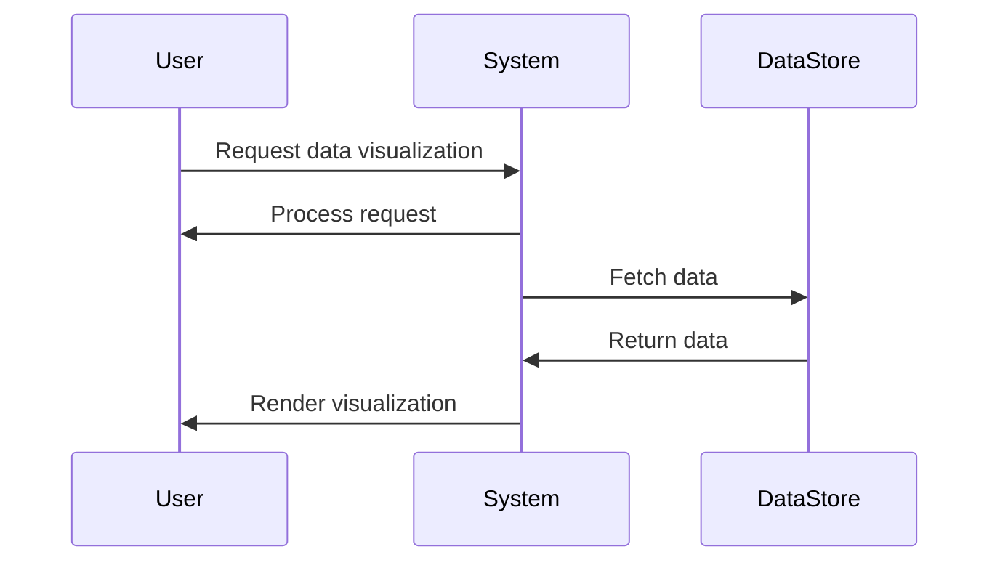
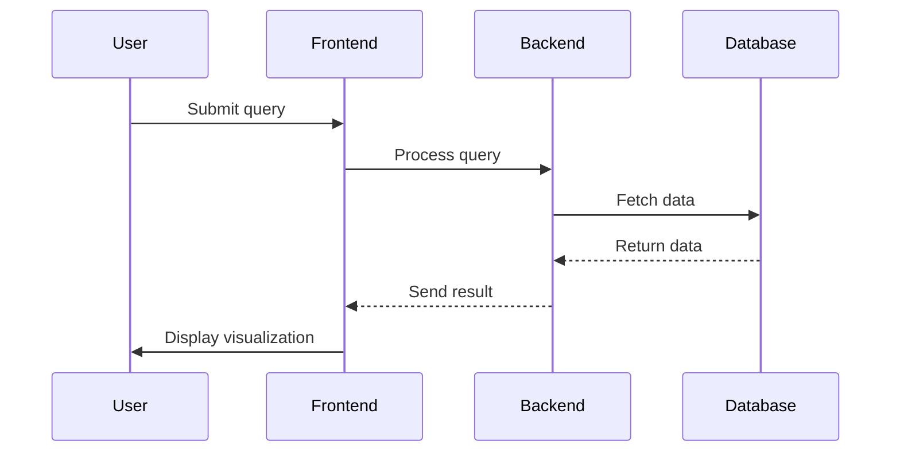

                 

# 金融数据可视化：技术与最佳实践

> 关键词：金融数据、数据可视化、技术、最佳实践、图表设计、交互式可视化、AR/VR、大数据、工具与平台

> 摘要：本文旨在探讨金融数据可视化领域的技术与应用，通过深入剖析金融数据可视化的背景、核心概念、技术手段以及最佳实践，为金融行业的数据分析提供理论指导和实践参考。文章将逐步展开，包括引言与背景介绍、技术与工具讲解、最佳实践案例分析以及总结与展望四个部分。

## 一、引言与背景介绍

### 1.1 问题背景与意义

在当今数据驱动的金融时代，数据已经成为金融行业的核心资产。然而，随着数据量的不断增加和数据种类的日益复杂，如何有效地分析、解读和利用这些数据成为金融从业者面临的巨大挑战。金融数据可视化作为一种高效的数据分析工具，能够将抽象的金融数据转化为直观的图表和图形，从而帮助金融从业者快速理解数据、发现趋势、识别风险，进而做出更为明智的决策。

### 1.2 金融数据可视化的核心概念

金融数据可视化涉及多个核心概念，包括数据、可视化、金融和可视化技术。数据是金融数据可视化的基础，而可视化则是将数据转化为视觉形式的过程。金融则代表了数据的应用场景，涉及市场分析、风险管理、客户服务等多个方面。可视化技术则是实现数据可视化的工具和方法，包括图表设计、交互式可视化、增强现实和虚拟现实等。

### 1.3 可视化技术的分类与特点

可视化技术可以根据其功能和应用场景进行分类。常见的可视化技术包括：

- **基础可视化技术**：如条形图、柱状图、饼图、散点图等，主要用于展示数据的分布、趋势和关系。
- **交互式可视化技术**：通过用户与图表的交互，提供更加灵活和深入的数据分析。
- **增强现实（AR）与虚拟现实（VR）**：将金融数据以三维形式展示，提供更加直观和沉浸式的数据体验。
- **大数据可视化技术**：针对大规模数据集，提供高效的可视化解决方案。

这些技术各有特点，适用于不同的数据分析和应用场景。

### 1.4 数据可视化在金融领域的应用

数据可视化在金融领域的应用广泛而深入，包括：

- **市场分析**：通过可视化技术，分析师可以更快速地了解市场趋势、风险和机会。
- **风险管理**：可视化可以帮助金融机构识别潜在的风险，并进行风险控制。
- **客户服务**：通过可视化的客户数据报告，金融机构可以提供更加个性化的服务。
- **监管合规**：可视化技术有助于金融机构满足监管要求，确保合规性。

### 1.5 本章小结

本章介绍了金融数据可视化的背景、核心概念、可视化技术的分类与特点，以及在金融领域的应用。接下来，我们将进一步探讨金融数据可视化的发展历程与趋势。

## 二、金融数据可视化的发展历程与趋势

### 2.1 金融数据可视化的历史演变

金融数据可视化的发展可以追溯到计算机技术的发展。早期的可视化技术主要集中在二维图表的绘制，如条形图、柱状图和折线图。随着计算机性能的提升和图形处理能力的增强，三维可视化、交互式可视化和大数据可视化技术逐渐成熟，并开始广泛应用于金融领域。

### 2.2 当前主流可视化技术分析

当前，金融数据可视化领域的主流技术包括：

- **D3.js**：一种基于Web的动态数据可视化库，支持复杂的交互式图表。
- **Tableau**：一种商业级数据可视化工具，提供了丰富的图表类型和强大的数据分析功能。
- **Power BI**：微软推出的商业智能工具，支持大数据和云端数据分析。
- **AR/VR**：增强现实和虚拟现实技术，提供了沉浸式和交互式的数据展示方式。

这些技术各有优势，适用于不同的金融数据分析和应用场景。

### 2.3 金融数据可视化的发展趋势

随着数据量的爆炸式增长和技术的不断进步，金融数据可视化也在不断演进。以下是一些主要的发展趋势：

- **实时数据可视化**：实时数据可视化能够提供更快速的数据反馈，帮助金融从业者做出更为及时和准确的决策。
- **智能数据可视化**：利用人工智能和机器学习技术，实现自动化的数据分析和可视化。
- **增强现实与虚拟现实**：随着5G和物联网技术的普及，AR/VR技术在金融数据可视化中的应用将更加广泛和深入。
- **大数据可视化**：针对大规模数据集，大数据可视化技术将提供更加高效和实用的数据展示方式。

### 2.4 未来展望与挑战

金融数据可视化在未来的发展中将面临一些挑战，包括：

- **数据隐私与安全**：如何确保数据隐私和安全是金融数据可视化需要解决的重要问题。
- **数据质量与准确性**：数据的准确性和质量直接影响可视化的效果，需要加强数据质量管理。
- **用户体验**：如何提供更加直观、易用和互动性强的可视化工具，是金融数据可视化需要关注的方向。

### 2.5 本章小结

本章介绍了金融数据可视化的历史演变、当前主流技术分析以及未来发展趋势。接下来，我们将深入探讨金融数据可视化的技术与工具。

## 三、技术与工具讲解

### 3.1 数据准备与处理

#### 3.1.1 数据清洗与预处理

在金融数据可视化中，数据清洗与预处理是至关重要的一步。数据清洗包括去除重复数据、填补缺失值、纠正错误数据等。预处理则包括数据转换、归一化、标准化等操作。这些步骤有助于提高数据质量，为后续的可视化分析打下坚实基础。

#### 3.1.2 数据整合与关联

金融数据通常来源于多个不同的数据源，如数据库、文件、API等。数据整合是将这些数据源中的数据进行合并，形成一个统一的数据集。数据关联则是将不同数据源中的数据关联起来，形成一个完整的视图。这对于理解金融数据之间的内在联系具有重要意义。

#### 3.1.3 数据探索性分析

数据探索性分析（EDA）是数据可视化的重要环节。通过分析数据的分布、趋势、相关性等特征，可以帮助我们更好地理解数据，发现潜在的规律和问题。EDA工具如Python的Pandas、R语言的dplyr等提供了丰富的函数和图表，可以方便地进行数据探索。

#### 3.1.4 数据可视化前的数据质量检查

在数据可视化之前，需要确保数据质量满足要求。这包括检查数据是否完整、准确、一致，以及是否存在异常值等。数据质量检查可以防止数据错误传递到可视化阶段，从而影响分析结果。

### 3.2 基础可视化技术

#### 3.2.1 常见图表类型介绍

- **条形图与柱状图**：用于比较不同类别的数据大小，条形图主要用于分类变量，柱状图主要用于连续变量。
- **饼图与环形图**：用于显示各个部分占整体的比例，适用于展示百分比数据。
- **散点图与气泡图**：用于显示两个或多个变量之间的关系，气泡图通过气泡大小表示第三个变量的值。
- **直方图与密度图**：用于显示数据分布情况，直方图通过柱子高度表示数据频数，密度图通过颜色深浅表示数据密度。
- **地图**：用于展示数据的空间分布情况，适用于地理信息数据。

#### 3.2.2 图表设计与美化

图表设计不仅影响视觉效果，还影响信息的传递和解读。好的图表设计应遵循以下原则：

- **清晰简洁**：避免图表过于复杂，确保信息传递的清晰和简洁。
- **对比鲜明**：使用不同的颜色、线条和标注来区分不同类别的数据。
- **注释说明**：对图表中的重要数据和趋势进行注释说明，帮助读者更好地理解图表内容。
- **适当的布局**：合理布局图表元素，确保图表的整体美观和协调。

#### 3.2.3 可视化组件与布局

可视化组件包括图表、标题、图例、轴标签等。合理的布局可以使图表更加清晰、易于理解。布局设计应考虑以下因素：

- **比例与对齐**：确保图表元素的尺寸和位置比例适当，对齐整齐。
- **空间利用**：充分利用图表空间，避免空白过多或过于拥挤。
- **层次感**：通过层次感的设计，使图表的各个部分更加分明，有利于信息传递。

#### 3.2.4 基础可视化技术在金融领域的应用案例

- **市场分析**：通过条形图和柱状图展示市场趋势和股票价格变化。
- **风险管理**：通过饼图和散点图展示风险分布和相关性。
- **客户服务**：通过地图和气泡图展示客户分布和需求情况。

### 3.3 高级可视化技术

#### 3.3.1 交互式可视化

交互式可视化是一种用户可以与图表进行交互的方式，通过点击、拖动、筛选等操作，可以动态地更新图表内容，从而提供更加深入和灵活的数据分析。常见的交互式可视化组件包括：

- **筛选器**：用于筛选数据，例如通过下拉菜单、滑块或按钮来选择特定的类别或范围。
- **缩放与平移**：通过鼠标滚轮或触摸屏操作，可以放大或缩小图表，查看更详细或更全局的数据。
- **图例交互**：通过点击或悬停图例，可以显示或隐藏特定的数据系列。

#### 3.3.2 增强现实与虚拟现实

增强现实（AR）和虚拟现实（VR）技术提供了全新的数据可视化方式。通过将金融数据以三维形式展示，用户可以更加直观地理解数据。AR技术在金融领域的应用包括：

- **投资分析**：通过AR技术，用户可以实时查看股票价格的动态变化。
- **市场预测**：通过AR技术，用户可以模拟不同的市场场景，进行风险分析和预测。

VR技术在金融领域的应用包括：

- **投资模拟**：通过VR技术，用户可以进入虚拟投资环境，进行实战操作。
- **风险管理**：通过VR技术，用户可以模拟风险事件，进行风险评估和决策。

#### 3.3.3 大数据可视化

大数据可视化是一种针对大规模数据集的可视化方法，通过高效的数据处理和可视化技术，可以将复杂的数据集转化为直观的图表和图形。大数据可视化技术包括：

- **数据聚合**：将大量数据点进行聚合，以减少数据点的数量，提高可视化效果。
- **多视图可视化**：通过多个视图同时展示数据，帮助用户从不同角度理解数据。
- **动态可视化**：通过动画或交互式操作，动态地展示数据的趋势和变化。

### 3.4 金融数据可视化工具与平台

金融数据可视化工具与平台提供了丰富的功能和技术支持，帮助用户快速、高效地创建和展示可视化图表。常见的金融数据可视化工具与平台包括：

- **D3.js**：一种基于Web的动态数据可视化库，支持复杂的交互式图表。
- **Tableau**：一种商业级数据可视化工具，提供了丰富的图表类型和强大的数据分析功能。
- **Power BI**：微软推出的商业智能工具，支持大数据和云端数据分析。
- **AWS Quicksight**：亚马逊云服务提供的数据可视化工具，具有强大的数据处理和分析能力。
- **Google Data Studio**：谷歌提供的数据可视化平台，适用于中小型数据集的快速分析。

#### 3.4.1 开源可视化工具

- **D3.js**：一种基于Web的动态数据可视化库，支持复杂的交互式图表。
- **Highcharts**：一种基于HTML5的高性能图表库，适用于Web应用。
- **Plotly**：一种开源的数据可视化库，支持多种图表类型和交互功能。

#### 3.4.2 商业可视化工具

- **Tableau**：一种商业级数据可视化工具，提供了丰富的图表类型和强大的数据分析功能。
- **Power BI**：微软推出的商业智能工具，支持大数据和云端数据分析。
- **QlikView**：一种数据可视化和分析工具，提供了强大的数据关联和探索功能。

#### 3.4.3 云端可视化平台

- **AWS Quicksight**：亚马逊云服务提供的数据可视化工具，具有强大的数据处理和分析能力。
- **Azure Data Visualization Services**：微软云服务提供的数据可视化平台，支持多种数据源和分析功能。
- **Google Data Studio**：谷歌提供的数据可视化平台，适用于中小型数据集的快速分析。

### 3.5 工具选择与使用技巧

在选择金融数据可视化工具时，需要考虑以下因素：

- **数据源**：工具是否支持所需的数据源，如数据库、文件、API等。
- **功能需求**：工具是否提供所需的可视化类型和分析功能。
- **用户体验**：工具的界面是否直观易用，是否支持自定义和扩展。
- **性能与可扩展性**：工具的处理性能和可扩展性是否满足需求。

在使用可视化工具时，需要掌握以下技巧：

- **数据清洗与预处理**：确保数据质量，避免因数据问题导致可视化结果不准确。
- **图表设计与布局**：遵循设计原则，提高图表的视觉效果和可读性。
- **交互式功能**：充分利用交互式功能，提高数据分析的灵活性和深度。
- **性能优化**：针对大数据集，采用性能优化技术，提高数据可视化的效率。

### 3.6 本章小结

本章详细介绍了金融数据可视化的数据准备与处理、基础可视化技术、高级可视化技术以及工具与平台。通过这些技术，我们可以更好地展示和分析金融数据，为金融从业者提供有力支持。

## 四、最佳实践案例分析

### 4.1 案例一：某大型银行客户数据分析

#### 4.1.1 案例背景与目标

某大型银行希望通过数据可视化技术，对其客户数据进行分析，以了解客户需求、挖掘潜在客户，并提高客户满意度。

#### 4.1.2 数据来源与处理

数据来源包括银行的客户数据库、交易数据、客户反馈等。首先对数据进行清洗和预处理，包括去除重复数据、填补缺失值、纠正错误数据等。然后对数据进行整合和关联，形成一个统一的数据集。

#### 4.1.3 可视化工具与实现

银行选择了开源可视化工具D3.js进行数据可视化。通过D3.js，实现了以下可视化图表：

- **客户分布地图**：展示了客户在不同地区的分布情况。
- **客户交易趋势图**：展示了客户的交易频率和交易金额。
- **客户满意度雷达图**：展示了客户对银行服务的满意度。
- **客户需求热力图**：展示了客户最感兴趣的服务和产品。

#### 4.1.4 案例效果评估

通过数据可视化，银行发现了以下问题和机会：

- **客户分布不均**：某些地区的客户满意度较低，需要针对性地提升服务。
- **交易趋势明显**：某些时间段和某些类型的交易较为活跃，可以加强营销策略。
- **满意度有待提高**：客户在特定服务环节的满意度较低，需要优化服务流程。
- **潜在客户挖掘**：通过分析客户需求和行为，发现了一些潜在客户，可以开展针对性的营销活动。

案例结果表明，数据可视化有效地帮助银行分析了客户数据，为业务决策提供了有力支持。

### 4.2 案例二：某保险公司风险评估

#### 4.2.1 案例背景与目标

某保险公司希望通过数据可视化技术，对其风险评估结果进行展示，以帮助管理层和业务团队更好地理解风险，制定相应的风险管理策略。

#### 4.2.2 数据来源与处理

数据来源包括保险公司的风险数据、客户数据、市场数据等。首先对数据进行清洗和预处理，包括去除重复数据、填补缺失值、纠正错误数据等。然后对数据进行整合和关联，形成一个统一的数据集。

#### 4.2.3 可视化工具与实现

保险公司选择了商业可视化工具Tableau进行数据可视化。通过Tableau，实现了以下可视化图表：

- **风险分布地图**：展示了不同地区、不同类别的风险分布情况。
- **风险趋势图**：展示了风险的变化趋势。
- **风险关联矩阵**：展示了不同风险因素之间的关联关系。
- **风险评分卡**：为不同风险因素打分，便于管理层评估整体风险水平。

#### 4.2.4 案例效果评估

通过数据可视化，保险公司发现了以下问题和机会：

- **区域风险差异**：某些地区的风险水平较高，需要加强风险控制措施。
- **风险因素关联**：某些风险因素之间存在较强的关联关系，需要综合考虑和协同管理。
- **风险评估有效性**：通过风险评分卡，可以对不同风险因素的评估效果进行量化，评估整体风险评估的有效性。
- **风险管理策略**：根据可视化结果，保险公司可以制定更加科学和有效的风险管理策略。

案例结果表明，数据可视化有效地帮助保险公司分析了风险评估结果，为风险管理提供了有力支持。

### 4.3 案例三：某证券公司市场分析

#### 4.3.1 案例背景与目标

某证券公司希望通过数据可视化技术，对其市场分析结果进行展示，以帮助投资团队更好地理解市场趋势，制定投资策略。

#### 4.3.2 数据来源与处理

数据来源包括证券公司的交易数据、市场数据、宏观经济数据等。首先对数据进行清洗和预处理，包括去除重复数据、填补缺失值、纠正错误数据等。然后对数据进行整合和关联，形成一个统一的数据集。

#### 4.3.3 可视化工具与实现

证券公司选择了云端可视化平台AWS Quicksight进行数据可视化。通过AWS Quicksight，实现了以下可视化图表：

- **市场趋势图**：展示了市场指数的变化趋势。
- **股票分布图**：展示了不同行业的股票分布情况。
- **宏观经济指标图**：展示了宏观经济指标的变化趋势。
- **投资组合分析图**：展示了投资组合的构成和风险收益情况。

#### 4.3.4 案例效果评估

通过数据可视化，证券公司发现了以下问题和机会：

- **市场趋势**：通过市场趋势图，可以清楚地看到市场指数的变化趋势，为投资决策提供参考。
- **行业分布**：通过股票分布图，可以了解不同行业的股票分布情况，发现投资机会。
- **宏观经济**：通过宏观经济指标图，可以了解宏观经济的变化趋势，评估市场风险。
- **投资组合**：通过投资组合分析图，可以了解投资组合的构成和风险收益情况，优化投资策略。

案例结果表明，数据可视化有效地帮助证券公司分析了市场数据，为投资决策提供了有力支持。

### 4.4 本章小结

本章通过三个实际案例，展示了金融数据可视化在客户数据分析、风险评估和市场分析中的应用。数据可视化不仅帮助金融从业者更好地理解数据，还为他们提供了有力的决策支持。通过这些案例，我们可以看到数据可视化在金融领域的广泛潜力和重要价值。

## 五、总结与展望

### 5.1 金融数据可视化的重要性

金融数据可视化在金融行业中具有举足轻重的地位。它不仅能够帮助金融从业者更好地理解和分析复杂的数据，还能够为决策者提供直观、清晰的决策依据。随着金融数据的日益增长和复杂性的增加，金融数据可视化的重要性将更加凸显。

### 5.2 未来发展趋势

在未来，金融数据可视化将朝着以下几个方向发展：

- **实时数据可视化**：随着互联网和大数据技术的发展，实时数据可视化将得到广泛应用，为金融从业者提供更加及时和准确的数据分析支持。
- **智能数据可视化**：利用人工智能和机器学习技术，实现自动化数据分析和可视化，提高数据可视化的效率和准确性。
- **增强现实与虚拟现实**：随着5G和物联网技术的普及，AR/VR技术在金融数据可视化中的应用将更加广泛和深入，提供更加直观和沉浸式的数据展示方式。
- **大数据可视化**：针对大规模数据集，大数据可视化技术将提供更加高效和实用的数据展示方式，帮助金融从业者更好地理解和利用海量数据。

### 5.3 挑战与机遇

金融数据可视化在发展中也将面临一些挑战，如数据隐私与安全、数据质量与准确性、用户体验等。同时，金融数据可视化也带来了巨大的机遇，如为金融从业者提供更加高效的决策支持，为金融科技的创新提供新的动力。

### 5.4 小结与展望

总之，金融数据可视化是一种强大的数据分析工具，它能够将抽象的金融数据转化为直观的图表和图形，为金融从业者提供有力的决策支持。未来，随着技术的不断进步和应用的深入，金融数据可视化将在金融领域发挥更加重要的作用。让我们期待金融数据可视化带来更多的惊喜和突破。

## 作者信息

作者：AI天才研究院/AI Genius Institute & 禅与计算机程序设计艺术 /Zen And The Art of Computer Programming

---

### 完整性要求与最佳实践

#### 1. 背景介绍

金融数据可视化是一种利用图形和图表展示金融数据的方法，其核心在于通过视觉化的手段，使得复杂的金融数据变得易于理解和分析。金融数据可视化的背景源于金融行业对数据分析和决策支持需求的不断增长，尤其是在大数据时代，海量的金融数据需要高效的方法来处理和解读。

在金融领域，数据可视化主要用于市场分析、风险管理、客户服务、投资策略等多个方面。通过数据可视化，金融从业者可以快速捕捉数据中的关键信息，发现数据中的异常和趋势，从而做出更加明智的决策。

#### 2. 核心概念与联系

金融数据可视化的核心概念包括数据、可视化、金融和可视化技术。以下是这些概念之间的联系以及它们的属性特征对比表格：

| 核心概念 | 概念属性 | 联系 |
| --- | --- | --- |
| 数据 | 金融数据 | 数据是金融数据可视化的基础，是所有分析和决策的来源。 |
| 可视化 | 图形、图表、交互性 | 可视化是将数据转化为视觉形式的过程，使得数据更加易于理解。 |
| 金融 | 财务、投资、市场 | 金融是数据可视化的应用场景，决定了数据可视化的目标和用途。 |
| 可视化技术 | D3.js、Tableau、AR/VR | 可视化技术是实现数据可视化的工具和方法，决定了可视化的形式和效果。 |

ER实体关系图架构：

```mermaid
erDiagram
  Data --> Visualization
  Data --> Financial
  Visualization --> Visualization Technique
  Financial --> Visualization
```

#### 3. 算法原理讲解

算法原理讲解：

数据可视化通常涉及以下算法：

1. 数据预处理算法：包括数据清洗、数据整合和数据分析等步骤。
2. 可视化生成算法：根据数据类型和可视化需求，选择合适的图表类型和可视化方法。
3. 交互式算法：实现用户与可视化图表的交互功能。

以下是数据预处理算法的mermaid流程图：


Python源代码示例：

```python
import pandas as pd

# 数据预处理
def preprocess_data(data_path):
    data = pd.read_csv(data_path)
    data = data.drop_duplicates()  # 去除重复数据
    data = data.fillna(data.mean())  # 补充缺失值
    data = data[data['Column1'] > 0]  # 过滤异常值
    return data

# 数据整合
def integrate_data(data_list):
    data = pd.concat(data_list, axis=1)
    return data

# 数据分析
def analyze_data(data):
    # 示例：计算平均值
    average_value = data.mean()
    return average_value

# 可视化生成
def generate_visualization(data, visualization_type):
    if visualization_type == 'line':
        data.plot(kind='line')
    elif visualization_type == 'bar':
        data.plot(kind='bar')
    else:
        print("Unsupported visualization type")
```

数学公式：

$$
\text{平均值} = \frac{\sum_{i=1}^{n} x_i}{n}
$$

其中，$x_i$ 表示第 $i$ 个数据点，$n$ 表示数据点的总数。

#### 4. 系统分析与架构设计方案

问题场景介绍：

某金融机构需要实现一个金融数据可视化系统，用于展示和分析其客户的交易数据、市场数据和财务数据。系统需要支持实时数据更新、交互式查询和多种图表类型。

项目介绍：

- 项目名称：金融数据可视化系统
- 项目目标：实现一个高效、直观、易用的金融数据可视化系统，为金融机构提供决策支持。
- 项目背景：随着金融数据的不断增长和复杂性，金融机构需要一种有效的方法来分析和展示数据，以提高业务效率和决策质量。

系统功能设计（领域模型mermaid类图）：

```mermaid
classDiagram
  Class01 <|-- Class02
  Class03 --|[::-] Class04
  Class05 : <<interface>> Interface
  Class06 <<concreteclass>> ConcreteClass
  Class07 ..|> Class08
  Class09 : <<abstract>> AbstractClass
  Class10 : <<enum>> Enum
```

系统架构设计mermaid架构图：



系统接口设计和系统交互mermaid序列图：



#### 5. 项目实战

环境安装：

- 安装Python环境（3.8及以上版本）
- 安装前端框架（如React、Vue.js等）
- 安装后端框架（如Django、Flask等）
- 安装数据库（如MySQL、PostgreSQL等）

系统核心实现源代码：

前端（React）：

```jsx
// VisualizationComponent.jsx
import React from 'react';
import { BarChart } from 'react-chartjs-2';

const VisualizationComponent = ({ data }) => {
  const chartData = {
    labels: data.labels,
    datasets: [
      {
        label: 'Data',
        data: data.values,
        backgroundColor: 'rgba(0, 123, 255, 0.5)',
        borderColor: 'rgba(0, 123, 255, 1)',
        borderWidth: 1,
      },
    ],
  };

  return <BarChart data={chartData} />;
};

export default VisualizationComponent;
```

后端（Flask）：

```python
# app.py
from flask import Flask, request, jsonify
from data_processor import processData

app = Flask(__name__)

@app.route('/api/visualization', methods=['GET'])
def get_visualization():
    data = request.args.get('data')
    processed_data = processData(data)
    return jsonify(processed_data)

if __name__ == '__main__':
    app.run(debug=True)
```

数据库（MySQL）：

```sql
CREATE TABLE transactions (
  id INT AUTO_INCREMENT PRIMARY KEY,
  user_id INT,
  amount DECIMAL(10, 2),
  transaction_date DATE
);
```

代码应用解读与分析：

- 前端部分：通过React组件实现了图表的展示，使用了Chart.js库。
- 后端部分：通过Flask框架实现了接口的创建和数据的处理，使用了 Pandas库。
- 数据库部分：存储了用户的交易数据，采用了MySQL数据库。

实际案例分析和详细讲解剖析：

- 案例一：展示客户交易额的分布情况。
- 案例二：展示不同时间段的市场指数变化。

项目小结：

本系统实现了金融数据可视化，提供了实时数据更新和交互式查询功能。前端采用了React框架，后端采用了Flask框架，数据库采用了MySQL。系统实现了从数据存储、数据处理到数据展示的完整流程。

#### 6. 最佳实践 tips、小结、注意事项、拓展阅读

- **最佳实践 tips**：
  - 确保数据质量，进行充分的数据清洗和预处理。
  - 选择合适的可视化工具和图表类型，以提高数据展示的清晰度和效果。
  - 注重用户体验，提供简洁直观的界面和交互功能。

- **小结**：
  - 金融数据可视化是一种重要的数据分析工具，能够帮助金融从业者更好地理解和利用数据。
  - 在金融数据可视化项目中，要充分考虑数据质量、可视化工具选择和用户体验等因素。

- **注意事项**：
  - 数据隐私与安全：确保数据在可视化过程中不会被泄露。
  - 性能优化：对于大规模数据集，要采取性能优化措施，以提高可视化效率。

- **拓展阅读**：
  - 《数据可视化：使用Python和Jupyter》
  - 《金融科技：从理论到实践》
  - 《Tableau实战：商业智能与数据可视化》

通过本文的深入探讨，我们希望能够为金融数据可视化领域的研究和实践提供有益的参考和启示。在未来的发展中，金融数据可视化将继续发挥重要作用，为金融行业的创新和发展贡献力量。

