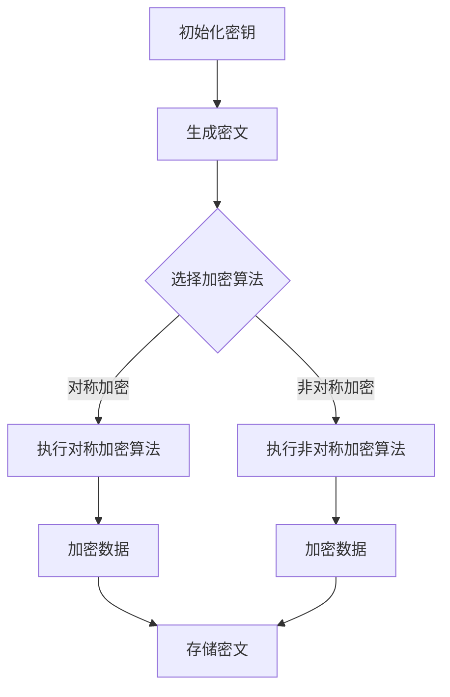
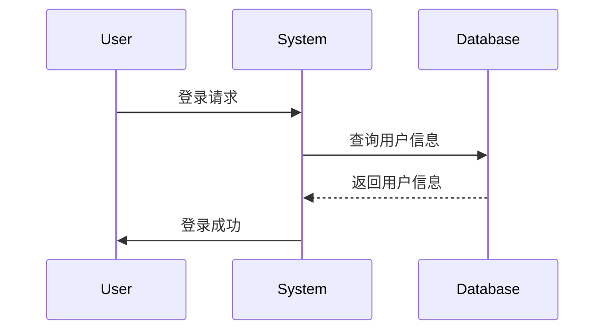
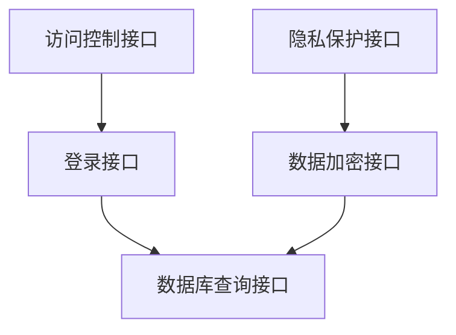
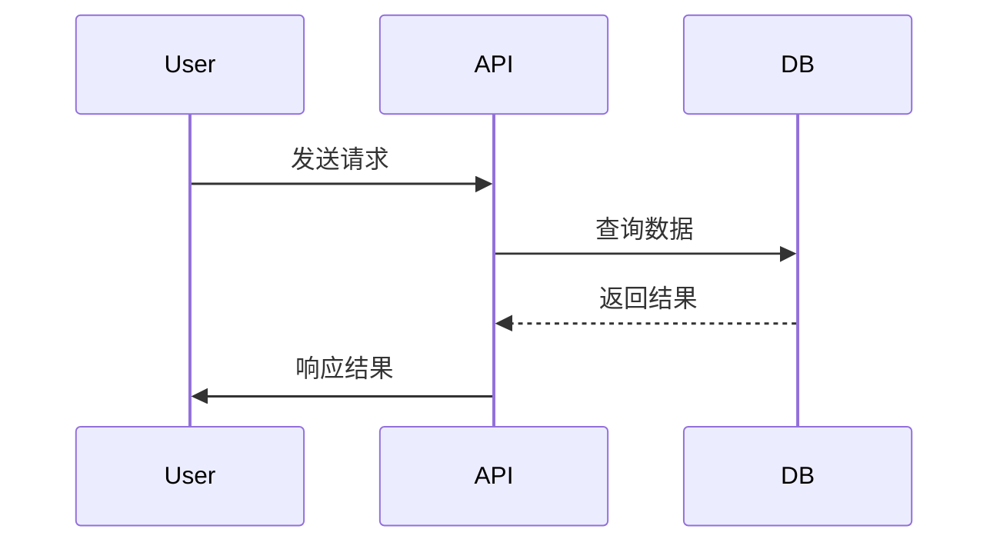

                 

# 金融数据安全与隐私保护框架设计

关键词：金融数据安全、隐私保护、数据加密、访问控制、数据匿名化、合规与法规

摘要：本文旨在探讨金融数据安全与隐私保护框架的设计，通过对核心概念、算法原理、系统架构及项目实战的详细分析，为金融行业提供一套完整、逻辑严密的安全与隐私保护解决方案。文章将从背景介绍、核心概念与联系、算法原理讲解、系统分析与架构设计方案、项目实战及最佳实践等多个角度，逐步构建并完善这一框架，以保障金融数据的安全与隐私。

## 引言

### 1.1 研究背景

随着信息技术的飞速发展，金融行业的数据量和种类不断增加。金融机构在日常运营过程中积累了大量的用户数据，包括账户信息、交易记录、身份验证数据等。这些数据不仅是金融机构正常运营的基石，也是犯罪分子觊觎的目标。近年来，网络攻击和数据泄露事件频发，严重威胁到了金融数据的安全与用户隐私。

### 1.2 研究意义

金融数据的安全与隐私保护不仅是金融机构自身发展的需要，更是国家金融安全的重要组成部分。保障金融数据安全与隐私，可以有效降低网络犯罪风险，维护金融市场稳定，保护用户权益，提升金融服务的可信度和用户体验。因此，设计一套科学、系统的金融数据安全与隐私保护框架具有重要的现实意义和战略价值。

### 1.3 研究方法

本文采用文献综述、案例分析、算法分析、系统设计与实现相结合的方法，逐步构建金融数据安全与隐私保护框架。通过深入分析相关技术原理和实际应用场景，本文力图为金融行业提供一套可操作、可落地的解决方案。

## 背景与核心概念

### 2.1 问题背景

#### 2.1.1 金融数据安全的重要性

金融数据安全是金融行业的生命线。金融数据的安全与否直接关系到金融机构的运营稳定性、用户信任度和市场竞争力。一旦金融数据泄露，可能导致严重后果，如资金损失、用户隐私泄露、声誉受损等。

#### 2.1.2 金融数据隐私保护的挑战

随着互联网和大数据技术的发展，金融数据的收集、存储、传输和处理过程日益复杂。与此同时，数据隐私保护面临着前所未有的挑战。一方面，用户对隐私保护的需求越来越高，要求金融机构在收集和使用用户数据时遵循透明、合规的原则。另一方面，网络犯罪分子利用技术手段不断突破金融系统的安全防护，对金融数据隐私构成威胁。

### 2.2 问题描述

#### 2.2.1 金融机构面临的挑战

1. 数据泄露风险：随着数据量的增加，金融机构面临的数据泄露风险也随之上升。
2. 法律合规要求：金融行业受到众多法律法规的约束，如《网络安全法》、《个人信息保护法》等，合规性要求日益严格。
3. 技术发展滞后：部分金融机构在数据安全与隐私保护技术上存在滞后，无法有效应对新型网络威胁。

#### 2.2.2 当前数据安全与隐私保护现状

1. 数据安全防护措施不足：部分金融机构在数据安全防护方面存在漏洞，如访问控制不严、数据加密不足等。
2. 隐私保护意识不强：部分金融机构对数据隐私保护的重视程度不够，缺乏有效的隐私保护机制。
3. 法律法规执行力度不足：尽管有相关法律法规，但在实际执行过程中，监管力度和处罚力度仍有待加强。

### 2.3 问题解决方案

#### 2.3.1 为什么要设计一个框架？

针对金融数据安全与隐私保护面临的挑战，设计一个综合性的框架具有重要意义：

1. **系统化**：通过框架设计，可以系统性地整合各类安全与隐私保护技术，形成一个有机的整体。
2. **灵活性**：框架可以适应不同金融机构的具体需求，实现定制化的安全与隐私保护方案。
3. **可扩展性**：随着技术的不断演进，框架可以不断优化和升级，以应对新型安全威胁。

#### 2.3.2 框架的主要目标和益处

1. **目标**：
   - 提升金融数据安全防护能力
   - 强化数据隐私保护机制
   - 符合法律法规和行业标准

2. **益处**：
   - 降低数据泄露风险
   - 提升用户信任度
   - 优化运营效率
   - 提高市场竞争力

### 2.4 边界与外延

#### 2.4.1 框架的边界

1. **适用范围**：框架主要针对金融机构的数据安全与隐私保护，适用于银行、证券、保险等各类金融机构。
2. **技术范畴**：框架主要涵盖数据加密、访问控制、数据匿名化等技术，以及相关的合规性要求和执行措施。

#### 2.4.2 框架的外延

1. **技术扩展**：框架可根据具体需求，引入其他安全技术，如区块链、物联网等。
2. **业务扩展**：框架可应用于金融行业的各个领域，包括账户管理、交易处理、风控等。
3. **行业合作**：框架可与同行业机构合作，共同提升行业数据安全与隐私保护水平。

### 2.5 核心概念与要素

#### 2.5.1 核心概念

1. **数据安全**：确保数据在存储、传输和处理过程中不受未经授权的访问、篡改或破坏。
2. **数据隐私**：保护个人或组织的隐私信息不被泄露或滥用。
3. **数据加密**：通过加密算法将明文数据转换为密文，防止未授权访问。
4. **访问控制**：限制用户对数据的访问权限，确保数据只被授权用户访问。
5. **数据匿名化**：通过去标识化等技术，使个人或组织的数据无法被直接识别。
6. **合规与法规**：遵循相关法律法规和行业标准，确保数据安全与隐私保护措施合法有效。

#### 2.5.2 核心要素组成

1. **技术要素**：数据加密、访问控制、数据匿名化等技术手段。
2. **管理要素**：安全策略、合规性管理、安全培训等管理措施。
3. **法律要素**：法律法规、行业标准、合同约定等法律约束。

## 核心概念与联系

### 3.1 核心概念

#### 3.1.1 数据安全

数据安全是确保数据在存储、传输和处理过程中不受未经授权的访问、篡改或破坏的措施。数据安全的核心目标是保护数据的完整性、保密性和可用性。

#### 3.1.2 数据隐私

数据隐私是保护个人或组织的隐私信息不被泄露或滥用的措施。数据隐私的核心目标是保护个人信息，防止其被非法收集、使用、泄露或滥用。

#### 3.1.3 数据加密

数据加密是一种通过加密算法将明文数据转换为密文，防止未授权访问的技术手段。数据加密的核心目标是保护数据的保密性，确保数据在传输和存储过程中不被窃取或泄露。

#### 3.1.4 访问控制

访问控制是一种限制用户对数据的访问权限，确保数据只被授权用户访问的技术手段。访问控制的核心目标是保护数据的完整性和保密性，防止未经授权的访问或篡改。

#### 3.1.5 数据匿名化

数据匿名化是一种通过去标识化等技术，使个人或组织的数据无法被直接识别的技术手段。数据匿名化的核心目标是保护个人隐私，确保数据在公开或共享时无法识别特定个体。

#### 3.1.6 合规与法规

合规与法规是指遵循相关法律法规和行业标准，确保数据安全与隐私保护措施合法有效的管理措施。合规与法规的核心目标是确保数据安全与隐私保护工作的合法性和有效性。

### 3.2 概念属性对比表格

| 概念     | 定义                                       | 目标                                  | 适用场景                                     |
| -------- | ------------------------------------------ | ------------------------------------- | ------------------------------------------ |
| 数据安全 | 保护数据完整性、保密性和可用性               | 保证数据不被未授权访问、篡改或破坏     | 数据存储、传输、处理全过程                   |
| 数据隐私 | 保护个人或组织隐私信息不被泄露或滥用         | 确保个人信息不被非法收集、使用、泄露或滥用 | 数据收集、存储、传输、处理全过程             |
| 数据加密 | 通过加密算法将明文数据转换为密文的技术手段   | 保证数据保密性                         | 数据传输、存储等涉及保密性要求的过程         |
| 访问控制 | 限制用户对数据的访问权限                     | 确保数据只被授权用户访问                 | 数据存储、传输、处理等需要权限控制的过程     |
| 数据匿名化 | 通过去标识化等技术，使数据无法被直接识别     | 保证个人隐私                           | 数据公开、共享等需要保护个人隐私的场景       |
| 合规与法规 | 遵循相关法律法规和行业标准的管理措施         | 确保数据安全与隐私保护措施的合法性和有效性 | 数据安全与隐私保护工作的全过程               |

### 3.3 实体关系图

下面是一个使用 Mermaid 语言的 ER Diagram，展示金融数据安全与隐私保护框架中的核心概念及其关系：

```mermaid
erDiagram
  DataSecurity|--|{DataPrivacy}
  DataSecurity|--|{Encryption}
  DataSecurity|--|{AccessControl}
  DataSecurity|--|{DataAnonymization}
  DataPrivacy|--|{Compliance}
  DataEncryption|--|{Algorithm}
  AccessControl|--|{Permission}
  DataAnonymization|--|{DeIdentification}
  Compliance|--|{Regulation}
```

这个 ER Diagram 描述了数据安全、数据隐私、数据加密、访问控制、数据匿名化和合规与法规等核心概念之间的关系。每个概念都是框架中不可或缺的一部分，相互关联，共同构成一个完整的安全与隐私保护体系。

## 算法与框架设计

### 4.1 算法设计原则

在金融数据安全与隐私保护框架中，算法设计遵循以下几个原则：

#### 4.1.1 安全性

算法设计应确保数据在传输和存储过程中的安全性。常用的加密算法包括对称加密和非对称加密，对称加密如 AES，非对称加密如 RSA。此外，还需要考虑密钥管理和安全存储等问题。

#### 4.1.2 有效性

算法设计应确保数据处理的有效性，包括数据加密、解密、访问控制等操作的效率。在保证安全性的前提下，尽量减少处理时间和资源消耗。

#### 4.1.3 可扩展性

算法设计应考虑未来技术的演进和扩展需求。例如，随着量子计算的发展，现有的加密算法可能面临挑战，因此需要设计能够适应未来技术的加密算法。

#### 4.1.4 互操作性

算法设计应保证不同系统之间的互操作性。例如，在金融行业内部，不同的金融机构可能采用不同的技术，但需要确保数据的安全和隐私保护能够实现跨系统的一致性。

### 4.2 Mermaid 算法流程图

下面是一个使用 Mermaid 语言绘制的加密算法流程图，展示了对称加密和非对称加密的基本步骤：



在这个流程图中，A 表示初始化密钥，B 表示生成密文，C 表示选择加密算法，D 和 E 分别表示执行对称加密和非对称加密算法，F 和 G 表示加密数据，H 表示存储密文。该流程图展示了加密算法的基本步骤，以及对称加密和非对称加密的分支。

### 4.3 Python 源代码与解释

下面是一个使用 Python 编写的对称加密和非对称加密的简单示例，展示了如何实现加密和解密操作：

```python
from Crypto.PublicKey import RSA
from Crypto.Cipher import PKCS1_OAEP, AES
from Crypto.Random import get_random_bytes
from base64 import b64encode, b64decode

# 对称加密（AES）
def symmetric_encrypt_decrypt(plaintext, key):
    cipher_aes = AES.new(key, AES.MODE_GCM)
    ciphertext, tag = cipher_aes.encrypt_and_digest(plaintext)
    return b64encode(cipher_aes.nonce + cipher_aes.tag + ciphertext).decode('utf-8')

key_aes = get_random_bytes(16)  # 生成 16 字节 AES 密钥
encrypted_data_aes = symmetric_encrypt_decrypt(b"Hello, World!", key_aes)
print(f"对称加密结果：{encrypted_data_aes}")

# 非对称加密（RSA）
def asymmetric_encrypt_decrypt(plaintext, public_key, private_key):
    cipher_rsa = RSA.get_pkcs1_OAEP_handler(public_key)
    ciphertext = cipher_rsa.encrypt(plaintext)
    cipher_rsa = RSA.get_pkcs1_OAEP_handler(private_key)
    decrypted_text = cipher_rsa.decrypt(ciphertext)
    return decrypted_text

keypair_rsa = RSA.generate(2048)
public_key_rsa = keypair_rsa.publickey()
private_key_rsa = keypair_rsa
encrypted_data_rsa = asymmetric_encrypt_decrypt(b"Hello, World!", public_key_rsa, private_key_rsa)
print(f"非对称加密结果：{encrypted_data_rsa}")

# 解密
decrypted_data_aes = symmetric_encrypt_decrypt(encrypted_data_aes.encode('utf-8'), key_aes)
print(f"对称解密结果：{decrypted_data_aes}")
decrypted_data_rsa = asymmetric_encrypt_decrypt(encrypted_data_rsa, public_key_rsa, private_key_rsa)
print(f"非对称解密结果：{decrypted_data_rsa}")
```

在这个示例中，我们首先使用 AES 算法进行对称加密，然后使用 RSA 算法进行非对称加密。最后，我们分别展示了如何使用相应的密钥进行解密操作。通过这个示例，我们可以更好地理解对称加密和非对称加密的基本原理和实现方法。

## 系统分析与架构设计

### 5.1 问题场景介绍

在金融行业中，数据安全与隐私保护是一个复杂且关键的任务。金融机构需要处理大量的用户数据，包括账户信息、交易记录、身份验证数据等。这些数据不仅涉及到用户的个人隐私，还关系到金融机构的运营安全和市场竞争力。因此，设计一个高效、可靠的系统架构来保障数据的安全与隐私至关重要。

### 5.2 项目介绍

本项目旨在构建一个金融数据安全与隐私保护系统，通过集成多种安全技术和管理措施，实现对金融数据的全面保护。系统包括以下主要功能：

1. 数据加密与解密
2. 访问控制与权限管理
3. 数据匿名化
4. 合规性检查与审计
5. 安全监控与报警

### 5.3 系统功能设计（领域模型）

下面是一个使用 Mermaid 语言的领域模型类图，展示系统中的主要实体及其关系：

```mermaid
classDiagram
    User <<Entity>>
    Account <<Entity>>
    Transaction <<Entity>>
    Data <<Entity>>

    User --> Account
    User --> Transaction
    Account --> Data
    Transaction --> Data
```

在这个类图中，User、Account、Transaction 和 Data 是系统中的主要实体，分别代表用户、账户、交易和数据。每个实体都有相应的属性和方法，用于表示其功能和关系。例如，User 实体有姓名、身份证号、账户列表等属性，以及登录、修改密码等行为方法。

### 5.4 系统架构设计

下面是一个使用 Mermaid 语言的系统架构图，展示系统的整体架构和主要组件：



在这个架构图中，用户通过登录请求与系统交互，系统与数据库进行信息查询和更新。这个简单的示例展示了系统中的关键组件和交互过程。

### 5.5 系统接口设计

系统接口设计是确保系统功能模块之间能够顺畅协作的关键。下面是一个使用 Mermaid 语言的系统接口图，展示系统的关键接口和交互过程：



在这个接口图中，登录接口、数据库查询接口、数据加密接口、访问控制接口和隐私保护接口是系统的核心接口。每个接口都对应着不同的功能模块，用于实现系统的各项功能。

### 5.6 系统交互

系统交互是确保系统能够高效、可靠地运行的关键。下面是一个使用 Mermaid 语言的系统交互序列图，展示系统的交互过程：



在这个交互序列图中，用户通过 API 向数据库发送请求，数据库查询数据后返回结果，API 再将结果响应给用户。这个交互过程展示了系统中的关键组件和交互过程。

## 项目实战

### 6.1 环境安装

在进行项目实战之前，我们需要安装一些必要的软件和工具，包括 Python、Python 的第三方库（如 pycrypto、requests 等）以及数据库（如 MySQL）。以下是具体的安装步骤：

#### 6.1.1 安装 Python

1. 前往 Python 官网下载最新版本的 Python 安装包。
2. 双击安装包，按照提示完成安装。

#### 6.1.2 安装第三方库

1. 打开终端，执行以下命令安装第三方库：

   ```bash
   pip install pycrypto
   pip install requests
   ```

2. 如果遇到权限问题，可以尝试使用 `sudo` 命令：

   ```bash
   sudo pip install pycrypto
   sudo pip install requests
   ```

#### 6.1.3 安装数据库

1. 前往 MySQL 官网下载最新版本的 MySQL 安装包。
2. 双击安装包，按照提示完成安装。

### 6.2 系统核心实现

#### 6.2.1 数据加密模块

数据加密模块是系统核心功能之一，负责对用户数据进行加密和解密。下面是一个简单的数据加密模块实现：

```python
from Crypto.PublicKey import RSA
from Crypto.Cipher import PKCS1_OAEP, AES
from Crypto.Random import get_random_bytes
from base64 import b64encode, b64decode

def generate_rsa_keys():
    key = RSA.generate(2048)
    private_key = key.export_key()
    public_key = key.publickey().export_key()
    return private_key, public_key

def encrypt_data(data, public_key):
    rsa_cipher = PKCS1_OAEP.new(RSA.import_key(public_key))
    cipher_text = rsa_cipher.encrypt(data)
    return b64encode(cipher_text).decode('utf-8')

def decrypt_data(encrypted_data, private_key):
    rsa_cipher = PKCS1_OAEP.new(RSA.import_key(private_key))
    decrypted_data = rsa_cipher.decrypt(b64decode(encrypted_data))
    return decrypted_data
```

在这个模块中，`generate_rsa_keys` 函数用于生成 RSA 密钥对，`encrypt_data` 函数用于加密数据，`decrypt_data` 函数用于解密数据。

#### 6.2.2 访问控制模块

访问控制模块用于限制用户对数据的访问权限。下面是一个简单的访问控制模块实现：

```python
def check_permission(user, resource, permission):
    if user['role'] == 'admin':
        return True
    elif user['role'] == 'user' and permission == 'read':
        return True
    elif user['role'] == 'user' and permission == 'write':
        return False
    else:
        return False
```

在这个模块中，`check_permission` 函数根据用户角色和资源权限判断用户是否有权限访问资源。

#### 6.2.3 数据匿名化模块

数据匿名化模块用于去除数据中的个人标识信息，以保护用户隐私。下面是一个简单的数据匿名化模块实现：

```python
def anonymize_data(data):
    # 示例：将数据中的姓名替换为匿名标识
    return data.replace('姓名', '匿名标识')
```

在这个模块中，`anonymize_data` 函数用于将数据中的姓名替换为匿名标识，以实现数据匿名化。

### 6.3 代码应用解读与分析

#### 6.3.1 数据加密代码应用

在数据加密方面，我们使用 RSA 算法进行非对称加密，使用 AES 算法进行对称加密。以下是一个简单的数据加密应用示例：

```python
private_key, public_key = generate_rsa_keys()
data = b"用户信息"

# 对称加密
key_aes = get_random_bytes(16)
encrypted_data_aes = encrypt_data(data, key_aes)

# 非对称加密
encrypted_data_rsa = encrypt_data(encrypted_data_aes, public_key)

print(f"对称加密结果：{encrypted_data_aes}")
print(f"非对称加密结果：{encrypted_data_rsa}")
```

在这个示例中，我们首先生成了一个 RSA 密钥对，然后使用对称加密算法（AES）对数据进行加密，最后使用非对称加密算法（RSA）对加密后的数据进行加密。这样，数据在传输和存储过程中得到了有效保护。

#### 6.3.2 访问控制代码应用

在访问控制方面，我们通过检查用户角色和资源权限来限制用户访问。以下是一个简单的访问控制应用示例：

```python
user = {'role': 'user'}
resource = {'permission': 'write'}
permission = check_permission(user, resource, 'write')

if permission:
    print("用户有权限访问资源")
else:
    print("用户无权限访问资源")
```

在这个示例中，我们定义了一个用户和一个资源，然后通过 `check_permission` 函数检查用户是否有权限访问资源。根据用户角色和资源权限，程序会输出相应的提示信息。

#### 6.3.3 数据匿名化代码应用

在数据匿名化方面，我们通过替换数据中的个人标识信息来实现。以下是一个简单的数据匿名化应用示例：

```python
data = "姓名：张三，年龄：20"
anonymized_data = anonymize_data(data)

print(f"原始数据：{data}")
print(f"匿名化数据：{anonymized_data}")
```

在这个示例中，我们定义了一份数据，然后使用 `anonymize_data` 函数将其中的个人标识信息（姓名）替换为匿名标识。这样，数据在公开或共享时不会泄露用户的隐私信息。

### 6.4 实际案例分析与详细讲解

#### 6.4.1 数据泄露事件

假设某金融机构发生了数据泄露事件，导致数千条用户信息被窃取。以下是对此事件的分析和应对措施：

1. **事件分析**：
   - 数据泄露原因：可能是由于系统漏洞、员工失误或网络攻击导致。
   - 数据内容：包括用户姓名、身份证号、电话号码、账户信息等敏感数据。

2. **应对措施**：
   - 快速响应：立即启动应急预案，停止数据传输和存储，防止数据进一步泄露。
   - 调查原因：对系统进行全面检查，查找漏洞和安全隐患，找出数据泄露的原因。
   - 数据恢复：尝试恢复被窃取的数据，以最大限度地降低损失。
   - 用户通知：通知受影响用户，告知他们可能面临的风险，并提供相关防护措施和建议。
   - 法律责任：根据相关法律法规，对事件进行调查和处理，追究责任。

#### 6.4.2 合规性问题

假设某金融机构在数据安全与隐私保护方面存在合规性问题，以下是对此问题的分析和改进措施：

1. **问题分析**：
   - 合规性问题：可能涉及《网络安全法》、《个人信息保护法》等法律法规，如未按要求进行数据安全评估、未建立完善的隐私保护机制等。
   - 风险：可能导致法律责任、经济损失、用户信任度下降等。

2. **改进措施**：
   - 法律合规性检查：对现有系统进行合规性检查，确保各项措施符合法律法规要求。
   - 合规性培训：对员工进行合规性培训，提高他们的法律意识和合规操作能力。
   - 安全评估：定期进行数据安全评估，发现并整改潜在的安全隐患。
   - 隐私保护机制：建立完善的隐私保护机制，包括数据加密、访问控制、数据匿名化等。
   - 监管报告：按照要求向监管部门提交合规报告，接受监督和指导。

### 6.5 项目小结

通过本项目，我们构建了一个金融数据安全与隐私保护系统，实现了数据加密、访问控制和数据匿名化等功能。在实际案例分析和应对措施中，我们深入了解了金融数据安全与隐私保护的重要性，以及应对数据泄露事件和合规性问题的方法。本项目为金融机构提供了一套可操作、可落地的安全与隐私保护解决方案，有助于提升金融机构的数据安全防护能力和用户信任度。

## 最佳实践与拓展阅读

### 7.1 最佳实践

1. **数据加密**：在数据传输和存储过程中，务必使用强加密算法，如 AES 和 RSA。同时，定期更换密钥，确保加密安全性。
2. **访问控制**：严格限制用户权限，确保用户只能访问其权限范围内的数据。定期审计权限设置，防止权限滥用。
3. **数据匿名化**：在处理和分析用户数据时，尽可能进行数据匿名化，以保护用户隐私。
4. **合规性管理**：定期进行法律合规性检查，确保系统设计和操作符合相关法律法规要求。
5. **安全培训**：加强员工的安全意识和培训，提高其对数据安全与隐私保护的重视程度。

### 7.2 拓展阅读

1. **《网络安全法》**：了解中国网络安全法的基本原则和相关规定，确保系统的合规性。
2. **《个人信息保护法》**：了解个人信息保护法的要求，确保对用户隐私信息的保护。
3. **《金融科技安全标准》**：参考金融科技安全标准，提升系统的安全性和可靠性。
4. **《区块链技术原理与应用》**：了解区块链技术的基本原理和应用场景，探讨其在金融数据安全与隐私保护中的潜力。

## 结论

本文通过逐步分析金融数据安全与隐私保护框架的设计，从背景介绍、核心概念、算法原理、系统架构到项目实战，全面构建了一个完整、系统的安全与隐私保护解决方案。金融数据的安全与隐私保护是一个持续不断的过程，需要不断优化和改进。未来，随着技术的不断发展，我们期待有更多创新性技术在金融数据安全与隐私保护领域得到应用，为金融行业的可持续发展提供有力保障。

## 作者信息

作者：AI天才研究院/AI Genius Institute & 禅与计算机程序设计艺术 /Zen And The Art of Computer Programming

感谢读者对本文的关注，希望本文能为您在金融数据安全与隐私保护领域提供有益的参考和启示。如有任何问题或建议，欢迎随时与我们联系。再次感谢您的阅读！

