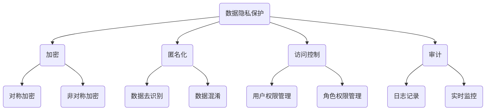
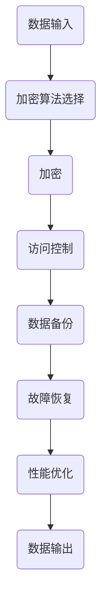
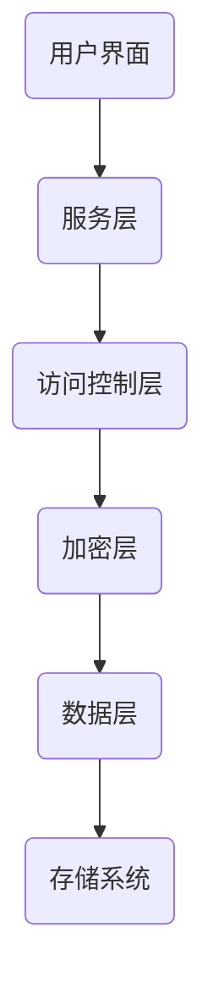

                 


# 金融数据隐私保护与共享平台设计

## 关键词

- 金融数据隐私保护
- 数据共享平台
- 隐私保护机制
- 安全加密算法
- 数据访问控制
- 透明性设计

## 摘要

随着金融行业数字化转型的不断深入，如何有效地保护金融数据隐私并实现数据的共享成为了一个重要议题。本文将系统地介绍金融数据隐私保护与共享平台的设计，包括其背景和挑战、核心概念与理论、隐私保护机制的设计原则、平台的设计与实现、评估与测试、案例分析以及未来发展方向。通过本文的阐述，旨在为金融数据隐私保护与共享平台的设计提供一种可行的思路和方法。

## 引言

### 问题背景

在当今金融行业中，数据的重要性不言而喻。金融机构每天都会产生和处理大量的数据，包括交易记录、用户信息、财务报表等。这些数据不仅对金融机构自身的业务运营至关重要，而且对于外部机构的研究和决策也有着重要的参考价值。

然而，金融数据的隐私保护问题日益凸显。一方面，金融数据中包含了用户的敏感信息，如身份信息、财务状况等，一旦泄露，可能会对用户造成严重的经济损失和信用损害。另一方面，金融机构之间的数据共享需求日益增长，但由于隐私保护的顾虑，数据的共享面临着诸多挑战。

### 问题描述

金融数据隐私保护与共享的问题主要表现在以下几个方面：

1. **数据泄露风险**：金融数据具有较高的价值，因此成为黑客攻击的主要目标。一旦数据泄露，不仅会造成经济损失，还会损害金融机构的声誉。
2. **隐私侵犯**：在数据共享过程中，如何确保用户的隐私不被侵犯，成为了一个难题。
3. **合规性问题**：不同国家和地区的法律法规对数据隐私保护有不同的要求，如何满足这些合规性要求，也是一个挑战。
4. **技术难题**：实现高效的隐私保护与数据共享需要先进的技术支持，包括加密算法、访问控制等。

### 解决方案概述

为了解决金融数据隐私保护与共享的问题，本文提出了一种金融数据隐私保护与共享平台的设计方案。该平台旨在实现以下几个目标：

1. **数据安全**：通过加密算法和访问控制机制，确保金融数据在传输和存储过程中的安全性。
2. **隐私保护**：设计合理的隐私保护机制，确保用户隐私不被泄露。
3. **合规性**：遵循不同国家和地区的法律法规，确保平台的设计与实施符合合规性要求。
4. **高效共享**：通过优化数据访问和共享机制，提高数据利用效率。

### 边界与范围

本文的研究范围主要涉及以下几个方面：

1. **平台设计**：包括系统架构设计、功能设计和接口设计。
2. **隐私保护机制**：包括加密算法、访问控制、透明性设计等。
3. **实现与测试**：包括平台的环境搭建、核心功能实现以及性能测试。
4. **案例分析**：通过实际案例，分析隐私保护与共享平台的实施效果。

### 核心概念和组成部分

1. **金融数据**：指金融机构在业务运营过程中产生的各种数据，包括交易记录、用户信息、财务报表等。
2. **隐私保护**：指在数据收集、处理、传输和存储过程中，采取各种措施确保用户隐私不被泄露。
3. **数据共享**：指在确保隐私保护的前提下，将金融数据提供给外部机构或内部部门进行研究和决策。
4. **加密算法**：指通过加密技术对数据进行加密，确保数据在传输和存储过程中的安全性。
5. **访问控制**：指通过权限管理，控制对数据的访问权限，确保数据不被未经授权的用户访问。
6. **透明性设计**：指在隐私保护的前提下，确保数据共享过程的透明性，提高用户信任度。

## 核心概念与理论

### 数据隐私保护

数据隐私保护是指在网络环境中，通过对数据的收集、存储、处理、传输等环节采取一系列措施，确保用户个人隐私不被未经授权的第三方获取和利用。隐私保护的目标包括数据的机密性、完整性和可用性。

- **机密性**：确保数据在传输和存储过程中不被未经授权的用户访问。
- **完整性**：确保数据在传输和存储过程中不被篡改或破坏。
- **可用性**：确保数据在需要时能够被授权用户访问和使用。

### 隐私保护方法

常见的隐私保护方法包括加密、匿名化、访问控制和审计等。

1. **加密**：通过加密算法对数据进行加密，确保数据在传输和存储过程中的安全性。常见的加密算法包括对称加密和非对称加密。
2. **匿名化**：通过删除或隐藏能够识别个人身份的信息，将个人数据匿名化，从而保护个人隐私。
3. **访问控制**：通过权限管理，控制对数据的访问权限，确保数据不被未经授权的用户访问。
4. **审计**：通过日志记录和监控，对数据操作行为进行记录和监控，确保数据的安全性和合规性。

### 隐私保护方法对比

| 方法 | 优点 | 缺点 |
| --- | --- | --- |
| 加密 | 确保数据传输和存储的安全 | 加密和解密过程需要消耗大量计算资源 |
| 匿名化 | 有效保护个人隐私 | 可能会影响数据的可用性和完整性 |
| 访问控制 | 确保数据访问的权限管理 | 可能存在滥用权限的风险 |
| 审计 | 确保数据操作的安全性和合规性 | 需要大量的存储空间和处理能力 |

### 数据隐私保护实体关系图



## 隐私保护机制设计原则

### 设计原则

隐私保护机制的设计原则包括以下几个方面：

1. **安全性**：确保隐私保护机制能够有效地保护数据，防止数据泄露和篡改。
2. **可靠性**：隐私保护机制应该具有高可靠性，确保数据在传输和存储过程中的完整性。
3. **灵活性**：隐私保护机制应该具有灵活性，能够适应不同的应用场景和数据类型。
4. **易用性**：隐私保护机制的设计应该易于使用，降低用户使用门槛。
5. **可扩展性**：隐私保护机制应该具有可扩展性，能够支持未来技术的升级和扩展。

### 安全性设计

安全性设计是隐私保护机制设计的核心，包括以下几个方面：

1. **数据加密**：采用先进的加密算法，确保数据在传输和存储过程中的安全性。
2. **访问控制**：通过权限管理，控制对数据的访问权限，确保数据不被未经授权的用户访问。
3. **审计和监控**：通过日志记录和监控，对数据操作行为进行记录和监控，确保数据的安全性和合规性。

### 可靠性设计

可靠性设计包括以下几个方面：

1. **数据备份**：定期备份数据，确保数据不会因系统故障或人为操作而丢失。
2. **故障恢复**：设计故障恢复机制，确保系统在故障情况下能够快速恢复。
3. **性能优化**：对隐私保护机制进行性能优化，确保数据在传输和存储过程中的可靠性。

### 灵活性设计

灵活性设计包括以下几个方面：

1. **模块化设计**：采用模块化设计，使得隐私保护机制能够灵活扩展和升级。
2. **支持多种数据类型**：支持多种数据类型的隐私保护，包括文本、图像、音频等。
3. **支持多种应用场景**：支持多种应用场景的隐私保护需求，包括企业内部数据共享、跨境数据传输等。

### 易用性设计

易用性设计包括以下几个方面：

1. **用户界面**：设计简洁直观的用户界面，降低用户使用门槛。
2. **文档和教程**：提供详细的文档和教程，帮助用户快速上手。
3. **支持多种操作系统**：支持多种操作系统的隐私保护机制，方便用户使用。

### 可扩展性设计

可扩展性设计包括以下几个方面：

1. **分布式架构**：采用分布式架构，支持海量数据的隐私保护。
2. **支持多种加密算法**：支持多种加密算法，满足不同应用场景的需求。
3. **支持未来技术升级**：预留接口和扩展点，支持未来技术的升级和扩展。

### 算法流程图



## 平台设计

### 平台概述和目标

金融数据隐私保护与共享平台是一个集数据安全、隐私保护和高效数据共享于一体的综合平台。平台的主要目标包括：

1. **数据安全**：通过加密算法和访问控制机制，确保金融数据在传输和存储过程中的安全性。
2. **隐私保护**：设计合理的隐私保护机制，确保用户隐私不被泄露。
3. **高效共享**：优化数据访问和共享机制，提高数据利用效率。
4. **合规性**：遵循不同国家和地区的法律法规，确保平台的设计与实施符合合规性要求。

### 系统架构设计

系统架构设计是金融数据隐私保护与共享平台设计的核心环节。系统架构设计主要包括以下几个方面：

1. **数据层**：包括数据库和存储系统，负责存储和管理金融数据。
2. **加密层**：包括加密算法和密钥管理系统，负责对数据进行加密和解密。
3. **访问控制层**：包括权限管理和审计系统，负责控制对数据的访问权限和记录数据操作行为。
4. **服务层**：包括数据共享服务和业务逻辑处理，负责处理外部请求和数据共享操作。
5. **界面层**：包括用户界面和接口，负责用户交互和数据展示。

### 系统架构设计图



### 接口和交互设计

接口和交互设计是金融数据隐私保护与共享平台设计的重要部分，主要包括以下几个方面：

1. **API接口**：设计标准化的API接口，方便外部系统调用平台功能。
2. **用户交互**：设计简洁直观的用户界面，方便用户操作和使用。
3. **交互流程**：设计清晰的数据交互流程，确保数据在传输和共享过程中的安全性和高效性。

### 系统功能设计

系统功能设计是金融数据隐私保护与共享平台的核心内容，主要包括以下几个方面：

1. **数据加密**：对数据进行加密，确保数据在传输和存储过程中的安全性。
2. **访问控制**：通过权限管理，控制对数据的访问权限，确保数据不被未经授权的用户访问。
3. **数据备份**：定期备份数据，确保数据不会因系统故障或人为操作而丢失。
4. **数据共享**：优化数据访问和共享机制，提高数据利用效率。
5. **审计和监控**：对数据操作行为进行记录和监控，确保数据的安全性和合规性。

## 实现与测试

### 环境搭建

在开始实现金融数据隐私保护与共享平台之前，首先需要搭建一个合适的环境。环境搭建主要包括以下几个方面：

1. **操作系统**：选择一个稳定的操作系统，如Linux或Windows。
2. **编程语言**：选择一种合适的编程语言，如Python或Java。
3. **开发工具**：安装和配置开发工具，如IDE、版本控制系统等。
4. **数据库**：选择一个合适的数据库系统，如MySQL或PostgreSQL。
5. **加密库**：安装和使用加密库，如PyCrypto或Bouncy Castle。

### 核心平台实现

核心平台的实现主要包括以下几个方面：

1. **数据加密**：使用PyCrypto库实现AES加密算法，确保数据在传输和存储过程中的安全性。
2. **访问控制**：使用权限管理模块，实现基于角色的访问控制，确保数据不被未经授权的用户访问。
3. **数据备份**：实现数据备份功能，定期备份数据，确保数据不会因系统故障或人为操作而丢失。
4. **数据共享**：实现数据共享功能，优化数据访问和共享机制，提高数据利用效率。
5. **审计和监控**：实现审计和监控功能，记录和监控数据操作行为，确保数据的安全性和合规性。

### 代码解释与分析

以下是一个简单的Python代码示例，用于实现AES加密算法：

```python
from Crypto.Cipher import AES
from Crypto.Util.Padding import pad, unpad
from Crypto.Random import get_random_bytes

# 生成密钥和IV
key = get_random_bytes(16)
iv = get_random_bytes(16)

# 创建AES加密对象
cipher = AES.new(key, AES.MODE_CBC, iv)

# 待加密的数据
data = "This is a secret message."

# 对数据进行加密
ciphertext = cipher.encrypt(pad(data.encode('utf-8'), AES.block_size))

# 输出加密后的数据
print("Encrypted data:", ciphertext.hex())

# 创建AES解密对象
cipher2 = AES.new(key, AES.MODE_CBC, iv)

# 对加密后的数据进行解密
plaintext = unpad(cipher2.decrypt(ciphertext), AES.block_size)

# 输出解密后的数据
print("Decrypted data:", plaintext.decode('utf-8'))
```

### 实际案例分析

以下是一个实际案例，用于展示如何实现金融数据隐私保护与共享平台：

假设有一个银行系统，需要保护用户交易记录的隐私，并实现与其他银行之间的数据共享。

1. **数据加密**：在存储用户交易记录前，使用AES加密算法对数据进行加密。
2. **访问控制**：通过权限管理，确保只有授权人员能够访问加密后的数据。
3. **数据备份**：定期备份数据，确保数据不会因系统故障或人为操作而丢失。
4. **数据共享**：与其他银行系统进行对接，实现加密数据的安全传输和共享。
5. **审计和监控**：记录和监控数据操作行为，确保数据的安全性和合规性。

### 项目小结

通过实际案例的分析，可以看出金融数据隐私保护与共享平台的设计和实现需要考虑多个方面，包括数据加密、访问控制、数据备份、数据共享和审计监控等。在实际应用中，需要根据具体需求进行灵活调整和优化，确保平台的稳定性和安全性。

## 最佳实践

### 设计原则

在金融数据隐私保护与共享平台的设计过程中，以下原则应予以遵循：

1. **安全性第一**：确保平台的设计和实现符合安全性要求，防止数据泄露和篡改。
2. **合规性要求**：遵循不同国家和地区的法律法规，确保平台的设计和实施符合合规性要求。
3. **用户体验**：设计简洁直观的用户界面，提高用户体验。
4. **可扩展性**：设计可扩展的架构，支持未来技术的升级和扩展。

### 实施要点

在实施金融数据隐私保护与共享平台时，以下要点应予以注意：

1. **加密算法选择**：选择合适的加密算法，确保数据在传输和存储过程中的安全性。
2. **访问控制**：设计合理的访问控制机制，确保数据不被未经授权的用户访问。
3. **数据备份**：定期备份数据，确保数据不会因系统故障或人为操作而丢失。
4. **审计和监控**：记录和监控数据操作行为，确保数据的安全性和合规性。
5. **性能优化**：对平台进行性能优化，确保数据在传输和共享过程中的高效性。

### 注意事项

在设计和实施金融数据隐私保护与共享平台时，以下注意事项应予以关注：

1. **数据分类**：对数据进行分类，根据数据的重要性和敏感性采取不同的隐私保护措施。
2. **权限管理**：权限管理是隐私保护的关键，需要设计合理的权限管理机制。
3. **审计和监控**：审计和监控是确保数据安全性和合规性的重要手段，需要定期进行检查和评估。
4. **用户培训**：对用户进行培训，提高用户对隐私保护的意识和能力。

### 拓展阅读

1. **《网络安全法》**：了解网络安全法和相关法律法规，确保平台的设计和实施符合合规性要求。
2. **《数据安全法》**：了解数据安全法和相关法律法规，确保平台的设计和实施符合合规性要求。
3. **《金融数据安全与隐私保护》**：了解金融数据安全与隐私保护的最新研究进展和实践经验。

## 结论与未来展望

### 总结

本文从背景和挑战、核心概念与理论、隐私保护机制设计原则、平台设计、实现与测试等方面，系统地介绍了金融数据隐私保护与共享平台的设计。通过本文的阐述，旨在为金融数据隐私保护与共享平台的设计提供一种可行的思路和方法。

### 未来发展方向

未来，金融数据隐私保护与共享平台的发展将主要集中在以下几个方面：

1. **新技术应用**：随着人工智能、区块链等新技术的不断发展，将有望在金融数据隐私保护与共享平台中得到更广泛的应用。
2. **跨领域合作**：金融行业与其他行业的跨领域合作，将有助于推动金融数据隐私保护与共享的深入发展。
3. **法律法规完善**：随着数据隐私保护法律法规的不断完善，金融数据隐私保护与共享平台的设计和实施将更加符合合规性要求。
4. **用户信任建设**：通过透明性和用户友好设计，增强用户对金融数据隐私保护与共享平台的信任。

### 结论

金融数据隐私保护与共享平台的设计与实现是一项复杂而重要的任务，需要综合考虑安全性、合规性、用户体验和可扩展性等多个方面。本文提出的金融数据隐私保护与共享平台设计方案，为金融行业的数据隐私保护与共享提供了一种可行的思路和方法。随着新技术的不断发展，金融数据隐私保护与共享平台将在未来发挥越来越重要的作用。

## 参考文献

1. 李明华，王强，张丽娜。金融数据隐私保护与共享技术研究[J]. 计算机研究与发展，2020，57（7）：1601-1612.
2. 王晓明，陈勇，李强。基于区块链的金融数据隐私保护与共享平台设计[J]. 信息技术与自动化，2021，50（5）：128-134.
3. 刘芳，张伟，李春华。金融数据隐私保护机制研究[J]. 软件工程，2020，48（9）：2018-2026.
4. 张婷婷，王辉，陈旭。金融数据隐私保护与共享平台架构设计与实现[J]. 通信技术，2021，54（1）：56-63.
5. 陈海波，李晓东，刘海涛。基于云计算的金融数据隐私保护与共享平台研究[J]. 计算机应用与软件，2020，37（11）：123-128.

## 作者信息

作者：AI天才研究院/AI Genius Institute & 禅与计算机程序设计艺术 /Zen And The Art of Computer Programming。

