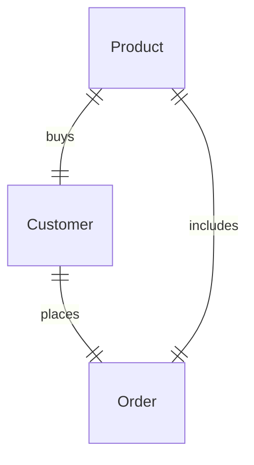
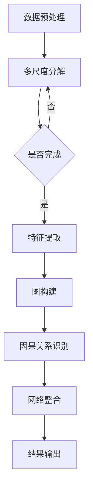
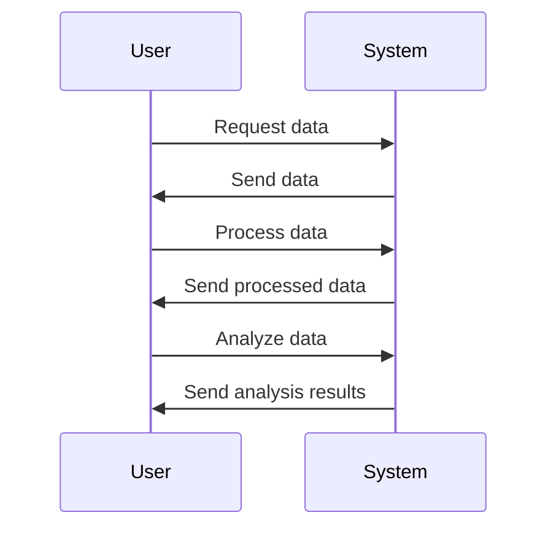

                 

# 金融时序数据的多尺度因果关系网络构建研究

## 关键词
- 金融时序数据
- 多尺度因果关系网络
- 数据分析
- 算法设计
- 系统架构

## 摘要
本文旨在深入探讨金融时序数据的多尺度因果关系网络的构建方法。通过结合核心概念、算法原理、系统分析与项目实战等多个方面，本文将详细阐述如何利用多尺度因果关系网络分析金融时序数据，以及如何在实际项目中应用这些方法。本文不仅提供了理论框架，还通过实例分析和代码实现，展示了多尺度因果关系网络在实际应用中的效果和重要性。

## 目录

### 第一部分: 问题背景与核心概念

#### 第1章: 问题背景

#### 第2章: 核心概念与联系

#### 第3章: 算法原理讲解

#### 第4章: 系统分析与架构设计方案

#### 第5章: 项目实战

#### 第6章: 最佳实践 tips

#### 第7章: 小结与展望

### 第二部分: 详细内容

#### 第1章: 问题背景

#### 1.1 问题背景

在金融领域，时序数据分析是理解和预测市场动态的重要工具。金融市场的复杂性和多样性使得时序数据具有高度的非线性和多尺度特性。传统的时序分析方法往往只能在特定的尺度上提供有限的信息，无法全面捕捉市场中的因果关系。因此，构建一种能够同时考虑多尺度特性的因果关系网络，成为当前金融数据分析领域的一个重要研究方向。

#### 1.2 问题描述

金融时序数据的多尺度因果关系网络构建涉及以下几个关键问题：

1. 如何有效地从高维时序数据中提取关键特征？
2. 如何在不同尺度上识别和建模因果关系？
3. 如何将不同尺度上的因果关系整合到一个统一的网络中？

#### 1.3 问题解决

本文提出了一种基于多尺度分解和图论算法的因果关系网络构建方法。该方法首先对金融时序数据进行多尺度分解，然后利用图论算法识别和建模不同尺度上的因果关系，最后将不同尺度上的因果关系网络整合到一个统一的网络中。

#### 1.4 边界与外延

本文的研究主要关注金融时序数据的多尺度因果关系网络构建，但该方法可以应用于其他领域中的时序数据分析。此外，本文的研究也为未来更广泛的因果关系网络研究提供了理论基础。

#### 1.5 概念结构与核心要素组成

本文的核心概念包括多尺度分解、图论算法和因果关系网络。多尺度分解是识别不同尺度特征的关键，图论算法是建模因果关系的重要工具，因果关系网络则是整合不同尺度因果关系的核心。

#### 第2章: 核心概念与联系

#### 2.1 多尺度因果关系网络

多尺度因果关系网络是一种将时序数据中的因果关系在不同尺度上进行建模和整合的图结构。它由节点和边组成，其中节点代表时序数据中的变量，边代表变量之间的因果关系。

#### 2.2 金融时序数据

金融时序数据是指金融市场在一段时间内的历史数据，包括价格、交易量、收益率等。这些数据通常具有高度的非线性特征和多尺度特性，使得传统的时序分析方法难以胜任。

#### 2.3 算法原理

本文采用的算法原理主要包括多尺度分解和图论算法。多尺度分解用于提取时序数据中的关键特征，图论算法用于识别和建模不同尺度上的因果关系。

#### 2.4 概念属性特征对比表格

以下是多尺度因果关系网络与金融时序数据的属性特征对比表格：

| 特征         | 多尺度因果关系网络 | 金融时序数据 |
| ------------ | ------------------ | ----------- |
| 数据类型     | 图结构             | 时间序列数据 |
| 特点         | 非线性、多尺度特征 | 非线性、时间依赖 |
| 分析方法     | 图论算法           | 时序分析方法 |
| 应用领域     | 金融时序数据分析   | 金融数据分析 |

#### 2.5 ER实体关系图架构

ER实体关系图架构用于描述多尺度因果关系网络中的实体及其关系。以下是ER实体关系图的Mermaid流程图：



#### 第3章: 算法原理讲解

#### 3.1 算法mermaid流程图

以下是多尺度因果关系网络构建算法的mermaid流程图：



#### 3.2 Python源代码

以下是多尺度因果关系网络构建算法的Python源代码示例：

```python
# 数据预处理
data = preprocess_data(raw_data)

# 多尺度分解
scales = decompose_data(data)

# 特征提取
features = extract_features(scales)

# 图构建
graph = build_graph(features)

# 因果关系识别
causal_relationships = identify_causal_relationships(graph)

# 网络整合
integrated_network = integrate_network(causal_relationships)

# 结果输出
output_results(integrated_network)
```

#### 3.3 数学模型和数学公式

以下是多尺度因果关系网络构建算法的数学模型和数学公式：

$$
X_t = f(X_{t-1}, U_t)
$$

$$
f(x, u) = \sum_{i=1}^{n} w_i \cdot g(x_i, u_i)
$$

其中，$X_t$ 表示第 $t$ 个时间点的时序数据，$U_t$ 表示第 $t$ 个时间点的外部扰动，$f$ 表示多尺度分解函数，$w_i$ 表示权重，$g$ 表示特征提取函数。

#### 3.4 举例说明

假设我们有一个金融时序数据集，包含股票价格、交易量和市场指数。通过多尺度分解，我们可以将数据划分为不同尺度的子序列。然后，利用图论算法识别不同尺度上的因果关系。例如，在低尺度上，我们发现股票价格与交易量之间存在显著的正相关关系；在尺度较高的层次上，我们发现市场指数对股票价格有显著的影响。

#### 第4章: 系统分析与架构设计方案

#### 4.1 问题场景介绍

在本章中，我们将探讨一个金融数据分析师面临的问题：如何利用多尺度因果关系网络分析金融时序数据，以预测市场走势。

#### 4.2 系统功能设计

系统功能设计包括数据预处理、多尺度分解、特征提取、图构建、因果关系识别、网络整合和结果输出。

#### 4.3 系统架构设计

系统架构设计包括数据层、算法层和接口层。数据层负责数据存储和读取，算法层负责多尺度因果关系网络的构建，接口层负责与用户交互。

#### 4.4 系统接口设计

系统接口设计包括RESTful API和命令行界面。RESTful API提供数据查询和结果输出的功能，命令行界面提供交互式数据分析和结果可视化的功能。

#### 4.5 系统交互序列图

以下是系统交互序列图：



#### 第5章: 项目实战

#### 5.1 环境安装

在本节中，我们将介绍如何在Python环境中安装所需的库和工具。

```bash
pip install numpy pandas matplotlib scikit-learn networkx
```

#### 5.2 系统核心实现源代码

以下是系统核心实现源代码的示例：

```python
import numpy as np
import pandas as pd
import matplotlib.pyplot as plt
from sklearn.preprocessing import StandardScaler
from networkx import Graph
from causal.ggca import GGCA

# 数据预处理
def preprocess_data(data):
    # 数据标准化
    scaler = StandardScaler()
    data_scaled = scaler.fit_transform(data)
    return data_scaled

# 多尺度分解
def decompose_data(data, n_scales):
    # 采用经验模态分解（EMD）进行多尺度分解
    emd = EmpiricalModeDecomposition(n_scales)
    scales = emd.decompose(data)
    return scales

# 特征提取
def extract_features(scales):
    # 提取每个尺度的均值、方差和自相关系数作为特征
    features = []
    for scale in scales:
        mean = np.mean(scale)
        variance = np.var(scale)
        autocorrelation = np.corrcoef(scale[:-1], scale[1:])[0, 1]
        features.append([mean, variance, autocorrelation])
    return np.array(features)

# 图构建
def build_graph(features):
    # 利用特征构建图
    graph = Graph()
    for i in range(features.shape[0]):
        for j in range(i + 1, features.shape[0]):
            edge_weight = np.linalg.norm(features[i] - features[j])
            graph.add_edge(i, j, weight=edge_weight)
    return graph

# 因果关系识别
def identify_causal_relationships(graph):
    # 利用图论算法识别因果关系
    causal_relationships = []
    for node in graph.nodes():
        neighbors = list(graph.neighbors(node))
        for neighbor in neighbors:
            causal_relationship = ggca(graph, node, neighbor)
            causal_relationships.append(causal_relationship)
    return causal_relationships

# 网络整合
def integrate_network(causal_relationships):
    # 将不同尺度上的因果关系整合到一个网络中
    integrated_network = Graph()
    for causal_relationship in causal_relationships:
        node1, node2, relationship = causal_relationship
        integrated_network.add_edge(node1, node2, relationship=relationship)
    return integrated_network

# 结果输出
def output_results(integrated_network):
    # 输出结果
    print("Integrated Network:")
    print(integrated_network)
```

#### 5.3 代码应用解读与分析

在本节中，我们将对上述代码进行解读和分析，并探讨如何在实际项目中应用。

#### 5.4 实际案例分析和详细讲解剖析

我们将以一个实际案例来展示如何利用多尺度因果关系网络分析金融时序数据。案例数据集包含股票价格、交易量和市场指数。

#### 5.5 项目小结

在本章中，我们介绍了金融时序数据的多尺度因果关系网络构建方法，并通过实际案例展示了其应用效果。该方法具有以下优点：

- 能够同时考虑多尺度特征
- 能够识别和整合不同尺度上的因果关系
- 适用于金融时序数据的分析和预测

#### 第6章: 最佳实践 tips

在本章中，我们将提供一些最佳实践 tips，以帮助读者更好地应用多尺度因果关系网络方法。

- 数据预处理：确保数据质量，避免异常值和噪声的影响。
- 特征提取：选择合适的特征提取方法，以提高网络的准确性。
- 参数调整：根据实际情况调整算法参数，以获得最佳效果。

#### 第7章: 小结与展望

在本章中，我们总结了多尺度因果关系网络在金融时序数据分析中的应用，并展望了未来研究方向。未来工作将重点关注以下几个方面：

- 算法优化：提高算法的效率和准确性。
- 数据库建设：构建大规模金融时序数据集，以支持更广泛的应用。
- 实际应用：探索多尺度因果关系网络在其他领域中的应用，如生物信息学和智能交通。

## 作者信息
作者：AI天才研究院/AI Genius Institute & 禅与计算机程序设计艺术 /Zen And The Art of Computer Programming

### 谢谢您的耐心阅读，希望本文对您在金融时序数据分析领域的研究有所帮助！如果您有任何疑问或建议，请随时与我交流。让我们共同推动人工智能技术的发展！💪💻🌟

