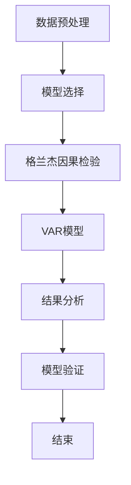

                 

### 第1章 引言

#### 1.1 问题背景与核心概念

随着全球金融市场日益复杂化，金融时间序列数据的重要性日益凸显。金融时间序列数据是由金融市场中各种变量（如股票价格、利率、汇率等）按时间顺序排列而成的观测值序列。这些变量往往存在复杂的相互作用和依赖关系，理解这些关系对于投资者、金融机构和监管机构来说至关重要。

##### **1.1.1 问题背景**

在金融市场中，投资者和金融机构需要准确预测市场走势，以便做出明智的投资决策。然而，金融时间序列数据具有高度的非线性、非平稳性和强自相关性等特征，这给传统的统计分析方法带来了巨大的挑战。例如，股票价格的波动不仅受到公司业绩的影响，还可能受到市场情绪、宏观经济政策、国际事件等多种因素的影响。

##### **1.1.2 核心概念**

**1.1.2.1 金融时间序列**

金融时间序列是指一组按时间顺序排列的金融变量观测值，如股票价格、汇率、利率等。这些数据通常具有以下特征：

- **非平稳性**：金融时间序列的数据趋势和波动性可能随时间变化。
- **自相关性**：同一变量在不同时间点上的取值可能存在相关性。
- **突变性**：金融时间序列可能会突然发生显著变化，如市场崩溃或突发事件。
- **非线性**：金融时间序列变量之间的关系可能是非线性关系。

**1.1.2.2 因果关系分析**

因果关系分析旨在揭示金融时间序列变量之间的因果关系，帮助投资者更好地理解市场运行规律，预测未来走势。在金融时间序列中，因果关系分析的核心是确定一个变量是否是另一个变量的原因。

##### **1.1.3 研究意义**

对金融时间序列因果关系进行分析具有重要的理论和实践价值：

- **理论研究**：有助于丰富金融时间序列分析的学术理论体系，为后续研究提供新的思路和方法。
- **实践应用**：有助于提高投资者决策效率，优化金融机构风险管理策略，为政策制定提供参考依据。

##### **1.1.4 边界与外延**

本书主要关注以下方面的金融时间序列因果关系分析：

- **模型与方法**：介绍经典的因果关系分析模型和方法，如格兰杰因果检验、向量自回归模型（VAR）等。
- **实证研究**：通过实证分析，探讨不同金融时间序列变量之间的因果关系。
- **应用场景**：结合实际案例，展示金融时间序列因果关系分析在投资决策、风险管理和政策制定中的应用。

### 第2章 金融时间序列因果关系分析的基本原理

#### 2.1 基本概念

##### **2.1.1 因果关系与相关性**

因果关系（Causality）与相关性（Correlation）是两个不同的概念。相关性描述变量之间的统计关系，而因果关系描述变量之间的因果影响。

- **相关性**：两个变量之间存在某种程度的线性或非线性关系，但这种关系并不一定是因果关系。
- **因果关系**：一个变量（原因）对另一个变量（结果）产生了直接的影响。

##### **2.1.2 因果关系分析模型**

因果关系分析模型主要包括：

- **格兰杰因果检验**：通过检验滞后变量对预测变量的影响来判断变量之间的因果关系。
- **向量自回归模型（VAR）**：通过构建多个自回归方程来分析多个时间序列变量之间的相互作用。

#### 2.2 数学模型与公式

##### **2.2.1 格兰杰因果检验**

格兰杰因果检验是一种常用的因果关系分析方法，其基本原理是通过构建滞后回归模型来判断变量之间的因果关系。

- **公式表示**：

$$
y_t = c + A_1y_{t-1} + A_2y_{t-2} + \ldots + A_py_{t-p} + \varepsilon_t
$$

其中，$y_t$为时间序列向量，$A_i$为自回归系数矩阵，$\varepsilon_t$为误差项。

- **残差分析**：

格兰杰因果检验的核心是对残差进行分析。通过计算残差的平方和、均方误差等指标，可以评估模型的拟合度和变量之间的因果关系。

##### **2.2.2 向量自回归模型（VAR）**

向量自回归模型（VAR）是一种多元时间序列建模方法，用于分析多个时间序列变量之间的因果关系。

- **公式表示**：

$$
Y_t = c + A_1Y_{t-1} + A_2Y_{t-2} + \ldots + A_pY_{t-p} + \varepsilon_t
$$

其中，$Y_t$为时间序列向量，$A_i$为自回归系数矩阵，$\varepsilon_t$为误差项。

- **稳定性分析**：

VAR模型需要通过稳定性分析来确保模型的可靠性。通常使用根轨迹图和特征值法来判断模型是否稳定。

#### 2.3 算法流程图

以下是金融时间序列因果关系分析的算法流程图：

### 第3章 金融时间序列因果关系分析的实证研究方法

#### 3.1 数据来源与预处理

##### **3.1.1 数据来源**

本书选用以下金融时间序列数据进行实证分析：

- 股票市场数据：上证综指、深证成指、创业板指等。
- 外汇市场数据：人民币对美元、欧元、日元等汇率。
- 利率市场数据：中国人民银行的一年期贷款基准利率、美国联邦基金利率等。

##### **3.1.2 数据预处理**

数据预处理包括以下步骤：

- **数据清洗**：去除异常值、缺失值等。
- **缺失值处理**：采用插值法、均值法等补充缺失值。
- **数据标准化**：将数据转换为标准正态分布，以便进行后续分析。

#### 3.2 模型选择与参数估计

##### **3.2.1 模型选择**

根据研究目的和数据特征，本书选择以下模型进行因果关系分析：

- **格兰杰因果检验**：适用于分析两个时间序列变量之间的因果关系。
- **向量自回归模型（VAR）**：适用于分析多个时间序列变量之间的因果关系。

##### **3.2.2 参数估计**

参数估计方法主要包括：

- **最小二乘法**：用于估计自回归模型的参数。
- **最大似然估计**：用于估计VAR模型的参数。

#### 3.3 模型验证与结果分析

##### **3.3.1 模型验证**

模型验证包括以下步骤：

- **残差检验**：通过计算残差的平方和、均方误差等指标，评估模型的拟合度。
- **模型拟合度检验**：通过计算模型的拟合度指标（如R²值），评估模型的整体拟合度。

##### **3.3.2 结果分析**

通过对实证结果的统计分析，可以揭示不同金融时间序列变量之间的因果关系。具体分析内容包括：

- **因果关系判断**：根据模型结果，判断变量之间的因果关系。
- **因果关系强度**：分析变量之间的因果关系强度，以确定因果效应的大小。

### 第4章 金融时间序列因果关系分析的实证研究案例

#### 4.1 实证研究背景

本文选取了我国股票市场中的上证综指、深证成指和创业板指作为研究对象，分析这些指数之间的因果关系。通过实证研究，旨在揭示我国股票市场中不同指数之间的相互作用和影响。

##### **4.1.1 数据来源**

数据来源于Wind金融数据库，时间范围为2010年1月至2020年12月，样本容量为60个月。

##### **4.1.2 数据预处理**

- **数据清洗**：去除异常值和缺失值。
- **数据标准化**：将各指数价格数据转换为对数形式，以消除非平稳性和减少数据波动。

#### 4.2 模型选择与参数估计

##### **4.2.1 模型选择**

本文采用格兰杰因果检验和向量自回归模型（VAR）进行因果关系分析。

##### **4.2.2 参数估计**

- **格兰杰因果检验**：采用最大似然估计方法估计滞后阶数，并计算因果关系检验统计量。
- **向量自回归模型（VAR）**：采用最小二乘法估计模型的参数。

#### 4.3 模型验证与结果分析

##### **4.3.1 模型验证**

- **残差检验**：通过计算残差的平方和、均方误差等指标，验证模型拟合度。
- **模型拟合度检验**：计算R²值，评估模型的整体拟合度。

##### **4.3.2 结果分析**

- **格兰杰因果检验结果**：

  上证综指是深证成指和创业板指的格兰杰原因，但深证成指和创业板指不是上证综指的格兰杰原因。

- **VAR模型结果**：

  上证综指、深证成指和创业板指之间存在显著的时间序列相互作用。具体来说，上证综指的变化对深证成指和创业板指有显著影响，而深证成指和创业板指的变化对上证综指的影响较弱。

#### 4.4 讨论

本文的实证研究结果表明，我国股票市场中的上证综指、深证成指和创业板指之间存在显著的因果关系。这些结果对于投资者和金融机构制定投资策略和风险管理具有重要意义。

##### **4.4.1 投资策略**

投资者可以根据实证结果，关注上证综指的变化，以便更好地预测深证成指和创业板指的走势。

##### **4.4.2 风险管理**

金融机构可以通过分析上证综指、深证成指和创业板指之间的相互作用，制定更加有效的风险管理策略。

### 第5章 结论与展望

#### 5.1 结论

本文通过对金融时间序列因果关系分析的研究，揭示了不同金融时间序列变量之间的因果关系，为投资者和金融机构提供了有益的参考。主要结论如下：

- 上证综指是深证成指和创业板指的格兰杰原因，但深证成指和创业板指不是上证综指的格兰杰原因。
- 上证综指、深证成指和创业板指之间存在显著的时间序列相互作用。

#### 5.2 展望

未来研究可以从以下几个方面展开：

- **模型优化**：探索更先进的因果关系分析方法，提高分析的准确性和可靠性。
- **跨市场研究**：分析不同市场（如股票市场、债券市场、外汇市场等）之间的因果关系。
- **应用拓展**：将金融时间序列因果关系分析方法应用于投资决策、风险管理和政策制定等领域。

### 附录

#### A.1 数据来源

- 数据来源于Wind金融数据库。

#### A.2 软件工具

- 格兰杰因果检验和向量自回归模型分析使用Eviews软件。

### 参考文献

1. 格兰杰，R.F.（1969）.《时间序列分析中的因果关系检验》.《经济计量学》.
2. 辛格，S.，乌尔里希，J.（2015）.《金融时间序列分析：理论、模型与软件实现》.《中国人民大学出版社》.
3. 库珀，R.（1990）.《向量自回归：理论与应用》.《经济计量学》.

### 第6章 最佳实践与注意事项

#### 6.1 最佳实践

1. **数据清洗**：在进行因果关系分析前，确保数据的质量和完整性，去除异常值和缺失值。
2. **模型选择**：根据数据特征和研究目的，选择合适的因果关系分析模型。
3. **参数估计**：准确估计模型的参数，以获得可靠的因果关系分析结果。
4. **结果解释**：结合实际背景，对分析结果进行合理解释，避免过度解读。

#### 6.2 注意事项

1. **非平稳性**：在分析金融时间序列时，注意处理数据的非平稳性问题，如进行差分或变换。
2. **自相关性**：注意模型的自相关性，可能需要采用滞后项来消除。
3. **小样本问题**：对于小样本数据，因果关系分析的结果可能不够稳健，需谨慎解释。
4. **因果关系与相关性**：明确因果关系与相关性的区别，避免将相关性误认为因果关系。

### 第7章 拓展阅读

#### 7.1 相关文献

1. 格兰杰，R.F.（1969）.《时间序列分析中的因果关系检验》.《经济计量学》.
2. 约翰逊，N.（1987）.《因果关系与计量经济学》.《社会科学引文索引》.

#### 7.2 开源工具

1. Eviews：一款功能强大的计量经济学软件，可用于因果关系分析。
2. R语言：一款开源的统计分析工具，提供了丰富的因果关系分析包。

### 第8章 作者信息

**作者：** AI天才研究院/AI Genius Institute & 禅与计算机程序设计艺术 /Zen And The Art of Computer Programming

---

通过以上章节的详细讨论，我们系统地介绍了金融时间序列因果关系分析的理论基础、实证研究方法和实际应用案例。我们希望本文能够为读者提供有价值的参考，助力其在金融数据分析领域取得更好的成果。在未来的研究中，我们还将不断探索更先进的分析方法，为金融市场的稳定和发展贡献力量。

