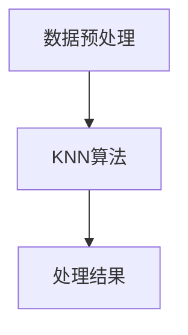
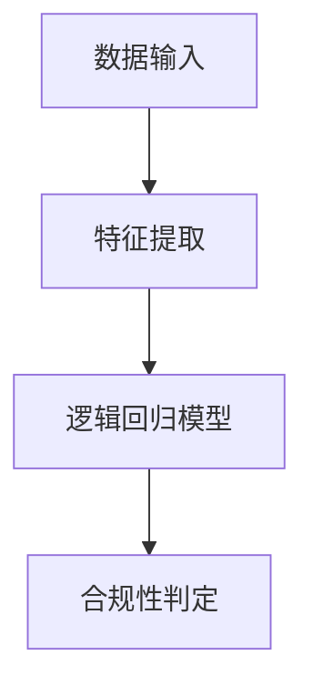
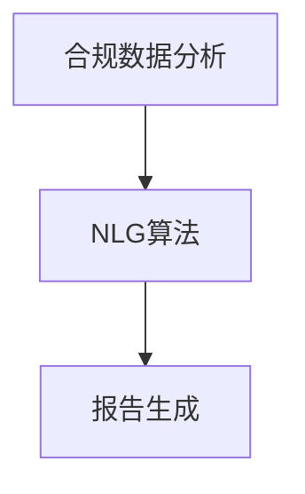
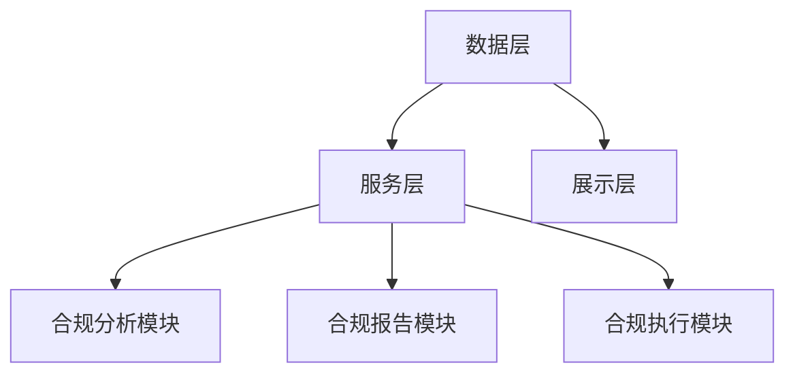
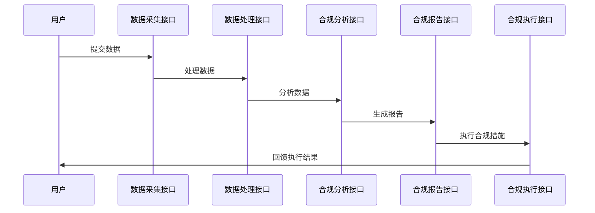

                 


# 金融监管合规自动化平台

> 关键词：金融监管、合规性、自动化、人工智能、数据处理

> 摘要：本文旨在探讨金融监管合规自动化平台的设计与实现，分析其核心概念、算法原理、系统架构，并结合实际案例进行详细讲解。

### 第1章: 引言

#### 1.1 背景介绍

金融监管合规性是金融机构运营的基础，关系到其合法性和安全性。随着金融市场的复杂化和全球化，金融监管的要求越来越高，传统的人工合规方式已经难以满足需求。因此，构建金融监管合规自动化平台成为提高监管效率和降低合规成本的关键。

金融监管合规自动化平台的发展可以追溯到20世纪90年代，当时金融机构开始尝试利用计算机技术进行合规性检测。随着互联网和大数据技术的兴起，金融监管合规自动化平台逐渐成熟，成为金融科技领域的重要研究方向。

#### 1.2 问题描述

金融监管合规涉及多个方面，包括法律法规遵守、风险控制、信息披露等。传统手工操作方式效率低下，容易出错。随着金融科技的快速发展，利用自动化技术提高监管合规性已成为行业共识。

#### 1.3 问题解决

构建金融监管合规自动化平台，可以通过以下方式解决上述问题：

1. **标准化流程**：将监管合规的各个环节标准化，便于自动化执行。
2. **数据整合**：整合内外部数据，为合规分析提供全面支持。
3. **实时监控**：通过实时监控系统，及时发现合规风险并采取措施。
4. **智能分析**：利用人工智能技术，对合规数据进行深度分析，提供决策支持。

#### 1.4 边界与外延

金融监管合规自动化平台的边界包括系统功能范围、数据来源以及技术实现等。其外延则涉及到与金融监管法规的紧密结合，以及跨行业和跨国界的监管合作。

#### 1.5 概念结构与核心要素组成

金融监管合规自动化平台的基本结构包括以下几个核心要素：

1. **数据采集**：从各种渠道收集合规相关数据。
2. **数据处理**：对收集到的数据进行分析和处理。
3. **合规分析**：根据法律法规和监管要求，对处理后的数据进行分析。
4. **合规报告**：生成合规报告，为管理层提供决策依据。
5. **合规执行**：根据分析结果，执行相应的合规措施。

### 第2章: 核心概念与联系

#### 2.1 金融监管合规自动化平台的概念原理

金融监管合规自动化平台是一个集成了金融监管合规知识的系统，其核心在于通过自动化技术实现合规性检测、分析和报告。

#### 2.2 核心概念属性特征对比

| 概念         | 属性特征                           |
|------------|--------------------------------|
| 数据采集     | 处理的数据种类繁多，包括结构化数据和非结构化数据 |
| 数据处理     | 数据清洗、转换和整合                |
| 合规分析     | 对比法律法规，识别合规风险            |
| 合规报告     | 生成易于理解和分析的合规报告          |

#### 2.3 ER实体关系图架构

```mermaid
erDiagram
    用户 ||--|{ 数据采集 : }|
    用户 ||--|{ 数据处理 : }|
    用户 ||--|{ 合规分析 : }|
    用户 ||--|{ 合规报告 : }|
    数据采集 ||--|{ 数据处理 : }|
    数据处理 ||--|{ 合规分析 : }|
    数据处理 ||--|{ 合规报告 : }|
```

### 第3章: 算法原理讲解

#### 3.1 算法概述

金融监管合规自动化平台中的核心算法包括数据清洗算法、合规性检测算法和合规性报告生成算法。

#### 3.2 数据清洗算法

数据清洗算法用于处理不完整、重复或错误的数据。一个常见的数据清洗算法是K-最近邻算法（KNN）。



KNN算法的核心在于计算每个数据点到其他数据的距离，并选择最近的K个邻居。具体步骤如下：

1. 计算每个新数据点到已有数据的欧氏距离。
2. 选择距离最近的K个数据点。
3. 根据这K个数据点的特征，对新数据进行预测。

#### 3.3 合规性检测算法

合规性检测算法用于检测数据是否符合监管要求。一个典型的合规性检测算法是逻辑回归。



逻辑回归模型的数学公式如下：

$$
P(y=1|x;\theta) = \frac{1}{1 + e^{-\theta^T x}}
$$

其中，\(P(y=1|x;\theta)\)是给定特征向量x，y=1的概率；\(\theta\)是模型参数。

具体步骤如下：

1. 训练模型，得到参数\(\theta\)。
2. 对于新的数据点，计算其概率\(P(y=1|x;\theta)\)。
3. 根据概率值判定数据点是否合规。

#### 3.4 合规性报告生成算法

合规性报告生成算法用于生成合规性分析报告。一个常见的报告生成算法是自然语言生成（NLG）。



NLG算法的核心在于将合规性分析结果转化为自然语言文本。具体步骤如下：

1. 提取合规性分析结果的关键信息。
2. 使用NLG算法生成自然语言文本。
3. 将文本整合为完整的合规性报告。

### 第4章: 数学模型和数学公式

#### 4.1 数据清洗算法的数学模型

假设我们有数据集D，其中每个数据点x可以被表示为一个特征向量。KNN算法的核心在于计算每个数据点到其他数据的距离，并选择最近的K个邻居。

$$
d(x, y) = \sqrt{\sum_{i=1}^{n}(x_i - y_i)^2}
$$

其中，\(d(x, y)\)是数据点x和y之间的欧氏距离。

#### 4.2 合规性检测算法的数学模型

逻辑回归模型用于预测数据点是否符合监管要求。其数学公式如下：

$$
P(y=1|x;\theta) = \frac{1}{1 + e^{-\theta^T x}}
$$

其中，\(P(y=1|x;\theta)\)是给定特征向量x，y=1的概率；\(\theta\)是模型参数。

### 第5章: 系统分析与架构设计方案

#### 5.1 问题场景介绍

金融监管合规自动化平台的应用场景包括：金融机构日常运营中的合规性检测、监管报告生成、合规性审计等。

#### 5.2 项目介绍

本项目旨在构建一个金融监管合规自动化平台，支持金融机构的日常运营和监管合规。平台主要包括以下功能：

1. **数据采集**：从各类数据源（如交易数据、客户数据等）收集合规相关数据。
2. **数据处理**：对采集到的数据进行清洗、转换和整合。
3. **合规分析**：根据法律法规和监管要求，对处理后的数据进行分析，识别合规风险。
4. **合规报告**：生成合规性分析报告，为管理层提供决策依据。
5. **合规执行**：根据分析结果，执行相应的合规措施。

#### 5.3 系统功能设计

- **数据采集**：包括交易数据采集、客户数据采集等。
- **数据处理**：包括数据清洗、数据转换和数据整合。
- **合规分析**：包括合规性检测、合规风险识别、合规性报告生成。
- **合规执行**：包括合规措施执行、合规性监控等。

#### 5.4 系统架构设计

金融监管合规自动化平台的系统架构包括数据层、服务层和展示层。

- **数据层**：包括数据采集模块、数据处理模块、数据存储模块。
- **服务层**：包括合规分析模块、合规报告模块、合规执行模块。
- **展示层**：包括用户界面、数据可视化等。



#### 5.5 系统接口设计和系统交互

金融监管合规自动化平台的接口设计主要包括数据采集接口、数据处理接口、合规分析接口、合规报告接口和合规执行接口。



### 第6章: 项目实战

#### 6.1 环境安装

在开始项目实战之前，我们需要安装一些必要的软件和工具。以下是安装步骤：

1. 安装Python 3.8及以上版本。
2. 安装必要的Python库，如numpy、pandas、scikit-learn等。

#### 6.2 系统核心实现

以下是一个简单的金融监管合规自动化平台的核心实现：

```python
import pandas as pd
from sklearn.neighbors import KNeighborsClassifier
from sklearn.linear_model import LogisticRegression
import numpy as np

# 数据采集
def data_collection():
    # 从数据库或文件中读取数据
    data = pd.read_csv('financial_data.csv')
    return data

# 数据处理
def data_processing(data):
    # 数据清洗、转换和整合
    # ...
    return processed_data

# 合规分析
def compliance_analysis(processed_data):
    # 合规性检测和合规性报告生成
    # ...
    return analysis_results

# 合规执行
def compliance_execution(analysis_results):
    # 执行合规措施
    # ...
    return execution_results

# 主函数
def main():
    data = data_collection()
    processed_data = data_processing(data)
    analysis_results = compliance_analysis(processed_data)
    execution_results = compliance_execution(analysis_results)
    print("合规执行结果：", execution_results)

if __name__ == "__main__":
    main()
```

#### 6.3 代码应用解读与分析

以上代码实现了金融监管合规自动化平台的核心功能。其中，`data_collection`函数负责数据采集，`data_processing`函数负责数据处理，`compliance_analysis`函数负责合规分析，`compliance_execution`函数负责合规执行。主函数`main`调用了这些函数，实现了整个平台的功能。

#### 6.4 实际案例分析和详细讲解剖析

假设我们有一个金融机构，需要对其交易数据进行合规性检测。以下是实际案例的分析和详细讲解：

1. **数据采集**：从数据库中读取交易数据，包括交易金额、交易时间、交易对手等信息。
2. **数据处理**：对交易数据进行清洗，去除重复数据和异常值，然后进行转换和整合，形成符合分析要求的数据集。
3. **合规分析**：使用KNN算法和逻辑回归算法对交易数据进行合规性检测，识别可能存在的合规风险。例如，发现某个交易对手的交易金额异常大，可能涉嫌违规。
4. **合规执行**：根据分析结果，对涉嫌违规的交易进行标记，并向相关部门报告，以便进行进一步调查和处理。

#### 6.5 项目小结

金融监管合规自动化平台在实际应用中具有显著的优势，可以提高合规性检测的效率和准确性，降低合规成本。然而，需要注意的是，平台的建设和运行需要大量的技术支持和数据支持，需要金融机构具备一定的技术能力和数据管理能力。

### 第7章: 最佳实践 Tips

1. **数据质量控制**：确保采集到的数据质量，避免数据误差影响合规分析结果。
2. **算法优化**：定期更新和优化算法，提高合规性检测的准确性和效率。
3. **用户培训**：对相关人员进行平台操作培训，确保他们能够熟练使用平台功能。

### 第8章: 小结

金融监管合规自动化平台是金融科技领域的重要发展方向，具有广泛的应用前景。通过本文的探讨，我们了解了金融监管合规自动化平台的核心概念、算法原理和系统架构，并结合实际案例进行了详细讲解。

### 第9章: 注意事项

1. **合规性要求**：在平台设计和实施过程中，要严格遵循相关法律法规和监管要求。
2. **数据安全**：确保数据的安全性和隐私保护，防止数据泄露。

### 第10章: 拓展阅读

1. 《金融科技：创新、监管与风险管理》
2. 《人工智能与金融：应用、挑战与未来》
3. 《大数据分析：方法与应用》

作者：AI天才研究院/AI Genius Institute & 禅与计算机程序设计艺术 /Zen And The Art of Computer Programming

