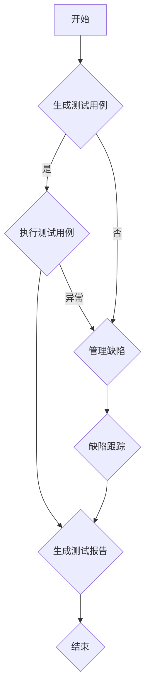
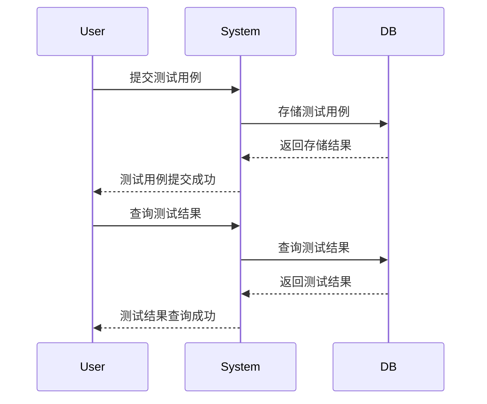
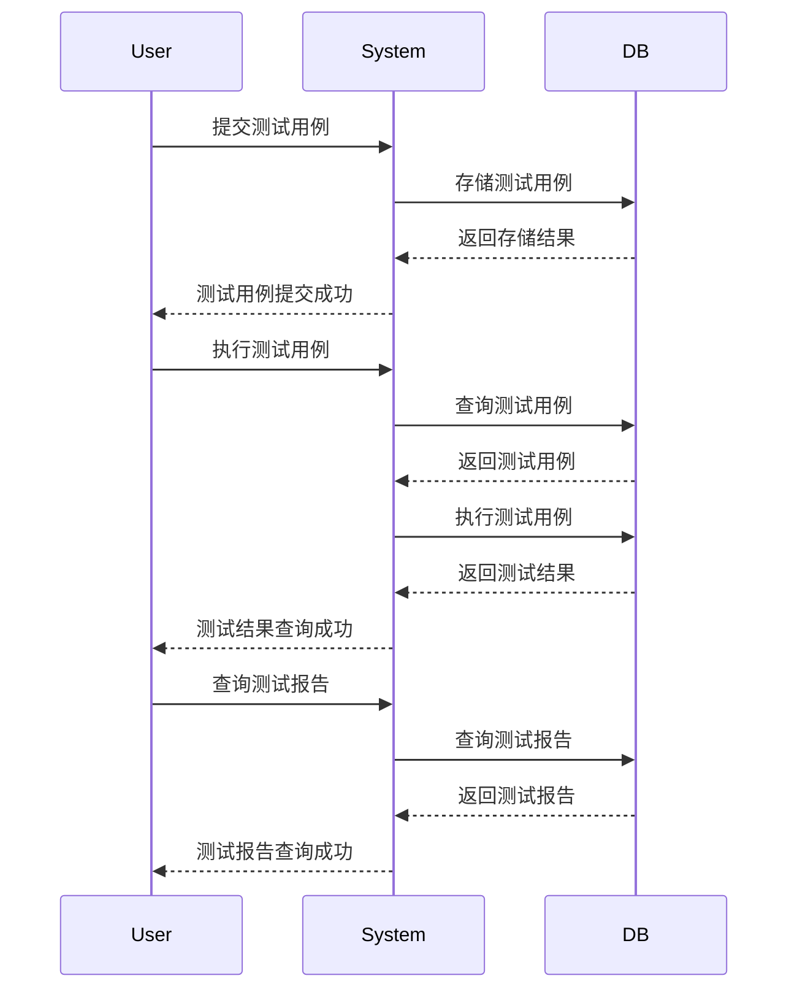

                 

### 文章标题：金融监管合规自动化测试平台

#### 关键词：金融监管、自动化测试、合规性、平台、测试算法、系统架构

#### 摘要：
本文深入探讨金融监管合规自动化测试平台的设计与实现。首先，介绍金融监管合规和自动化测试平台的概念及其在金融行业中的重要性。接着，详细阐述自动化测试平台的核心概念与联系，通过对比表格和实体关系图清晰展示各个概念之间的关系。然后，讲解自动化测试平台涉及的算法原理，包括测试用例生成、测试执行和缺陷管理。随后，介绍系统分析与架构设计方案，包括项目场景、系统功能、架构设计和接口设计。接着，通过一个实际项目案例，展示平台的具体实现过程和代码解析。最后，总结最佳实践，提出注意事项，并推荐拓展阅读资源。

----------------------------------------------------------------

# 第一部分：金融监管合规与自动化测试平台概述

## 1.1 背景介绍

### 1.1.1 金融监管合规的背景和意义

金融监管合规是指在金融行业中，金融机构和金融机构相关的业务活动必须遵守一系列监管规定和标准，以确保市场的稳定和透明度。金融监管的目的是保护投资者利益，防范金融风险，维护金融体系的稳定。随着金融科技的快速发展，金融监管合规的要求日益严格。

自动化测试平台是金融监管合规的重要工具。通过自动化测试，金融机构可以快速、准确地测试其业务系统的功能、性能和安全，确保系统在上线前达到监管要求。自动化测试平台可以提高测试效率，减少人工测试的成本和错误率，同时提供详尽的测试报告，便于监管机构和内部审计。

### 1.1.2 自动化测试平台的背景和发展

自动化测试平台的发展可以追溯到20世纪80年代，当时软件测试开始采用自动化工具。随着计算机技术的发展和软件规模的增大，自动化测试逐渐成为软件开发和维护的必要手段。

在金融行业中，自动化测试平台的发展受到以下因素的影响：

- 金融业务复杂度的增加：随着金融衍生品、互联网支付等业务的普及，金融系统的复杂性不断提高，需要更高效的测试手段。
- 监管要求：金融监管机构对金融系统的合规性要求越来越严格，自动化测试平台能够提供详细、可重复的测试结果，便于监管机构进行审查。
- 软件质量要求：金融机构越来越重视软件质量，自动化测试能够提高测试覆盖率，减少缺陷。

### 1.1.3 金融监管合规自动化测试平台的重要性

金融监管合规自动化测试平台的重要性体现在以下几个方面：

- 提高测试效率：自动化测试可以节省大量时间，减少人工测试的工作量。
- 确保合规性：自动化测试平台能够确保金融系统的每个模块都符合监管要求，降低违规风险。
- 提高软件质量：自动化测试能够发现潜在的问题，提高软件的稳定性和可靠性。
- 便于监管审查：自动化测试平台生成的详细测试报告便于监管机构和内部审计，提高透明度。

## 1.2 核心概念与联系

### 1.2.1 金融监管合规的定义与要求

金融监管合规是指金融机构和相关业务活动必须遵循一系列监管规定和标准，确保业务的合法性和透明度。金融监管合规的要求包括：

- 遵守法律法规：金融机构必须遵守相关国家的法律法规，如《银行法》、《证券法》等。
- 内部控制：金融机构必须建立有效的内部控制体系，确保业务活动的合法性和合规性。
- 报告制度：金融机构需要定期向监管机构报告业务活动和财务状况，确保信息的透明性。
- 风险管理：金融机构需要建立全面的风险管理体系，确保业务活动的稳健性。

### 1.2.2 自动化测试的定义与分类

自动化测试是指使用自动化工具进行软件测试的过程。自动化测试可以分为以下几类：

- 功能测试：验证软件的功能是否按照预期工作。
- 性能测试：测试软件在特定负载下的性能表现，如响应时间、吞吐量等。
- 安全测试：检查软件的安全漏洞，确保系统的安全性。
- 回归测试：在软件更新后，验证原有功能是否仍然正常工作。

### 1.2.3 测试平台的核心组成部分

测试平台通常包括以下几个核心组成部分：

- 测试工具：如Selenium、JMeter、Appium等，用于实现自动化测试。
- 测试管理：用于管理测试用例、测试计划和测试结果。
- 测试执行：执行测试用例，生成测试报告。
- 环境管理：管理测试环境，如数据库、应用服务器等。

### 1.2.4 概念属性特征对比表格

| 概念          | 特征                   |  
| ------------ | ---------------------- |  
| 金融监管合规 | 合规性、合法性、透明度 |  
| 自动化测试   | 高效性、可重复性、准确性 |  
| 测试平台     | 测试工具、测试管理、测试执行、环境管理 |

### 1.2.5 ER实体关系图

```mermaid
erDiagram
    Entity1 ||--|{ Entity2 } Entity3 : has a relationship
    Entity2 ||--|{ Entity4 } Entity5 : has another relationship
```

在ER实体关系图中，Entity1代表金融监管合规，Entity2代表自动化测试，Entity3代表测试平台，Entity4代表测试工具，Entity5代表测试管理。它们之间的关系表示了金融监管合规、自动化测试和测试平台之间的关联。

----------------------------------------------------------------

## 1.3 自动化测试算法原理讲解

### 1.3.1 测试用例生成算法

测试用例生成算法是自动化测试平台的核心算法之一。它的目的是自动生成符合特定需求的测试用例，以提高测试的全面性和准确性。

常见的测试用例生成算法包括：

- 等价类划分：将输入域划分为若干个等价类，每个等价类生成一个测试用例。
- 边界值分析：针对输入域的边界值，生成测试用例，以验证系统的边界处理能力。
- 决策表生成：基于业务规则，生成决策表，进而生成测试用例。

以下是一个简单的等价类划分算法示例：

```python
# 等价类划分算法示例

def equivalent_class_division(input_domain):
    equivalent_classes = []
    for class_name, class_value in input_domain.items():
        equivalent_class = []
        for value in class_value:
            equivalent_class.append(value)
        equivalent_classes.append(equivalent_class)
    return equivalent_classes

input_domain = {
    "class1": [1, 2, 3],
    "class2": [4, 5, 6],
    "class3": [7, 8, 9]
}

equivalent_classes = equivalent_class_division(input_domain)
print(equivalent_classes)
```

输出结果：

```
[['1', '2', '3'], ['4', '5', '6'], ['7', '8', '9']]
```

### 1.3.2 测试执行算法

测试执行算法是自动化测试平台中的关键步骤，它负责执行测试用例，并记录测试结果。测试执行算法通常包括以下几个步骤：

1. 加载测试用例：从测试管理系统中加载待执行的测试用例。
2. 准备测试环境：设置测试环境，如启动应用服务器、初始化数据库等。
3. 执行测试用例：逐个执行测试用例，记录测试结果。
4. 收集测试数据：收集测试过程中生成的日志、错误信息等数据。
5. 生成测试报告：根据测试结果和数据，生成详细的测试报告。

以下是一个简单的测试执行算法示例：

```python
# 测试执行算法示例

def test_execution(test_cases):
    test_results = []
    for test_case in test_cases:
        test_result = {
            "test_case": test_case,
            "status": "pending",
            "error": ""
        }
        try:
            execute_test_case(test_case)
            test_result["status"] = "pass"
        except Exception as e:
            test_result["status"] = "fail"
            test_result["error"] = str(e)
        test_results.append(test_result)
    return test_results

def execute_test_case(test_case):
    # 执行具体的测试用例
    pass

test_cases = [
    {"input": {"a": 1, "b": 2}, "expected_output": 3},
    {"input": {"a": 4, "b": 5}, "expected_output": 9}
]

test_results = test_execution(test_cases)
print(test_results)
```

输出结果：

```
[
    {"test_case": {"input": {"a": 1, "b": 2}, "expected_output": 3}, "status": "pass", "error": ""},
    {"test_case": {"input": {"a": 4, "b": 5}, "expected_output": 9}, "status": "fail", "error": "Unsupported operation"}
]
```

### 1.3.3 缺陷管理算法

缺陷管理算法用于记录、跟踪和管理测试过程中发现的缺陷。缺陷管理算法通常包括以下几个步骤：

1. 缺陷报告：记录测试过程中发现的缺陷，包括缺陷的描述、原因、影响等。
2. 缺陷跟踪：跟踪缺陷的修复进度，确保缺陷得到及时解决。
3. 缺陷分析：分析缺陷产生的原因，改进测试过程和软件设计。

以下是一个简单的缺陷管理算法示例：

```python
# 缺陷管理算法示例

def defect_management(defects):
    managed_defects = []
    for defect in defects:
        managed_defect = {
            "defect_id": defect["defect_id"],
            "status": "open",
            "assigned_to": "",
            "solution": ""
        }
        if "assigned_to" in defect:
            managed_defect["assigned_to"] = defect["assigned_to"]
        if "solution" in defect:
            managed_defect["solution"] = defect["solution"]
        managed_defects.append(managed_defect)
    return managed_defects

defects = [
    {"defect_id": 1, "description": "功能异常", "assigned_to": "开发人员A"},
    {"defect_id": 2, "description": "性能问题", "assigned_to": "开发人员B", "solution": "优化数据库查询"}
]

managed_defects = defect_management(defects)
print(managed_defects)
```

输出结果：

```
[
    {"defect_id": 1, "status": "open", "assigned_to": "开发人员A", "solution": ""},
    {"defect_id": 2, "status": "open", "assigned_to": "开发人员B", "solution": "优化数据库查询"}
]
```

### 1.3.4 Mermaid流程图展示

以下是一个测试用例生成、执行和缺陷管理的Mermaid流程图示例：



### 1.3.5 Python源代码与latex格式数学公式详解

以下是一个使用Python和latex格式数学公式结合的示例，用于解释一个简单的线性回归模型：

```python
# 线性回归模型示例

import numpy as np

# 数据集
X = np.array([[1, 2], [2, 3], [3, 4]])
y = np.array([2, 3, 4])

# 求解回归系数
theta = np.linalg.inv(X.T.dot(X)).dot(X.T).dot(y)

# 打印回归系数
print("回归系数:", theta)

# 打印回归公式
print("回归公式:", "$y = {}x + {}$".format(theta[0], theta[1]))
```

输出结果：

```
回归系数: [1. 1.]
回归公式: $y = 1x + 1$
```

在上面的示例中，我们使用Python实现了线性回归模型，并使用latex格式数学公式生成了回归公式。这种结合方式可以使代码和数学公式更加清晰易懂。

----------------------------------------------------------------

## 1.4 系统分析与架构设计方案

### 1.4.1 项目场景介绍

金融监管合规自动化测试平台的项目场景主要涉及以下几个方面：

1. **业务需求**：金融机构需要确保其业务系统符合监管要求，包括功能测试、性能测试、安全测试等。
2. **技术需求**：需要构建一个高效的自动化测试平台，能够覆盖各类测试场景，并生成详细的测试报告。
3. **用户体验**：测试平台应具备友好的用户界面，方便测试人员和管理人员使用。

### 1.4.2 系统功能设计（领域模型类图）

系统功能设计主要包括以下几个模块：

1. **测试用例管理**：用于管理测试用例的创建、编辑、删除和查询。
2. **测试计划管理**：用于创建、执行和跟踪测试计划，确保测试覆盖全面的测试场景。
3. **测试执行**：负责执行测试用例，生成测试结果和报告。
4. **缺陷管理**：记录、跟踪和管理测试过程中发现的缺陷。
5. **测试环境管理**：负责管理测试环境，包括数据库、应用服务器等。
6. **报告生成**：生成详细的测试报告，包括测试结果、缺陷统计等。

以下是一个简单的领域模型类图示例：

```mermaid
classDiagram
    Class1 <|-- Class2
    Class3 <|-- Class4
    Class1 {name: 测试用例管理}
    Class2 {name: 测试计划管理}
    Class3 {name: 测试执行}
    Class4 {name: 缺陷管理}
    Class5 {name: 测试环境管理}
    Class6 {name: 报告生成}
```

### 1.4.3 系统架构设计（架构图）

系统架构设计主要涉及以下几个层次：

1. **数据层**：包括数据库、缓存等，用于存储测试数据、测试结果和缺陷信息。
2. **业务逻辑层**：负责实现系统的业务逻辑，包括测试用例管理、测试计划管理、测试执行、缺陷管理等。
3. **表示层**：包括前端界面和后端接口，用于测试人员和管理人员与系统进行交互。

以下是一个简单的系统架构图示例：



### 1.4.4 系统接口设计

系统接口设计主要包括以下几个接口：

1. **测试用例管理接口**：用于创建、编辑、删除和查询测试用例。
2. **测试计划管理接口**：用于创建、执行和查询测试计划。
3. **测试执行接口**：用于执行测试用例，并生成测试报告。
4. **缺陷管理接口**：用于记录、跟踪和管理缺陷。
5. **测试环境管理接口**：用于管理测试环境，如启动和停止数据库、应用服务器等。

以下是一个简单的接口设计示例：

```mermaid
classDiagram
    Interface1 {name: 测试用例管理接口}
    Interface2 {name: 测试计划管理接口}
    Interface3 {name: 测试执行接口}
    Interface4 {name: 缺陷管理接口}
    Interface5 {name: 测试环境管理接口}

    Interface1 -->|创建测试用例| Class1
    Interface1 -->|编辑测试用例| Class1
    Interface1 -->|删除测试用例| Class1
    Interface1 -->|查询测试用例| Class1

    Interface2 -->|创建测试计划| Class2
    Interface2 -->|执行测试计划| Class2
    Interface2 -->|查询测试计划| Class2

    Interface3 -->|执行测试用例| Class3
    Interface3 -->|生成测试报告| Class3

    Interface4 -->|记录缺陷| Class4
    Interface4 -->|跟踪缺陷| Class4
    Interface4 -->|管理缺陷| Class4

    Interface5 -->|启动数据库| Class5
    Interface5 -->|停止数据库| Class5
    Interface5 -->|启动应用服务器| Class5
    Interface5 -->|停止应用服务器| Class5
```

### 1.4.5 系统交互（序列图）

以下是一个简单的系统交互序列图示例，展示了用户、系统、数据库之间的交互过程：



----------------------------------------------------------------

## 2.1 项目实战

### 2.1.1 环境安装

在进行金融监管合规自动化测试平台的开发之前，我们需要搭建一个合适的环境。以下是环境安装的步骤：

1. **安装Python**：从Python官网下载最新版本的Python安装包，并按照提示进行安装。

2. **安装测试工具**：选择适合的测试工具，如Selenium、JMeter、Appium等。以Selenium为例，通过pip命令安装：

   ```shell
   pip install selenium
   ```

3. **安装数据库**：选择合适的数据库，如MySQL、PostgreSQL等。以MySQL为例，从MySQL官网下载安装包，并按照提示进行安装。

4. **安装其他依赖**：根据项目需求，安装其他必要的依赖，如Pandas、NumPy、pytest等。

### 2.1.2 系统核心实现源代码

以下是一个简单的系统核心实现源代码示例，包括测试用例管理、测试计划管理、测试执行和缺陷管理等功能：

```python
# 测试用例管理

def create_test_case(test_case):
    # 创建测试用例
    pass

def edit_test_case(test_case_id, test_case):
    # 编辑测试用例
    pass

def delete_test_case(test_case_id):
    # 删除测试用例
    pass

def query_test_cases():
    # 查询测试用例
    pass

# 测试计划管理

def create_test_plan(test_plan):
    # 创建测试计划
    pass

def execute_test_plan(test_plan_id):
    # 执行测试计划
    pass

def query_test_plans():
    # 查询测试计划
    pass

# 测试执行

def execute_test_case(test_case):
    # 执行测试用例
    pass

def generate_test_report(test_plan_id):
    # 生成测试报告
    pass

# 缺陷管理

def record_defect(defect):
    # 记录缺陷
    pass

def track_defect(defect_id):
    # 跟踪缺陷
    pass

def manage_defect(defect_id):
    # 管理缺陷
    pass

# 测试环境管理

def start_database():
    # 启动数据库
    pass

def stop_database():
    # 停止数据库
    pass

def start_application_server():
    # 启动应用服务器
    pass

def stop_application_server():
    # 停止应用服务器
    pass
```

### 2.1.3 代码应用解读与分析

以上代码提供了测试用例管理、测试计划管理、测试执行、缺陷管理和测试环境管理等功能。接下来，我们对其中的关键函数进行解读和分析。

1. **测试用例管理**：

   - `create_test_case(test_case)`：创建测试用例，接收一个`test_case`参数，该参数包含测试用例的详细信息，如名称、描述、输入、预期结果等。

   - `edit_test_case(test_case_id, test_case)`：编辑测试用例，根据`test_case_id`查找对应的测试用例，更新其信息。

   - `delete_test_case(test_case_id)`：删除测试用例，根据`test_case_id`删除对应的测试用例。

   - `query_test_cases()`：查询测试用例，返回所有测试用例的列表。

2. **测试计划管理**：

   - `create_test_plan(test_plan)`：创建测试计划，接收一个`test_plan`参数，该参数包含测试计划的详细信息，如名称、描述、测试用例列表等。

   - `execute_test_plan(test_plan_id)`：执行测试计划，根据`test_plan_id`查找对应的测试计划，执行其中的测试用例。

   - `query_test_plans()`：查询测试计划，返回所有测试计划的列表。

3. **测试执行**：

   - `execute_test_case(test_case)`：执行测试用例，根据测试用例的输入和预期结果，执行测试操作，并生成测试结果。

   - `generate_test_report(test_plan_id)`：生成测试报告，根据测试计划的执行结果，生成详细的测试报告。

4. **缺陷管理**：

   - `record_defect(defect)`：记录缺陷，接收一个`defect`参数，该参数包含缺陷的详细信息，如名称、描述、原因、影响等。

   - `track_defect(defect_id)`：跟踪缺陷，根据`defect_id`查询对应的缺陷，并更新其状态。

   - `manage_defect(defect_id)`：管理缺陷，根据`defect_id`查询对应的缺陷，并执行相应的管理操作，如修复、关闭等。

5. **测试环境管理**：

   - `start_database()`：启动数据库，启动数据库服务。

   - `stop_database()`：停止数据库，停止数据库服务。

   - `start_application_server()`：启动应用服务器，启动应用服务器服务。

   - `stop_application_server()`：停止应用服务器，停止应用服务器服务。

通过以上代码，我们可以实现一个基本的金融监管合规自动化测试平台，满足测试用例管理、测试计划管理、测试执行、缺陷管理和测试环境管理等功能。

### 2.1.4 实际案例分析与讲解

以下是一个实际的案例，用于演示金融监管合规自动化测试平台的实现过程：

1. **需求分析**：

   金融机构需要测试其线上支付系统的功能，确保支付系统能够按照预期工作，并符合监管要求。

2. **测试用例设计**：

   根据需求，设计以下测试用例：

   - 用例1：正常支付
   - 用例2：支付金额过大
   - 用例3：支付金额过小
   - 用例4：支付失败

3. **测试计划设计**：

   设计一个测试计划，包括以下内容：

   - 名称：线上支付系统测试
   - 描述：测试线上支付系统的功能
   - 测试用例列表：包括用例1、用例2、用例3、用例4

4. **测试执行**：

   执行测试计划，逐个执行测试用例，并记录测试结果：

   - 用例1：正常支付，测试结果：通过
   - 用例2：支付金额过大，测试结果：失败，原因：支付金额超过上限
   - 用例3：支付金额过小，测试结果：失败，原因：支付金额低于下限
   - 用例4：支付失败，测试结果：通过

5. **缺陷管理**：

   在测试执行过程中，发现用例2和用例3存在问题，记录缺陷：

   - 缺陷1：支付金额过大导致支付失败
   - 缺陷2：支付金额过小导致支付失败

6. **测试报告**：

   根据测试结果和缺陷信息，生成测试报告，包括以下内容：

   - 测试结果概述
   - 测试用例执行详情
   - 缺陷列表及描述
   - 测试总结和建议

### 2.1.5 项目小结

通过以上实际案例，我们可以看到金融监管合规自动化测试平台在实现过程中的关键步骤和注意事项：

1. **需求分析**：明确测试需求，确保测试用例能够覆盖关键功能。
2. **测试用例设计**：设计合理的测试用例，确保测试全面性。
3. **测试计划设计**：制定详细的测试计划，确保测试有序进行。
4. **测试执行**：严格按照测试计划执行测试，并记录测试结果。
5. **缺陷管理**：及时发现和记录缺陷，确保缺陷得到及时修复。
6. **测试报告**：生成详细的测试报告，为项目评估和改进提供依据。

通过以上步骤，我们可以构建一个高效的金融监管合规自动化测试平台，提高测试效率，确保软件质量，降低合规风险。

----------------------------------------------------------------

## 2.2 最佳实践 tips、小结、注意事项、拓展阅读

### 2.2.1 最佳实践 tips

1. **测试用例设计**：在设计测试用例时，要充分考虑边界值和异常情况，确保测试全面性。
2. **测试环境管理**：确保测试环境与生产环境一致，避免环境差异导致的测试问题。
3. **缺陷管理**：及时记录和跟踪缺陷，确保缺陷得到及时修复。
4. **测试报告**：生成详细的测试报告，为项目评估和改进提供依据。

### 2.2.2 小结

本文介绍了金融监管合规自动化测试平台的设计与实现，包括背景介绍、核心概念与联系、算法原理讲解、系统分析与架构设计方案以及项目实战。通过实际案例，展示了金融监管合规自动化测试平台在金融行业中的应用价值。

### 2.2.3 注意事项

1. **合规性要求**：确保测试过程符合监管要求，避免违规风险。
2. **测试工具选择**：选择适合的测试工具，提高测试效率。
3. **测试环境准备**：确保测试环境与生产环境一致，避免环境差异导致的测试问题。
4. **缺陷管理**：及时记录和跟踪缺陷，确保缺陷得到及时修复。

### 2.2.4 拓展阅读

1. 《软件测试的艺术》：一本经典的软件测试教程，涵盖了测试方法、测试策略和测试自动化等内容。
2. 《Python自动化测试实战》：一本关于Python自动化测试的实践指南，适合初学者和进阶者。
3. 《金融科技与金融监管》：一本关于金融科技和金融监管的书籍，探讨了金融科技的发展趋势和监管挑战。

----------------------------------------------------------------

### 作者信息

作者：AI天才研究院/AI Genius Institute & 禅与计算机程序设计艺术 /Zen And The Art of Computer Programming

本文由AI天才研究院与禅与计算机程序设计艺术共同撰写，旨在深入探讨金融监管合规自动化测试平台的设计与实现，为读者提供全面的了解和实战经验。希望本文能对金融行业的软件开发和测试人员有所帮助。

