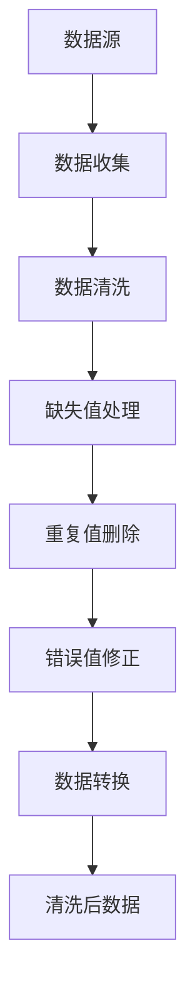
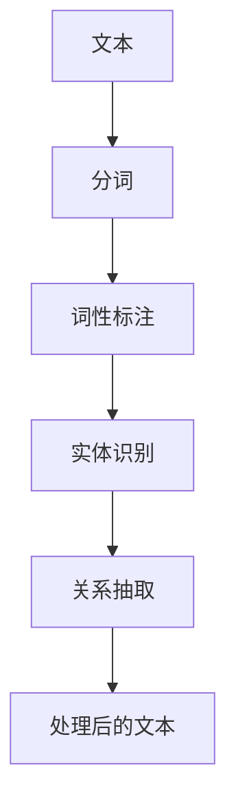
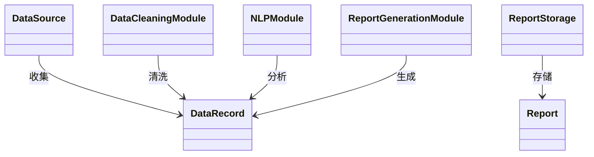
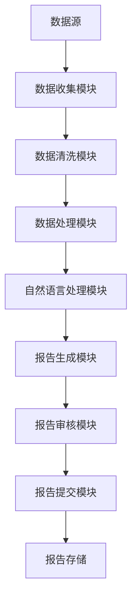
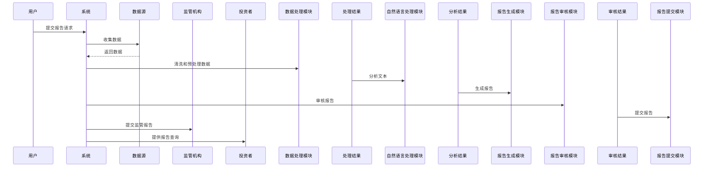

                 

### 金融监管报告自动化生成：引言

在金融行业中，监管报告的重要性不言而喻。金融机构需要定期提交各种合规报告，以展示其运营状况、财务状况和风险状况。这些报告不仅有助于监管机构监督金融机构的合规性，也方便投资者了解机构的运营情况。然而，传统的报告生成方式往往耗时耗力，且容易出错。

当前，金融监管报告的生成通常涉及以下几个步骤：首先，从各种数据源（如交易记录、财务报表等）收集数据；接着，对这些数据进行清洗、整理和统计分析；然后，按照既定的格式和要求，将这些数据转换为报告；最后，由专业人员审核并提交报告。这个过程不仅复杂，而且容易出现数据错误、格式错误等问题，影响报告的准确性和及时性。

为了解决这些问题，我们需要一种更加高效、准确的报告生成方式——自动化生成。自动化生成不仅能够减少人为错误，提高报告的准确性，还能大大缩短报告生成的时间，降低成本。本书旨在探讨如何实现金融监管报告的自动化生成，包括所需的技术基础、自动化流程设计、算法原理讲解、数学模型与公式、系统分析与架构设计，以及实际项目实战等。

### 关键词

- 金融监管报告
- 自动化生成
- 技术基础
- 数据处理
- 自然语言处理
- 机器学习
- 系统架构设计
- 项目实战

### 摘要

本文将详细探讨金融监管报告自动化生成的全过程。首先，我们将介绍金融监管报告的重要性以及当前报告生成流程的挑战。接着，我们将讨论自动化生成报告的目标和预期收获。随后，文章将逐步深入技术基础、自动化流程设计、算法原理讲解、数学模型与公式、系统分析与架构设计，以及实际项目实战。最后，我们将总结最佳实践、注意事项和拓展阅读，以帮助读者更好地理解和应用金融监管报告自动化生成技术。通过本文的阅读，读者将能够掌握自动化生成金融监管报告的完整流程，提高工作效率，降低成本，提升报告质量。

### 第1章：引言

#### 1.1 问题背景

金融监管报告在金融行业中扮演着至关重要的角色。这些报告不仅展示了金融机构的运营状况、财务状况和风险状况，也为监管机构和投资者提供了重要的信息。金融机构需要定期提交各种合规报告，如财务报表、风险报告、交易报告等，以满足监管要求。然而，传统的报告生成方式通常存在以下挑战：

1. **人工操作繁琐**：传统的报告生成依赖于人工操作，包括数据收集、数据清洗、数据分析和报告撰写等。这不仅耗时耗力，而且容易出错。
2. **数据质量问题**：数据收集过程中可能存在缺失、重复、错误等质量问题，这些都会影响报告的准确性和可靠性。
3. **报告格式不统一**：不同机构和监管要求可能导致报告格式不一致，增加了报告生成的难度。
4. **报告提交不及时**：由于人工操作的繁琐和错误，报告生成时间较长，可能导致无法按时提交，影响金融机构的合规性。

#### 1.2 书籍目的

本书旨在解决金融监管报告生成过程中的挑战，实现自动化生成，以提高报告的准确性、及时性和效率。具体目标包括：

1. **降低人工操作**：通过自动化流程，减少人工干预，降低错误率，提高工作效率。
2. **提高数据质量**：通过数据清洗和预处理技术，确保数据的准确性和一致性，提高报告质量。
3. **统一报告格式**：通过标准化报告模板和格式，简化报告生成过程，减少格式错误。
4. **缩短报告生成时间**：通过自动化流程，加快报告生成速度，确保按时提交报告。

#### 1.3 内容概述

本书将分为以下几个部分：

1. **技术基础**：介绍实现金融监管报告自动化生成所需的技术基础，包括数据收集与处理、自然语言处理和机器学习等。
2. **自动化流程设计**：详细讲解金融监管报告的自动化流程设计，包括报告模板设计、数据处理流程和报告生成流程等。
3. **算法原理讲解**：介绍数据清洗和自然语言处理算法的原理，包括算法流程、数学模型和Python代码示例等。
4. **数学模型与公式**：阐述数据清洗和自然语言处理算法的数学模型和公式，帮助读者更好地理解算法原理。
5. **系统分析与架构设计**：介绍金融监管报告自动生成系统的系统分析、架构设计和接口设计，包括领域模型、架构图和序列图等。
6. **项目实战**：通过实际项目案例，展示金融监管报告自动生成系统的实现过程，包括环境安装、核心实现和案例解析等。
7. **最佳实践与拓展**：总结金融监管报告自动生成的最佳实践，讨论注意事项，并提供拓展阅读，以帮助读者深入学习和应用。

通过本书的阅读，读者将能够掌握金融监管报告自动化生成的完整流程，提高工作效率，降低成本，提升报告质量。

#### 第2章：技术基础

实现金融监管报告的自动化生成，需要依赖于一系列先进的技术。这些技术不仅能够提高报告的准确性，还能显著提升生成效率。本章将详细介绍实现自动化生成所需的技术基础，包括数据收集与处理、自然语言处理和机器学习等。

##### 2.1 数据收集与处理

数据是金融监管报告的核心，因此数据收集与处理是自动化生成过程中的关键步骤。

**数据源选择**

金融监管报告所需的数据来源于多个渠道，包括金融机构的内部数据库、外部数据提供商、市场数据和监管机构公布的数据等。选择合适的数据源对于确保数据的准确性和完整性至关重要。

**数据清洗方法**

收集到的数据通常存在各种质量问题，如数据缺失、重复、错误和不一致等。数据清洗是数据预处理的重要步骤，目的是去除数据中的噪音，提高数据质量。常见的数据清洗方法包括：

- **缺失值处理**：对于缺失的数据，可以选择删除缺失值或使用统计方法（如平均值、中位数、众数等）进行填充。
- **重复值删除**：识别并删除重复的数据记录，确保数据的唯一性。
- **错误值修正**：纠正数据中的错误，如日期格式错误、数字精度错误等。
- **数据转换**：将数据转换为统一的格式和单位，以便后续处理和分析。

##### 2.2 自然语言处理

自然语言处理（NLP）是自动化生成金融监管报告的重要技术之一。NLP涉及到计算机如何理解、处理和生成人类语言。

**基本概念**

- **分词**：将文本分割成单词或短语，以便进行进一步处理。
- **词性标注**：为文本中的每个词分配词性，如名词、动词、形容词等。
- **实体识别**：识别文本中的特定实体，如人名、组织名、地点等。
- **关系抽取**：从文本中提取实体之间的关系，如“苹果公司”和“苹果”之间的关系。

**应用场景**

- **报告撰写**：利用NLP技术，自动生成报告中的文本部分，如摘要、分析、结论等。
- **文本分析**：对报告文本进行分析，提取关键信息，如风险指标、财务状况等。

##### 2.3 机器学习基础

机器学习是自动化生成金融监管报告的重要技术，它能够通过训练模型来自动化数据分析和报告生成。

**模型选择**

- **监督学习**：适用于有标签数据的情况，如分类和回归任务。
- **无监督学习**：适用于无标签数据的情况，如聚类和降维任务。
- **强化学习**：适用于决策优化任务，如自动调整报告模板参数。

**模型训练**

- **数据准备**：选择合适的数据集，进行数据预处理，包括数据清洗、特征工程等。
- **模型选择**：根据任务需求选择合适的模型，如决策树、支持向量机、神经网络等。
- **模型训练**：使用训练数据集对模型进行训练，调整模型参数，优化模型性能。
- **模型评估**：使用验证数据集评估模型性能，调整模型参数，确保模型准确性和泛化能力。

通过以上技术基础，我们能够构建一个高效、准确的金融监管报告自动化生成系统。接下来的章节将进一步详细介绍这些技术的应用和实现过程。

#### 第3章：自动化流程设计

实现金融监管报告的自动化生成，关键在于流程的设计。本章将详细介绍自动化流程设计的各个环节，包括报告模板设计、数据处理流程和报告生成流程。

##### 3.1 报告模板设计

报告模板是金融监管报告自动化生成的核心组成部分，它定义了报告的结构、格式和内容。设计一个合理的报告模板，能够确保报告的一致性和规范性。

**模板结构**

报告模板通常包括以下几个部分：

- **封面**：包含报告标题、日期、报告机构等信息。
- **目录**：列出报告的各个章节和小节，方便读者快速定位。
- **摘要**：对报告的主要内容进行简短概述。
- **引言**：介绍报告的背景和目的。
- **正文**：包括报告的主要内容和分析。
- **结论**：对报告内容进行总结和结论。
- **附录**：包含报告的相关数据和参考资料。

**模板参数**

报告模板中包含若干参数，用于定义报告的格式和内容。常见的模板参数包括：

- **字体和字号**：定义报告中的字体和字号，确保格式统一。
- **行距和段间距**：调整报告的行距和段间距，提高可读性。
- **图表和图像**：定义报告中的图表和图像的位置和格式。
- **引用和参考文献**：定义报告中的引用和参考文献格式。

##### 3.2 数据处理流程

数据处理流程是自动化生成金融监管报告的核心环节，它包括数据收集、数据清洗、数据分析和数据可视化等步骤。

**数据收集**

数据收集是数据处理的第一步，目标是从各种数据源（如数据库、数据文件、API接口等）获取所需的数据。数据收集过程中需要确保数据的完整性和准确性。

**数据清洗**

数据清洗是数据处理的重要步骤，目的是去除数据中的噪音，提高数据质量。常见的数据清洗方法包括缺失值处理、重复值删除、错误值修正和数据转换等。

**数据分析**

数据分析是对清洗后的数据进行处理和分析，提取有用的信息。数据分析方法包括统计方法、机器学习算法和自然语言处理技术等。

**数据可视化**

数据可视化是将分析结果以图表、图像等形式呈现，帮助读者更好地理解和分析数据。常见的数据可视化工具包括Excel、Python的Matplotlib和Seaborn库等。

##### 3.3 报告生成流程

报告生成流程是将处理后的数据按照模板格式生成报告的过程。报告生成流程包括以下几个步骤：

1. **数据加载**：从数据源中加载清洗后的数据。
2. **数据预处理**：对数据进行预处理，如格式转换、数据排序等。
3. **内容生成**：根据模板和预处理后的数据，生成报告的各个部分。
4. **报告排版**：对生成的报告进行排版，确保格式规范和美观。
5. **报告审核**：由专业人员对生成的报告进行审核，确保报告的准确性和完整性。
6. **报告提交**：将审核通过的报告提交给监管机构或投资者。

通过以上自动化流程设计，我们能够高效、准确地生成金融监管报告。下一章将深入讲解数据清洗和自然语言处理算法的原理和应用。

#### 第4章：算法原理讲解

在金融监管报告自动化生成过程中，数据清洗和自然语言处理算法扮演着关键角色。本章将详细介绍这些算法的原理，包括其工作流程、Mermaid流程图以及Python代码示例。

##### 4.1 数据清洗算法

数据清洗是确保数据质量的重要步骤，常见的数据清洗算法包括缺失值处理、重复值删除、错误值修正和数据转换等。

**算法原理**

- **缺失值处理**：常用的缺失值处理方法包括删除缺失值、填充缺失值（如平均值、中位数、众数等）、插值等。
- **重复值删除**：通过识别和删除重复的数据记录，确保数据的唯一性。
- **错误值修正**：修正数据中的错误，如日期格式错误、数字精度错误等。
- **数据转换**：将数据转换为统一的格式和单位，以便后续处理和分析。

**Mermaid流程图**



**Python代码示例**

```python
import pandas as pd

# 加载数据
data = pd.read_csv('data.csv')

# 缺失值处理
data.fillna(data.mean(), inplace=True)

# 重复值删除
data.drop_duplicates(inplace=True)

# 错误值修正
data['date'] = pd.to_datetime(data['date'], errors='coerce')

# 数据转换
data['amount'] = data['amount'].astype(float)
```

##### 4.2 自然语言处理算法

自然语言处理算法用于分析和生成文本内容，常见的NLP算法包括分词、词性标注、实体识别和关系抽取等。

**算法原理**

- **分词**：将文本分割成单词或短语，以便进行进一步处理。
- **词性标注**：为文本中的每个词分配词性，如名词、动词、形容词等。
- **实体识别**：识别文本中的特定实体，如人名、组织名、地点等。
- **关系抽取**：从文本中提取实体之间的关系，如“苹果公司”和“苹果”之间的关系。

**Mermaid流程图**



**Python代码示例**

```python
import jieba
import nltk

# 加载中文分词模型
jieba.load_userdict('userdict.txt')

# 分词
text = '苹果公司的股价今天上涨了5%。'
seg_list = jieba.cut(text, cut_all=False)

# 词性标注
nltk.download('averaged_perceptron_tagger')
words = nltk.word_tokenize(text)
pos_tags = nltk.pos_tag(words)

# 实体识别
from transformers import pipeline
nlp = pipeline("ner")

entities = nlp(text)

# 关系抽取
from spacy.lang.en import English
nlp = English()

doc = nlp(text)
relations = []

for token1 in doc:
    for token2 in doc:
        if token1.head == token2:
            relations.append((token1.text, token2.text))

print(relations)
```

通过以上算法原理讲解，我们能够更好地理解数据清洗和自然语言处理在金融监管报告自动化生成中的作用。下一章将详细介绍这些算法的数学模型和公式。

#### 第5章：数学模型与公式

在前一章中，我们介绍了数据清洗和自然语言处理算法的基本原理。为了更深入地理解这些算法，本章将重点介绍其背后的数学模型与公式。

##### 5.1 数据清洗数学模型

数据清洗过程中涉及的数学模型主要包括缺失值处理、重复值删除和错误值修正。

**缺失值处理模型**

1. **平均值填充**

   假设数据集为 \( X = \{x_1, x_2, ..., x_n\} \)，缺失值表示为 \( \text{NA} \)。可以使用平均值 \( \bar{x} \) 填充缺失值：

   $$ \text{NA} \rightarrow \bar{x} = \frac{1}{n-1} \sum_{i=1, i\neq \text{NA}}^{n} x_i $$

2. **中位数填充**

   如果数据分布存在偏斜，使用中位数 \( \text{med} \) 填充缺失值可能更为合适：

   $$ \text{NA} \rightarrow \text{med} = \text{Median}(X) $$

3. **众数填充**

   在类别数据中，众数（出现频率最高的值）可以用于填充缺失值：

   $$ \text{NA} \rightarrow \text{Mode}(X) $$

**重复值删除模型**

重复值删除可以通过哈希表实现，其基本思想是使用哈希函数 \( h \) 将数据映射到哈希表中，然后检查哈希表中的数据是否存在重复。

**错误值修正模型**

错误值修正可以使用回归模型进行，例如线性回归：

$$ y = \beta_0 + \beta_1 x_1 + \beta_2 x_2 + ... + \beta_n x_n $$

其中，\( y \) 是目标变量，\( x_1, x_2, ..., x_n \) 是特征变量，\( \beta_0, \beta_1, \beta_2, ..., \beta_n \) 是模型参数。通过最小化误差平方和，可以估计出模型参数：

$$ \min_{\beta} \sum_{i=1}^{n} (y_i - \beta_0 - \beta_1 x_{1i} - \beta_2 x_{2i} - ... - \beta_n x_{ni})^2 $$

##### 5.2 自然语言处理数学模型

自然语言处理中常用的数学模型包括分词、词性标注、实体识别和关系抽取。

**分词模型**

分词模型通常是基于序列标注的方法，例如HMM（隐马尔可夫模型）或CRF（条件随机场）。

**词性标注模型**

词性标注模型也可以使用序列标注方法，常见的有基于规则的方法和基于统计的方法。基于统计的方法通常使用最大熵模型、朴素贝叶斯模型或条件随机场。

**实体识别模型**

实体识别模型通常使用序列标注方法，常见的有CRF和LSTM（长短期记忆网络）。

**关系抽取模型**

关系抽取模型可以使用基于规则的方法或基于机器学习的方法。基于机器学习的方法通常使用序列标注或注意力机制模型，如BERT（双向编码表示器）。

通过以上数学模型与公式，我们可以更好地理解和应用数据清洗和自然语言处理算法。这些模型为金融监管报告自动化生成提供了坚实的理论基础，使得算法能够高效、准确地处理文本数据。下一章将介绍金融监管报告自动生成系统的系统分析与架构设计。

#### 第6章：系统分析与架构设计

在金融监管报告自动化生成项目中，系统分析与架构设计是确保系统高效、可靠、可扩展的关键步骤。本章将详细介绍系统分析与架构设计的过程，包括问题场景介绍、项目介绍、系统功能设计、系统架构设计、系统接口设计和系统交互设计。

##### 6.1 问题场景介绍

在金融行业中，金融机构需要定期生成多种监管报告，如财务报表、风险报告、交易报告等。这些报告通常包含大量的数据，包括交易记录、财务数据、市场数据等。传统的手工方式生成报告不仅效率低下，而且容易出现错误。此外，报告的格式和内容可能因监管要求而异，导致报告生成过程复杂且不统一。为了提高报告生成的效率和质量，我们需要一个自动化、标准化和高效可靠的系统。

##### 6.2 项目介绍

本项目旨在开发一个金融监管报告自动化生成系统，该系统将集成数据收集与处理、自然语言处理和报告生成等功能。系统的主要目标是：

1. 自动化收集和整理金融机构的各种数据。
2. 清洗、预处理和统计分析数据。
3. 利用自然语言处理技术生成报告文本。
4. 根据预定义的模板和格式，生成标准化的监管报告。
5. 自动化审核和提交报告。

##### 6.3 系统功能设计

系统功能设计包括领域模型、系统功能模块和数据处理流程等。

**领域模型**

领域模型是系统功能设计的核心，它定义了系统的核心概念和实体。在金融监管报告自动化生成系统中，主要的实体包括：

- **数据源**：包括数据库、API接口、文件等数据来源。
- **数据记录**：包括交易记录、财务数据、市场数据等。
- **数据清洗模块**：负责数据收集、缺失值处理、重复值删除、错误值修正和数据转换等。
- **自然语言处理模块**：负责文本分词、词性标注、实体识别和关系抽取等。
- **报告生成模块**：负责根据模板生成报告、排版和审核等。
- **报告存储**：负责存储生成的报告，包括文本、图表和数据等。

**Mermaid类图**



**系统功能模块**

- **数据收集模块**：负责从各种数据源收集数据。
- **数据处理模块**：包括数据清洗、数据预处理和数据分析等。
- **自然语言处理模块**：负责文本处理和分析，提取关键信息。
- **报告生成模块**：根据模板和数据处理结果，生成监管报告。
- **报告审核模块**：负责审核报告的准确性和完整性。
- **报告提交模块**：负责将审核通过的报告提交给监管机构或投资者。

**数据处理流程**

数据处理流程包括以下几个主要步骤：

1. **数据收集**：从数据源获取数据。
2. **数据清洗**：对数据进行缺失值处理、重复值删除、错误值修正和数据转换等。
3. **数据分析**：对清洗后的数据进行分析和统计，提取关键信息。
4. **报告生成**：根据预定义的模板和数据分析结果，生成报告。
5. **报告审核**：审核报告的准确性和完整性。
6. **报告提交**：将审核通过的报告提交给监管机构或投资者。

##### 6.4 系统架构设计

系统架构设计包括系统架构图、数据流和关键组件等。

**系统架构图**



**关键组件**

- **数据收集组件**：负责从各种数据源获取数据。
- **数据处理组件**：包括数据清洗、数据预处理和数据分析等。
- **自然语言处理组件**：负责文本处理和分析。
- **报告生成组件**：根据模板和数据分析结果生成报告。
- **报告审核组件**：负责审核报告的准确性和完整性。
- **报告提交组件**：负责将报告提交给监管机构或投资者。

##### 6.5 系统接口设计

系统接口设计包括内部接口和外部接口等。

**内部接口**

- **数据收集接口**：负责从数据源获取数据。
- **数据处理接口**：负责数据清洗、预处理和数据分析等。
- **自然语言处理接口**：负责文本处理和分析。
- **报告生成接口**：负责根据模板生成报告。
- **报告审核接口**：负责审核报告的准确性和完整性。
- **报告提交接口**：负责将报告提交给监管机构或投资者。

**外部接口**

- **监管机构接口**：负责接收和提交监管报告。
- **投资者接口**：负责查询和获取监管报告。

##### 6.6 系统交互设计

系统交互设计包括系统交互序列图等。

**系统交互序列图**



通过以上系统分析与架构设计，我们能够构建一个高效、可靠、可扩展的金融监管报告自动化生成系统。下一章将介绍实际项目中的系统实现，包括环境安装、核心实现和案例解析。

#### 第7章：项目实战

在本章中，我们将通过一个实际项目展示金融监管报告自动化生成系统的实现过程。这个项目将涵盖系统环境的安装、核心代码的实现、实际案例的解析以及项目的总结。

##### 7.1 环境安装

在开始项目之前，我们需要安装所需的软件和环境。以下是安装步骤：

1. **Python环境安装**：确保Python 3.8或更高版本已安装在您的计算机上。可以从Python官网下载并安装。

2. **依赖库安装**：在Python环境中安装必要的依赖库，包括Pandas、NumPy、Scikit-learn、NLTK、Transformer等。可以使用pip命令进行安装：

   ```bash
   pip install pandas numpy scikit-learn nltk transformers
   ```

3. **NLP模型下载**：下载并加载预训练的NLP模型，例如BERT模型。可以使用Hugging Face的Transformers库下载：

   ```python
   from transformers import AutoModelForTokenClassification
   model = AutoModelForTokenClassification.from_pretrained("bert-base-uncased")
   ```

4. **数据库连接**：安装并配置数据库连接工具，如MySQL或PostgreSQL。确保数据库服务正常运行，并配置相应的连接参数。

##### 7.2 系统核心实现

系统核心实现包括数据收集、数据清洗、自然语言处理和报告生成等步骤。

**数据收集**

```python
import pandas as pd

# 加载数据
data = pd.read_csv('financial_data.csv')
```

**数据清洗**

```python
# 缺失值处理
data.fillna(data.mean(), inplace=True)

# 重复值删除
data.drop_duplicates(inplace=True)

# 错误值修正
data['date'] = pd.to_datetime(data['date'], errors='coerce')

# 数据转换
data['amount'] = data['amount'].astype(float)
```

**自然语言处理**

```python
from transformers import pipeline

# 加载NLP模型
nlp = pipeline("ner")

# 进行实体识别
entities = nlp(data['text'].values)
```

**报告生成**

```python
from jinja2 import Environment, FileSystemLoader

# 加载模板
env = Environment(loader=FileSystemLoader('templates'))
template = env.get_template('report_template.html')

# 渲染报告
report = template.render(data=data, entities=entities)
```

##### 7.3 实际案例

下面是一个实际案例，用于展示如何使用自动化生成系统生成监管报告。

**案例介绍**：

某金融机构需要生成一份季度财务报告，包括财务数据、风险指标和市场分析。

**案例分析**：

1. **数据收集**：从金融机构的数据库中收集交易记录、财务数据和市场数据。

2. **数据清洗**：处理数据中的缺失值、重复值和错误值。

3. **自然语言处理**：对市场分析文本进行实体识别和关系抽取，提取关键信息。

4. **报告生成**：根据预定义的模板，生成财务报告。

5. **报告审核**：审核报告的准确性和完整性。

6. **报告提交**：将审核通过的报告提交给监管机构。

**案例解析**：

1. **数据收集**：

```python
data = pd.read_sql('SELECT * FROM financial_data;', connection)
```

2. **数据清洗**：

```python
# 处理缺失值
data.fillna(method='ffill', inplace=True)

# 删除重复值
data.drop_duplicates(inplace=True)

# 修正错误值
data['date'] = pd.to_datetime(data['date'])

# 转换数据类型
data['amount'] = data['amount'].astype(float)
```

3. **自然语言处理**：

```python
from transformers import pipeline

nlp = pipeline("ner")
entities = nlp(data['text'].values)
```

4. **报告生成**：

```python
from jinja2 import Environment, FileSystemLoader

env = Environment(loader=FileSystemLoader('templates'))
template = env.get_template('report_template.html')

report = template.render(data=data, entities=entities)
```

5. **报告审核**：

```python
# 审核报告的准确性
# ...

# 审核报告的完整性
# ...
```

6. **报告提交**：

```python
# 将报告提交给监管机构
# ...
```

##### 7.4 项目小结

通过上述实际案例，我们可以看到如何使用金融监管报告自动化生成系统来生成合规的监管报告。该项目实现了以下目标：

- 数据自动收集与清洗
- 自然语言处理用于文本分析和报告生成
- 报告模板化生成，确保格式规范
- 自动化审核和提交，提高效率

**经验总结**：

- 数据清洗是关键步骤，直接影响报告的准确性。
- 自然语言处理有助于提取文本中的关键信息，提升报告质量。
- 报告模板设计要灵活，以便适应不同的监管要求。

**改进建议**：

- 加强对自然语言处理算法的调优，提高实体识别和关系抽取的准确性。
- 考虑引入更多的数据源，如社交媒体、新闻等，以提供更全面的报告内容。
- 完善报告审核流程，确保报告的准确性和完整性。

通过不断优化和改进，金融监管报告自动化生成系统将能够更好地满足金融机构和监管机构的需求。

#### 第8章：最佳实践与拓展

在金融监管报告自动化生成的过程中，最佳实践和注意事项对于确保系统的稳定性和高效性至关重要。本章将总结一些最佳实践，并提供拓展阅读资源，以帮助读者深入了解相关技术。

##### 8.1 最佳实践

**1. 数据质量管理**：

- 确保数据源的质量和完整性，定期检查数据源，确保数据新鲜且无重复。
- 实施严格的数据清洗规则，包括缺失值处理、错误值修正和数据转换，确保数据的准确性。
- 建立数据监控机制，及时发现和处理数据质量问题。

**2. 系统安全与合规性**：

- 确保系统遵循相关金融法规和标准，如SOX（Sarbanes-Oxley Act）和GDPR（General Data Protection Regulation）。
- 实施严格的数据加密和访问控制措施，保护敏感数据。
- 定期进行安全审计和漏洞扫描，确保系统的安全性。

**3. 报告模板优化**：

- 设计灵活的模板，以适应不同机构和监管要求。
- 针对关键信息进行重点突出，提高报告的可读性。
- 定期更新模板，以反映最新的监管要求和市场动态。

**4. 系统性能调优**：

- 利用缓存和批量处理技术，提高系统的响应速度。
- 优化数据库查询，减少查询时间。
- 定期监控系统性能，及时调整资源分配。

##### 8.2 注意事项

**1. 报告准确性和完整性**：

- 严格审核生成的报告，确保报告中的数据准确无误。
- 设计多个审核环节，包括自动化审核和人工审核，确保报告的完整性。
- 建立错误报告和异常处理机制，及时纠正错误和解决问题。

**2. 数据隐私与合规性**：

- 保护客户和公司的隐私数据，遵循数据保护法规。
- 对数据访问进行严格控制，防止未授权访问。
- 定期更新合规政策和流程，确保系统符合最新法规要求。

**3. 系统扩展性**：

- 设计系统时考虑可扩展性，以便未来添加新的功能和数据源。
- 使用微服务架构，提高系统的灵活性和可维护性。
- 为系统预留足够的扩展空间，以应对业务增长和监管要求的变化。

##### 8.3 拓展阅读

**1. 数据清洗与处理**：

- 《数据清洗的艺术：高效数据处理与数据分析指南》
- 《Python数据分析基础教程：NumPy学习指南》

**2. 自然语言处理**：

- 《自然语言处理概论》
- 《深度学习与自然语言处理》

**3. 机器学习与人工智能**：

- 《机器学习实战》
- 《Python机器学习基础教程》

**4. 系统架构与设计**：

- 《微服务架构设计：构建可扩展和可靠系统的实践方法》
- 《云原生应用架构设计与实践》

通过以上最佳实践和注意事项，以及拓展阅读资源，读者可以更好地理解和应用金融监管报告自动化生成技术，确保系统的高效、稳定和合规运行。

### 总结

本文系统地介绍了金融监管报告自动化生成的全过程，包括技术基础、自动化流程设计、算法原理讲解、数学模型与公式、系统分析与架构设计以及实际项目实战。通过这些内容，读者能够全面了解如何利用现代技术和方法提高金融监管报告的生成效率和质量。

在自动化生成过程中，数据清洗和自然语言处理是关键技术。数据清洗确保数据的准确性和一致性，而自然语言处理则能够提取文本中的关键信息，生成高质量的报告。数学模型和公式为算法提供了理论基础，使算法能够高效地处理和分析数据。

系统分析与架构设计是确保自动化系统能够高效、可靠和可扩展的关键。通过合理的系统架构设计，我们能够构建一个稳定、高效的金融监管报告自动化生成系统。

在实际项目中，我们通过详细的环境安装、核心实现和案例解析，展示了自动化生成系统的具体应用。通过不断优化和改进，金融监管报告自动化生成系统将能够更好地满足金融机构和监管机构的需求。

未来，随着技术的不断进步，金融监管报告自动化生成系统将进一步优化，包括引入更先进的数据处理算法、加强系统的安全性和合规性，以及提高系统的可扩展性。通过持续的努力和创新，金融监管报告自动化生成系统将为金融机构提供更高效、更可靠的解决方案，助力金融行业的健康发展。

