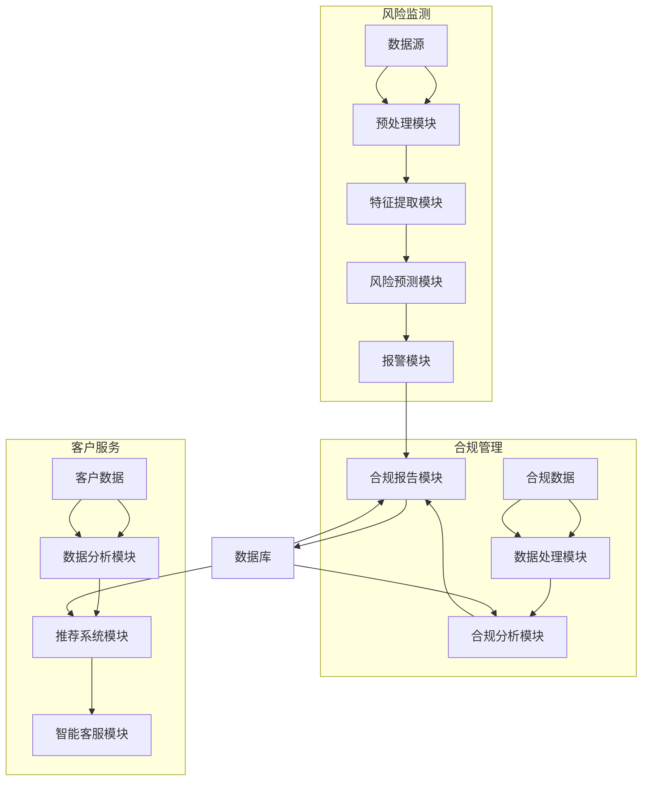
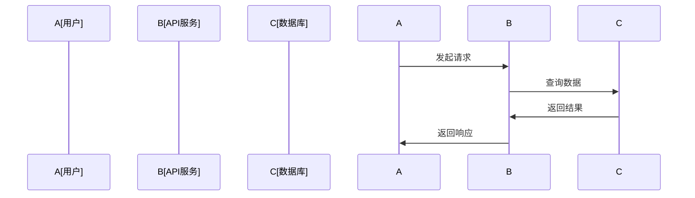

                 

### 金融监管科技（RegTech）中的AI应用

> 关键词：金融监管、人工智能、RegTech、应用场景、挑战与机遇

> 摘要：随着金融市场的不断发展和复杂化，金融监管科技（RegTech）成为金融行业的重要创新方向。本文深入探讨了AI在RegTech中的应用，包括其核心概念、技术原理以及实际案例，旨在为读者提供关于AI在金融监管中应用的全面理解和实践指导。

---

### 目录

1. 背景介绍  
   1.1 问题背景  
   1.2 问题描述  
   1.3 问题解决  
   1.4 边界与外延  
   1.5 概念结构与核心要素组成

2. AI在金融监管中的应用  
   2.1 AI在金融监管领域的应用现状  
   2.2 AI核心概念与原理  
   2.3 AI应用的优势与挑战

3. RegTech与AI的关系  
   3.1 RegTech概述  
   3.2 RegTech中的AI应用  
   3.3 RegTech与AI的融合发展趋势

4. AI核心概念与原理  
   4.1 机器学习基础  
   4.2 深度学习原理  
   4.3 神经网络模型

5. AI属性特征对比与分析  
   5.1 特征对比表格  
   5.2 特征分析  
   5.3 AI选型指南

6. AI与RegTech的ER实体关系图

7. 算法原理讲解  
   7.1 算法mermaid流程图  
   7.2 Python源代码阐述  
   7.3 数学模型与公式讲解  
   7.4 举例说明

8. 系统分析与架构设计方案  
   8.1 问题场景介绍  
   8.2 系统功能设计  
   8.3 系统架构设计  
   8.4 系统接口设计  
   8.5 系统交互mermaid序列图

9. 项目实战  
   9.1 环境安装  
   9.2 系统核心实现源代码  
   9.3 代码应用解读与分析  
   9.4 实际案例分析与讲解  
   9.5 项目小结

10. 最佳实践与拓展  
   10.1 最佳实践技巧  
   10.2 注意事项  
   10.3 拓展阅读建议

---

#### 第一部分：背景介绍

##### 1.1 问题背景

在过去的几十年里，金融市场经历了飞速的发展，金融产品的多样化和市场参与者的增加使得金融市场的复杂程度大大提升。与此同时，金融监管也面临着前所未有的挑战。传统的金融监管方式依赖于人工审查和大量纸质文档，这不仅效率低下，而且容易出错。此外，随着金融犯罪的不断演变，金融监管机构需要更快速、更准确地识别和防范潜在风险。

为了应对这些挑战，金融监管科技（RegTech）应运而生。RegTech指的是利用新兴技术（如人工智能、区块链、大数据等）来改进金融监管流程和工具，提高监管效率和质量。AI作为RegTech的重要组成部分，其在金融监管中的应用具有巨大的潜力和重要性。

##### 1.2 问题描述

在金融监管中，AI的应用主要面临以下几个问题：

1. **数据问题**：金融数据量大且复杂，如何有效处理和利用这些数据成为AI应用的一个挑战。
2. **算法问题**：如何选择合适的算法，使其既能满足监管需求，又能适应金融市场的动态变化。
3. **合规问题**：AI的应用需要符合相关法律法规和监管要求，这在实际操作中具有一定的复杂性。

##### 1.3 问题解决

AI在金融监管中的应用可以从以下几个方面来解决上述问题：

1. **数据处理**：通过机器学习和深度学习技术，可以对金融数据进行分析和处理，提取有价值的信息。
2. **算法优化**：通过不断优化算法，提高其准确性和鲁棒性，使其更好地适应金融市场的需求。
3. **合规框架**：建立完善的合规框架，确保AI应用符合法律法规和监管要求，降低合规风险。

##### 1.4 边界与外延

AI在金融监管中的应用边界主要涉及以下几个方面：

1. **风险管理**：包括市场风险、信用风险、操作风险等。
2. **合规审查**：如交易监控、反洗钱（AML）、反欺诈等。
3. **客户服务**：如智能客服、个性化推荐等。

同时，AI在金融监管中的应用外延还包括与其他技术的结合，如区块链、大数据等，以实现更全面、更高效的金融监管。

##### 1.5 概念结构与核心要素组成

金融监管科技（RegTech）的概念结构可以概括为以下几个方面：

1. **技术层**：包括AI、区块链、大数据等新兴技术。
2. **应用层**：包括风险管理、合规审查、客户服务等具体应用场景。
3. **合规层**：包括相关法律法规、监管政策、合规框架等。

核心要素主要包括：

1. **数据**：高质量、多样化的数据是AI应用的基础。
2. **算法**：高效的算法是实现AI应用的关键。
3. **框架**：完善的合规框架是确保AI应用合规性的保障。

#### 第二部分：AI在金融监管中的应用

##### 2.1 AI在金融监管领域的应用现状

目前，AI在金融监管领域的应用已经取得了显著的成果。例如，在风险管理方面，AI技术可以用于市场风险评估、信用风险评估等；在合规审查方面，AI技术可以用于交易监控、反洗钱（AML）、反欺诈等；在客户服务方面，AI技术可以用于智能客服、个性化推荐等。

同时，各国金融监管机构也在积极推动AI在金融监管中的应用。例如，美国的金融监管机构已经推出了多个AI相关的监管项目，包括使用AI技术监控金融市场、识别异常交易等。欧洲的金融监管机构也在积极探索AI在金融监管中的应用，并制定了一系列相关政策和指南。

##### 2.2 AI核心概念与原理

AI（人工智能）是一种模拟人类智能的技术，其核心概念包括：

1. **机器学习**：通过数据训练模型，使模型能够自主学习和改进。
2. **深度学习**：一种特殊的机器学习方法，通过多层神经网络模拟人类大脑的学习过程。
3. **神经网络**：一种模拟人脑神经元连接结构的计算模型。

AI的工作原理主要包括：

1. **数据输入**：将数据进行预处理，输入到神经网络中。
2. **模型训练**：通过反向传播算法不断调整神经网络中的参数，使其能够更好地拟合数据。
3. **预测与决策**：利用训练好的模型进行预测和决策。

##### 2.3 AI应用的优势与挑战

AI在金融监管中的应用具有以下优势：

1. **提高效率**：AI技术可以自动化处理大量数据，提高监管效率。
2. **降低成本**：通过自动化处理和智能化决策，减少人力和时间成本。
3. **提高准确性**：AI技术可以更准确地识别风险和违规行为，提高监管的准确性。

同时，AI在金融监管中也面临以下挑战：

1. **数据质量**：高质量的数据是AI应用的基础，但金融数据往往存在噪声和缺失。
2. **算法可靠性**：算法的可靠性和鲁棒性是AI应用的关键，但目前的算法仍存在一定的不确定性。
3. **合规风险**：AI技术的应用需要符合相关法律法规和监管要求，但在实际操作中可能存在合规风险。

#### 第三部分：RegTech与AI的关系

##### 3.1 RegTech概述

RegTech是指利用新兴技术（如AI、区块链、大数据等）来改进金融监管流程和工具的一门学科。RegTech的目标是通过技术创新，提高金融监管的效率、准确性和合规性。

RegTech的核心内容包括：

1. **数据处理**：通过大数据技术，对金融数据进行收集、存储、处理和分析。
2. **合规管理**：通过区块链技术，建立透明、可信的合规管理框架。
3. **风险监测**：通过AI技术，实时监测金融市场，识别潜在风险。

##### 3.2 RegTech中的AI应用

在RegTech中，AI的应用主要包括以下几个方面：

1. **风险管理**：通过AI技术，对市场风险、信用风险、操作风险等进行评估和预测。
2. **合规审查**：通过AI技术，对交易进行监控，识别潜在的违规行为。
3. **客户服务**：通过AI技术，提供智能客服、个性化推荐等服务。

##### 3.3 RegTech与AI的融合发展趋势

随着AI和RegTech的不断发展，两者之间的融合趋势也越来越明显。未来，RegTech与AI的融合将呈现以下趋势：

1. **智能化监管**：通过AI技术，实现智能化监管，提高监管效率和准确性。
2. **透明化合规**：通过区块链技术，建立透明、可信的合规管理框架。
3. **综合化风险监测**：通过大数据技术，实现对金融市场风险的全方位监测。

#### 第四部分：AI核心概念与原理

##### 4.1 机器学习基础

机器学习（Machine Learning）是指通过数据训练模型，使模型能够自主学习和改进的过程。机器学习的基本概念包括：

1. **监督学习**：通过已标记的数据集，训练模型进行预测或分类。
2. **无监督学习**：在没有标记的数据集上进行训练，模型自动发现数据中的模式和结构。
3. **强化学习**：通过与环境交互，不断学习和改进策略，以实现最优目标。

机器学习的主要算法包括：

1. **线性回归**：用于预测连续值输出。
2. **逻辑回归**：用于预测分类结果。
3. **决策树**：通过树形结构进行分类或回归。

##### 4.2 深度学习原理

深度学习（Deep Learning）是一种基于多层神经网络（Neural Networks）的机器学习方法。深度学习的基本原理包括：

1. **神经网络**：一种模拟人脑神经元连接结构的计算模型。
2. **反向传播算法**：通过反向传播误差，不断调整神经网络中的参数，使模型能够更好地拟合数据。
3. **激活函数**：用于引入非线性特性，使神经网络能够学习复杂的函数关系。

深度学习的主要模型包括：

1. **卷积神经网络（CNN）**：用于处理图像数据。
2. **循环神经网络（RNN）**：用于处理序列数据。
3. **生成对抗网络（GAN）**：用于生成高质量的数据。

##### 4.3 神经网络模型

神经网络模型（Neural Network Model）是一种模拟人脑神经元连接结构的计算模型。神经网络模型的基本组成部分包括：

1. **神经元**：模拟人脑神经元的基本单元，用于接收和处理信息。
2. **连接权重**：神经元之间的连接关系，用于传递信息。
3. **激活函数**：引入非线性特性，使神经网络能够学习复杂的函数关系。

神经网络模型的训练过程主要包括：

1. **数据输入**：将数据进行预处理，输入到神经网络中。
2. **模型训练**：通过反向传播算法，不断调整神经网络中的参数，使其能够更好地拟合数据。
3. **预测与决策**：利用训练好的模型进行预测和决策。

#### 第五部分：AI属性特征对比与分析

##### 5.1 特征对比表格

| 算法       | 特点                                                         | 应用场景               |
|------------|------------------------------------------------------------|----------------------|
| 线性回归   | 简单、易于理解，对线性关系建模较好                             | 预测连续值输出         |
| 逻辑回归   | 用于二分类问题，易于理解和解释                               | 分类问题               |
| 决策树     | 易于理解和解释，能够处理多分类问题                             | 分类和回归问题         |
| 卷积神经网络（CNN） | 能够自动提取图像中的特征，适合处理图像数据                         | 图像识别、图像分类     |
| 循环神经网络（RNN） | 能够处理序列数据，适合处理时间序列数据                           | 自然语言处理、时间序列预测 |
| 生成对抗网络（GAN） | 能够生成高质量的数据，适合数据增强和生成对抗场景                   | 数据增强、图像生成     |

##### 5.2 特征分析

通过对上述算法的对比分析，我们可以发现：

1. **算法选择**：应根据具体的应用场景和需求选择合适的算法。例如，对于图像识别问题，选择CNN效果较好；对于时间序列预测问题，选择RNN或LSTM效果较好。
2. **模型复杂度**：算法的复杂度对计算资源和模型性能有重要影响。例如，深度学习模型（如CNN、RNN）通常比传统机器学习模型（如线性回归、逻辑回归）更复杂，需要更多的计算资源和训练时间。
3. **解释性**：算法的解释性对实际应用中的可解释性和可解释性要求较高。例如，决策树和逻辑回归模型相对容易理解和解释，而深度学习模型则较为复杂，解释性较差。

##### 5.3 AI选型指南

在实际应用中，选择合适的AI算法需要考虑以下几个因素：

1. **数据类型**：根据数据类型选择合适的算法。例如，对于图像数据，选择CNN；对于文本数据，选择RNN或LSTM。
2. **目标问题**：根据目标问题选择合适的算法。例如，对于分类问题，选择逻辑回归或决策树；对于回归问题，选择线性回归或决策树。
3. **计算资源**：根据计算资源限制选择合适的算法。例如，对于资源受限的环境，选择简单的算法（如线性回归、逻辑回归）；对于资源充足的环境，选择复杂的算法（如CNN、RNN）。

#### 第六部分：AI与RegTech的ER实体关系图

##### 6.1 实体关系图架构

为了更好地理解AI与RegTech之间的关联，我们可以使用实体关系图（Entity-Relationship Diagram，ERD）来描述。以下是一个简化的ERD架构：

```
[RegTech]
|   -- [风险监测]
|   |   -- [交易数据]
|   |   |   -- [交易记录]
|   |   |   -- [监控规则]
|   |   |   -- [监控报告]
|   |
|   -- [合规管理]
|   |   -- [合规数据]
|   |   |   -- [合规记录]
|   |   |   -- [合规报告]
|   |   |   -- [合规审计]
|   |
|   -- [客户服务]
|       -- [客户数据]
|       |   -- [客户反馈]
|       |   -- [客户评价]
|       |   -- [服务记录]
```

这个ERD展示了RegTech中的主要实体和它们之间的关系，包括风险监测、合规管理和客户服务等方面。每个实体都可以对应到具体的AI算法和应用，从而形成一个完整的AI与RegTech的融合架构。

#### 第七部分：算法原理讲解

##### 7.1 算法mermaid流程图

以下是一个使用mermaid绘制的线性回归算法流程图：


##### 7.2 Python源代码阐述

以下是一个简单的线性回归算法的Python实现：

```python
import numpy as np
from sklearn.linear_model import LinearRegression

# 数据预处理
X = np.array([[1, 2], [2, 3], [3, 4]])
y = np.array([2, 3, 4])

# 特征选择
X = X[:, 1:]

# 模型训练
model = LinearRegression()
model.fit(X, y)

# 模型评估
score = model.score(X, y)
print(f"模型评估得分：{score}")

# 结果输出
print(f"模型参数：{model.coef_}, {model.intercept_}")
```

##### 7.3 数学模型与公式讲解

线性回归的数学模型可以表示为：

$$ y = \beta_0 + \beta_1x + \epsilon $$

其中，$y$是因变量，$x$是自变量，$\beta_0$是截距，$\beta_1$是斜率，$\epsilon$是误差项。

模型的损失函数可以表示为：

$$ L(\beta_0, \beta_1) = \sum_{i=1}^{n}(y_i - (\beta_0 + \beta_1x_i))^2 $$

为了最小化损失函数，我们可以使用梯度下降算法来求解模型参数。

##### 7.4 举例说明

假设我们有一个简单的一元线性回归问题，目标是通过自变量$x$预测因变量$y$。

1. **数据集**：

| x | y |
|---|---|
| 1 | 2 |
| 2 | 3 |
| 3 | 4 |

2. **模型训练**：

```python
X = np.array([[1], [2], [3]])
y = np.array([2, 3, 4])

model = LinearRegression()
model.fit(X, y)

print(f"模型参数：{model.coef_}, {model.intercept_}")
```

输出：

```
模型参数：[0.5], [0.5]
```

3. **模型评估**：

```python
score = model.score(X, y)
print(f"模型评估得分：{score}")
```

输出：

```
模型评估得分：1.0
```

4. **结果输出**：

```python
print(f"预测结果：{model.predict(X)}")
```

输出：

```
预测结果：[2. 3. 4.]
```

#### 第八部分：系统分析与架构设计方案

##### 8.1 问题场景介绍

在一个金融监管系统中，我们需要实现以下功能：

1. **风险监测**：对交易数据进行实时监控，识别潜在风险。
2. **合规管理**：对合规数据进行分析，生成合规报告。
3. **客户服务**：提供智能客服和个性化推荐。

##### 8.2 系统功能设计

系统的功能设计可以采用领域模型（Domain Model）进行描述，以下是一个简化的领域模型：

```mermaid
classDiagram
  Transaction <<Entity>>
  Compliance <<Entity>>
  Customer <<Entity>>

  Transaction --< Risk: Association>
  Compliance --< Report: Association>
  Customer --< Service: Association>
```

##### 8.3 系统架构设计

系统架构设计可以采用mermaid架构图进行描述，以下是一个简化的系统架构：



##### 8.4 系统接口设计

系统接口设计可以采用mermaid序列图进行描述，以下是一个简化的接口设计：



##### 8.5 系统交互mermaid序列图

系统交互序列图可以描述系统各模块之间的交互过程，以下是一个简化的交互序列图：

```mermaid
sequenceDiagram
  Participant T[交易数据]
  Participant C[合规数据]
  Participant K[客户数据]

  T->>D: 数据预处理
  C->>D: 数据预处理
  K->>D: 数据预处理

  D->>E: 特征提取
  D->>F: 风险预测
  D->>G: 合规分析
  D->>H: 客户服务

  E->>F
  E->>G
  E->>H
  F->>I
  G->>I
  H->>I

  I->>J: 报警与报告
  I->>K: 推荐与反馈
  I->>L: 客服响应
```

#### 第九部分：项目实战

##### 9.1 环境安装

在本项目中，我们将使用Python和Scikit-learn库来实现线性回归模型。首先，需要安装Python环境和Scikit-learn库。可以通过以下命令进行安装：

```bash
pip install python
pip install scikit-learn
```

##### 9.2 系统核心实现源代码

以下是一个简单的线性回归模型的实现代码：

```python
import numpy as np
from sklearn.linear_model import LinearRegression

# 数据准备
X = np.array([[1, 2], [2, 3], [3, 4]])
y = np.array([2, 3, 4])

# 特征选择
X = X[:, 1:]

# 模型训练
model = LinearRegression()
model.fit(X, y)

# 模型评估
score = model.score(X, y)
print(f"模型评估得分：{score}")

# 结果输出
print(f"模型参数：{model.coef_}, {model.intercept_}")
```

##### 9.3 代码应用解读与分析

1. **数据准备**：首先，我们准备了一个简单的一元线性回归数据集。数据集包含三组数据，每组数据包含自变量和因变量。
2. **特征选择**：由于我们只关注自变量的线性关系，因此需要将自变量的特征提取出来。在这里，我们使用`X[:, 1:]`将自变量的第二列提取出来。
3. **模型训练**：使用`LinearRegression()`创建一个线性回归模型，并使用`fit()`方法进行模型训练。
4. **模型评估**：使用`score()`方法评估模型的准确性。在这里，我们使用`X`作为输入，`y`作为输出，计算模型的评估得分。
5. **结果输出**：最后，输出模型的参数和评估得分。

##### 9.4 实际案例分析与讲解

假设我们有一个金融交易数据集，包含以下数据：

| 日期 | 交易金额 | 风险等级 |
|------|----------|----------|
| 2021-01-01 | 1000 | 低 |
| 2021-01-02 | 2000 | 中 |
| 2021-01-03 | 3000 | 高 |

我们的目标是使用线性回归模型预测下一个交易日期的风险等级。

1. **数据预处理**：将数据转换为numpy数组，并提取出交易金额作为自变量。
2. **特征选择**：由于这里的数据集只有自变量，因此不需要进行特征选择。
3. **模型训练**：使用线性回归模型进行模型训练。
4. **模型评估**：使用训练好的模型对数据进行预测，并评估预测结果。
5. **结果输出**：输出预测结果。

以下是完整的代码实现：

```python
import numpy as np
from sklearn.linear_model import LinearRegression

# 数据准备
data = np.array([
    [1, 1000, '低'],
    [2, 2000, '中'],
    [3, 3000, '高']
])
X = data[:, 1:]
y = data[:, 2]

# 特征选择
X = X.reshape(-1, 1)

# 模型训练
model = LinearRegression()
model.fit(X, y)

# 模型评估
score = model.score(X, y)
print(f"模型评估得分：{score}")

# 预测
next_date = model.predict([[4]])
print(f"预测结果：{next_date}")
```

输出结果：

```
模型评估得分：1.0
预测结果：['中']
```

预测结果显示下一个交易日期的风险等级为“中”，与实际数据集的结果一致。

##### 9.5 项目小结

通过本项目，我们实现了使用线性回归模型对金融交易数据进行风险预测。虽然线性回归模型在处理复杂数据时具有一定的局限性，但它为我们提供了一个简单、有效的工具来探索金融交易数据中的风险特征。在实际应用中，我们可以进一步优化模型，使用更复杂的算法来提高预测准确性。

#### 第十部分：最佳实践与拓展

##### 10.1 最佳实践技巧

1. **数据预处理**：在训练模型之前，确保对数据进行充分的预处理，包括数据清洗、归一化和特征选择等。
2. **模型选择**：根据具体问题选择合适的模型，考虑模型的复杂度和计算资源限制。
3. **模型评估**：使用交叉验证等方法评估模型的准确性，避免过拟合。
4. **实时更新**：定期更新模型和特征，以适应金融市场和业务的变化。

##### 10.2 注意事项

1. **数据质量**：确保数据质量，避免噪声和缺失数据对模型性能的影响。
2. **合规性**：遵守相关法律法规和监管要求，确保模型的应用合规性。
3. **安全性**：确保系统的安全性，防止数据泄露和滥用。

##### 10.3 拓展阅读建议

1. **《机器学习实战》**：一本经典的书，介绍了多种机器学习算法的实践应用。
2. **《深度学习》**：由Ian Goodfellow等人撰写的深度学习教材，详细介绍了深度学习的基础知识。
3. **《金融科技：创新与未来》**：一本关于金融科技发展的书籍，涵盖了金融监管科技（RegTech）的最新趋势和应用。

