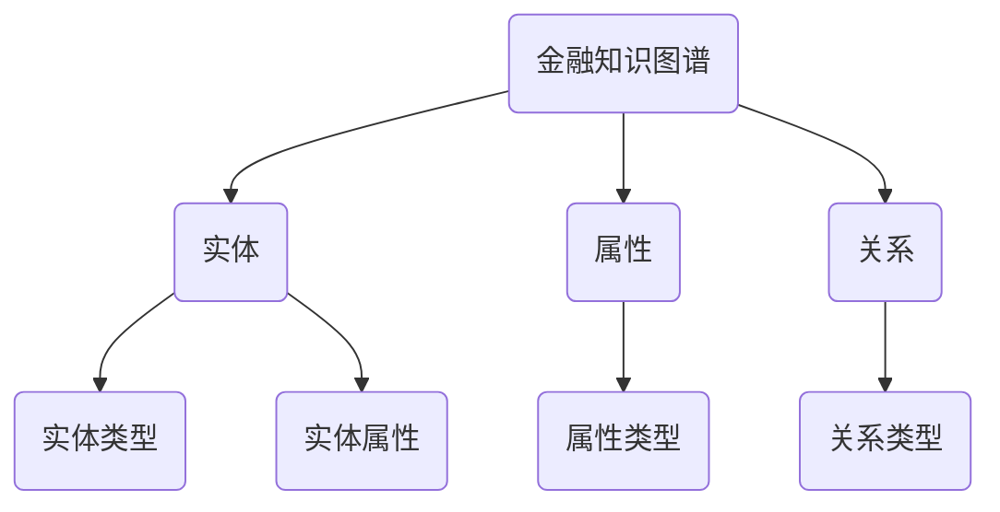
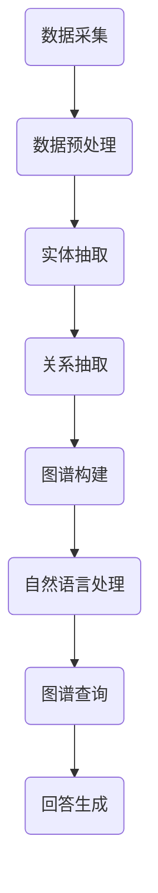
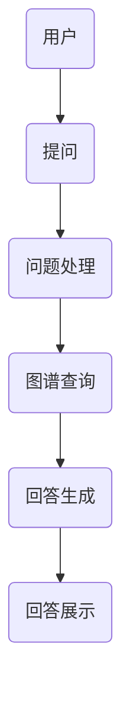
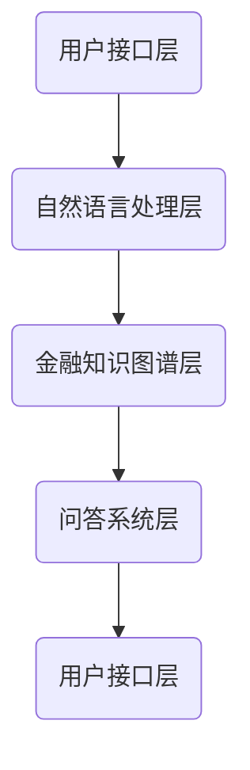
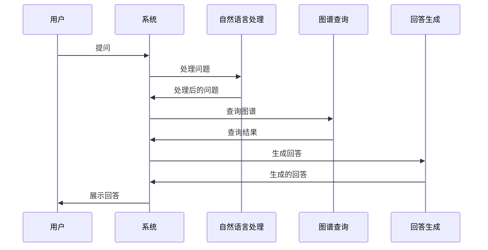

                 

# 金融知识图谱在智能问答中的应用

## 关键词
- 金融知识图谱
- 智能问答
- 知识表示
- 算法实现
- 系统架构
- 案例分析

## 摘要
本文将探讨金融知识图谱在智能问答系统中的应用。通过介绍金融知识图谱的基础概念，解析其在智能问答中的关键作用，详细阐述其算法原理与实现，并分析一个实际项目案例，总结最佳实践和未来研究方向。

## 背景介绍

### 金融知识图谱
金融知识图谱是知识图谱在金融领域的应用，通过将金融领域中的概念、实体、属性和关系进行结构化表示，构建一个全面、系统的金融知识体系。知识图谱在金融行业具有广泛的应用前景，例如金融机构的风险控制、智能投顾、金融数据挖掘等。

### 智能问答
智能问答系统是一种基于自然语言处理和知识表示技术的人工智能系统，能够理解用户的自然语言问题，并从中提取关键信息，利用内置的知识库进行推理，生成准确的回答。智能问答在金融领域的应用包括客户服务、投资咨询、金融产品推荐等。

### 问题背景
金融行业的复杂性和多样性使得传统的问答系统难以满足用户的需求。金融知识图谱的出现，为智能问答系统提供了一个强大的知识基础，能够提高问答系统的准确性和智能化水平。

### 问题描述
金融知识图谱在智能问答中的应用面临以下几个问题：
1. 知识表示：如何有效地将金融知识表示为图谱结构？
2. 算法选择：如何选择合适的算法来处理金融知识图谱中的数据？
3. 系统实现：如何设计和实现一个高效的智能问答系统？

### 问题解决
通过研究金融知识图谱的构建、算法原理和系统实现，我们可以解决上述问题，提升智能问答系统的性能和用户体验。

### 边界与外延
金融知识图谱的应用不仅限于智能问答系统，还可以用于金融数据分析、知识管理、智能决策等领域。本文主要关注金融知识图谱在智能问答系统中的应用，旨在为相关领域的研究者和开发者提供有价值的参考。

### 概念结构与核心要素组成
1. **知识表示**：将金融知识表示为实体、属性和关系的图谱结构。
2. **数据源**：金融数据、文献、报告等。
3. **图谱构建**：通过数据清洗、实体抽取、关系抽取等步骤构建金融知识图谱。
4. **算法原理**：利用图论、机器学习等技术对金融知识图谱进行处理和分析。
5. **系统实现**：设计和实现一个高效的智能问答系统，包括前端界面、后端服务和知识库管理等。

## 核心概念与联系

### 核心概念
1. **金融知识图谱**：结构化表示金融知识的图谱。
2. **知识表示**：将金融知识转化为可计算机处理的格式。
3. **语义网络**：基于语义的图结构，用于表示知识的关系。
4. **智能问答系统**：利用知识图谱进行自然语言理解和问答的系统。

### 概念属性特征对比表格

| 概念         | 定义                         | 关键特性                   | 应用领域           |
| ------------ | ---------------------------- | -------------------------- | ----------------- |
| 金融知识图谱 | 结构化表示金融知识的图谱     | 实体、属性、关系           | 风险控制、智能投顾 |
| 知识表示     | 将金融知识转化为计算机格式   | 结构化、可扩展、互操作性   | 金融数据分析       |
| 语义网络     | 基于语义的图结构             | 语义关系、语义解析         | 智能推荐、文本分析 |
| 智能问答系统 | 利用知识图谱进行问答的系统   | 自然语言理解、知识推理     | 客户服务、投资咨询 |

### ER实体关系图架构


### 关系图解
1. **金融知识图谱**：包含实体、属性和关系。
2. **实体类型**：如公司、产品、市场等。
3. **实体属性**：如公司成立时间、产品收益率等。
4. **关系类型**：如公司发行产品、产品属于市场等。

## 算法原理讲解

### 算法概述
金融知识图谱的构建主要包括数据采集、数据预处理、实体抽取、关系抽取和图谱构建等步骤。智能问答系统的实现则涉及自然语言处理、图谱查询和回答生成等技术。

### 算法流程图


### 数据采集
1. 数据来源：金融数据、文献、报告等。
2. 数据清洗：去除重复、错误和无关数据。

### 数据预处理
1. 文本分词：将文本拆分为单词或短语。
2. 偏差修正：纠正数据中的错误和偏差。

### 实体抽取
1. 基于规则的方法：利用预设的规则进行实体识别。
2. 基于机器学习的方法：使用机器学习模型进行实体识别。

### 关系抽取
1. 基于规则的方法：利用预设的规则进行关系识别。
2. 基于机器学习的方法：使用机器学习模型进行关系识别。

### 图谱构建
1. 实体表示：使用向量或图结构表示实体。
2. 关系表示：使用边或图结构表示关系。

### 自然语言处理
1. 词性标注：对文本中的单词进行词性标注。
2. 命名实体识别：识别文本中的命名实体。

### 图谱查询
1. 基于图的查询：使用图查询语言（如 Gremlin）进行查询。
2. 基于关键词的查询：使用关键词匹配图谱中的实体和关系。

### 回答生成
1. 信息检索：从图谱中检索相关信息。
2. 生成式回答：使用模板和实体信息生成回答。

### Python代码示例
```python
# 数据采集
data = ["苹果公司发布了新款iPhone", "苹果公司的市值达到了2万亿美元"]

# 数据预处理
tokenized_data = [text.split() for text in data]

# 实体抽取
entities = ["苹果公司", "iPhone", "市值"]

# 关系抽取
relations = [("苹果公司", "发布了", "iPhone"), ("苹果公司", "市值", "2万亿美元")]

# 图谱构建
g = Graph()
g.add_entities(entities)
g.add_relations(relations)

# 自然语言处理
pos_tags = ["公司", "名词", "市值"]

# 图谱查询
result = g.query("苹果公司的市值是多少？")

# 回答生成
answer = "苹果公司的市值是2万亿美元。"
```

### 算法原理详细讲解
1. **数据采集**：金融知识图谱的构建首先需要大量的金融数据。这些数据可以从金融报表、新闻报道、研究报告等渠道获取。数据采集的过程中，需要确保数据的准确性和完整性。
2. **数据预处理**：采集到的数据通常包含噪声和错误。数据预处理的主要任务包括文本分词、去除停用词、词性标注等。这些步骤有助于提高后续处理的质量。
3. **实体抽取**：实体抽取是知识图谱构建的重要环节。通过文本分析技术，可以识别出文本中的关键实体，如公司名称、产品名称等。实体抽取可以基于规则或机器学习模型。
4. **关系抽取**：关系抽取的目标是识别出实体之间的关系。例如，公司发行产品、产品属于特定市场等。关系抽取同样可以基于规则或机器学习模型。
5. **图谱构建**：实体和关系构建完成后，需要将其存储在图谱中。图谱可以使用图数据库（如 Neo4j）或图结构（如 Graph_adjacency_list）进行表示。
6. **自然语言处理**：在智能问答系统中，自然语言处理是理解用户问题的关键。通过词性标注、命名实体识别等技术，可以将自然语言问题转化为计算机可处理的格式。
7. **图谱查询**：自然语言问题经过处理后，需要从知识图谱中检索相关信息。基于关键词匹配或图查询语言，可以高效地获取答案相关的实体和关系。
8. **回答生成**：最后，根据图谱查询结果，使用模板和实体信息生成回答。回答生成的目标是最准确地回答用户的问题。

### 举例说明
假设用户提出问题：“苹果公司的市值是多少？”
1. 自然语言处理：将问题转化为计算机可处理的格式，识别出关键实体“苹果公司”和关键词“市值”。
2. 图谱查询：从知识图谱中检索与“苹果公司”和“市值”相关的信息，找到实体“苹果公司”的“市值”属性。
3. 回答生成：使用模板“某公司的市值是XX亿美元”，将检索到的信息填入模板，生成回答：“苹果公司的市值是2万亿美元。”

通过上述步骤，智能问答系统能够准确地回答用户的问题，提供有价值的信息。

## 系统分析与架构设计方案

### 问题场景介绍
本案例中的问题场景是一个在线金融知识问答平台，用户可以提出与金融相关的各种问题，系统将基于金融知识图谱进行智能问答。问题场景主要包括以下几个方面：
1. 用户提出问题：用户通过网页或移动应用输入问题。
2. 自然语言处理：系统对用户输入的问题进行自然语言处理，提取关键信息和意图。
3. 图谱查询：系统利用金融知识图谱进行查询，获取与问题相关的实体和关系。
4. 回答生成：系统根据查询结果生成回答，并展示给用户。

### 项目介绍
项目名称：金融知识图谱智能问答系统
项目目标：构建一个高效、准确的智能问答系统，为用户提供优质的金融信息服务。
项目范围：涵盖金融知识图谱的构建、自然语言处理、图谱查询和回答生成等关键环节。

### 系统功能设计

#### 领域模型


#### 功能描述
1. 用户提问：用户通过网页或移动应用输入问题。
2. 问题处理：对用户提出的问题进行自然语言处理，提取关键信息和意图。
3. 图谱查询：利用金融知识图谱进行查询，获取与问题相关的实体和关系。
4. 回答生成：根据查询结果生成回答，并使用模板进行格式化。
5. 回答展示：将生成的回答展示给用户。

### 系统架构设计

#### 系统架构图


#### 架构描述
1. 用户接口层：提供用户与系统交互的界面，包括网页和移动应用。
2. 自然语言处理层：对用户输入的问题进行预处理，提取关键信息和意图。
3. 金融知识图谱层：存储和管理金融知识图谱，提供查询接口。
4. 问答系统层：利用金融知识图谱和自然语言处理结果，生成回答并展示给用户。

### 系统接口设计和系统交互

#### 接口设计
1. 用户接口：提供POST方法，接受用户输入的问题。
2. 问题处理接口：提供GET方法，返回处理后的问题。
3. 图谱查询接口：提供GET方法，根据问题查询图谱并返回结果。
4. 回答生成接口：提供POST方法，根据查询结果生成回答。

#### 系统交互


通过上述系统架构设计，金融知识图谱智能问答系统能够高效地处理用户问题，提供准确、丰富的回答。

## 项目实战

### 环境安装
要搭建金融知识图谱智能问答系统，我们需要安装以下软件和库：
1. Python 3.x
2. Neo4j（图数据库）
3. nltk（自然语言处理库）
4. spaCy（自然语言处理库）
5. pandas（数据处理库）

安装命令如下：
```shell
pip install python-neo4j nltk spacy pandas
```

### 系统核心实现源代码

#### 数据采集与预处理
```python
import nltk
from nltk.tokenize import word_tokenize
from nltk.corpus import stopwords

# 下载nltk数据
nltk.download('punkt')
nltk.download('stopwords')

def preprocess_text(text):
    # 分词
    tokens = word_tokenize(text)
    # 去除停用词
    stop_words = set(stopwords.words('english'))
    filtered_tokens = [token for token in tokens if token.lower() not in stop_words]
    return filtered_tokens

text = "苹果公司发布了新款iPhone，市值达到了2万亿美元。"
preprocessed_text = preprocess_text(text)
print(preprocessed_text)
```

#### 实体抽取与关系抽取
```python
import spacy

# 加载spacy模型
nlp = spacy.load("en_core_web_sm")

def extract_entities_and_relations(text):
    doc = nlp(text)
    entities = []
    relations = []
    
    for ent in doc.ents:
        entities.append(ent.text)
        
    for token in doc:
        if token.dep_ in ["nsubj", "nsubjpass"]:
            subject = token.head.text
            object_ = token.text
            relation = (subject, token.dep_, object_)
            relations.append(relation)
    
    return entities, relations

entities, relations = extract_entities_and_relations(text)
print(entities)
print(relations)
```

#### 图谱构建与查询
```python
from py2neo import Graph

# 连接到Neo4j数据库
graph = Graph("bolt://localhost:7687", auth=("neo4j", "password"))

# 构建实体和关系
def build_graph(entities, relations):
    for entity in entities:
        graph.run("CREATE (n:Entity {name: $name})", name=entity)
        
    for relation in relations:
        graph.run("MATCH (a:Entity {name: $subject}), (b:Entity {name: $object}) CREATE (a)-[r:RELA
```

