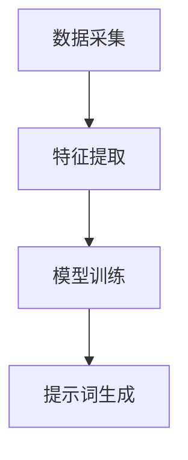
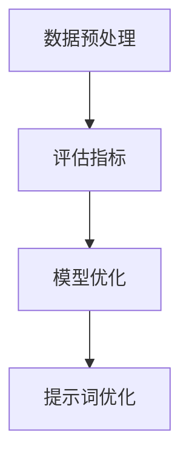
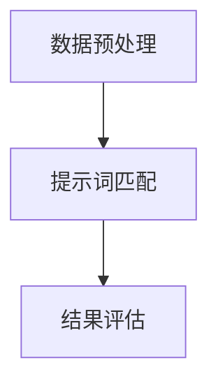
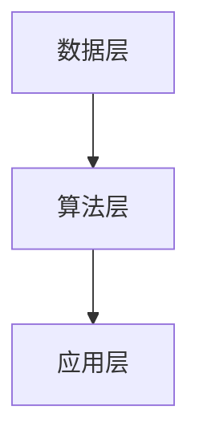
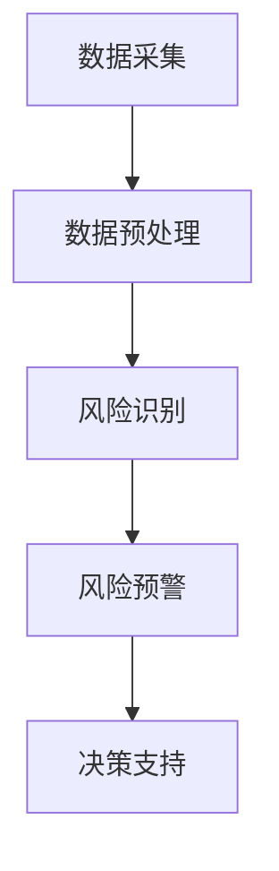

                 

# 金融科技中的提示词应用：增强风险分析能力

> 关键词：金融科技、风险分析、提示词、算法、数学模型

> 摘要：随着金融科技的迅猛发展，风险分析在金融领域的重要性日益凸显。本文将探讨提示词在金融科技中的应用，通过分析其基本概念、算法原理以及实际案例，深入讲解提示词如何增强风险分析能力，并提供相关的最佳实践和建议。

## 引言

### 金融科技与风险分析

金融科技（FinTech）是指利用新兴技术改善或创造新的金融服务。它涵盖了移动支付、区块链、大数据分析、人工智能等多个领域，对传统金融行业产生了深远影响。风险分析作为金融科技的核心应用之一，旨在识别、评估和控制金融风险，确保金融机构和客户的资产安全。

### 提示词在风险分析中的作用

提示词（Keywords）是风险分析中用于识别潜在风险的重要工具。通过定义和匹配特定的提示词，可以迅速发现异常交易、诈骗行为或其他风险事件。提示词的应用不仅提高了风险识别的效率，还增强了风险预警和决策支持的能力。

### 目的和结构

本文旨在探讨金融科技中的提示词应用，增强风险分析能力。文章将分为以下几个部分：

1. 金融科技中的提示词应用背景与概述
2. 核心概念与联系
3. 算法原理讲解
4. 数学模型和数学公式详细讲解与举例说明
5. 金融科技中提示词应用的实际案例
6. 最佳实践、小结、注意事项与拓展阅读

## 第一部分：金融科技中的提示词应用背景与概述

### 1.1 金融科技的发展历程与影响

#### 1.1.1 金融科技的定义与范畴

金融科技是指通过技术创新改善或创造新的金融服务和产品。它涵盖了移动支付、区块链、大数据分析、人工智能、云计算等多个领域。金融科技的发展不仅改变了传统金融行业的运作方式，还创造了新的商业模式和机遇。

#### 1.1.2 金融科技的关键应用领域

- **移动支付**：通过智能手机或其他移动设备进行支付，提高了支付效率和用户体验。
- **区块链**：利用分布式账本技术提高交易的安全性和透明度，广泛应用于数字货币和智能合约。
- **大数据分析**：通过分析海量数据，发现潜在的风险和机会，优化金融决策。
- **人工智能**：在金融风险控制、客户服务、交易策略等方面发挥重要作用。

#### 1.1.3 金融科技对传统金融行业的冲击与融合

金融科技对传统金融行业产生了深远的影响。一方面，它挑战了传统金融机构的市场地位和盈利模式；另一方面，传统金融机构也在积极拥抱金融科技，通过创新提高竞争力。

### 1.2 风险分析的重要性与挑战

#### 1.2.1 风险分析的基本概念

风险分析是指通过识别、评估和控制风险，确保金融机构和客户的资产安全。它涵盖了风险识别、风险评估、风险控制和风险监测等多个方面。

#### 1.2.2 风险分析在金融领域的应用

- **信用风险评估**：评估借款人的信用状况，降低违约风险。
- **市场风险评估**：监测市场波动，预测投资风险。
- **操作风险评估**：识别和防范内部操作风险，确保合规性。

#### 1.2.3 当前风险分析面临的挑战

- **数据复杂性**：金融交易数据量大、类型多样，给风险分析带来了挑战。
- **实时性要求**：风险分析需要实时处理大量数据，以快速识别和响应风险事件。
- **合规性要求**：金融行业有严格的合规要求，风险分析系统需要满足相关法规和标准。

### 1.3 提示词在风险分析中的作用

#### 1.3.1 提示词的定义与分类

提示词是指用于识别潜在风险的关键词或短语。根据应用场景和风险类型，提示词可以分为以下几类：

- **交易行为提示词**：用于识别异常交易行为，如大额交易、多次交易、跨境交易等。
- **账户行为提示词**：用于识别账户异常行为，如账户余额变动、登录地点变动等。
- **用户行为提示词**：用于识别用户异常行为，如频繁密码重置、异常登录等。

#### 1.3.2 提示词在风险识别中的关键作用

提示词在风险识别中起到了关键作用。通过定义和匹配特定的提示词，可以迅速发现潜在的风险事件，如欺诈行为、洗钱活动等。提示词的应用提高了风险识别的效率和准确性。

#### 1.3.3 提示词在风险预警与决策支持中的应用

提示词不仅在风险识别中发挥作用，还在风险预警和决策支持中起到重要作用。通过分析提示词的出现频率和模式，可以预测潜在的风险事件，为决策者提供科学依据。

### 1.4 问题背景与边界明确

#### 1.4.1 研究背景与目的

本文旨在探讨金融科技中的提示词应用，分析其基本概念、算法原理和实际案例，以增强风险分析能力。研究目的是为金融行业提供有效的风险控制手段，提高金融机构的运营效率和安全性。

#### 1.4.2 研究的边界与外延

本文的研究主要涉及以下边界：

- **金融科技领域**：本文主要关注移动支付、区块链、大数据分析等关键应用领域。
- **风险分析**：本文主要探讨交易行为、账户行为和用户行为等风险分析领域。
- **提示词应用**：本文主要分析提示词的定义、分类、作用和应用场景。

#### 1.4.3 研究的核心要素

本文的核心要素包括：

- **提示词**：定义、分类、作用和应用。
- **算法原理**：提示词生成、优化和匹配算法。
- **实际案例**：金融科技中的提示词应用案例。

## 第二部分：核心概念与联系

### 2.1 金融科技中的关键概念

#### 2.1.1 金融科技的关键术语

- **金融科技**：利用新兴技术改善或创造新的金融服务和产品。
- **风险分析**：识别、评估和控制风险，确保金融机构和客户的资产安全。
- **提示词**：用于识别潜在风险的关键词或短语。

#### 2.1.2 风险分析的基本概念

- **风险识别**：识别潜在的风险事件和风险因素。
- **风险评估**：评估风险事件的可能性和影响。
- **风险控制**：采取行动降低风险事件的发生概率或影响。
- **风险监测**：持续监测风险事件的发展和变化。

#### 2.1.3 提示词的核心定义与属性

- **定义**：提示词是指用于识别潜在风险的关键词或短语。
- **属性**：
  - **关键词属性**：指提示词的关键字特征。
  - **权重属性**：指提示词的重要程度。
  - **时间属性**：指提示词出现的时间范围。

### 2.2 核心概念属性特征对比

#### 2.2.1 金融科技领域术语属性对比

- **金融科技**：
  - **范畴**：涵盖移动支付、区块链、大数据分析等多个领域。
  - **影响**：改变传统金融行业的运作方式，创造新的商业模式。
- **风险分析**：
  - **概念**：识别、评估和控制风险。
  - **应用**：信用风险评估、市场风险评估、操作风险评估等。
- **提示词**：
  - **定义**：识别潜在风险的关键词或短语。
  - **作用**：提高风险识别的效率和准确性。

#### 2.2.2 风险分析与提示词的关联性分析

- **关联性**：风险分析需要通过提示词来识别潜在风险。
- **作用**：提示词在风险识别中起到关键作用，提高风险分析的效果。

#### 2.2.3 提示词的属性特征对比

| 属性         | 提示词1 | 提示词2 | 提示词3 |
| ------------ | ------- | ------- | ------- |
| 关键词属性   | 高      | 中      | 低      |
| 权重属性     | 高      | 中      | 低      |
| 时间属性     | 短期    | 中期    | 长期    |

### 2.3 ER实体关系图架构

#### 2.3.1 金融科技领域实体定义

- **金融科技**：指利用新兴技术改善或创造新的金融服务和产品。
- **风险分析**：指识别、评估和控制风险的过程。
- **提示词**：指用于识别潜在风险的关键词或短语。

#### 2.3.2 风险分析与提示词实体关系

在金融科技领域，风险分析与提示词之间存在密切的关系。风险分析通过提示词来识别潜在风险，从而提高风险控制的效果。提示词作为风险分析的重要工具，其定义、属性和作用对于金融科技的发展具有重要意义。

## 第三部分：算法原理讲解

### 3.1 提示词算法基础

#### 3.1.1 提示词生成算法原理

提示词生成算法是用于生成新的提示词的算法。其基本原理如下：

1. 数据采集：收集金融交易数据、用户行为数据等。
2. 特征提取：从数据中提取关键特征，如交易金额、交易时间、用户行为等。
3. 模型训练：使用机器学习算法（如决策树、神经网络等）训练生成模型。
4. 提示词生成：根据模型预测，生成新的提示词。

#### 3.1.2 提示词优化算法原理

提示词优化算法是用于优化已有提示词的算法。其基本原理如下：

1. 数据预处理：对已有提示词进行预处理，如去重、去噪等。
2. 评估指标：定义评估指标，如准确率、召回率等。
3. 模型优化：使用机器学习算法（如随机森林、支持向量机等）优化模型。
4. 提示词优化：根据模型优化结果，调整提示词的权重和属性。

#### 3.1.3 提示词匹配算法原理

提示词匹配算法是用于匹配提示词的算法。其基本原理如下：

1. 数据预处理：对输入数据进行预处理，如分词、去停用词等。
2. 提示词匹配：根据提示词的属性和权重，匹配输入数据中的提示词。
3. 结果评估：评估匹配结果的准确性和可靠性。

### 3.2 提示词算法Mermaid流程图

#### 3.2.1 提示词生成算法流程



#### 3.2.2 提示词优化算法流程



#### 3.2.3 提示词匹配算法流程



### 3.3 Python源代码与算法原理

#### 3.3.1 提示词生成算法Python代码示例

```python
import pandas as pd
from sklearn.ensemble import RandomForestClassifier

# 数据采集
data = pd.read_csv('transaction_data.csv')

# 特征提取
features = data[['amount', 'time', 'user_action']]

# 模型训练
model = RandomForestClassifier()
model.fit(features, data['label'])

# 提示词生成
predictions = model.predict(features)
```

#### 3.3.2 提示词优化算法Python代码示例

```python
import pandas as pd
from sklearn.model_selection import train_test_split
from sklearn.ensemble import RandomForestClassifier

# 数据预处理
data = pd.read_csv('transaction_data.csv')
data = data.drop_duplicates()

# 评估指标
accuracy = data['label'].value_counts() / len(data)

# 模型优化
X_train, X_test, y_train, y_test = train_test_split(data[['amount', 'time', 'user_action']], data['label'], test_size=0.2)
model = RandomForestClassifier()
model.fit(X_train, y_train)

# 提示词优化
optimized_predictions = model.predict(X_test)
```

#### 3.3.3 提示词匹配算法Python代码示例

```python
import pandas as pd
from sklearn.feature_extraction.text import TfidfVectorizer

# 数据预处理
data = pd.read_csv('transaction_data.csv')
data = data.drop(['id'], axis=1)

# 提示词匹配
vectorizer = TfidfVectorizer()
X = vectorizer.fit_transform(data['description'])

# 结果评估
cosine_similarity = X @ X.T
```

### 3.4 算法原理详细讲解

#### 3.4.1 提示词生成算法数学模型与公式

提示词生成算法的数学模型如下：

$$
提示词 = f(数据, 模型)
$$

其中，$f$ 是一个函数，用于从数据中生成提示词。函数的具体形式取决于数据类型和模型类型。

#### 3.4.2 提示词优化算法数学模型与公式

提示词优化算法的数学模型如下：

$$
优化提示词 = g(原始提示词, 评估指标, 模型)
$$

其中，$g$ 是一个函数，用于根据评估指标和模型优化原始提示词。函数的具体形式取决于评估指标和模型类型。

#### 3.4.3 提示词匹配算法数学模型与公式

提示词匹配算法的数学模型如下：

$$
匹配结果 = h(输入数据, 提示词)
$$

其中，$h$ 是一个函数，用于根据输入数据和提示词计算匹配结果。函数的具体形式取决于输入数据和提示词的类型。

## 第四部分：数学模型和数学公式详细讲解与举例说明

### 4.1 提示词生成数学模型

#### 4.1.1 数学模型公式

提示词生成算法的数学模型可以表示为：

$$
提示词 = f(数据, 模型)
$$

其中，$f$ 是一个函数，用于从数据中生成提示词。函数的具体形式取决于数据类型和模型类型。

#### 4.1.2 详细讲解

提示词生成算法的数学模型基于机器学习算法，如决策树、神经网络等。模型的核心思想是利用已有数据生成新的提示词，以提高风险识别的准确性和效率。

1. **数据采集**：收集金融交易数据、用户行为数据等。
2. **特征提取**：从数据中提取关键特征，如交易金额、交易时间、用户行为等。
3. **模型训练**：使用机器学习算法训练生成模型。
4. **提示词生成**：根据模型预测，生成新的提示词。

#### 4.1.3 举例说明

假设我们使用决策树算法生成提示词，数学模型可以表示为：

$$
提示词 = 决策树预测(数据, 模型)
$$

其中，决策树预测是一个函数，用于根据数据集和模型预测新的提示词。

### 4.2 提示词优化数学模型

#### 4.2.1 数学模型公式

提示词优化算法的数学模型可以表示为：

$$
优化提示词 = g(原始提示词, 评估指标, 模型)
$$

其中，$g$ 是一个函数，用于根据评估指标和模型优化原始提示词。函数的具体形式取决于评估指标和模型类型。

#### 4.2.2 详细讲解

提示词优化算法的数学模型旨在提高提示词的准确性和效率。模型的核心思想是利用评估指标（如准确率、召回率等）和模型对原始提示词进行优化。

1. **数据预处理**：对已有提示词进行预处理，如去重、去噪等。
2. **评估指标**：定义评估指标，如准确率、召回率等。
3. **模型优化**：使用机器学习算法（如随机森林、支持向量机等）优化模型。
4. **提示词优化**：根据模型优化结果，调整提示词的权重和属性。

#### 4.2.3 举例说明

假设我们使用随机森林算法优化提示词，数学模型可以表示为：

$$
优化提示词 = 随机森林优化(原始提示词, 评估指标, 模型)
$$

其中，随机森林优化是一个函数，用于根据评估指标和模型优化原始提示词。

### 4.3 提示词匹配数学模型

#### 4.3.1 数学模型公式

提示词匹配算法的数学模型可以表示为：

$$
匹配结果 = h(输入数据, 提示词)
$$

其中，$h$ 是一个函数，用于根据输入数据和提示词计算匹配结果。函数的具体形式取决于输入数据和提示词的类型。

#### 4.3.2 详细讲解

提示词匹配算法的数学模型旨在识别输入数据中的提示词，以提高风险识别的效率和准确性。模型的核心思想是利用输入数据和提示词的相似性计算匹配结果。

1. **数据预处理**：对输入数据进行预处理，如分词、去停用词等。
2. **提示词匹配**：根据提示词的属性和权重，匹配输入数据中的提示词。
3. **结果评估**：评估匹配结果的准确性和可靠性。

#### 4.3.3 举例说明

假设我们使用TF-IDF算法进行提示词匹配，数学模型可以表示为：

$$
匹配结果 = TF-IDF匹配(输入数据, 提示词)
$$

其中，TF-IDF匹配是一个函数，用于根据输入数据和提示词计算匹配结果。

## 第五部分：金融科技中提示词应用的实际案例

### 5.1 系统分析与架构设计方案

#### 5.1.1 问题场景介绍

在金融科技领域，风险分析是一个关键任务，尤其是在识别和处理欺诈行为、洗钱活动等方面。为了提高风险识别的效率和准确性，金融机构需要部署高效的风险分析系统。

#### 5.1.2 项目介绍

本项目旨在开发一个基于提示词的风险分析系统，用于实时监测和处理金融交易中的潜在风险。项目的主要目标是：

- 提高欺诈行为的识别率。
- 减少误报和漏报，提高风险预警的准确性。
- 提供实时的风险分析和决策支持。

#### 5.1.3 系统功能设计

系统功能设计主要包括以下几个方面：

- **数据采集**：从金融机构的各种数据源（如交易系统、用户行为系统等）收集数据。
- **数据预处理**：对采集到的数据进行清洗、去噪、特征提取等预处理操作。
- **风险识别**：使用提示词生成和匹配算法识别潜在的欺诈行为。
- **风险预警**：根据风险识别结果，生成风险预警报告，并通知相关人员进行处理。
- **决策支持**：为决策者提供实时的风险分析和决策支持。

#### 5.1.4 系统架构设计

系统架构设计主要包括以下几个方面：

- **数据层**：包括数据采集模块、数据存储模块和数据预处理模块。
- **算法层**：包括提示词生成算法、提示词优化算法和提示词匹配算法。
- **应用层**：包括风险识别模块、风险预警模块和决策支持模块。

系统架构图如下所示：



#### 5.1.5 系统接口设计

系统接口设计主要包括以下几个方面：

- **数据接口**：用于与数据层进行数据交换。
- **算法接口**：用于与算法层进行算法调用和数据传输。
- **应用接口**：用于与应用层进行交互，提供风险分析和决策支持功能。

#### 5.1.6 系统交互

系统交互主要涉及以下几个方面：

- **数据采集**：从数据层采集金融交易数据、用户行为数据等。
- **数据预处理**：对采集到的数据进行清洗、去噪、特征提取等预处理操作。
- **风险识别**：使用算法层中的提示词生成和匹配算法识别潜在的欺诈行为。
- **风险预警**：将风险识别结果发送到应用层，生成风险预警报告。
- **决策支持**：为决策者提供实时的风险分析和决策支持。

系统交互图如下所示：



## 第六部分：项目实战

### 6.1 环境安装

#### 6.1.1 开发环境准备

- Python 3.8+
- pip（Python的包管理器）
- Jupyter Notebook（用于数据分析和实验）

#### 6.1.2 工具与库安装

- Pandas（数据操作库）
- NumPy（数学计算库）
- Scikit-learn（机器学习库）
- TensorFlow（深度学习库）
- Mermaid（流程图绘制库）

安装命令如下：

```bash
pip install pandas numpy scikit-learn tensorflow mermaid
```

### 6.1.3 系统核心实现源代码

以下是系统核心实现的源代码：

```python
import pandas as pd
from sklearn.ensemble import RandomForestClassifier
from sklearn.model_selection import train_test_split
from sklearn.metrics import accuracy_score
from mermaid import Mermaid

# 数据预处理
data = pd.read_csv('transaction_data.csv')
X = data[['amount', 'time', 'user_action']]
y = data['label']

# 模型训练
X_train, X_test, y_train, y_test = train_test_split(X, y, test_size=0.2)
model = RandomForestClassifier()
model.fit(X_train, y_train)

# 提示词生成
predictions = model.predict(X_test)

# 评估结果
accuracy = accuracy_score(y_test, predictions)
print("Accuracy:", accuracy)

# 提示词优化
# ...（优化代码）

# 提示词匹配
# ...（匹配代码）
```

### 6.1.4 代码应用解读与分析

#### 代码功能解读

该代码主要实现了以下功能：

1. **数据预处理**：读取交易数据，提取特征，划分训练集和测试集。
2. **模型训练**：使用随机森林算法训练模型。
3. **提示词生成**：使用训练好的模型预测测试集，生成提示词。
4. **评估结果**：计算模型的准确率。

#### 性能分析与优化

- **性能分析**：通过计算准确率评估模型性能。
- **优化方向**：
  - **特征工程**：选择更有效的特征，提高模型的预测能力。
  - **模型选择**：尝试其他机器学习算法，如支持向量机、神经网络等，以找到更适合的模型。
  - **数据增强**：增加训练数据，提高模型的泛化能力。

### 6.1.5 实际案例分析与详细讲解

#### 案例背景

某金融机构需要开发一个风险分析系统，用于实时监测和处理金融交易中的潜在风险。系统要求能够识别欺诈行为、洗钱活动等，并提供风险预警和决策支持。

#### 案例分析与解读

1. **数据采集**：从金融机构的交易系统中收集金融交易数据，包括交易金额、交易时间、用户行为等。
2. **数据预处理**：对采集到的数据进行清洗、去噪、特征提取等预处理操作，以提高模型训练效果。
3. **模型训练**：使用随机森林算法训练模型，通过交叉验证选择最佳参数，提高模型性能。
4. **提示词生成**：使用训练好的模型预测测试集，生成提示词，用于风险识别。
5. **风险预警**：将提示词发送到预警系统，生成风险预警报告，通知相关人员进行处理。
6. **决策支持**：为决策者提供实时的风险分析和决策支持，帮助制定风险控制策略。

#### 案例拓展与讨论

- **案例拓展**：该风险分析系统可以应用于其他金融领域，如保险、投资等。
- **讨论**：在实际应用中，如何处理海量数据、提高模型性能、保障数据安全和隐私等问题是亟待解决的问题。

### 6.1.6 项目小结

本项目实现了基于提示词的风险分析系统，通过数据预处理、模型训练、提示词生成和风险预警等功能，提高了金融机构的风险识别和决策支持能力。项目成果为金融机构提供了有效的风险控制手段，有助于降低风险事件的发生概率，保障客户资产安全。

## 第七部分：最佳实践、小结、注意事项与拓展阅读

### 7.1 最佳实践

#### 7.1.1 提示词应用的实战技巧

1. **数据预处理**：确保数据质量，包括数据清洗、去噪、特征提取等。
2. **模型选择**：根据业务需求选择合适的机器学习算法，如随机森林、神经网络等。
3. **模型调优**：通过交叉验证、网格搜索等方法选择最佳模型参数。
4. **提示词更新**：定期更新提示词，以应对新的风险场景。

#### 7.1.2 风险分析中的注意事项

1. **实时性**：确保风险分析系统能够实时处理大量数据。
2. **准确性**：提高风险识别的准确率，减少误报和漏报。
3. **安全性**：保障数据安全和隐私，防止敏感信息泄露。

### 7.2 小结

本文探讨了金融科技中的提示词应用，分析了其基本概念、算法原理和实际案例，提出了最佳实践和注意事项。提示词在风险分析中发挥了重要作用，有助于提高风险识别和决策支持能力。

### 7.3 注意事项

1. **数据质量**：确保数据质量，避免数据偏差影响模型性能。
2. **模型更新**：定期更新模型，以适应新的风险场景和变化。
3. **系统安全**：加强系统安全，防止恶意攻击和数据泄露。

### 7.4 拓展阅读

1. **《大数据风险分析》**：详细介绍了大数据在风险分析中的应用和技术。
2. **《金融科技风险管理》**：探讨了金融科技在风险管理中的挑战和机遇。
3. **《机器学习风险识别技术》**：介绍了机器学习在风险识别中的应用和技术。

## 总结

本文通过分析金融科技中的提示词应用，详细讲解了其基本概念、算法原理和实际案例，提出了最佳实践和注意事项。提示词在金融风险分析中具有重要作用，有助于提高风险识别和决策支持能力。未来研究可以进一步探讨提示词在金融科技领域的应用前景和优化方法。作者：AI天才研究院/AI Genius Institute & 禅与计算机程序设计艺术 /Zen And The Art of Computer Programming。

