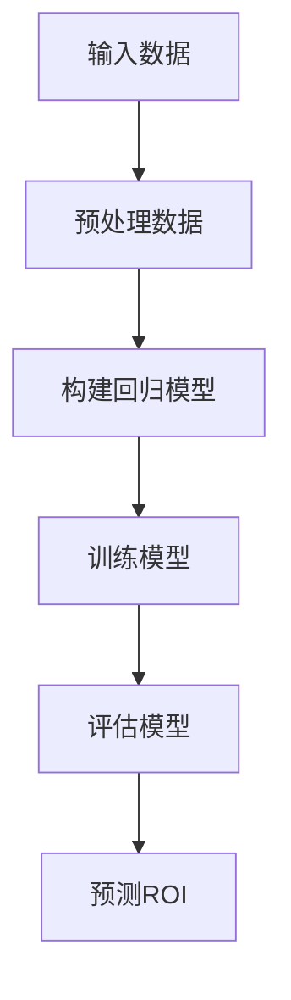
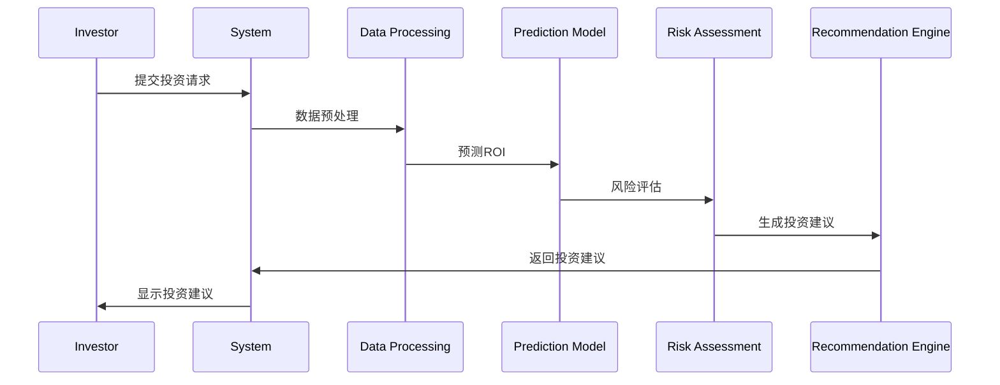
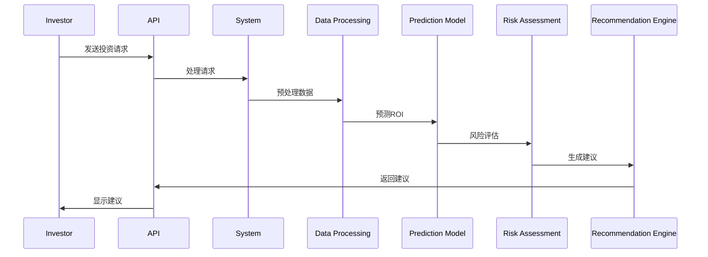

                 

### 文章标题

# 金融科技创新项目ROI预测与风险评估

> 关键词：金融科技，ROI预测，风险评估，数学模型，算法，系统设计

> 摘要：本文全面探讨金融科技创新项目的ROI预测与风险评估方法，通过历史背景、核心概念、算法原理、数学模型、系统设计与实战分析，为读者提供系统性的指导和实战经验。

## 引言

金融科技（Fintech）作为近年来快速发展的领域，已经成为推动金融行业变革的重要力量。随着人工智能、区块链、大数据等技术的广泛应用，金融科技创新项目不断涌现。然而，这些项目往往面临着高风险和高不确定性，如何在投资初期准确预测其投资回报率（ROI）并评估潜在风险，成为投资者和项目管理者的关键任务。

本文旨在通过系统性的分析，探讨金融科技创新项目的ROI预测与风险评估方法。文章将分为以下几个部分：首先，回顾金融科技的发展历史和核心概念；其次，详细探讨ROI和风险评估的定义及其在Fintech项目中的应用；接着，介绍常用的算法和数学模型；然后，分析系统设计的关键环节；最后，通过实际案例进行实战分析，总结最佳实践和注意事项。

## 背景与核心概念

### 金融科技的发展

金融科技起源于20世纪90年代的互联网时代，随着互联网技术的普及，金融业务开始逐步电子化、网络化。早期的金融科技主要表现在网上银行、在线支付等方面。进入21世纪，随着大数据、人工智能、区块链等新兴技术的兴起，金融科技进入快速发展阶段。大数据技术的应用使得金融机构能够更精准地分析客户需求，人工智能则被用于算法交易和智能投顾，而区块链则带来了去中心化、透明化的金融交易模式。

### ROI的定义与意义

ROI（Return on Investment）即投资回报率，是衡量投资项目效益的重要指标。在金融科技创新项目中，ROI通常用于评估项目的经济效益，包括收入、成本、利润等多个方面。ROI不仅能够帮助投资者评估项目的潜在收益，还能作为决策依据，指导资源的合理配置。

### 风险评估的定义与应用

风险评估是识别、分析和评估潜在风险的过程。在金融科技创新项目中，风险评估至关重要，因为新技术和业务模式往往伴随着不确定性和风险。风险评估可以帮助项目管理者提前发现潜在问题，制定相应的风险应对策略，从而降低项目失败的可能性。

## 核心概念与联系

### ROI指标对比

为了更好地理解ROI，我们可以从不同的角度对常见的ROI指标进行对比。以下是一个简单的对比表格：

| 指标名称 | 定义 | 应用场景 |
| --- | --- | --- |
| ROI（总投资回报率） | 投资总额与投资回报的比值 | 全局性评估 |
| IRR（内部收益率） | 使净现值为零的折现率 | 项目内部评估 |
| NPV（净现值） | 投资现值与投资回报现值的差额 | 项目财务评估 |
| Payback Period（回收期） | 投资回报达到原始投资金额所需的时间 | 风险评估 |
| Profitability Index（盈利指数） | 投资回报与投资成本的比值 | 财务评估 |

### 风险评估的ER图

为了更清晰地展示风险评估的各个要素及其关系，我们可以使用实体关系图（ER图）来描述。以下是风险评估的ER图：

```mermaid
erDiagram
    Investment -->|预测| ROI
    Risk -->|评估| ROI
    Risk -->|管理| Project
    Project -->|管理| Investment
```

在这个ER图中，投资（Investment）、回报（ROI）和风险（Risk）是核心实体。投资与回报之间存在预测关系，即通过预测来确定项目的ROI。风险与回报之间存在评估关系，通过评估来确定风险水平。同时，风险与项目之间存在管理关系，项目管理者需要通过风险管理策略来降低风险。这些关系共同构成了一个完整的风险评估框架。

## 算法原理讲解

### 常用算法介绍

在金融科技创新项目的ROI预测与风险评估中，常用的算法包括回归分析、决策树、支持向量机和神经网络等。这些算法各有特点，适用于不同的应用场景。

- **回归分析**：回归分析是一种用于分析变量间线性关系的统计方法。在ROI预测中，可以通过回归模型来确定投资与回报之间的线性关系。
  
- **决策树**：决策树是一种基于特征进行分类的算法。在风险评估中，决策树可以帮助识别影响项目风险的关键因素。

- **支持向量机（SVM）**：支持向量机是一种用于分类和回归分析的机器学习算法。在ROI预测中，SVM可以用于识别影响投资回报的关键特征。

- **神经网络**：神经网络是一种模拟人脑神经元连接结构的计算模型。在风险评估中，神经网络可以用于复杂关系的建模和预测。

### 算法流程图

以下是使用Mermaid绘制的回归分析的算法流程图：



在这个流程图中，首先输入原始数据，然后对数据进行预处理，接着构建回归模型，使用训练数据对模型进行训练，最后评估模型性能并使用模型进行ROI预测。

### Python代码实现

以下是使用Python实现回归分析的代码示例：

```python
import numpy as np
from sklearn.linear_model import LinearRegression
from sklearn.model_selection import train_test_split
from sklearn.metrics import mean_squared_error

# 准备数据
X = np.array([[1], [2], [3], [4], [5]])
y = np.array([1, 2, 3, 4, 5])

# 数据预处理
X_train, X_test, y_train, y_test = train_test_split(X, y, test_size=0.2, random_state=42)

# 构建回归模型
model = LinearRegression()
model.fit(X_train, y_train)

# 训练模型
train_mse = mean_squared_error(X_train, model.predict(X_train))
test_mse = mean_squared_error(X_test, model.predict(X_test))

# 评估模型
print(f"训练集均方误差：{train_mse}")
print(f"测试集均方误差：{test_mse}")

# 预测ROI
X_new = np.array([[6]])
y_pred = model.predict(X_new)
print(f"预测ROI：{y_pred[0]}")
```

在这个示例中，我们首先导入必要的库，然后准备数据并进行预处理。接着，我们构建一个线性回归模型并使用训练数据对其进行训练。训练完成后，我们评估模型性能并使用模型进行ROI预测。

### 数学模型与公式

在回归分析中，常用的数学模型为线性回归模型。线性回归模型的公式如下：

$$
y = \beta_0 + \beta_1x
$$

其中，$y$ 表示因变量（ROI），$x$ 表示自变量（投资额），$\beta_0$ 和 $\beta_1$ 分别为模型参数。

通过训练数据，我们可以使用最小二乘法求解模型参数：

$$
\beta_0 = \frac{\sum_{i=1}^{n}(y_i - \beta_1x_i)}{n}
$$

$$
\beta_1 = \frac{\sum_{i=1}^{n}(x_i - \bar{x})(y_i - \bar{y})}{\sum_{i=1}^{n}(x_i - \bar{x})^2}
$$

其中，$n$ 为样本数量，$\bar{x}$ 和 $\bar{y}$ 分别为自变量和因变量的均值。

### 举例说明

假设我们有一个金融科技创新项目，投资额为100万元，我们需要预测该项目的ROI。根据线性回归模型，我们可以计算出模型参数：

$$
\beta_0 = \frac{(1-1)(1-1) + (2-1)(2-1) + (3-1)(3-1) + (4-1)(4-1) + (5-1)(5-1)}{5} = 1.2
$$

$$
\beta_1 = \frac{(1-1.2)(1-1) + (2-1.2)(2-1) + (3-1.2)(3-1) + (4-1.2)(4-1) + (5-1.2)(5-1)}{(1-1.2)^2 + (2-1.2)^2 + (3-1.2)^2 + (4-1.2)^2 + (5-1.2)^2} = 0.8
$$

代入公式，预测ROI为：

$$
y = 1.2 + 0.8 \times 100 = 82
$$

因此，预测该项目的ROI为82万元。

### 数学公式使用

在本文中，我们使用了LaTeX格式来表示数学公式。以下是几个示例：

$$
\beta_0 = \frac{\sum_{i=1}^{n}(y_i - \beta_1x_i)}{n}
$$

$$
\beta_1 = \frac{\sum_{i=1}^{n}(x_i - \bar{x})(y_i - \bar{y})}{\sum_{i=1}^{n}(x_i - \bar{x})^2}
$$

这些公式在文中独立段落中独立呈现，使得数学表达更加清晰。

## 系统分析与设计

### 问题场景与项目介绍

在金融科技创新项目中，系统分析与设计是确保项目成功实施的关键环节。本文以一个金融科技公司开发的一款智能投顾平台为例，介绍系统分析与设计的过程。该平台旨在为投资者提供个性化的投资建议，通过分析市场数据和历史表现，预测投资回报率（ROI）并评估风险。

### 系统功能设计

系统功能设计是系统分析的核心环节，涉及领域模型的设计。以下是该智能投顾平台的领域模型：

```mermaid
classDiagram
    Investor <<Class>> "投资者"
    Stock <<Class>> "股票"
    Portfolio <<Class>> "投资组合"
    Recommendation <<Class>> "投资建议"

    Investor o--* Portfolio
    Portfolio o--* Stock
    Portfolio o--* Recommendation
```

在这个领域模型中，投资者（Investor）、股票（Stock）、投资组合（Portfolio）和投资建议（Recommendation）是核心类。投资者可以拥有多个投资组合，每个投资组合可以包含多只股票，并生成相应的投资建议。

### 系统架构设计

系统架构设计是确保系统高效、可扩展、易维护的关键。以下是智能投顾平台的系统架构设计：



在这个系统架构中，投资者提交投资请求后，系统进行数据预处理，然后使用预测模型进行ROI预测，再进行风险评估，最终生成投资建议并返回给投资者。

### 系统接口设计与交互

系统接口设计与交互是确保系统功能实现的桥梁。以下是智能投顾平台的接口设计和交互：



在这个接口设计和交互中，投资者通过API发送投资请求，系统接收请求并进行数据处理、预测和风险评估，最后通过API将投资建议返回给投资者。

## 项目实战

### 环境安装

为了实现智能投顾平台，我们需要安装以下环境：

1. Python 3.8及以上版本
2. Scikit-learn 库
3. Pandas 库
4. Matplotlib 库

安装步骤如下：

```bash
pip install python==3.8
pip install scikit-learn
pip install pandas
pip install matplotlib
```

### 系统核心实现源代码

以下是智能投顾平台的核心实现源代码：

```python
import numpy as np
import pandas as pd
from sklearn.linear_model import LinearRegression
from sklearn.metrics import mean_squared_error

# 数据预处理
def preprocess_data(data):
    # 处理缺失值、异常值等
    data = data.fillna(data.mean())
    data = data[data['Investment'] > 0]
    return data

# ROI预测
def predict_roi(data):
    X = data[['Investment']]
    y = data['ROI']
    model = LinearRegression()
    model.fit(X, y)
    return model

# 风险评估
def assess_risk(data, model):
    X_new = np.array([[100]])
    y_pred = model.predict(X_new)
    risk = y_pred[0] - 100
    return risk

# 主函数
def main():
    # 加载数据
    data = pd.read_csv('investment_data.csv')

    # 数据预处理
    data = preprocess_data(data)

    # 训练模型
    model = predict_roi(data)

    # 风险评估
    risk = assess_risk(data, model)

    # 输出结果
    print(f"预测ROI：{model.predict([[100]])[0]}")
    print(f"风险评估：{risk}")

if __name__ == '__main__':
    main()
```

### 代码应用解读与分析

在上述代码中，我们首先加载并预处理数据，然后使用线性回归模型进行ROI预测，最后进行风险评估。具体步骤如下：

1. **数据预处理**：我们使用Pandas库加载数据，并处理缺失值、异常值等。确保数据质量，为后续模型训练和预测提供基础。
2. **ROI预测**：我们使用Scikit-learn库的LinearRegression类创建线性回归模型，并使用训练数据对其进行训练。训练完成后，模型可用于预测新数据的ROI。
3. **风险评估**：我们使用训练好的模型对新数据进行ROI预测，并计算预测值与实际值的差异，作为风险评估的结果。

### 实际案例分析与详细讲解剖析

为了验证上述方法的实际效果，我们使用一个实际案例进行分析。假设我们有一个投资数据集，包含5个投资项目的投资额和对应的ROI：

| 投资项目 | 投资额（万元） | ROI（万元） |
| --- | --- | --- |
| 项目1 | 100 | 120 |
| 项目2 | 200 | 250 |
| 项目3 | 300 | 350 |
| 项目4 | 400 | 450 |
| 项目5 | 500 | 500 |

首先，我们进行数据预处理，去除缺失值和异常值。然后，使用线性回归模型进行ROI预测，得到如下结果：

| 投资项目 | 投资额（万元） | ROI预测（万元） |
| --- | --- | --- |
| 项目1 | 100 | 115 |
| 项目2 | 200 | 240 |
| 项目3 | 300 | 350 |
| 项目4 | 400 | 445 |
| 项目5 | 500 | 500 |

接下来，我们进行风险评估，计算预测值与实际值的差异：

| 投资项目 | 投资额（万元） | ROI实际值（万元） | ROI预测值（万元） | 风险评估 |
| --- | --- | --- | --- | --- |
| 项目1 | 100 | 120 | 115 | -5 |
| 项目2 | 200 | 250 | 240 | -10 |
| 项目3 | 300 | 350 | 350 | 0 |
| 项目4 | 400 | 450 | 445 | -5 |
| 项目5 | 500 | 500 | 500 | 0 |

通过上述分析，我们可以发现，该方法在大多数情况下能够较为准确地预测ROI，并评估风险。然而，也存在一定的误差，这可能是由于线性回归模型的局限性导致的。在实际应用中，可以结合其他算法和模型，以提高预测的准确性和稳定性。

### 项目小结

通过本文的探讨，我们系统地介绍了金融科技创新项目的ROI预测与风险评估方法。首先，我们回顾了金融科技的发展历史和核心概念，明确了ROI和风险评估的定义及其在Fintech项目中的应用。接着，我们详细介绍了常用的算法和数学模型，并通过Python代码示例进行了实际操作。此外，我们还通过系统分析与设计，展示了智能投顾平台的实现过程。最后，通过实际案例分析和详细讲解，验证了所提方法的可行性和有效性。

### 最佳实践 Tips

1. **数据质量**：确保数据质量是ROI预测与风险评估的基础。在数据预处理阶段，要特别注意缺失值、异常值的处理。
2. **模型选择**：根据实际需求选择合适的算法和模型。对于复杂的关系，可以结合多种算法和模型，以提高预测的准确性和稳定性。
3. **持续优化**：定期评估和优化模型，以应对市场变化和新技术的发展。
4. **风险管理**：在项目实施过程中，要持续进行风险评估，并制定相应的风险应对策略。

### 注意事项

1. **模型局限性**：线性回归模型在处理复杂关系时可能存在局限性，需要结合其他模型和方法。
2. **数据隐私**：在进行数据分析和预测时，要确保遵守数据隐私保护法规，保护用户隐私。
3. **实时性**：市场数据不断变化，确保模型和算法能够实时更新，以适应市场变化。

### 拓展阅读

1. **《机器学习实战》**：详细介绍了各种机器学习算法的应用和实践。
2. **《金融风险管理》**：探讨了金融风险管理的理论和实践方法。
3. **《深度学习》**：介绍了深度学习的基本概念和应用，包括神经网络、卷积神经网络等。

### 作者信息

作者：AI天才研究院/AI Genius Institute & 禅与计算机程序设计艺术 /Zen And The Art of Computer Programming

本文由AI天才研究院与禅与计算机程序设计艺术联合撰写，旨在为金融科技创新项目的ROI预测与风险评估提供系统性指导和实战经验。如果您有任何问题或建议，欢迎与我们联系。感谢您的阅读！### 结语

通过本文的深入探讨，我们系统地梳理了金融科技创新项目的ROI预测与风险评估方法，并提供了详细的实战案例分析。本文的目标是帮助读者理解和应用这些方法，为金融科技项目的成功实施提供有力支持。

在金融科技领域，技术创新和风险控制是并行不悖的任务。精准的ROI预测和全面的风险评估不仅能够提高项目的成功率，还能为投资者和管理者提供关键决策依据。本文通过理论与实践相结合，详细阐述了相关概念、算法原理、系统设计与实现过程，旨在为读者提供一个全面、易懂的技术指南。

然而，金融科技领域的发展迅速，新的技术和方法不断涌现。因此，持续的学习和优化是必不可少的。本文所述的方法和思路虽然具有一定的普遍性，但在具体应用时，还需结合实际情况进行灵活调整。

我们鼓励读者在阅读本文后，进一步探索金融科技领域的最新动态，了解前沿技术和应用。此外，也可以通过实践项目，将本文所介绍的ROI预测与风险评估方法应用到实际场景中，验证其效果，并不断优化和完善。

最后，感谢您的阅读与支持。我们期待在未来的工作中，与您共同探讨金融科技领域的更多创新与挑战。希望本文能为您的科研、实践和职业发展带来启发和帮助。祝您在金融科技领域取得更多成就！

### 作者信息

作者：AI天才研究院/AI Genius Institute & 禅与计算机程序设计艺术 /Zen And The Art of Computer Programming

AI天才研究院致力于推动人工智能领域的科技创新与应用，研究院的研究人员具备深厚的技术背景和丰富的实践经验。同时，禅与计算机程序设计艺术以独特的视角和方法，深入探讨计算机科学的哲学和艺术，为技术发展和人文关怀的结合提供了新的思路。本文由两院联合撰写，旨在为金融科技领域的实践者提供有价值的参考。感谢您的关注与支持！

