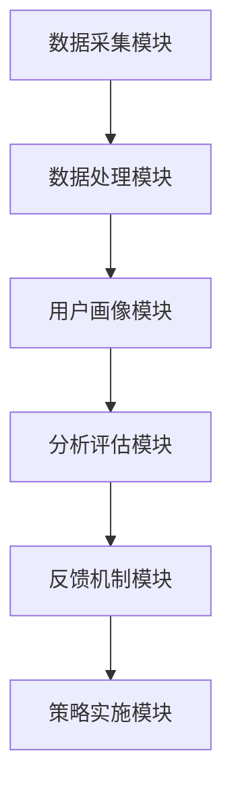

                 

# 金融科技用户体验优化系统

## 关键词

- 金融科技
- 用户体验
- 优化系统
- 数据分析
- 用户画像
- 技术创新

## 摘要

本文旨在探讨金融科技用户体验优化系统的构建与应用。随着金融科技行业的快速发展，用户体验成为影响金融产品竞争力的关键因素。本文首先分析了金融科技用户体验优化的背景和问题，然后阐述了用户体验优化的核心概念，包括用户画像、数据分析和反馈机制等。接着，本文介绍了用户体验优化系统的架构设计和实现方法，包括数据收集、处理和用户体验评估等环节。最后，通过实际案例展示了用户体验优化系统的应用效果，并提出了优化用户体验的最佳实践和建议。

------------------------------------------------------------------------

## 第一部分：引言

### 第1章：金融科技与用户体验优化

#### 1.1 问题背景

随着互联网和移动通信技术的迅猛发展，金融科技（FinTech）逐渐渗透到金融行业的各个方面，改变了传统金融服务的模式。金融科技通过大数据、人工智能、区块链等技术手段，为用户提供更加便捷、高效、个性化的金融服务。然而，金融科技的发展不仅带来了技术革新，也带来了用户体验的变革。

用户体验（User Experience，简称UX）是用户在使用产品或服务过程中所获得的整体感受。在金融科技领域，用户体验的优化已成为提升产品竞争力、增加用户黏性的关键。良好的用户体验不仅能够满足用户的功能需求，还能带来情感上的满足，从而提高用户满意度和忠诚度。

#### 1.2 问题描述

金融科技用户体验优化的难点在于如何平衡技术创新与用户体验。一方面，金融科技需要不断创新以满足用户多样化的需求；另一方面，用户体验的优化需要确保产品的稳定性、安全性和易用性。此外，不同用户群体的需求和偏好存在差异，如何针对不同用户制定个性化的用户体验优化策略也是一个挑战。

#### 1.3 问题解决

为了解决金融科技用户体验优化的问题，可以采取以下策略：

1. **用户需求分析**：通过用户调研、数据分析等方法，深入了解用户的需求和偏好，为用户体验优化提供数据支持。
2. **用户画像构建**：对用户进行细分，构建详细的用户画像，以便制定个性化的用户体验优化方案。
3. **数据分析与反馈**：利用数据分析工具，挖掘用户行为数据，结合用户反馈，不断优化用户体验。
4. **迭代开发与测试**：采用敏捷开发方法，快速迭代产品，通过用户测试和反馈，不断改进用户体验。

#### 1.4 边界与外延

本文将重点关注金融科技用户体验优化系统的构建与应用，探讨其核心概念、架构设计和实现方法。同时，本文还将结合实际案例，分析用户体验优化系统的效果和最佳实践，以期为金融科技企业提供有益的参考。

#### 1.5 概念结构与核心要素组成

1. **金融科技**：指通过信息技术和互联网等手段创新金融产品和服务，提升金融服务效率和用户体验。
2. **用户体验**：用户在使用金融科技产品和服务过程中的整体感受，包括满意度、忠诚度等。
3. **用户需求**：用户在金融科技产品和服务中的功能性需求、情感需求等。
4. **用户画像**：对用户基本属性、行为习惯、偏好需求等多维度数据的抽象和集成。
5. **数据分析**：通过数据挖掘和分析，了解用户需求和行为，为用户体验优化提供依据。
6. **优化策略**：根据用户画像和数据分析结果，制定和实施提升用户体验的具体措施。

------------------------------------------------------------------------

## 第二部分：核心概念与联系

### 第2章：金融科技用户体验优化的核心概念

#### 2.1 用户画像

用户画像是对用户基本属性、行为习惯、偏好需求等多维度数据的抽象和集成，是用户体验优化的基础。用户画像的构建有助于深入了解用户，为个性化服务和优化用户体验提供支持。

**2.1.1 概念原理**

用户画像的构建通常包括以下几个步骤：

1. 数据收集：通过用户注册信息、交易记录、浏览行为等渠道收集用户数据。
2. 数据清洗：对收集到的数据进行清洗、去噪，确保数据质量。
3. 数据分析：对清洗后的数据进行多维度分析，提取用户属性、行为习惯和偏好需求。
4. 用户分类：根据分析结果，将用户分为不同的群体，为后续个性化服务和优化提供依据。

**2.1.2 属性特征对比表格**

| 用户属性   | 描述                                                   | 重要性 |
| ---------- | ------------------------------------------------------ | ------ |
| 年龄       | 用户年龄段分布                                         | 对产品定位和功能设计有直接影响 |
| 性别       | 用户性别比例                                           | 影响用户体验和产品设计细节 |
| 收入       | 用户收入水平                                           | 影响用户对产品价格和功能的接受程度 |
| 教育       | 用户教育背景                                           | 对产品功能和用户指导有影响 |

**2.1.3 ER实体关系图架构**

```mermaid
erConfig {
  title "用户画像实体关系图"
  orientation LR
  nodesep 30
  ranksep 50
}
node[shape=rectangle]
User
BasicInfo
Behavior
Preference

edge[arrowhead=none]
User -> BasicInfo
User -> Behavior
User -> Preference

subgraph {
  rank=same
  BasicInfo[shape=rectangle,label="基本信息"]
  Behavior[shape=rectangle,label="行为数据"]
  Preference[shape=rectangle,label="偏好数据"]
}
```

#### 2.2 用户体验优化策略

用户体验优化策略是在了解用户需求和用户画像的基础上，通过数据分析和反馈机制，制定和实施提升用户体验的具体措施。

**2.2.1 概念原理**

用户体验优化策略的构建包括以下几个步骤：

1. 用户需求分析：通过用户调研、数据分析等方法，了解用户在金融科技产品和服务中的需求。
2. 用户画像构建：根据用户需求分析结果，构建详细的用户画像。
3. 数据分析：利用数据分析工具，挖掘用户行为数据，了解用户在产品和服务中的表现。
4. 优化策略制定：根据用户画像和数据分析结果，制定提升用户体验的优化策略。
5. 实施与反馈：将优化策略实施到产品和服务中，通过用户反馈不断调整和优化。

**2.2.2 属性特征对比表格**

| 数据类型 | 描述                                     | 作用           |
| -------- | ---------------------------------------- | -------------- |
| 用户行为数据 | 用户在金融科技产品上的操作记录           | 评估产品功能使用情况 |
| 用户反馈数据 | 用户对金融科技产品的评价和意见           | 提供改进方向   |
| 行业趋势数据 | 金融科技领域的发展趋势和竞争态势         | 指导产品创新方向 |

**2.2.3 ER实体关系图架构**

```mermaid
erConfig {
  title "用户体验优化策略实体关系图"
  orientation LR
  nodesep 30
  ranksep 50
}
node[shape=rectangle]
BehaviorData
FeedbackData
OptimizationStrategy

edge[arrowhead=none]
BehaviorData -> OptimizationStrategy
FeedbackData -> OptimizationStrategy

subgraph {
  rank=same
  BehaviorData[shape=rectangle,label="用户行为数据"]
  FeedbackData[shape=rectangle,label="用户反馈数据"]
  OptimizationStrategy[shape=rectangle,label="优化策略"]
}
```

------------------------------------------------------------------------

## 第三部分：用户体验优化系统的架构设计与实现

### 第3章：用户体验优化系统的架构设计

#### 3.1 系统架构设计

用户体验优化系统通常包括以下几个关键组成部分：

1. **数据采集模块**：负责从不同的数据源（如用户注册信息、交易记录、浏览器日志等）收集用户数据。
2. **数据处理模块**：对采集到的数据进行清洗、去噪、整合，以便构建用户画像。
3. **用户画像模块**：基于数据处理结果，构建详细的用户画像，为个性化服务和优化提供支持。
4. **分析评估模块**：利用用户画像和数据分析工具，评估用户在产品和服务中的体验。
5. **反馈机制模块**：收集用户对产品和服务体验的反馈，为持续优化提供依据。
6. **策略实施模块**：根据分析评估结果和用户反馈，制定和实施具体的用户体验优化策略。

**3.1.1 系统架构图**



#### 3.2 系统功能设计

用户体验优化系统的功能设计应包括以下几个方面：

1. **用户数据采集**：通过API接口、日志文件等方式，自动收集用户行为数据和反馈信息。
2. **数据处理与分析**：对采集到的数据进行清洗、整合，利用机器学习算法进行用户画像构建。
3. **用户画像展示**：提供用户画像的可视化展示功能，帮助决策者直观了解用户特征。
4. **用户体验评估**：基于用户行为数据和用户反馈，评估用户体验，识别潜在问题。
5. **策略生成与优化**：根据用户体验评估结果，自动生成优化策略，并在产品和服务中实施。
6. **反馈循环**：收集用户对优化策略的反馈，不断调整和优化用户体验。

**3.2.1 领域模型类图**

```mermaid
classDiagram
    User <<class>> User
    DataCollector <<class>> DataCollector
    DataProcessor <<class>> DataProcessor
    UserProfiler <<class>> UserProfiler
    ExperienceAssessor <<class>> ExperienceAssessor
    FeedbackCollector <<class>> FeedbackCollector
    StrategyExecutor <<class>> StrategyExecutor

    User "uses" DataCollector
    User "uses" DataProcessor
    User "uses" UserProfiler
    User "uses" ExperienceAssessor
    User "uses" FeedbackCollector
    User "uses" StrategyExecutor

    UserProfiler "provides" UserProfilerData
    ExperienceAssessor "provides" ExperienceReport
    StrategyExecutor "executes" Strategy

    class User {
        +String id
        +List<String> attributes
        +Map<String, Object> behaviors
        +Map<String, Object> preferences
    }

    class DataCollector {
        +collectData()
    }

    class DataProcessor {
        +cleanData()
        +integrateData()
    }

    class UserProfiler {
        +buildUserProfile()
        +provideUserProfileData()
    }

    class ExperienceAssessor {
        +evaluateExperience()
        +provideExperienceReport()
    }

    class FeedbackCollector {
        +collectFeedback()
    }

    class StrategyExecutor {
        +generateStrategy()
        +executeStrategy()
    }
```

### 第4章：用户体验优化系统的实现方法

#### 4.1 数据采集与处理

**4.1.1 数据采集**

数据采集是用户体验优化系统的第一步，涉及到从多个数据源收集用户数据。以下是一个简单示例：

```python
# 数据采集示例
def collect_user_data():
    user_data = {
        'id': 'user123',
        'attributes': ['age', 'gender', 'income', 'education'],
        'behaviors': ['login', 'deposit', 'transfer', 'withdrawal'],
        'preferences': ['app_notification', 'email_preference']
    }
    return user_data
```

**4.1.2 数据处理**

数据处理包括数据清洗、去噪和整合，以便构建高质量的用户画像。以下是一个数据处理示例：

```python
# 数据处理示例
def process_user_data(user_data):
    # 数据清洗
    cleaned_data = {key: value for key, value in user_data.items() if value is not None}
    
    # 去噪
    nois

