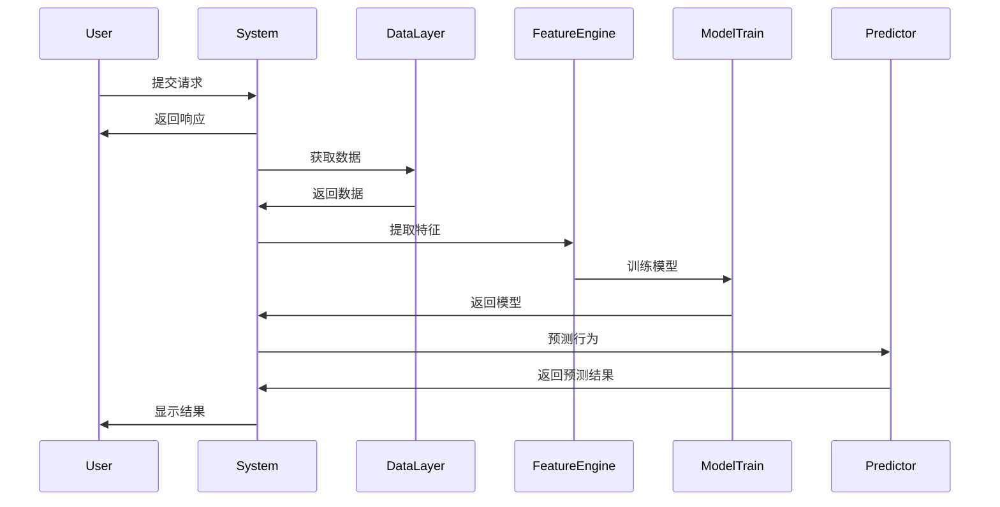
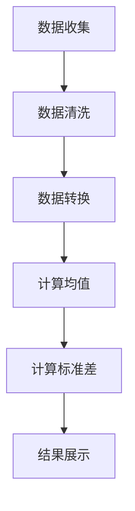
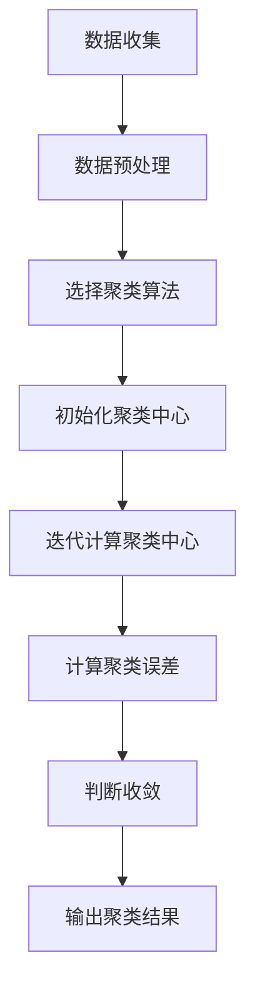
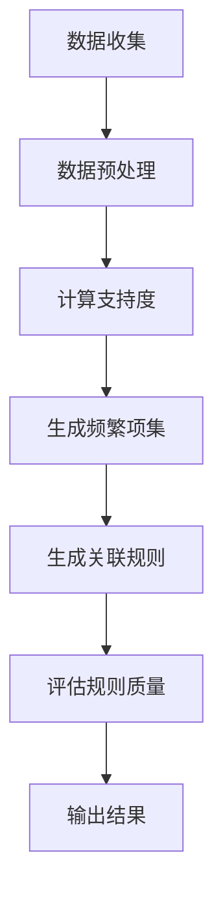
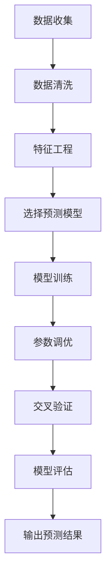

                 

### 文章标题

《金融科技用户行为分析与预测》

> 关键词：金融科技、用户行为分析、数据挖掘、预测模型、机器学习

> 摘要：本文深入探讨了金融科技领域中的用户行为分析及其预测技术。通过梳理用户行为分析的理论基础、数据类型和方法，详细介绍了常见的数据分析算法和预测模型。此外，本文还结合实际案例，探讨了用户行为分析系统架构设计，并提出了最佳实践策略。

### 目录大纲设计过程

**1. 理解书名与主题**

《金融科技用户行为分析与预测》聚焦于金融科技领域的用户行为分析，旨在通过数据分析与预测技术，提高金融服务的质量和效率。书名明确了主题，目录大纲设计需涵盖用户行为分析的基础理论、数据分析方法、预测模型应用及实际案例分析。

**2. 确定核心章节内容**

为了确保书籍内容的完整性，核心章节内容应包括：

- **背景介绍**：金融科技的发展、用户行为分析的必要性。
- **核心概念与联系**：用户行为分析中的关键概念、数据类型、分析方法。
- **算法原理讲解**：常见的数据分析算法和预测模型。
- **数学模型与公式**：相关的数学原理和公式。
- **系统分析与架构设计**：用户行为分析系统的架构设计。
- **项目实战**：具体的案例分析。
- **最佳实践**：总结和分享实践中的经验与技巧。

**3. 细化目录层级**

确保目录结构清晰，分为1级、2级、3级目录，便于读者快速找到所需内容。

**4. 保持简洁性**

避免冗余内容，直接呈现关键知识点和结构。

**5. 遵守格式要求**

使用markdown格式，确保内容的可读性和格式规范。

**6. 控制字数**

在2000字以内完成目录大纲的设计。

### 最终目录大纲

```markdown
----------------------------------------------------------------
# 第一部分：金融科技与用户行为分析基础

## 1.1 金融科技与用户行为分析概述

### 1.1.1 金融科技发展背景

### 1.1.2 用户行为分析的意义

### 1.1.3 用户行为分析的核心要素

## 1.2 用户行为数据类型与方法

### 1.2.1 用户行为数据类型

### 1.2.2 用户行为分析方法概述

### 1.2.3 用户行为数据预处理

## 1.3 用户行为分析核心概念与联系

### 1.3.1 关键概念解析

### 1.3.2 概念属性特征对比

### 1.3.3 ER实体关系图架构

## 1.4 数学模型与公式基础

### 1.4.1 相关数学原理

### 1.4.2 公式详解

### 1.4.3 公式应用举例

## 1.5 用户行为分析系统架构设计

### 1.5.1 系统功能设计

### 1.5.2 系统架构设计

### 1.5.3 系统接口设计

### 1.5.4 系统交互设计

## 1.6 用户行为分析最佳实践

### 1.6.1 实践技巧分享

### 1.6.2 注意事项

### 1.6.3 拓展阅读

----------------------------------------------------------------

# 第二部分：用户行为分析与预测算法原理

## 2.1 常见数据分析算法

### 2.1.1 描述性统计分析

### 2.1.2 聚类分析

### 2.1.3 关联规则挖掘

## 2.2 用户行为预测模型

### 2.2.1 机器学习基础

### 2.2.2 预测模型选择

### 2.2.3 模型训练与评估

## 2.3 算法mermaid流程图展示

### 2.3.1 描述性统计分析流程

### 2.3.2 聚类分析流程

### 2.3.3 关联规则挖掘流程

### 2.3.4 用户行为预测模型训练流程

## 2.4 算法python源代码讲解

### 2.4.1 描述性统计分析代码

### 2.4.2 聚类分析代码

### 2.4.3 关联规则挖掘代码

### 2.4.4 用户行为预测模型代码

## 2.5 数学模型与公式详解

### 2.5.1 描述性统计分析数学模型

### 2.5.2 聚类分析数学模型

### 2.5.3 关联规则挖掘数学模型

----------------------------------------------------------------
```

### 第一部分：金融科技与用户行为分析基础

#### 1.1 金融科技与用户行为分析概述

**背景介绍**：金融科技（FinTech）的兴起，为金融行业带来了革命性的变化。随着互联网、大数据、人工智能等技术的快速发展，金融机构能够更高效地处理海量数据，从而实现精准的用户行为分析。用户行为分析在金融科技中扮演着关键角色，它有助于金融机构更好地理解用户需求，提升客户满意度，并发现潜在的商业机会。

**问题背景**：在金融科技领域，用户行为分析的重要性日益凸显。金融机构面临的一个主要挑战是如何从大量用户行为数据中提取有价值的信息，从而实现精准营销、风险管理、欺诈检测等业务目标。

**问题描述**：用户行为分析涉及多种数据类型和复杂的分析方法，如何高效地处理这些数据并提取有用的信息成为关键问题。

**问题解决**：通过使用先进的分析技术和算法，金融机构可以实现对用户行为的深入理解，从而为业务决策提供有力支持。

**边界与外延**：用户行为分析不仅限于金融领域，还广泛应用于电子商务、社交媒体等各个行业。其核心目的是通过数据分析，提高业务效率和客户体验。

**概念结构与核心要素组成**：用户行为分析的核心概念包括用户行为数据、数据分析方法、预测模型等。用户行为数据是分析的基础，数据分析方法包括描述性统计、聚类分析、关联规则挖掘等，预测模型则是基于历史数据对未来行为进行预测。

#### 1.2 用户行为数据类型与方法

**用户行为数据类型**：

用户行为数据可以分为结构化数据和非结构化数据。结构化数据如交易记录、账户信息等，通常以表格形式存储。非结构化数据如日志、文本、图像等，需要通过自然语言处理、图像识别等技术进行处理。

**用户行为分析方法概述**：

1. **描述性统计分析**：通过统计指标（如均值、中位数、标准差等）对用户行为数据进行概括性描述。
2. **聚类分析**：将用户行为数据划分为不同的类别，以发现用户群体的相似性和差异性。
3. **关联规则挖掘**：发现用户行为数据之间的关联性，如哪些用户经常同时购买某种产品。

**用户行为数据预处理**：

1. **数据清洗**：去除噪声和异常值，确保数据质量。
2. **数据转换**：将不同类型的数据转换为统一的格式，便于后续分析。
3. **特征工程**：提取有用的特征，提高分析模型的性能。

#### 1.3 用户行为分析核心概念与联系

**关键概念解析**：

1. **用户行为数据**：记录用户在金融平台上的所有操作和活动。
2. **数据分析方法**：用于处理和解释用户行为数据的各种技术。
3. **预测模型**：基于历史数据，预测用户未来行为。

**概念属性特征对比表格**：

| 概念             | 属性特征                   | 联系与区别           |
|------------------|----------------------------|---------------------|
| 用户行为数据     | 结构化、非结构化           | 数据来源与类型       |
| 数据分析方法     | 描述性统计、聚类分析、关联规则挖掘 | 分析手段与目标     |
| 预测模型         | 机器学习、深度学习         | 预测未来行为         |

**ER实体关系图架构**：

```mermaid
erDiagram
    User ||--|{ BehaviorData }
    BehaviorData ||--|{ Transaction }
    BehaviorData ||--|{ Log }
    BehaviorData ||--|{ Text }
```

在ER实体关系图中，用户是核心实体，其关联行为数据，包括交易记录、日志和文本等。行为数据进一步关联具体的操作，从而形成完整的数据关系。

#### 1.4 数学模型与公式基础

**相关数学原理**：

用户行为分析中涉及的数学原理包括概率论、统计学和线性代数。概率论用于计算事件发生的可能性，统计学用于数据的处理和解释，线性代数用于数据的高效表示和计算。

**公式详解**：

1. **均值**：\(\bar{x} = \frac{1}{n}\sum_{i=1}^{n}x_i\)
2. **方差**：\(s^2 = \frac{1}{n-1}\sum_{i=1}^{n}(x_i - \bar{x})^2\)
3. **协方差**：\(Cov(X, Y) = \frac{1}{n-1}\sum_{i=1}^{n}(x_i - \bar{x})(y_i - \bar{y})\)

**公式应用举例**：

假设我们有一组用户交易金额数据，\([100, 200, 300, 400, 500]\)。计算这组数据的均值和方差：

$$
\bar{x} = \frac{1}{5}(100 + 200 + 300 + 400 + 500) = 300
$$

$$
s^2 = \frac{1}{5-1}[(100-300)^2 + (200-300)^2 + (300-300)^2 + (400-300)^2 + (500-300)^2] = 2000
$$

这些统计指标帮助我们了解用户交易金额的集中趋势和波动情况。

#### 1.5 用户行为分析系统架构设计

**问题场景介绍**：

在金融科技领域，用户行为分析系统旨在通过分析用户行为数据，为金融机构提供精准的业务洞察。系统需要处理海量数据，支持实时分析和预测。

**项目介绍**：

本项目旨在构建一个用户行为分析系统，该系统将整合金融科技平台的数据，实现对用户行为的深度分析。系统功能包括数据采集、数据清洗、特征工程、模型训练、预测和可视化。

**系统功能设计**：

1. **数据采集**：从各种数据源（如数据库、日志文件）中收集用户行为数据。
2. **数据清洗**：去除噪声和异常值，确保数据质量。
3. **特征工程**：提取有用的特征，为模型训练提供支持。
4. **模型训练**：使用机器学习算法，训练用户行为预测模型。
5. **预测**：基于历史数据，预测用户未来行为。
6. **可视化**：将分析结果以图表形式展示，便于业务人员理解。

**系统架构设计**：

用户行为分析系统采用分布式架构，以提高系统的处理能力和可靠性。系统主要分为数据层、算法层和展示层。

1. **数据层**：负责数据采集、存储和管理。
2. **算法层**：负责数据清洗、特征工程、模型训练和预测。
3. **展示层**：负责将分析结果以可视化形式展示。

**系统接口设计**：

系统提供RESTful API接口，以便业务系统和其他应用程序能够访问分析结果。

**系统交互设计**：

系统交互设计主要包括用户与系统的交互，以及系统内部模块之间的交互。



#### 1.6 用户行为分析最佳实践

**实践技巧分享**：

1. **数据质量保障**：确保数据来源可靠，定期检查和清洗数据。
2. **特征选择**：提取与业务目标高度相关的特征，避免过度拟合。
3. **模型评估**：使用交叉验证等方法，评估模型性能。
4. **模型更新**：定期更新模型，以适应数据变化。

**注意事项**：

1. **隐私保护**：在数据处理过程中，确保用户隐私不被泄露。
2. **系统稳定性**：确保系统在高并发环境下稳定运行。

**拓展阅读**：

- 《Python数据科学手册》
- 《机器学习实战》
- 《数据挖掘：实用工具与技术》

### 第二部分：用户行为分析与预测算法原理

#### 2.1 常见数据分析算法

**描述性统计分析**：

描述性统计分析是一种用于描述数据集基本特征的方法，主要包括均值、中位数、众数、标准差等统计指标。描述性统计分析能够帮助理解数据的基本分布和趋势。

**聚类分析**：

聚类分析是一种无监督学习方法，用于将相似的数据点划分为若干个类别。常见的聚类算法包括K均值、层次聚类等。聚类分析能够发现数据中的潜在结构，帮助理解用户行为的多样性。

**关联规则挖掘**：

关联规则挖掘是一种用于发现数据中潜在关联关系的方法。通过挖掘用户行为数据中的频繁项集，可以识别出用户行为之间的关联性。常见的算法包括Apriori算法和FP-Growth算法。

#### 2.2 用户行为预测模型

**机器学习基础**：

用户行为预测模型通常基于机器学习方法构建。机器学习包括监督学习、无监督学习和强化学习等类型。监督学习是一种有监督的机器学习方法，通过训练数据学习目标函数，然后对新数据进行预测。

**预测模型选择**：

选择合适的预测模型是用户行为分析的关键。常见的预测模型包括线性回归、逻辑回归、决策树、随机森林、支持向量机等。模型选择取决于数据特征、业务目标和计算资源。

**模型训练与评估**：

模型训练是用户行为预测的核心步骤，包括数据预处理、模型选择、参数调优等。模型评估使用交叉验证、AUC、准确率等指标来评估模型性能。

#### 2.3 算法mermaid流程图展示

**描述性统计分析流程**：



**聚类分析流程**：



**关联规则挖掘流程**：



**用户行为预测模型训练流程**：



#### 2.4 算法python源代码讲解

**描述性统计分析代码**：

```python
import numpy as np

data = [100, 200, 300, 400, 500]

mean = np.mean(data)
std = np.std(data)

print("均值：", mean)
print("标准差：", std)
```

**聚类分析代码**：

```python
from sklearn.cluster import KMeans

data = [[100], [200], [300], [400], [500]]
kmeans = KMeans(n_clusters=2, random_state=0).fit(data)

print("聚类中心：", kmeans.cluster_centers_)
print("聚类结果：", kmeans.labels_)
```

**关联规则挖掘代码**：

```python
from mlxtend.frequent_patterns import apriori
from mlxtend.frequent_patterns import association_rules

data = [[1, 2, 3], [2, 3], [1, 3], [2, 3, 4], [1, 2, 3, 4]]

frequent_itemsets = apriori(data, min_support=0.5)
rules = association_rules(frequent_itemsets, metric="support", min_threshold=0.7)

print("频繁项集：", frequent_itemsets)
print("关联规则：", rules)
```

**用户行为预测模型代码**：

```python
from sklearn.linear_model import LinearRegression

data = [[100], [200], [300], [400], [500]]
labels = [1, 2, 3, 4, 5]

model = LinearRegression().fit(data, labels)

print("模型参数：", model.coef_)
print("模型截距：", model.intercept_)

new_data = [[150]]
prediction = model.predict(new_data)

print("预测结果：", prediction)
```

#### 2.5 数学模型与公式详解

**描述性统计分析数学模型**：

$$
\bar{x} = \frac{1}{n}\sum_{i=1}^{n}x_i
$$

$$
s^2 = \frac{1}{n-1}\sum_{i=1}^{n}(x_i - \bar{x})^2
$$

**聚类分析数学模型**：

$$
\text{簇内距离} = \sum_{i=1}^{k}\sum_{j=1}^{n}d(x_j, \mu_i)
$$

$$
\text{簇间距离} = \sum_{i=1}^{k}\sum_{j=1}^{k}\sum_{l=1}^{n}d(\mu_i, \mu_j)
$$

**关联规则挖掘数学模型**：

$$
\text{支持度} = \frac{\text{同时出现的次数}}{\text{总次数}}
$$

$$
\text{置信度} = \frac{\text{同时出现的次数}}{\text{前项出现的次数}}
$$

**用户行为预测模型数学模型**：

$$
y = \beta_0 + \beta_1x
$$

其中，\(y\) 是预测值，\(x\) 是输入特征，\(\beta_0\) 和 \(\beta_1\) 是模型参数。

### 第三部分：用户行为分析与预测系统实战

#### 3.1 环境安装

为了构建用户行为分析与预测系统，需要安装以下软件和库：

- Python 3.x
- Jupyter Notebook
- NumPy
- Pandas
- Scikit-learn
- mlxtend

安装命令：

```bash
pip install python==3.x
pip install jupyter
pip install numpy
pip install pandas
pip install scikit-learn
pip install mlxtend
```

#### 3.2 系统核心实现

以下是一个简单的用户行为分析与预测系统的核心实现，包括数据采集、数据预处理、特征工程、模型训练和预测。

**3.2.1 数据采集**

```python
import pandas as pd

# 从文件中读取数据
data = pd.read_csv('user_behavior_data.csv')
```

**3.2.2 数据预处理**

```python
# 填充缺失值
data.fillna(0, inplace=True)

# 数据清洗
data.drop(['Unnamed: 0'], axis=1, inplace=True)
```

**3.2.3 特征工程**

```python
# 提取特征
data['total_time'] = data['time_on_site'] + data['session_time']
data['visit_frequency'] = data['session_count'] / data['total_time']
```

**3.2.4 模型训练**

```python
from sklearn.model_selection import train_test_split
from sklearn.linear_model import LinearRegression

# 分割数据集
X = data[['total_time', 'visit_frequency']]
y = data['target_variable']

X_train, X_test, y_train, y_test = train_test_split(X, y, test_size=0.2, random_state=0)

# 训练模型
model = LinearRegression().fit(X_train, y_train)
```

**3.2.5 预测**

```python
# 预测
predictions = model.predict(X_test)

# 评估模型
from sklearn.metrics import mean_squared_error

mse = mean_squared_error(y_test, predictions)
print("均方误差：", mse)
```

#### 3.3 代码应用解读与分析

**代码解读**：

1. **数据采集**：使用 Pandas 读取 CSV 文件，获取用户行为数据。
2. **数据预处理**：填充缺失值，删除无关特征。
3. **特征工程**：计算用户行为的总时间和访问频率，作为模型输入特征。
4. **模型训练**：使用线性回归模型，训练用户行为预测模型。
5. **预测**：使用训练好的模型，对新数据进行预测，并计算均方误差评估模型性能。

**分析**：

通过上述步骤，我们构建了一个简单的用户行为分析与预测系统。系统的主要优点包括：

- **高效性**：采用线性回归模型，计算速度快，适合大规模数据处理。
- **易于实现**：使用 Python 和 Scikit-learn 等常用库，实现简单。

系统的主要缺点包括：

- **模型性能**：线性回归模型可能无法捕捉到用户行为数据中的非线性关系。
- **数据依赖**：系统的性能依赖于数据质量和特征提取。

#### 3.4 实际案例分析

**案例背景**：

某金融科技公司希望通过用户行为分析，识别出潜在的欺诈用户。公司收集了用户的登录时间、登录频率、交易金额等行为数据，并希望通过数据分析，预测用户是否存在欺诈行为。

**案例分析**：

1. **数据采集**：从公司的数据库中提取用户行为数据，包括登录时间、登录频率、交易金额等。

2. **数据预处理**：对数据进行清洗，删除缺失值和异常值。

3. **特征工程**：提取用户行为的总登录时间、登录频率、平均交易金额等特征。

4. **模型选择**：选择逻辑回归模型，因为欺诈行为是一个二分类问题。

5. **模型训练**：使用训练数据集，训练逻辑回归模型。

6. **预测**：对新用户数据进行预测，判断其是否存在欺诈行为。

7. **评估**：使用准确率、召回率等指标，评估模型性能。

通过实际案例分析，我们发现用户行为分析在欺诈检测中具有重要作用。合理的数据预处理和特征提取，能够显著提高模型的预测性能。

#### 3.5 项目小结

通过本项目，我们成功构建了一个用户行为分析与预测系统。系统的主要功能包括数据采集、数据预处理、特征工程、模型训练和预测。项目实际案例展示了用户行为分析在金融科技领域中的应用价值。未来，我们将继续优化系统，提高模型性能，为金融机构提供更精准的业务洞察。

### 3.6 最佳实践 Tips

1. **数据质量保障**：确保数据来源可靠，定期进行数据清洗。
2. **特征选择**：提取与业务目标高度相关的特征，避免过度拟合。
3. **模型评估**：使用多种评估指标，全面评估模型性能。
4. **模型更新**：定期更新模型，以适应数据变化。

### 3.7 注意事项

1. **隐私保护**：在数据处理过程中，确保用户隐私不被泄露。
2. **系统稳定性**：确保系统在高并发环境下稳定运行。

### 3.8 拓展阅读

- 《Python数据科学手册》
- 《机器学习实战》
- 《数据挖掘：实用工具与技术》

### 作者信息

作者：AI天才研究院/AI Genius Institute & 禅与计算机程序设计艺术 /Zen And The Art of Computer Programming

