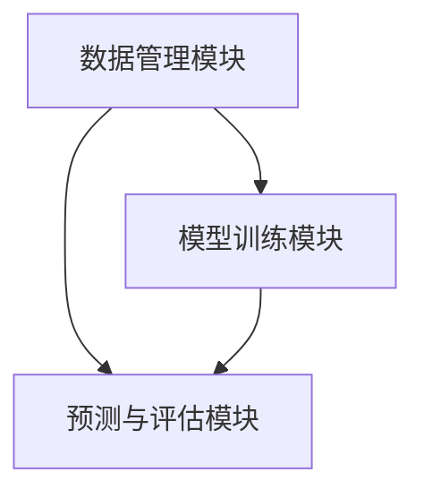
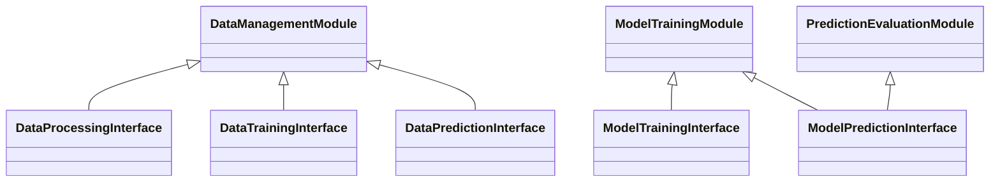
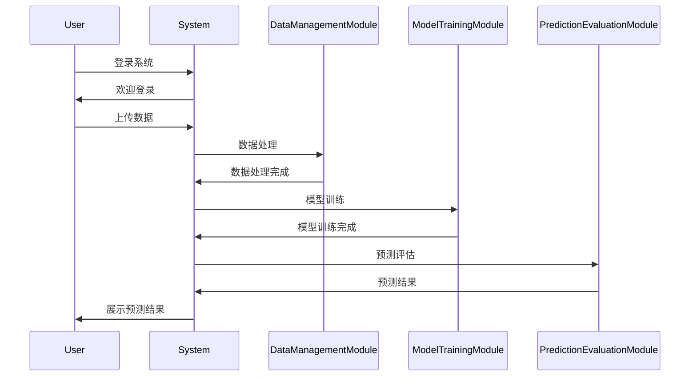

                 

### 文章标题

### 金融科技监管沙盒模拟系统

### 关键词

- 金融科技
- 监管沙盒
- 模拟系统
- 数据分析
- 机器学习
- 系统架构
- 风险管理

### 摘要

本文将深入探讨金融科技监管沙盒模拟系统的构建与应用。我们将首先概述金融科技及其监管沙盒的概念，接着定义模拟系统的核心概念，并详细讲解其算法原理和系统架构设计。随后，通过实际案例分析，我们将展示如何构建和部署一个监管沙盒模拟系统。最后，我们将提供最佳实践和注意事项，以指导未来的研究和应用。

---

### 目录

1. **背景与核心概念**  
   1.1 金融科技与监管沙盒概述  
   1.2 监管沙盒的概念与应用  
   1.3 模拟系统的目的与价值  
   1.4 本章小结

2. **核心算法与架构设计**  
   2.1 数据预处理算法  
   2.2 模型训练算法  
   2.3 预测与评估算法  
   2.4 模拟系统算法集成与优化  
   2.5 本章小结

3. **系统设计与实现**  
   3.1 系统架构设计  
   3.2 系统接口设计  
   3.3 系统交互流程  
   3.4 本章小结

4. **项目实战与案例分析**  
   4.1 环境准备  
   4.2 数据集准备  
   4.3 模型训练与调优  
   4.4 部署与运行  
   4.5 实际案例分析  
   4.6 本章小结

5. **最佳实践与拓展**  
   5.1 常见问题与解决方案  
   5.2 小结  
   5.3 注意事项  
   5.4 拓展阅读

---

### 第一部分：背景与核心概念

#### 1.1 金融科技与监管沙盒概述

金融科技（FinTech）是指通过技术创新来改善或创造新的金融服务。这些创新包括移动支付、区块链、大数据分析、人工智能、云计算等。金融科技不仅改变了金融服务的提供方式，还提高了效率、降低了成本，并为消费者提供了更多选择。

监管沙盒（Regulatory Sandbox）是一种创新环境，允许公司在受控的监管环境中测试金融科技产品和服务，而不必担心因违反现有法规而受到处罚。这种环境旨在促进金融科技的发展，同时确保消费者的利益得到保护。

#### 1.2 监管沙盒的概念与应用

监管沙盒的概念起源于英国，并在许多国家和地区得到推广。其核心思想是在监管者的监督下，允许企业在特定条件下测试新产品的可行性和合规性。以下是监管沙盒的一些关键特征：

- **灵活性**：监管沙盒为创新提供了灵活性，使企业可以在实际环境中测试其产品。
- **安全性**：监管沙盒确保在测试期间，消费者的权益不会受到损害。
- **透明度**：监管沙盒要求企业在测试期间公开其活动，增加透明度。
- **反馈机制**：监管沙盒鼓励企业从监管者和其他利益相关者那里获取反馈，以便改进产品。

#### 1.3 模拟系统的目的与价值

金融科技监管沙盒模拟系统的主要目的是提供一个虚拟环境，使企业可以在没有实际风险的情况下测试其金融科技产品和服务。具体来说，模拟系统具有以下价值：

- **降低风险**：模拟系统可以降低企业在实际市场环境中面临的风险，特别是在新产品的早期测试阶段。
- **提高效率**：通过模拟系统，企业可以快速迭代和优化其产品，从而提高开发效率。
- **合规性验证**：模拟系统可以帮助企业验证其产品是否符合监管要求，从而减少实际推出产品时的法律风险。
- **决策支持**：模拟系统可以为企业提供有关产品性能和市场潜力的见解，帮助做出更好的商业决策。

#### 1.4 本章小结

在本章中，我们介绍了金融科技、监管沙盒以及金融科技监管沙盒模拟系统的概念和重要性。下一章将深入探讨模拟系统的核心算法，包括数据预处理、模型训练和预测评估等内容。

---

### 第二部分：核心算法与架构设计

#### 2.1 数据预处理算法

数据预处理是金融科技监管沙盒模拟系统的关键步骤，它直接影响到后续模型训练和预测的准确性。以下是数据预处理的主要步骤：

1. **数据收集**：收集与金融科技产品和服务相关的数据，包括交易数据、用户行为数据、市场数据等。
2. **数据清洗**：清洗数据中的噪声和异常值，确保数据的质量。
3. **数据转换**：将数据转换为适合模型训练的格式，包括特征工程、归一化、标准化等。
4. **数据集成**：将来自不同来源的数据整合在一起，形成统一的数据集。

#### 2.2 模型训练算法

模型训练是模拟系统的核心，其主要目的是通过历史数据来训练模型，使其能够对新数据进行预测。以下是几种常用的模型训练算法：

1. **监督学习模型**：
   - **决策树**：通过树形结构对数据进行分类或回归。
   - **随机森林**：基于决策树的集成方法，提高模型的泛化能力。
   - **支持向量机（SVM）**：通过寻找最佳的超平面来分类数据。
   - **神经网络与深度学习**：模拟人脑神经网络，通过多层非线性变换进行复杂模式识别。

2. **无监督学习模型**：
   - **K-均值聚类**：将数据划分为K个簇，每个簇代表一个模式。
   - **主成分分析（PCA）**：通过降维技术来简化数据结构，同时保留主要特征。

#### 2.3 预测与评估算法

预测与评估是模型训练后的关键步骤，其主要目的是对模型的性能进行评估，并确定其在新数据上的预测能力。以下是几种常用的预测与评估算法：

1. **预测算法**：
   - **回归预测**：预测数值型目标变量的值。
   - **分类预测**：预测类别型目标变量的类别。
   - **时间序列预测**：预测时间序列数据的未来值。

2. **评估指标**：
   - **准确率**：预测正确的样本数占总样本数的比例。
   - **召回率**：预测正确的正样本数占总正样本数的比例。
   - **F1分数**：综合考虑准确率和召回率的指标。
   - **均方误差（MSE）**：回归模型预测误差的平方的平均值。

#### 2.4 模拟系统算法集成与优化

模拟系统的算法集成与优化是提高系统性能的重要环节。以下是几种常见的算法集成与优化方法：

1. **算法融合**：将多种算法的结果进行结合，以提高预测准确性。
2. **模型调优**：通过调整模型参数来优化模型性能。
3. **交叉验证**：通过将数据集划分为训练集和验证集，多次训练和验证模型，以提高模型泛化能力。

#### 2.5 本章小结

在本章中，我们详细介绍了金融科技监管沙盒模拟系统的核心算法，包括数据预处理、模型训练和预测评估等内容。这些算法构成了模拟系统的核心技术，为系统的高效运行提供了保障。下一章将深入探讨模拟系统的设计与实现，包括系统架构、接口设计和交互流程等内容。

---

### 第三部分：系统设计与实现

#### 3.1 系统架构设计

金融科技监管沙盒模拟系统的架构设计是其成功实现的关键。系统架构应具有灵活性、可扩展性和高可用性，以满足不同类型的数据处理和模型训练需求。以下是系统架构设计的主要组件：

1. **数据管理模块**：负责数据收集、清洗、转换和存储。
2. **模型训练模块**：包括各种机器学习算法的培训和管理。
3. **预测与评估模块**：负责模型预测和性能评估。

以下是系统架构的Mermaid流程图：



#### 3.2 系统接口设计

系统接口设计是确保各个模块之间能够有效通信和协作的关键。以下是系统接口设计的主要方面：

1. **内部接口设计**：包括数据处理接口、模型训练接口和预测评估接口。
2. **外部接口设计**：包括用户接口和系统集成接口。

以下是内部接口设计的Mermaid类图：



#### 3.3 系统交互流程

系统交互流程描述了用户与模拟系统之间的交互过程。以下是系统交互流程的Mermaid序列图：



#### 3.4 本章小结

在本章中，我们详细介绍了金融科技监管沙盒模拟系统的设计与实现，包括系统架构、接口设计和交互流程等内容。这些设计和实现细节为模拟系统的成功运行提供了坚实的基础。下一章将介绍如何构建和部署模拟系统，并分析实际案例。

---

### 第四部分：项目实战与案例分析

#### 4.1 环境准备

在构建金融科技监管沙盒模拟系统之前，必须准备好开发环境。以下是所需的环境配置步骤：

1. **软件环境**：
   - Python（3.8以上版本）
   - Jupyter Notebook（用于数据分析和模型训练）
   - TensorFlow（用于深度学习模型）
   - Scikit-learn（用于机器学习算法）

2. **硬件环境**：
   - 处理器：至少4核CPU
   - 内存：至少8GB
   - 存储：至少100GB

3. **安装与配置**：
   - 安装Python和相关的库（使用pip工具）
   - 配置Jupyter Notebook（运行`jupyter notebook`命令启动）

#### 4.2 数据集准备

数据集是模拟系统的基础，其质量和完整性直接影响模型的性能。以下是数据集准备的主要步骤：

1. **数据收集**：收集与金融科技产品和服务相关的数据，如交易数据、用户行为数据等。

2. **数据清洗**：处理数据中的噪声和异常值，确保数据质量。

3. **数据转换**：将数据转换为适合模型训练的格式，包括特征工程、归一化和标准化等。

4. **数据集成**：将来自不同来源的数据整合在一起，形成统一的数据集。

以下是数据预处理的一个Python代码示例：

```python
import pandas as pd
from sklearn.preprocessing import StandardScaler

# 读取数据
data = pd.read_csv('financial_data.csv')

# 清洗数据
data.dropna(inplace=True)

# 特征工程
data['new_feature'] = data['feature1'] / data['feature2']

# 数据转换
scaler = StandardScaler()
data_scaled = scaler.fit_transform(data)

# 数据集划分
X = data_scaled[:, :-1]
y = data_scaled[:, -1]
```

#### 4.3 模型训练与调优

模型训练是模拟系统的核心步骤，其目的是通过历史数据训练模型，使其能够对新数据进行预测。以下是模型训练与调优的主要步骤：

1. **模型选择**：选择适当的机器学习算法，如决策树、随机森林、神经网络等。

2. **模型训练**：使用训练数据训练模型。

3. **模型调优**：通过调整模型参数来优化模型性能。

4. **模型评估**：使用验证集评估模型性能，调整参数以获得最佳性能。

以下是使用TensorFlow和Keras训练神经网络的一个Python代码示例：

```python
from tensorflow.keras.models import Sequential
from tensorflow.keras.layers import Dense
from tensorflow.keras.optimizers import Adam

# 构建模型
model = Sequential()
model.add(Dense(64, input_dim=X.shape[1], activation='relu'))
model.add(Dense(32, activation='relu'))
model.add(Dense(1, activation='sigmoid'))

# 编译模型
model.compile(optimizer=Adam(learning_rate=0.001), loss='binary_crossentropy', metrics=['accuracy'])

# 训练模型
model.fit(X, y, epochs=10, batch_size=32, validation_split=0.2)
```

#### 4.4 部署与运行

模型训练完成后，需要将其部署到生产环境中，以便进行实际预测。以下是部署与运行的主要步骤：

1. **模型保存**：将训练好的模型保存为文件，以便后续使用。

2. **模型加载**：在运行预测时加载模型。

3. **预测**：使用模型对新数据进行预测。

4. **监控**：监控系统运行状态，确保其稳定性和可靠性。

以下是使用Scikit-learn进行模型预测的一个Python代码示例：

```python
from sklearn.externals import joblib

# 加载模型
model = joblib.load('model.pkl')

# 预测
predictions = model.predict(new_data)
```

#### 4.5 实际案例分析

为了更好地理解模拟系统的应用，我们将分析一个实际案例。假设我们想要预测某金融科技公司的交易欺诈率。

1. **数据收集**：收集该公司的历史交易数据，包括交易金额、交易时间、交易方式等。

2. **数据预处理**：清洗数据，进行特征工程，将数据转换为适合模型训练的格式。

3. **模型训练**：使用历史数据训练欺诈检测模型。

4. **模型评估**：使用验证集评估模型性能，调整参数以获得最佳性能。

5. **预测**：使用训练好的模型预测新交易的欺诈率。

6. **结果分析**：分析预测结果，确定欺诈交易的风险。

#### 4.6 本章小结

在本章中，我们通过实际案例详细介绍了金融科技监管沙盒模拟系统的构建与部署过程。从环境准备、数据集准备、模型训练与调优到部署与运行，每一步都至关重要。通过实际案例的分析，我们展示了模拟系统的强大功能和实际应用价值。下一章将提供最佳实践和注意事项，以指导未来的研究和应用。

---

### 第五部分：最佳实践与拓展

#### 5.1 常见问题与解决方案

在构建和部署金融科技监管沙盒模拟系统的过程中，可能会遇到一些常见问题。以下是一些问题和相应的解决方案：

1. **数据质量问题**：
   - **问题**：数据中存在噪声、异常值或不完整的数据。
   - **解决方案**：使用数据清洗技术（如去重、填补缺失值、删除异常值）来提高数据质量。

2. **模型性能问题**：
   - **问题**：模型预测不准确或性能不佳。
   - **解决方案**：调整模型参数、尝试不同的算法或增加训练数据。

3. **系统性能问题**：
   - **问题**：系统响应时间过长或无法处理大量数据。
   - **解决方案**：优化代码、使用分布式计算或升级硬件。

4. **合规性问题**：
   - **问题**：系统不符合相关法规要求。
   - **解决方案**：与监管机构沟通，确保系统符合法规要求。

#### 5.2 小结

本文介绍了金融科技监管沙盒模拟系统的构建与应用。我们详细分析了系统的核心算法、设计与实现过程，并通过实际案例展示了系统的应用价值。模拟系统为金融科技的创新提供了安全的环境，有助于降低风险、提高效率和确保合规性。

#### 5.3 注意事项

在构建和部署模拟系统时，需要注意以下几点：

1. 确保数据质量，进行充分的清洗和预处理。
2. 选择合适的模型和算法，并进行适当的参数调整。
3. 确保系统性能，以满足实际应用的需求。
4. 遵循相关法规要求，确保系统的合规性。

#### 5.4 拓展阅读

对于对金融科技监管沙盒模拟系统感兴趣的研究人员和从业者，以下书籍和资源提供了深入的学习和参考资料：

1. **《机器学习实战》（Peter Harrington）**：提供了详细的机器学习算法和应用案例。
2. **《Python金融技术》（Yves Hilpisch）**：介绍了使用Python进行金融数据分析的技术和方法。
3. **《金融科技监管沙盒实践指南》（国际金融科技监管沙盒联盟）**：提供了全球监管沙盒的实践经验和最佳实践。

---

作者：AI天才研究院/AI Genius Institute & 禅与计算机程序设计艺术 /Zen And The Art of Computer Programming

---

通过本文的详细讲解，我们希望读者能够对金融科技监管沙盒模拟系统有更深入的理解，并在实际应用中发挥其价值。未来的研究和实践将继续推动这一领域的创新和发展。

