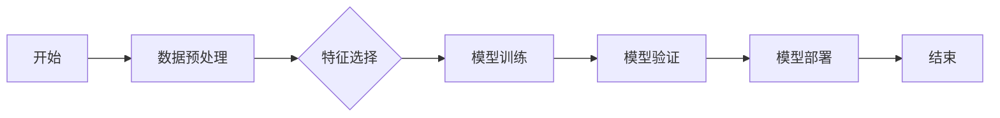
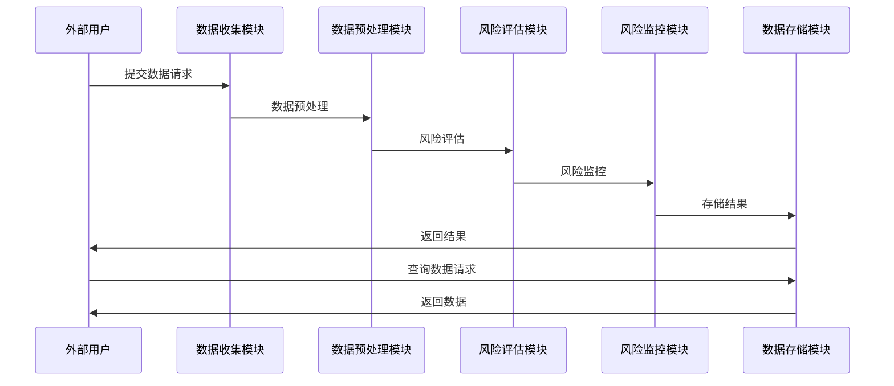

                 

### 第1章: 引言

#### 1.1 问题背景

金融衍生品是一种基于现货资产的价格或价值变动的金融合约，例如期权、期货、互换等。这些产品具有较高的杠杆效应，能够帮助投资者实现资产配置和风险管理。然而，衍生品交易也伴随着较高的风险，尤其是交易对手风险（Counterparty Risk）。交易对手风险指的是由于交易对手的信用违约、违约风险或流动性问题而导致的风险。这一风险在2008年全球金融危机中表现得尤为明显，大量金融机构因衍生品交易对手违约而遭受巨额损失。

交易对手风险的评估对于金融机构的风险管理至关重要。通过科学的评估模型，金融机构可以识别潜在的对手方风险，制定合理的对冲策略，降低潜在的损失。因此，研究并开发有效的衍生品交易对手风险评估模型成为金融领域的一个重要课题。

#### 1.2 问题描述与解决目标

衍生品交易对手风险评估面临的主要挑战包括：

1. **数据缺失与不完全性**：交易对手的数据可能不完整，影响风险评估的准确性。
2. **信息不对称**：交易对手掌握的信息可能不完全公开，导致评估模型的信息基础不充分。
3. **复杂性和多样性**：衍生品种类繁多，交易结构和市场环境复杂多变，使得风险评估模型的开发和应用具有挑战性。

解决这些挑战的目标是：

1. **建立科学的评估模型**：通过分析历史数据和现有文献，构建一套适用于多种衍生品交易的风险评估模型。
2. **提高评估的准确性**：模型需要能够准确预测交易对手的违约风险，为金融机构提供可靠的风险管理依据。
3. **增强模型的适用性**：模型应具备较强的鲁棒性，能够适应不同市场环境和衍生品交易特征。

#### 1.3 边界与外延

**评估模型的适用范围**：本评估模型适用于金融机构间的衍生品交易对手风险评估。主要涵盖以下几种衍生品：

1. **期权**：包括欧式期权、美式期权、亚式期权等。
2. **期货**：包括商品期货、金融期货等。
3. **互换**：包括利率互换、外汇互换等。

**评估模型的限制**：本模型在以下方面存在一定的限制：

1. **数据依赖性**：模型的准确性依赖于数据的完整性、真实性和时效性。
2. **模型复杂性**：由于衍生品的多样性和复杂性，模型可能无法涵盖所有可能的交易对手风险。
3. **市场波动性**：模型的有效性可能受到市场波动和宏观经济环境的影响。

**相关概念的联系与区别**：衍生品交易对手风险评估涉及多个核心概念，包括：

1. **信用风险**：交易对手的违约风险，是衍生品交易对手风险评估的核心。
2. **市场风险**：由于市场价格波动导致的损失风险。
3. **操作风险**：由于操作失误或内部管理问题导致的损失风险。

这些概念相互联系，但又有各自的独立性和特殊性。本模型主要关注信用风险，同时考虑市场风险和操作风险对评估结果的影响。

### 第2章: 核心概念与联系

#### 2.1 金融衍生品

**定义与分类**：

金融衍生品是一种基于标的资产价格变动的金融合约，其主要类型包括：

1. **期权**：赋予持有者在特定时间以固定价格买入或卖出标的资产的权利，包括欧式期权、美式期权等。
2. **期货**：在未来特定日期以约定价格买入或卖出标的资产的合约。
3. **互换**：双方同意在未来特定时间交换现金流，如利率互换、外汇互换等。

**市场发展与现状**：

自20世纪70年代以来，金融衍生品市场经历了快速的发展。随着全球化进程的加快和金融市场创新的不断推进，衍生品市场规模不断扩大，成为金融市场的重要组成部分。根据国际互换和衍生品协会（ISDA）的数据，全球衍生品市场交易量持续增长，2019年达到约614万亿美元。

**影响衍生品定价的因素**：

衍生品定价是评估交易对手风险的重要基础。影响衍生品定价的主要因素包括：

1. **标的资产价格**：衍生品价格与标的资产价格密切相关。
2. **波动率**：标的资产价格的波动性越大，衍生品的价格越高。
3. **利率**：对于固定收益类衍生品，利率变动直接影响衍生品的价值。
4. **到期时间**：衍生品的有效期越长，其价值波动性越大。
5. **执行价格**：对于期权，执行价格的高低直接影响期权价格。

#### 2.2 交易对手风险评估框架

**风险评估的基本概念**：

交易对手风险评估是指评估交易对手在衍生品交易中违约的概率以及违约对自身财务状况的影响。其核心概念包括：

1. **信用评分**：对交易对手的信用水平进行评估。
2. **违约概率**：预测交易对手在未来某一时期违约的概率。
3. **风险敞口**：评估交易对手违约对自身的风险敞口。

**风险评估的关键要素**：

交易对手风险评估的关键要素包括：

1. **数据收集**：收集交易对手的财务数据、交易记录等信息。
2. **风险模型**：构建用于评估交易对手风险的数学模型。
3. **评估指标**：设计评估交易对手风险的指标，如违约概率、风险价值（Value at Risk, VaR）等。
4. **结果解读**：对评估结果进行分析和解读，制定风险管理策略。

**风险评估方法的选择**：

根据评估目标和数据情况，可以选择不同的风险评估方法。主要方法包括：

1. **统计分析方法**：如回归分析、逻辑回归等。
2. **机器学习方法**：如决策树、随机森林、支持向量机等。
3. **基于蒙特卡罗模拟的方法**：通过模拟大量场景，估计交易对手的违约概率和风险敞口。

#### 2.3 风险评估模型的核心概念

**风险评估模型的类型**：

交易对手风险评估模型主要分为以下几类：

1. **基于历史数据的模型**：利用历史交易数据评估交易对手的风险，如违约概率模型。
2. **基于市场价格变动的模型**：根据市场价格波动评估交易对手的风险，如风险价值模型。
3. **混合模型**：结合历史数据和市场价格变动进行风险评估。

**模型构建的基本步骤**：

构建交易对手风险评估模型的基本步骤包括：

1. **数据收集**：收集交易对手的历史交易数据、财务数据等。
2. **数据预处理**：对收集到的数据进行分析和清洗，去除异常值和缺失值。
3. **特征工程**：选择和构建用于风险评估的特征，如财务指标、交易指标等。
4. **模型选择**：根据评估目标和数据特征，选择合适的模型。
5. **模型训练与验证**：使用历史数据训练模型，并对模型进行验证和调优。

**模型评估与验证**：

评估交易对手风险评估模型的有效性是模型构建的重要环节。主要评估指标包括：

1. **准确率**：模型预测的违约事件与实际违约事件的匹配程度。
2. **召回率**：模型正确识别的违约事件占实际违约事件的比例。
3. **F1分数**：准确率和召回率的加权平均值。
4. **模型稳健性**：模型在不同数据集和不同市场环境下的表现。

### 第3章: 数学模型与算法原理

#### 3.1 数学模型概述

**风险评估的数学基础**：

交易对手风险评估涉及到概率论、统计学和数值分析等多个数学领域。基本的数学模型包括：

1. **概率分布模型**：如正态分布、对数正态分布等，用于描述交易对手违约的概率分布。
2. **回归模型**：如线性回归、逻辑回归等，用于建立交易对手违约概率与风险因素之间的关系。
3. **时间序列模型**：如ARIMA模型、GARCH模型等，用于分析交易对手风险的时间序列特征。

**数学模型的一般形式**：

交易对手风险评估的数学模型通常可以表示为以下形式：

\[ R(x) = f(x_1, x_2, ..., x_n) \]

其中，\( R(x) \) 表示交易对手的违约风险评分，\( x_1, x_2, ..., x_n \) 是影响交易对手风险的因素，\( f() \) 是一个复杂的非线性函数，用于将输入特征映射到违约风险评分。

**数学公式的推导与解释**：

推导风险评估模型的数学公式通常涉及以下步骤：

1. **确定输入特征**：根据交易对手的风险特征，选择合适的输入特征。
2. **构建损失函数**：定义一个损失函数，用于衡量预测值与真实值之间的差异。
3. **优化模型参数**：通过最小化损失函数，优化模型的参数。

以下是一个简单的线性回归模型示例：

\[ y = \beta_0 + \beta_1 x_1 + \beta_2 x_2 + ... + \beta_n x_n \]

其中，\( y \) 是交易对手的违约概率，\( x_1, x_2, ..., x_n \) 是输入特征，\( \beta_0, \beta_1, ..., \beta_n \) 是模型的参数。

#### 3.2 算法原理讲解

**算法的基本框架**：

交易对手风险评估算法的基本框架通常包括以下步骤：

1. **数据预处理**：对原始数据进行清洗和预处理，包括缺失值处理、异常值检测等。
2. **特征选择**：选择对风险评估有显著影响的特征。
3. **模型训练**：使用历史数据对风险评估模型进行训练。
4. **模型验证**：使用验证集对模型进行评估和调优。
5. **模型部署**：将训练好的模型应用于实际风险评估。

**算法的关键步骤**：

1. **数据预处理**：包括数据清洗、归一化、特征提取等步骤。
2. **特征选择**：通过特征重要性评估，选择对风险评估有重要影响的特征。
3. **模型训练**：采用机器学习算法，如逻辑回归、决策树、随机森林等，对模型进行训练。
4. **模型验证**：通过交叉验证、ROC曲线、AUC值等指标，评估模型的性能和可靠性。

**算法的性能分析**：

算法的性能分析通常包括以下方面：

1. **准确性**：模型预测的违约事件与实际违约事件的匹配程度。
2. **召回率**：模型正确识别的违约事件占实际违约事件的比例。
3. **F1分数**：准确率和召回率的加权平均值。
4. **鲁棒性**：模型在不同数据集和不同市场环境下的表现。

以下是一个简单的Python代码示例，用于实现交易对手风险评估算法：

```python
import numpy as np
from sklearn.linear_model import LogisticRegression
from sklearn.model_selection import train_test_split
from sklearn.metrics import accuracy_score, recall_score, f1_score

# 假设已有数据集X和标签y
X = np.array([[...], [...], ..., [...]])
y = np.array([...])

# 数据预处理
X_train, X_test, y_train, y_test = train_test_split(X, y, test_size=0.2, random_state=42)

# 模型训练
model = LogisticRegression()
model.fit(X_train, y_train)

# 模型验证
y_pred = model.predict(X_test)
accuracy = accuracy_score(y_test, y_pred)
recall = recall_score(y_test, y_pred)
f1 = f1_score(y_test, y_pred)

print("Accuracy:", accuracy)
print("Recall:", recall)
print("F1 Score:", f1)
```

#### 3.3 Mermaid流程图

**Mermaid流程图示例**：

以下是一个Mermaid流程图，用于展示交易对手风险评估的基本流程：



该流程图清晰地展示了数据预处理、特征选择、模型训练、模型验证和模型部署等关键步骤。

### 第4章: 系统分析与架构设计

#### 4.1 问题场景介绍

**金融衍生品交易场景**：

金融衍生品交易涉及金融机构之间的合约交易，交易双方通过衍生品合约对冲风险或获取收益。交易过程包括合约签订、交易执行、风险监控和结算等环节。随着衍生品交易的复杂性和市场规模的增长，交易对手风险评估成为金融机构风险管理的重要组成部分。

**风险评估系统的需求**：

风险评估系统需满足以下需求：

1. **实时数据处理**：能够处理大量的衍生品交易数据，实时更新交易对手的风险评估结果。
2. **精确评估**：评估模型需具有较高的准确性和可靠性，能够准确预测交易对手的违约风险。
3. **可扩展性**：系统应具备良好的可扩展性，能够适应衍生品市场和交易对手的多样化需求。
4. **安全性**：系统应确保交易数据的保密性和完整性，防止数据泄露和未授权访问。

**系统目标与功能**：

系统目标：

1. 提供实时、准确的交易对手风险评估。
2. 支持多种衍生品交易场景，涵盖期权、期货、互换等。
3. 提高金融机构的风险管理水平，降低交易对手风险。

系统功能：

1. **数据收集与预处理**：收集交易对手的历史交易数据、财务数据等，进行数据清洗和预处理。
2. **风险评估**：基于构建的风险评估模型，对交易对手进行实时风险评估。
3. **风险监控**：实时监控交易对手的风险状况，提供风险预警和风险分析报告。
4. **系统管理**：提供用户权限管理、日志记录等功能，确保系统安全运行。

#### 4.2 系统架构设计

**总体架构设计**：

系统架构设计采用三层架构，包括数据层、服务层和表示层。

1. **数据层**：负责数据存储和管理，包括数据库、数据仓库等。
2. **服务层**：负责业务逻辑的实现，包括数据预处理、风险评估、风险监控等模块。
3. **表示层**：负责用户界面展示，包括Web界面、报表系统等。

**数据流与处理流程**：

数据流与处理流程如下：

1. **数据收集**：通过API或接口从外部系统收集交易对手数据。
2. **数据预处理**：对收集到的数据进行分析、清洗和转换，生成可用于风险评估的中间数据。
3. **风险评估**：基于风险评估模型，对预处理后的数据进行分析，生成交易对手风险评估报告。
4. **风险监控**：实时监控交易对手的风险状况，生成风险预警报告。
5. **数据存储**：将处理后的数据存储到数据库，以备后续分析和查询。

**系统模块划分**：

系统模块划分为以下几部分：

1. **数据收集模块**：负责数据收集和初步处理。
2. **数据预处理模块**：负责数据清洗、归一化和特征提取等。
3. **风险评估模块**：负责构建和训练风险评估模型，进行风险评估。
4. **风险监控模块**：负责实时监控交易对手风险，生成预警报告。
5. **系统管理模块**：负责用户权限管理、日志记录等功能。

#### 4.3 系统接口设计

**系统接口的定义**：

系统接口分为内部接口和外部接口。

1. **内部接口**：系统内部模块之间的交互接口，包括数据传输接口、业务逻辑接口等。
2. **外部接口**：系统与其他系统或用户的交互接口，包括API接口、Web接口等。

**接口功能与实现**：

1. **数据传输接口**：用于数据在不同模块之间的传输，采用HTTP/HTTPS协议。
2. **业务逻辑接口**：用于实现业务逻辑的处理，如风险评估、风险监控等。
3. **API接口**：用于外部系统访问，提供RESTful API接口，支持数据查询、数据更新等功能。
4. **Web接口**：用于用户操作和交互，提供友好的Web界面。

**接口安全性保障**：

1. **身份认证**：采用OAuth2.0等认证协议，确保接口访问的安全性。
2. **数据加密**：采用HTTPS协议，确保数据传输的安全性。
3. **权限控制**：对接口访问权限进行严格控制，确保仅授权用户可以访问。

#### 4.4 系统交互序列图

**系统交互序列图示例**：

以下是一个Mermaid序列图，用于展示系统各模块之间的交互过程：



### 第5章: 项目实战

#### 5.1 环境安装与配置

**软件与硬件要求**：

- **操作系统**：Linux或Unix系统（如Ubuntu 18.04、CentOS 7）
- **数据库**：MySQL 5.7或更高版本
- **Python**：Python 3.7或更高版本
- **硬件**：64位处理器，8GB内存，至少100GB硬盘空间

**数据库安装与配置**：

1. **安装MySQL数据库**：

   ```bash
   sudo apt update
   sudo apt install mysql-server
   ```

2. **配置MySQL数据库**：

   ```bash
   sudo mysql_secure_installation
   ```

   按照提示进行配置，设置root用户密码、删除匿名用户等。

**环境变量设置与测试**：

1. **设置Python环境变量**：

   ```bash
   export PYTHONPATH=/path/to/python
   export PATH=$PATH:$PYTHONPATH
   ```

2. **测试Python环境**：

   ```bash
   python --version
   ```

   应显示Python的版本信息。

#### 5.2 系统核心实现

**数据收集与处理**：

1. **数据源**：从外部系统获取交易对手数据，包括交易记录、财务报表等。
2. **数据清洗**：处理缺失值、异常值等，确保数据质量。
3. **数据预处理**：将数据转换为适合风险评估的格式，包括归一化、特征提取等。

**模型训练与评估**：

1. **模型选择**：选择合适的风险评估模型，如逻辑回归、随机森林等。
2. **模型训练**：使用历史数据进行模型训练。
3. **模型评估**：使用验证集对模型进行评估，调整模型参数，提高评估准确性。

**系统部署与运行**：

1. **部署**：将训练好的模型部署到生产环境中。
2. **运行**：系统启动并运行，实时处理交易对手数据，进行风险评估。

#### 5.3 代码应用解读与分析

**核心代码解析**：

以下是一个核心代码示例，用于实现交易对手风险评估模型：

```python
import pandas as pd
from sklearn.linear_model import LogisticRegression
from sklearn.model_selection import train_test_split
from sklearn.metrics import accuracy_score, recall_score, f1_score

# 加载数据
data = pd.read_csv('data.csv')

# 数据预处理
X = data.drop('target', axis=1)
y = data['target']

# 分割数据集
X_train, X_test, y_train, y_test = train_test_split(X, y, test_size=0.2, random_state=42)

# 模型训练
model = LogisticRegression()
model.fit(X_train, y_train)

# 模型评估
y_pred = model.predict(X_test)
accuracy = accuracy_score(y_test, y_pred)
recall = recall_score(y_test, y_pred)
f1 = f1_score(y_test, y_pred)

print("Accuracy:", accuracy)
print("Recall:", recall)
print("F1 Score:", f1)
```

**代码性能优化**：

1. **数据预处理**：优化数据清洗和转换过程，减少计算量。
2. **模型选择**：选择更高效的模型，如XGBoost、LightGBM等。
3. **并行计算**：利用多线程或分布式计算，提高数据处理和模型训练的速度。

**代码可维护性与扩展性**：

1. **模块化**：将代码划分为不同的模块，提高代码的可维护性。
2. **文档化**：编写详细的文档，包括代码注释和用户手册。
3. **版本控制**：使用版本控制系统，如Git，管理代码版本。

#### 5.4 实际案例分析与讲解

**案例背景**：

某金融机构在进行衍生品交易时，需要实时评估交易对手的信用风险，以降低交易对手违约带来的损失。

**案例分析**：

1. **数据收集**：收集交易对手的历史交易数据、财务报表等。
2. **数据预处理**：对收集到的数据进行清洗、归一化和特征提取。
3. **模型训练**：使用历史数据训练风险评估模型，如逻辑回归、随机森林等。
4. **模型评估**：使用验证集对模型进行评估，调整模型参数，提高评估准确性。
5. **风险监控**：实时监控交易对手的风险状况，生成风险预警报告。

**详细讲解**：

1. **数据收集**：金融机构通过API接口从外部系统获取交易对手数据，包括交易记录、财务报表等。
2. **数据预处理**：对交易对手数据进行清洗和转换，包括缺失值处理、异常值检测、归一化等。
3. **模型训练**：选择合适的模型，如逻辑回归、随机森林等，对训练数据进行训练。
4. **模型评估**：使用验证集对模型进行评估，计算模型的准确率、召回率和F1分数，调整模型参数，提高评估准确性。
5. **风险监控**：实时监控交易对手的风险状况，生成风险预警报告，帮助金融机构制定风险管理策略。

**项目小结**：

通过构建和部署衍生品交易对手风险评估系统，金融机构可以实时评估交易对手的信用风险，提高风险管理水平，降低交易对手违约带来的损失。在实际应用中，系统需要不断优化和调整，以适应市场变化和交易对手的多样化需求。

### 5.5 最佳实践 Tips、小结、注意事项、拓展阅读

#### 5.5.1 最佳实践 Tips

1. **数据质量是关键**：确保数据质量，进行严格的数据清洗和预处理，避免因数据问题导致的评估结果不准确。
2. **选择合适的模型**：根据业务需求和数据特征，选择适合的风险评估模型，如逻辑回归、随机森林等。
3. **实时监控与调整**：实时监控交易对手的风险状况，根据市场变化和交易对手表现，调整风险评估模型和策略。
4. **合规与安全**：确保系统符合相关法规和合规要求，保障数据安全和用户隐私。

#### 5.5.2 小结

本文详细介绍了衍生品交易对手风险评估模型的设计、实现和应用。通过构建科学的风险评估模型，金融机构可以实时评估交易对手的信用风险，提高风险管理水平，降低交易对手违约带来的损失。

#### 5.5.3 注意事项

1. **数据依赖性**：风险评估模型的准确性依赖于数据的完整性和真实性，确保数据的可靠性和时效性。
2. **模型复杂性**：衍生品交易的复杂性和多样性可能导致模型无法涵盖所有风险，需不断优化和调整模型。
3. **市场波动性**：市场波动性可能影响模型的有效性，需定期评估和调整模型，以适应市场变化。

#### 5.5.4 拓展阅读

1. **《衍生品交易风险管理体系研究》**：深入探讨衍生品交易风险管理的理论和实践。
2. **《交易对手风险评估模型比较研究》**：对比不同交易对手风险评估模型的优缺点，为模型选择提供参考。
3. **《金融科技在衍生品交易中的应用》**：介绍金融科技在衍生品交易和风险管理中的应用，如大数据、人工智能等。

