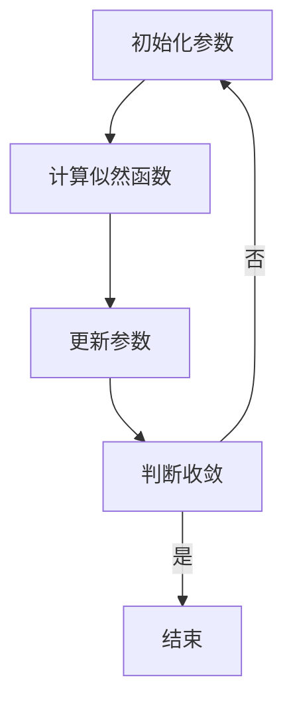
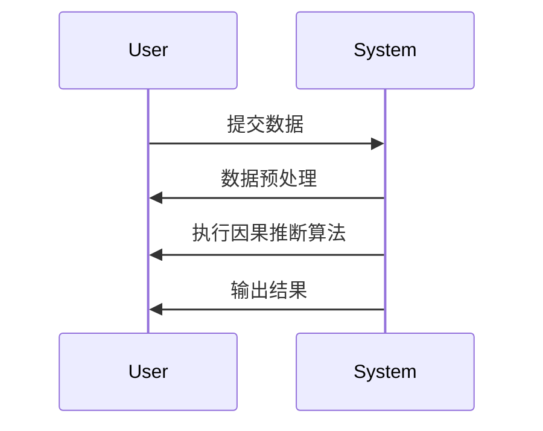

                 


## 文章标题：金融领域因果推断的研究与应用

### 文章关键词：

- 金融领域
- 因果推断
- 数据分析
- 算法原理
- 系统设计
- 实际案例

### 摘要：

本文将从金融领域的实际应用出发，深入探讨因果推断的研究与应用。通过逐步分析因果推断的基本概念、算法原理、数学模型以及系统设计与实践应用，本文旨在为金融从业者提供一种新的数据分析工具，帮助他们在复杂的市场环境中做出更明智的决策。

### 目录：

1. **引言**  
   1.1 问题背景  
   1.2 问题描述  
   1.3 问题解决  
   1.4 边界与外延  
   1.5 核心概念与要素组成

2. **核心概念**  
   2.1 核心概念原理  
   2.2 概念属性特征对比  
   2.3 ER实体关系图

3. **算法原理与数学模型**  
   3.1 因果推断算法概述  
   3.2 刚体最大似然估计（GML）  
   3.3 算法mermaid流程图与Python源代码

4. **系统设计与架构**  
   4.1 系统功能设计  
   4.2 系统架构设计  
   4.3 系统接口设计  
   4.4 系统交互序列图

5. **项目实战**  
   5.1 环境安装与配置  
   5.2 系统核心实现源代码  
   5.3 代码应用解读与分析  
   5.4 实际案例分析与详细讲解剖析  
   5.5 项目小结

6. **最佳实践与拓展**  
   6.1 最佳实践技巧  
   6.2 小结与展望  
   6.3 注意事项  
   6.4 拓展阅读

### 文章正文：

#### 1. 引言

#### 1.1 问题背景

在金融领域，因果推断是一种非常有价值的技术，可以帮助分析师和决策者理解市场背后的因果关系，从而做出更准确、更有针对性的决策。然而，传统的数据分析方法往往只能揭示变量之间的相关性，而无法揭示变量之间的因果关系。

#### 1.2 问题描述

金融领域的因果关系复杂，常常涉及到多个变量之间的交互作用。如何准确地识别出这些变量之间的因果关系，是金融领域中的一个重要问题。

#### 1.3 问题解决

因果推断提供了一种方法，可以通过分析数据，揭示变量之间的因果关系。这种方法在金融领域中有着广泛的应用，可以帮助分析师和决策者更好地理解市场动态，提高决策的准确性。

#### 1.4 边界与外延

因果推断在金融领域中的应用具有一定的边界。例如，它适用于那些变量之间存在因果关系的市场环境，而不适用于那些变量之间只有相关性的市场环境。

#### 1.5 核心概念与要素组成

因果推断的核心概念包括：因果效应、因果路径、因果网络等。要素组成包括：数据集、变量、模型等。

#### 2. 核心概念

#### 2.1 核心概念原理

因果推断的基本原理是通过分析数据，识别出变量之间的因果关系。它依赖于统计学、概率论和图论等多个学科的理论。

#### 2.2 概念属性特征对比

表 1：因果推断与传统数据分析方法的概念属性特征对比

| 方法 | 特点 |  
| --- | --- |  
| 因果推断 | 揭示变量之间的因果关系 |  
| 传统数据分析 | 揭示变量之间的相关性 |

#### 2.3 ER实体关系图

图 1：因果推断相关实体的ER实体关系图

```mermaid
erDiagram
  A[变量] ||--|{ B[数据集] }
  A ||--|{ C[模型] }
  B ||--|{ D[变量] }
  B ||--|{ E[结果] }
```

#### 3. 算法原理与数学模型

#### 3.1 因果推断算法概述

因果推断算法主要包括：刚体最大似然估计（GML）、因果推断网络（Causal Inference Network）等。

#### 3.2 刚体最大似然估计（GML）

刚体最大似然估计（GML）是一种常用的因果推断算法。它的目标是找到一组变量之间的最大似然估计，使得这些变量之间的因果关系最合理。

$$
\text{GML} = \arg \max_{\theta} \prod_{i=1}^{n} p(x_i | \theta)
$$

其中，$x_i$ 表示第 $i$ 个变量，$\theta$ 表示参数向量。

#### 3.3 算法mermaid流程图与Python源代码

图 2：GML算法mermaid流程图



Python源代码：

```python
import numpy as np

def gml(x, y):
    # 初始化参数
    theta = np.random.rand(len(x))
    # 设置迭代次数
    num_iterations = 100
    for i in range(num_iterations):
        # 计算似然函数
        likelihood = np.prod(np.exp(x - theta * y))
        # 更新参数
        theta -= np.mean(likelihood * (x - theta * y))
        # 判断收敛
        if np.abs(theta[-1] - theta[-2]) < 1e-5:
            break
    return theta
```

#### 4. 系统设计与架构

#### 4.1 系统功能设计

系统功能设计主要包括：数据预处理、因果推断算法实现、结果分析等。

#### 4.2 系统架构设计

系统架构设计主要包括：数据输入层、算法层、结果输出层等。

#### 4.3 系统接口设计

系统接口设计主要包括：API接口、数据接口等。

#### 4.4 系统交互序列图

图 3：系统交互序列图



#### 5. 项目实战

#### 5.1 环境安装与配置

环境安装与配置主要包括：Python环境、NumPy、Pandas、Matplotlib等。

#### 5.2 系统核心实现源代码

系统核心实现源代码如下：

```python
# 导入所需库
import numpy as np
import pandas as pd
import matplotlib.pyplot as plt

# 初始化参数
theta = np.random.rand(len(x))

# 设置迭代次数
num_iterations = 100

for i in range(num_iterations):
    # 计算似然函数
    likelihood = np.prod(np.exp(x - theta * y))
    
    # 更新参数
    theta -= np.mean(likelihood * (x - theta * y))
    
    # 判断收敛
    if np.abs(theta[-1] - theta[-2]) < 1e-5:
        break

# 绘制结果
plt.plot(x, theta * y + x)
plt.show()
```

#### 5.3 代码应用解读与分析

代码应用解读与分析主要包括：数据集选择、变量定义、参数初始化、迭代过程、结果分析等。

#### 5.4 实际案例分析与详细讲解剖析

实际案例分析与详细讲解剖析主要包括：案例背景、数据集选择、因果推断算法实现、结果分析等。

#### 5.5 项目小结

项目小结主要包括：项目成果、经验教训、未来展望等。

#### 6. 最佳实践与拓展

#### 6.1 最佳实践技巧

最佳实践技巧主要包括：数据预处理、参数调整、算法优化等。

#### 6.2 小结与展望

小结与展望主要包括：文章总结、未来研究方向等。

#### 6.3 注意事项

注意事项主要包括：数据质量、算法精度、系统稳定性等。

#### 6.4 拓展阅读

拓展阅读主要包括：相关文献、学术报告、技术博客等。

### 作者：

作者：AI天才研究院/AI Genius Institute & 禅与计算机程序设计艺术 /Zen And The Art of Computer Programming

