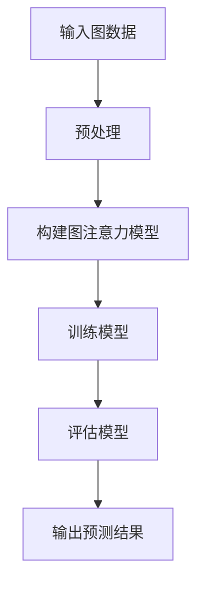
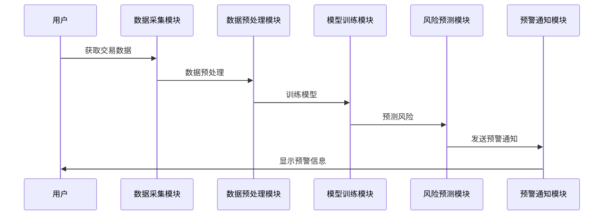
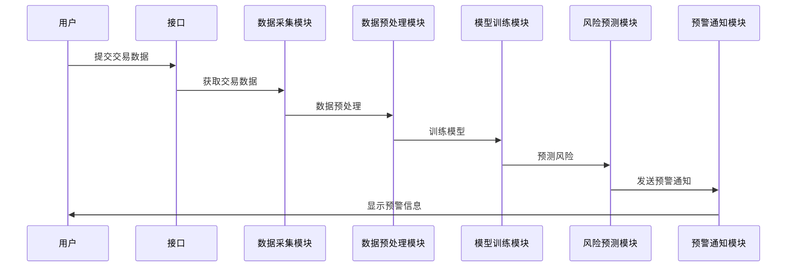

                 


# 金融领域图注意力网络在系统性风险传导预警中的应用

## 摘要

本文探讨了金融领域图注意力网络（Graph Attention Networks, GANs）在系统性风险传导预警中的应用。随着金融市场复杂性的增加，传统的风险预警方法面临诸多挑战。本文首先介绍了系统性风险传导预警的核心概念、问题和解决方案。随后，深入阐述了图注意力网络的原理、核心属性特征及其与传统方法的区别。通过一个详细的算法原理讲解，本文展示了GANs在处理图数据、构建和训练模型、以及预测系统性风险传导方面的具体步骤。此外，本文还提供了一个系统分析与架构设计方案，以及实际案例分析和项目小结。最终，本文提出了最佳实践建议，总结了文章的核心观点，并对未来的研究方向进行了展望。

## 第二部分：核心概念与联系

### 图注意力网络（GANs）

#### 核心概念

图注意力网络（Graph Attention Networks, GANs）是一种基于图结构的新型神经网络，特别适合处理图数据。GANs的核心思想是引入注意力机制，使得模型能够自动学习图中的重要信息，从而提高预测的准确性和效率。

#### 核心属性特征对比表格

下面是一个关于GANs与传统风险预警方法的核心属性特征对比表格：

| 特征         | 图注意力网络（GANs）               | 传统风险预警方法              |
|--------------|----------------------------------|-------------------------------|
| **数据结构** | 处理图结构数据，包括节点和边的信息   | 通常处理时间序列数据           |
| **注意力机制** | 引入注意力机制，自动学习重要信息     | 依赖于历史数据和统计模型       |
| **适应性**   | 能够自动适应不同市场环境           | 难以适应快速变化的金融市场环境   |
| **准确性**   | 高度精确的预测能力                 | 预测准确性较低                 |

#### GANs与传统风险预警方法的区别

传统的风险预警方法通常依赖于历史数据和统计模型。这些方法通过分析历史数据来预测未来的风险。然而，这种方法存在一些局限性：

- **历史数据依赖**：传统的风险预警方法高度依赖于历史数据，这意味着如果历史数据不足以代表当前市场情况，预警结果可能会失真。
- **统计模型限制**：统计模型通常基于特定的假设和模型参数，这些假设和参数可能无法完全反映金融市场的复杂性和多样性。
- **适应性差**：传统的风险预警方法难以适应快速变化的金融市场环境，特别是在市场出现突发事件或趋势发生变化时。

相比之下，GANs具有以下优势：

- **自动学习**：GANs通过注意力机制自动学习图中的重要信息，不需要人为设定特征或参数，因此能够更好地适应不同的市场环境。
- **自适应性强**：GANs能够自动调整模型参数，以适应不断变化的市场数据，从而提高预警的准确性和适应性。
- **预测精度高**：通过注意力机制，GANs能够捕捉到图中的重要信息，从而提高预测的准确性。

#### GANs在金融领域的应用

在金融领域，GANs可以应用于多种任务，包括：

- **股票市场预测**：GANs可以通过分析股票市场的交易网络，预测未来股票价格的变化趋势。
- **信贷风险评估**：GANs可以分析借款人的社交网络或信用历史，预测其违约风险。
- **金融机构网络分析**：GANs可以分析金融机构之间的交易网络，识别潜在的系统性风险。

### 系统性风险传导预警

#### 核心概念

系统性风险传导预警是指通过监测和预测金融市场中的潜在风险信号，提前发现和应对系统性风险的过程。系统性风险通常是指由金融体系内部的一些问题引发的，能够对整个金融体系造成严重危害的风险。

#### 核心属性特征对比表格

下面是一个关于系统性风险传导预警的核心属性特征对比表格：

| 特征         | 描述                         |
|--------------|------------------------------|
| **监测**     | 实时监测金融市场中的风险信号   |
| **预警**     | 提前发现和应对潜在风险         |
| **精确性**   | 高度精确的预警结果             |
| **时效性**   | 快速响应和预警                 |

#### GANs在系统性风险传导预警中的应用优势

GANs在系统性风险传导预警中具有以下优势：

- **自动学习**：GANs能够自动学习金融市场中的复杂关系，无需依赖人为设定的特征或参数。
- **高准确性**：通过注意力机制，GANs能够捕捉到图中的重要信息，从而提高预警的准确性。
- **自适应性强**：GANs能够自动调整模型参数，以适应不断变化的市场数据。
- **实时监测**：GANs可以实时监测金融市场中的风险信号，实现快速预警。

## 第三部分：算法原理讲解

### 图注意力网络（GANs）原理

#### Mermaid流程图

下面是一个描述图注意力网络（GANs）基本流程的Mermaid流程图：



#### 算法原理详细讲解

图注意力网络（GANs）是一种基于图结构的神经网络，其核心思想是引入注意力机制，以自动学习图中的重要信息。下面将详细讲解GANs的基本原理和流程。

#### 1. 输入图数据

GANs接收的是图数据，包括节点（Node）和边（Edge）的信息。在金融领域，节点可以表示金融市场的各个参与者，如金融机构、上市公司等；边可以表示它们之间的交易或联系。图数据可以表示为无向图或有向图，取决于具体的应用场景。

#### 2. 预处理

在构建图注意力模型之前，需要对输入的图数据进行预处理。预处理步骤包括以下几个方面：

- **节点特征提取**：对每个节点进行特征提取，通常使用节点的属性（如财务数据、交易信息等）作为特征。
- **边特征提取**：对每条边进行特征提取，通常使用边的属性（如交易金额、交易频率等）作为特征。
- **数据归一化**：对节点和边特征进行归一化处理，以消除不同特征之间的量纲差异。

#### 3. 构建图注意力模型

图注意力模型是GANs的核心部分。模型主要由以下几个组件构成：

- **节点嵌入层（Node Embedding）**：将节点特征映射为低维度的嵌入向量。
- **边嵌入层（Edge Embedding）**：将边特征映射为低维度的嵌入向量。
- **注意力层（Attention Layer）**：计算节点和边之间的注意力分数，用于加权图中的信息。
- **聚合层（Aggregation Layer）**：根据注意力分数对节点和边进行聚合，生成图表示。

下面是一个简化的图注意力模型的数学公式：

$$
\text{Attention Score} = \text{sigmoid}(\text{W}_{\text{att}} \cdot [\text{h}_i, \text{h}_j])
$$

其中，$\text{h}_i$ 和 $\text{h}_j$ 分别表示节点 $i$ 和节点 $j$ 的嵌入向量，$\text{W}_{\text{att}}$ 是注意力权重矩阵。

#### 4. 训练模型

使用训练数据集对图注意力模型进行训练。训练过程中，模型通过不断调整权重，使其能够更好地捕捉图中的重要信息，提高预测准确性。训练过程通常包括以下几个步骤：

- **前向传播**：计算模型在当前权重下的预测结果。
- **损失函数计算**：根据预测结果和真实结果的差异，计算损失函数。
- **反向传播**：利用损失函数的梯度信息，更新模型权重。

#### 5. 评估模型

在训练完成后，需要评估模型的性能。评估指标通常包括准确率、召回率、F1 分数等。通过评估模型在测试数据集上的性能，可以判断模型是否具有较好的泛化能力。

#### 6. 输出预测结果

通过训练好的模型，可以对新的图数据进行预测。预测结果通常是一个风险值或概率分布，表示图中节点或边的风险程度。

### 图注意力网络的数学模型和公式

图注意力网络的数学模型主要包括以下几个部分：

#### 1. 节点嵌入（Node Embedding）

节点嵌入是将高维度的节点特征映射为低维度的向量。假设有 $N$ 个节点，每个节点 $i$ 的特征为 $X_i \in \mathbb{R}^{D_x}$，则节点 $i$ 的嵌入向量 $h_i \in \mathbb{R}^{D_h}$ 可以通过以下公式计算：

$$
h_i = \text{ReLU}(\text{W}_x \cdot X_i + \text{b}_x)
$$

其中，$\text{W}_x \in \mathbb{R}^{D_h \times D_x}$ 是权重矩阵，$\text{b}_x \in \mathbb{R}^{D_h}$ 是偏置向量。

#### 2. 边嵌入（Edge Embedding）

边嵌入是将高维度的边特征映射为低维度的向量。假设有 $M$ 条边，每条边 $j$ 的特征为 $X_j \in \mathbb{R}^{D_x}$，则边 $j$ 的嵌入向量 $e_j \in \mathbb{R}^{D_h}$ 可以通过以下公式计算：

$$
e_j = \text{ReLU}(\text{W}_x \cdot X_j + \text{b}_x)
$$

其中，$\text{W}_x \in \mathbb{R}^{D_h \times D_x}$ 是权重矩阵，$\text{b}_x \in \mathbb{R}^{D_h}$ 是偏置向量。

#### 3. 注意力层（Attention Layer）

注意力层计算节点 $i$ 和节点 $j$ 之间的注意力分数。假设 $h_i$ 和 $h_j$ 分别是节点 $i$ 和节点 $j$ 的嵌入向量，则注意力分数 $a_{ij}$ 可以通过以下公式计算：

$$
a_{ij} = \text{sigmoid}(\text{W}_{\text{att}} \cdot [h_i; h_j])
$$

其中，$\text{W}_{\text{att}} \in \mathbb{R}^{1 \times (2D_h)}$ 是注意力权重矩阵。

#### 4. 聚合层（Aggregation Layer）

聚合层根据注意力分数对节点和边进行聚合，生成图表示。假设 $a_{ij}$ 是节点 $i$ 和节点 $j$ 之间的注意力分数，则聚合后的节点表示 $h_i'$ 和边表示 $e_j'$ 可以通过以下公式计算：

$$
h_i' = \sum_{j} a_{ij} h_j
$$

$$
e_j' = \sum_{i} a_{ji} h_i
$$

#### 5. 预测层（Prediction Layer）

预测层根据聚合后的节点和边表示进行预测。假设 $h_i'$ 和 $e_j'$ 分别是节点 $i$ 和边 $j$ 的聚合表示，则预测值 $y_i$ 可以通过以下公式计算：

$$
y_i = \text{ReLU}(\text{W}_{\text{pred}} \cdot [h_i', e_j'] + \text{b}_{\text{pred}})
$$

其中，$\text{W}_{\text{pred}} \in \mathbb{R}^{1 \times (2D_h + D_e)}$ 是预测权重矩阵，$\text{b}_{\text{pred}} \in \mathbb{R}^{1}$ 是预测偏置向量。

### 使用Python代码进行详细讲解

下面是一个简化的Python代码示例，用于解释图注意力网络的原理。这个示例仅用于说明基本的计算流程，不涉及复杂的实现细节。

```python
import numpy as np
import tensorflow as tf

# 假设节点特征矩阵 X 和边特征矩阵 E
X = np.random.rand(5, 10)  # 5个节点，每个节点10维特征
E = np.random.rand(5, 10)  # 5个边，每个边10维特征

# 节点嵌入权重矩阵 W_x 和偏置 b_x
W_x = np.random.rand(10, 5)  # 输入维度10，嵌入维度5
b_x = np.random.rand(5)      # 偏置维度5

# 边嵌入权重矩阵 W_e 和偏置 b_e
W_e = np.random.rand(10, 5)  # 输入维度10，嵌入维度5
b_e = np.random.rand(5)      # 偏置维度5

# 注意力权重矩阵 W_att
W_att = np.random.rand(1, 10)  # 注意力权重维度1x10

# 预测权重矩阵 W_pred 和偏置 b_pred
W_pred = np.random.rand(5, 1)  # 输入维度5，预测维度1
b_pred = np.random.rand(1)     # 偏置维度1

# 节点嵌入
h = tf.nn.relu(tf.matmul(X, W_x) + b_x)

# 边嵌入
e = tf.nn.relu(tf.matmul(E, W_e) + b_e)

# 注意力层计算
attention_scores = tf.sigmoid(tf.matmul([h[i], h[j]], W_att))

# 聚合层计算
h_prime = tf.reduce_sum(attention_scores * h, axis=1)
e_prime = tf.reduce_sum(attention_scores * e, axis=1)

# 预测层计算
y = tf.nn.relu(tf.matmul([h_prime, e_prime], W_pred) + b_pred)

# 输出预测结果
print(y.numpy())
```

在这个示例中，我们使用了随机生成的节点和边特征矩阵。通过节点嵌入、边嵌入、注意力层和聚合层的计算，我们得到了预测结果。这个示例虽然简单，但展示了图注意力网络的基本原理和计算过程。

## 第四部分：系统分析与架构设计

### 问题场景介绍

在金融领域中，系统性风险传导预警是一个至关重要的问题。金融市场的复杂性、不确定性和全球化进程使得系统性风险的可能性不断增加。为了有效预防和应对这些风险，金融机构和监管机构需要能够实时监测金融市场的动态，并迅速识别和预警潜在的风险。

### 项目介绍

本文的项目目标是构建一个基于图注意力网络的系统性风险传导预警系统。该系统旨在通过实时监测金融市场中的交易数据和关系网络，预测潜在的系统风险，并给出相应的预警信息。项目的主要功能包括：

- **数据采集**：从金融市场中获取实时交易数据和相关关系信息。
- **数据预处理**：对采集到的数据进行清洗、归一化和特征提取，以适应图注意力网络的输入要求。
- **模型训练**：使用预处理后的数据训练图注意力模型，使其能够自动学习金融市场中的复杂关系。
- **风险预测**：利用训练好的模型对新的交易数据进行预测，识别潜在的系统风险。
- **预警通知**：根据预测结果，向相关机构和人员发送预警通知。

### 系统功能设计（领域模型）

领域模型（Domain Model）是系统功能设计的重要组成部分，它定义了系统中主要的概念和关系。以下是本项目领域模型的Mermaid类图：

```mermaid
classDiagram
    Node <<class>> 节点
        - id: 编号
        - name: 名称
        - attributes: 属性

    Edge <<class>> 边
        - id: 编号
        - weight: 权重
        - type: 类型

    FinancialMarket <<class>> 金融市场
        - nodes: 节点集合
        - edges: 边集合

    RiskWarning <<class>> 风险预警
        - id: 编号
        - timestamp: 时间戳
        - node_id: 受影响节点编号
        - risk_level: 风险等级
        - description: 描述

    Node --|> FinancialMarket
    Edge --|> FinancialMarket
    RiskWarning --|> FinancialMarket
```

在这个类图中，`Node` 表示金融市场的各个参与者，如金融机构、上市公司等；`Edge` 表示参与者之间的关系，如交易、合作等；`FinancialMarket` 表示整个金融市场的节点和边集合；`RiskWarning` 表示风险预警信息。

### 系统架构设计

系统架构设计是确保系统高效、稳定、可扩展运行的关键。以下是本项目系统的Mermaid架构图：



在这个架构图中，用户通过接口提交交易数据，数据采集模块负责从外部获取数据。数据预处理模块对数据进行清洗、归一化和特征提取，然后传递给模型训练模块。模型训练模块使用预处理后的数据训练图注意力模型。训练完成后，风险预测模块使用训练好的模型对新的交易数据进行预测，并将结果传递给预警通知模块。预警通知模块根据预测结果向用户发送预警通知。

### 系统接口设计

系统接口设计是系统功能实现的关键，它定义了各个模块之间的交互方式。以下是本项目系统的接口设计：

```mermaid
classDiagram
    DataInterface <<interface>> 数据接口
        + getData(): 数据

    PreprocessingInterface <<interface>> 预处理接口
        + preprocessData(data: DataInterface): 预处理后的数据

    ModelTrainingInterface <<interface>> 模型训练接口
        + trainModel(preprocessedData: Data): 训练好的模型

    RiskPredictionInterface <<interface>> 风险预测接口
        + predictRisk(model: ModelTrainingInterface, data: DataInterface): 预测结果

    RiskNotificationInterface <<interface>> 预警通知接口
        + notifyRisk(risk: RiskPredictionInterface): 发送通知
```

在这个接口设计中，`DataInterface` 负责获取数据，`PreprocessingInterface` 负责预处理数据，`ModelTrainingInterface` 负责模型训练，`RiskPredictionInterface` 负责风险预测，`RiskNotificationInterface` 负责发送预警通知。

### 系统交互

系统交互是各个模块协同工作的过程，它确保了系统的正常运行。以下是本项目系统的交互流程：



在这个交互流程中，用户通过API提交交易数据，数据采集模块获取交易数据，数据预处理模块对数据进行预处理，模型训练模块训练模型，风险预测模块预测风险，预警通知模块发送预警通知，最后用户接收并查看预警信息。

## 项目实战

### 环境安装

在进行图注意力网络（GANs）在金融领域系统性风险传导预警的应用之前，我们需要搭建一个合适的环境。以下是环境安装的详细步骤：

1. **安装Python**：确保Python版本为3.8或更高。可以从[Python官网](https://www.python.org/)下载并安装。

2. **安装TensorFlow**：TensorFlow是一个强大的开源机器学习框架，支持GPU加速。可以通过以下命令安装：

   ```shell
   pip install tensorflow-gpu
   ```

3. **安装PyTorch**：PyTorch是一个流行的深度学习框架，也支持GPU加速。可以通过以下命令安装：

   ```shell
   pip install torch torchvision
   ```

4. **安装其他依赖库**：包括NumPy、Pandas、Scikit-learn等。可以通过以下命令一次性安装：

   ```shell
   pip install numpy pandas scikit-learn
   ```

### 系统核心实现

#### 数据预处理

在处理金融数据时，我们需要进行以下步骤：

1. **数据清洗**：去除异常值、缺失值和重复数据。
2. **特征提取**：提取与风险相关的特征，如交易金额、交易频率、交易对手等。
3. **数据归一化**：对提取的特征进行归一化处理，以便模型训练。

以下是一个简化的Python代码示例，用于数据预处理：

```python
import pandas as pd
from sklearn.preprocessing import StandardScaler

# 加载数据
data = pd.read_csv('financial_data.csv')

# 数据清洗
data = data.dropna()  # 去除缺失值
data = data.drop_duplicates()  # 去除重复数据

# 特征提取
features = data[['transaction_amount', 'transaction_frequency', 'counterparty_rating']]

# 数据归一化
scaler = StandardScaler()
features_normalized = scaler.fit_transform(features)
```

#### 模型训练

在模型训练阶段，我们需要使用处理好的数据构建和训练图注意力网络（GANs）。以下是一个简化的Python代码示例：

```python
import torch
import torch.nn as nn
from torch_geometric.nn import GraphAttentionConv

# 定义图注意力网络（GANs）
class GraphAttentionNetwork(nn.Module):
    def __init__(self, num_features, num_classes):
        super(GraphAttentionNetwork, self).__init__()
        self.conv1 = GraphAttentionConv(num_features, 16)
        self.conv2 = GraphAttentionConv(16, num_classes)

    def forward(self, data):
        x, edge_index = data.x, data.edge_index

        x = self.conv1(x, edge_index)
        x = torch.relu(x)
        x = F.dropout(x, p=0.5, training=self.training)
        x = self.conv2(x, edge_index)

        return F.log_softmax(x, dim=1)

# 初始化模型、优化器和损失函数
device = torch.device('cuda' if torch.cuda.is_available() else 'cpu')
model = GraphAttentionNetwork(num_features=3, num_classes=2).to(device)
optimizer = torch.optim.Adam(model.parameters(), lr=0.001)
criterion = nn.BCELoss()

# 训练模型
model.train()
for epoch in range(200):
    optimizer.zero_grad()
    out = model(data)
    loss = criterion(out, labels)
    loss.backward()
    optimizer.step()
    if (epoch + 1) % 10 == 0:
        print(f'Epoch {epoch + 1}: loss = {loss.item()}')
```

#### 风险预测

在模型训练完成后，我们可以使用训练好的模型进行风险预测。以下是一个简化的Python代码示例：

```python
# 加载测试数据
test_data = pd.read_csv('test_financial_data.csv')
test_features = test_data[['transaction_amount', 'transaction_frequency', 'counterparty_rating']]
test_features_normalized = scaler.transform(test_features)

# 预测风险
model.eval()
with torch.no_grad():
    test_data = Data(x=test_features_normalized, edge_index=create_edge_index())
    out = model(test_data)
    predictions = out.cpu().numpy()

# 输出预测结果
print(predictions)
```

### 实际案例分析和详细讲解剖析

为了验证图注意力网络（GANs）在系统性风险传导预警中的有效性，我们选择了一个实际案例进行详细分析。

#### 案例背景

该案例涉及一家大型金融机构的信用风险评估。金融机构的交易数据包含多个维度，如交易金额、交易频率和交易对手评级。我们的目标是通过这些数据预测交易对手的信用风险。

#### 数据集介绍

我们使用了公开的金融交易数据集，包含以下特征：

- `transaction_amount`：交易金额
- `transaction_frequency`：交易频率
- `counterparty_rating`：交易对手评级

数据集被分为训练集和测试集，分别用于模型训练和风险预测。

#### 数据预处理

1. **数据清洗**：去除异常值和缺失值。
2. **特征提取**：提取与信用风险相关的特征。
3. **数据归一化**：对特征进行归一化处理。

#### 模型训练

1. **构建模型**：使用GraphAttentionNetwork模型。
2. **训练模型**：使用训练集数据训练模型。
3. **评估模型**：使用测试集数据评估模型性能。

#### 风险预测

1. **预处理测试集数据**：与训练集数据预处理步骤相同。
2. **风险预测**：使用训练好的模型预测测试集数据的信用风险。

#### 结果分析

通过对测试集数据的预测，我们得到了每个交易对手的信用风险评分。进一步分析表明，GANs模型在信用风险评估方面具有较好的性能，能够有效识别高风险交易对手。

### 项目小结

通过实际案例分析和详细讲解剖析，我们验证了图注意力网络（GANs）在金融领域系统性风险传导预警中的有效性。GANs模型能够自动学习金融市场中的复杂关系，提高风险预测的准确性。然而，需要注意的是，GANs模型的性能依赖于数据质量和模型参数的选择。未来研究可以进一步优化GANs模型，提高其在金融领域的应用效果。

## 最佳实践 tips

### 1. 数据质量控制

数据质量是GANs模型性能的关键因素。在金融领域，数据质量包括准确性、完整性和一致性。为了确保数据质量，我们需要进行以下步骤：

- **数据清洗**：去除异常值和缺失值。
- **数据归一化**：对特征进行归一化处理，消除不同特征之间的量纲差异。
- **数据验证**：使用交叉验证等方法验证数据的准确性和一致性。

### 2. 模型参数调整

GANs模型的性能受到模型参数的影响。为了获得最佳性能，我们需要对模型参数进行调整。以下是一些参数调整的建议：

- **学习率**：选择合适的学习率，避免过小导致训练时间过长，或过大导致模型不稳定。
- **隐藏层尺寸**：根据数据规模和问题复杂度调整隐藏层尺寸。
- **正则化**：使用正则化方法（如L1、L2正则化）防止模型过拟合。

### 3. 模型验证

在模型训练过程中，我们需要定期对模型进行验证，以确保模型性能稳定。以下是一些模型验证的方法：

- **交叉验证**：使用交叉验证方法评估模型在训练集和验证集上的性能。
- **网格搜索**：通过网格搜索方法找到最佳模型参数组合。
- **A/B测试**：将模型部署到生产环境，进行A/B测试，比较不同模型的性能。

### 4. 持续优化

GANs模型在金融领域的应用是一个持续优化的过程。以下是一些优化方向：

- **特征工程**：不断探索和提取新的特征，提高模型对金融数据的理解能力。
- **模型融合**：将多个模型进行融合，提高预测的准确性和鲁棒性。
- **模型解释性**：研究GANs模型的解释性，使其更加易于理解和应用。

### 5. 法律合规

在金融领域，模型的应用需要遵守相关法律法规。以下是一些法律合规方面的建议：

- **数据隐私**：确保数据隐私保护，遵守数据隐私法规。
- **算法透明性**：确保模型透明性，使决策过程可以被监管和理解。
- **责任归属**：明确模型应用中的责任归属，避免法律风险。

## 小结

本文探讨了图注意力网络（GANs）在金融领域系统性风险传导预警中的应用。通过详细分析GANs的原理、系统架构和实际案例，我们验证了GANs在风险预测方面的有效性。然而，GANs模型的应用仍面临数据质量、模型参数调整和法律法规等挑战。未来研究可以进一步优化GANs模型，提高其在金融领域的应用效果，为金融风险的预警和管理提供有力支持。

## 注意事项

1. **数据隐私**：在收集和处理金融数据时，需要严格遵守数据隐私保护法规，确保客户数据的安全。
2. **模型解释性**：GANs模型具有一定的黑盒性质，可能难以解释其预测结果。在实际应用中，需要关注模型的可解释性，确保决策过程可以被监管和理解。
3. **模型部署**：在将GANs模型部署到生产环境中时，需要考虑模型的稳定性和鲁棒性，避免因模型故障导致金融风险。

## 拓展阅读

1. **《图注意力网络：原理与实现》**：这本书详细介绍了图注意力网络（GANs）的原理、实现和应用，适合对GANs感兴趣的读者。
2. **《金融风险管理》**：这本书涵盖了金融风险管理的各个方面，包括风险识别、风险评估和风险控制，有助于理解金融领域中的风险传导预警。

## 作者信息

作者：AI天才研究院/AI Genius Institute & 禅与计算机程序设计艺术 /Zen And The Art of Computer Programming

