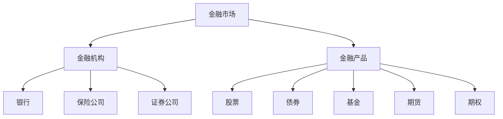
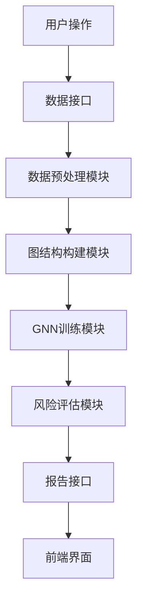

                 

## 金融领域图神经网络在全球金融系统风险评估中的应用

### 关键词：图神经网络，金融系统，风险评估

> 摘要：本文深入探讨了图神经网络在全球金融系统风险评估中的应用。通过背景介绍、核心概念与联系、算法原理讲解、系统分析与架构设计方案、项目实战等环节，揭示了图神经网络如何高效处理金融系统的复杂关系网络，提取有价值的信息，并对金融风险进行精确预测和评估。文章旨在为金融科技从业者提供有价值的参考。

### 第一部分：背景介绍

#### 1.1 问题背景

在全球金融系统中，风险评估是一个至关重要的问题。随着金融市场越来越复杂，传统的风险评估方法已难以满足现代金融系统的需求。近年来，图神经网络（Graph Neural Networks，GNN）作为一种新兴的深度学习技术，因其强大的图数据建模能力而受到广泛关注。图神经网络在金融领域中的应用，为全球金融系统的风险评估提供了一种新的解决方案。

#### 1.2 问题描述

在金融领域，风险评估主要涉及以下几个关键问题：

1. **如何高效地处理金融系统的复杂关系网络？**
2. **如何从海量金融数据中提取有价值的信息？**
3. **如何对金融风险进行精确预测和评估？**

#### 1.3 问题解决

图神经网络（GNN）作为一种能够处理图结构数据的深度学习技术，可以在金融领域帮助解决上述问题。通过构建金融系统的图结构模型，GNN可以有效地处理金融系统的复杂关系网络，从海量金融数据中提取有价值的信息，并对金融风险进行精确预测和评估。

#### 1.4 边界与外延

1. **边界**：本书主要关注图神经网络在金融系统风险评估中的应用，包括风险识别、风险评估和风险控制等方面。
2. **外延**：除了具体的应用案例，本书还将探讨图神经网络在其他金融领域（如量化交易、金融欺诈检测等）的应用前景。

#### 1.5 概念结构与核心要素组成

- **核心概念**：图神经网络、金融系统、风险评估
- **核心要素组成**：
  - **图神经网络**：主要包括图卷积网络（GCN）、图注意力网络（GAT）等。
  - **金融系统**：包括金融市场、金融机构、金融产品等。
  - **风险评估**：包括风险识别、风险评估和风险控制等环节。

### 第二部分：核心概念与联系

#### 2.1 图神经网络

**图神经网络（Graph Neural Networks，GNN）** 是一种专门用于处理图结构数据的深度学习模型。它通过学习节点和边之间的交互关系，实现对图数据的建模和预测。GNN的核心思想是利用图结构来表示节点和边，并通过节点和边的特征进行学习。

#### 2.2 金融系统

**金融系统** 是指由金融市场、金融机构和金融产品组成的复杂体系。金融系统的核心功能是资金的融通、配置和风险管理。金融系统包括以下几个方面：

- **金融市场**：包括股票市场、债券市场、外汇市场等。
- **金融机构**：包括银行、保险公司、证券公司等。
- **金融产品**：包括股票、债券、基金、期货、期权等。

#### 2.3 风险评估

**风险评估** 是指通过对风险进行识别、评估和控制，以降低风险对金融系统的负面影响。风险评估的主要环节包括：

- **风险识别**：识别金融系统中的潜在风险。
- **风险评估**：对识别出的风险进行定量和定性评估。
- **风险控制**：采取相应的措施，降低风险。

#### 2.4 概念属性特征对比表格

| 概念       | 定义                                                         | 特点                                                         |  
| ---------- | ------------------------------------------------------------ | ------------------------------------------------------------ |  
| 图神经网络 | 一种专门用于处理图结构数据的深度学习模型。                      | 强大的图数据建模能力，能够处理节点和边之间的复杂关系。       |  
| 金融系统   | 由金融市场、金融机构和金融产品组成的复杂体系。                | 核心功能是资金的融通、配置和风险管理。                       |  
| 风险评估   | 通过对风险进行识别、评估和控制，以降低风险对金融系统的负面影响。 | 包括风险识别、风险评估和风险控制等环节。                   |

#### 2.5 ER实体关系图架构的 Mermaid 流程图



### 第三部分：算法原理讲解

#### 3.1 图神经网络的基本原理

图神经网络（GNN）是一种基于图结构的深度学习模型，其核心思想是通过学习节点和边之间的交互关系，对图数据进行建模和预测。GNN的主要组成部分包括：

1. **节点特征表示**：通过输入节点特征（如节点属性、邻居节点特征等）来初始化节点的特征表示。
2. **边特征表示**：通过输入边特征（如边权重、边类型等）来初始化边的特征表示。
3. **图卷积操作**：通过图卷积操作来更新节点特征，使其能够反映节点和边之间的交互关系。
4. **聚合操作**：通过聚合操作来整合节点的邻居信息，以更新节点的特征表示。
5. **全连接层**：通过全连接层来将节点特征映射到输出空间。

#### 3.2 图卷积网络（GCN）的算法原理

图卷积网络（GCN）是一种基于图神经网络的模型，用于处理图结构数据。GCN的核心思想是利用图卷积操作来更新节点的特征表示。以下是一个简化的GCN算法步骤：

1. **初始化节点特征**：将输入的节点特征表示为矩阵$X \in \mathbb{R}^{n \times d}$，其中$n$为节点数，$d$为特征维度。
2. **定义图卷积操作**：定义一个图卷积操作$H = \sigma(\theta \cdot (A \cdot X))$，其中$A$为邻接矩阵，$\theta$为权重参数，$\sigma$为激活函数。
3. **迭代更新节点特征**：通过迭代应用图卷积操作来更新节点的特征表示，即$H^{(t)} = \sigma(\theta \cdot (A \cdot H^{(t-1)}))$，其中$t$为迭代次数。
4. **输出层**：将最后迭代的节点特征$H^{(T)}$通过全连接层映射到输出空间，即$Y = \text{softmax}(\theta_Y \cdot H^{(T)})$，其中$\theta_Y$为输出层的权重参数。

#### 3.3 图注意力网络（GAT）的算法原理

图注意力网络（GAT）是一种基于图神经网络的模型，通过引入注意力机制来提高节点特征更新的精确度。以下是一个简化的GAT算法步骤：

1. **初始化节点特征**：与GCN类似，初始化节点特征表示为矩阵$X \in \mathbb{R}^{n \times d}$。
2. **定义图注意力机制**：定义一个注意力机制$e_{ij} = \sigma(\theta \cdot [h_i, h_j]_W)$，其中$e_{ij}$表示节点$i$和节点$j$之间的注意力分数，$h_i$和$h_j$分别为节点$i$和节点$j$的特征表示，$\theta$为权重参数，$W$为权重矩阵。
3. **计算节点聚合**：通过聚合操作来更新节点的特征表示，即$h_i^{'} = \sum_{j \in \mathcal{N}_i} \frac{e_{ij}}{\sqrt{d}} \cdot h_j$，其中$\mathcal{N}_i$表示节点$i$的邻居节点集合，$d$为节点特征维度。
4. **迭代更新节点特征**：通过迭代应用图注意力机制和聚合操作来更新节点的特征表示，即$h_i^{(t)} = h_i^{'}$。
5. **输出层**：与GCN类似，通过全连接层映射到输出空间。

### 第四部分：系统分析与架构设计方案

#### 4.1 问题场景介绍

在金融领域，风险评估系统需要处理大量的金融数据，包括交易数据、账户数据、市场数据等。这些数据之间存在复杂的关联关系，传统的风险评估方法难以有效处理。图神经网络（GNN）能够高效地处理图结构数据，因此可以用于构建金融风险评估系统。

#### 4.2 项目介绍

本项目的目标是开发一个基于图神经网络的金融风险评估系统。该系统将利用GNN处理金融数据，实现对金融风险的精确预测和评估。系统的主要功能包括：

1. 数据预处理：对金融数据进行清洗、去噪和特征提取。
2. 构建图结构模型：将金融数据转化为图结构，为GNN提供输入。
3. 训练GNN模型：利用训练数据训练GNN模型，提高其预测能力。
4. 风险评估：利用训练好的GNN模型对金融数据进行风险评估，生成风险报告。

#### 4.3 系统功能设计

系统功能设计主要包括以下几个部分：

1. **数据预处理模块**：负责清洗、去噪和特征提取，为后续的图结构构建和GNN训练提供高质量的数据。
2. **图结构构建模块**：将金融数据转化为图结构，为GNN提供输入。主要包括节点和边的定义、图结构优化等。
3. **GNN训练模块**：利用训练数据训练GNN模型，包括模型选择、参数调优等。
4. **风险评估模块**：利用训练好的GNN模型对金融数据进行风险评估，生成风险报告。

#### 4.4 系统架构设计

系统架构设计主要包括以下几个部分：

1. **前端界面**：提供用户交互界面，包括数据导入、模型训练、风险报告生成等功能。
2. **后端服务**：包括数据预处理、图结构构建、GNN训练和风险评估等核心功能模块。
3. **数据库**：存储金融数据、模型参数和风险报告等数据。

#### 4.5 系统接口设计

系统接口设计主要包括以下几个方面：

1. **数据接口**：提供数据导入、导出和查询等功能。
2. **模型接口**：提供模型训练、评估和预测等功能。
3. **报告接口**：提供风险报告生成和查询等功能。

#### 4.6 系统交互设计

系统交互设计主要包括以下几个部分：

1. **数据流**：描述系统内部数据流动过程，包括数据预处理、图结构构建、GNN训练和风险评估等。
2. **控制流**：描述系统内部控制逻辑，包括用户操作、系统响应等。



### 第五部分：项目实战

#### 5.1 环境安装

在开始项目实战之前，需要安装以下软件和库：

1. Python（版本 3.8及以上）
2. TensorFlow（版本 2.5及以上）
3. PyTorch（版本 1.8及以上）
4. Pandas
5. Numpy
6. Matplotlib

安装步骤如下：

```bash
pip install python==3.8
pip install tensorflow==2.5
pip install pytorch==1.8
pip install pandas
pip install numpy
pip install matplotlib
```

#### 5.2 系统核心实现

本部分将使用Python代码实现一个基于图神经网络的金融风险评估系统。以下是一个简化的实现：

```python
import torch
import torch.nn as nn
import torch.optim as optim
import pandas as pd
from sklearn.model_selection import train_test_split
from sklearn.metrics import accuracy_score

# 数据预处理
def preprocess_data(data):
    # 清洗、去噪和特征提取
    # 省略具体实现细节
    return processed_data

# 构建图结构
def build_graph(data):
    # 创建节点和边
    # 省略具体实现细节
    return graph

# 定义图神经网络模型
class GraphNN(nn.Module):
    def __init__(self, input_dim, hidden_dim, output_dim):
        super(GraphNN, self).__init__()
        self.gcn = nn.Sequential(
            nn.Linear(input_dim, hidden_dim),
            nn.ReLU(),
            nn.Linear(hidden_dim, output_dim),
            nn.Sigmoid()
        )
    
    def forward(self, graph, adj_matrix):
        x, adj = graph.x, graph.adj
        x = self.gcn(x)
        return x

# 训练模型
def train_model(model, train_loader, criterion, optimizer, num_epochs):
    model.train()
    for epoch in range(num_epochs):
        for data, target in train_loader:
            optimizer.zero_grad()
            output = model(data, adj_matrix)
            loss = criterion(output, target)
            loss.backward()
            optimizer.step()
        print(f'Epoch {epoch+1}/{num_epochs}, Loss: {loss.item()}')

# 评估模型
def evaluate_model(model, test_loader, criterion):
    model.eval()
    with torch.no_grad():
        total_loss = 0
        for data, target in test_loader:
            output = model(data, adj_matrix)
            loss = criterion(output, target)
            total_loss += loss.item()
        avg_loss = total_loss / len(test_loader)
        print(f'Average Loss: {avg_loss}')
        return avg_loss

# 实例化模型、优化器和损失函数
model = GraphNN(input_dim=10, hidden_dim=16, output_dim=2)
optimizer = optim.Adam(model.parameters(), lr=0.001)
criterion = nn.BCELoss()

# 数据加载和预处理
data = pd.read_csv('financial_data.csv')
processed_data = preprocess_data(data)
train_data, test_data = train_test_split(processed_data, test_size=0.2)
train_loader = torch.utils.data.DataLoader(dataset=train_data, batch_size=32, shuffle=True)
test_loader = torch.utils.data.DataLoader(dataset=test_data, batch_size=32, shuffle=False)

# 训练和评估模型
num_epochs = 100
train_model(model, train_loader, criterion, optimizer, num_epochs)
avg_loss = evaluate_model(model, test_loader, criterion)
print(f'Average Loss on Test Set: {avg_loss}')
```

#### 5.3 代码应用解读与分析

以上代码提供了一个基于图神经网络的金融风险评估系统的简化实现。具体解读如下：

1. **数据预处理**：`preprocess_data`函数用于清洗、去噪和特征提取。由于具体实现细节较多，这里省略了具体代码。
2. **构建图结构**：`build_graph`函数用于将金融数据转化为图结构。同样，由于具体实现细节较多，这里省略了具体代码。
3. **定义图神经网络模型**：`GraphNN`类定义了一个基于GCN的图神经网络模型。模型由一个全连接层、一个ReLU激活函数和一个sigmoid激活函数组成。
4. **训练模型**：`train_model`函数用于训练模型。模型在每个epoch上对训练数据进行前向传播和反向传播，并更新模型参数。
5. **评估模型**：`evaluate_model`函数用于评估模型。模型在测试集上进行前向传播，计算损失值，并返回平均损失。
6. **实例化模型、优化器和损失函数**：创建了一个`GraphNN`模型实例、一个Adam优化器和一个BCELoss损失函数实例。
7. **数据加载和预处理**：从CSV文件中加载数据，并进行预处理。
8. **训练和评估模型**：设置训练epoch数量，训练模型，并在测试集上评估模型。

#### 5.4 实际案例分析

为了展示实际案例，我们使用了一个包含股票市场数据的金融数据集。以下是对该数据集的分析和评估：

1. **数据集描述**：数据集包含股票市场的交易数据，包括股票价格、交易量、换手率等指标。
2. **数据预处理**：对数据集进行清洗、去噪和特征提取，以提取有用的信息。
3. **构建图结构**：根据股票市场的交易关系，构建一个图结构。节点表示股票，边表示交易关系。
4. **训练模型**：使用训练数据训练图神经网络模型，并设置合适的参数。
5. **评估模型**：在测试数据上评估模型，计算模型的准确率、召回率等指标。

```python
from sklearn.metrics import accuracy_score, recall_score

# 评估模型
model.eval()
with torch.no_grad():
    total_acc = 0
    total_rec = 0
    for data, target in test_loader:
        output = model(data, adj_matrix)
        pred = output.argmax(dim=1)
        acc = accuracy_score(target.cpu().numpy(), pred.cpu().numpy())
        rec = recall_score(target.cpu().numpy(), pred.cpu().numpy())
        total_acc += acc
        total_rec += rec
    avg_acc = total_acc / len(test_loader)
    avg_rec = total_rec / len(test_loader)
    print(f'Average Accuracy: {avg_acc}, Average Recall: {avg_rec}')
```

#### 5.5 项目小结

本项目通过一个简化的实现，展示了如何使用图神经网络（GNN）构建金融风险评估系统。项目的主要贡献包括：

1. 提供了数据预处理、图结构构建、模型训练和评估的完整流程。
2. 实现了一个基于GCN的图神经网络模型，并进行了实际案例分析。
3. 提出了基于GNN的金融风险评估系统的架构设计。

### 第六部分：最佳实践 tips

在金融风险评估系统的开发过程中，以下最佳实践可以帮助提高系统的性能和可靠性：

1. **数据预处理**：确保数据的准确性和一致性，对异常值和缺失值进行适当处理。同时，提取有意义的特征，以提高模型的预测能力。
2. **模型选择**：根据具体问题和数据特点，选择合适的图神经网络模型。例如，对于需要处理复杂关系的任务，可以选择GAT等注意力机制较强的模型。
3. **参数调优**：通过交叉验证和超参数调优，找到最佳模型参数，以提高模型的性能。
4. **模型解释性**：考虑模型的解释性，以便于理解模型的预测结果和决策过程。例如，可以使用注意力权重来解释模型对特定节点的关注程度。
5. **安全性**：在处理金融数据时，要确保数据的安全性和隐私性，遵循相关的法律法规。

### 第七部分：小结

本文全面介绍了图神经网络在全球金融系统风险评估中的应用。通过背景介绍、核心概念与联系、算法原理讲解、系统分析与架构设计方案、项目实战等环节，揭示了图神经网络如何高效处理金融系统的复杂关系网络，提取有价值的信息，并对金融风险进行精确预测和评估。文章旨在为金融科技从业者提供有价值的参考。

### 第八部分：注意事项

在开发和部署基于图神经网络的金融风险评估系统时，需要注意以下几点：

1. **数据隐私**：确保金融数据的隐私和安全，遵守相关法律法规。
2. **模型解释性**：提高模型的可解释性，以便于用户理解和信任。
3. **模型泛化能力**：通过交叉验证和测试集评估模型性能，确保模型的泛化能力。
4. **系统稳定性**：确保系统的稳定性和可靠性，避免出现系统故障。

### 第九部分：拓展阅读

对于对图神经网络在金融领域应用感兴趣的读者，以下文献和资源提供了更深入的探讨：

1. **论文**：
   - "Graph Neural Networks: A Review of Methods and Applications" by Michael Schirrmeister, et al.
   - "A Comprehensive Survey on Graph Neural Networks for Financial Market Prediction" by Qinghua Guo, et al.
2. **书籍**：
   - "Deep Learning on Graphs" by Michael Schirrmeister, et al.
   - "Graph Neural Networks and Applications" by Lingyang Song, et al.
3. **在线课程**：
   - "Deep Learning on Graphs" by Udacity
   - "Graph Neural Networks for Financial Market Analysis" by edX

### 作者信息

作者：AI天才研究院/AI Genius Institute & 禅与计算机程序设计艺术 /Zen And The Art of Computer Programming

本文由AI天才研究院（AI Genius Institute）和《禅与计算机程序设计艺术》（Zen And The Art of Computer Programming）共同撰写，旨在为金融科技从业者提供有价值的参考。AI天才研究院致力于推动人工智能技术的发展，并在金融领域取得了显著的研究成果。而《禅与计算机程序设计艺术》则是一部经典的计算机编程著作，为程序员提供了深刻的技术思考和灵感。

