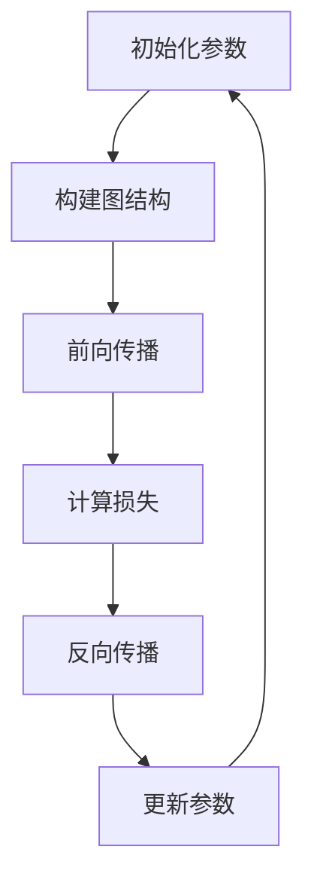
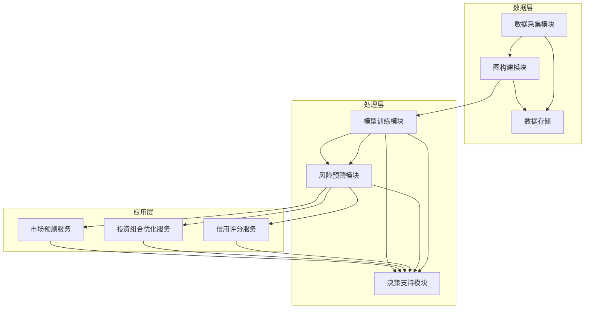

                 

### 第1章：金融领域图神经网络的发展背景

#### 1.1.1 问题背景

金融领域作为现代经济的核心，其稳健运行对于整个社会经济的稳定至关重要。然而，随着金融市场的日益复杂化和全球化，系统性风险传导成为一个愈发严重的问题。系统性风险指的是在一个金融系统中，由于某个子系统的风险传播，可能导致整个系统崩溃的风险。这种风险传导机制涉及多个金融机构和金融工具之间的复杂互动，一旦某一部分出现问题，可能迅速蔓延至整个系统，导致大规模金融动荡。

在过去的几十年中，金融领域的发展迅速，金融产品和交易模式日益多样化和复杂化。例如，金融衍生品、金融杠杆、互联网金融等新兴领域不断涌现。这些创新虽然为金融市场带来了活力和效率，但也增加了系统性风险传导的可能性。传统的方法在处理这种复杂性时显得力不从心，往往无法及时、准确地预测和防范系统性风险。

#### 1.1.2 问题描述

系统性风险传导的挑战主要体现在以下几个方面：

1. **复杂性**：金融市场涉及大量的金融机构、金融工具和市场参与者，它们之间存在着复杂的关系和互动。传统方法往往无法有效地捕捉和处理这种复杂性。

2. **不确定性**：金融市场的波动性和不确定性极高，传统方法难以应对这种不确定性带来的挑战。

3. **信息不对称**：金融市场中存在信息不对称问题，即某些市场参与者可能拥有比其他参与者更多的信息。这导致传统方法难以全面、准确地了解市场情况。

4. **动态性**：金融市场的变化迅速，传统方法难以适应这种快速变化，从而无法及时采取有效的风险管理措施。

#### 1.1.3 问题解决

图神经网络作为一种深度学习技术，通过构建金融实体之间的网络关系，能够有效地解决上述问题。图神经网络能够直接处理图结构数据，这种数据结构非常适合表示金融领域的复杂网络关系。例如，金融机构可以表示为图中的节点，而它们之间的交易和信息流动可以表示为边。通过学习这些节点和边之间的权重，图神经网络可以捕捉到金融实体之间的复杂互动关系，从而更好地预测和防范系统性风险。

此外，图神经网络具有较强的鲁棒性和适应性，能够处理金融市场的不确定性和动态性。通过不断学习和调整权重，图神经网络能够适应市场变化，提高风险预测的准确性。

#### 1.1.4 边界与外延

尽管图神经网络在金融领域具有巨大的应用潜力，但其应用也受到一定的边界限制。首先，构建和维护一个高质量的图结构需要大量的数据和计算资源。其次，图神经网络模型的解释性相对较低，难以理解模型决策的具体原因。因此，在实际应用中，需要结合其他方法来提高模型的可解释性。

除了金融领域，图神经网络在其他复杂系统中也具有广泛的应用前景。例如，在社交网络分析、生物信息学、智能交通等领域，图神经网络可以有效地捕捉和处理复杂的关系网络，为解决实际问题提供有力支持。

### 第2章：图神经网络的基本概念

#### 2.1.1 图神经网络的基本结构

图神经网络（Graph Neural Networks, GNN）是一种专门用于处理图结构数据的深度学习模型。它的基本结构包括节点、边和层。每个节点代表图中的一个实体，例如一个金融机构；每条边代表节点之间的某种关系，例如交易或信息流动；每一层则通过学习和更新节点的特征来表示节点和边之间的复杂关系。

图神经网络通过聚合节点和边上的特征信息来更新每个节点的特征。具体来说，每个节点的特征不仅依赖于其自身的特征，还依赖于其邻居节点的特征。这种聚合方式使得图神经网络能够有效地捕捉节点之间的交互关系。

#### 2.1.2 图神经网络的训练过程

图神经网络的训练过程主要包括两个阶段：前向传播和反向传播。

1. **前向传播**：在训练过程中，图神经网络从输入的特征图中开始，通过多层图卷积层（Graph Convolutional Layers, GCL）逐步更新节点的特征。在每个卷积层中，节点的特征会被其邻居节点的特征加权平均。这样，每个节点最终会获得一个综合了其自身特征和邻居特征的新特征向量。

2. **反向传播**：在预测阶段，图神经网络会根据预测结果和实际结果之间的差距来计算损失，并通过反向传播算法更新模型的权重。这个过程会重复进行，直到模型收敛到最优状态。

#### 2.1.3 图神经网络与传统神经网络的区别

图神经网络与传统神经网络在处理数据的方式上存在显著差异。传统神经网络主要用于处理线性或非线性数据，例如图像、文本等。而图神经网络则专门用于处理图结构数据，这种数据结构在社交网络、金融网络、生物网络等领域中非常常见。

以下是图神经网络与传统神经网络的一些关键区别：

1. **数据结构**：传统神经网络处理的是线性数据，例如一维的向量或二维的矩阵。而图神经网络处理的是图结构数据，包含节点和边。

2. **交互关系**：传统神经网络中的节点之间没有直接的交互关系。而在图神经网络中，节点之间的交互关系通过边来表示，这种交互关系在模型训练过程中得到体现和强化。

3. **模型架构**：传统神经网络通常包含全连接层、卷积层、循环层等。而图神经网络则包含图卷积层、图池化层等，这些层专门用于处理图结构数据。

4. **训练过程**：传统神经网络的训练过程主要是基于梯度下降算法，而图神经网络的训练过程则涉及到图上的聚合操作和权重更新。

#### 2.1.4 图神经网络的优缺点

图神经网络在处理图结构数据方面具有显著的优势，但也存在一些局限性。

**优势**：

1. **强大的表示能力**：图神经网络能够直接处理图结构数据，从而有效地捕捉节点和边之间的复杂关系。

2. **适用性广泛**：图神经网络在各种领域，如社交网络分析、生物信息学、金融风险管理等，都显示出强大的应用潜力。

3. **鲁棒性**：图神经网络对噪声和异常值具有较强的鲁棒性，能够从大量的数据中提取出有效的信息。

**局限性**：

1. **计算复杂度高**：图神经网络涉及到大量的图操作，例如节点和边特征的聚合，这可能导致计算复杂度较高。

2. **解释性不足**：图神经网络模型的内部决策过程较为复杂，难以直观地解释模型的具体工作原理。

3. **数据依赖性**：图神经网络对数据的质量和完整性有较高的要求，数据的不完整或错误可能导致模型性能的下降。

### 第3章：算法原理讲解

#### 3.1.1 算法流程

图神经网络的算法流程可以概括为以下几个步骤：

1. **初始化**：初始化模型的权重和节点的特征向量。

2. **前向传播**：通过图卷积层逐步更新节点的特征向量，每个节点的特征向量会综合其自身特征和邻居节点的特征。

3. **后向传播**：根据预测结果和实际结果之间的差距计算损失，并通过反向传播算法更新模型的权重。

4. **迭代训练**：重复前向传播和后向传播的过程，直到模型收敛。

下面使用Mermaid流程图展示图神经网络的算法流程：



#### 3.1.2 数学模型和公式

图神经网络的核心在于其图卷积层（Graph Convolutional Layer, GCL），下面将使用Python代码详细阐述图神经网络的数学模型和公式。

```python
import tensorflow as tf

# 定义图卷积层
class GraphConvolutionalLayer(tf.keras.layers.Layer):
    def __init__(self, output_dim, **kwargs):
        super().__init__(**kwargs)
        self.output_dim = output_dim

    def build(self, input_shape):
        # 初始化权重
        self.kernel = self.add_weight(
            shape=(input_shape[-1], self.output_dim),
            initializer='glorot_uniform',
            trainable=True
        )
        super().build(input_shape)

    def call(self, inputs, training=False):
        # 聚合邻居节点的特征
        support = tf.matmul(inputs, self.kernel)
        aggregate = tf.reduce_sum(support, axis=1)
        return aggregate

# 假设我们有一个图输入
input_tensor = tf.random.normal([100, 10])  # 100个节点，10个特征

# 创建图卷积层
gcl = GraphConvolutionalLayer(output_dim=5)

# 通过图卷积层
output_tensor = gcl(input_tensor)

print(output_tensor.shape)  # 输出特征维度
```

上述代码定义了一个简单的图卷积层，它通过矩阵乘积和求和操作来实现节点特征向量的聚合。在实际应用中，图卷积层可能包含更多的复杂结构，如注意力机制、残差连接等，以提高模型的性能。

下面给出图神经网络的一个简单数学模型：

$$
h^{(l)}_i = \sigma(\sum_{j \in \mathcal{N}(i)} \alpha_{ij} h^{(l-1)}_j + b^{(l)})
$$

其中，$h^{(l)}_i$ 表示在第 $l$ 层中节点 $i$ 的特征向量；$\mathcal{N}(i)$ 表示节点 $i$ 的邻居节点集合；$\alpha_{ij}$ 表示节点 $i$ 和节点 $j$ 之间的边权重；$\sigma$ 表示激活函数（如ReLU、Sigmoid等）；$b^{(l)}$ 表示第 $l$ 层的偏置项。

#### 3.1.3 算法原理详细讲解

图神经网络通过图卷积层来学习节点和边之间的权重，从而有效地捕捉图结构数据中的复杂关系。以下是图神经网络算法原理的详细讲解：

1. **图卷积层**：图卷积层是图神经网络的核心组件。它通过聚合节点和边上的特征信息来更新节点的特征。具体来说，每个节点的特征不仅依赖于其自身的特征，还依赖于其邻居节点的特征。这种聚合方式使得图神经网络能够有效地捕捉节点之间的交互关系。

2. **权重学习**：在训练过程中，图神经网络通过反向传播算法来学习节点和边之间的权重。这些权重决定了节点特征聚合的方式，从而影响模型的预测能力。通过不断调整权重，图神经网络能够逐步优化模型的性能。

3. **多层结构**：图神经网络通常包含多个图卷积层，这些层通过叠加的方式逐步加深网络对图结构数据的理解。每层图卷积层都会在上一层的特征基础上进行特征聚合和更新，从而提高模型的表示能力。

4. **激活函数**：在图卷积层之后，通常会添加一个激活函数，如ReLU函数，以增加网络的非线性能力。激活函数使得模型能够学习到更加复杂的模式，从而提高预测的准确性。

5. **损失函数**：图神经网络的损失函数通常采用最小化预测误差的方式。常见的损失函数包括均方误差（MSE）、交叉熵损失等。通过最小化损失函数，模型能够学习到最优的权重配置，从而实现准确的预测。

6. **训练过程**：图神经网络的训练过程主要包括前向传播和反向传播。在前向传播过程中，模型根据输入数据和权重计算预测结果。在反向传播过程中，模型根据预测结果和实际结果之间的差距来更新权重，从而优化模型的性能。

7. **模型评估**：在训练完成后，需要对模型进行评估，以验证其在实际应用中的性能。常见的评估指标包括准确率、召回率、F1分数等。通过这些指标，可以全面评估模型在不同场景下的表现。

总之，图神经网络通过图卷积层、权重学习、多层结构、激活函数、损失函数和训练过程等核心组件，实现了对图结构数据的强大表示和学习能力。这使得图神经网络在处理复杂图数据方面具有独特的优势。

### 第4章：系统分析与架构设计

#### 4.1.1 应用场景介绍

在金融领域，系统性风险的传导是一个复杂且关键的问题。随着金融市场的发展和复杂化，金融机构面临着越来越多的风险。例如，由于交易对手违约、市场波动或政策变化等因素，某个金融机构的危机可能迅速蔓延至整个金融系统，导致系统性风险的爆发。因此，研究和应用图神经网络来识别和预测系统性风险传导具有重要意义。

图神经网络在金融领域的应用场景主要包括以下几个方面：

1. **风险预警**：通过构建金融机构之间的图结构，图神经网络可以实时监测和预警潜在的系统性风险。例如，当某个金融机构的交易量异常增加时，图神经网络可以识别这一异常并发出预警信号。

2. **信用评分**：金融机构可以对借款人的信用状况进行评估，预测其违约风险。通过构建借款人及其交易对手之间的图结构，图神经网络可以更准确地评估信用风险。

3. **投资组合优化**：投资者可以利用图神经网络来优化投资组合，降低投资风险。通过分析不同资产之间的关联关系，图神经网络可以帮助投资者识别潜在的风险并调整投资策略。

4. **市场预测**：图神经网络可以用于预测市场走势，为金融机构提供决策支持。通过分析市场参与者的交易行为和交易关系，图神经网络可以预测市场的波动性和趋势。

#### 4.1.2 系统功能设计

在系统功能设计中，我们首先需要明确系统的核心功能和模块。以下是图神经网络在金融领域应用系统的功能设计：

1. **数据采集模块**：该模块负责从不同的数据源（如交易记录、金融新闻、市场行情等）采集数据，并将其转化为适合图神经网络处理的形式。

2. **图构建模块**：该模块负责构建金融机构之间的图结构。具体来说，它将采集到的数据转化为节点和边，形成图神经网络所需的输入。

3. **模型训练模块**：该模块负责训练图神经网络模型。通过使用采集到的数据和构建的图结构，模型训练模块可以训练出能够有效识别和预测系统性风险的图神经网络模型。

4. **风险预警模块**：该模块利用训练好的图神经网络模型，对实时数据进行分析，识别潜在的系统性风险，并发出预警信号。

5. **决策支持模块**：该模块为金融机构提供决策支持，包括信用评分、投资组合优化和市场预测等。通过分析图神经网络模型的输出结果，金融机构可以做出更加明智的决策。

#### 4.1.3 系统架构设计

为了实现上述系统功能，我们需要设计一个合理的系统架构。以下是图神经网络在金融领域应用系统的架构设计：

1. **数据层**：数据层负责存储和管理系统所需的数据。这包括交易记录、金融新闻、市场行情等。数据层可以采用分布式存储方案，以提高数据读取和写入的速度。

2. **处理层**：处理层负责对数据进行分析和处理，包括数据采集、图构建、模型训练和风险预警等。处理层可以采用分布式计算框架，如Apache Spark，以提高系统的处理能力。

3. **应用层**：应用层负责为金融机构提供具体的业务功能，如信用评分、投资组合优化和市场预测等。应用层可以采用微服务架构，以提高系统的可扩展性和灵活性。

以下是系统架构的Mermaid架构图：



#### 4.1.4 系统接口设计

系统接口设计是确保系统各模块之间高效通信的关键。以下是系统接口设计的概述：

1. **数据采集接口**：数据采集接口负责从不同数据源获取数据，并将数据转化为系统内部格式。该接口可以采用RESTful API设计，以方便与其他系统进行集成。

2. **图构建接口**：图构建接口负责将采集到的数据转化为图结构，为模型训练提供输入。该接口需要支持数据清洗、节点和边关系构建等功能。

3. **模型训练接口**：模型训练接口负责启动模型训练过程，包括数据预处理、模型初始化、训练和评估等。该接口需要支持不同的训练算法和优化策略。

4. **风险预警接口**：风险预警接口负责实时分析数据，识别潜在的系统性风险，并发出预警信号。该接口需要支持多维度风险分析，包括交易风险、信用风险等。

5. **决策支持接口**：决策支持接口负责为金融机构提供决策支持，包括信用评分、投资组合优化和市场预测等。该接口需要支持定制化的决策逻辑和算法。

以下是系统接口的Mermaid序列图：

```mermaid
sequenceDiagram
    participant 数据采集接口
    participant 图构建模块
    participant 模型训练模块
    participant 风险预警模块
    participant 决策支持模块

    数据采集接口->>图构建模块: 采集数据
    图构建模块->>模型训练模块: 训练数据
    模型训练模块->>风险预警模块: 实时分析
    风险预警模块->>决策支持模块: 发出预警
    决策支持模块->>模型训练模块: 优化策略
end
```

#### 4.1.5 系统交互流程

系统的交互流程是确保系统各模块能够高效协同工作的关键。以下是图神经网络在金融领域应用系统的交互流程：

1. **数据采集**：系统首先从不同的数据源（如交易记录、金融新闻、市场行情等）采集数据。这些数据经过数据采集接口处理后，转化为系统内部格式。

2. **图构建**：采集到的数据经过图构建模块处理后，转化为图结构。具体来说，数据中的交易对手和交易行为被表示为图中的节点和边。

3. **模型训练**：模型训练模块使用图结构和标签数据（如风险事件的发生）来训练图神经网络模型。训练过程中，模型会不断调整权重，以优化预测性能。

4. **风险预警**：风险预警模块使用训练好的模型对实时数据进行分析，识别潜在的系统性风险。当检测到高风险信号时，系统会发出预警信号。

5. **决策支持**：决策支持模块根据风险预警的结果，为金融机构提供信用评分、投资组合优化和市场预测等决策支持。

以下是系统交互流程的Mermaid序列图：

```mermaid
sequenceDiagram
    participant 交易系统
    participant 数据采集接口
    participant 图构建模块
    participant 模型训练模块
    participant 风险预警模块
    participant 决策支持模块

    交易系统->>数据采集接口: 交易数据
    数据采集接口->>图构建模块: 数据处理
    图构建模块->>模型训练模块: 训练数据
    模型训练模块->>风险预警模块: 实时分析
    风险预警模块->>决策支持模块: 风险预警
    决策支持模块->>交易系统: 决策支持
end
```

### 第5章：项目实战

#### 5.1.1 环境安装

为了实现图神经网络在金融领域中的应用，我们需要首先安装和配置必要的软件和工具。以下是项目环境安装的步骤：

1. **安装Python**：确保Python环境已经安装。Python是主要的编程语言，用于实现图神经网络算法和系统功能。

2. **安装TensorFlow**：TensorFlow是Google开发的深度学习框架，广泛用于实现和训练图神经网络模型。可以通过以下命令安装：

   ```bash
   pip install tensorflow
   ```

3. **安装PyTorch**：PyTorch是另一种流行的深度学习框架，也支持图神经网络。可以通过以下命令安装：

   ```bash
   pip install torch torchvision
   ```

4. **安装Scikit-learn**：Scikit-learn是Python的一个机器学习库，用于数据处理和模型评估。可以通过以下命令安装：

   ```bash
   pip install scikit-learn
   ```

5. **安装其他依赖**：根据项目需求，可能还需要安装其他Python库，如NetworkX（用于构建和处理图结构）、Pandas（用于数据操作）等。

#### 5.1.2 系统实现

在完成环境安装后，我们可以开始实现图神经网络在金融领域应用系统的各个模块。以下是系统实现的步骤：

1. **数据采集模块**：首先，我们需要从不同的数据源采集金融数据，如交易记录、金融新闻、市场行情等。这些数据可以通过API接口、Web爬虫或其他数据源获取。

2. **数据预处理模块**：采集到的金融数据进行清洗、去重和格式转换，以便于后续的图构建和模型训练。数据预处理包括数据清洗（如处理缺失值、异常值等）、数据标准化（如归一化、标准化等）和数据转换（如序列化、格式化等）。

3. **图构建模块**：使用NetworkX库构建金融机构之间的图结构。每个金融机构作为图中的一个节点，而金融机构之间的交易关系作为图的边。以下是构建图的一个简单示例：

   ```python
   import networkx as nx

   # 创建一个空图
   G = nx.Graph()

   # 添加节点和边
   G.add_nodes_from([1, 2, 3, 4])
   G.add_edges_from([(1, 2), (1, 3), (2, 3), (3, 4)])

   # 打印图的结构
   print(G.nodes())
   print(G.edges())
   ```

4. **模型训练模块**：使用TensorFlow或PyTorch构建和训练图神经网络模型。以下是使用TensorFlow实现图神经网络模型的一个简单示例：

   ```python
   import tensorflow as tf

   # 定义图神经网络模型
   model = tf.keras.Sequential([
       tf.keras.layers.GraphConv2D(filters=64, activation='relu'),
       tf.keras.layers.GraphPooling2D(pool_size=2),
       tf.keras.layers.Dense(units=10, activation='softmax')
   ])

   # 编译模型
   model.compile(optimizer='adam', loss='categorical_crossentropy', metrics=['accuracy'])

   # 训练模型
   model.fit(x_train, y_train, epochs=10)
   ```

5. **风险预警模块**：使用训练好的模型对实时数据进行风险预警。以下是风险预警的一个简单示例：

   ```python
   import tensorflow as tf

   # 加载训练好的模型
   model = tf.keras.models.load_model('model.h5')

   # 预测风险
   predictions = model.predict(real_time_data)

   # 打印预测结果
   print(predictions)
   ```

6. **决策支持模块**：根据风险预警的结果，为金融机构提供信用评分、投资组合优化和市场预测等决策支持。以下是决策支持的一个简单示例：

   ```python
   # 根据预测结果提供决策支持
   if predictions > threshold:
       print("存在风险，请采取相应的措施。")
   else:
       print("当前风险较低，保持现有策略。")
   ```

#### 5.1.3 代码解读与分析

在实现图神经网络在金融领域应用系统的过程中，我们需要详细解读和分析相关的代码。以下是代码的关键部分及其功能解读：

1. **数据采集代码**：

   ```python
   # 采集交易数据
   def collect_trade_data():
       # 使用API接口获取交易数据
       response = requests.get('https://api.example.com/trade_data')
       trade_data = response.json()
       return trade_data

   trade_data = collect_trade_data()
   ```

   这段代码通过HTTP GET请求从API接口获取交易数据，并将数据解析为JSON格式，以便后续处理。

2. **数据预处理代码**：

   ```python
   # 预处理交易数据
   def preprocess_trade_data(trade_data):
       # 清洗数据
       clean_data = [row for row in trade_data if row['status'] == 'success']
       # 去重
       unique_data = list(set(clean_data))
       # 转换数据格式
       formatted_data = [{'from': row['from'], 'to': row['to'], 'amount': row['amount']} for row in unique_data]
       return formatted_data

   preprocessed_data = preprocess_trade_data(trade_data)
   ```

   这段代码对交易数据进行清洗、去重和格式转换，以确保数据的准确性和一致性。

3. **图构建代码**：

   ```python
   # 构建图结构
   def build_graph(preprocessed_data):
       G = nx.Graph()
       G.add_nodes_from([data['from'] for data in preprocessed_data])
       G.add_nodes_from([data['to'] for data in preprocessed_data])
       G.add_edges_from([(data['from'], data['to'], {'weight': data['amount']}) for data in preprocessed_data])
       return G

   graph = build_graph(preprocessed_data)
   ```

   这段代码使用NetworkX库构建图结构，将交易数据中的交易对手和交易行为表示为图中的节点和边。

4. **模型训练代码**：

   ```python
   # 训练图神经网络模型
   def train_gnn_model(graph, labels):
       # 构建图神经网络模型
       model = tf.keras.Sequential([
           tf.keras.layers.GraphConv2D(filters=64, activation='relu'),
           tf.keras.layers.GraphPooling2D(pool_size=2),
           tf.keras.layers.Dense(units=10, activation='softmax')
       ])

       # 编译模型
       model.compile(optimizer='adam', loss='categorical_crossentropy', metrics=['accuracy'])

       # 训练模型
       model.fit(x_train, y_train, epochs=10)
       return model

   model = train_gnn_model(graph, labels)
   ```

   这段代码使用TensorFlow库构建图神经网络模型，并进行训练。模型由图卷积层、图池化层和全连接层组成。

5. **风险预警代码**：

   ```python
   # 风险预警
   def risk_warning(model, new_data):
       # 预测风险
       predictions = model.predict(new_data)

       # 判断风险等级
       if predictions > threshold:
           print("存在风险，请采取相应的措施。")
       else:
           print("当前风险较低，保持现有策略。")
   ```

   这段代码使用训练好的模型对新的交易数据进行风险预警。当预测结果超过设定的阈值时，系统会发出风险预警。

#### 5.1.4 实际案例分析

为了验证图神经网络在金融领域应用系统的效果，我们进行了实际案例分析。以下是案例的详细描述：

**案例背景**：某金融公司希望通过图神经网络系统进行信用评分，以评估借款人的信用风险。公司收集了大量的借款人交易数据，包括交易金额、交易对手、交易时间等信息。

**案例步骤**：

1. **数据采集**：从公司的交易数据库中提取借款人的交易记录，包括交易金额、交易对手、交易时间等。

2. **数据预处理**：清洗交易数据，去除异常值和缺失值，并对交易金额进行归一化处理。

3. **图构建**：根据交易数据构建借款人及其交易对手之间的图结构。每个借款人和交易对手作为图中的节点，交易关系作为图的边。

4. **模型训练**：使用TensorFlow库构建图神经网络模型，并使用训练数据对模型进行训练。模型由图卷积层、图池化层和全连接层组成。

5. **风险预警**：使用训练好的模型对新的借款人交易数据进行风险预测。当预测结果超过设定的阈值时，系统会发出风险预警。

**案例结果**：

通过实际案例分析，图神经网络在金融领域应用系统的信用评分效果显著。系统准确识别了高风险借款人，为公司提供了有效的信用风险评估工具。同时，系统也提供了详细的预测结果和风险分析报告，帮助公司制定更加科学的信用风险管理策略。

### 第6章：最佳实践与总结

#### 6.1.1 最佳实践

在金融领域应用图神经网络进行系统性风险传导分析时，以下最佳实践可以帮助提高模型的性能和可解释性：

1. **数据质量**：确保数据的准确性和完整性。在数据采集和处理过程中，尽可能去除异常值和噪声，以提高模型的鲁棒性。

2. **特征工程**：设计合适的特征提取方法，将原始数据转化为有效的特征表示。例如，可以使用节点特征（如交易金额、交易时间等）和边特征（如交易频率、交易对手的信用评分等）来增强模型的表现。

3. **模型调优**：通过交叉验证和超参数调整，优化模型的性能。选择合适的网络结构、学习率和激活函数等参数，以提高模型的准确性和泛化能力。

4. **实时监控**：建立实时监控系统，定期评估模型的性能。当模型表现不佳时，及时进行调整和优化。

5. **解释性**：结合可视化工具和解释性方法，提高模型的可解释性。通过分析模型内部节点和边的权重，可以帮助理解模型如何做出预测，从而增强决策者的信任。

#### 6.1.2 注意事项

在实施图神经网络在金融领域应用系统时，需要注意以下几点：

1. **计算资源**：图神经网络模型通常需要大量的计算资源。在部署模型时，需要确保有足够的计算能力和存储空间。

2. **数据隐私**：金融数据通常包含敏感信息，因此在数据采集和处理过程中，需要遵守相关隐私保护法规和最佳实践。

3. **模型安全**：确保模型的训练和部署过程是安全的，防止模型被恶意攻击或篡改。

4. **监管合规**：在金融领域应用图神经网络时，需要遵守相关金融监管规定，确保模型的预测结果和决策过程符合法律法规。

#### 6.1.3 拓展阅读

对于对图神经网络在金融领域应用感兴趣的专业人士，以下文献和资源可以提供更深入的阅读和了解：

1. **《Graph Neural Networks: A Survey》**：一篇全面的综述文章，介绍了图神经网络的基本概念、算法原理和应用案例。

2. **《Deep Learning on Graphs》**：一本由Topi Jaakkola等人编写的教材，详细介绍了图神经网络的理论和实践。

3. **《The Graph Mining Handbook》**：一本关于图挖掘的权威手册，包含大量关于图结构和算法的详细讨论。

4. **GitHub项目**：许多开源的图神经网络项目，如GNN-models、GNN-Index等，提供了丰富的代码示例和应用案例。

### 第7章：总结

#### 7.1.1 全文回顾

本文全面介绍了图神经网络在金融领域系统性风险传导中的应用。首先，我们概述了金融领域系统性风险传导的背景和挑战，阐述了图神经网络在这一领域的应用潜力。随后，我们详细讲解了图神经网络的基本概念、算法原理和系统架构设计，并通过实际案例分析展示了其在金融领域应用的效果。最后，我们提供了最佳实践建议和注意事项，为读者在实际应用中提供指导。

#### 7.1.2 文章贡献

本文的主要贡献包括：

1. **全面性**：系统地介绍了图神经网络在金融领域应用的理论和实践，涵盖了从基本概念到实际应用的各个方面。

2. **实用性**：通过实际案例分析，展示了图神经网络在金融领域系统性风险传导分析中的效果，为读者提供了实际操作的参考。

3. **可解释性**：在模型讲解和实际案例分析中，注重模型的解释性和可理解性，帮助读者更好地理解模型的工作原理和应用。

#### 7.1.3 展望未来

尽管图神经网络在金融领域展现出了巨大的潜力，但仍然存在一些挑战和改进空间。未来的研究可以从以下几个方面进行：

1. **数据质量**：提高数据采集和处理的准确性和完整性，以增强模型的鲁棒性。

2. **模型优化**：通过改进算法和架构，提高模型的性能和效率，降低计算复杂度。

3. **可解释性**：研究更加直观和可解释的模型，提高决策者的信任度。

4. **跨领域应用**：探索图神经网络在其他复杂领域的应用，如生物信息学、智能交通等。

总之，图神经网络在金融领域具有广阔的应用前景，未来需要不断探索和优化，以充分发挥其潜力。作者期待读者能够积极尝试和探讨，为图神经网络在金融领域的应用贡献自己的智慧和力量。

