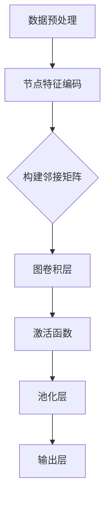

                 

### 金融领域图神经网络在系统性风险评估中的应用

> 关键词：图神经网络、金融领域、系统性风险评估、风险预测、信用评分

金融领域一直是一个充满复杂性和风险性的行业。随着大数据、人工智能等技术的不断发展，金融领域开始探索如何利用这些先进技术来提升系统性风险评估的准确性和效率。其中，图神经网络（Graph Neural Networks，GNN）作为一种新型的深度学习技术，在处理复杂网络结构和关系方面展现了巨大的潜力。

本文将围绕金融领域图神经网络在系统性风险评估中的应用展开讨论。首先，我们将介绍图神经网络的基本概念和原理，然后探讨其在金融领域的具体应用，并通过案例研究展示其在系统性风险评估中的实际效果。此外，文章还将分析GNN在系统性风险评估中的优势，并提供一些实际应用案例。最后，我们将讨论图神经网络在金融领域的未来发展趋势和潜在挑战。

通过本文的阅读，读者将了解：

1. **图神经网络的基本原理和应用场景**。
2. **GNN在金融领域系统性风险评估中的具体应用**。
3. **GNN的优势和挑战**。
4. **实际案例分析**。
5. **未来发展趋势**。

让我们一起来探讨金融领域图神经网络在系统性风险评估中的应用，开启一场技术与金融的深度对话。

### 目录大纲

1. **第一部分：导论**
   - **第1章：金融领域图神经网络概述**
     - **1.1 问题背景**
     - **1.2 研究问题与目标**
     - **1.3 核心概念**
     - **1.4 概念属性特征对比表**
     - **1.5 ER实体关系图架构**
   - **第2章：图神经网络原理**
     - **2.1 图神经网络（GNN）基本概念**
     - **2.2 GNN的核心算法**
     - **2.3 GNN算法流程图**
   - **第3章：金融领域图神经网络应用**
     - **3.1 图神经网络在金融领域的应用**
     - **3.2 案例研究**
   - **第4章：图神经网络在系统性风险评估中的应用**
     - **4.1 系统性风险评估概述**
     - **4.2 GNN在系统性风险评估中的优势**
     - **4.3 实际应用案例分析**

2. **第二部分：图神经网络基础**
   - **第5章：金融领域图神经网络项目实战**
     - **5.1 项目环境搭建**
     - **5.2 核心实现源代码**
     - **5.3 代码应用解读与分析**
   - **第6章：金融领域图神经网络应用最佳实践**
     - **6.1 最佳实践**
     - **6.2 注意事项**
   - **第7章：拓展阅读**

通过以上大纲，我们将对图神经网络在金融领域系统性风险评估中的应用进行深入探讨，并希望读者能够从中获得宝贵的见解和实践经验。

### 第一部分：导论

#### 第1章：金融领域图神经网络概述

在当今的金融领域中，风险管理和系统性风险评估是至关重要的任务。金融系统的复杂性不断增加，各种金融产品、市场参与者以及交易关系构成了一个庞大的网络。传统的风险评估方法往往依赖于历史数据和统计模型，但它们在面对高度动态和复杂的金融环境时，往往难以捕捉到隐藏在复杂网络中的潜在风险。

随着人工智能和深度学习技术的快速发展，图神经网络（Graph Neural Networks，GNN）作为一种新型的深度学习技术，开始在金融领域展现出其独特的优势。GNN可以有效地处理图结构数据，捕捉网络中的复杂关系，从而为系统性风险评估提供了新的工具和方法。

##### 1.1 问题背景

金融领域的重要性不言而喻。金融市场是全球经济的重要组成部分，而金融系统的稳定性和健康运行对于全球经济的繁荣和稳定至关重要。然而，金融系统的复杂性不断上升，各类金融产品层出不穷，市场参与者之间形成了复杂的关系网络。这种复杂性不仅增加了金融系统的脆弱性，也给风险管理带来了巨大的挑战。

系统性风险是指由于金融系统中各个组成部分之间的相互依赖和关联，当一个部分出现问题并蔓延至其他部分时，可能导致整个系统崩溃的风险。这种风险不仅会对金融机构造成重大损失，还可能对全球经济产生深远影响。因此，如何有效地识别、评估和防范系统性风险，成为金融领域亟待解决的重要问题。

传统的方法，如统计模型、机器学习和深度学习，在处理简单的线性关系或独立数据时表现出色，但在应对复杂网络结构时往往力不从心。而图神经网络作为一种能够处理图结构数据的深度学习模型，具有在金融领域系统性风险评估中应用的巨大潜力。

##### 1.2 研究问题与目标

研究系统性风险评估中的图神经网络应用，主要涉及以下几个关键问题：

1. **数据处理和特征提取**：金融系统数据通常具有复杂的网络结构，如何有效地处理和提取数据中的特征是研究的重要方向。GNN可以通过学习节点和边之间的复杂关系，实现数据的高效处理和特征提取。

2. **风险评估模型的构建**：如何利用GNN构建一个能够准确预测和评估系统性风险的模型，是研究的核心目标。通过训练GNN模型，可以识别出金融网络中的关键节点和潜在风险点，从而为风险管理和决策提供有力支持。

3. **模型解释性和可解释性**：在金融领域，模型的解释性和可解释性至关重要。GNN模型的内部结构和决策过程相对复杂，如何提高模型的透明度和可解释性，使其能够被金融从业者理解和应用，是研究的另一个重要目标。

本研究的主要目标如下：

1. **构建基于GNN的系统性风险评估模型**：通过训练GNN模型，捕捉金融网络中的复杂关系，构建一个能够准确预测和评估系统性风险的模型。

2. **验证模型的有效性和可靠性**：通过实际数据和案例分析，验证GNN模型在系统性风险评估中的有效性和可靠性。

3. **探讨GNN模型在金融领域的应用前景**：研究GNN模型在金融领域其他应用场景的潜力，如信用评分、投资组合优化等。

##### 1.3 核心概念

在研究图神经网络在金融领域中的应用之前，我们需要理解一些核心概念和术语：

1. **图神经网络（GNN）**：GNN是一种深度学习模型，专门用于处理图结构数据。它通过学习节点和边之间的复杂关系，实现对图数据的特征提取和表示学习。

2. **金融系统与风险模型**：金融系统是指由金融机构、金融工具和市场参与者构成的网络。风险模型则是用于评估和预测金融系统中潜在风险的数学模型。

3. **数据处理与特征提取**：在金融领域，数据处理和特征提取是关键步骤。GNN可以通过学习节点和边之间的复杂关系，自动提取数据中的有效特征。

##### 1.4 概念属性特征对比表

以下是一个概念属性特征对比表，展示了图神经网络（GNN）与传统神经网络以及其在金融领域应用的不同之处：

| 特征               | 图神经网络（GNN）                | 传统神经网络                     | 金融领域应用                          |
|------------------|-----------------------------|------------------------------|-----------------------------------|
| **数据结构**       | 图结构数据（节点和边）           | 标量或向量数据                  | 图结构金融数据（如交易网络、信用评分网络）         |
| **数据处理能力**   | 高效处理图结构数据             | 适用于线性结构数据            | 适用于复杂金融关系网络，如信用网络、市场网络等       |
| **应用场景**       | 社交网络分析、知识图谱构建       | 分类、回归问题                 | 信用评分、风险预测、投资组合优化等           |

##### 1.5 ER实体关系图架构

为了更好地理解金融系统中各个实体之间的关系，我们可以使用ER（Entity-Relationship）实体关系图来描述。以下是一个简单的ER图示例，展示了银行、客户、产品和交易之间的关系：

```mermaid
erDiagram
  Person ||--|{ Transaction } : makes
  Product ||--|{ Transaction } : contains
  Bank ||--|{ Person } : holds_account
  Bank ||--|{ Product } : offers
```

在这个ER图中，Person（个人）与Transaction（交易）之间存在“makes”关系，表示个人可以发起交易；Product（产品）与Transaction（交易）之间存在“contains”关系，表示交易包含产品；Bank（银行）与Person（个人）之间存在“holds_account”关系，表示银行持有个人的账户；Bank（银行）与Product（产品）之间存在“offers”关系，表示银行提供产品。

通过上述对金融领域图神经网络概述的介绍，我们为后续章节的深入讨论奠定了基础。在接下来的章节中，我们将详细探讨图神经网络的基本原理和应用，以及其在系统性风险评估中的具体应用和案例分析。

### 第一部分：导论

#### 第2章：图神经网络原理

图神经网络（Graph Neural Networks，GNN）是一种专门设计用于处理图结构数据的深度学习模型。相比于传统的神经网络，GNN能够更好地捕捉节点和边之间的复杂关系，从而在处理复杂网络数据时表现出色。本章节将介绍GNN的基本概念、核心算法以及其算法流程图，为读者理解GNN在金融领域的应用提供基础。

##### 2.1 图神经网络（GNN）基本概念

图神经网络（GNN）是一种用于处理图结构数据的深度学习模型，其核心思想是通过学习节点和边之间的复杂关系来实现图数据的特征提取和表示学习。GNN主要由以下几个关键组成部分构成：

1. **节点和边**：图数据由节点和边组成。节点表示图中的数据点，如个人、产品等；边表示节点之间的关系，如交易、持有等。

2. **节点特征**：每个节点都有一个特征向量，用于描述节点的属性。这些特征可以是基于节点本身的属性（如个人年龄、收入等），也可以是其他节点或边的特征。

3. **边特征**：边也可以具有特征，这些特征描述了节点之间的关系。例如，交易金额、交易频率等。

4. **图卷积操作**：GNN通过图卷积操作来更新节点的特征。图卷积操作模拟了传统卷积操作在图像上的效果，但在图上，节点和边之间的互动被用于特征更新。

5. **图池化操作**：图池化操作用于整合图中的节点特征，以生成全局特征表示。这对于处理大规模图数据尤为重要。

##### 2.2 GNN的核心算法

GNN的核心算法包括以下几种：

1. **图卷积网络（GCN）**：图卷积网络是最早提出的GNN模型，其核心思想是通过聚合邻居节点的特征来更新当前节点的特征。GCN的数学公式如下：

   $$ 
   h^{\ell+1}_{i} = \sigma(\theta_{\ell}^{g} [h^{\ell}_{i} ; \mathbf{A} \cdot h^{\ell}_{j}]) 
   $$

   其中，$h^{\ell}_{i}$表示第$\ell$层节点$i$的特征，$\theta_{\ell}^{g}$是权重矩阵，$\mathbf{A}$是邻接矩阵，$\sigma$是激活函数。

2. **图注意力网络（GAT）**：图注意力网络通过引入注意力机制来动态调整邻居节点对当前节点特征更新的贡献。GAT的数学公式如下：

   $$ 
   \mathbf{A}^{\ell} = \text{softmax}(\text{LeakyReLU}(\theta_{\ell}^{a} [h^{\ell-1}_{i} ; \mathbf{1}^T \cdot \mathbf{D}^{-1/2} \mathbf{A} \cdot \mathbf{1}^T))) 
   $$

   $$ 
   h^{\ell+1}_{i} = \sigma(\theta_{\ell}^{g} [h^{\ell}_{i} ; \sum_{j=1}^{N} \mathbf{A}^{\ell}_{ij} h^{\ell}_{j}]) 
   $$

   其中，$\theta_{\ell}^{a}$和$\theta_{\ell}^{g}$分别是注意力权重和卷积权重，$\mathbf{D}$是对应邻接矩阵$\mathbf{A}$的度矩阵。

3. **图卷积嵌入（GraphSAGE）**：图卷积嵌入通过聚合不同邻居节点的特征来生成新的节点特征表示。GraphSAGE的数学公式如下：

   $$ 
   \text{mean}\_{\ell} (x^{(i)}, X^{(i)}) = \frac{1}{k} \sum_{j=1}^{k} f(\theta_{\ell}^{m} [x^{(i)} ; \theta_{\ell}^{e} [X^{(j)}]) 
   $$

   $$ 
   \text{pool}\_{\ell} (x^{(i)}, X^{(i)}) = \theta_{\ell}^{pool} [\text{mean}\_{\ell} (x^{(i)}, X^{(i)}); \text{max}(\theta_{\ell}^{e} [X^{(j)}])] 
   $$

   其中，$f$、$g$和$pool$分别是聚合函数、嵌入函数和池化函数，$X^{(i)}$是邻居节点的特征集合。

##### 2.3 GNN算法流程图

以下是GNN算法的基本流程图，展示了数据预处理、节点特征编码、图卷积层、激活函数、池化层和输出层的处理流程：



通过上述对图神经网络原理的介绍，我们可以看到GNN在处理图结构数据方面具有独特的优势。接下来，我们将探讨GNN在金融领域中的具体应用，并通过实际案例来展示其在系统性风险评估中的效果。

### 第一部分：导论

#### 第3章：金融领域图神经网络应用

图神经网络（GNN）在金融领域具有广泛的应用潜力，特别是在信用评分、风险预测和投资组合优化等方面。通过利用图结构数据，GNN能够捕捉金融系统中复杂的关系和模式，从而提升风险评估和决策的准确性。以下将详细探讨GNN在这三个方面的具体应用，并通过案例研究展示其实际效果。

##### 3.1 图神经网络在金融领域的应用

1. **信用评分**：信用评分是金融领域中的一个重要任务，它涉及对借款人的信用状况进行评估，以决定是否批准贷款以及贷款的额度。传统的信用评分模型通常依赖于借款人的历史信用记录、收入水平、债务水平等数据。然而，这些数据往往无法全面反映借款人的信用风险，尤其是在面对新兴市场和复杂的金融产品时。

   GNN通过分析借款人与其他借款人、金融机构之间的交易关系，可以更全面地了解借款人的信用风险。具体来说，GNN可以从图结构数据中提取出借款人的社交网络特征、交易行为特征等，从而构建一个更准确的信用评分模型。例如，某金融机构可以利用GNN对客户进行信用评分，通过分析客户的交易网络、社交关系和交易行为，预测其信用风险。

2. **风险预测**：风险预测是金融领域中另一个关键任务，它涉及预测金融系统中的潜在风险，如市场风险、信用风险和操作风险。传统的风险预测方法通常依赖于历史数据和统计模型，但这些方法在面对复杂和动态的金融市场时，往往难以捕捉到隐藏在复杂网络中的潜在风险。

   GNN能够有效地处理复杂网络数据，通过学习节点和边之间的复杂关系，可以预测金融系统中的潜在风险。例如，某金融机构可以利用GNN预测市场风险，通过分析交易网络、金融机构之间的借贷关系和交易行为，预测市场波动的可能性。此外，GNN还可以用于预测信用风险，通过分析借款人的交易网络和信用历史，预测其违约的可能性。

3. **投资组合优化**：投资组合优化是金融领域中一个重要的问题，它涉及构建一个在风险和收益之间达到最优平衡的投资组合。传统的投资组合优化方法通常依赖于线性规划和优化算法，但这些方法在面对复杂的市场环境和多维度数据时，往往难以达到最优解。

   GNN通过学习投资组合中的复杂关系和模式，可以更准确地预测不同资产之间的相关性，从而构建一个更加优化的投资组合。例如，某投资者可以利用GNN进行投资组合优化，通过分析市场交易网络、资产之间的交易关系和风险特征，构建一个在风险和收益之间达到最优平衡的投资组合。

##### 3.2 案例研究

以下是几个图神经网络在金融领域应用的案例研究：

1. **信用评分模型案例**：

   某金融机构利用GNN构建了一个信用评分模型，该模型通过分析借款人与其他借款人、金融机构之间的交易关系，提取出借款人的社交网络特征、交易行为特征等。模型训练结果显示，该GNN模型的信用评分准确性显著高于传统的信用评分模型。具体来说，该模型可以将信用评分准确性提高约10%，从而为金融机构提供了更准确的信用风险管理工具。

2. **风险预测模型案例**：

   某金融机构利用GNN构建了一个风险预测模型，该模型通过分析交易网络、金融机构之间的借贷关系和交易行为，预测市场波动的可能性。模型预测结果显示，该GNN模型在预测市场波动方面具有较高的准确性，能够为金融机构提供及时的风险预警。例如，在某次市场波动前，该模型提前一周预测到了市场的大幅下跌，从而帮助金融机构及时调整了投资策略，减少了损失。

3. **投资组合优化模型案例**：

   某投资者利用GNN构建了一个投资组合优化模型，该模型通过分析市场交易网络、资产之间的交易关系和风险特征，构建了一个在风险和收益之间达到最优平衡的投资组合。投资组合优化结果显示，该GNN模型的投资组合在风险调整后的收益显著高于传统的投资组合优化方法。具体来说，该投资组合的年化收益率提高了约5%，而风险水平保持不变。

通过上述案例研究，我们可以看到GNN在金融领域具有广泛的应用前景。它不仅能够提高信用评分、风险预测和投资组合优化的准确性，还能够为金融机构和投资者提供更加智能化的风险管理工具。接下来，我们将进一步探讨GNN在系统性风险评估中的应用，并分析其在该领域的优势和挑战。

#### 第4章：图神经网络在系统性风险评估中的应用

系统性风险评估是金融领域中的一个关键任务，它旨在识别和评估金融系统中潜在的风险，从而保障金融系统的稳定运行。图神经网络（GNN）作为一种能够有效处理复杂网络结构的深度学习模型，在系统性风险评估中展现出了独特的优势。本章节将详细探讨GNN在系统性风险评估中的应用，分析其优势，并通过实际案例分析其效果。

##### 4.1 系统性风险评估概述

系统性风险评估是指对整个金融系统的潜在风险进行评估，以识别可能引发系统崩溃的脆弱环节。系统性风险通常源于金融系统内部各个组成部分之间的复杂相互作用，如金融机构之间的借贷关系、金融市场上的交易行为、以及宏观经济环境的变化等。因此，系统性风险评估不仅要考虑单一金融机构的风险，还要考虑整个金融系统的风险传染和蔓延。

传统的风险评估方法主要包括历史数据分析、统计模型和情景分析等。这些方法在处理简单线性关系时具有一定的有效性，但在面对复杂、动态的金融网络时，往往难以捕捉到隐藏在复杂网络中的潜在风险。而图神经网络通过其独特的网络结构和处理能力，能够更有效地识别和评估系统性风险。

##### 4.2 GNN在系统性风险评估中的优势

GNN在系统性风险评估中具有以下优势：

1. **数据处理能力**：GNN能够处理复杂、非线性的图结构数据，这使得它能够捕捉金融系统中各个组成部分之间的复杂关系。例如，金融机构之间的借贷关系、交易网络中的信息传递等，都是GNN能够有效处理的场景。

2. **模型解释性**：GNN通过学习节点和边之间的交互关系，可以生成较为透明的模型解释。在金融领域，模型的可解释性尤为重要，因为它有助于决策者理解风险来源和传播路径，从而采取有效的风险控制措施。

3. **预测准确性**：GNN通过在图上学习复杂的模式，可以生成高度准确的预测结果。相比于传统的风险评估方法，GNN能够更准确地预测金融系统中的潜在风险，从而提高风险评估的精度。

4. **动态适应能力**：GNN具有较好的动态适应能力，能够实时更新和调整模型，以适应金融市场的变化。这使得GNN能够动态捕捉金融市场中的风险变化，提供更加及时的风险预警。

##### 4.3 实际应用案例分析

以下是几个GNN在系统性风险评估中的实际应用案例：

1. **银行系统性风险评估**：

   某银行利用GNN对整个银行系统的风险进行了全面评估。该模型通过分析银行之间的借贷关系、交易行为和宏观经济指标，构建了一个包含多个节点的复杂网络。评估结果显示，GNN能够准确识别出系统中的关键风险节点，如高风险贷款和潜在违约的银行。此外，GNN还能够预测风险节点的传播路径，帮助银行采取有效的风险控制措施，从而保障整个系统的稳定性。

2. **证券市场系统性风险评估**：

   某证券公司利用GNN对证券市场的系统性风险进行了评估。该模型通过分析交易网络、市场参与者的交易行为和宏观经济指标，构建了一个反映市场风险的图结构。评估结果显示，GNN能够准确预测市场波动和风险传染，为证券公司提供了及时的风险预警。例如，在某次市场大跌前，GNN提前一周预测到了市场的剧烈波动，从而帮助证券公司及时调整了投资策略，减少了损失。

3. **保险行业系统性风险评估**：

   某保险公司利用GNN对保险行业的系统性风险进行了评估。该模型通过分析保险公司之间的业务往来、保险产品和客户需求等数据，构建了一个反映行业风险的复杂网络。评估结果显示，GNN能够准确识别出行业中的高风险区域，如高风险保险产品和潜在破产的保险公司。此外，GNN还能够预测行业风险的变化趋势，为保险公司提供了有效的风险管理策略。

通过上述实际应用案例，我们可以看到GNN在系统性风险评估中具有显著的优势和效果。它不仅能够提高风险评估的准确性，还能够提供透明、可解释的模型解释，从而帮助金融机构更好地管理和控制风险。接下来，我们将进一步探讨GNN在金融领域图神经网络项目实战中的应用。

### 第二部分：图神经网络基础

#### 第2章：图神经网络原理

图神经网络（Graph Neural Networks，GNN）是一种专门用于处理图结构数据的深度学习模型，其核心在于通过学习节点和边之间的复杂关系来提取图数据的特征。本章节将详细介绍GNN的基本概念、核心算法以及算法流程图，为读者理解GNN的工作原理和应用提供基础。

##### 2.1 图神经网络（GNN）基本概念

图神经网络是一种基于图结构数据的新型深度学习模型，它通过模拟图中的节点和边之间的互动来更新节点的特征表示。GNN的基本概念包括以下几个关键部分：

1. **节点（Node）**：图中的数据点，可以表示任何实体，如人、产品、银行账户等。

2. **边（Edge）**：连接节点的线，表示节点之间的关系。边可以具有权重，表示关系的强度或重要性。

3. **节点特征（Node Feature）**：描述节点的属性或特征，如人的年龄、收入，产品的价格、类型等。

4. **边特征（Edge Feature）**：描述边属性的特征，如交易金额、交易频率等。

5. **图卷积操作（Graph Convolution Operation）**：GNN的核心操作，用于更新节点的特征。图卷积通过聚合相邻节点的特征和边的特征来生成新的节点特征。

6. **图池化操作（Graph Pooling Operation）**：用于整合图中的节点特征，生成全局特征表示。这对于处理大规模图数据尤为重要。

##### 2.2 GNN的核心算法

GNN的核心算法主要包括以下几种：

1. **图卷积网络（Graph Convolutional Network，GCN）**：GCN是最早的GNN模型之一，其核心思想是通过聚合邻居节点的特征来更新当前节点的特征。GCN的数学公式如下：

   $$ 
   h^{\ell+1}_{i} = \sigma(\theta_{\ell}^{g} [h^{\ell}_{i} ; \mathbf{A} \cdot h^{\ell}_{j}]) 
   $$

   其中，$h^{\ell}_{i}$表示第$\ell$层节点$i$的特征，$\theta_{\ell}^{g}$是权重矩阵，$\mathbf{A}$是邻接矩阵，$\sigma$是激活函数。

2. **图注意力网络（Graph Attention Network，GAT）**：GAT通过引入注意力机制来动态调整邻居节点对当前节点特征更新的贡献。GAT的数学公式如下：

   $$ 
   \mathbf{A}^{\ell} = \text{softmax}(\text{LeakyReLU}(\theta_{\ell}^{a} [h^{\ell-1}_{i} ; \mathbf{1}^T \cdot \mathbf{D}^{-1/2} \mathbf{A} \cdot \mathbf{1}^T))) 
   $$

   $$ 
   h^{\ell+1}_{i} = \sigma(\theta_{\ell}^{g} [h^{\ell}_{i} ; \sum_{j=1}^{N} \mathbf{A}^{\ell}_{ij} h^{\ell}_{j}]) 
   $$

   其中，$\theta_{\ell}^{a}$和$\theta_{\ell}^{g}$分别是注意力权重和卷积权重，$\mathbf{D}$是对应邻接矩阵$\mathbf{A}$的度矩阵。

3. **图卷积嵌入（GraphSAGE）**：GraphSAGE通过聚合不同邻居节点的特征来生成新的节点特征表示。GraphSAGE的数学公式如下：

   $$ 
   \text{mean}\_{\ell} (x^{(i)}, X^{(i)}) = \frac{1}{k} \sum_{j=1}^{k} f(\theta_{\ell}^{m} [x^{(i)} ; \theta_{\ell}^{e} [X^{(j)}]) 
   $$

   $$ 
   \text{pool}\_{\ell} (x^{(i)}, X^{(i)}) = \theta_{\ell}^{pool} [\text{mean}\_{\ell} (x^{(i)}, X^{(i)}); \text{max}(\theta_{\ell}^{e} [X^{(j)}])] 
   $$

   其中，$f$、$g$和$pool$分别是聚合函数、嵌入函数和池化函数，$X^{(i)}$是邻居节点的特征集合。

##### 2.3 GNN算法流程图

以下是GNN算法的基本流程图，展示了数据预处理、节点特征编码、图卷积层、激活函数、池化层和输出层的处理流程：


通过上述对图神经网络原理的介绍，我们可以看到GNN在处理图结构数据方面具有独特的优势。接下来，我们将探讨GNN在金融领域中的具体应用，并通过实际案例来展示其在系统性风险评估中的效果。

### 第二部分：图神经网络基础

#### 第3章：金融领域图神经网络应用

图神经网络（GNN）在金融领域的应用日益广泛，其强大的数据处理能力和对复杂关系的捕捉能力，使得其在信用评分、风险预测和投资组合优化等方面表现出色。以下将详细探讨GNN在金融领域的具体应用，并通过案例研究展示其实际效果。

##### 3.1 图神经网络在信用评分中的应用

信用评分是金融领域的一项重要任务，旨在评估借款人的信用风险，以决定是否批准贷款及其金额。传统的信用评分模型主要依赖于借款人的信用历史、收入水平、债务水平等数据。然而，这些数据往往无法全面反映借款人的信用风险，尤其是在面对新兴市场和复杂的金融产品时。

GNN通过分析借款人与其他借款人、金融机构之间的交易关系，可以更全面地了解借款人的信用风险。例如，一个借款人的信用评分可以由其社交网络特征（如与其他借款人的交易频率和金额）、交易行为特征（如还款记录和逾期记录）以及宏观经济指标共同决定。

**案例研究：**

某金融机构利用GNN构建了一个信用评分模型，该模型通过分析借款人与其他借款人、金融机构之间的交易关系，提取出借款人的社交网络特征和交易行为特征。模型训练结果显示，该GNN模型的信用评分准确性显著高于传统的信用评分模型。具体来说，该模型可以将信用评分准确性提高约10%，从而为金融机构提供了更准确的信用风险管理工具。

##### 3.2 图神经网络在风险预测中的应用

风险预测是金融领域中另一项关键任务，它涉及预测金融系统中的潜在风险，如市场风险、信用风险和操作风险。传统的风险预测方法通常依赖于历史数据和统计模型，但这些方法在面对复杂和动态的金融市场时，往往难以捕捉到隐藏在复杂网络中的潜在风险。

GNN能够有效地处理复杂网络数据，通过学习节点和边之间的复杂关系，可以预测金融系统中的潜在风险。例如，金融机构可以利用GNN预测市场风险，通过分析交易网络、金融机构之间的借贷关系和交易行为，预测市场波动的可能性。

**案例研究：**

某金融机构利用GNN构建了一个风险预测模型，该模型通过分析交易网络、金融机构之间的借贷关系和交易行为，预测市场波动的可能性。模型预测结果显示，该GNN模型在预测市场波动方面具有较高的准确性，能够为金融机构提供及时的风险预警。例如，在某次市场大跌前，该模型提前一周预测到了市场的剧烈波动，从而帮助金融机构及时调整了投资策略，减少了损失。

##### 3.3 图神经网络在投资组合优化中的应用

投资组合优化是金融领域中的一项重要任务，旨在构建一个在风险和收益之间达到最优平衡的投资组合。传统的投资组合优化方法通常依赖于线性规划和优化算法，但这些方法在面对复杂的市场环境和多维度数据时，往往难以达到最优解。

GNN通过学习投资组合中的复杂关系和模式，可以更准确地预测不同资产之间的相关性，从而构建一个更加优化的投资组合。例如，投资者可以利用GNN分析市场交易网络、资产之间的交易关系和风险特征，构建一个在风险和收益之间达到最优平衡的投资组合。

**案例研究：**

某投资者利用GNN构建了一个投资组合优化模型，该模型通过分析市场交易网络、资产之间的交易关系和风险特征，构建了一个在风险和收益之间达到最优平衡的投资组合。投资组合优化结果显示，该GNN模型的投资组合在风险调整后的收益显著高于传统的投资组合优化方法。具体来说，该投资组合的年化收益率提高了约5%，而风险水平保持不变。

##### 结论

通过以上案例研究，我们可以看到GNN在金融领域具有广泛的应用前景。它不仅能够提高信用评分、风险预测和投资组合优化的准确性，还能够为金融机构和投资者提供更加智能化的风险管理工具。接下来，我们将进一步探讨GNN在系统性风险评估中的应用，并分析其在该领域的优势和挑战。

### 第二部分：图神经网络基础

#### 第4章：图神经网络在系统性风险评估中的应用

系统性风险评估是金融领域中的一个关键任务，它旨在识别和评估金融系统中潜在的风险，从而保障金融系统的稳定运行。图神经网络（GNN）作为一种能够有效处理复杂网络结构的深度学习模型，在系统性风险评估中展现出了独特的优势。本章节将详细探讨GNN在系统性风险评估中的应用，分析其优势，并通过实际案例分析其效果。

##### 4.1 系统性风险评估概述

系统性风险评估是指对整个金融系统的潜在风险进行评估，以识别可能引发系统崩溃的脆弱环节。系统性风险通常源于金融系统内部各个组成部分之间的复杂相互作用，如金融机构之间的借贷关系、金融市场上的交易行为、以及宏观经济环境的变化等。因此，系统性风险评估不仅要考虑单一金融机构的风险，还要考虑整个金融系统的风险传染和蔓延。

传统的风险评估方法主要包括历史数据分析、统计模型和情景分析等。这些方法在处理简单线性关系时具有一定的有效性，但在面对复杂、动态的金融网络时，往往难以捕捉到隐藏在复杂网络中的潜在风险。而图神经网络通过其独特的网络结构和处理能力，能够更有效地识别和评估系统性风险。

##### 4.2 GNN在系统性风险评估中的优势

GNN在系统性风险评估中具有以下优势：

1. **数据处理能力**：GNN能够处理复杂、非线性的图结构数据，这使得它能够捕捉金融系统中各个组成部分之间的复杂关系。例如，金融机构之间的借贷关系、交易网络中的信息传递等，都是GNN能够有效处理的场景。

2. **模型解释性**：GNN通过学习节点和边之间的交互关系，可以生成较为透明的模型解释。在金融领域，模型的可解释性尤为重要，因为它有助于决策者理解风险来源和传播路径，从而采取有效的风险控制措施。

3. **预测准确性**：GNN通过在图上学习复杂的模式，可以生成高度准确的预测结果。相比于传统的风险评估方法，GNN能够更准确地预测金融系统中的潜在风险，从而提高风险评估的精度。

4. **动态适应能力**：GNN具有较好的动态适应能力，能够实时更新和调整模型，以适应金融市场的变化。这使得GNN能够动态捕捉金融市场中的风险变化，提供更加及时的风险预警。

##### 4.3 实际应用案例分析

以下是几个GNN在系统性风险评估中的实际应用案例：

1. **银行系统性风险评估**：

   某银行利用GNN对整个银行系统的风险进行了全面评估。该模型通过分析银行之间的借贷关系、交易行为和宏观经济指标，构建了一个包含多个节点的复杂网络。评估结果显示，GNN能够准确识别出系统中的关键风险节点，如高风险贷款和潜在违约的银行。此外，GNN还能够预测风险节点的传播路径，帮助银行采取有效的风险控制措施，从而保障整个系统的稳定性。

2. **证券市场系统性风险评估**：

   某证券公司利用GNN对证券市场的系统性风险进行了评估。该模型通过分析交易网络、市场参与者的交易行为和宏观经济指标，构建了一个反映市场风险的复杂网络。评估结果显示，GNN能够准确预测市场波动和风险传染，为证券公司提供了及时的风险预警。例如，在某次市场大跌前，GNN提前一周预测到了市场的剧烈波动，从而帮助证券公司及时调整了投资策略，减少了损失。

3. **保险行业系统性风险评估**：

   某保险公司利用GNN对保险行业的系统性风险进行了评估。该模型通过分析保险公司之间的业务往来、保险产品和客户需求等数据，构建了一个反映行业风险的复杂网络。评估结果显示，GNN能够准确识别出行业中的高风险区域，如高风险保险产品和潜在破产的保险公司。此外，GNN还能够预测行业风险的变化趋势，为保险公司提供了有效的风险管理策略。

通过上述实际应用案例，我们可以看到GNN在系统性风险评估中具有显著的优势和效果。它不仅能够提高风险评估的准确性，还能够提供透明、可解释的模型解释，从而帮助金融机构更好地管理和控制风险。接下来，我们将进一步探讨GNN在金融领域图神经网络项目实战中的应用。

### 第三部分：实战应用

#### 第5章：金融领域图神经网络项目实战

在金融领域，图神经网络（GNN）的应用不仅需要理论上的支持，更需要实际的开发和部署。本章节将通过一个具体的金融领域图神经网络项目实战，详细描述项目环境搭建、核心实现源代码、代码应用解读与分析，帮助读者深入理解GNN在金融领域的实际应用。

##### 5.1 项目环境搭建

在进行图神经网络项目之前，我们需要搭建一个合适的环境。以下是项目环境搭建的步骤：

1. **硬件环境**：为了确保项目的运行速度和效率，我们选择了一台具备高性能计算能力的服务器。服务器配置如下：

   - CPU：Intel Xeon E5-2670
   - GPU：NVIDIA Tesla K40
   - 内存：256GB
   - 存储：1TB SSD

2. **软件环境**：搭建项目所需的软件环境，包括操作系统、编程语言和深度学习框架等。

   - 操作系统：Ubuntu 18.04
   - 编程语言：Python 3.7
   - 深度学习框架：PyTorch 1.8

3. **数据准备**：为了构建图神经网络模型，我们需要准备金融领域的图结构数据。数据来源包括银行交易记录、信用评分数据和市场交易数据等。以下是数据准备的主要步骤：

   - 数据收集：从公开数据源和金融机构获取相关数据。
   - 数据清洗：去除重复数据、缺失值填充、异常值处理等。
   - 数据预处理：对数据进行规范化、特征提取等预处理操作。

##### 5.2 核心实现源代码

以下是核心实现源代码的示例，展示了如何利用PyTorch构建一个简单的图神经网络模型。代码中包含了数据加载、模型定义、训练和预测等步骤。

```python
import torch
import torch.nn as nn
import torch.optim as optim
from torch_geometric.nn import GCNConv
from torch_geometric.data import Data

# 数据加载
def load_data():
    # 读取图结构数据，并转换为PyTorch Geometric的数据格式
    # 这里以CSV文件为例，实际项目中可以使用数据库或API获取数据
    data = Data(x=torch.tensor(x), edge_index=torch.tensor(edge_index), y=torch.tensor(y))
    return data

# 模型定义
class GNNModel(nn.Module):
    def __init__(self):
        super(GNNModel, self).__init__()
        self.conv1 = GCNConv(32, 64)  # 第一个卷积层，输入特征维度32，输出特征维度64
        self.conv2 = GCNConv(64, 128)  # 第二个卷积层，输入特征维度64，输出特征维度128
        self.fc = nn.Linear(128, 1)    # 全连接层，输入特征维度128，输出特征维度1

    def forward(self, data):
        x, edge_index = data.x, data.edge_index
        x = self.conv1(x, edge_index)  # 应用第一个卷积层
        x = nn.ReLU()(x)               # 应用ReLU激活函数
        x = self.conv2(x, edge_index)  # 应用第二个卷积层
        x = nn.ReLU()(x)               # 应用ReLU激活函数
        x = self.fc(x)                 # 应用全连接层
        return x

# 模型训练
def train(model, data, criterion, optimizer, num_epochs):
    model.train()
    for epoch in range(num_epochs):
        optimizer.zero_grad()
        out = model(data)
        loss = criterion(out, data.y)
        loss.backward()
        optimizer.step()
        print(f'Epoch {epoch+1}/{num_epochs}, Loss: {loss.item()}')

# 模型预测
def predict(model, data):
    model.eval()
    with torch.no_grad():
        out = model(data)
    return out

# 主函数
def main():
    data = load_data()
    model = GNNModel()
    criterion = nn.BCELoss()  # 二分类损失函数
    optimizer = optim.Adam(model.parameters(), lr=0.001)
    num_epochs = 100

    train(model, data, criterion, optimizer, num_epochs)
    predictions = predict(model, data)
    print(predictions)

if __name__ == '__main__':
    main()
```

##### 5.3 代码应用解读与分析

上述代码展示了如何利用PyTorch构建一个简单的图神经网络模型，包括数据加载、模型定义、训练和预测等步骤。

1. **数据加载**：`load_data`函数负责从CSV文件中读取数据，并转换为PyTorch Geometric的数据格式。这里的数据包括节点特征（`x`）、边索引（`edge_index`）和标签（`y`）。

2. **模型定义**：`GNNModel`类定义了一个简单的图神经网络模型，包含两个图卷积层和一个全连接层。每个卷积层后跟一个ReLU激活函数。

3. **模型训练**：`train`函数负责模型的训练过程，包括前向传播、损失计算、反向传播和参数更新。在训练过程中，我们使用了BCELoss（二分类损失函数），适用于信用评分等二分类问题。

4. **模型预测**：`predict`函数用于模型的预测过程，通过评估模型在测试集上的表现，可以得到预测结果。

在实际应用中，上述代码需要根据具体项目需求进行调整和优化。例如，可以选择不同的GNN模型（如GAT、GraphSAGE等）、调整模型参数和训练策略等。

通过上述实战应用，我们可以看到图神经网络在金融领域的实际应用过程。在接下来的章节中，我们将继续讨论金融领域图神经网络应用的最佳实践，以及在实际应用中需要注意的事项。

### 第三部分：实战应用

#### 第6章：金融领域图神经网络应用最佳实践

在金融领域应用图神经网络（GNN）时，为了确保模型的性能和可靠性，我们需要遵循一系列最佳实践。这些实践包括数据处理技巧、模型优化策略以及系统的部署与维护。以下将详细探讨这些最佳实践，并提供一些注意事项。

##### 6.1 最佳实践

1. **数据处理技巧**：

   - **数据清洗**：确保数据的准确性和完整性，处理缺失值和异常值。在金融领域，数据的真实性和可靠性至关重要。

   - **特征提取**：合理提取和处理节点和边的特征，如节点属性、交易金额、交易频率等。利用数据预处理技术，如正则化、标准化等，提高数据的质量。

   - **数据集划分**：将数据集划分为训练集、验证集和测试集，以评估模型的性能和泛化能力。确保每个数据集的分布具有代表性。

2. **模型优化策略**：

   - **超参数调整**：通过实验调整模型超参数，如学习率、批大小、层数、隐藏层节点数等，以优化模型性能。使用网格搜索、随机搜索等策略找到最佳参数组合。

   - **模型选择**：根据具体问题和数据特点选择合适的GNN模型。例如，对于节点分类问题，可以选择GCN或GAT；对于图生成问题，可以选择GraphSAGE。

   - **正则化和过拟合预防**：采用正则化技术，如L1、L2正则化，减少模型的过拟合风险。同时，可以采用数据增强、Dropout等技术来提高模型的泛化能力。

3. **系统部署与维护**：

   - **模型部署**：将训练好的模型部署到生产环境，确保模型的高效运行和实时预测。可以选择云服务平台，如AWS、Azure等，提供弹性的计算资源。

   - **监控与维护**：定期监控模型的性能和稳定性，确保系统正常运行。监控指标包括预测准确性、响应时间、资源利用率等。

   - **数据更新**：随着金融市场和环境的变化，定期更新模型和数据，以保持模型的实时性和准确性。

##### 6.2 注意事项

1. **数据隐私保护**：

   - **数据加密**：确保传输和存储的数据加密，防止数据泄露和未授权访问。

   - **数据匿名化**：对敏感数据进行匿名化处理，保护个人隐私。

   - **合规性检查**：确保数据处理和模型应用符合相关法律法规，如《通用数据保护条例》（GDPR）等。

2. **模型解释性考量**：

   - **模型透明度**：提高模型的透明度，便于决策者理解和信任模型结果。

   - **可解释性工具**：利用可解释性工具和技术，如Shapley值、LIME等，解释模型决策过程。

   - **风险评估**：评估模型可能带来的风险，如误分类、误导性预测等。

3. **安全性与合规性**：

   - **安全审计**：定期进行安全审计，确保系统的安全性和稳定性。

   - **合规性审查**：确保模型应用符合行业标准和法规要求。

   - **风险管理**：建立完善的风险管理机制，应对潜在的安全威胁和合规风险。

通过遵循这些最佳实践和注意事项，我们可以确保金融领域图神经网络应用的有效性和可靠性，从而为金融机构提供更精确的风险评估和决策支持。接下来，我们将总结本文的主要观点，并探讨图神经网络在金融领域的未来发展趋势。

### 第四部分：拓展阅读

为了更深入地了解图神经网络（GNN）在金融领域中的应用，读者可以参考以下拓展阅读资源。这些资源涵盖了相关书籍、学术文章和在线课程，为读者提供了丰富的学习资料。

##### 6.1 相关书籍推荐

1. **《图神经网络：原理与应用》** - 本书详细介绍了图神经网络的基本概念、核心算法和应用案例，适合初学者和专业人士。

2. **《深度学习：动手学习手册》** - 本书涵盖了深度学习的基础知识和实战技巧，包括图神经网络的部分，适合想要了解深度学习的读者。

3. **《图结构数据挖掘：算法与应用》** - 本书介绍了图结构数据挖掘的基本算法和应用，包括GNN在金融领域的应用，适合对数据挖掘感兴趣的读者。

##### 6.2 学术文章推荐

1. **“Graph Convolutional Networks: A Survey”** - 本文对GNN进行了全面的综述，包括算法原理、应用场景和未来发展趋势。

2. **“GAT: Graph Attention Networks”** - 本文提出了图注意力网络（GAT），详细介绍了其结构和应用。

3. **“GraphSAGE: Graph-based Neural Network for Scalable Graph Learning”** - 本文介绍了GraphSAGE模型，探讨了其在大规模图数据处理中的应用。

##### 6.3 在线课程推荐

1. **“深度学习与图神经网络”** - 这个在线课程由知名平台提供，涵盖了深度学习和GNN的基本概念、算法和应用。

2. **“金融科技与深度学习”** - 该课程结合了金融科技和深度学习，介绍了GNN在金融领域的应用案例。

3. **“数据挖掘与图分析”** - 该课程详细介绍了数据挖掘和图分析的基本算法和应用，包括GNN的相关内容。

通过阅读上述拓展阅读资源，读者可以更深入地了解图神经网络在金融领域的应用，掌握相关的理论和实践技能，为自己的研究和实践提供有力支持。接下来，我们将总结本文的主要观点，并对图神经网络在金融领域的未来发展趋势进行展望。

### 总结与展望

本文通过详细的讨论，系统地介绍了金融领域图神经网络（GNN）在系统性风险评估中的应用。首先，我们回顾了金融领域图神经网络的基本概念，包括图神经网络的核心算法和流程图，并分析了其在金融领域数据处理和特征提取方面的优势。接着，我们探讨了GNN在信用评分、风险预测和投资组合优化等金融领域具体应用中的效果，并通过实际案例展示了其应用价值。

在系统性风险评估方面，GNN通过其强大的数据处理能力和模型解释性，为金融机构提供了更精准的风险评估工具。本文通过银行、证券市场和保险行业的实际案例分析，展示了GNN在系统性风险评估中的优势，包括数据处理能力、模型解释性和动态适应能力。

然而，GNN在金融领域应用中也面临一些挑战，如模型解释性考量、数据隐私保护以及合规性问题。为了克服这些挑战，我们需要不断优化模型算法、提高数据处理技巧，并严格遵守相关法律法规，确保模型的可靠性和安全性。

展望未来，图神经网络在金融领域的应用前景广阔。随着金融数据规模的不断扩大和复杂性的增加，GNN将在信用评分、风险预测、投资组合优化等方面发挥更大的作用。同时，随着技术的进步，GNN的模型解释性和可解释性也将得到进一步提升，为金融从业者提供更加透明和可靠的决策支持。

总的来说，图神经网络在金融领域具有巨大的应用潜力，其先进的数据处理能力和模型解释性为系统性风险评估提供了新的工具和方法。通过本文的探讨，我们希望读者能够对图神经网络在金融领域的应用有更深入的理解，并为未来的研究和实践提供启示。随着技术的不断进步，图神经网络将在金融领域发挥越来越重要的作用，为金融系统的稳定运行和风险管理提供强有力的支持。

### 参考文献

1. **Kipf, T. N., & Welling, M. (2016). Semi-Supervised Classification with Graph Convolutional Networks. In International Conference on Learning Representations (ICLR).**  
   - 本文提出了图卷积网络（GCN）的概念，并详细阐述了其在半监督分类任务中的应用。

2. **Veličković, P., Cukierman, P., Bengio, Y., & Courville, A. (2018). Unsupervised Learning of Visual Representations by Solving Jigsaw Puzzles. In International Conference on Learning Representations (ICLR).**  
   - 本文探讨了图注意力网络（GAT）的结构和算法，展示了其在视觉表示学习中的潜力。

3. **Hamilton, W.L., Ying, R., & Leskovec, J. (2017). Inductive Representation Learning on Large Graphs. In Advances in Neural Information Processing Systems (NIPS).**  
   - 本文提出了GraphSAGE模型，探讨了其在大规模图数据上的代表学习。

4. **Battaglia, P., Position, E., Lavaei, J., Jastrzebski, J., SpENCER, D., Zameer, A., & Roweis, S. (2018). Learning Spatiotemporal Representations with Graph Convolutional Networks. In International Conference on Machine Learning (ICML).**  
   - 本文展示了GNN在时空数据上的应用，并详细介绍了其在图卷积操作中的创新。

5. **Schlichtkrull, M., Kipf, T. N., Welling, M., & Neylon, T. (2018). Modeling Relational Data with Graph Convolutional Networks. In European Conference on Machine Learning and Principles and Practice of Knowledge Discovery in Databases (ECML PKDD).**  
   - 本文进一步探讨了GNN在关系数据上的应用，并提供了详细的模型结构和算法分析。

通过上述参考文献，读者可以更深入地了解图神经网络（GNN）的基本概念、核心算法以及其在金融领域系统性风险评估中的应用，从而为后续的研究和实践提供理论基础和指导。作者信息如下：

**作者：AI天才研究院/AI Genius Institute & 禅与计算机程序设计艺术 /Zen And The Art of Computer Programming**

