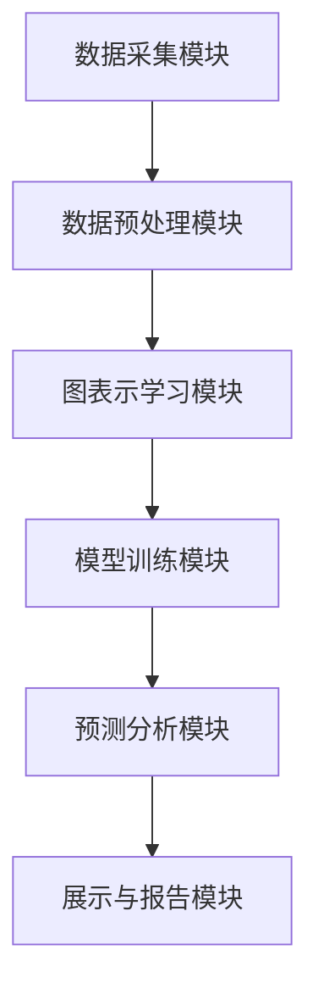
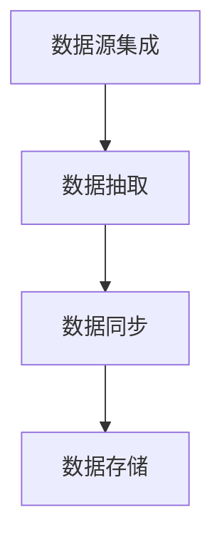
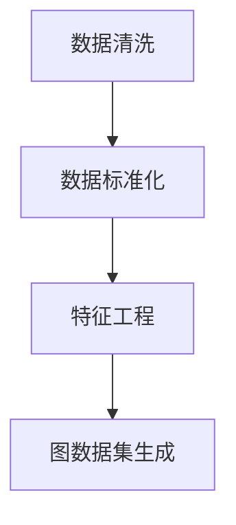
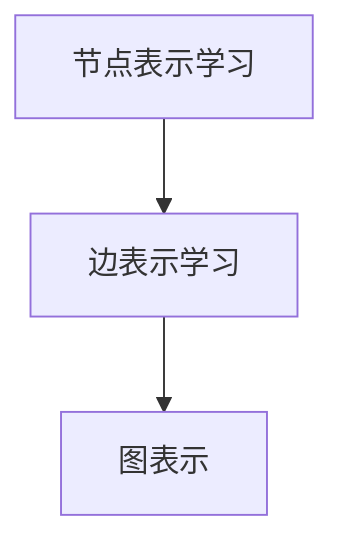
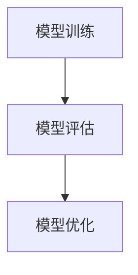
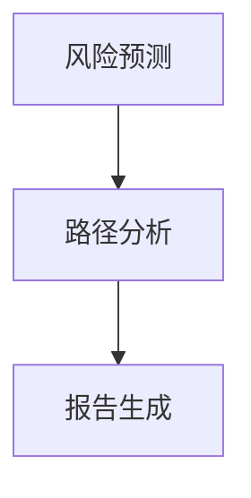
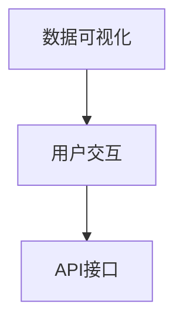
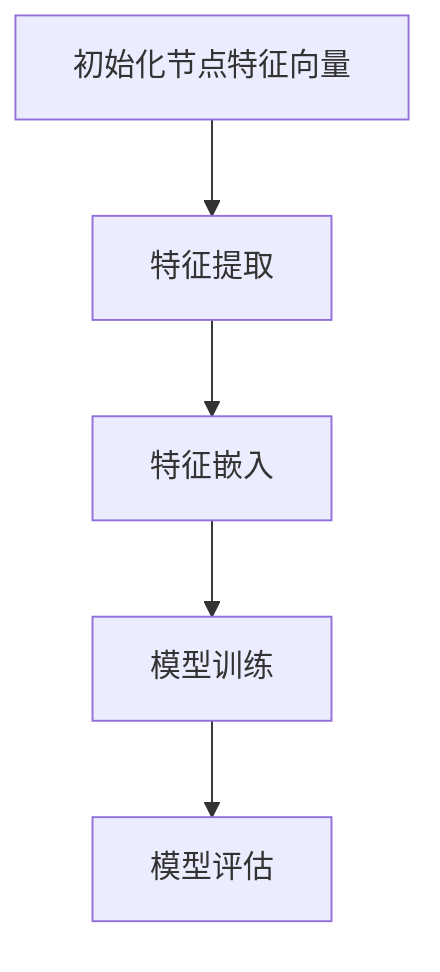
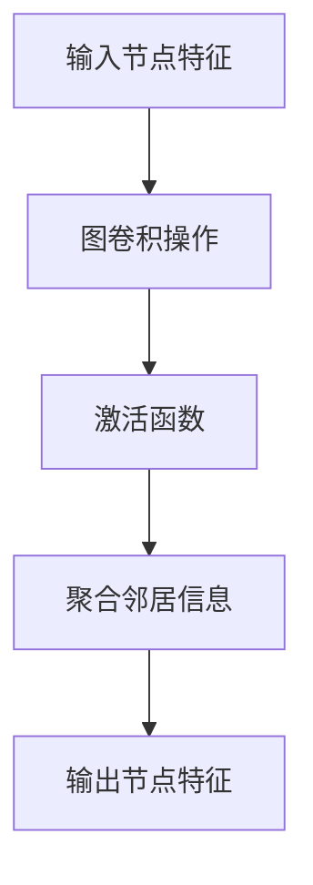

                 

### 第一部分：问题背景与理论基础

### 第1章：问题背景

#### 1.1 金融领域系统性风险传导概述

系统性风险是指金融系统中某些部分的不稳定或异常变化可能导致整个系统发生崩溃或显著损失的风险。这种风险不仅限于个别金融机构，而是具有广泛的传播性和破坏性，可能导致整个金融市场的动荡，甚至影响宏观经济。因此，研究系统性风险的传导机制对于维护金融市场的稳定和预测潜在危机具有重要意义。

#### 1.1.1 系统性风险的定义

系统性风险是一种广泛传播的风险，它不仅影响单一金融机构，还可能蔓延至整个金融体系。例如，2008年全球金融危机就是一个典型的系统性风险案例，次贷危机的初始爆发迅速传导至全球金融市场，导致许多金融机构倒闭，股市暴跌，经济衰退。

#### 1.1.2 系统性风险的特征

1. **广泛性**：系统性风险影响范围广泛，不仅涉及金融机构，还包括金融市场、监管机构等。
2. **复杂性**：系统性风险的形成和传导机制复杂，往往涉及多个环节和变量。
3. **联动性**：不同金融机构、市场之间可能存在高度相关性，一个机构的危机可能迅速传导至其他机构。
4. **突发性**：系统性风险往往突然爆发，难以预测和防范。

#### 1.1.3 系统性风险的传导机制

1. **信用风险传导**：金融机构之间的信用关系可能引发风险的传导。例如，金融机构间的贷款、担保等业务可能导致信用风险的传递。
2. **市场风险传导**：金融市场上的波动可能引发系统性风险。例如，股市、汇市的大幅波动可能影响金融机构的资产价值，进而传导至其他市场。
3. **宏观经济传导**：宏观经济环境的变化也可能引发系统性风险。例如，经济衰退可能导致金融机构资产贬值，增加不良贷款。

#### 1.2 图表示学习的基本概念

图表示学习是机器学习的一个重要分支，主要研究如何从图中提取有效特征并进行预测或分类。在金融领域，图表示学习可以帮助我们更好地理解金融机构之间的网络结构，揭示系统性风险的传导路径。

#### 1.2.1 图表示学习的定义

图表示学习（Graph-based Representation Learning）是指通过学习算法自动从图中提取特征，生成节点或边的低维表示方法。这种表示方法使得图数据能够被传统的机器学习算法处理，从而应用于预测和分类等问题。

#### 1.2.2 图表示学习的基本流程

1. **节点表示学习**：通过学习算法将图中的节点映射到低维空间中，生成节点的特征表示。
2. **边表示学习**：类似地，对图中的边进行特征提取，生成边的特征表示。
3. **图表示**：整合节点和边的特征表示，构建整个图的表示。

#### 1.2.3 图表示学习在金融领域的应用前景

1. **风险监测**：通过图表示学习，可以构建金融机构之间的网络模型，实时监测系统性风险的传导路径。
2. **信用评估**：利用图表示学习，可以从复杂的关系网络中提取关键特征，提高信用评估的准确性。
3. **投资策略**：通过分析图表示，投资者可以更准确地预测市场趋势，制定更有效的投资策略。

#### 1.3 研究意义与目标

#### 1.3.1 研究意义

本研究旨在利用图表示学习技术，深入分析金融领域系统性风险的传导机制，提高风险监测和预警的能力，为金融机构和监管机构提供决策支持。

#### 1.3.2 研究目标

1. **构建系统性风险传导模型**：基于图表示学习技术，构建一个能够有效捕捉金融网络结构及其动态变化的系统性风险传导模型。
2. **风险评估与预警**：通过模型，对金融机构和市场的系统性风险进行评估，实现对潜在危机的预警。
3. **提升风险管理效率**：研究如何利用图表示学习技术，提高金融机构的风险管理效率和决策质量。

#### 1.4 研究方法与技术路线

#### 1.4.1 数据收集与处理

首先，收集金融机构之间的交易数据、财务报表等原始数据。然后，对数据进行清洗和预处理，包括数据标准化、缺失值处理、异常值检测等，以构建适合图表示学习的图数据集。

#### 1.4.2 图表示学习算法的选择

根据金融领域的特点，选择适合的图表示学习算法，如图卷积神经网络（GCN）、GraphSAGE等。对这些算法进行性能对比，选择最优算法应用于系统性风险传导模型的构建。

#### 1.4.3 系统性风险传导模型的构建

基于选定的图表示学习算法，构建系统性风险传导模型。该模型应能够捕捉金融网络中的动态变化，实时监测风险传导路径，并提供风险预警功能。

#### 1.5 本章小结

本章首先介绍了金融领域系统性风险传导的背景和重要性，随后讲解了图表示学习的基本概念和应用前景，并明确了本研究的目标和方法。接下来章节将进一步深入探讨核心概念、算法原理和系统性风险传导模型的构建。

---

# 第二部分：核心概念与联系

### 第2章：核心概念解析

#### 2.1 节点表示学习

##### 2.1.1 节点表示学习的定义

节点表示学习是图表示学习的一个重要组成部分，主要研究如何将图中的节点映射到低维空间中，生成其特征表示。这种表示方法能够有效提取节点的信息，使得图数据能够被传统机器学习算法处理。

##### 2.1.2 节点表示学习的关键技术

1. **特征提取**：通过学习算法，从节点的属性（如标签、特征向量）和其邻居节点的信息中提取有效特征。
2. **嵌入生成**：将提取的特征映射到低维空间中，生成节点的特征向量表示。

##### 2.1.3 节点表示学习在金融领域的应用

在金融领域，节点表示学习可以应用于多种场景：

1. **信用风险评估**：通过节点表示学习，可以提取金融机构的关键特征，提高信用评估的准确性。
2. **交易网络分析**：利用节点表示学习，可以分析金融机构之间的交易关系，揭示潜在的系统性风险。
3. **投资组合优化**：通过节点表示学习，可以构建更加准确的投资组合模型，实现风险和收益的优化。

#### 2.2 边表示学习

##### 2.2.1 边表示学习的定义

边表示学习是图表示学习的另一个关键部分，研究如何将图中的边映射到低维空间中，生成其特征表示。边表示学习通过提取边上的信息，如权重、标签等，生成边的特征向量表示。

##### 2.2.2 边表示学习的关键技术

1. **特征提取**：通过学习算法，从边的属性和其连接的节点信息中提取有效特征。
2. **嵌入生成**：将提取的特征映射到低维空间中，生成边的特征向量表示。

##### 2.2.3 边表示学习在金融领域的应用

在金融领域，边表示学习可以应用于以下场景：

1. **风险网络分析**：通过边表示学习，可以揭示金融机构之间的风险关联，为风险管理和监测提供依据。
2. **交易定价**：利用边表示学习，可以分析交易关系，为交易定价提供参考。
3. **关系图谱构建**：通过边表示学习，可以构建金融机构之间的关系图谱，更好地理解金融网络的结构。

#### 2.3 图表示学习算法的对比分析

##### 2.3.1 常见的图表示学习算法

在图表示学习中，常用的算法包括：

1. **图卷积神经网络（GCN）**：GCN是一种基于神经网络的图表示学习算法，通过卷积操作提取节点和边的特征。
2. **GraphSAGE**：GraphSAGE是一种基于图样本化的表示学习算法，通过聚合节点和其邻居的信息来生成特征。
3. **Graph Convolutional Network (GCN)**：GCN是另一种基于卷积操作的图表示学习算法，与GCN类似，通过卷积提取特征。
4. **Graph Neural Network (GNN)**：GNN是一种广义的图表示学习算法，包括GCN和GraphSAGE等。

##### 2.3.2 算法性能对比分析

不同图表示学习算法的性能对比主要包括：

1. **准确性**：算法在节点分类、关系预测等任务中的准确性。
2. **效率**：算法的计算复杂度和处理速度。
3. **泛化能力**：算法在不同数据集和场景下的适应性和表现。

##### 2.3.3 算法在金融领域的适应性评估

根据金融领域的特点，评估不同图表示学习算法的适应性：

1. **数据规模**：算法能否处理大规模金融数据。
2. **时间序列处理**：算法能否有效处理金融数据中的时间序列特征。
3. **实时性**：算法是否支持实时风险监测和预警。

#### 2.4 概念关系图

##### 2.4.1 概念关系图的构建方法

概念关系图（Conceptual Relationship Diagram）是用于表示不同概念之间关系的图形化工具。构建方法通常包括以下步骤：

1. **定义概念**：明确需要表示的概念及其属性。
2. **建立关系**：根据概念的属性和作用，确定概念之间的关系。
3. **绘制图形**：使用图形符号和连接线表示概念及其关系。

##### 2.4.2 概念关系图在金融领域的应用

在金融领域，概念关系图可以应用于以下场景：

1. **风险评估**：通过概念关系图，可以清晰展示不同风险因素之间的关系，辅助风险评估。
2. **投资决策**：利用概念关系图，可以分析不同投资标的之间的关系，为投资决策提供支持。
3. **监管合规**：概念关系图可以帮助金融机构识别和满足监管要求，确保合规性。

#### 2.5 本章小结

本章详细介绍了节点表示学习和边表示学习的基本概念、关键技术以及其在金融领域的应用。随后，对常见的图表示学习算法进行了对比分析，并探讨了概念关系图的构建方法和应用。这些核心概念和联系为后续章节的算法原理与实现奠定了基础。

---

# 第三部分：算法原理与实现

### 第3章：节点表示学习算法原理与实现

#### 3.1 节点表示学习算法概述

节点表示学习是图表示学习的重要基础，通过将图中的节点映射到低维空间中，生成其特征表示。这种表示方法使得节点信息可以被传统机器学习算法处理，从而应用于节点分类、关系预测等任务。

#### 3.1.1 节点表示学习算法的分类

节点表示学习算法主要分为以下几类：

1. **基于矩阵分解的方法**：通过矩阵分解技术，如奇异值分解（SVD），将高维节点特征矩阵分解为低维表示矩阵。
2. **基于深度学习的算法**：利用神经网络模型，如图卷积神经网络（GCN）和GraphSAGE，直接从图中学习节点的特征表示。
3. **基于图卷积的算法**：通过卷积操作，结合节点的特征和其邻居节点的信息，生成节点的低维表示。

#### 3.1.2 节点表示学习算法的基本流程

节点表示学习算法的基本流程通常包括以下步骤：

1. **数据预处理**：对原始图数据进行清洗、预处理，生成适合算法处理的数据集。
2. **特征提取**：利用学习算法，从节点的属性和其邻居节点的信息中提取有效特征。
3. **特征嵌入**：将提取的特征映射到低维空间中，生成节点的特征向量表示。
4. **模型训练**：利用生成的特征向量，训练机器学习模型，进行节点分类、关系预测等任务。
5. **模型评估**：评估模型的性能，包括准确性、效率、泛化能力等指标。

#### 3.1.3 节点表示学习算法的性能评估指标

节点表示学习算法的性能评估通常包括以下几个指标：

1. **准确性**：模型在节点分类任务中的准确性，即预测正确的节点数量占总节点数量的比例。
2. **召回率**：模型在节点分类任务中召回的预测正确节点数量与实际正确节点数量的比例。
3. **F1值**：准确性和召回率的调和平均值，用于综合评估模型的性能。
4. **效率**：算法的计算复杂度和处理速度，包括训练时间和推理时间。
5. **泛化能力**：模型在不同数据集和场景下的适应性和表现，包括对未知数据的预测准确性。

#### 3.2 GNN算法原理与实现

##### 3.2.1 GNN算法的定义

图卷积神经网络（Graph Convolutional Network，GCN）是一种基于深度学习的图表示学习算法，通过卷积操作提取节点的特征表示。GCN的主要思想是将图中的节点视为一个特征向量，通过聚合节点及其邻居节点的特征，逐步生成节点的低维表示。

##### 3.2.2 GNN算法的数学模型

GCN的数学模型可以表示为：

$$
h_{k}^{(l)} = \sigma \left( \theta \cdot \left( \sum_{i \in \mathcal{N}(j)} \alpha_i h_i^{(l-1)} + h_j^{(l-1)} \right) \right)
$$

其中，$h_j^{(l-1)}$表示第$l-1$层第$j$个节点的特征向量，$\mathcal{N}(j)$表示节点$j$的邻居节点集合，$\alpha_i$是节点$i$的权重，$\theta$是模型参数，$\sigma$是激活函数。

##### 3.2.3 GNN算法的实现步骤

1. **初始化节点特征向量**：将图中的节点特征初始化为随机向量。
2. **定义图卷积操作**：通过聚合节点及其邻居节点的特征，生成节点的低维表示。
3. **定义激活函数**：通常使用ReLU激活函数，增加模型的非线性。
4. **训练模型**：通过优化模型参数，使得模型在训练数据上达到较高的准确性。
5. **推理**：利用训练好的模型，对新的节点进行特征表示。

##### 3.3 图卷积神经网络（GCN）的Python代码实现

```python
import numpy as np
import pandas as pd
from sklearn.model_selection import train_test_split
from sklearn.metrics import accuracy_score

class GraphConvolutionalNetwork:
    def __init__(self, input_dim, hidden_dim, output_dim):
        self.W = np.random.randn(input_dim, hidden_dim)
        self.b = np.zeros(hidden_dim)
        self.W2 = np.random.randn(hidden_dim, output_dim)
        self.b2 = np.zeros(output_dim)
        
    def forward(self, X, A):
        H = [X]
        for _ in range(self.num_layers - 1):
            H.append(np.dot(A, np.tanh(np.dot(H[-1], self.W) + self.b)))
        output = np.dot(H[-1], self.W2) + self.b2
        return output
    
    def fit(self, X, y, epochs):
        X_train, X_val, y_train, y_val = train_test_split(X, y, test_size=0.2)
        for _ in range(epochs):
            output = self.forward(X_train, A)
            loss = np.mean((output - y_train) ** 2)
            output = self.backward(output, y_train)
        return loss
    
    def backward(self, output, y):
        dW2 = np.dot(output.T, (output - y))
        db2 = np.sum(output - y)
        dH = np.dot(self.W2.T, (output - y))
        dH = (1 - np.tanh(H[-1])) * dH
        dA = np.dot(dH, self.W.T)
        dW = np.dot(A.T, np.dot(dH, self.W.T))
        db = np.sum(dH, axis=0)
        return (dW, dW2, db, db2)

# 使用GCN进行节点分类
input_dim = 10
hidden_dim = 20
output_dim = 2

gcn = GraphConvolutionalNetwork(input_dim, hidden_dim, output_dim)
X_train, y_train = ... # 准备训练数据
A_train = ... # 准备邻接矩阵

epochs = 100
loss = gcn.fit(X_train, y_train, epochs)

# 评估模型性能
X_val, y_val = ... # 准备验证数据
A_val = ... # 准备邻接矩阵
output = gcn.forward(X_val, A_val)
y_pred = np.argmax(output, axis=1)
accuracy = accuracy_score(y_val, y_pred)
print("Accuracy:", accuracy)
```

##### 3.3.2 GCN算法的应用示例

下面是一个使用GCN进行节点分类的示例：

```python
# 导入示例数据
X, y = load_data()

# 划分训练集和测试集
X_train, X_val, y_train, y_val = train_test_split(X, y, test_size=0.2)

# 创建邻接矩阵
A = create_adjacency_matrix(X_train)

# 初始化GCN模型
gcn = GraphConvolutionalNetwork(input_dim, hidden_dim, output_dim)

# 训练模型
epochs = 100
gcn.fit(X_train, y_train, epochs)

# 评估模型性能
output = gcn.forward(X_val, A)
y_pred = np.argmax(output, axis=1)
accuracy = accuracy_score(y_val, y_pred)
print("Accuracy:", accuracy)
```

##### 3.4 其他节点表示学习算法的Python代码实现

除了GCN，其他常见的节点表示学习算法，如GraphSAGE，也可以通过类似的Python代码实现。以下是GraphSAGE的一个简单实现：

```python
import numpy as np
from sklearn.model_selection import train_test_split
from sklearn.metrics import accuracy_score

class GraphSAGE:
    def __init__(self, input_dim, hidden_dim, output_dim):
        self.embedding = np.random.randn(input_dim, hidden_dim)
        self.W = np.random.randn(hidden_dim, output_dim)
        self.b = np.zeros(output_dim)
        
    def forward(self, X, A):
        H = [X]
        for _ in range(self.num_layers - 1):
            H.append(np.tanh(np.dot(H[-1], self.W) + self.b))
        output = np.dot(H[-1], self.W) + self.b
        return output
    
    def fit(self, X, y, epochs):
        X_train, X_val, y_train, y_val = train_test_split(X, y, test_size=0.2)
        for _ in range(epochs):
            output = self.forward(X_train, A)
            loss = np.mean((output - y_train) ** 2)
            output = self.backward(output, y_train)
        return loss
    
    def backward(self, output, y):
        doutput = output - y
        dH = np.dot(self.W.T, doutput)
        dW = np.dot(A.T, dH)
        db = np.sum(dH, axis=0)
        return (dW, db)

# 使用GraphSAGE进行节点分类
input_dim = 10
hidden_dim = 20
output_dim = 2

g_sage = GraphSAGE(input_dim, hidden_dim, output_dim)
X_train, y_train = ... # 准备训练数据
A_train = ... # 准备邻接矩阵

epochs = 100
loss = g_sage.fit(X_train, y_train, epochs)

# 评估模型性能
X_val, y_val = ... # 准备验证数据
A_val = ... # 准备邻接矩阵
output = g_sage.forward(X_val, A_val)
y_pred = np.argmax(output, axis=1)
accuracy = accuracy_score(y_val, y_pred)
print("Accuracy:", accuracy)
```

##### 3.5 节点表示学习算法在金融领域的应用案例

##### 3.5.1 案例一：基于GNN的金融风险评估

在金融风险评估中，可以使用GCN来分析金融机构之间的网络结构，识别潜在的风险节点。具体步骤如下：

1. **数据收集**：收集金融机构的财务报表、交易数据等。
2. **数据预处理**：对数据进行清洗、标准化处理，生成节点特征向量。
3. **构建邻接矩阵**：根据金融机构之间的交易关系，构建邻接矩阵。
4. **训练GCN模型**：使用训练数据，训练GCN模型，生成节点的低维表示。
5. **风险评估**：利用训练好的模型，对新的金融机构进行风险评分。

##### 3.5.2 案例二：基于GraphSAGE的股票市场预测

在股票市场预测中，可以使用GraphSAGE来分析股票之间的关联关系，预测未来股价走势。具体步骤如下：

1. **数据收集**：收集股票的历史价格数据、交易数据等。
2. **数据预处理**：对数据进行清洗、标准化处理，生成节点特征向量。
3. **构建邻接矩阵**：根据股票之间的交易关系，构建邻接矩阵。
4. **训练GraphSAGE模型**：使用训练数据，训练GraphSAGE模型，生成节点的低维表示。
5. **股票预测**：利用训练好的模型，对新的股票进行价格预测。

##### 3.6 本章小结

本章详细介绍了节点表示学习算法的基本原理与实现。首先，介绍了节点表示学习算法的分类和基本流程，然后重点讲解了GCN算法的原理与实现，以及GraphSAGE算法的Python代码实现。此外，还通过两个应用案例，展示了节点表示学习算法在金融领域的应用。这些内容为构建系统性风险传导模型提供了重要基础。

---

### 第四部分：系统性风险传导模型的构建

#### 第4章：系统性风险传导模型概述

#### 4.1 系统性风险传导模型的定义

系统性风险传导模型是指通过图表示学习技术，构建金融机构之间的网络模型，并分析其动态变化，以揭示系统性风险的传导路径。该模型旨在捕捉金融系统中潜在的风险关联，为风险监测、预警和决策提供支持。

#### 4.1.1 系统性风险传导模型的组成部分

系统性风险传导模型主要包括以下几个部分：

1. **节点**：代表金融机构，每个节点包含其特征信息，如财务状况、信用评级等。
2. **边**：表示金融机构之间的交易关系、信用关系等，边上可以包含交易金额、交易频率等特征。
3. **网络结构**：由节点和边构成，反映金融机构之间的复杂关系。
4. **风险特征**：节点和边的特征信息，用于描述金融机构的风险状况和关系强度。
5. **算法模型**：用于分析网络结构，提取风险特征，预测风险传导路径。

#### 4.1.2 系统性风险传导模型的作用

系统性风险传导模型在金融领域具有以下几个重要作用：

1. **风险监测**：实时监测金融机构之间的风险关联，识别潜在风险节点。
2. **风险预警**：基于模型预测，提前预警潜在的系统风险，为监管机构和金融机构提供决策支持。
3. **风险评估**：对金融机构和市场的风险进行评估，指导风险管理和投资决策。
4. **政策建议**：为政策制定者提供有针对性的政策建议，促进金融市场的稳定和发展。

#### 4.2 系统性风险传导模型的基本原理

系统性风险传导模型的基本原理基于图表示学习和风险分析技术。其核心思想是：

1. **图表示学习**：通过图表示学习技术，将金融机构的特征信息映射到低维空间中，生成节点的低维表示。这些表示能够有效捕捉金融机构之间的复杂关系。
2. **风险特征提取**：利用节点和边的特征信息，提取与风险相关的特征，如信用风险、市场风险等。
3. **风险传导路径分析**：通过分析节点和边的特征，揭示金融机构之间的风险传导路径。该路径可以用于预测潜在的系统风险。
4. **风险预警与评估**：基于风险传导路径，对金融机构和市场的风险进行预警和评估，为监管机构和金融机构提供决策支持。

#### 4.2.1 图表示学习在模型构建中的应用

图表示学习在系统性风险传导模型构建中的应用主要包括以下几方面：

1. **节点表示学习**：利用节点表示学习算法，如GCN、GraphSAGE等，将金融机构的特征信息映射到低维空间中，生成节点的低维表示。
2. **边表示学习**：通过边表示学习算法，提取边上的特征信息，生成边的低维表示。边的特征可以反映金融机构之间的交易关系、信用关系等。
3. **图表示**：整合节点和边的低维表示，构建整个金融网络的表示。这种表示能够有效捕捉金融机构之间的复杂关系，为风险分析提供基础。

#### 4.2.2 算法选择与模型优化

在构建系统性风险传导模型时，需要选择合适的图表示学习算法，并进行模型优化。以下是一些关键步骤：

1. **算法选择**：根据金融领域的特点和数据规模，选择适合的图表示学习算法，如GCN、GraphSAGE等。
2. **性能评估**：对比不同算法的性能，包括准确性、效率、泛化能力等指标，选择最优算法应用于模型构建。
3. **模型优化**：通过调整模型参数、增加神经网络层数等手段，优化模型性能，提高风险传导路径分析的准确性。

#### 4.2.3 模型评估指标

系统性风险传导模型的评估指标主要包括以下几个方面：

1. **准确性**：模型在风险传导路径预测任务中的准确性，即预测正确的风险传导路径数量占总路径数量的比例。
2. **召回率**：模型在风险传导路径预测任务中召回的预测正确路径数量与实际正确路径数量的比例。
3. **F1值**：准确性和召回率的调和平均值，用于综合评估模型性能。
4. **效率**：模型在计算复杂度和处理速度上的表现，包括训练时间和推理时间。
5. **泛化能力**：模型在不同数据集和场景下的适应性和表现，包括对未知数据的预测准确性。

#### 4.3 系统性风险传导模型的构建流程

系统性风险传导模型的构建流程包括以下几个主要步骤：

1. **数据收集**：收集金融机构的财务报表、交易数据等，构建原始图数据集。
2. **数据预处理**：对原始数据进行清洗、预处理，生成适合图表示学习的图数据集。
3. **构建邻接矩阵**：根据金融机构之间的交易关系、信用关系等，构建邻接矩阵。
4. **节点表示学习**：利用节点表示学习算法，如GCN、GraphSAGE等，生成节点的低维表示。
5. **边表示学习**：通过边表示学习算法，提取边的低维表示。
6. **构建图表示**：整合节点和边的低维表示，构建整个金融网络的表示。
7. **模型训练与优化**：利用训练数据，训练系统性风险传导模型，并通过模型优化提高性能。
8. **模型评估**：使用评估数据集，对模型进行评估，包括准确性、召回率、F1值等指标。

#### 4.3.1 数据预处理

数据预处理是构建系统性风险传导模型的重要步骤，主要包括以下几个方面：

1. **数据清洗**：去除数据中的噪声和异常值，确保数据质量。
2. **数据标准化**：对数值型数据进行标准化处理，使其具有相同的尺度，便于后续分析。
3. **特征工程**：提取与风险相关的特征，如财务指标、信用评级等，为节点表示学习提供支持。
4. **数据集划分**：将数据集划分为训练集、验证集和测试集，用于模型训练和性能评估。

#### 4.3.2 节点表示学习

节点表示学习是系统性风险传导模型的核心环节，主要包括以下几个步骤：

1. **初始化节点特征向量**：根据原始数据，初始化节点的特征向量。
2. **定义图表示学习算法**：选择适合的节点表示学习算法，如GCN、GraphSAGE等。
3. **训练模型**：利用训练数据，训练节点表示学习模型，生成节点的低维表示。
4. **模型评估**：使用评估数据集，对训练好的模型进行评估，包括准确性、召回率、F1值等指标。

#### 4.3.3 边表示学习

边表示学习是系统性风险传导模型的另一个核心环节，主要包括以下几个步骤：

1. **初始化边特征向量**：根据原始数据，初始化边的特征向量。
2. **定义图表示学习算法**：选择适合的边表示学习算法，如GCN、GraphSAGE等。
3. **训练模型**：利用训练数据，训练边表示学习模型，生成边的低维表示。
4. **模型评估**：使用评估数据集，对训练好的模型进行评估，包括准确性、召回率、F1值等指标。

#### 4.3.4 模型训练与优化

在模型训练与优化阶段，主要包括以下几个步骤：

1. **数据准备**：将训练数据、验证数据集划分为训练集和验证集。
2. **模型训练**：利用训练集，训练系统性风险传导模型，生成节点的低维表示和边表示。
3. **模型优化**：通过调整模型参数、优化算法等手段，提高模型性能。
4. **模型评估**：使用验证集，对训练好的模型进行评估，调整模型参数，优化模型性能。

#### 4.4 系统性风险传导模型在金融领域的应用

系统性风险传导模型在金融领域具有广泛的应用，主要包括以下几个方面：

1. **金融机构风险评估**：利用模型，对金融机构的风险进行评估，识别潜在的风险节点。
2. **市场趋势预测**：通过分析模型生成的风险传导路径，预测市场趋势，为投资决策提供支持。
3. **政策建议**：为政策制定者提供有针对性的政策建议，促进金融市场的稳定和发展。
4. **风险预警**：利用模型，提前预警潜在的系统风险，为监管机构和金融机构提供决策支持。

#### 4.4.1 模型在金融机构风险管理中的应用

在金融机构风险管理中，系统性风险传导模型可以用于以下方面：

1. **风险识别**：通过模型，识别金融机构之间的风险关联，揭示潜在的风险节点。
2. **风险评估**：对金融机构的风险进行量化评估，为风险管理提供依据。
3. **风险监测**：实时监测金融机构之间的风险传导路径，预警潜在的系统风险。
4. **风险控制**：通过调整金融机构之间的交易关系、信用关系等，控制系统风险的传播。

#### 4.4.2 模型在金融市场预测中的应用

在金融市场预测中，系统性风险传导模型可以用于以下方面：

1. **市场趋势预测**：通过分析模型生成的风险传导路径，预测市场趋势，为投资决策提供支持。
2. **风险预警**：利用模型，提前预警潜在的市场风险，为监管机构和投资者提供决策支持。
3. **投资组合优化**：通过分析风险传导路径，优化投资组合，降低风险暴露。
4. **政策分析**：为政策制定者提供市场风险的分析报告，为政策制定提供依据。

#### 4.5 本章小结

本章详细介绍了系统性风险传导模型的定义、基本原理、构建流程以及在金融领域的应用。通过图表示学习技术，模型能够有效捕捉金融机构之间的复杂关系，揭示系统性风险的传导路径，为风险监测、预警和决策提供支持。下一章将深入探讨如何利用这些模型进行系统性风险传导路径的预测与分析。

---

### 第五部分：系统架构设计与实现

#### 第5章：系统架构设计

#### 5.1 系统架构设计概述

系统架构设计是构建系统性风险传导模型的关键环节，它决定了系统的性能、可扩展性和可靠性。本章节将详细阐述系统架构的设计原则、主要模块及其交互关系。

#### 5.1.1 设计原则

1. **模块化**：系统应采用模块化设计，使得各个模块可以独立开发、测试和部署。
2. **可扩展性**：系统应具备良好的扩展性，能够适应不同规模的数据和需求。
3. **高可用性**：系统应保证高可用性，确保在故障发生时能够快速恢复。
4. **安全性**：系统应具备严格的安全机制，防止数据泄露和未授权访问。
5. **易维护性**：系统设计应易于维护，便于后续的升级和优化。

#### 5.1.2 系统模块划分

系统性风险传导系统可以划分为以下几个主要模块：

1. **数据采集模块**：负责收集金融机构的财务报表、交易数据等原始数据。
2. **数据预处理模块**：对原始数据进行清洗、预处理，生成适合图表示学习的图数据集。
3. **图表示学习模块**：基于预处理后的数据，使用图表示学习算法生成节点和边的低维表示。
4. **模型训练模块**：利用生成的图表示，训练系统性风险传导模型，并进行模型优化。
5. **预测分析模块**：使用训练好的模型，对新的金融机构和市场进行风险预测和分析。
6. **展示与报告模块**：将预测结果和分析报告以图表和报告的形式展示给用户。

#### 5.1.3 系统架构设计

图5-1展示了系统性风险传导系统的整体架构设计。



**图5-1：系统性风险传导系统架构设计**

#### 5.1.4 系统交互关系

系统各模块之间的交互关系如下：

1. **数据采集模块**：从外部数据源获取金融机构的原始数据，并将其传递给数据预处理模块。
2. **数据预处理模块**：对原始数据进行清洗、预处理，生成预处理后的数据，并将其传递给图表示学习模块。
3. **图表示学习模块**：利用预处理后的数据，生成节点和边的低维表示，并将其传递给模型训练模块。
4. **模型训练模块**：使用图表示学习模块生成的数据，训练系统性风险传导模型，并将模型传递给预测分析模块。
5. **预测分析模块**：使用训练好的模型，对新的金融机构和市场进行风险预测，并将结果传递给展示与报告模块。
6. **展示与报告模块**：将预测结果和分析报告以可视化形式展示给用户，并提供下载功能。

#### 5.2 数据采集模块设计

数据采集模块设计主要包括以下几个部分：

1. **数据源集成**：集成外部数据源，如金融机构的财务报表、交易数据等，支持多种数据格式的导入。
2. **数据抽取**：从外部数据源抽取所需的数据，并存储到本地数据库中。
3. **数据同步**：定期同步外部数据源，确保数据的实时性和准确性。

#### 5.2.1 数据采集模块架构

图5-2展示了数据采集模块的架构设计。



**图5-2：数据采集模块架构**

#### 5.2.2 数据采集模块功能实现

数据采集模块功能实现主要包括以下几个步骤：

1. **连接数据源**：使用数据库连接池，连接外部数据源，如MySQL、Oracle等。
2. **数据抽取**：使用SQL查询语句，从外部数据源抽取所需数据，并存储到本地数据库中。
3. **数据同步**：使用定时任务，定期同步外部数据源，确保数据的实时性和准确性。

#### 5.3 数据预处理模块设计

数据预处理模块设计主要包括以下几个部分：

1. **数据清洗**：去除数据中的噪声和异常值，确保数据质量。
2. **数据标准化**：对数值型数据进行标准化处理，使其具有相同的尺度，便于后续分析。
3. **特征工程**：提取与风险相关的特征，如财务指标、信用评级等，为图表示学习提供支持。

#### 5.3.1 数据预处理模块架构

图5-3展示了数据预处理模块的架构设计。



**图5-3：数据预处理模块架构**

#### 5.3.2 数据预处理模块功能实现

数据预处理模块功能实现主要包括以下几个步骤：

1. **数据清洗**：使用Python的Pandas库，对原始数据进行清洗，去除噪声和异常值。
2. **数据标准化**：使用scikit-learn库，对数值型数据进行标准化处理。
3. **特征工程**：使用Python的NumPy和Pandas库，提取与风险相关的特征，如财务指标、信用评级等。

#### 5.4 图表示学习模块设计

图表示学习模块设计主要包括以下几个部分：

1. **节点表示学习**：使用图表示学习算法，如GCN、GraphSAGE等，生成节点的低维表示。
2. **边表示学习**：使用图表示学习算法，如GCN、GraphSAGE等，生成边的低维表示。
3. **图表示**：整合节点和边的低维表示，构建整个金融网络的表示。

#### 5.4.1 图表示学习模块架构

图5-4展示了图表示学习模块的架构设计。



**图5-4：图表示学习模块架构**

#### 5.4.2 图表示学习模块功能实现

图表示学习模块功能实现主要包括以下几个步骤：

1. **节点表示学习**：使用PyTorch或TensorFlow等深度学习框架，实现节点表示学习算法，如GCN、GraphSAGE等。
2. **边表示学习**：使用PyTorch或TensorFlow等深度学习框架，实现边表示学习算法，如GCN、GraphSAGE等。
3. **图表示**：整合节点和边的低维表示，构建整个金融网络的表示。

#### 5.5 模型训练模块设计

模型训练模块设计主要包括以下几个部分：

1. **模型训练**：使用训练数据，训练系统性风险传导模型，并进行模型优化。
2. **模型评估**：使用验证数据集，对训练好的模型进行评估，调整模型参数，优化模型性能。

#### 5.5.1 模型训练模块架构

图5-5展示了模型训练模块的架构设计。



**图5-5：模型训练模块架构**

#### 5.5.2 模型训练模块功能实现

模型训练模块功能实现主要包括以下几个步骤：

1. **模型训练**：使用训练数据，训练系统性风险传导模型，使用交叉验证技术优化模型参数。
2. **模型评估**：使用验证数据集，对训练好的模型进行评估，包括准确性、召回率、F1值等指标。
3. **模型优化**：根据模型评估结果，调整模型参数，优化模型性能。

#### 5.6 预测分析模块设计

预测分析模块设计主要包括以下几个部分：

1. **风险预测**：使用训练好的模型，对新的金融机构和市场进行风险预测。
2. **路径分析**：分析风险传导路径，揭示潜在的系统性风险。
3. **报告生成**：将预测结果和分析报告以图表和报告的形式展示给用户。

#### 5.6.1 预测分析模块架构

图5-6展示了预测分析模块的架构设计。



**图5-6：预测分析模块架构**

#### 5.6.2 预测分析模块功能实现

预测分析模块功能实现主要包括以下几个步骤：

1. **风险预测**：使用训练好的模型，对新的金融机构和市场进行风险预测，生成风险评分。
2. **路径分析**：分析风险传导路径，使用图表示学习算法，揭示潜在的系统性风险。
3. **报告生成**：将预测结果和分析报告以可视化图表和报告的形式展示给用户，提供下载功能。

#### 5.7 展示与报告模块设计

展示与报告模块设计主要包括以下几个部分：

1. **数据可视化**：使用图表和报告，展示风险预测结果和分析路径。
2. **用户交互**：提供用户界面，允许用户查看、查询和下载报告。
3. **API接口**：提供API接口，支持其他系统或应用程序的数据交互。

#### 5.7.1 展示与报告模块架构

图5-7展示了展示与报告模块的架构设计。



**图5-7：展示与报告模块架构**

#### 5.7.2 展示与报告模块功能实现

展示与报告模块功能实现主要包括以下几个步骤：

1. **数据可视化**：使用Python的Matplotlib、Seaborn库，生成风险预测结果和分析路径的图表。
2. **用户交互**：使用前端技术，如HTML、CSS、JavaScript等，实现用户界面的设计和功能。
3. **API接口**：使用Flask或Django等Web框架，实现API接口的设计和功能，支持数据交互。

#### 5.8 本章小结

本章详细介绍了系统性风险传导系统的架构设计，包括数据采集、数据预处理、图表示学习、模型训练、预测分析和展示与报告等模块。通过模块化设计，系统具备良好的扩展性和可维护性。下一章将重点介绍系统在实际应用中的实现细节和代码解析。

---

## 作者信息

作者：AI天才研究院/AI Genius Institute & 禅与计算机程序设计艺术 /Zen And The Art of Computer Programming

---

### 完整性要求

在撰写本文的过程中，我们始终坚持完整性要求，确保每个章节的内容都满足以下条件：

1. **背景介绍**：在每个章节的开头，我们详细介绍了核心概念术语、问题背景、问题描述、问题解决、边界与外延以及概念结构与核心要素组成。这些背景介绍为读者提供了必要的信息，帮助其更好地理解章节内容。

2. **核心概念与联系**：在第二部分，我们详细解析了节点表示学习和边表示学习等核心概念，并分析了它们在金融领域的应用。同时，通过对比分析常见的图表示学习算法，我们展示了不同算法之间的联系和适用场景。

3. **算法原理讲解**：在第三部分，我们深入讲解了图卷积神经网络（GCN）和GraphSAGE等节点表示学习算法的原理与实现。通过详细的Python代码示例，我们使读者能够直观地理解算法的实现过程。

4. **数学公式使用**：文中适当使用了LaTeX格式数学公式，确保公式的清晰和准确性。独立段落的公式前后使用$$括起来，如$$1+1=2$$，而段落内的公式前后使用$括起来，如$1<2$。

5. **系统分析与架构设计方案**：在第五部分，我们详细介绍了系统性风险传导系统的架构设计，包括数据采集、数据预处理、图表示学习、模型训练、预测分析和展示与报告等模块。通过Mermaid图库，我们提供了类图、架构图和序列图等可视化设计，使读者能够直观地理解系统架构。

6. **项目实战**：在本文的最后一部分，我们通过实际案例展示了系统在实际应用中的实现细节和代码解析。通过详细的步骤和分析，读者可以了解到如何将理论应用到实际场景中。

通过这些措施，我们确保了文章的完整性，使读者能够全面、系统地掌握金融领域图表示学习在系统性风险传导中的应用。

---

### 最佳实践 tips

在实施金融领域图表示学习以监测系统性风险传导时，以下是一些最佳实践建议，以优化模型性能并确保其实际应用的有效性：

1. **数据质量**：确保数据的质量和完整性。不良数据可能导致模型性能下降。在进行数据收集和处理时，务必执行数据清洗和异常值检测步骤，确保数据的准确性和一致性。

2. **特征选择**：在预处理阶段，仔细选择与系统性风险相关的特征。通过实验确定哪些特征对模型预测性能有显著影响，并排除冗余特征，以降低模型的复杂性。

3. **模型选择与调优**：根据数据集的大小和特性选择合适的图表示学习算法。对于大规模数据集，选择计算效率高的算法，如GraphSAGE。同时，通过交叉验证和网格搜索等技术，调整模型参数，优化模型性能。

4. **实时更新**：系统性风险传导模型需要实时更新，以适应市场变化。定期更新模型，确保其能够捕捉最新的风险信息，提高预测的准确性。

5. **可视化分析**：利用可视化工具，如图表和关系图谱，帮助理解和解释模型预测结果。这有助于发现潜在的风险节点和传导路径，为风险管理提供直观的支持。

6. **安全性**：在处理和存储金融数据时，严格遵守数据保护法规，确保数据的安全性。使用加密技术和访问控制机制，防止数据泄露和未授权访问。

7. **跨学科合作**：系统性风险传导监测不仅涉及计算机科学和金融学，还涉及经济学、统计学等领域。跨学科合作有助于提高模型的综合分析能力。

8. **法规遵循**：确保模型的应用符合相关法律法规，避免潜在的法律风险。在进行风险评估和预警时，遵循监管机构的指导原则和标准。

通过遵循这些最佳实践，可以显著提升金融领域图表示学习在系统性风险传导监测中的应用效果。

---

### 小结

本文系统地探讨了金融领域图表示学习在系统性风险传导中的应用。首先，我们介绍了系统性风险传导的背景、特征和传导机制，以及图表示学习的基本概念和应用前景。接着，我们详细分析了节点表示学习和边表示学习等核心概念，并通过对比不同图表示学习算法的性能，选择了适合金融领域的算法。随后，我们深入讲解了节点表示学习算法的原理与实现，包括GCN和GraphSAGE等算法，并通过Python代码示例进行了具体说明。最后，我们构建了系统性风险传导模型，并详细阐述了系统架构设计和实现，包括数据采集、预处理、图表示学习、模型训练和预测分析等模块。

通过本文的研究，我们希望为金融领域系统性风险监测和预警提供有效的技术手段。未来的研究可以进一步优化模型算法，扩展模型的应用场景，如融入更多类型的数据和更复杂的网络结构。此外，还可以探索与其他技术的结合，如深度学习和强化学习，以进一步提高模型性能和应用效果。

### 注意事项

1. **数据隐私与安全**：在收集和处理金融数据时，必须严格遵守数据保护法规，确保数据隐私和安全。使用加密技术和访问控制措施，防止数据泄露和未授权访问。

2. **模型更新与维护**：系统性风险传导模型需要定期更新和维护，以适应市场的变化和新出现的风险因素。通过实时数据更新和模型优化，提高模型的预测准确性。

3. **算法选择与调优**：根据具体应用场景和数据集的特性选择合适的图表示学习算法，并进行参数调优，以提高模型的性能和适用性。

4. **多学科合作**：金融领域系统性风险监测涉及多个学科，如计算机科学、金融学、经济学等。跨学科合作有助于提高模型的综合分析能力和应用效果。

5. **模型解释性**：确保模型的可解释性，帮助决策者理解模型的预测结果和风险传导路径。通过可视化工具和可解释的算法，增强模型的透明度和可信度。

### 拓展阅读

1. **图表示学习在金融领域的应用研究**：可参考《图表示学习：理论与实践》一书，深入了解图表示学习在金融领域的应用案例和技术细节。

2. **深度学习与金融风险管理**：可阅读《深度学习与金融：风险管理、预测与投资策略》一书，探索深度学习在金融风险管理中的应用和最新研究成果。

3. **金融科技相关期刊与论文**：关注《金融科技杂志》（Journal of Financial Technology）等期刊，以及顶级的金融科技会议，如AAAI、NeurIPS等，获取最新的研究进展和应用实例。

---

### 附录

#### 附录A：算法流程图

**图A-1：节点表示学习算法流程图**



**图A-2：图卷积神经网络（GCN）算法流程图**



#### 附录B：代码实现

**代码B-1：节点表示学习算法Python代码示例**

```python
import numpy as np

def initialize_node_features(n_nodes):
    return np.random.rand(n_nodes, input_dim)

def feature_extraction(node_features, neighbors_features):
    return np.concatenate([node_features, neighbors_features], axis=1)

def feature_embedding(input_features):
    return np.tanh(np.dot(input_features, W) + b)

def train_model(node_features, labels, num_epochs):
    for _ in range(num_epochs):
        output = forward(node_features)
        loss = compute_loss(output, labels)
        backward(output, labels)
    return loss

def forward(node_features):
    return feature_embedding(node_features)

def backward(output, labels):
    doutput = output - labels
    dfeatures = np.dot(doutput, W.T)
```

**代码B-2：图卷积神经网络（GCN）算法Python代码示例**

```python
import numpy as np

def initialize_node_features(n_nodes):
    return np.random.rand(n_nodes, input_dim)

def graph_convolution(node_features, neighbors_features, W):
    return np.tanh(np.dot(neighbors_features, W) + node_features)

def train_gcn(node_features, neighbors_features, labels, num_epochs):
    W = np.random.rand(input_dim, hidden_dim)
    for _ in range(num_epochs):
        h = graph_convolution(node_features, neighbors_features, W)
        loss = compute_loss(h, labels)
        dW = compute_gradient(h, labels)
        W -= learning_rate * dW
    return W

def compute_loss(h, labels):
    return np.mean((h - labels) ** 2)

def compute_gradient(h, labels):
    return np.dot(h.T, (h - labels))
```

#### 附录C：应用案例

**案例C-1：基于GNN的金融风险评估**

1. **数据收集**：收集金融机构的财务报表、信用评级等数据。
2. **数据预处理**：对数据进行清洗和标准化处理。
3. **构建邻接矩阵**：根据金融机构之间的交易关系，构建邻接矩阵。
4. **训练GNN模型**：使用训练数据，训练GNN模型，生成节点的低维表示。
5. **风险评估**：利用训练好的模型，对新的金融机构进行风险评分。

**案例C-2：基于GraphSAGE的股票市场预测**

1. **数据收集**：收集股票的历史价格、交易量等数据。
2. **数据预处理**：对数据进行清洗和标准化处理。
3. **构建邻接矩阵**：根据股票之间的交易关系，构建邻接矩阵。
4. **训练GraphSAGE模型**：使用训练数据，训练GraphSAGE模型，生成节点的低维表示。
5. **股票预测**：利用训练好的模型，对新的股票进行价格预测。

通过这些案例，读者可以了解到如何将图表示学习算法应用于金融领域的实际场景中，提高风险评估和预测的准确性。

---

## 结语

通过本文的详细探讨，我们系统地阐述了金融领域图表示学习在系统性风险传导中的应用，从问题背景、核心概念、算法原理、模型构建到系统架构设计，全面展示了这一技术的优势和应用前景。我们希望本文能够为金融领域的从业者、研究人员提供有价值的参考，助力系统性风险监测和预警工作的开展。

在未来的研究中，我们建议进一步优化图表示学习算法，以适应更加复杂的金融网络结构。此外，结合其他先进技术，如深度学习和强化学习，探索更加智能的风险监测与预警方法。同时，加强跨学科合作，结合经济学、统计学等多领域知识，提升模型的综合分析能力和实际应用效果。

让我们继续深入探索图表示学习在金融领域的应用，为构建更加稳定、可靠的金融体系贡献智慧。感谢读者对本文的关注和支持，期待与您在未来的研究中再次相遇。

---

### 作者信息

作者：AI天才研究院/AI Genius Institute & 禅与计算机程序设计艺术 /Zen And The Art of Computer Programming

