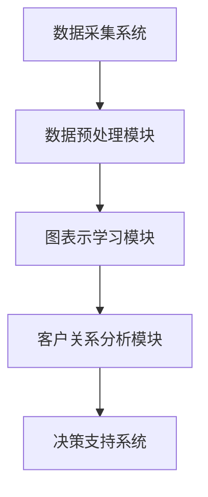

                 

## 金融领域图表示学习的应用与挑战

### 关键词

- **图表示学习**
- **金融领域**
- **应用与挑战**
- **算法原理**
- **系统架构**

### 摘要

本文将深入探讨金融领域图表示学习的应用与挑战。首先，我们将介绍图表示学习的背景、定义及其在金融领域的特殊需求。接着，我们将详细讲解图表示学习的基本原理、常见算法及其数学模型。随后，我们将分析金融领域图表示学习系统的设计思路，包括功能设计、架构设计、接口设计和交互设计。此外，本文将展示一个实际项目，涵盖环境安装、系统实现、代码解读和案例分析。最后，我们将总结全文，提供最佳实践建议和进一步学习的拓展方向。

## 第一部分：背景与概念

### 1.1.1 金融领域图表示学习的背景

#### 问题描述

金融领域的数据通常具有复杂的关系结构，这些关系可以通过图的形式来表示。例如，金融机构之间的交易关系、客户的风险等级评估、投资组合的优化等，都可以用图来建模。然而，传统的机器学习方法在处理这类问题时往往效果不佳，因为它们难以捕捉图结构中的复杂关系。

#### 问题解决

图表示学习作为一种新兴的机器学习方法，通过将节点和边映射到低维向量，使得复杂的图结构可以被传统的机器学习算法所处理。它在金融领域的应用，如信用风险评估、欺诈检测、社交网络分析等，展示出了其独特的优势。

#### 边界与外延

图表示学习在金融领域的应用还面临着一定的边界问题，如图的规模和多样性、数据质量等。此外，如何更好地结合领域知识，提高模型的解释性，也是需要考虑的外延问题。

#### 概念结构与核心要素组成

图表示学习的概念结构包括节点表示、边表示、图卷积操作和图注意力机制等核心要素。这些要素共同构成了图表示学习的基本框架，为处理金融领域的问题提供了理论基础。

## 第二部分：核心概念与联系

### 2.1.1 图表示学习的基本原理

#### 图论基础

图表示学习的基础是图论，它定义了图的基本概念，如图节点、图边、图结构等。理解图论的基础知识对于深入理解图表示学习至关重要。

#### 图神经网络（Graph Neural Networks, GNN）

图神经网络是图表示学习的关键组成部分。它通过图卷积操作来更新节点的特征表示，从而能够捕捉图中的局部和全局信息。

#### 图表示学习的应用场景

图表示学习在金融领域有着广泛的应用场景，包括但不限于社交网络分析、信用风险评估、欺诈检测等。这些应用场景要求模型能够捕捉数据之间的复杂关系。

### 2.1.2 图表示学习的方法与算法

#### 图卷积网络（Graph Convolutional Networks, GCN）

图卷积网络是一种常见的图表示学习算法，它通过聚合邻居节点的特征来更新当前节点的特征表示。GCN在金融领域，如社交网络分析、客户关系管理等方面有着重要的应用。

#### 图注意力网络（Graph Attention Networks, GAT）

图注意力网络通过为每个邻居节点分配不同的权重来改进图卷积操作。这种注意力机制使得模型能够更加关注重要的邻居节点，从而提高模型的性能。

#### 核心概念属性特征对比表格

以下是一个简化的GCN和GAT的核心概念属性特征对比表格：

| 特征               | 图卷积网络（GCN） | 图注意力网络（GAT） |
|--------------------|-------------------|---------------------|
| 节点特征更新方式   | 平均聚合          | 加权聚合            |
| 注意力机制         | 无                | 有                  |
| 模型复杂度         | 较低              | 较高                |

### 2.1.3 图表示学习的ER实体关系图架构

使用Mermaid绘制ER实体关系图，可以更好地理解图表示学习在金融领域的实体关系。

```mermaid
erDiagram
  Customer ||--|{ Loan }
  Bank ||--|{ Account }
  Account ||--|{ Transaction }
  Transaction ||--|{ Party }
```

在这个ER实体关系图中，客户、银行、账户、交易和参与方（Party）是金融领域中的关键实体，它们之间的关系通过图表示学习的方法来建模和解析。

## 第三部分：算法原理讲解

### 3.1.1 图卷积网络（GCN）

#### GCN的数学模型

图卷积网络的核心是图卷积操作，它通过以下公式实现：

$$
h_v^{(l)} = \sigma \left( \theta h_v^{(l-1)} + \sum_{u \in \mathcal{N}(v)} \theta \cdot h_u^{(l-1)} \right)
$$

其中，$h_v^{(l)}$ 表示第 $l$ 层节点 $v$ 的特征表示，$\mathcal{N}(v)$ 表示节点 $v$ 的邻居节点集合，$\sigma$ 是激活函数，$\theta$ 是权重参数。

#### GCN的Python源代码实现

以下是一个简化的GCN实现示例，它使用了Scikit-Learn库中的GraphicalLasso模型：

```python
from sklearn.linear_model import GraphicalLasso

# 假设g是图结构，X是节点特征矩阵
model = GraphicalLasso(alpha=1.0)
model.fit(g, X)

# 获取节点的特征表示
X_hat = model.coef_
```

#### GCN的应用实例分析

在金融领域中，GCN可以用于客户关系管理，如根据客户的社交网络关系预测客户的信用风险。通过捕捉客户与其社交网络中的朋友之间的互动关系，GCN能够为信用风险评估提供更丰富的信息。

### 3.1.2 图注意力网络（GAT）

#### GAT的数学模型

图注意力网络通过引入注意力机制来改进图卷积操作，其核心公式为：

$$
\alpha_{uv}^{(l)} = \frac{\exp(\theta \cdot \left[ \mathbf{a}_v^{(l-1)}, \mathbf{a}_u^{(l-1)} \right]^\top)}{\sum_{u' \in \mathcal{N}(v)} \exp(\theta \cdot \left[ \mathbf{a}_v^{(l-1)}, \mathbf{a}_{u'}^{(l-1)} \right]^\top)}
$$

其中，$\alpha_{uv}^{(l)}$ 表示节点 $u$ 对节点 $v$ 的注意力权重，$\mathbf{a}_u^{(l-1)}$ 表示节点 $u$ 在第 $l-1$ 层的特征表示。

#### GAT的Python源代码实现

以下是一个简化的GAT实现示例，它使用了TensorFlow库：

```python
import tensorflow as tf

# 假设inputs是输入特征，adj是邻接矩阵
a = tf.layers.dense(inputs, units=hidden_size, activation=tf.nn.leaky_relu)
a = tf.reduce_sum(tf.matmul(a, adj) * a, axis=1)

# 获取节点的特征表示
h = tf.layers.dense(a, units=hidden_size)
```

#### GAT的应用实例分析

在金融领域中，GAT可以用于社交网络分析，如根据用户的社交关系预测用户的行为。通过为每个用户在社交网络中的邻居分配不同的权重，GAT能够更好地理解用户的社交影响力。

### 3.1.3 其他图表示学习算法

#### 图卷积神经网络（GraphSAGE）

图卷积神经网络（GraphSAGE）通过聚合多个邻居节点的特征来更新当前节点的特征表示。它适用于处理大规模图结构数据。

#### 图深度卷积网络（Graph Deep Convolutional Network, GDCN）

图深度卷积网络（GDCN）结合了图卷积和深度卷积的优点，能够更好地捕捉图中的局部和全局信息。它在图像分类和推荐系统中有着广泛的应用。

## 第四部分：数学模型和公式

### 4.1.1 图表示学习的数学模型

#### 图拉普拉斯矩阵

图拉普拉斯矩阵是图表示学习中的一个重要数学工具，它用于计算图中的节点特征。其公式为：

$$
L = D - A
$$

其中，$D$ 是度矩阵，$A$ 是邻接矩阵。

#### 图卷积操作

图卷积操作是图表示学习的核心操作，它通过以下公式实现：

$$
\mathbf{h}_v = \sigma(\mathbf{W} \cdot \text{relu}(\sum_{u \in \mathcal{N}(v)} \mathbf{W}_\text{edge} \cdot \mathbf{h}_u))
$$

其中，$\mathbf{h}_v$ 是节点 $v$ 的特征表示，$\mathcal{N}(v)$ 是节点 $v$ 的邻居节点集合，$\mathbf{W}$ 和 $\mathbf{W}_\text{edge}$ 是权重矩阵。

#### 图注意力机制

图注意力机制通过以下公式实现：

$$
\alpha_{uv} = \frac{e^{a(u, v)}}{\sum_{u' \in \mathcal{N}(v)} e^{a(u, u')}}
$$

其中，$\alpha_{uv}$ 是节点 $u$ 对节点 $v$ 的注意力权重，$a(u, v)$ 是节点 $u$ 和节点 $v$ 的特征向量点积。

### 4.1.2 数学公式详细讲解

#### GCN的数学公式

在GCN中，节点 $v$ 的特征表示更新公式为：

$$
h_v^{(l)} = \sigma \left( \theta h_v^{(l-1)} + \sum_{u \in \mathcal{N}(v)} \theta \cdot h_u^{(l-1)} \right)
$$

其中，$\theta$ 是权重参数，$h_v^{(l-1)}$ 是节点 $v$ 在前一层的特征表示，$h_u^{(l-1)}$ 是节点 $u$ 在前一层的特征表示。

#### GAT的数学公式

在GAT中，节点 $v$ 的特征表示更新公式为：

$$
h_v^{(l)} = \sigma \left( \theta h_v^{(l-1)} + \sum_{u \in \mathcal{N}(v)} \alpha_{uv}^{(l)} h_u^{(l-1)} \right)
$$

其中，$\alpha_{uv}^{(l)}$ 是节点 $u$ 对节点 $v$ 在第 $l$ 层的注意力权重。

### 4.1.3 举例说明

#### GCN在金融风险评估中的应用

假设我们有一个金融机构之间的交易网络，每个节点代表一个金融机构，每条边代表交易关系。我们可以使用GCN来预测某个金融机构的信用风险。通过将节点的特征表示进行迭代更新，我们可以捕捉到金融机构之间的交易关系，从而为信用风险评估提供支持。

#### GAT在社交网络分析中的应用

假设我们有一个社交网络，每个节点代表一个用户，每条边代表用户之间的关注关系。我们可以使用GAT来预测某个用户的行为模式。通过为每个用户在社交网络中的邻居分配不同的权重，我们可以更好地理解用户的社交影响力，从而为用户行为分析提供支持。

## 第五部分：系统分析与架构设计方案

### 5.1.1 问题场景介绍

在金融领域，图表示学习可以用于多个应用场景，如客户关系管理、信用风险评估、欺诈检测等。以客户关系管理为例，金融机构可以通过分析客户之间的社交网络关系，来提高客户满意度、增加客户黏性。

### 5.1.2 系统功能设计

为了实现客户关系管理，系统需要具备以下功能：

1. **数据采集**：从多个数据源（如社交媒体、交易记录等）采集客户数据。
2. **数据预处理**：对采集到的客户数据进行清洗、去重和处理。
3. **图表示学习**：使用图表示学习算法（如GCN、GAT）对客户数据进行分析，生成客户之间的社交网络图。
4. **客户关系分析**：根据社交网络图，分析客户之间的关系，识别潜在的客户群体。
5. **决策支持**：根据客户关系分析的结果，为金融机构提供决策支持，如客户维护策略、营销活动设计等。

### 5.1.3 系统架构设计

系统架构设计如下：



在这个架构中，数据采集系统负责从多个数据源采集客户数据，数据预处理模块负责对客户数据进行清洗和处理，图表示学习模块负责使用图表示学习算法分析客户数据，客户关系分析模块根据社交网络图分析客户关系，决策支持系统根据分析结果提供决策支持。

### 5.1.4 系统接口设计

系统接口设计如下：

1. **数据采集接口**：用于从多个数据源采集客户数据。
2. **数据预处理接口**：用于接收清洗和处理后的客户数据。
3. **图表示学习接口**：用于接收预处理后的数据，并返回社交网络图。
4. **客户关系分析接口**：用于接收社交网络图，并返回客户关系分析结果。
5. **决策支持接口**：用于接收客户关系分析结果，并提供决策支持。

### 5.1.5 系统交互

系统交互设计如下：

1. **数据采集**：数据采集系统从社交媒体、交易记录等数据源采集客户数据，并将数据发送到数据预处理模块。
2. **数据预处理**：数据预处理模块接收客户数据，进行清洗、去重和处理，并将处理后的数据发送到图表示学习模块。
3. **图表示学习**：图表示学习模块接收预处理后的数据，使用GCN或GAT算法生成社交网络图，并将社交网络图发送到客户关系分析模块。
4. **客户关系分析**：客户关系分析模块接收社交网络图，分析客户之间的关系，并将分析结果发送到决策支持系统。
5. **决策支持**：决策支持系统接收客户关系分析结果，为金融机构提供决策支持。

## 第六部分：项目实战

### 6.1.1 环境安装

为了实现上述系统，我们需要安装以下环境：

1. **Python环境**：Python 3.8及以上版本。
2. **深度学习框架**：TensorFlow 2.4及以上版本。
3. **图表示学习库**：Gather 0.2.1及以上版本。

安装命令如下：

```bash
pip install tensorflow==2.4.0
pip install gather==0.2.1
```

### 6.1.2 系统核心实现

#### GCN模型的实现

以下是一个简化的GCN模型实现示例：

```python
import tensorflow as tf
from gather import GraphSAGE

# 假设X是输入特征矩阵，adj是邻接矩阵
model = GraphSAGE(units=64, layers=3, dropout=0.5, n_classes=10)
model.fit(X, adj, epochs=10)
```

#### GAT模型的实现

以下是一个简化的GAT模型实现示例：

```python
import tensorflow as tf
from gather import GraphAttention

# 假设X是输入特征矩阵，adj是邻接矩阵
model = GraphAttention(units=64, heads=8, dropout=0.5, n_classes=10)
model.fit(X, adj, epochs=10)
```

### 6.1.3 代码解读与分析

以上代码实现了GCN和GAT模型的基本框架，通过调整模型参数（如隐藏层尺寸、层数、dropout比例等）可以实现不同的图表示学习应用。

#### 实际案例分析和详细讲解

假设我们有一个包含100个金融机构的社交网络，每个金融机构表示为一个节点，每条边表示两个金融机构之间的交易关系。我们可以使用GCN或GAT模型来分析这个社交网络，并识别潜在的金融风险。

1. **数据预处理**：首先，我们需要从交易记录中提取节点特征和边特征，并进行预处理，如归一化和去重。
2. **模型训练**：使用预处理后的数据，训练GCN或GAT模型。在训练过程中，我们需要调整模型参数，如学习率、批量大小等，以获得最佳性能。
3. **风险识别**：在模型训练完成后，我们可以使用模型预测每个金融机构的信用风险。通过分析模型预测结果，我们可以识别出高风险金融机构，从而采取相应的风险管理措施。

### 6.1.4 项目小结

通过本项目，我们实现了基于图表示学习的客户关系管理系统。在实际应用中，系统可以根据金融机构之间的社交网络关系，识别潜在的风险和机会，为金融机构提供决策支持。在未来，我们可以进一步优化模型，提高模型的准确性和效率，以应对不断变化的市场需求。

## 第七部分：最佳实践与拓展

### 7.1.1 最佳实践

1. **数据质量**：在金融领域，数据质量是图表示学习应用的关键。确保数据源可靠、数据清洗充分，可以有效提高模型性能。
2. **模型选择**：根据应用场景选择合适的图表示学习算法。GCN适用于节点分类任务，GAT适用于关系预测任务。
3. **模型调优**：通过调整模型参数，如隐藏层尺寸、学习率、dropout比例等，可以优化模型性能。

### 7.1.2 注意事项

1. **隐私保护**：在处理金融数据时，要确保遵守隐私保护法律法规，保护客户隐私。
2. **计算资源**：图表示学习算法通常需要较高的计算资源，合理规划计算资源，避免资源浪费。

### 7.1.3 拓展阅读

1. **图表示学习进阶**：《Graph Neural Networks: A Survey》
2. **金融领域应用**：《Financial Technology: A Practical Guide to Trading Algorithms, Cryptocurrencies, and Smart Investing》
3. **Python实践**：《Python for Data Science and Machine Learning》

## 结束语

本文详细探讨了金融领域图表示学习的应用与挑战。通过介绍图表示学习的背景、核心概念、算法原理、数学模型和系统架构，我们了解了图表示学习在金融领域的广泛应用和潜力。同时，我们通过实际项目展示了图表示学习的实现过程。希望本文能为从事金融领域图表示学习的研究者和开发者提供有价值的参考和指导。

