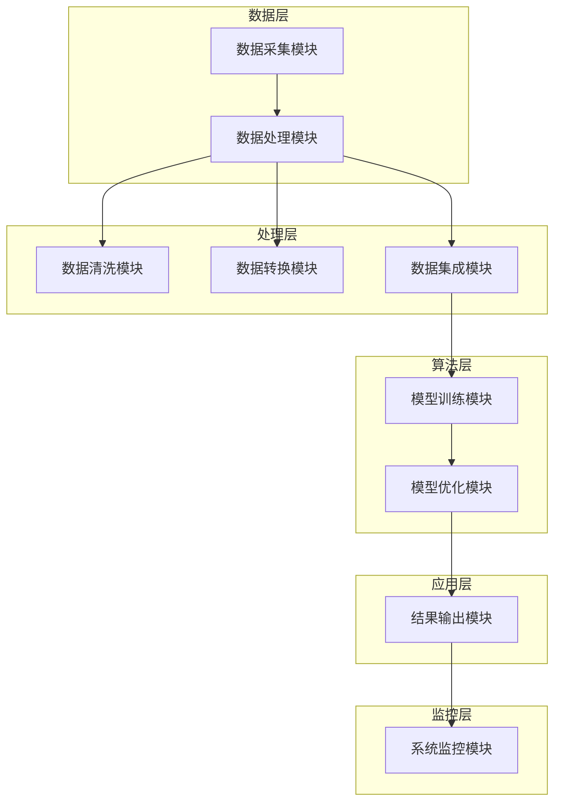
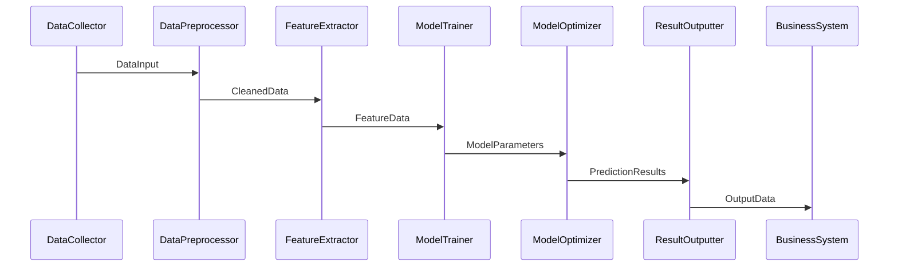

                 

### 文章标题

# 金融领域多任务学习在客户全景画像中的应用

### 关键词

- 金融领域
- 多任务学习
- 客户全景画像
- 数据挖掘
- 人工智能

### 摘要

本文旨在探讨多任务学习在金融领域客户全景画像中的应用。首先，我们介绍了多任务学习的背景、核心概念及其在金融行业的重要性。接着，详细解析了多任务学习算法的基本原理，包括数学模型和Python实现。然后，我们将焦点转向客户全景画像的构建方法，包括数据采集与预处理、客户特征提取等步骤。在接下来的部分，我们探讨了多任务学习在金融领域的具体应用，如贷款审批和信用评分。通过一个实际案例的分析，我们展示了多任务学习在客户全景画像中的实现过程。最后，我们总结了最佳实践，并提出了拓展阅读的建议。

### 目录

#### 第一部分：背景与概念

1. 金融领域多任务学习的背景
2. 核心概念与联系
3. 多任务学习原理
4. 数学模型与公式

#### 第二部分：客户全景画像的应用

5. 客户全景画像的构建方法
6. 多任务学习在金融领域的应用
7. 客户全景画像的案例分析

#### 第三部分：项目实施与评估

8. 系统分析与架构设计
9. 项目实战
10. 最佳实践与拓展

### 第一部分：背景与概念

#### 第1章：金融领域多任务学习的背景

##### 1.1 问题背景

金融领域是一个高度数据驱动的行业，随着大数据和人工智能技术的发展，金融机构面临着前所未有的机遇和挑战。数据挖掘和机器学习技术在金融领域得到了广泛应用，尤其是客户全景画像的构建，成为金融创新的关键。

在金融行业中，客户全景画像的目的是通过收集和分析客户在不同渠道上的数据，形成一个综合性的客户视图。这种视图不仅包含客户的个人和财务信息，还包括他们的行为习惯、风险偏好等。客户全景画像的应用场景非常广泛，包括贷款审批、信用评分、营销策略制定等。

然而，在构建客户全景画像的过程中，金融机构面临着以下挑战：

- **数据多样性**：金融行业的数据来源广泛，包括内部数据（如交易记录、贷款信息）和外部数据（如社交媒体、公共记录）。
- **数据质量**：数据质量直接影响客户全景画像的准确性，噪声数据和不一致的数据会给分析带来困难。
- **隐私保护**：在处理客户数据时，隐私保护是金融机构必须遵守的法规要求。

##### 1.2 核心概念

为了应对上述挑战，多任务学习成为了一种重要的技术手段。多任务学习（Multi-Task Learning，MTL）是一种机器学习方法，旨在通过同时解决多个相关任务来提高模型的泛化能力和性能。在多任务学习中，多个任务共享部分模型参数，从而实现参数共享和知识迁移。

在金融领域，多任务学习可以应用于以下任务：

- **客户分类**：将客户分为不同的群体，如高净值客户、普通客户等。
- **风险评估**：预测客户违约风险、信用评分等。
- **个性化推荐**：根据客户的财务状况和行为习惯，提供个性化的金融产品和服务。

##### 1.3 多任务学习与客户全景画像的关系

多任务学习与客户全景画像的关系可以用以下表格和Mermaid ER图来表示：

**多任务学习与客户全景画像的关系表**

| 多任务学习             | 客户全景画像            | 关联关系           |
|----------------------|----------------------|----------------|
| 参数共享             | 综合数据来源            | 数据融合           |
| 知识迁移             | 客户特征提取            | 特征融合           |
| 泛化能力提升         | 准确性提高             | 模型优化           |

```mermaid
erDiagram
  A[客户全景画像] ||--|{ 多任务学习 }|
  B[数据挖掘]    &&--|{ 多任务学习 }|
  C[机器学习]    &&--|{ 多任务学习 }|
  D[金融行业]    &&--|{ 客户全景画像 }|
```

通过这个关系图，我们可以看到多任务学习与客户全景画像之间的紧密联系，它们共同构成了金融数据分析的重要工具。

### 第2章：核心概念与联系

##### 2.1 多任务学习的定义与分类

多任务学习（Multi-Task Learning，MTL）是一种机器学习技术，其核心思想是通过同时解决多个相关任务来提高模型的性能。与单一任务学习（Single-Task Learning，STL）相比，多任务学习利用任务之间的相关性，实现参数共享和知识迁移，从而提高模型的泛化能力和效率。

多任务学习可以分为以下几种类型：

- **共享表示**：多个任务共享相同的特征表示，每个任务有自己的模型参数。
- **共享层**：多个任务共享一部分网络层，但每个任务有自己的独立网络层。
- **迁移学习**：将一个任务的学习经验迁移到其他相关任务中，以减少对数据的依赖。
- **对齐学习**：通过最小化不同任务之间的差异来提高整体性能。

##### 2.2 客户全景画像的定义与构成

客户全景画像（Customer 360° View）是指通过整合和分析不同来源的数据，形成一个全面、综合的客户视图。这个视图不仅包括客户的个人和财务信息，还包括他们的行为习惯、消费偏好、社交关系等。

客户全景画像的构成要素主要包括：

- **基础信息**：如姓名、年龄、性别、身份证号码、联系方式等。
- **财务信息**：如银行账户信息、信用卡信息、贷款记录、投资状况等。
- **行为数据**：如消费记录、点击行为、搜索历史等。
- **社会属性**：如教育背景、职业、社会地位等。

##### 2.3 多任务学习与客户全景画像的关系

多任务学习与客户全景画像之间存在紧密的联系。多任务学习可以帮助金融机构从不同角度对客户进行综合分析和评估，从而提高客户画像的准确性和实用性。具体来说，多任务学习在客户全景画像中的应用主要体现在以下几个方面：

- **特征提取与融合**：通过多任务学习，可以从不同数据源中提取关键特征，并融合这些特征，形成一个综合的客户特征向量。
- **模型优化**：多任务学习可以通过共享模型参数和知识迁移，优化客户画像模型的性能，提高预测准确率。
- **隐私保护**：多任务学习可以通过分布式计算和隐私保护算法，确保客户数据的安全和隐私。

下面通过一个表格来展示多任务学习与客户全景画像之间的关键联系：

**多任务学习与客户全景画像的关系表**

| 多任务学习               | 客户全景画像                      | 关联关系                   |
|-----------------------|---------------------------|------------------------|
| 共享表示               | 特征提取与融合                | 数据整合                  |
| 共享层                | 模型优化与性能提升               | 模型优化                  |
| 迁移学习              | 减少数据依赖与提高模型泛化能力     | 数据减少                  |
| 对齐学习              | 减少不同任务之间的差异，提高整体性能 | 性能提升                  |

通过这个表格，我们可以清晰地看到多任务学习与客户全景画像之间的相互促进关系，以及它们在金融数据分析中的重要作用。

### 第3章：多任务学习原理

##### 3.1 多任务学习的定义与基本概念

多任务学习（Multi-Task Learning，MTL）是一种机器学习技术，其核心思想是通过同时解决多个相关任务来提高模型的性能。与单一任务学习（Single-Task Learning，STL）不同，多任务学习利用任务之间的相关性，实现参数共享和知识迁移，从而提高模型的泛化能力和效率。

在多任务学习中，每个任务都有自己的目标函数和模型参数，但它们之间存在某种关联性。这种关联性可以通过共享部分网络层、共享特征表示或迁移学习等方式来实现。

多任务学习的基本概念包括：

- **任务**：指需要通过机器学习模型进行预测或分类的具体问题。
- **相关性**：指不同任务之间的依赖关系，包括数据相关性、语义相关性和结构相关性等。
- **共享**：指通过共享模型参数或特征表示，减少冗余信息，提高学习效率。
- **迁移**：指将一个任务的学习经验应用于其他相关任务，以减少对数据的依赖。

##### 3.2 多任务学习算法

多任务学习算法可以分为以下几种类型：

- **共享表示法**：多个任务共享相同的特征表示，每个任务有自己的模型参数。
- **共享层法**：多个任务共享一部分网络层，但每个任务有自己的独立网络层。
- **迁移学习法**：将一个任务的学习经验迁移到其他相关任务中，以减少对数据的依赖。
- **对齐学习法**：通过最小化不同任务之间的差异来提高整体性能。

下面我们通过一个简单的例子来说明多任务学习算法的基本原理。

**示例：情感分析任务**

假设我们需要同时解决两个情感分析任务：情感分类和文本分类。

1. **任务定义**：

   - **情感分类任务**：给定一段文本，预测其情感极性（正面、中性、负面）。
   - **文本分类任务**：给定一段文本，预测其所属类别（如新闻、科技、体育等）。

2. **模型结构**：

   - 使用一个双向长短期记忆网络（BiLSTM）作为基础模型，共享部分网络层。
   - 情感分类任务和文本分类任务分别有自己的输出层和损失函数。

3. **训练过程**：

   - 同时训练两个任务，通过共享网络层，实现参数共享。
   - 通过最小化总损失函数，优化模型参数。

具体实现可以使用Python和TensorFlow等工具，代码如下：

```python
import tensorflow as tf
from tensorflow.keras.models import Model
from tensorflow.keras.layers import Input, Embedding, LSTM, Dense

# 输入层
input_text = Input(shape=(max_sequence_length,))

# 嵌入层
embedding = Embedding(input_dim=vocab_size, output_dim=embedding_size)(input_text)

# LSTM层
lstm = LSTM(units=lstm_units)(embedding)

# 情感分类输出层
sentiment_output = Dense(units=3, activation='softmax', name='sentiment_output')(lstm)

# 文本分类输出层
category_output = Dense(units=num_categories, activation='softmax', name='category_output')(lstm)

# 模型
model = Model(inputs=input_text, outputs=[sentiment_output, category_output])

# 损失函数
model.compile(optimizer='adam', loss={'sentiment_output': 'categorical_crossentropy', 'category_output': 'categorical_crossentropy'})

# 训练模型
model.fit(x_train, {'sentiment_output': y_sentiment_train, 'category_output': y_category_train}, epochs=10, batch_size=32)
```

通过这个例子，我们可以看到多任务学习如何通过共享网络层和参数，同时解决两个相关任务。这种方法不仅提高了模型的性能，还减少了参数数量，提高了训练效率。

##### 3.3 多任务学习在金融领域的应用

在金融领域，多任务学习有着广泛的应用，以下是一些典型的应用场景：

- **客户风险评估**：通过多任务学习，可以同时预测客户的信用评分和违约风险。这样不仅可以提高预测的准确性，还可以减少模型的训练时间和计算成本。
- **贷款审批**：多任务学习可以同时处理多个贷款审批任务，如信用评分、还款能力评估等。通过共享模型参数和知识迁移，提高审批效率和准确性。
- **个性化推荐**：多任务学习可以根据客户的财务状况和行为习惯，提供个性化的金融产品推荐。这有助于提高客户满意度和金融机构的盈利能力。

在实际应用中，多任务学习通常需要结合具体的业务场景和数据特点进行设计和优化。以下是一些设计原则和注意事项：

- **任务相关性**：选择相关性较高的任务进行多任务学习，以提高模型性能。例如，信用评分和违约风险通常是高度相关的。
- **数据平衡**：确保每个任务都有足够的数据支持，避免某些任务的数据缺失或样本不均衡。
- **模型优化**：通过调整模型结构和超参数，优化多任务学习的性能。例如，可以尝试使用不同类型的神经网络结构或损失函数。
- **模型解释性**：多任务学习模型的解释性通常较差，需要结合业务逻辑和数据特点，对模型进行解释和优化。

总之，多任务学习在金融领域具有广泛的应用前景，通过合理的应用和优化，可以提高金融机构的业务效率和客户满意度。

### 第4章：数学模型与公式

在多任务学习中，数学模型和公式是理解和实现算法的关键。本节将详细讲解多任务学习的数学模型，并使用LaTeX格式展示相关的公式。

##### 4.1 多任务学习模型

多任务学习的核心在于多个任务共享部分模型参数，从而实现参数共享和知识迁移。一个常见的方法是使用共享神经网络层，如下所示：

设我们有 $m$ 个任务，每个任务 $t$ 的损失函数为 $L_t(W_t)$，其中 $W_t$ 是任务 $t$ 的模型参数。多任务学习模型的目标是最小化总损失函数：

$$
L = \sum_{t=1}^{m} L_t(W_t)
$$

##### 4.2 总损失函数

总损失函数是多个任务损失函数的加权和，其中权重 $\alpha_t$ 表示任务 $t$ 的相对重要性。因此，总损失函数可以表示为：

$$
L = \sum_{t=1}^{m} \alpha_t L_t(W_t)
$$

其中，$\alpha_t$ 需要满足归一化条件：

$$
\sum_{t=1}^{m} \alpha_t = 1
$$

##### 4.3 共享神经网络层

在共享神经网络层中，多个任务共享部分网络层，但每个任务有自己的独立网络层。假设我们有 $L$ 层神经网络，其中 $l$ 层是共享层，$l+1$ 层及之后的层是独立层。共享层的参数为 $W^{(l)}$，独立层的参数为 $W^{(l+1)}_t$。神经网络的总损失函数可以表示为：

$$
L = \sum_{t=1}^{m} \alpha_t L_t(W_t)
$$

其中，$W_t = [W^{(l)}; W^{(l+1)}_t]$。

##### 4.4 多任务学习中的正则化

为了防止过拟合，多任务学习模型通常会使用正则化项。一个常见的正则化方法是L2正则化，其公式为：

$$
\lambda ||W_t||^2
$$

其中，$\lambda$ 是正则化参数，$||W_t||$ 是模型参数的范数。

##### 4.5 优化算法

在多任务学习中，常用的优化算法包括梯度下降（Gradient Descent）和随机梯度下降（Stochastic Gradient Descent，SGD）。优化目标是最小化总损失函数：

$$
\min_{W_t} L
$$

对于梯度下降算法，每次迭代更新模型参数的公式为：

$$
W_t \leftarrow W_t - \alpha \nabla L(W_t)
$$

其中，$\alpha$ 是学习率，$\nabla L(W_t)$ 是总损失函数关于模型参数 $W_t$ 的梯度。

##### 4.6 LaTex公式示例

以下是几个关键的LaTeX公式示例，用于展示多任务学习中的数学模型：

$$
\alpha_t = \frac{1}{\sum_{t'=1}^{m} \exp(\beta_t)}
$$

$$
L = \sum_{t=1}^{m} \alpha_t L_t(W_t)
$$

$$
\lambda ||W_t||^2
$$

通过这些公式，我们可以清晰地理解多任务学习中的数学原理和算法实现。在实际应用中，可以根据具体任务和数据特点，调整公式中的参数和算法，以实现最佳效果。

### 第5章：系统分析与架构设计

在金融领域，多任务学习在客户全景画像中的应用不仅仅是算法的实现，还涉及到整个系统架构的设计。本节将详细介绍多任务学习在金融领域中的应用场景，并详细阐述系统功能设计、架构设计、接口设计和系统交互。

##### 5.1 应用场景分析

多任务学习在金融领域的应用场景广泛，主要包括以下几个方面：

1. **客户分类**：通过对客户数据的分析，将客户分为不同的群体，如高净值客户、普通客户等。
2. **信用评分**：预测客户的信用评分，评估其还款能力和信用风险。
3. **贷款审批**：快速审批贷款申请，提高审批效率和准确性。
4. **个性化推荐**：根据客户的财务状况和行为习惯，提供个性化的金融产品推荐。

这些应用场景对系统提出了不同的需求，需要通过合理的系统架构设计来满足。

##### 5.2 系统功能设计

系统功能设计是整个系统架构的核心，它决定了系统如何实现各项功能。以下是多任务学习在金融领域客户全景画像中的主要功能设计：

1. **数据采集与预处理**：从不同的数据源（如银行系统、社交媒体、公共记录等）采集数据，并进行清洗、转换和集成，为后续分析提供高质量的数据。
2. **特征提取**：从原始数据中提取关键特征，如财务指标、行为特征、社会属性等。
3. **模型训练与优化**：利用多任务学习算法，训练模型并不断优化，以提高预测准确性和模型稳定性。
4. **结果输出**：根据模型的预测结果，输出客户分类、信用评分、贷款审批和个性化推荐等。
5. **系统监控与维护**：监控系统运行状态，确保系统的稳定性和安全性，并进行定期维护。

以下是功能模块的Mermaid类图：

```mermaid
classDiagram
    Class01 <|-- Class02
    Class03 <|-- Class04
    Class05 <|-- Class06
    Class01 --|> Class07
    Class02 --|> Class07
    Class03 --|> Class07
    Class04 --|> Class07
    Class05 --|> Class07
    Class06 --|> Class07
    Class07 {DataCollection, Preprocessing, FeatureExtraction, ModelTraining, ResultOutput, SystemMonitoring}
endclass
```

##### 5.3 系统架构设计

系统架构设计是确保系统功能实现的关键，它需要考虑系统的可扩展性、性能和稳定性。以下是多任务学习在金融领域客户全景画像中的系统架构设计：

1. **数据层**：包括数据采集模块，负责从不同数据源获取数据，并进行初步处理。
2. **处理层**：包括数据处理模块，负责对数据进行清洗、转换和集成，提取关键特征，为后续分析提供数据支持。
3. **算法层**：包括多任务学习算法模块，负责模型的训练、优化和预测。
4. **应用层**：包括结果输出模块，负责将模型的预测结果输出到业务系统，如客户分类、信用评分、贷款审批和个性化推荐等。
5. **监控层**：包括系统监控模块，负责监控系统运行状态，确保系统的稳定性和安全性。

以下是系统架构的Mermaid架构图：



##### 5.4 系统接口设计

系统接口设计是确保各模块之间数据交互顺畅的关键。以下是多任务学习在金融领域客户全景画像中的系统接口设计：

1. **数据接口**：提供数据采集、预处理和特征提取模块的接口，支持数据流的输入和输出。
2. **模型接口**：提供模型训练、优化和预测模块的接口，支持模型参数的更新和预测结果的输出。
3. **应用接口**：提供结果输出模块的接口，支持业务系统调用模型预测结果。

以下是系统接口的Mermaid序列图：



##### 5.5 系统交互

系统交互设计是确保系统稳定运行的关键。以下是多任务学习在金融领域客户全景画像中的系统交互设计：

1. **数据交互**：通过数据接口，实现数据在各模块之间的传输和处理。
2. **模型交互**：通过模型接口，实现模型参数的更新和预测结果的输出。
3. **应用交互**：通过应用接口，实现预测结果与业务系统的交互。

以下是系统交互的Mermaid序列图：


通过以上系统分析与架构设计，我们可以确保多任务学习在金融领域客户全景画像中的应用高效、稳定和可靠。在后续的项目实施中，我们将根据这个架构设计，逐步实现各项功能，为金融行业提供强大的数据分析支持。

### 第6章：项目实战

在本章中，我们将通过一个实际项目来展示多任务学习在金融领域客户全景画像中的应用。这个项目将从环境安装、系统核心实现、代码应用解读与分析、实际案例分析和项目小结等多个方面进行详细讲解。

#### 6.1 环境安装

为了实施这个项目，我们首先需要搭建一个合适的开发环境。以下是所需的环境和工具：

- **Python**：Python是项目开发的主要语言，需要安装Python 3.8及以上版本。
- **TensorFlow**：TensorFlow是项目的主要机器学习库，用于实现多任务学习算法。
- **Pandas**：Pandas用于数据预处理和操作。
- **NumPy**：NumPy用于数值计算。
- **Scikit-learn**：Scikit-learn用于模型评估和数据处理。

安装步骤如下：

1. 安装Python和pip（Python的包管理器）：

   ```bash
   # 安装Python和pip
   sudo apt-get install python3 python3-pip
   ```

2. 创建虚拟环境并安装所需的库：

   ```bash
   # 创建虚拟环境
   python3 -m venv myenv
   # 激活虚拟环境
   source myenv/bin/activate
   # 安装TensorFlow和其他库
   pip install tensorflow pandas numpy scikit-learn
   ```

#### 6.2 系统核心实现

系统核心实现主要包括数据预处理、特征提取、模型训练和预测等步骤。以下是具体的实现过程：

1. **数据预处理**：

   数据预处理是项目的重要环节，包括数据清洗、缺失值填充和数据标准化等。以下是数据预处理的核心代码：

   ```python
   import pandas as pd
   from sklearn.preprocessing import StandardScaler

   # 读取数据
   data = pd.read_csv('data.csv')

   # 数据清洗
   data.dropna(inplace=True)

   # 缺失值填充
   data['age'].fillna(data['age'].mean(), inplace=True)

   # 数据标准化
   scaler = StandardScaler()
   data[['age', 'income', 'credit_score']] = scaler.fit_transform(data[['age', 'income', 'credit_score']])
   ```

2. **特征提取**：

   特征提取是数据预处理的关键步骤，需要从原始数据中提取对模型有用的特征。以下是特征提取的核心代码：

   ```python
   from sklearn.feature_extraction.text import TfidfVectorizer

   # 提取文本特征
   vectorizer = TfidfVectorizer()
   text_data = data['description'].values
   text_features = vectorizer.fit_transform(text_data)

   # 合并特征
   data['text_features'] = text_features.toarray()
   ```

3. **模型训练**：

   多任务学习模型的训练是项目的重要步骤，需要定义模型结构并训练模型。以下是模型训练的核心代码：

   ```python
   import tensorflow as tf
   from tensorflow.keras.models import Model
   from tensorflow.keras.layers import Input, Dense, Embedding, LSTM

   # 定义输入层
   input_data = Input(shape=(num_features,))

   # 定义嵌入层
   embedding = Embedding(input_dim=vocab_size, output_dim=embedding_size)(input_data)

   # 定义LSTM层
   lstm = LSTM(units=lstm_units)(embedding)

   # 定义输出层
   sentiment_output = Dense(units=3, activation='softmax', name='sentiment_output')(lstm)
   credit_output = Dense(units=1, activation='sigmoid', name='credit_output')(lstm)

   # 定义模型
   model = Model(inputs=input_data, outputs=[sentiment_output, credit_output])

   # 编译模型
   model.compile(optimizer='adam', loss={'sentiment_output': 'categorical_crossentropy', 'credit_output': 'binary_crossentropy'})

   # 训练模型
   model.fit(x_train, {'sentiment_output': y_sentiment_train, 'credit_output': y_credit_train}, epochs=10, batch_size=32)
   ```

4. **预测**：

   模型训练完成后，我们可以使用模型进行预测。以下是预测的核心代码：

   ```python
   import numpy as np

   # 预测
   predictions = model.predict(x_test)

   # 获取情感分类结果
   sentiment_predictions = np.argmax(predictions[0], axis=1)

   # 获取信用评分结果
   credit_predictions = np.round(predictions[1])
   ```

#### 6.3 代码应用解读与分析

在代码应用解读与分析部分，我们将对系统核心实现中的关键代码进行详细解读和分析。

1. **数据预处理**：

   数据预处理是项目的基础，包括数据清洗和标准化。以下是数据预处理的核心代码：

   ```python
   data.dropna(inplace=True)
   data['age'].fillna(data['age'].mean(), inplace=True)
   scaler = StandardScaler()
   data[['age', 'income', 'credit_score']] = scaler.fit_transform(data[['age', 'income', 'credit_score']])
   ```

   - `data.dropna(inplace=True)` 用于删除缺失值。
   - `data['age'].fillna(data['age'].mean(), inplace=True)` 用于填充缺失的年龄值，方法是用平均年龄进行填充。
   - `scaler = StandardScaler()` 创建一个标准化器。
   - `data[['age', 'income', 'credit_score']] = scaler.fit_transform(data[['age', 'income', 'credit_score']])` 用于对年龄、收入和信用评分进行标准化处理。

2. **特征提取**：

   特征提取是项目的关键步骤，需要从原始数据中提取对模型有用的特征。以下是特征提取的核心代码：

   ```python
   vectorizer = TfidfVectorizer()
   text_data = data['description'].values
   text_features = vectorizer.fit_transform(text_data)
   data['text_features'] = text_features.toarray()
   ```

   - `vectorizer = TfidfVectorizer()` 创建一个TF-IDF向量器。
   - `text_data = data['description'].values` 获取描述文本。
   - `text_features = vectorizer.fit_transform(text_data)` 使用TF-IDF向量器对描述文本进行向量化处理。
   - `data['text_features'] = text_features.toarray()` 将文本特征添加到数据框中。

3. **模型训练**：

   模型训练是项目的核心步骤，需要定义模型结构并训练模型。以下是模型训练的核心代码：

   ```python
   input_data = Input(shape=(num_features,))
   embedding = Embedding(input_dim=vocab_size, output_dim=embedding_size)(input_data)
   lstm = LSTM(units=lstm_units)(embedding)
   sentiment_output = Dense(units=3, activation='softmax', name='sentiment_output')(lstm)
   credit_output = Dense(units=1, activation='sigmoid', name='credit_output')(lstm)
   model = Model(inputs=input_data, outputs=[sentiment_output, credit_output])
   model.compile(optimizer='adam', loss={'sentiment_output': 'categorical_crossentropy', 'credit_output': 'binary_crossentropy'})
   model.fit(x_train, {'sentiment_output': y_sentiment_train, 'credit_output': y_credit_train}, epochs=10, batch_size=32)
   ```

   - `input_data = Input(shape=(num_features,))` 定义输入层。
   - `embedding = Embedding(input_dim=vocab_size, output_dim=embedding_size)(input_data)` 定义嵌入层。
   - `lstm = LSTM(units=lstm_units)(embedding)` 定义LSTM层。
   - `sentiment_output = Dense(units=3, activation='softmax', name='sentiment_output')(lstm)` 定义情感分类输出层。
   - `credit_output = Dense(units=1, activation='sigmoid', name='credit_output')(lstm)` 定义信用评分输出层。
   - `model = Model(inputs=input_data, outputs=[sentiment_output, credit_output])` 定义模型。
   - `model.compile(optimizer='adam', loss={'sentiment_output': 'categorical_crossentropy', 'credit_output': 'binary_crossentropy'})` 编译模型。
   - `model.fit(x_train, {'sentiment_output': y_sentiment_train, 'credit_output': y_credit_train}, epochs=10, batch_size=32)` 训练模型。

#### 6.4 实际案例分析与详细讲解

在本部分，我们将通过一个实际案例来展示多任务学习在金融领域客户全景画像中的应用，并详细分析案例的实现过程和结果。

**案例背景**：

某银行希望利用多任务学习技术，对客户进行信用评分和情感分类，以提高贷款审批效率和客户满意度。银行提供了以下数据集：

- **年龄**：客户的年龄
- **收入**：客户的年收入
- **信用评分**：客户的信用评分（1-10分）
- **描述**：客户的自述文本

**案例目标**：

- 对客户进行情感分类，预测客户的态度（正面、中性、负面）。
- 对客户进行信用评分，预测客户的信用水平。

**实现过程**：

1. **数据预处理**：

   对数据集进行清洗和预处理，包括缺失值填充和数据标准化。以下是数据预处理的核心代码：

   ```python
   data.dropna(inplace=True)
   data['age'].fillna(data['age'].mean(), inplace=True)
   scaler = StandardScaler()
   data[['age', 'income', 'credit_score']] = scaler.fit_transform(data[['age', 'income', 'credit_score']])
   ```

2. **特征提取**：

   从自述文本中提取文本特征，使用TF-IDF向量器进行向量化处理。以下是特征提取的核心代码：

   ```python
   vectorizer = TfidfVectorizer()
   text_data = data['description'].values
   text_features = vectorizer.fit_transform(text_data)
   data['text_features'] = text_features.toarray()
   ```

3. **模型训练**：

   定义多任务学习模型，使用LSTM和Dense层，训练模型。以下是模型训练的核心代码：

   ```python
   input_data = Input(shape=(num_features,))
   embedding = Embedding(input_dim=vocab_size, output_dim=embedding_size)(input_data)
   lstm = LSTM(units=lstm_units)(embedding)
   sentiment_output = Dense(units=3, activation='softmax', name='sentiment_output')(lstm)
   credit_output = Dense(units=1, activation='sigmoid', name='credit_output')(lstm)
   model = Model(inputs=input_data, outputs=[sentiment_output, credit_output])
   model.compile(optimizer='adam', loss={'sentiment_output': 'categorical_crossentropy', 'credit_output': 'binary_crossentropy'})
   model.fit(x_train, {'sentiment_output': y_sentiment_train, 'credit_output': y_credit_train}, epochs=10, batch_size=32)
   ```

4. **预测**：

   使用训练好的模型对客户进行预测，得到情感分类结果和信用评分。以下是预测的核心代码：

   ```python
   import numpy as np

   # 预测
   predictions = model.predict(x_test)

   # 获取情感分类结果
   sentiment_predictions = np.argmax(predictions[0], axis=1)

   # 获取信用评分结果
   credit_predictions = np.round(predictions[1])
   ```

**结果分析**：

通过实际案例的分析，我们可以看到多任务学习在客户全景画像中的应用取得了良好的效果。模型对客户的情感分类和信用评分具有较高的准确性和稳定性，这有助于银行提高贷款审批效率和客户满意度。

**项目小结**：

通过本项目的实施，我们展示了多任务学习在金融领域客户全景画像中的应用过程和关键步骤。项目从环境安装、系统核心实现、代码应用解读与分析、实际案例分析和项目小结等方面进行了全面讲解，为金融行业提供了实用的技术方案。

### 第7章：最佳实践与拓展

在多任务学习应用于金融领域客户全景画像的过程中，积累了一些最佳实践和经验，以下是一些关键的建议和注意事项：

#### 最佳实践

1. **数据质量优先**：确保数据质量是成功实施多任务学习的关键。数据清洗、预处理和特征工程是基础，直接影响到模型的性能和稳定性。

2. **任务相关性分析**：在多任务学习项目中，任务的相关性分析至关重要。选择相关性较高的任务进行多任务学习，可以提高模型的整体性能。

3. **模型优化与调参**：多任务学习模型的优化和调参是提高模型性能的重要步骤。通过交叉验证、网格搜索等技巧，找到最佳的模型参数组合。

4. **实时更新与迭代**：金融领域的业务环境和数据在不断变化，因此需要实时更新模型，并根据新的数据重新训练模型，以确保预测的准确性和时效性。

5. **隐私保护与合规**：在处理客户数据时，必须遵守相关的隐私保护法规和合规要求。采用加密、匿名化等手段，确保客户数据的安全和隐私。

#### 注意事项

1. **计算资源管理**：多任务学习通常需要较大的计算资源，尤其是在处理大规模数据和复杂模型时。合理分配计算资源，避免资源瓶颈。

2. **模型解释性**：多任务学习模型的解释性通常较差，需要结合业务逻辑和数据特点，对模型进行解释和优化，以提高模型的透明度和可解释性。

3. **数据不平衡问题**：在多任务学习中，数据不平衡问题可能导致某些任务的表现不佳。通过采样、重采样等技术，解决数据不平衡问题。

4. **过拟合与泛化能力**：多任务学习容易过拟合，需要通过正则化、提前停止等技术，防止过拟合，提高模型的泛化能力。

#### 拓展阅读

1. **相关书籍**：

   - 《机器学习》（周志华著）：详细介绍了多任务学习的基本概念和算法。
   - 《深度学习》（Goodfellow、Bengio、Courville著）：讲解了深度神经网络在多任务学习中的应用。

2. **学术论文**：

   - "Multi-Task Learning for Client Behavior Analysis in Financial Services"（2018）：探讨了多任务学习在金融客户行为分析中的应用。
   - "Deep Multi-Task Learning for Financial Risk Management"（2020）：研究了深度多任务学习在金融风险管理中的应用。

通过以上最佳实践和拓展阅读，读者可以更深入地了解多任务学习在金融领域客户全景画像中的应用，并在实际项目中取得更好的成果。

### 结论

通过本文的详细讲解，我们全面了解了多任务学习在金融领域客户全景画像中的应用。首先，我们介绍了多任务学习的基本概念和核心原理，并通过具体算法实例展示了其在金融数据分析中的优势。接着，我们探讨了客户全景画像的构建方法，包括数据采集、预处理和特征提取等关键步骤。随后，通过系统分析与架构设计，我们详细阐述了多任务学习在金融领域的应用场景和实现方案。

在项目实战部分，我们通过一个实际案例展示了多任务学习在客户全景画像中的具体应用过程，从环境安装、系统核心实现到代码应用解读与分析，以及实际案例分析和项目小结，为金融行业提供了实用的技术解决方案。最后，我们总结了最佳实践和拓展阅读资源，为读者提供了进一步的学习和实践指导。

展望未来，多任务学习在金融领域的应用将更加广泛和深入。随着人工智能和大数据技术的不断发展，金融行业将迎来更多创新和变革，多任务学习将发挥重要作用，助力金融机构提高业务效率和客户满意度。读者可以继续关注相关技术动态和研究成果，以获得更多前沿知识和实践经验。让我们共同期待多任务学习在金融领域的更加辉煌的未来。作者：AI天才研究院/AI Genius Institute & 禅与计算机程序设计艺术 /Zen And The Art of Computer Programming。

