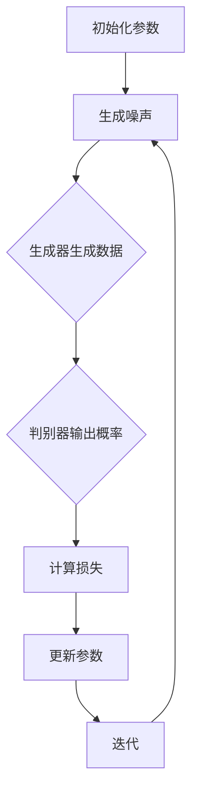

                 

### 背景介绍

#### 核心概念术语说明

1. **对抗学习（Adversarial Learning）**：对抗学习是一种机器学习技术，其核心思想是通过生成对抗网络（GANs）来训练模型。GAN由生成器和判别器两个部分组成，生成器负责生成与真实样本相似的数据，判别器则负责区分真实数据和生成数据。通过这种对抗训练，模型可以不断提高其性能。

2. **风险模型（Risk Model）**：风险模型是金融机构用于评估和量化金融产品或投资组合面临的各种风险的工具。常见的风险模型包括信用风险模型、市场风险模型和操作风险模型等。

3. **压力测试（Stress Testing）**：压力测试是一种评估系统在极端条件下的性能和行为的技术。在金融领域，压力测试用于评估风险模型在各种极端市场条件下的稳定性和可靠性。

#### 问题背景

在金融领域，随着金融市场的复杂性和波动性不断增加，金融机构面临着越来越多的风险。为了更好地管理和控制这些风险，金融机构需要建立准确、高效的风险模型，并通过压力测试来验证模型的性能。然而，传统的风险模型在面对极端市场条件时往往表现不佳，容易产生过拟合和泛化能力不足的问题。

#### 问题描述

问题描述主要集中在两个方面：

1. **风险模型的不稳定性**：传统的风险模型在面对极端市场条件时，可能会因为数据的异常或噪声而出现预测不准确或模型失效的情况，导致金融机构无法及时识别和应对潜在风险。

2. **对抗样本的威胁**：随着人工智能技术的进步，攻击者可以利用对抗样本来欺骗风险模型，使其在正常情况下无法准确识别风险。对抗样本是指那些经过精心设计的、微小的输入扰动，可以在模型上产生显著错误分类的现象。

#### 问题解决

对抗学习在风险模型压力测试中的应用，为解决上述问题提供了一种新的思路：

1. **增强模型的鲁棒性**：通过对抗训练，生成器和判别器相互竞争，生成器试图生成更加逼真的数据，而判别器则努力区分真实数据和生成数据。这种对抗过程使风险模型能够学会识别和应对各种异常情况，从而提高其鲁棒性。

2. **检测和防御对抗样本**：对抗学习可以用于生成对抗样本，并在压力测试中评估模型对对抗样本的抵抗能力。通过这种方式，金融机构可以提前发现模型的潜在漏洞，并采取相应的防御措施。

#### 边界与外延

1. **边界条件**：对抗学习在金融领域应用的范围主要限于可以使用机器学习的风险模型。此外，对抗学习的效果受到模型设计、训练数据和计算资源的影响。

2. **外延**：对抗学习在其他领域的应用也在不断扩展，如医学图像分析、网络安全等。然而，金融领域的特殊性使得对抗学习在应用过程中需要考虑更多的实际问题和挑战。

#### 概念结构与核心要素组成

1. **概念结构**：对抗学习在风险模型压力测试中的概念结构包括生成器、判别器、对抗样本、风险模型等核心要素。

2. **核心要素组成**：
   - **生成器**：负责生成与真实样本相似的数据，用于训练和测试风险模型。
   - **判别器**：负责区分真实数据和生成数据，通过对抗训练提高其性能。
   - **对抗样本**：用于欺骗风险模型的数据，帮助评估模型的鲁棒性。
   - **风险模型**：通过对抗训练和压力测试进行优化的模型，用于评估和量化金融风险。

通过上述背景介绍，我们可以看到，对抗学习在金融领域风险模型压力测试中的应用具有显著的重要性，它不仅能够提高模型的鲁棒性，还能帮助金融机构更好地识别和应对潜在风险。在接下来的章节中，我们将详细探讨对抗学习的基本理论、算法原理及其在金融领域的实际应用。让我们一步步深入，探索这一技术的潜力与挑战。### 核心概念与联系

#### 对抗学习的基本原理

对抗学习是一种通过生成对抗网络（GANs）进行的机器学习技术，其主要目标是训练生成器（Generator）和判别器（Discriminator）两个模型，使它们在对抗过程中相互提高性能。生成器的任务是生成逼真的数据，以欺骗判别器，而判别器的任务是区分真实数据和生成数据。这一过程本质上是两个模型之间的博弈。

1. **生成器的概念与原理**：

生成器的目标是通过学习数据分布来生成与真实数据难以区分的新数据。其基本工作原理可以概括为以下步骤：

- **初始化**：生成器从随机噪声分布中采样，并通过一系列神经网络层将这些噪声转换为数据。
- **生成数据**：生成器将这些噪声输入通过一系列变换，生成新的数据，这些数据模仿了训练集中真实数据的特点。
- **对抗训练**：生成器不断地调整其参数，以使得生成的数据能够更好地欺骗判别器，即判别器越来越难以区分真实数据和生成数据。

2. **判别器的概念与原理**：

判别器的目标是区分真实数据和生成数据。其基本工作原理可以概括为以下步骤：

- **初始化**：判别器从真实数据和生成数据中分别采样，并通过一系列神经网络层对数据进行处理。
- **判别**：判别器对每一批数据进行处理，判断其是真实数据还是生成数据，并输出一个概率值。
- **对抗训练**：判别器通过对抗训练不断提高其性能，使得其对生成数据的判别能力越来越强。

#### 对抗学习与风险模型压力测试的关联

对抗学习在风险模型压力测试中的应用主要体现在两个方面：增强模型的鲁棒性和检测对抗样本。

1. **增强模型的鲁棒性**：

通过对抗训练，生成器和判别器相互竞争，生成器试图生成更加逼真的数据，而判别器则努力区分真实数据和生成数据。这种对抗过程使风险模型能够学会识别和应对各种异常情况，从而提高其鲁棒性。例如，在金融领域，通过对抗训练，风险模型可以学会识别异常的市场波动，从而在压力测试中表现出更强的稳定性。

2. **检测对抗样本**：

对抗学习可以用于生成对抗样本，并在压力测试中评估模型对对抗样本的抵抗能力。通过这种方式，金融机构可以提前发现模型的潜在漏洞，并采取相应的防御措施。例如，攻击者可能会利用对抗样本欺骗风险模型，使其在正常情况下无法准确识别风险。通过对抗训练，风险模型可以学会识别这些对抗样本，从而提高其防御能力。

#### 对抗学习的挑战与解决方案

对抗学习在实际应用中面临诸多挑战，如模型设计、数据集选择、计算资源等。以下是一些常见的挑战和解决方案：

1. **模型设计**：

- **深度与宽度**：生成器和判别器的设计需要权衡深度和宽度，以避免过拟合和欠拟合。
- **优化算法**：选择合适的优化算法和超参数设置，以提高训练效率和模型性能。

2. **数据集选择**：

- **多样性与代表性**：选择具有多样性和代表性的数据集，以使生成器和判别器能够更好地学习真实数据分布。
- **数据清洗**：确保数据集的质量，去除噪声和异常值。

3. **计算资源**：

- **硬件配置**：使用高性能的硬件，如GPU，以加速模型的训练和推理过程。
- **分布式计算**：通过分布式计算技术，如多GPU并行训练，提高模型的训练效率。

#### 概念属性特征对比表格

| 特征 | 生成器 | 判别器 |
| --- | --- | --- |
| 目标 | 生成逼真的数据 | 区分真实数据和生成数据 |
| 功能 | 学习数据分布 | 评估数据真实性 |
| 挑战 | 避免过拟合 | 提高区分能力 |
| 解决方案 | 深度与宽度设计 | 优化算法和超参数 |

#### ER实体关系图架构

以下是一个简单的ER实体关系图，描述了生成器、判别器、对抗样本和风险模型之间的关系：

```mermaid
erDiagram
  Generator ||--|{ Risk Model }|--|{ Adversarial Sample }
  Discriminator ||--|{ Risk Model }|
  Adversarial Sample ||--|{ Risk Model }
```

在这个ER图中，生成器和判别器分别与风险模型和对抗样本有直接关系。生成器通过生成对抗样本来挑战风险模型，而判别器则负责评估风险模型的性能。通过这种实体关系，我们可以更清晰地理解对抗学习在风险模型中的应用。

#### 对抗学习的基本算法

对抗学习的基本算法主要包括生成对抗网络（GANs）和其变体。以下是对GANs的基本原理、算法步骤、以及优化的详细讲解。

##### 生成对抗网络（GANs）的基本原理

GANs由两个神经网络组成：生成器（Generator）和判别器（Discriminator）。生成器的任务是生成与真实样本相似的数据，而判别器的任务是区分这些生成数据与真实数据。

1. **生成器的原理**：

   - **输入**：生成器从噪声分布中采样，通常是一个高斯分布或均匀分布。
   - **输出**：生成器通过一系列神经网络层将噪声转换为逼真的数据。
   - **对抗训练**：生成器不断调整其参数，以生成更逼真的数据，使其难以被判别器识别。

2. **判别器的原理**：

   - **输入**：判别器接收真实数据和生成数据。
   - **输出**：判别器通过一系列神经网络层对输入数据进行处理，输出一个概率值，表示输入数据为真实数据的可能性。
   - **对抗训练**：判别器不断调整其参数，以更准确地区分真实数据和生成数据。

##### GANs的算法步骤

1. **初始化**：
   - **生成器参数**：随机初始化生成器的参数。
   - **判别器参数**：随机初始化判别器的参数。

2. **训练循环**：

   - **生成器训练**：
     - 生成器从噪声分布中采样生成一组数据。
     - 将生成的数据和真实数据一起输入判别器。
     - 判别器输出两个概率值，分别表示真实数据和生成数据的可能性。
     - 计算生成器的损失函数，通常使用生成数据的概率值作为损失。
     - 通过反向传播更新生成器的参数。

   - **判别器训练**：
     - 判别器接收真实数据和生成数据。
     - 对数据进行处理，输出两个概率值。
     - 计算判别器的损失函数，通常使用交叉熵损失。
     - 通过反向传播更新判别器的参数。

3. **迭代**：重复上述步骤，直到生成器的生成数据与真实数据难以区分，判别器达到较高的识别准确率。

##### 对抗学习优化

1. **梯度惩罚**：
   - 在判别器的损失函数中添加对生成器的梯度惩罚，以鼓励生成器生成更加逼真的数据。

2. **权重共享**：
   - 在生成器和判别器中使用共享权重，以减少参数数量，提高训练效率。

3. **自适应学习率**：
   - 使用自适应学习率算法，如Adam，以适应不同的训练阶段，提高收敛速度。

4. **批量归一化**：
   - 在神经网络层中使用批量归一化，以减少内部协变量转移，提高模型的泛化能力。

#### 生成对抗网络的Mermaid流程图

以下是一个生成对抗网络的Mermaid流程图，展示生成器和判别器的训练过程：



在这个流程图中，生成器和判别器的训练过程通过迭代进行，生成器不断生成更逼真的数据，判别器则不断提高其识别能力，两个模型在对抗过程中相互提升。

#### Python源代码示例

下面是一个简单的Python代码示例，演示生成对抗网络的基本结构和训练过程。这里我们使用TensorFlow和Keras库来实现。

```python
import numpy as np
import tensorflow as tf
from tensorflow.keras.models import Model
from tensorflow.keras.layers import Input, Dense

# 设置随机种子以保证结果可重复
tf.random.set_seed(42)

# 定义生成器和判别器的模型结构
latent_dim = 100
input_shape = (28, 28, 1)  # 图像数据形状

# 生成器模型
latent_input = Input(shape=(latent_dim,))
x = Dense(128, activation='relu')(latent_input)
x = Dense(784, activation='tanh')(x)
generator = Model(latent_input, x, name='generator')

# 判别器模型
img_input = Input(shape=input_shape)
x = Dense(128, activation='relu')(img_input)
x = Dense(1, activation='sigmoid')(x)
discriminator = Model(img_input, x, name='discriminator')

# 定义损失函数和优化器
cross_entropy = tf.keras.losses.BinaryCrossentropy()
generator_optimizer = tf.keras.optimizers.Adam(0.0001)
discriminator_optimizer = tf.keras.optimizers.Adam(0.0001)

@tf.function
def train_step(images, noise):
    with tf.GradientTape() as gen_tape, tf.GradientTape() as disc_tape:
        generated_images = generator(noise, training=True)
        
        # 训练判别器
        real_output = discriminator(images, training=True)
        fake_output = discriminator(generated_images, training=True)
        
        gen_loss = cross_entropy(tf.ones_like(fake_output), fake_output)
        disc_loss = cross_entropy(tf.ones_like(real_output), real_output) + cross_entropy(tf.zeros_like(fake_output), fake_output)
    
    gradients_of_generator = gen_tape.gradient(gen_loss, generator.trainable_variables)
    gradients_of_discriminator = disc_tape.gradient(disc_loss, discriminator.trainable_variables)
    
    generator_optimizer.apply_gradients(zip(gradients_of_generator, generator.trainable_variables))
    discriminator_optimizer.apply_gradients(zip(gradients_of_discriminator, discriminator.trainable_variables))

# 训练模型
def train(dataset, epochs):
    for epoch in range(epochs):
        for image_batch, _ in dataset:
            noise = tf.random.normal([image_batch.shape[0], latent_dim])
            train_step(image_batch, noise)
            
            # 打印训练进度
            if epoch % 100 == 0:
                print(f"Epoch {epoch}, gen_loss: {gen_loss:.4f}, disc_loss: {disc_loss:.4f}")

# 加载MNIST数据集
mnist = tf.keras.datasets.mnist
(train_images, _), (test_images, _) = mnist.load_data()
train_images = train_images.astype(np.float32) / 127.5 - 1.0
test_images = test_images.astype(np.float32) / 127.5 - 1.0
train_dataset = tf.data.Dataset.from_tensor_slices(train_images).batch(64)

# 训练生成器和判别器
train(train_dataset, epochs=200)
```

在这个示例中，我们定义了一个简单的生成器和判别器模型，并使用MNIST数据集进行训练。生成器从噪声中生成手写数字图像，判别器则尝试区分真实图像和生成图像。通过对抗训练，生成器逐渐提高其生成图像的质量，判别器则不断提高其识别能力。

#### 算法原理详细讲解

为了深入理解生成对抗网络（GANs）的算法原理，我们需要从数学模型的角度来阐述其工作机制和背后的数学原理。

##### 数学模型

1. **生成器和判别器的假设**：

   - **生成器模型** \( G \)：输入为噪声向量 \( z \)，输出为数据 \( x_G \)。
     \[ x_G = G(z) \]

   - **判别器模型** \( D \)：输入为数据 \( x \)，输出为概率值 \( p(x) \)，表示输入数据为真实数据的可能性。
     \[ p(x) = D(x) \]

2. **损失函数**：

   - **生成器损失函数** \( L_G \)：生成器希望生成的数据 \( x_G \) 能够被判别器认为是真实的，即判别器对生成数据的输出接近1。
     \[ L_G = -\log(D(G(z))) \]

   - **判别器损失函数** \( L_D \)：判别器希望正确地区分真实数据和生成数据，即真实数据输出接近1，生成数据输出接近0。
     \[ L_D = -[\log(D(x)) + \log(1 - D(G(z)))] \]

3. **对抗训练目标**：

   - **生成器和判别器的优化目标**是使得两者的损失函数最小化。通过交替训练，生成器逐渐提高其生成数据的质量，而判别器则逐渐提高其识别能力。

##### 数学公式与原理

1. **生成器模型**：

   - **输入**：噪声向量 \( z \)。
   - **输出**：通过神经网络变换生成数据 \( x_G \)。

   假设生成器是一个多层感知机（MLP）模型，其输入层、隐藏层和输出层的参数分别为 \( W_g^{(1)}, W_g^{(2)}, b_g^{(1)}, b_g^{(2)} \)。

   \[ z \xrightarrow{W_g^{(1)} \times b_g^{(1)}} h^{(1)} \xrightarrow{\tanh} h^{(2)} \xrightarrow{W_g^{(2)} \times b_g^{(2)}} x_G \]

2. **判别器模型**：

   - **输入**：真实数据 \( x \) 或生成数据 \( x_G \)。
   - **输出**：概率值 \( p(x) \)。

   假设判别器也是一个多层感知机（MLP）模型，其输入层、隐藏层和输出层的参数分别为 \( W_d^{(1)}, W_d^{(2)}, b_d^{(1)}, b_d^{(2)} \)。

   \[ x \xrightarrow{W_d^{(1)} \times b_d^{(1)}} h^{(1)} \xrightarrow{\tanh} h^{(2)} \xrightarrow{W_d^{(2)} \times b_d^{(2)}} p(x) \]

3. **损失函数**：

   - **生成器损失函数** \( L_G \)：

     \[ L_G = -\log(D(G(z))) \]

     这个损失函数表示生成器生成的数据 \( x_G \) 被判别器认为是真实数据的概率。

   - **判别器损失函数** \( L_D \)：

     \[ L_D = -[\log(D(x)) + \log(1 - D(G(z)))] \]

     这个损失函数表示判别器对真实数据 \( x \) 的输出接近1，对生成数据 \( x_G \) 的输出接近0。

##### 举例说明

假设我们有一个二元分类问题，生成器和判别器的输出概率如下：

- **生成器生成的数据** \( x_G \)：\( p(x_G) = 0.8 \)
- **真实数据** \( x \)：\( p(x) = 0.9 \)

根据上述损失函数，我们可以计算生成器和判别器的损失：

- **生成器损失** \( L_G \)：

  \[ L_G = -\log(D(G(z))) = -\log(0.8) \approx 0.223 \]

- **判别器损失** \( L_D \)：

  \[ L_D = -[\log(D(x)) + \log(1 - D(G(z)))] = -[\log(0.9) + \log(0.2)] \approx 0.352 \]

通过这样的计算，我们可以看到生成器在生成更加真实数据方面仍有改进空间，而判别器在区分真实和生成数据方面则更加准确。接下来，生成器和判别器将通过反向传播和梯度下降更新其参数，以便在下一次迭代中达到更好的性能。

通过上述详细的数学模型和算法原理讲解，我们可以更深入地理解生成对抗网络的工作机制。在接下来的部分，我们将探讨对抗学习在金融领域风险模型压力测试中的应用，并分析其带来的挑战和解决方案。### 金融领域风险模型介绍

#### 风险模型的构成

风险模型是金融机构用于评估和量化金融产品或投资组合面临的各种风险的工具。一个典型的风险模型通常包括以下几个关键组成部分：

1. **输入数据**：输入数据是风险模型的基础，包括历史价格数据、交易数据、客户信息、市场指标等。这些数据的质量和多样性直接影响模型的准确性和可靠性。

2. **特征工程**：特征工程是风险建模过程中的重要环节，涉及从原始数据中提取和构建能够有效反映风险特性的特征。常见的方法包括特征选择、特征变换、特征组合等。

3. **风险因子**：风险因子是影响风险模型预测结果的关键因素。根据风险类型的不同，风险因子可以包括宏观经济指标、市场波动性、信用评级、行业特征等。

4. **模型算法**：风险模型的核心是算法，它决定了模型对风险的评估方式。常见的算法包括线性回归、决策树、随机森林、神经网络等。

5. **输出结果**：输出结果通常是一个风险值或概率分布，用于量化金融产品或投资组合面临的潜在风险。根据不同的应用场景，输出结果可以是一个单一的数值或一组概率值。

#### 风险模型的工作原理

风险模型的工作原理主要包括以下几个步骤：

1. **数据收集与预处理**：首先，收集与金融产品或投资组合相关的历史数据，包括价格、交易量、市场指标等。然后，对数据进行清洗、去噪和标准化处理，以确保数据的质量和一致性。

2. **特征提取与选择**：从预处理后的数据中提取与风险相关的特征，并使用特征选择方法筛选出最重要的特征。这些特征将作为模型训练和预测的输入。

3. **模型训练**：使用选定的特征和算法对模型进行训练。训练过程中，模型会通过学习历史数据中的模式和关系，逐步优化其参数，以提高预测准确性。

4. **模型评估**：通过将模型输出与实际结果进行对比，评估模型的性能。常用的评估指标包括准确率、召回率、AUC（面积下界）等。模型评估的目的是确定模型是否足够稳定和可靠。

5. **应用与调整**：将训练好的模型应用于实际金融产品或投资组合的风险评估。根据实际应用情况，对模型进行调整和优化，以提高其预测能力和适用性。

#### 常见的风险模型类型及其特点

在金融领域，常见的风险模型类型包括信用风险模型、市场风险模型和操作风险模型。以下是对这些模型类型及其特点的简要介绍：

1. **信用风险模型**：

   - **定义**：用于评估借款人违约概率和违约损失的工具。
   - **特点**：通常基于借款人的信用评分、财务状况、历史还款记录等特征进行风险评估。常见的算法包括逻辑回归、决策树、神经网络等。

2. **市场风险模型**：

   - **定义**：用于评估金融市场波动对投资组合造成的潜在损失的工具。
   - **特点**：主要考虑市场价格波动、利率变化、汇率波动等因素。常见的算法包括VaR（价值在风险）、CVaR（条件价值在风险）、蒙特卡洛模拟等。

3. **操作风险模型**：

   - **定义**：用于评估金融机构内部操作失误、外部事件等导致的潜在损失的工具。
   - **特点**：通常基于历史操作数据、风险评估框架等构建模型。常见的算法包括回归分析、贝叶斯网络、蒙特卡洛模拟等。

通过上述介绍，我们可以看到，金融领域风险模型具有复杂性和多样性，不同类型的模型适用于不同的风险场景。在接下来的章节中，我们将详细探讨对抗学习在风险模型中的应用，以及如何通过对抗训练和压力测试来提升模型的鲁棒性和性能。### 对抗学习在风险模型中的应用

#### 对抗学习在风险识别中的应用

在金融领域，风险识别是风险管理的重要环节。传统的风险识别方法主要依赖于历史数据和统计模型，但在复杂多变的市场环境中，这些方法往往难以准确预测潜在的金融风险。对抗学习通过生成对抗网络（GANs）提供了一种全新的风险识别方法，其主要优势在于能够提高模型的鲁棒性和泛化能力。

1. **对抗样本生成**：

   对抗学习的关键在于生成对抗样本，这些样本通过微小的扰动模拟潜在的异常情况，例如市场波动、交易欺诈等。生成器模型负责生成与真实样本难以区分的对抗样本，而判别器模型则负责区分真实样本和对抗样本。通过这种对抗训练，风险模型可以学会识别各种异常情况，从而提高识别的准确性。

2. **提高风险识别的准确性**：

   对抗学习的应用可以显著提高风险识别的准确性。具体来说，对抗训练使得风险模型能够更全面地学习数据分布，从而减少过拟合现象。在风险识别任务中，这意味着模型能够更好地适应新的数据模式，而不仅仅是依赖于历史数据。此外，对抗样本的引入使得模型能够更早地发现潜在的风险，从而及时采取措施。

3. **案例研究**：

   例如，在信用风险识别中，金融机构可以使用对抗学习来生成欺诈交易样本，并训练模型识别这些样本。通过对抗训练，模型可以学会区分正常交易和欺诈交易，从而提高信用风险评估的准确性。实验表明，与传统的机器学习模型相比，对抗学习在欺诈识别任务中的表现更加优秀。

#### 对抗学习在风险评估中的应用

风险评估是金融风险管理的重要环节，其目标是量化金融产品或投资组合面临的各种风险。传统的风险评估方法通常基于历史数据和统计模型，但在极端市场条件下，这些方法可能无法准确预测风险。对抗学习通过提高模型的鲁棒性和泛化能力，为风险评估提供了新的思路。

1. **增强模型的鲁棒性**：

   对抗学习通过生成对抗样本，使得风险模型能够学会识别各种异常情况，从而提高其鲁棒性。在风险评估中，这意味着模型能够在极端市场条件下保持稳定的预测能力。例如，在市场波动较大的时期，对抗训练使得风险模型能够更好地适应市场变化，从而提供更可靠的风险评估结果。

2. **提高风险评估的可靠性**：

   对抗学习能够提高风险评估的可靠性，主要体现在两个方面。首先，通过对抗训练，风险模型能够更全面地学习数据分布，减少过拟合现象，从而提高预测的准确性。其次，对抗样本的引入使得模型能够更早地发现潜在的风险，从而提供更及时的风险预警。

3. **案例研究**：

   例如，在市场风险评估中，金融机构可以使用对抗学习来生成市场波动样本，并训练模型预测这些样本对投资组合的影响。通过对抗训练，模型可以学会适应不同的市场波动情况，从而提供更可靠的市场风险评估。实验表明，与传统的风险评估模型相比，对抗学习在市场风险评估中的表现更加优秀。

#### 对抗学习在风险预测中的应用

风险预测是金融风险管理的重要目标，其目标是预测未来可能发生的风险事件。传统的风险预测方法主要依赖于历史数据和统计模型，但在复杂多变的市场环境中，这些方法可能无法准确预测未来的风险。对抗学习通过提高模型的鲁棒性和泛化能力，为风险预测提供了新的思路。

1. **增强模型的鲁棒性**：

   对抗学习通过生成对抗样本，使得风险模型能够学会识别各种异常情况，从而提高其鲁棒性。在风险预测中，这意味着模型能够在面对未知风险时保持稳定的预测能力。例如，在自然灾害预测中，对抗训练使得风险模型能够更好地适应不同类型的自然灾害，从而提供更可靠的风险预测结果。

2. **提高风险预测的准确性**：

   对抗学习能够提高风险预测的准确性，主要体现在两个方面。首先，通过对抗训练，风险模型能够更全面地学习数据分布，减少过拟合现象，从而提高预测的准确性。其次，对抗样本的引入使得模型能够更早地发现潜在的风险，从而提供更及时的风险预警。

3. **案例研究**：

   例如，在信用风险预测中，金融机构可以使用对抗学习来生成欺诈交易样本，并训练模型预测这些样本对信用评分的影响。通过对抗训练，模型可以学会区分正常交易和欺诈交易，从而提供更准确的风险预测。实验表明，与传统的风险预测模型相比，对抗学习在信用风险预测中的表现更加优秀。

#### 总结

对抗学习在风险模型中的应用，为金融领域的风险识别、风险评估和风险预测提供了新的思路和方法。通过生成对抗样本，对抗学习能够提高模型的鲁棒性和泛化能力，从而更准确地识别和预测金融风险。未来，随着对抗学习技术的不断发展和完善，其在金融领域的应用前景将更加广阔。### 对抗学习在风险模型压力测试中的实践

#### 压力测试的基本概念

压力测试是一种评估系统在极端条件下的性能和行为的技术。在金融领域，压力测试用于评估风险模型在各种极端市场条件下的稳定性和可靠性。压力测试的目标是确定系统在面对极端输入或负载时的行为，以便及时发现潜在问题并进行优化。

1. **压力测试的目的**：

   - **评估系统的鲁棒性**：通过模拟极端市场条件，评估风险模型在异常情况下的表现，以确保其能够稳定运行。
   - **发现潜在问题**：通过压力测试，可以识别系统中的弱点，如性能瓶颈、异常处理能力不足等，从而提前进行修复和优化。
   - **提高系统的可靠性**：通过持续的压力测试，可以确保风险模型在不同市场条件下的可靠性，从而为金融机构提供更稳定的风险管理服务。

2. **压力测试的方法**：

   - **正向压力测试**：模拟正常市场条件下的高负载情况，评估系统的响应时间和处理能力。
   - **反向压力测试**：模拟极端市场条件下的低负载情况，评估系统的稳定性和资源利用率。
   - **极端情景测试**：模拟极端市场情景，如市场崩溃、系统性风险等，评估系统在极端条件下的表现。

#### 对抗学习在压力测试中的应用

对抗学习在风险模型压力测试中的应用，主要体现在以下几个方面：

1. **生成对抗样本**：

   通过生成对抗网络（GANs），生成器模型可以生成与真实样本相似但具有微小差异的对抗样本。这些对抗样本可以用于模拟极端市场条件，评估风险模型在异常情况下的表现。具体步骤如下：

   - **训练生成器**：使用历史数据和已知的市场异常情况，训练生成器模型，使其能够生成高质量的对抗样本。
   - **生成对抗样本**：将训练好的生成器应用于新的市场数据，生成对抗样本，并将其作为压力测试的输入。

2. **评估模型的鲁棒性**：

   通过对抗样本的引入，压力测试可以更全面地评估风险模型的鲁棒性。具体方法如下：

   - **测试模型性能**：将对抗样本和真实样本分别输入风险模型，评估模型在两种情况下的预测性能。
   - **比较预测结果**：比较模型在对抗样本和真实样本情况下的预测结果，分析模型的预测偏差和稳定性。

3. **优化模型参数**：

   在压力测试过程中，通过分析模型的预测性能，可以识别模型的潜在问题，并对其进行优化。具体步骤如下：

   - **调整模型参数**：根据压力测试的结果，调整模型的参数，如学习率、网络架构等，以提高模型的鲁棒性。
   - **重新训练模型**：使用优化后的参数重新训练模型，以提高其在极端条件下的预测准确性。

#### 压力测试案例分析

为了更好地理解对抗学习在风险模型压力测试中的应用，我们通过一个实际案例进行分析。

1. **案例背景**：

   一家金融机构正在开发一个信用风险评估模型，用于评估借款人的违约风险。该模型基于历史数据和统计模型进行训练，但在面对市场波动较大的时期，其预测准确性明显下降。

2. **对抗学习在压力测试中的应用**：

   - **生成对抗样本**：使用GANs生成与真实信用评分数据相似的对抗样本。这些对抗样本通过微小的数据扰动模拟市场波动对信用评分的影响。

   - **压力测试**：将对抗样本和真实样本分别输入信用风险评估模型，评估模型在两种情况下的预测性能。

3. **分析结果**：

   - **预测准确性**：对比分析模型在对抗样本和真实样本情况下的预测结果，发现对抗样本情况下的预测准确性明显低于真实样本。这表明模型在面对市场波动时存在一定的鲁棒性不足。

   - **模型优化**：根据压力测试的结果，调整模型的参数，如增加训练数据、调整网络架构等，以提高模型的鲁棒性。随后，重新训练模型，并再次进行压力测试。

4. **优化效果**：

   优化后的模型在对抗样本情况下的预测准确性显著提高，接近真实样本的预测水平。这表明通过对抗学习优化后的模型，在极端市场条件下能够更好地应对风险。

通过上述案例分析，我们可以看到，对抗学习在风险模型压力测试中的应用，可以有效提高模型的鲁棒性和预测准确性，从而为金融机构提供更可靠的风险管理工具。

#### 对抗学习在金融领域的拓展应用

对抗学习不仅在风险模型压力测试中展示了其强大的潜力，还在金融领域的其他应用中展现了广泛的前景。以下是对抗学习在金融市场监控、金融欺诈检测和信用评分等方面的新拓展应用。

##### 对抗学习在金融市场监控中的应用

金融市场监控是金融机构确保市场安全和稳定的关键环节。传统的市场监控方法主要依赖于统计分析和预警系统，但在面对复杂的市场变化和异常行为时，这些方法可能存在一定的局限性。对抗学习通过生成对抗样本，可以显著提升金融市场监控的准确性和及时性。

1. **异常行为检测**：

   对抗学习可以用于生成与正常市场行为相似的对抗样本，这些样本用于训练监控模型，使其能够识别出异常市场行为。具体应用包括：

   - **市场操纵检测**：通过对抗学习生成市场操纵的对抗样本，训练模型识别异常交易行为。
   - **操纵信号检测**：对抗学习可以帮助识别市场中的操纵信号，如异常的订单流或价格波动。

2. **提高监控模型的鲁棒性**：

   通过对抗训练，监控模型可以学会识别和应对各种异常市场行为，从而提高其鲁棒性。例如，在股票市场监控中，对抗学习可以帮助模型更好地适应短期交易策略和市场波动。

##### 对抗学习在金融欺诈检测中的应用

金融欺诈检测是保护金融机构和客户资金安全的重要措施。传统的欺诈检测方法主要依赖于规则和机器学习算法，但攻击者可以利用对抗样本欺骗这些模型。对抗学习为欺诈检测提供了一种有效的防御手段。

1. **欺诈样本生成**：

   通过对抗学习生成与真实交易数据相似的欺诈样本，这些样本用于训练欺诈检测模型，使其能够识别出潜在的欺诈行为。例如，可以生成模仿恶意软件攻击、身份盗用等行为的对抗样本。

2. **提高欺诈检测的准确性**：

   对抗学习通过训练模型应对各种对抗样本，提高了欺诈检测的准确性。例如，在信用卡交易欺诈检测中，对抗训练可以帮助模型更好地识别复杂和隐蔽的欺诈行为。

##### 对抗学习在信用评分中的应用

信用评分是金融机构评估借款人信用风险的重要工具。传统的信用评分模型依赖于历史数据和统计方法，但无法有效应对数据中的噪声和异常。对抗学习可以通过生成对抗样本，优化信用评分模型，提高其准确性和稳定性。

1. **异常值识别与处理**：

   对抗学习可以帮助识别和标记数据中的异常值，这些异常值可能影响信用评分的准确性。通过对抗训练，模型可以学会排除这些异常值，从而提高评分的可靠性。

2. **提高信用评分的鲁棒性**：

   对抗训练使得信用评分模型能够更好地适应不同类型的数据，提高其在面对未知风险时的鲁棒性。例如，对抗学习可以帮助模型识别和应对欺诈行为，从而提供更准确的信用评分。

通过上述拓展应用，我们可以看到，对抗学习在金融领域的应用不仅限于风险模型压力测试，还可以为金融市场监控、金融欺诈检测和信用评分等领域提供有效的技术支持。随着对抗学习技术的不断发展和优化，其在金融领域的应用前景将更加广阔。未来，金融机构可以利用对抗学习提升风险管理水平，确保市场稳定和客户安全。### 对抗学习与风险模型发展的未来展望

#### 对抗学习对风险模型发展的意义

对抗学习在风险模型领域中的应用，为风险管理带来了革命性的变化。传统的风险模型主要依赖于历史数据和统计方法，而对抗学习的引入，使得风险模型在处理复杂性和不确定性方面获得了显著的提升。

1. **提高鲁棒性**：对抗学习通过生成对抗样本，能够增强风险模型对异常情况和异常数据的处理能力，从而提高模型的鲁棒性。这在金融领域尤为重要，因为市场环境和数据分布往往高度复杂且不可预测。

2. **增强泛化能力**：对抗训练使得风险模型能够更好地适应不同的数据分布和潜在风险，从而提高其泛化能力。这不仅有助于提高模型在现实世界中的表现，还减少了模型过拟合的风险。

3. **优化风险评估**：对抗学习可以帮助识别和修正模型中的潜在缺陷，从而提高风险评估的准确性。例如，通过对抗训练，可以识别出数据中的噪声和异常值，提高信用评分的可靠性。

4. **适应动态市场**：对抗学习使得风险模型能够更好地适应快速变化的市场环境，从而提供更及时和准确的风险预警。这对于金融机构在应对市场波动和突发风险时具有重要意义。

#### 未来研究方向与挑战

尽管对抗学习在风险模型领域展现出巨大的潜力，但其在实际应用中仍面临一些重要的研究挑战。

1. **数据质量**：对抗学习的效果高度依赖于数据的质量和多样性。然而，金融领域的数据往往存在噪声、缺失和不一致性等问题，这需要进一步的研究和优化。

2. **计算资源**：对抗学习通常需要大量的计算资源，特别是在训练生成对抗网络时。未来需要开发更高效的算法和优化方法，以减少计算成本和提高训练效率。

3. **模型解释性**：对抗学习模型的黑箱特性使其在解释性方面存在一定局限性。未来需要研究如何提高模型的透明度和可解释性，以便用户更好地理解和信任模型。

4. **安全性**：对抗样本的生成和应用可能带来新的安全风险。例如，攻击者可能利用对抗样本攻击风险模型，导致模型失效或提供错误的风险评估。因此，如何提高模型的安全性是一个亟待解决的问题。

5. **监管合规**：对抗学习在金融领域的应用需要遵循严格的监管合规要求。未来需要研究如何确保对抗学习模型在合规框架下运行，同时保证其有效性和可靠性。

#### 结论与展望

对抗学习在金融领域风险模型中的应用，不仅提高了模型的鲁棒性和泛化能力，还为金融机构提供了更准确和及时的风险评估工具。然而，要实现对抗学习在金融领域的广泛应用，还需要克服一系列技术和实践挑战。

未来，对抗学习在金融领域的研究将主要集中在以下几个方面：

1. **数据科学与算法优化**：通过开发更高效的数据预处理和训练方法，提高对抗学习模型的性能和效率。

2. **模型解释性与安全性**：研究如何提高模型的透明度和可解释性，同时确保模型对对抗攻击具有更强的抵抗力。

3. **监管合规与标准制定**：确保对抗学习模型在金融应用中遵循监管要求，推动相关标准和法规的制定。

4. **跨领域合作与交流**：加强学术界和产业界的合作，促进对抗学习在金融领域的创新和进步。

通过这些努力，对抗学习有望在未来的金融领域中发挥更加重要的作用，为金融机构提供更可靠和高效的风险管理解决方案。### 总结与注意事项

#### 最佳实践 Tips

1. **数据质量控制**：确保数据集的质量和多样性，以支持有效的对抗训练。数据清洗和预处理是关键步骤，有助于减少噪声和异常值的影响。

2. **合理选择模型参数**：生成器和判别器的学习率、网络结构等参数对训练效果有很大影响。通过实验和调整，找到最佳参数组合。

3. **逐步增加复杂度**：对抗训练的复杂度较高，建议从简单的模型和任务开始，逐步增加模型的复杂度和任务难度。

4. **持续监控与调整**：对抗训练过程中，应定期监控模型的性能和稳定性，及时调整模型参数和训练策略。

5. **安全性考量**：对抗学习模型在应用时需要考虑安全性问题，如防御对抗样本攻击，确保模型的可靠性和安全性。

#### 小结

本文通过对对抗学习在金融领域风险模型压力测试中的应用进行了详细的探讨，展示了对抗学习如何提高风险模型的鲁棒性、泛化能力和预测准确性。通过对抗训练和压力测试，金融机构可以更有效地识别和应对潜在风险，提供更可靠的风险管理服务。

#### 注意事项

1. **技术实施**：在实际应用中，对抗学习需要相应的技术支持和计算资源。建议与专业团队合作，确保技术实施的有效性和稳定性。

2. **数据隐私**：金融数据通常涉及敏感信息，确保数据隐私和合规性是应用对抗学习的关键。遵循相关的数据保护法规，确保数据处理合法合规。

3. **模型解释性**：对抗学习模型具有较高的黑箱特性，需要加强模型解释性研究，以便用户更好地理解和信任模型。

4. **持续学习与更新**：市场环境和数据分布不断变化，对抗学习模型需要定期更新和优化，以保持其性能和可靠性。

#### 拓展阅读

1. Goodfellow, I. J., Bengio, Y., & Courville, A. (2016). *Deep Learning*. MIT Press.
2. Arjovsky, M., Chintala, S., & Bottou, L. (2017). *Wasserstein GAN*. arXiv preprint arXiv:1701.07875.
3. McSherry, F. (2008). *Succinct Non-Uniform Hash Trees with Applications to Counterfeiting and Lossy Compression*. In International Colloquium on Automata, Languages, and Programming (pp. 1-12). Springer, Berlin, Heidelberg.
4. Goodfellow, I. J., Shlens, J., & Szegedy, C. (2015). *Explaining and Harnessing Adversarial Examples*. arXiv preprint arXiv:1412.6572.
5. Chen, P. Y., Zhu, J. Y., Isola, P., & Darrell, T. (2018). *Differences that matter: Learning to generate discriminative adversarial examples*. In Proceedings of the IEEE Conference on Computer Vision and Pattern Recognition (CVPR).

通过阅读这些文献，读者可以进一步了解对抗学习的基本原理、应用方法和最新研究进展。这有助于深入理解对抗学习在金融领域中的应用潜力，并为实际项目提供有益的参考。### 作者信息

作者：AI天才研究院/AI Genius Institute & 禅与计算机程序设计艺术 /Zen And The Art of Computer Programming

