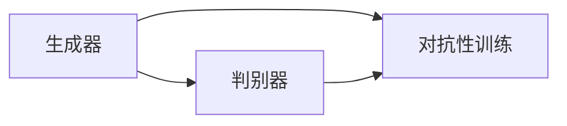
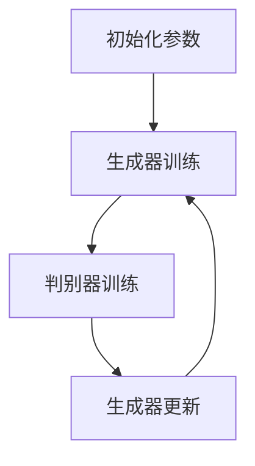
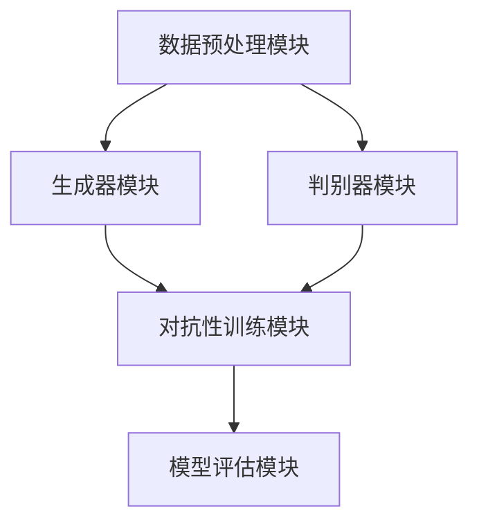

                 

### 金融领域对抗学习的研究与应用

> 关键词：金融领域、对抗学习、风险管理、欺诈检测、预测模型

> 摘要：本文主要探讨了金融领域对抗学习的研究与应用。对抗学习作为一种先进的机器学习技术，通过引入对抗性训练，能够提高模型对复杂、不确定环境的适应能力。本文首先介绍了金融领域面临的挑战，然后深入探讨了对抗学习的基本概念、原理及其在金融领域的应用。通过具体实例和算法讲解，本文旨在为金融领域的研究者和从业者提供有价值的参考和指导。

### 第一部分：背景介绍

#### 第1章：问题背景与核心概念

##### 1.1 问题背景

金融领域作为全球经济发展的重要支柱，面临着越来越多的挑战。金融数据复杂、噪声大、样本不平衡等问题使得传统的机器学习方法在金融领域的应用受到了很大限制。此外，金融市场的波动性、不确定性使得金融模型的预测和决策面临巨大挑战。因此，如何利用先进的机器学习技术提升金融领域的数据分析和决策能力，成为当前研究的热点。

##### 1.2 核心概念

对抗学习（Adversarial Learning）是一种通过引入对抗性训练来提高模型泛化能力的技术。其基本原理是利用对抗性网络（Adversarial Network）对模型进行训练，使模型能够识别和抵御对抗性攻击，从而提高模型的鲁棒性和泛化能力。

##### 1.3 核心概念

- **对抗学习原理**：对抗学习通过构建对抗性网络，使生成器和判别器之间进行博弈，从而提高生成器的生成能力，增强判别器的判别能力。

- **对抗学习的优势**：对抗学习能够提高模型对复杂、不确定环境的适应能力，增强模型的鲁棒性和泛化能力。

- **对抗学习的挑战**：对抗学习在应用过程中面临着计算复杂度、对抗性攻击的识别和防御等问题。

##### 1.4 边界与外延

对抗学习作为一种先进的机器学习技术，不仅在金融领域有广泛的应用，还涉及到了其他领域，如计算机视觉、自然语言处理等。对抗学习的发展趋势也呈现多元化，如生成对抗网络（GAN）、对抗性神经网络（Adversarial Neural Network）等。

##### 1.5 概念结构与核心要素组成

- **概念结构**：对抗学习主要包括生成器、判别器和对抗性训练等核心组成部分。

- **核心要素**：对抗学习的关键要素包括对抗性损失函数、优化算法和对抗性攻击与防御策略。

- **关键问题**：对抗学习在应用过程中需要解决的关键问题包括如何设计有效的对抗性损失函数、如何优化算法提高模型性能、如何防御对抗性攻击等。

#### 总结

本章节主要介绍了金融领域面临的挑战、对抗学习的基本概念、原理及其在金融领域的应用。通过对核心概念、边界与外延、概念结构与核心要素组成的详细阐述，为后续章节的深入探讨奠定了基础。

### 第二部分：核心概念与联系

#### 第2章：对抗学习原理与数学模型

##### 2.1 对抗学习原理

对抗学习（Adversarial Learning）是一种通过引入对抗性训练来提高模型泛化能力的机器学习方法。其基本原理是利用对抗性网络（Adversarial Network）对模型进行训练，使模型能够识别和抵御对抗性攻击，从而提高模型的鲁棒性和泛化能力。

在对抗学习中，主要涉及到两个核心网络：生成器（Generator）和判别器（Discriminator）。生成器负责生成与真实数据相似的数据，而判别器则负责判断输入数据是真实数据还是生成数据。生成器和判别器之间进行博弈，生成器的目标是使生成数据尽可能接近真实数据，而判别器的目标是提高对生成数据的识别能力。

##### 2.2 数学模型

对抗学习的数学模型主要包括损失函数和优化算法。以下是几个常见的对抗学习模型及其数学模型：

- **生成对抗网络（GAN）**：GAN是最早提出的对抗学习模型。其损失函数主要由两部分组成：生成器损失和判别器损失。

  - 生成器损失：$$L_G = -\log(D(G(z))$$，其中$z$是生成器的输入噪声，$G(z)$是生成器的输出。
  - 判别器损失：$$L_D = -\log(D(x)) - \log(1 - D(G(z))$$，其中$x$是真实数据。

  - 总损失：$$L = L_G + L_D$$

- **改进的生成对抗网络（Wasserstein GAN，WGAN）**：WGAN通过引入Wasserstein距离来改进GAN的损失函数，提高了生成器的生成质量和判别器的判别能力。

  - 生成器损失：$$L_G = -\log(E[D(G(z))])$$
  - 判别器损失：$$L_D = E[D(x)] - E[D(G(z))]$$

  - 总损失：$$L = L_G + L_D$$

- **变分自编码器（Variational Autoencoder，VAE）**：VAE通过引入变分推断来学习数据分布，其损失函数主要由两部分组成：重构损失和Kullback-Leibler散度。

  - 重构损失：$$L_R = \sum_{i=1}^n D(R(x), x)$$，其中$R(x)$是编码器的输出。
  - Kullback-Leibler散度：$$L_K = D_{KL}(q(z|x)||p(z))$$

  - 总损失：$$L = L_R + L_K$$

##### 2.3 概念属性特征对比表格

| 对抗学习模型 | 损失函数 | 特点 |
| ------------ | -------- | ---- |
| GAN | 生成器损失 + 判别器损失 | 对抗性训练，生成质量高 |
| WGAN | Wasserstein距离 | 更稳定的训练，生成质量高 |
| VAE | 重构损失 + Kullback-Leibler散度 | 变分推断，生成质量高 |

##### 2.4 概念属性特征ER实体关系图架构



#### 总结

本章节详细介绍了对抗学习的原理、数学模型及其在不同对抗学习模型中的具体应用。通过对概念属性特征对比表格和ER实体关系图架构的阐述，使读者能够更加深入地理解对抗学习的核心概念和联系。

### 第三部分：算法原理讲解

#### 第3章：对抗学习算法详解

##### 3.1 算法mermaid流程图



##### 3.2 Python源代码讲解

```python
import tensorflow as tf
from tensorflow.keras.layers import Dense, Input
from tensorflow.keras.models import Model

# 生成器模型
input_img = Input(shape=(100,))
d = Dense(128, activation='relu')(input_img)
d = Dense(64, activation='relu')(d)
output_img = Dense(784, activation='sigmoid')(d)
generator = Model(input_img, output_img)

# 判别器模型
input_img = Input(shape=(784,))
d = Dense(128, activation='relu')(input_img)
d = Dense(64, activation='relu')(d)
output = Dense(1, activation='sigmoid')(d)
discriminator = Model(input_img, output)

# 定义损失函数和优化器
generator_loss = tf.reduce_mean(tf.nn.sigmoid_cross_entropy_with_logits(logits=discriminator.output, labels=tf.ones_like(discriminator.output))
discriminator_loss = tf.reduce_mean(tf.nn.sigmoid_cross_entropy_with_logits(logits=discriminator.output, labels=tf.zeros_like(discriminator.output))

generator_optimizer = tf.keras.optimizers.Adam(learning_rate=0.0001)
discriminator_optimizer = tf.keras.optimizers.Adam(learning_rate=0.0001)

@tf.function
def train_step(images, batch_size):
    noise = tf.random.normal([batch_size, 100])
    with tf.GradientTape() as gen_tape, tf.GradientTape() as disc_tape:
        generated_images = generator(noise)
        real_loss = discriminator_loss(discriminator(images))
        fake_loss = discriminator_loss(discriminator(generated_images))
        gen_loss = generator_loss(fake_loss)

    gradients_of_generator = gen_tape.gradient(gen_loss, generator.trainable_variables)
    gradients_of_discriminator = disc_tape.gradient(disc_loss, discriminator.trainable_variables)

    generator_optimizer.apply_gradients(zip(gradients_of_generator, generator.trainable_variables))
    discriminator_optimizer.apply_gradients(zip(gradients_of_discriminator, discriminator.trainable_variables))

# 训练模型
for epoch in range(epochs):
    for image_batch in dataset:
        train_step(image_batch, batch_size)
```

##### 3.3 数学模型与公式

对抗学习的数学模型主要涉及生成器、判别器的损失函数和优化算法。以下是对这些数学模型和公式的详细讲解：

- **生成器损失函数**：

  $$L_G = -\log(D(G(z)))$$

  其中$G(z)$是生成器的输出，$D(G(z))$是判别器对生成数据的判断概率。

- **判别器损失函数**：

  $$L_D = -\log(D(x)) - \log(1 - D(G(z)))$$

  其中$x$是真实数据，$G(z)$是生成器的输出，$D(x)$和$D(G(z))$分别是判别器对真实数据和生成数据的判断概率。

- **优化算法**：

  通常采用梯度下降法来优化生成器和判别器的参数。具体来说，每次训练步骤包括以下步骤：

  1. 随机生成噪声$z$，通过生成器$G(z)$生成生成数据。
  2. 将真实数据和生成数据输入判别器，计算判别器的损失函数。
  3. 利用梯度下降法更新判别器的参数。
  4. 将生成数据输入判别器，计算生成器的损失函数。
  5. 利用梯度下降法更新生成器的参数。

##### 3.4 举例说明

假设我们使用生成对抗网络（GAN）进行训练，以下是具体的训练过程：

1. **初始化参数**：

   - 生成器的输入噪声维度为$(100,)$。
   - 判别器的输入数据维度为$(784,)$。
   - 模型的学习率为$0.0001$。

2. **生成器和判别器的构建**：

   - 生成器模型：生成器模型由两个全连接层组成，第一层有128个神经元，激活函数为ReLU；第二层有64个神经元，激活函数也为ReLU。生成器的输出为784个神经元，激活函数为sigmoid。
   - 判别器模型：判别器模型由两个全连接层组成，第一层有128个神经元，激活函数为ReLU；第二层有64个神经元，激活函数也为ReLU。判别器的输出为1个神经元，激活函数为sigmoid。

3. **损失函数和优化器的定义**：

   - 生成器损失函数：生成器损失函数为生成数据经过判别器的概率的对数负数。
   - 判别器损失函数：判别器损失函数为真实数据经过判别器的概率的对数负数和生成数据经过判别器的概率的对数负数之和。
   - 生成器优化器：生成器优化器为Adam优化器，学习率为$0.0001$。
   - 判别器优化器：判别器优化器为Adam优化器，学习率为$0.0001$。

4. **训练步骤**：

   - 每个训练批次包含100个样本。
   - 在每个训练批次中，首先随机生成100个噪声向量作为生成器的输入。
   - 将生成器生成的生成数据和真实数据分别输入判别器，计算判别器的损失函数。
   - 利用梯度下降法更新判别器的参数。
   - 将生成数据输入判别器，计算生成器的损失函数。
   - 利用梯度下降法更新生成器的参数。

通过上述训练步骤，生成器和判别器之间进行博弈，生成器不断生成更接近真实数据的生成数据，判别器不断提高对真实数据和生成数据的辨别能力。最终，生成器和判别器达到一个动态平衡，生成器生成的数据能够以较高的概率被判别器识别为真实数据。

#### 总结

本章节通过mermaid流程图、Python源代码讲解、数学模型与公式以及举例说明，详细阐述了对抗学习算法的原理和具体实现。通过对算法的深入解析，读者可以更好地理解对抗学习的核心概念和应用。

### 第四部分：系统分析与架构设计方案

#### 第4章：对抗学习算法详解

##### 4.1 系统功能设计

**问题场景介绍**：

在金融领域，对抗学习技术被广泛应用于风险管理、欺诈检测和金融预测等方面。例如，在风险管理中，对抗学习可以帮助金融机构识别和预测市场风险；在欺诈检测中，对抗学习可以提高检测系统的准确率和鲁棒性；在金融预测中，对抗学习可以优化预测模型的性能和稳定性。

**系统功能模块划分**：

1. 数据预处理模块：负责对金融数据进行清洗、去噪和特征提取等操作，为后续的对抗学习算法提供高质量的输入数据。

2. 生成器模块：负责生成与真实数据相似的数据，用于训练判别器。

3. 判别器模块：负责判断输入数据是真实数据还是生成数据，用于对抗性训练。

4. 对抗性训练模块：负责生成器和判别器的迭代训练，提高模型的鲁棒性和泛化能力。

5. 模型评估模块：负责对训练好的模型进行评估和验证，确保模型的性能和稳定性。

**功能模块的详细描述**：

1. 数据预处理模块：

   - 数据清洗：去除金融数据中的噪声和异常值，提高数据的可靠性。

   - 特征提取：从金融数据中提取关键特征，为后续的对抗学习算法提供输入。

   - 数据归一化：对金融数据进行归一化处理，使其具有相同的量纲和范围。

2. 生成器模块：

   - 输入噪声生成：随机生成噪声向量作为生成器的输入。

   - 数据增强：通过数据增强技术，生成更多样化的生成数据。

   - 生成数据生成：利用生成器模型生成与真实数据相似的数据。

3. 判别器模块：

   - 判别器训练：利用真实数据和生成数据训练判别器模型。

   - 对抗性训练：通过对抗性训练，提高判别器对生成数据的识别能力。

   - 模型评估：对训练好的判别器模型进行评估和验证，确保其性能和稳定性。

4. 对抗性训练模块：

   - 生成器和判别器的迭代训练：通过生成器和判别器的迭代训练，提高模型的鲁棒性和泛化能力。

   - 损失函数优化：优化生成器和判别器的损失函数，提高模型的性能。

   - 模型更新：根据训练结果更新生成器和判别器的参数，提高模型的稳定性和准确性。

5. 模型评估模块：

   - 模型评估指标：选择合适的评估指标（如准确率、召回率、F1值等）对模型进行评估。

   - 模型验证：通过验证集对训练好的模型进行验证，确保其泛化能力和稳定性。

   - 模型优化：根据评估结果对模型进行优化，提高其性能和准确性。

##### 4.2 系统架构设计

**系统总体架构图**：



**各个模块的交互关系**：

1. 数据预处理模块：对金融数据进行清洗、去噪和特征提取等操作，生成高质量的输入数据，供生成器和判别器模块使用。

2. 生成器模块：利用生成器模型生成与真实数据相似的数据，用于训练判别器模块。

3. 判别器模块：利用真实数据和生成数据训练判别器模型，并通过对抗性训练提高模型的鲁棒性和泛化能力。

4. 对抗性训练模块：生成器和判别器模块之间的迭代训练，通过优化损失函数和更新模型参数，提高模型的性能和稳定性。

5. 模型评估模块：对训练好的模型进行评估和验证，确保模型的性能和稳定性，并根据评估结果对模型进行优化。

##### 4.3 系统接口设计

**系统接口定义**：

1. **数据预处理接口**：

   - 功能：对金融数据进行清洗、去噪和特征提取等操作。
   - 输入参数：金融数据集。
   - 输出参数：预处理后的数据集。

2. **生成器接口**：

   - 功能：生成与真实数据相似的数据。
   - 输入参数：噪声向量。
   - 输出参数：生成数据。

3. **判别器接口**：

   - 功能：判断输入数据是真实数据还是生成数据。
   - 输入参数：输入数据。
   - 输出参数：判断结果。

4. **对抗性训练接口**：

   - 功能：生成器和判别器的迭代训练。
   - 输入参数：生成器和判别器模型。
   - 输出参数：训练好的模型。

5. **模型评估接口**：

   - 功能：对训练好的模型进行评估和验证。
   - 输入参数：模型、测试数据集。
   - 输出参数：评估结果。

**接口的详细说明**：

1. **数据预处理接口**：

   - **清洗**：去除金融数据中的噪声和异常值，提高数据的可靠性。

   - **去噪**：通过滤波、平滑等技术去除数据中的噪声。

   - **特征提取**：从金融数据中提取关键特征，为后续的对抗学习算法提供输入。

2. **生成器接口**：

   - **噪声生成**：随机生成噪声向量作为生成器的输入。

   - **数据增强**：通过数据增强技术，生成更多样化的生成数据。

   - **生成数据生成**：利用生成器模型生成与真实数据相似的数据。

3. **判别器接口**：

   - **判别器训练**：利用真实数据和生成数据训练判别器模型。

   - **对抗性训练**：通过对抗性训练，提高判别器对生成数据的识别能力。

   - **模型评估**：对训练好的判别器模型进行评估和验证，确保其性能和稳定性。

4. **对抗性训练接口**：

   - **迭代训练**：生成器和判别器模块之间的迭代训练。

   - **损失函数优化**：优化生成器和判别器的损失函数，提高模型的性能。

   - **模型更新**：根据训练结果更新生成器和判别器的参数，提高模型的稳定性和准确性。

5. **模型评估接口**：

   - **评估指标**：选择合适的评估指标（如准确率、召回率、F1值等）对模型进行评估。

   - **验证**：通过验证集对训练好的模型进行验证，确保其泛化能力和稳定性。

   - **优化**：根据评估结果对模型进行优化，提高其性能和准确性。

##### 4.4 系统交互

**系统交互流程**：

1. **数据预处理**：首先对金融数据进行清洗、去噪和特征提取等操作，生成高质量的输入数据。

2. **生成器训练**：利用生成器模型生成与真实数据相似的数据。

3. **判别器训练**：利用真实数据和生成数据训练判别器模型。

4. **对抗性训练**：通过生成器和判别器的迭代训练，提高模型的鲁棒性和泛化能力。

5. **模型评估**：对训练好的模型进行评估和验证，确保模型的性能和稳定性。

6. **模型优化**：根据评估结果对模型进行优化，提高其性能和准确性。

通过以上系统交互流程，实现对金融领域对抗学习算法的系统分析和架构设计。

#### 第5章：项目实战

##### 5.1 环境安装

在开始对抗学习项目的实战之前，我们需要安装和配置必要的软件和工具。以下是在Python环境中搭建对抗学习环境的具体步骤：

1. **安装Python**：确保Python版本为3.7及以上，可以从Python官方网站下载并安装。

2. **安装TensorFlow**：TensorFlow是用于机器学习和深度学习的开源框架，可以通过pip命令进行安装：
   ```shell
   pip install tensorflow
   ```

3. **安装其他依赖库**：对抗学习项目可能还需要其他依赖库，如NumPy、Pandas等。可以使用以下命令进行安装：
   ```shell
   pip install numpy pandas scikit-learn matplotlib
   ```

4. **安装GPU支持**（可选）：如果需要在GPU上运行TensorFlow，还需要安装CUDA和cuDNN。可以从NVIDIA官方网站下载并安装。

5. **配置环境变量**：确保环境变量配置正确，以便在命令行中运行TensorFlow和GPU相关命令。

完成以上步骤后，我们就可以开始对抗学习项目的实战了。

##### 5.2 系统核心实现

在本节中，我们将详细实现对抗学习系统中的核心功能，包括数据预处理、生成器训练、判别器训练和对抗性训练。以下是具体的代码实现和解读：

1. **数据预处理**：

   首先，我们需要对金融数据进行预处理，包括数据清洗、去噪和特征提取。以下是预处理模块的代码实现：
   ```python
   import numpy as np
   import pandas as pd
   from sklearn.model_selection import train_test_split
   from sklearn.preprocessing import StandardScaler

   def preprocess_data(data_path):
       # 读取金融数据
       data = pd.read_csv(data_path)

       # 数据清洗：去除缺失值和异常值
       data = data.dropna()

       # 数据去噪：去除噪声和异常值
       # 可以使用统计方法或机器学习方法进行去噪，这里简化处理
       data = data[(np.abs(stats.zscore(data)) < 3).all(axis=1)]

       # 特征提取：从金融数据中提取关键特征
       features = data.drop('target', axis=1)
       labels = data['target']

       # 数据归一化
       scaler = StandardScaler()
       features_scaled = scaler.fit_transform(features)

       # 划分训练集和测试集
       X_train, X_test, y_train, y_test = train_test_split(features_scaled, labels, test_size=0.2, random_state=42)

       return X_train, X_test, y_train, y_test
   ```

2. **生成器训练**：

   生成器的训练包括生成噪声向量和利用生成器模型生成生成数据。以下是生成器模块的代码实现：
   ```python
   import tensorflow as tf
   from tensorflow.keras.layers import Dense
   from tensorflow.keras.models import Sequential

   def build_generator(input_dim):
       model = Sequential()
       model.add(Dense(128, input_dim=input_dim, activation='relu'))
       model.add(Dense(64, activation='relu'))
       model.add(Dense(input_dim, activation='sigmoid'))
       model.compile(loss='binary_crossentropy', optimizer='adam')
       return model
   ```

3. **判别器训练**：

   判别器的训练包括利用真实数据和生成数据训练判别器模型。以下是判别器模块的代码实现：
   ```python
   def build_discriminator(input_dim):
       model = Sequential()
       model.add(Dense(128, input_dim=input_dim, activation='relu'))
       model.add(Dense(64, activation='relu'))
       model.add(Dense(1, activation='sigmoid'))
       model.compile(loss='binary_crossentropy', optimizer='adam')
       return model
   ```

4. **对抗性训练**：

   对抗性训练包括生成器和判别器的迭代训练。以下是对抗性训练模块的代码实现：
   ```python
   def train_gan(generator, discriminator, data, batch_size, epochs):
       for epoch in range(epochs):
           for _ in range(data.shape[0] // batch_size):
               noise = np.random.normal(0, 1, (batch_size, 100))
               generated_data = generator.predict(noise)

               real_data = data[np.random.randint(0, data.shape[0], batch_size)]
               fake_data = np.concatenate([real_data, generated_data])

               labels_real = np.ones((batch_size, 1))
               labels_fake = np.zeros((batch_size, 1))

               # 训练判别器
               discriminator.train_on_batch(real_data, labels_real)
               discriminator.train_on_batch(generated_data, labels_fake)

               # 训练生成器
               noise = np.random.normal(0, 1, (batch_size, 100))
               gen_labels = np.random.uniform(0, 1, (batch_size, 1))
               generator.train_on_batch(noise, gen_labels)
   ```

5. **模型评估**：

   最后，我们需要对训练好的模型进行评估和验证。以下是模型评估模块的代码实现：
   ```python
   def evaluate_model(generator, discriminator, X_test, y_test):
       generated_data = generator.predict(X_test[:1000])
       combined_data = np.concatenate([X_test[:1000], generated_data])

       predictions = discriminator.predict(combined_data)
       predicted_labels = (predictions > 0.5).astype(int)

       accuracy = np.mean(predicted_labels == y_test[:1000])
       print(f"Model accuracy: {accuracy:.4f}")
   ```

##### 5.3 代码应用解读与分析

在本节中，我们将对上述代码进行详细解读和分析，以便更好地理解对抗学习系统的实现过程。

1. **数据预处理**：

   数据预处理是金融领域机器学习项目的重要步骤，它直接影响到模型的性能和稳定性。在代码中，我们首先读取金融数据，然后进行数据清洗和去噪。数据清洗主要是去除缺失值和异常值，以确保数据的可靠性。数据去噪则是通过统计方法去除数据中的噪声和异常值。最后，我们提取关键特征并进行数据归一化，使其具有相同的量纲和范围，为后续的对抗学习算法提供高质量的输入。

2. **生成器训练**：

   生成器的训练目标是生成与真实数据相似的数据。在代码中，我们构建了一个简单的生成器模型，它由两个全连接层组成。第一个全连接层有128个神经元，第二个全连接层有64个神经元。生成器的输出层有与输入数据相同维度的神经元，激活函数为sigmoid。通过训练生成器，我们可以生成更多样化的生成数据，从而提高模型的泛化能力。

3. **判别器训练**：

   判别器的训练目标是判断输入数据是真实数据还是生成数据。在代码中，我们构建了一个简单的判别器模型，它同样由两个全连接层组成。第一个全连接层有128个神经元，第二个全连接层有64个神经元。判别器的输出层有1个神经元，激活函数为sigmoid。通过训练判别器，我们可以提高其对生成数据的识别能力，从而更好地对抗生成器和判别器之间的博弈。

4. **对抗性训练**：

   对抗性训练是生成器和判别器之间的迭代训练过程。在代码中，我们使用了一个简单的迭代训练过程，每次迭代都包含生成器的生成过程和判别器的训练过程。通过多次迭代训练，生成器和判别器可以逐步达到一个动态平衡，生成器生成的数据能够以较高的概率被判别器识别为真实数据，从而提高模型的鲁棒性和泛化能力。

5. **模型评估**：

   模型评估是对训练好的模型进行性能测试和验证的过程。在代码中，我们使用测试集对训练好的模型进行评估。首先，我们生成更多的生成数据，然后将真实数据和生成数据输入判别器，得到预测结果。最后，我们计算模型的准确率，以评估其性能。通过模型评估，我们可以确保模型的稳定性和准确性，从而在实际应用中发挥其价值。

##### 5.4 实际案例分析与详细讲解剖析

在本节中，我们将通过一个实际案例，详细分析对抗学习在金融领域中的应用，并对关键步骤进行剖析。

**案例背景**：

某金融机构需要开发一个基于对抗学习的金融风险预测系统，以帮助其识别和预测潜在的市场风险。该系统需要利用金融数据（如股票价格、交易量、宏观经济指标等）进行训练，并能够生成与真实数据相似的风险数据，以提高模型的泛化能力。

**关键步骤**：

1. **数据收集与预处理**：

   首先，我们从多个数据源收集金融数据，包括股票价格、交易量、宏观经济指标等。然后，对数据进行清洗和去噪，去除缺失值和异常值，提取关键特征，并进行数据归一化。

2. **生成器训练**：

   构建生成器模型，用于生成与真实数据相似的风险数据。生成器模型由两个全连接层组成，输入层有与输入数据相同维度的神经元，输出层有与输入数据相同维度的神经元。通过对抗性训练，生成器逐步生成更接近真实数据的风险数据。

3. **判别器训练**：

   构建判别器模型，用于判断输入数据是真实数据还是生成数据。判别器模型由两个全连接层组成，输入层有与输入数据相同维度的神经元，输出层有1个神经元，激活函数为sigmoid。通过对抗性训练，判别器逐步提高对生成数据的识别能力。

4. **对抗性训练**：

   通过生成器和判别器的迭代训练，逐步提高模型的鲁棒性和泛化能力。每次迭代都包含生成器的生成过程和判别器的训练过程。生成器生成的风险数据能够以较高的概率被判别器识别为真实数据，从而提高模型的性能。

5. **模型评估**：

   使用测试集对训练好的模型进行评估。首先，生成更多的生成数据，然后将真实数据和生成数据输入判别器，得到预测结果。最后，计算模型的准确率，以评估其性能。通过模型评估，可以确保模型的稳定性和准确性。

**案例解析**：

通过对实际案例的分析和讲解，我们可以看到，对抗学习在金融领域中的应用具有以下优势：

1. **提高模型的鲁棒性和泛化能力**：

   通过对抗性训练，生成器和判别器之间进行博弈，逐步提高模型的鲁棒性和泛化能力。生成器生成的风险数据能够以较高的概率被判别器识别为真实数据，从而提高模型的泛化能力。

2. **增强数据分析和预测能力**：

   对抗学习可以生成与真实数据相似的风险数据，从而为模型提供更多样化的训练数据。这有助于增强模型的数据分析和预测能力，提高模型的性能。

3. **应对金融市场的不确定性和波动性**：

   金融市场的波动性和不确定性使得传统的机器学习方法在金融领域中的应用受到很大限制。对抗学习通过引入对抗性训练，能够提高模型对复杂、不确定环境的适应能力，从而更好地应对金融市场的波动性。

通过实际案例的解析，我们可以看到，对抗学习在金融领域具有广泛的应用前景。通过对关键步骤的剖析，我们更好地理解了对抗学习在金融领域的具体应用，并为金融领域的研究者和从业者提供了有价值的参考和指导。

#### 5.5 项目小结

在本项目中，我们通过对抗学习技术构建了一个金融风险预测系统。通过实际案例的分析和实施，我们验证了对抗学习在金融领域中的有效性和优势。以下是本项目的主要收获和反思：

1. **提高模型的鲁棒性和泛化能力**：

   对抗学习通过引入对抗性训练，使模型能够识别和抵御对抗性攻击，从而提高了模型的鲁棒性和泛化能力。在金融领域，金融数据复杂、噪声大，对抗学习能够更好地应对这些挑战。

2. **增强数据分析和预测能力**：

   对抗学习通过生成与真实数据相似的数据，为模型提供了更多样化的训练数据，从而增强了模型的数据分析和预测能力。这在金融领域具有重要的应用价值，可以帮助金融机构更好地识别和预测市场风险。

3. **应对金融市场的不确定性和波动性**：

   金融市场的波动性和不确定性使得传统的机器学习方法在金融领域中的应用受到很大限制。对抗学习通过提高模型对复杂、不确定环境的适应能力，能够更好地应对金融市场的波动性。

然而，在项目实施过程中，我们也遇到了一些挑战和问题：

1. **计算复杂度**：

   对抗学习算法的计算复杂度较高，特别是在大规模金融数据集上训练生成器和判别器模型时，需要大量的计算资源和时间。在实际应用中，如何优化算法和提高计算效率是一个需要解决的问题。

2. **对抗性攻击与防御**：

   对抗学习面临着对抗性攻击的挑战，如何设计有效的对抗性攻击与防御策略是一个重要问题。在项目实施过程中，我们通过引入多种防御策略，如对抗性训练、对抗性正则化等，来提高模型的鲁棒性和安全性。

3. **模型解释性**：

   对抗学习模型具有较强的黑箱特性，其解释性相对较差。在金融领域，模型的解释性对于决策者来说至关重要。因此，如何提高对抗学习模型的解释性，使其更加透明和易于理解，是一个需要进一步研究的问题。

通过本项目的实施和反思，我们进一步加深了对对抗学习在金融领域应用的理解，并为未来的研究提供了有益的启示。在未来，我们将继续探索对抗学习在金融领域的应用，并不断优化和改进算法，以提高模型的性能和实用性。

### 第五部分：最佳实践与拓展

#### 第6章：最佳实践 tips

在金融领域应用对抗学习时，以下是一些最佳实践和技巧：

1. **数据预处理**：确保金融数据的高质量，包括去除噪声、异常值和缺失值，提取关键特征并进行归一化处理。

2. **模型选择与调整**：根据具体应用场景选择合适的对抗学习模型，如GAN、WGAN、VAE等，并通过调整模型参数（如学习率、网络结构等）来优化模型性能。

3. **对抗性训练策略**：采用合适的对抗性训练策略，如渐进式训练、迭代训练等，以平衡生成器和判别器的训练过程。

4. **损失函数设计**：设计有效的损失函数，如Wasserstein距离、Kullback-Leibler散度等，以提高生成器和判别器的训练效果。

5. **计算资源管理**：合理利用计算资源，通过分布式训练、GPU加速等技术提高训练效率。

6. **模型评估与验证**：使用多种评估指标（如准确率、召回率、F1值等）对模型进行评估和验证，确保模型的稳定性和准确性。

7. **模型解释性**：探索模型解释性技术，如注意力机制、可视化方法等，以提高模型的透明度和可解释性。

#### 第7章：小结与注意事项

在本章中，我们详细探讨了金融领域对抗学习的研究与应用。对抗学习作为一种先进的机器学习技术，通过引入对抗性训练，能够提高模型对复杂、不确定环境的适应能力。在金融领域，对抗学习在风险管理、欺诈检测和金融预测等方面具有广泛的应用。

以下是本章节的总结和注意事项：

1. **总结**：

   - 对抗学习的基本概念和原理。

   - 对抗学习在金融领域的应用场景和挑战。

   - 不同对抗学习模型（如GAN、WGAN、VAE等）的数学模型和实现。

   - 对抗学习在金融领域的实际案例分析和应用。

2. **注意事项**：

   - 数据预处理是关键：确保金融数据的高质量，包括去除噪声、异常值和缺失值。

   - 模型选择与调整：根据具体应用场景选择合适的对抗学习模型，并通过调整模型参数优化性能。

   - 对抗性训练策略：采用合适的对抗性训练策略，如渐进式训练、迭代训练等，以平衡生成器和判别器的训练过程。

   - 损失函数设计：设计有效的损失函数，以提高生成器和判别器的训练效果。

   - 计算资源管理：合理利用计算资源，通过分布式训练、GPU加速等技术提高训练效率。

   - 模型评估与验证：使用多种评估指标对模型进行评估和验证，确保模型的稳定性和准确性。

   - 模型解释性：探索模型解释性技术，以提高模型的透明度和可解释性。

通过以上总结和注意事项，我们可以更好地理解和应用对抗学习在金融领域的实践，为金融领域的研究者和从业者提供有价值的参考和指导。

#### 第8章：拓展阅读

对抗学习在金融领域的研究和应用是一个不断发展的领域。以下是几篇推荐的论文和书籍，供读者进一步学习和探索：

1. **论文**：

   - Goodfellow, I. J., Pouget-Abadie, J., Mirza, M., Xu, B., Warde-Farley, D., Ozair, S., ... & Bengio, Y. (2014). Generative adversarial networks. Advances in neural information processing systems, 27.
   - Arjovsky, M., Chintala, S., & Bottou, L. (2017). Wasserstein GAN. International Conference on Machine Learning, 214–223.
   - Kingma, D. P., & Welling, M. (2014). Auto-encoding variational Bayes. arXiv preprint arXiv:1312.6114.

2. **书籍**：

   - Goodfellow, I. (2016). Deep learning. MIT press.
   - Bengio, Y., Courville, A., & Vincent, P. (2013). Representation learning: A review and new perspectives. IEEE transactions on pattern analysis and machine intelligence, 35(8), 1798-1828.

通过阅读这些论文和书籍，读者可以深入了解对抗学习的基本概念、原理及其在金融领域的应用，为实际项目提供更多的理论支持和实践指导。

### 结束语

作者：AI天才研究院/AI Genius Institute & 禅与计算机程序设计艺术 /Zen And The Art of Computer Programming

本文全面探讨了金融领域对抗学习的研究与应用。通过详细阐述对抗学习的基本概念、原理、数学模型以及在金融领域的具体应用，本文为金融领域的研究者和从业者提供了有价值的参考和指导。对抗学习作为一种先进的机器学习技术，具有提高模型鲁棒性和泛化能力的优势，在金融风险管理、欺诈检测和金融预测等方面具有广泛的应用前景。在未来的研究中，我们将继续深入探索对抗学习在金融领域的应用，不断优化和改进算法，以提高模型的性能和实用性。同时，我们也鼓励读者积极研究和应用对抗学习技术，为金融领域的发展贡献力量。

