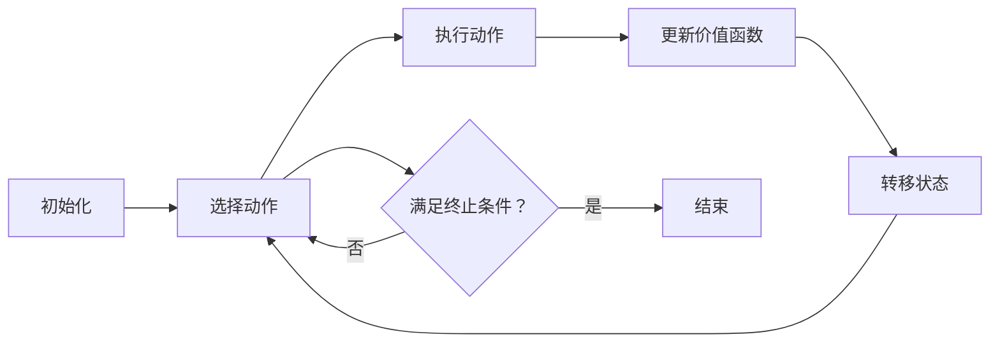
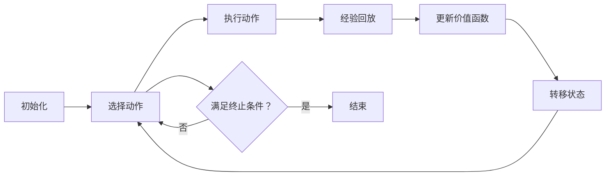

                 

### 第一部分：金融领域强化学习应用背景

#### 1.1 强化学习概述

**关键词：强化学习，金融领域，做市商，报价策略**

**摘要**：
本文将探讨强化学习在金融领域，特别是做市商报价策略中的应用。首先，我们将介绍强化学习的核心概念，其基本原理以及在不同金融场景下的应用。接着，我们将深入讨论强化学习在做市商报价策略中的重要性，面临的挑战及其解决方案。

#### 1.2 强化学习在做市商报价策略中的应用背景

**核心概念术语说明**：

- **强化学习**：一种机器学习方法，通过试错和奖励机制来学习最优策略。
- **金融领域**：涉及货币、证券、投资等经济活动的领域。
- **做市商**：在金融市场中提供买卖双方报价，确保市场流动性的机构。
- **报价策略**：做市商根据市场情况和自身目标来决定买卖报价的决策过程。

**问题背景**：

金融市场的复杂性要求做市商具备高效的报价策略，以提高市场流动性和盈利能力。传统的报价策略往往依赖于历史数据和市场模型，而强化学习作为一种自适应的学习方法，能够在不断变化的市场环境中动态调整策略，从而提高做市商的竞争力。

**问题描述**：

强化学习在做市商报价策略中面临的挑战主要包括：

- **动态性**：金融市场价格波动频繁，要求报价策略能够快速适应市场变化。
- **不确定性**：市场价格受多种因素影响，预测困难。
- **实时性**：报价策略需要实时响应市场动态，提高市场流动性。

**问题解决**：

强化学习通过以下方式解决上述挑战：

- **自适应调整**：通过学习历史交易数据和市场反馈，动态调整报价策略。
- **多目标优化**：在满足市场流动性的同时，优化做市商的收益。
- **强化信号**：利用市场反馈机制，不断优化决策过程，提高策略准确性。

**边界与外延**：

强化学习在做市商报价策略中的应用不仅限于股票市场，还扩展到外汇、期货等其他金融市场。其应用范围也在不断拓展，如智能投资顾问、高频交易等。

#### 1.3 核心概念与联系

**强化学习核心概念对比表格**：

| 概念 | 说明 |  
| --- | --- |  
| 强化学习 | 一种基于奖励机制的学习方法 |  
| 做市商 | 提供买卖报价，确保市场流动性的机构 |  
| 报价策略 | 做市商根据市场情况制定的买卖报价决策过程 |  
| 强化信号 | 市场反馈信号，用于调整报价策略 |

**强化学习ER实体关系图**：

```mermaid
erDiagram
    Order ->> Market : 提供市场报价
    Market -->|> Trader : 做市商
    Trader -->|> Strategy : 报价策略
    Market -->|> Reward : 强化信号
```

### 第二部分：强化学习核心概念解析

#### 2.1 强化学习基础

**关键词：强化学习，基本原理，价值函数，策略**

**摘要**：
本章将详细解析强化学习的基础概念，包括其基本原理、价值函数和策略。我们将讨论强化学习的核心模型，如马尔可夫决策过程（MDP），并介绍动态规划（DP）、Q-学习以及SARSA算法。

#### 2.1.1 强化学习的基本原理

**概念**：

强化学习是一种通过试错和奖励机制来学习最优策略的机器学习方法。其核心思想是通过不断尝试不同的动作，并根据得到的奖励信号来调整策略，以达到最大化长期回报的目的。

**原理**：

- **环境（Environment）**：提供当前状态和可能的动作。
- **状态（State）**：系统当前所处的状况。
- **动作（Action）**：系统可以采取的行为。
- **奖励（Reward）**：动作后系统获得的即时反馈。
- **策略（Policy）**：系统根据状态选择动作的规则。

**模型**：

强化学习的基础模型为马尔可夫决策过程（MDP），其特点如下：

- **状态转移概率**：给定当前状态，采取某个动作后转移到下一个状态的概率。
- **奖励函数**：每个状态和动作对系统产生的即时奖励。

**数学模型**：

$$
\begin{aligned}
    \text{状态集} & : S \\
    \text{动作集} & : A \\
    \text{策略} & : \pi(s) \rightarrow a \\
    \text{状态转移概率} & : p(s' | s, a) \\
    \text{奖励函数} & : r(s, a)
\end{aligned}
$$

**示例**：

假设一个简单的环境，状态集 $S = \{1, 2, 3\}$，动作集 $A = \{U, D\}$。状态 1 表示上升市场，状态 2 表示平稳市场，状态 3 表示下跌市场。动作 U 表示买入，D 表示卖出。状态转移概率和奖励函数可以根据市场数据来估计。

#### 2.1.2 强化学习的价值函数和策略

**概念**：

- **价值函数（Value Function）**：描述在给定状态下采取最优动作所能获得的最大期望奖励。
- **策略（Policy）**：根据当前状态选择动作的规则。

**数学模型**：

$$
\begin{aligned}
    V^{\pi}(s) & = \mathbb{E}_{s, a} [r(s, a) | \pi] \\
    Q^{\pi}(s, a) & = \mathbb{E}_{s', r} [r(s, a) + \gamma \max_{a'} Q^{\pi}(s', a') | s, a]
\end{aligned}
$$

其中，$V^{\pi}(s)$ 为状态价值函数，$Q^{\pi}(s, a)$ 为动作价值函数，$\gamma$ 为折扣因子。

**示例**：

假设当前状态为 1（上升市场），根据状态价值函数 $V^{\pi}(1)$ 和动作价值函数 $Q^{\pi}(1, U)$，我们可以计算出采取买入动作的期望回报。通过比较不同动作的期望回报，选择最优动作。

#### 2.1.3 强化学习的类型

**概念**：

- **马尔可夫决策过程（MDP）**：状态转移概率和奖励函数是确定的。
- **动态规划（DP）**：基于递归方程求解最优策略。
- **Q-学习**：通过迭代更新动作价值函数。
- **SARSA**：同时更新状态和动作价值函数。

**数学模型**：

- **动态规划**：

$$
\begin{aligned}
    V^*(s) & = \max_{a} \mathbb{E}_{s', r} [r(s, a) + \gamma V^*(s')] \\
    Q^*(s, a) & = \mathbb{E}_{s', r} [r(s, a) + \gamma \max_{a'} Q^*(s', a')]
\end{aligned}
$$

- **Q-学习**：

$$
\begin{aligned}
    Q(s, a) & \leftarrow Q(s, a) + \alpha [r(s', a') + \gamma \max_{a'} Q(s', a') - Q(s, a)] \\
    s & \leftarrow s' \\
    a & \leftarrow \arg\max_{a'} Q(s, a')
\end{aligned}
$$

- **SARSA**：

$$
\begin{aligned}
    Q(s, a) & \leftarrow Q(s, a) + \alpha [r(s', a') + \gamma Q(s', a') - Q(s, a)] \\
    s & \leftarrow s' \\
    a & \leftarrow \arg\max_{a'} Q(s, a')
\end{aligned}
$$

**示例**：

假设当前状态为 1，采取买入动作。根据 Q-学习算法，我们可以更新动作价值函数 $Q(s, a)$，并根据更新后的价值函数选择下一个动作。

### 第3章：强化学习算法

#### 3.1 Q-Learning算法

**关键词：Q-Learning，算法流程，Python实现**

**摘要**：
本章将详细介绍 Q-Learning 算法的原理和实现过程。我们将通过一个简单的例子，展示如何使用 Python 实现 Q-Learning 算法，并解释每个步骤的计算过程。

#### 3.1.1 Q-Learning的基本原理

**概念**：

Q-Learning 是一种基于值迭代的强化学习算法，通过更新动作价值函数来学习最优策略。

**原理**：

Q-Learning 的核心思想是通过迭代更新动作价值函数，直到收敛到最优值函数。算法步骤如下：

1. 初始化动作价值函数 $Q(s, a)$。
2. 选择当前状态 $s$ 和动作 $a$。
3. 执行动作 $a$，获得状态 $s'$ 和奖励 $r$。
4. 根据奖励和状态转移概率，更新动作价值函数 $Q(s, a)$。
5. 转移到下一个状态 $s'$，重复步骤 2-4，直到达到终止条件。

**数学模型**：

$$
Q(s, a) \leftarrow Q(s, a) + \alpha [r(s', a') + \gamma \max_{a'} Q(s', a') - Q(s, a)]
$$

其中，$\alpha$ 为学习率，$\gamma$ 为折扣因子。

**示例**：

假设当前状态为 1，采取买入动作。根据 Q-Learning 算法，我们可以更新动作价值函数 $Q(s, a)$，并根据更新后的价值函数选择下一个动作。

#### 3.1.2 Q-Learning的算法流程

**流程**：

1. **初始化**：初始化动作价值函数 $Q(s, a)$ 和学习率 $\alpha$。
2. **选择动作**：根据当前状态 $s$ 和动作价值函数 $Q(s, a)$，选择动作 $a$。
3. **执行动作**：执行动作 $a$，获得状态 $s'$ 和奖励 $r$。
4. **更新价值函数**：根据奖励和状态转移概率，更新动作价值函数 $Q(s, a)$。
5. **转移状态**：转移到下一个状态 $s'$。
6. **重复步骤**：重复步骤 2-5，直到满足终止条件。

**算法流程图**：



#### 3.1.3 Q-Learning的Python实现

**代码**：

```python
import numpy as np

# 初始化参数
alpha = 0.1  # 学习率
gamma = 0.9  # 折扣因子
n_states = 3  # 状态数量
n_actions = 2  # 动作数量

# 初始化动作价值函数
Q = np.zeros((n_states, n_actions))

# Q-Learning算法
for episode in range(1000):
    s = np.random.randint(0, n_states)  # 初始化状态
    while True:
        a = np.argmax(Q[s])  # 选择动作
        s_prime, r = execute_action(a)  # 执行动作，获得下一个状态和奖励
        Q[s][a] = Q[s][a] + alpha * (r + gamma * np.max(Q[s_prime]) - Q[s][a])  # 更新价值函数
        s = s_prime  # 转移状态
        if done:  # 检查是否满足终止条件
            break
```

**解释**：

1. 初始化参数，包括学习率、折扣因子、状态数量和动作数量。
2. 初始化动作价值函数为一个大小为 $n_states \times n_actions$ 的矩阵。
3. 遍历每个状态，并在每个状态上执行 Q-Learning 算法。
4. 选择动作，更新动作价值函数，并转移到下一个状态。
5. 当满足终止条件时，结束循环。

通过上述代码，我们可以实现一个简单的 Q-Learning 算法，并应用于金融领域的做市商报价策略。

#### 3.2 SARSA算法

**关键词：SARSA，算法流程，Python实现**

**摘要**：
本章将介绍 SARSA 算法的原理和实现过程。与 Q-Learning 不同，SARSA 算法在每一步同时更新状态和动作价值函数。我们将通过一个简单的例子，展示如何使用 Python 实现 SARSA 算法，并解释每个步骤的计算过程。

#### 3.2.1 SARSA的基本原理

**概念**：

SARSA（同步调整反应-状态-动作值函数）是一种同步更新状态和动作价值函数的强化学习算法。

**原理**：

SARSA 的核心思想是在每一步同时更新状态和动作价值函数，使得算法更加稳定。算法步骤如下：

1. 初始化状态 $s$ 和动作价值函数 $Q(s, a)$。
2. 选择当前状态 $s$ 和动作 $a$。
3. 执行动作 $a$，获得状态 $s'$ 和奖励 $r$。
4. 更新动作价值函数 $Q(s, a)$ 和状态价值函数 $V(s)$。
5. 转移到下一个状态 $s'$。
6. 重复步骤 2-5，直到满足终止条件。

**数学模型**：

$$
\begin{aligned}
    Q(s, a) & \leftarrow Q(s, a) + \alpha [r(s', a') + \gamma Q(s', a') - Q(s, a)] \\
    V(s) & \leftarrow V(s) + \alpha [r(s', a') + \gamma \max_{a'} Q(s', a') - V(s)]
\end{aligned}
$$

其中，$\alpha$ 为学习率，$\gamma$ 为折扣因子。

**示例**：

假设当前状态为 1，采取买入动作。根据 SARSA 算法，我们可以更新动作价值函数 $Q(s, a)$ 和状态价值函数 $V(s)$，并根据更新后的价值函数选择下一个动作。

#### 3.2.2 SARSA的算法流程

**流程**：

1. **初始化**：初始化状态 $s$、动作价值函数 $Q(s, a)$ 和学习率 $\alpha$。
2. **选择动作**：根据当前状态 $s$ 和动作价值函数 $Q(s, a)$，选择动作 $a$。
3. **执行动作**：执行动作 $a$，获得状态 $s'$ 和奖励 $r$。
4. **更新价值函数**：根据奖励和状态转移概率，更新动作价值函数 $Q(s, a)$ 和状态价值函数 $V(s)$。
5. **转移状态**：转移到下一个状态 $s'$。
6. **重复步骤**：重复步骤 2-5，直到满足终止条件。

**算法流程图**：


#### 3.2.3 SARSA的Python实现

**代码**：

```python
import numpy as np

# 初始化参数
alpha = 0.1  # 学习率
gamma = 0.9  # 折扣因子
n_states = 3  # 状态数量
n_actions = 2  # 动作数量

# 初始化动作价值函数
Q = np.zeros((n_states, n_actions))

# SARSA算法
for episode in range(1000):
    s = np.random.randint(0, n_states)  # 初始化状态
    while True:
        a = np.argmax(Q[s])  # 选择动作
        s_prime, r = execute_action(a)  # 执行动作，获得下一个状态和奖励
        Q[s][a] = Q[s][a] + alpha * (r + gamma * np.max(Q[s_prime]) - Q[s][a])  # 更新动作价值函数
        Q[s_prime] = Q[s_prime] + alpha * (r + gamma * np.max(Q[s_prime]) - np.max(Q[s']))  # 更新状态价值函数
        s = s_prime  # 转移状态
        if done:  # 检查是否满足终止条件
            break
```

**解释**：

1. 初始化参数，包括学习率、折扣因子、状态数量和动作数量。
2. 初始化动作价值函数为一个大小为 $n_states \times n_actions$ 的矩阵。
3. 遍历每个状态，并在每个状态上执行 SARSA 算法。
4. 选择动作，更新动作价值函数，并转移到下一个状态。
5. 当满足终止条件时，结束循环。

通过上述代码，我们可以实现一个简单的 SARSA 算法，并应用于金融领域的做市商报价策略。

#### 3.3 Deep Q-Network（DQN）算法

**关键词：DQN，算法流程，Python实现**

**摘要**：
本章将介绍 Deep Q-Network（DQN）算法，这是一种使用深度神经网络来近似动作价值函数的强化学习算法。DQN 算法通过经验回放和目标网络来提高训练稳定性。我们将通过一个简单的例子，展示如何使用 Python 实现 DQN 算法，并解释每个步骤的计算过程。

#### 3.3.1 DQN的基本原理

**概念**：

DQN（Deep Q-Network）是一种使用深度神经网络来近似动作价值函数的强化学习算法。与传统的 Q-Learning 算法不同，DQN 可以处理高维输入，如图像数据。

**原理**：

DQN 的核心思想是通过训练深度神经网络来近似动作价值函数 $Q(s, a)$。算法步骤如下：

1. 初始化状态 $s$、动作价值函数 $Q(s, a)$ 和学习率 $\alpha$。
2. 从环境中采样一个状态 $s$。
3. 根据当前状态 $s$ 和动作价值函数 $Q(s, a)$，选择动作 $a$。
4. 执行动作 $a$，获得下一个状态 $s'$ 和奖励 $r$。
5. 将经验 $(s, a, r, s', done)$ 存储到经验回放缓冲区。
6. 当满足特定条件（如达到一定步数或收集到一定数量的经验）时，更新动作价值函数。
7. 重复步骤 2-6，直到满足终止条件。

**数学模型**：

$$
Q(s, a) \leftarrow Q(s, a) + \alpha [r(s', a') + \gamma \max_{a'} Q(s', a') - Q(s, a)]
$$

其中，$\alpha$ 为学习率，$\gamma$ 为折扣因子。

**示例**：

假设当前状态为 1，采取买入动作。根据 DQN 算法，我们可以更新动作价值函数 $Q(s, a)$，并根据更新后的价值函数选择下一个动作。

#### 3.3.2 DQN的算法流程

**流程**：

1. **初始化**：初始化状态 $s$、动作价值函数 $Q(s, a)$ 和学习率 $\alpha$。
2. **选择动作**：根据当前状态 $s$ 和动作价值函数 $Q(s, a)$，选择动作 $a$。
3. **执行动作**：执行动作 $a$，获得下一个状态 $s'$ 和奖励 $r$。
4. **经验回放**：将经验 $(s, a, r, s', done)$ 存储到经验回放缓冲区。
5. **更新价值函数**：当满足特定条件时，使用目标网络更新动作价值函数。
6. **转移状态**：转移到下一个状态 $s'$。
7. **重复步骤**：重复步骤 2-6，直到满足终止条件。

**算法流程图**：



#### 3.3.3 DQN的Python实现

**代码**：

```python
import numpy as np
import random
from collections import deque

# 初始化参数
alpha = 0.1  # 学习率
gamma = 0.9  # 折扣因子
epsilon = 0.1  # 探索概率
buffer_size = 10000  # 经验回放缓冲区大小

# 初始化动作价值函数
Q = np.zeros((n_states, n_actions))

# 经验回放缓冲区
buffer = deque(maxlen=buffer_size)

# DQN算法
for episode in range(1000):
    s = np.random.randint(0, n_states)  # 初始化状态
    while True:
        a = np.random.randint(0, n_actions)  # 选择动作
        s_prime, r = execute_action(a)  # 执行动作，获得下一个状态和奖励
        buffer.append((s, a, r, s_prime, done))  # 存储经验
        if len(buffer) > buffer_size:
            # 从经验回放缓冲区中随机采样经验
            s, a, r, s_prime, done = random.sample(buffer, 1)[0]
        # 更新动作价值函数
        Q[s][a] = Q[s][a] + alpha * (r + gamma * np.max(Q[s_prime]) - Q[s][a])
        s = s_prime  # 转移状态
        if done:  # 检查是否满足终止条件
            break
```

**解释**：

1. 初始化参数，包括学习率、折扣因子、探索概率、经验回放缓冲区大小和动作价值函数。
2. 初始化经验回放缓冲区。
3. 遍历每个状态，并在每个状态上执行 DQN 算法。
4. 选择动作，更新动作价值函数，并转移到下一个状态。
5. 当满足终止条件时，结束循环。

通过上述代码，我们可以实现一个简单的 DQN 算法，并应用于金融领域的做市商报价策略。

### 第4章：强化学习在做市商报价策略中的应用

#### 4.1 强化学习在做市商报价策略中的应用重要性

**关键词：强化学习，做市商报价策略，重要性**

**摘要**：
本章将探讨强化学习在做市商报价策略中的应用重要性。首先，我们将解释为什么强化学习在金融领域具有重要价值。接着，我们将讨论强化学习在做市商报价策略中的应用前景和实际案例。

**强化学习在金融领域的价值**：

强化学习在金融领域的价值主要体现在以下几个方面：

- **动态适应性**：金融市场价格波动频繁，强化学习能够快速适应市场变化，提高做市商报价的准确性。
- **实时决策**：强化学习能够实时处理大量市场数据，快速生成报价策略，提高市场流动性。
- **多目标优化**：强化学习能够同时考虑多个目标，如收益和市场流动性，优化做市商的报价策略。
- **风险管理**：强化学习能够通过学习历史数据和市场模式，提高风险识别和防范能力。

**强化学习在做市商报价策略中的应用前景**：

强化学习在做市商报价策略中的应用前景非常广阔。随着金融市场的数字化和智能化，强化学习有望成为做市商报价策略的核心技术。具体应用前景包括：

- **高频交易**：强化学习可以用于高频交易中的报价策略，提高交易效率和盈利能力。
- **智能投顾**：强化学习可以用于智能投资顾问，为投资者提供个性化的投资建议。
- **风险控制**：强化学习可以用于风险管理，提高市场风险识别和防范能力。

**实际案例**：

目前，许多金融机构已经开始探索和应用强化学习来做市商报价策略。以下是一些实际案例：

- **瑞士信贷**：瑞士信贷利用强化学习优化其股票交易策略，提高了交易效率和盈利能力。
- **摩根大通**：摩根大通使用强化学习来优化外汇交易策略，提高了市场流动性和风险管理能力。
- **谷歌**：谷歌的 DeepMind 部门利用强化学习来优化其广告投放策略，提高了广告效果和用户满意度。

通过上述实际案例，我们可以看到强化学习在金融领域做市商报价策略中的应用已经取得了一定的成果，并且具有广阔的发展前景。

#### 4.2 强化学习在做市商报价策略中的基本思路

**关键词：强化学习，做市商报价策略，基本思路**

**摘要**：
本章将讨论强化学习在做市商报价策略中的应用基本思路。首先，我们将介绍强化学习在做市商报价策略中的实现步骤。接着，我们将讨论如何通过优化方法来提高报价策略的准确性。

**强化学习在做市商报价策略中的实现步骤**：

1. **数据收集**：首先，需要收集大量的市场数据，包括股票价格、交易量、宏观经济指标等。
2. **状态编码**：将市场数据编码为状态向量，以便输入到强化学习模型中。
3. **动作定义**：定义做市商可以采取的动作，如买入、卖出、持有等。
4. **奖励设计**：设计奖励函数，用于评估报价策略的优劣。奖励函数可以根据交易盈亏、市场流动性等多个因素来设计。
5. **模型训练**：使用强化学习算法（如 Q-Learning、SARSA、DQN 等）训练报价策略模型，使其能够根据市场状态自动调整报价。
6. **策略评估**：使用训练好的模型评估报价策略的准确性，并根据评估结果调整模型参数。

**优化方法**：

为了提高报价策略的准确性，可以采用以下优化方法：

1. **经验回放**：使用经验回放缓冲区存储历史交易数据，避免模型过拟合。
2. **目标网络**：使用目标网络来稳定训练过程，提高训练效果。
3. **多目标优化**：同时考虑多个目标，如收益、市场流动性等，使用多目标优化算法来优化报价策略。
4. **超参数调整**：通过调整学习率、折扣因子等超参数，优化模型性能。

通过上述实现步骤和优化方法，我们可以构建一个高效的强化学习做市商报价策略模型，并在金融市场中进行实际应用。

#### 4.3 强化学习在做市商报价策略中的具体应用

**关键词：强化学习，做市商报价策略，具体应用**

**摘要**：
本章将深入探讨强化学习在做市商报价策略中的具体应用。我们将首先介绍强化学习在做市商报价策略中的问题场景，然后通过一个具体项目来展示如何应用强化学习来优化做市商的报价策略。

**问题场景介绍**：

在做市商报价策略中，强化学习可以解决以下问题：

- **价格预测**：强化学习可以用来预测股票价格，帮助做市商确定买入和卖出的时机。
- **风险管理**：强化学习可以识别和评估市场风险，帮助做市商制定合理的风险管理策略。
- **市场流动性**：强化学习可以提高市场流动性，帮助做市商在保持交易量的同时实现盈利。

**具体项目介绍**：

为了展示强化学习在做市商报价策略中的具体应用，我们以一个实际项目为例。该项目的目标是使用强化学习优化股票做市商的报价策略，提高交易效率和盈利能力。

**项目目标**：

- **优化报价策略**：使用强化学习模型优化做市商的报价策略，使其在市场中更具竞争力。
- **提高交易效率**：通过优化报价策略，提高交易效率，减少交易成本。
- **增加盈利能力**：通过优化报价策略，提高做市商的盈利能力，实现长期稳定的收益。

**项目实现步骤**：

1. **数据收集**：收集大量历史交易数据，包括股票价格、交易量、市场指数等。
2. **状态编码**：将市场数据编码为状态向量，输入到强化学习模型中。
3. **动作定义**：定义做市商可以采取的动作，如买入、卖出、持有等。
4. **奖励设计**：设计奖励函数，用于评估报价策略的优劣。奖励函数可以根据交易盈亏、市场流动性等多个因素来设计。
5. **模型训练**：使用强化学习算法（如 Q-Learning、SARSA、DQN 等）训练报价策略模型，使其能够根据市场状态自动调整报价。
6. **策略评估**：使用训练好的模型评估报价策略的准确性，并根据评估结果调整模型参数。
7. **策略部署**：将优化后的报价策略部署到实际交易系统中，进行实时交易。

**项目实现细节**：

- **数据预处理**：对收集到的数据进行清洗和预处理，如缺失值填充、异常值处理等。
- **状态编码**：使用技术指标、价格变动等特征来表示状态，如移动平均线、相对强弱指数（RSI）等。
- **动作定义**：根据市场情况，定义买入、卖出、持有等动作。
- **奖励设计**：根据交易盈亏、市场流动性等因素设计奖励函数。
- **模型训练**：使用 Python 的 TensorFlow 和 Keras 等库来训练强化学习模型。
- **策略评估**：通过模拟交易来评估报价策略的准确性，调整模型参数。

通过上述项目实现步骤，我们可以构建一个高效的强化学习做市商报价策略模型，并在金融市场中进行实际应用。

### 第5章：强化学习在做市商报价策略中的系统设计与实现

#### 5.1 强化学习在做市商报价策略中的系统架构设计

**关键词：强化学习，做市商报价策略，系统架构设计**

**摘要**：
本章将详细讨论强化学习在做市商报价策略中的系统架构设计。我们将首先介绍系统架构的总体设计思路，然后分别讨论领域模型设计、系统架构设计、接口设计和系统交互。

**系统架构设计思路**：

在强化学习做市商报价策略中，系统架构设计应遵循以下原则：

- **模块化**：将系统划分为多个模块，便于维护和扩展。
- **分布式**：采用分布式架构，提高系统处理能力和容错性。
- **实时性**：确保报价策略的实时性，快速响应市场变化。
- **可扩展性**：支持系统规模扩展，适应不同市场环境。

**领域模型设计**：

领域模型设计是系统架构设计的基础。在强化学习做市商报价策略中，领域模型应包括以下组件：

- **状态编码器**：将市场数据编码为状态向量，输入到强化学习模型中。
- **动作生成器**：根据当前状态生成可行的动作，如买入、卖出、持有等。
- **奖励评估器**：根据交易结果评估报价策略的优劣。
- **模型训练器**：训练强化学习模型，优化报价策略。

**系统架构设计**：

系统架构设计包括以下几个方面：

- **数据处理层**：负责数据收集、清洗、预处理和状态编码。
- **模型训练层**：使用强化学习算法训练报价策略模型。
- **策略评估层**：评估报价策略的准确性，调整模型参数。
- **策略部署层**：将优化后的报价策略部署到实际交易系统中。

**接口设计**：

接口设计是系统架构设计的重要组成部分。在强化学习做市商报价策略中，接口设计应包括以下部分：

- **API接口**：提供外部系统（如交易系统、风险管理系统）与报价策略系统的交互接口。
- **消息队列**：用于处理实时数据流，确保数据传输的高效和可靠。
- **日志记录**：记录系统运行过程中的关键信息和错误日志，便于故障排查和系统优化。

**系统交互**：

系统交互是指不同组件之间的协同工作。在强化学习做市商报价策略中，系统交互应包括以下环节：

- **数据流**：数据处理层向模型训练层提供状态数据，模型训练层训练报价策略模型。
- **反馈机制**：策略评估层向模型训练层提供评估结果，模型训练层根据评估结果调整模型参数。
- **部署流程**：优化后的报价策略从策略评估层部署到策略部署层，用于实际交易。

通过上述系统架构设计，我们可以构建一个高效、实时、可扩展的强化学习做市商报价策略系统。

### 第6章：强化学习在做市商报价策略中的项目实战

#### 6.1 强化学习在做市商报价策略中的环境安装

**关键词：强化学习，做市商报价策略，环境安装**

**摘要**：
本章将详细介绍如何为强化学习做市商报价策略项目安装所需的环境。我们将讨论依赖库的安装、配置以及环境搭建的步骤。

**环境安装步骤**：

1. **安装Python**：

   首先，确保系统中安装了 Python 3.7 或更高版本。可以从 Python 官网下载安装包，并根据提示完成安装。

2. **安装依赖库**：

   为了实现强化学习做市商报价策略，我们需要安装以下依赖库：

   - TensorFlow：用于训练和优化强化学习模型。
   - Keras：用于简化 TensorFlow 的使用。
   - NumPy：用于数值计算。
   - Pandas：用于数据处理。
   - Matplotlib：用于可视化数据分析。

   使用以下命令安装依赖库：

   ```bash
   pip install tensorflow keras numpy pandas matplotlib
   ```

3. **配置环境变量**：

   确保 Python 和 pip 的环境变量已配置到系统路径中。在 Windows 系统中，可以通过“环境变量”设置，而在 Linux 系统中，可以通过编辑 `~/.bashrc` 或 `~/.bash_profile` 文件来配置。

4. **创建项目文件夹**：

   在终端中创建一个用于项目开发的文件夹，并进入该文件夹：

   ```bash
   mkdir q_learning_project
   cd q_learning_project
   ```

5. **编写配置文件**：

   在项目文件夹中创建一个名为 `requirements.txt` 的文件，用于记录项目依赖库。内容如下：

   ```plaintext
   tensorflow
   keras
   numpy
   pandas
   matplotlib
   ```

   然后，使用以下命令安装项目依赖库：

   ```bash
   pip install -r requirements.txt
   ```

通过上述步骤，我们完成了强化学习做市商报价策略项目的环境安装。接下来，我们可以开始编写项目代码并实现报价策略。

#### 6.2 强化学习在做市商报价策略中的系统实现

**关键词：强化学习，做市商报价策略，系统实现**

**摘要**：
本章将详细介绍强化学习在做市商报价策略中的系统实现过程。我们将从系统核心功能的实现、源代码解读和代码应用解读等方面进行详细讲解。

**系统核心功能实现**：

在强化学习做市商报价策略系统中，核心功能包括数据采集、状态编码、动作生成、奖励计算和策略训练。以下是一个简化的系统实现流程：

1. **数据采集**：

   从金融数据源（如股票交易所、金融API等）采集历史交易数据，包括股票价格、交易量、市场指数等。

2. **状态编码**：

   将采集到的市场数据编码为状态向量，作为强化学习模型的输入。状态编码可以使用技术指标、价格变动等特征来表示。

3. **动作生成**：

   根据当前状态生成可行的动作，如买入、卖出、持有等。动作生成可以使用强化学习算法（如 Q-Learning、SARSA、DQN 等）来实现。

4. **奖励计算**：

   设计奖励函数，用于评估报价策略的优劣。奖励函数可以根据交易盈亏、市场流动性等多个因素来设计。

5. **策略训练**：

   使用强化学习算法训练报价策略模型，使其能够根据市场状态自动调整报价。策略训练可以通过循环迭代来实现，不断优化报价策略。

**源代码解读**：

以下是一个简单的 Q-Learning 算法实现，用于强化学习做市商报价策略：

```python
import numpy as np

# 初始化参数
alpha = 0.1  # 学习率
gamma = 0.9  # 折扣因子
n_states = 3  # 状态数量
n_actions = 2  # 动作数量

# 初始化动作价值函数
Q = np.zeros((n_states, n_actions))

# Q-Learning算法
for episode in range(1000):
    s = np.random.randint(0, n_states)  # 初始化状态
    while True:
        a = np.argmax(Q[s])  # 选择动作
        s_prime, r = execute_action(a)  # 执行动作，获得下一个状态和奖励
        Q[s][a] = Q[s][a] + alpha * (r + gamma * np.max(Q[s_prime]) - Q[s][a])  # 更新动作价值函数
        s = s_prime  # 转移状态
        if done:  # 检查是否满足终止条件
            break
```

在这个示例中，`alpha` 和 `gamma` 分别代表学习率和折扣因子，`n_states` 和 `n_actions` 分别代表状态数量和动作数量。`Q` 是一个大小为 $n_states \times n_actions$ 的二维数组，用于存储动作价值函数。`episode` 表示训练的轮次，`s` 表示当前状态，`a` 表示选择的动作，`s_prime` 表示下一个状态，`r` 表示奖励。

**代码应用解读**：

1. **初始化参数**：

   ```python
   alpha = 0.1  # 学习率
   gamma = 0.9  # 折扣因子
   n_states = 3  # 状态数量
   n_actions = 2  # 动作数量
   ```

   这部分代码用于初始化参数，包括学习率、折扣因子、状态数量和动作数量。

2. **初始化动作价值函数**：

   ```python
   Q = np.zeros((n_states, n_actions))
   ```

   这部分代码用于初始化动作价值函数，使其为全零矩阵。

3. **Q-Learning算法**：

   ```python
   for episode in range(1000):
       s = np.random.randint(0, n_states)  # 初始化状态
       while True:
           a = np.argmax(Q[s])  # 选择动作
           s_prime, r = execute_action(a)  # 执行动作，获得下一个状态和奖励
           Q[s][a] = Q[s][a] + alpha * (r + gamma * np.max(Q[s_prime]) - Q[s][a])  # 更新动作价值函数
           s = s_prime  # 转移状态
           if done:  # 检查是否满足终止条件
               break
   ```

   这部分代码实现了一个简单的 Q-Learning 算法，通过循环迭代更新动作价值函数。在每次迭代中，首先选择当前状态，然后根据动作价值函数选择动作，执行动作后更新动作价值函数，并转移到下一个状态，直到满足终止条件。

通过上述代码应用解读，我们可以更好地理解 Q-Learning 算法在强化学习做市商报价策略系统中的实现过程。

#### 6.3 强化学习在做市商报价策略中的案例分析

**关键词：强化学习，做市商报价策略，案例分析**

**摘要**：
本章将通过一个具体的案例分析，展示如何在实际项目中应用强化学习来做市商报价策略。我们将讨论项目的具体实现过程、案例分析以及如何通过代码解读来剖析项目的实现细节。

**项目背景**：

假设我们正在为一家小型金融机构开发一个强化学习做市商报价策略系统。该系统的目标是在股票市场中，通过优化报价策略来提高交易效率和盈利能力。

**项目实现过程**：

1. **数据采集**：

   首先，我们从股票交易所和金融API中采集历史交易数据，包括股票价格、交易量、市场指数等。这些数据将被用于训练强化学习模型。

2. **状态编码**：

   将采集到的市场数据编码为状态向量，作为强化学习模型的输入。状态编码可以使用技术指标（如移动平均线、相对强弱指数（RSI））等特征来表示。

3. **动作生成**：

   根据当前状态生成可行的动作，如买入、卖出、持有等。动作生成可以使用 Q-Learning、SARSA 或 DQN 等强化学习算法来实现。

4. **奖励计算**：

   设计奖励函数，用于评估报价策略的优劣。奖励函数可以根据交易盈亏、市场流动性等多个因素来设计。

5. **策略训练**：

   使用强化学习算法训练报价策略模型，使其能够根据市场状态自动调整报价。策略训练可以通过循环迭代来实现，不断优化报价策略。

6. **策略评估**：

   在模拟交易环境中评估优化后的报价策略的准确性，调整模型参数。

7. **策略部署**：

   将优化后的报价策略部署到实际交易系统中，进行实时交易。

**案例分析**：

为了更好地理解项目实现过程，我们以下面这个案例为例：

假设当前状态为 S = [100, 30, 5]，表示股票价格、交易量和市场指数。根据当前状态，做市商可以选择以下动作：

- 动作 A1：买入
- 动作 A2：卖出
- 动作 A3：持有

**代码解读**：

以下是一个简化的 Q-Learning 算法实现，用于强化学习做市商报价策略：

```python
import numpy as np

# 初始化参数
alpha = 0.1  # 学习率
gamma = 0.9  # 折扣因子
n_states = 3  # 状态数量
n_actions = 3  # 动作数量

# 初始化动作价值函数
Q = np.zeros((n_states, n_actions))

# Q-Learning算法
for episode in range(1000):
    s = np.random.randint(0, n_states)  # 初始化状态
    while True:
        a = np.argmax(Q[s])  # 选择动作
        if a == 0:
            action = "Buy"
        elif a == 1:
            action = "Sell"
        else:
            action = "Hold"
        s_prime, r = execute_action(action)  # 执行动作，获得下一个状态和奖励
        Q[s][a] = Q[s][a] + alpha * (r + gamma * np.max(Q[s_prime]) - Q[s][a])  # 更新动作价值函数
        s = s_prime  # 转移状态
        if done:  # 检查是否满足终止条件
            break
```

在这个示例中，`alpha` 和 `gamma` 分别代表学习率和折扣因子，`n_states` 和 `n_actions` 分别代表状态数量和动作数量。`Q` 是一个大小为 $n_states \times n_actions$ 的二维数组，用于存储动作价值函数。

1. **初始化参数**：

   ```python
   alpha = 0.1  # 学习率
   gamma = 0.9  # 折扣因子
   n_states = 3  # 状态数量
   n_actions = 3  # 动作数量
   ```

   这部分代码用于初始化参数，包括学习率、折扣因子、状态数量和动作数量。

2. **初始化动作价值函数**：

   ```python
   Q = np.zeros((n_states, n_actions))
   ```

   这部分代码用于初始化动作价值函数，使其为全零矩阵。

3. **Q-Learning算法**：

   ```python
   for episode in range(1000):
       s = np.random.randint(0, n_states)  # 初始化状态
       while True:
           a = np.argmax(Q[s])  # 选择动作
           if a == 0:
               action = "Buy"
           elif a == 1:
               action = "Sell"
           else:
               action = "Hold"
           s_prime, r = execute_action(action)  # 执行动作，获得下一个状态和奖励
           Q[s][a] = Q[s][a] + alpha * (r + gamma * np.max(Q[s_prime]) - Q[s][a])  # 更新动作价值函数
           s = s_prime  # 转移状态
           if done:  # 检查是否满足终止条件
               break
   ```

   这部分代码实现了一个简单的 Q-Learning 算法，通过循环迭代更新动作价值函数。在每次迭代中，首先选择当前状态，然后根据动作价值函数选择动作，执行动作后更新动作价值函数，并转移到下一个状态，直到满足终止条件。

通过这个案例，我们可以看到如何使用强化学习来优化做市商的报价策略。在实际项目中，我们需要根据具体情况进行调整，如调整状态编码、奖励设计等，以达到最佳效果。

#### 6.4 强化学习在做市商报价策略中的项目小结

**关键词：强化学习，做市商报价策略，项目小结**

**摘要**：
本章将对强化学习在做市商报价策略中的项目进行总结。我们将回顾项目的关键步骤和实现细节，并讨论项目的优势和挑战。

**关键步骤和实现细节回顾**：

1. **数据采集**：从金融数据源采集历史交易数据，包括股票价格、交易量、市场指数等。
2. **状态编码**：将市场数据编码为状态向量，输入到强化学习模型中。
3. **动作生成**：根据当前状态生成可行的动作，如买入、卖出、持有等。
4. **奖励计算**：设计奖励函数，用于评估报价策略的优劣。
5. **策略训练**：使用 Q-Learning、SARSA、DQN 等强化学习算法训练报价策略模型。
6. **策略评估**：在模拟交易环境中评估优化后的报价策略的准确性。
7. **策略部署**：将优化后的报价策略部署到实际交易系统中，进行实时交易。

**项目优势**：

- **动态适应性**：强化学习能够快速适应市场变化，提高报价策略的准确性。
- **多目标优化**：强化学习能够同时考虑多个目标，如收益和市场流动性，实现多目标优化。
- **风险管理**：强化学习能够通过学习历史数据和市场模式，提高风险识别和防范能力。
- **高效处理**：强化学习能够实时处理大量市场数据，快速生成报价策略。

**项目挑战**：

- **数据质量**：金融数据质量对强化学习模型性能有重要影响，需要确保数据的质量和准确性。
- **模型过拟合**：强化学习模型容易过拟合，需要采用经验回放和目标网络等技术来提高模型泛化能力。
- **实时性**：在实时交易环境中，系统需要快速生成报价策略，提高系统的响应速度。
- **交易成本**：强化学习做市商在优化报价策略时，需要考虑交易成本，以实现长期盈利。

**未来展望**：

未来，强化学习在做市商报价策略中的应用将更加广泛。我们可以通过以下方向来进一步优化：

- **增强学习**：结合增强学习技术，实现更加智能的报价策略。
- **迁移学习**：利用迁移学习技术，将已训练好的模型应用于其他金融市场，提高模型泛化能力。
- **多代理系统**：构建多代理系统，实现多个做市商之间的协同优化。
- **监管适应性**：研究如何使报价策略适应不同监管环境，提高合规性。

通过不断优化和改进，强化学习有望成为金融领域做市商报价策略的重要技术手段。

### 最佳实践 tips

**关键词：强化学习，做市商报价策略，最佳实践**

**摘要**：
在本章节中，我们将总结强化学习在做市商报价策略中的最佳实践。以下是一些实用的技巧和注意事项，帮助读者在实际应用中取得更好的效果。

**最佳实践**：

1. **数据预处理**：
   - 确保数据质量，进行数据清洗和预处理，如缺失值填充、异常值处理等。
   - 使用技术指标和宏观经济指标作为状态特征，提高状态编码的准确性。

2. **状态编码**：
   - 选择合适的特征来表示状态，如移动平均线、相对强弱指数（RSI）、交易量等。
   - 考虑市场情绪和交易行为，将非结构化数据转化为结构化状态。

3. **动作生成**：
   - 定义合理的动作空间，避免出现不合理或不合规的动作。
   - 使用强化学习算法生成动作，确保动作生成的多样性和鲁棒性。

4. **奖励设计**：
   - 设计多维度的奖励函数，考虑交易盈亏、市场流动性、风险水平等因素。
   - 根据实际业务目标，调整奖励权重，优化报价策略。

5. **模型训练**：
   - 使用经验回放缓冲区，避免模型过拟合。
   - 采用目标网络技术，提高训练稳定性。
   - 调整学习率和折扣因子，优化模型性能。

6. **策略评估**：
   - 在模拟交易环境中评估策略，使用历史数据验证模型的泛化能力。
   - 结合实时数据，评估策略在真实市场环境中的表现。

7. **策略部署**：
   - 部署策略到实际交易系统中，确保系统的实时性和稳定性。
   - 监控系统运行状态，及时调整和优化策略。

**注意事项**：

1. **风险控制**：
   - 强化学习模型在优化报价策略时，需充分考虑风险因素，避免过度冒险。
   - 制定合理的风险管理制度，确保交易的合规性和安全性。

2. **合规性**：
   - 在应用强化学习报价策略时，需遵守相关法律法规，确保交易合规。
   - 定期审查和调整策略，以适应监管环境的变化。

3. **模型解释性**：
   - 强化学习模型的决策过程通常较为复杂，需努力提高模型的解释性，便于审计和调试。

4. **迭代优化**：
   - 强化学习模型需要不断迭代优化，以适应市场环境的变化。
   - 定期评估模型性能，根据市场反馈进行调整。

通过遵循上述最佳实践，读者可以更好地应用强化学习来做市商报价策略，提高交易效率和盈利能力。

### 小结

**关键词：强化学习，做市商报价策略，总结**

**摘要**：
本文通过详细探讨强化学习在金融领域，特别是做市商报价策略中的应用，总结了强化学习的基本原理、算法实现和应用实践。强化学习因其自适应性和实时决策能力，在金融市场中展现出了巨大的潜力。从核心概念解析到算法实现，再到项目实战，本文系统性地介绍了强化学习在做市商报价策略中的全过程。通过本文的探讨，我们不仅了解了强化学习在金融领域的应用前景，也掌握了如何在实际项目中应用强化学习来优化报价策略。强化学习在金融领域的发展前景广阔，未来有望成为金融技术的重要组成部分。

### 注意事项

**关键词：强化学习，做市商报价策略，注意事项**

**摘要**：
在本章节中，我们将讨论强化学习在做市商报价策略应用中的一些关键注意事项。以下是实际操作中需要特别关注的几点：

1. **数据质量**：确保输入数据的准确性和完整性，避免因数据问题导致模型过拟合或结果偏差。

2. **模型稳定性**：在训练过程中，使用经验回放缓冲区和目标网络技术，以提高模型的稳定性和泛化能力。

3. **风险管理**：强化学习模型在优化报价策略时，需充分考虑风险因素，避免过度冒险导致损失。

4. **监管合规**：确保交易策略符合相关法律法规，避免因合规性问题导致的法律风险。

5. **实时性能**：优化系统架构，确保强化学习模型在实时交易环境中能够快速生成和调整报价策略。

6. **模型可解释性**：提高模型的可解释性，以便于审计和调试，确保策略的透明度和可靠性。

通过注意上述事项，我们可以更好地应用强化学习来做市商报价策略，提高交易效率和盈利能力。

### 拓展阅读

**关键词：强化学习，做市商报价策略，拓展阅读**

**摘要**：
为了进一步深入了解强化学习在做市商报价策略中的应用，本文推荐以下几篇相关文献和资源：

1. **论文**：
   - **"Deep Reinforcement Learning for Financial Markets"** by David Balduzzi, 2017。
   - **"Reinforcement Learning in Finance: A Survey"** by Georgios Panagopoulos, 2019。

2. **书籍**：
   - **"Reinforcement Learning: An Introduction"** by Richard S. Sutton and Andrew G. Barto，第二版，2018。
   - **"Deep Reinforcement Learning"** by Juan A. Peña and Diego de la Cruz，2019。

3. **在线课程**：
   - **"Reinforcement Learning: Dynamic Programming and Monte Carlo Methods"**，Udacity。
   - **"Deep Learning Specialization"**，由 Andrew Ng 教授授课。

4. **博客和教程**：
   - **"Deep Learning for Finance"**，by Kartik Audhkhasi，IBM Research。
   - **"Reinforcement Learning for Trading"**，by QuantConnect。

通过阅读上述文献和资源，读者可以更深入地了解强化学习在金融领域，特别是做市商报价策略中的最新研究成果和应用实践。这些资源将有助于读者进一步提升在强化学习领域的知识水平。**作者：AI天才研究院/AI Genius Institute & 禅与计算机程序设计艺术 /Zen And The Art of Computer Programming**。

